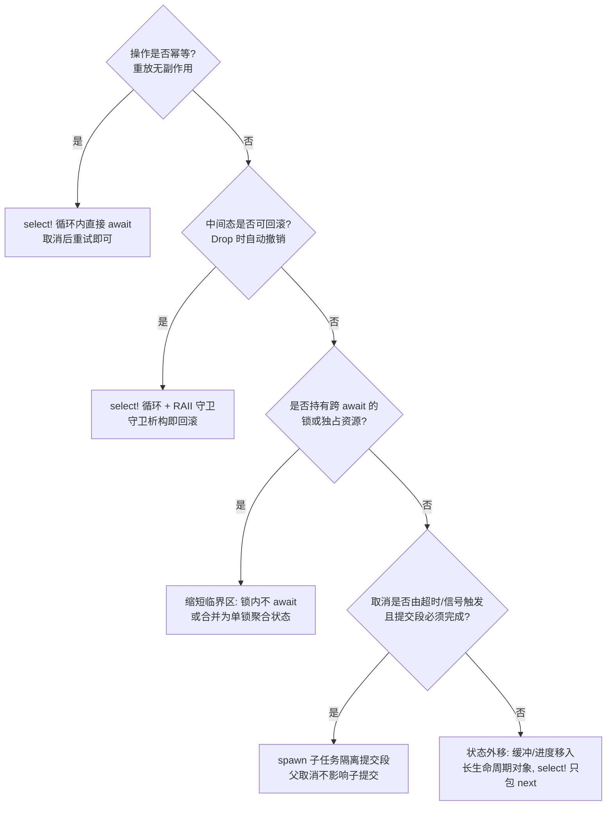

> **内容分级**: [专家级]
> **本节关键术语**: 取消安全 (Cancellation Safety) · 挂起点 (Suspension Point) · 选择宏 (select!) · 结构化并发 (Structured Concurrency) · 异步析构 (Async Drop) — [完整对照表](../../00_meta/01_terminology/01_terminology_glossary.md)

# Async 取消安全（Cancellation Safety）

> **EN**: Async Cancellation Safety
> **Summary**: Dropping a Rust future cancels it at its current await point; an operation is cancellation safe iff aborting at any suspension point never loses data or leaves inconsistent state—this page formalizes that property and maps it onto Tokio's API surface.
>
> **受众**: [进阶-专家]
> **Bloom 层级**: L3
> **权威来源**: 本文件为 `concept/` 权威页。`01_async.md` §8.7、`02_async_advanced.md` 与 `03_async_patterns.md` §2.2/§10.2 中的取消安全讨论均为摘要，以本页为准。
> **A/S/P 标记**: **S** — Structure
> **双维定位**: C×Ana — 从状态机视角分析 Future 析构语义与操作不变量
> **定位**: 系统化分析 Rust 异步（Async）的**取消安全（cancellation safety）**——drop 即取消的语义、形式化定义、Tokio 各 API 的安全性判定、经典陷阱与修正模式。
> **前置概念**: [Async/Await](01_async.md) · [Pin 与 Unpin](08_pin_unpin.md) · [Future 与 Executor 机制](04_future_and_executor_mechanisms.md)
> **后置概念**: [Async Drop（预览）](../../07_future/03_preview_features/22_async_drop_preview.md) · [Ownership 形式化](../../04_formal/01_ownership_logic/02_ownership_formal.md)

---

> **Rust 版本**: 1.97.0+ (Edition 2024) · Tokio 1.x
> **来源**: [Tokio docs — `select!` Cancellation safety](https://docs.rs/tokio/latest/tokio/macro.select.html#cancellation-safety) · [Rust Async Book — Cancellation](https://rust-lang.github.io/async-book/) · [withoutboats — Asynchronous Clean-up](https://without.boats/blog/asynchronous-clean-up/) · [RFC 2394 — async/await](https://rust-lang.github.io/rfcs/2394-async_await.html)
> **对应 Crate**: [`c06_async`](../../crates/c06_async)
> **对应练习**: [`exercises/src/async_programming/`](../../exercises/src/async_programming)

## 📑 目录

- [Async 取消安全（Cancellation Safety）](#async-取消安全cancellation-safety)
  - [📑 目录](#-目录)
  - [一、取消的语义：drop future 意味着什么](#一取消的语义drop-future-意味着什么)
    - [1.1 取消不是"停止执行"，而是"不再 poll"](#11-取消不是停止执行而是不再-poll)
    - [1.2 取消的三个触发源](#12-取消的三个触发源)
    - [1.3 状态机视角：取消点是可枚举的](#13-状态机视角取消点是可枚举的)
    - [1.4 状态机枚举实例](#14-状态机枚举实例)
  - [二、取消安全的形式化定义](#二取消安全的形式化定义)
    - [2.1 操作级定义](#21-操作级定义)
    - [2.2 `tokio::select!` 文档约定的精确含义](#22-tokioselect-文档约定的精确含义)
    - [2.3 `select!` 分支落选的语义细节](#23-select-分支落选的语义细节)
    - [2.4 证明义务的分层](#24-证明义务的分层)
  - [三、经典陷阱与反例修正对照](#三经典陷阱与反例修正对照)
    - [3.1 反例一：`BufReader::read_line` 在 select 循环中丢失数据](#31-反例一bufreaderread_line-在-select-循环中丢失数据)
    - [3.2 反例二：持锁跨 await 被取消，临界区半截](#32-反例二持锁跨-await-被取消临界区半截)
    - [3.3 反例三：事务半截状态（数据库/文件写入）](#33-反例三事务半截状态数据库文件写入)
    - [3.4 反例四（补充）：`oneshot` 接收端在 select 中落选](#34-反例四补充oneshot-接收端在-select-中落选)
    - [3.5 反例五：`select!` 中新建 Future 的反复构造开销与状态重置](#35-反例五select-中新建-future-的反复构造开销与状态重置)
  - [四、选型判定树](#四选型判定树)
  - [五、Tokio 各 API 的取消安全性判定表](#五tokio-各-api-的取消安全性判定表)
    - [5.1 跨运行时的可移植性](#51-跨运行时的可移植性)
  - [六、取消与 drop 顺序、`async_drop` 的边界](#六取消与-drop-顺序async_drop-的边界)
    - [6.1 Drop 顺序在取消路径上的保证](#61-drop-顺序在取消路径上的保证)
    - [6.2 同步 Drop 的天花板](#62-同步-drop-的天花板)
  - [七、工程检查清单](#七工程检查清单)
    - [7.1 反模式速查](#71-反模式速查)
  - [八、相关概念](#八相关概念)
  - [九、来源](#九来源)

---

## 一、取消的语义：drop future 意味着什么

「取消的语义：drop future 意味着什么」部分按取消不是"停止执行"，而是"不再 poll"、取消的三个触发源、状态机视角：取消点是可枚举的与状态机枚举实例的顺序逐层展开。

### 1.1 取消不是"停止执行"，而是"不再 poll"

Rust 的 Future 是**惰性状态机**：`async fn` 被调用时不执行任何代码，只有被 `poll` 才推进。因此"取消一个任务"在 Rust 里没有专门的运行时原语——**取消就是 drop 这个 Future 值**。被 drop 的 Future：

1. 永远不会再被 `poll`；
2. 其状态机内部所有**局部变量按声明的逆序析构**（与普通栈帧相同），持有资源的 `Drop` 实现正常触发；
3. 析构发生在状态机**当前挂起的那个 `.await` 点**——也就是上次 `poll` 返回 `Poll::Pending` 的位置。

```rust
async fn fetch() {
    let conn = open_conn().await;   // 挂起点 A
    let data = conn.read().await;   // 挂起点 B ← 若在此处被取消，conn 被析构，
    save(&data).await               // 挂起点 C    data 被析构，save 永远不会被调用
}
```

若 `fetch()` 返回的 Future 在挂起点 B 被 drop：`conn` 的析构函数关闭连接，`data` 释放缓冲，`save` **从词法上消失**——它不是"被跳过"，而是这段代码路径在该 Future 实例中永远不存在了。

### 1.2 取消的三个触发源

| 触发源 | 机制 | 取消点位置 |
|---|---|---|
| `tokio::select!` / `futures::select!` | 某分支就绪后，其余分支的 Future 被 drop | 落选分支的当前挂起点 |
| 显式 `drop(fut)` / 作用域结束 | Future 值析构 | 当前挂起点 |
| `JoinHandle::abort()` / 任务句柄丢弃 | 运行时在下一次调度点 drop 任务 Future | 任务的当前挂起点（协作式，非抢占） |

关键推论：**取消是协作式（cooperative）的**。Rust 异步没有抢占式 kill；一个永不 `.await` 的 Future 永远不可被取消。这也解释了为什么阻塞调用（blocking call）在 async 中是双重错误——既阻塞线程，又使任务免疫于取消。

### 1.3 状态机视角：取消点是可枚举的

编译器把 `async fn` 变换为枚举状态机，每个 `.await` 对应一个 `Pending` 状态。取消安全分析因此是**有限枚举**问题：对状态机的每个 `Pending` 状态 `Sᵢ`，问"若在 `Sᵢ` 处析构，操作的不变量是否仍成立"。`.await` 之间的同步代码段**不是**取消点——Future 一旦开始一次 `poll`，要么跑到下一个 `Pending`，要么跑完。

### 1.4 状态机枚举实例

把 §1.1 的 `fetch` 概念脱糖后，状态机大致是：

```rust
enum FetchFut {
    Start,                                  // s0：尚未 poll
    AwaitingConn { },                       // s1：挂起点 A，无活跃局部变量
    AwaitingRead { conn: Conn },            // s2：挂起点 B，conn 活跃
    AwaitingSave { conn: Conn, data: Data },// s3：挂起点 C，conn 与 data 活跃
    Done,
}
```

取消安全分析即逐个状态提问：

- **s1 处 drop**：无任何资源活跃，等价于操作从未开始——安全；
- **s2 处 drop**：`conn` 析构（关闭连接）。若 `Conn` 的 Drop 只做本地清理，外部状态干净——安全；若连接关闭对服务端意味着“会话中止”，则服务端可能观察到中间态——是否安全取决于协议；
- **s3 处 drop**：`data` 已完整读出但 `save` 未执行——典型的“数据已消费、效果未提交”窗口，是本页 §3 所有陷阱的共同结构。

这个枚举视角同时给出**测试策略**：对每个挂起状态构造一次取消注入（例如用 `tokio::time::pause()` 或手写的 poll 驱动器逐状态推进后 drop），断言外部不变量——这比随机压测更系统地覆盖取消面。

---

## 二、取消安全的形式化定义

「取消安全的形式化定义」涉及操作级定义、`tokio::select!` 文档约定的精确含义、`select!` 分支落选的语义细节与证明义务的分层，本节逐一说明其要点。

### 2.1 操作级定义

设异步操作 `op` 的状态机为 `(S, →, s₀)`，其中 `P ⊆ S` 为挂起状态集。定义：

> **取消安全（cancellation safe）**：对任意挂起状态 `p ∈ P`，在 `p` 处析构 Future 后，(a) 操作外部的可观察状态与"操作从未开始"或"操作已完整提交"之一一致（无半截状态）；(b) 已消费/已产出的数据不会丢失或重复交付；(c) 再次发起同一操作是良定义的。

> **取消不安全**：存在某个挂起状态 `p`，在 `p` 处取消会导致数据丢失、状态不一致、或后续操作观察到中间态。

### 2.2 `tokio::select!` 文档约定的精确含义

Tokio 文档对每个可在 `select!` 中使用的异步方法标注 "cancel safe" 与否，其约定比 §2.1 更操作化：

> 方法 `m` 是 cancel safe 的，当且仅当：**把它作为 `select!` 的一个分支反复调用（每轮循环新建 Future），落选后被 drop，然后在下一轮循环重新调用，等价于一次连续的调用**——不丢失已读取的数据、不丢失队列中的消息、不产生重复副作用。

注意两个层次的区别：

- **方法级 cancel safe**（Tokio 约定）：`m` 可安全地作为 `select!` 分支重入使用。例如 `mpsc::Receiver::recv`：落选的 `recv` 没有从队列取出任何消息——消息要么已被交付给就绪的 `recv`，要么仍在队列里。
- **操作级 cancel safe**（§2.1）：整个业务操作（可能跨多个 `.await`）在任意点取消后系统仍一致。`recv` 是 cancel safe 的，不代表"收消息→扣库存→写日志"这个组合是 cancel safe 的。

### 2.3 `select!` 分支落选的语义细节

```rust
tokio::select! {
    biased;                    // 按声明顺序轮询（否则随机）
    msg = rx.recv() => { /* 分支1 */ }
    _ = tokio::signal::ctrl_c() => { /* 分支2：recv 的 Future 在此被 drop */ }
}
```

`select!` 的求值顺序：(1) 所有分支表达式求值，构造全部 Future；(2) 依次 `poll`（默认随机起点，`biased` 时按声明序）；(3) 第一个返回 `Ready` 的分支执行其处理块；(4) **其余分支的 Future 被 drop**。分支处理块（handler）内部若还有 `.await`，那些 await 点同样是取消点——但属于外层任务的取消点，而非本 select 的。

`biased` 与公平性的交互：高优先级分支永远先 poll，若它持续就绪，低优先级分支会被饿死（starvation）——这不是取消安全问题，但常与取消逻辑纠缠在一起，调试时需区分。

### 2.4 证明义务的分层

实操中“证明”一个操作取消安全，按由易到难有三层：

1. **查文档**：Tokio/库文档已标注的方法级 cancel safe，直接采信（文档承诺即契约，违背是库的 bug）；
2. **数据归属分析**：追踪“已读取/已接收但尚未交付”的数据在取消瞬间位于何处——Future 局部态（不安全）还是长生命周期对象（安全）。§五的判定口诀即此层的操作化；
3. **不变量枚举**：对业务级操作，按 §1.4 枚举全部挂起状态，逐个验证业务不变量（如“余额守恒”“消息恰好一次”）。只有这层能覆盖跨多个 await 的组合操作。

---

## 三、经典陷阱与反例修正对照

理解「经典陷阱与反例修正对照」需要把握反例一：`BufReader::read_line` 在 select…、反例二：持锁跨 await 被取消，临界区半截、反例三：事务半截状态（数据库/文件写入）、反例四（补充）：`oneshot` 接收端在 select 中落选等5个方面，本节依次展开。

### 3.1 反例一：`BufReader::read_line` 在 select 循环中丢失数据

`AsyncBufReadExt::read_line` **不是** cancel safe 的：它可能已从底层读取了若干字节存入内部缓冲，但尚未遇到换行符；此时 Future 被 drop，缓冲中的部分行数据随 Future 一起消失，**底层流的位置却已前进**——数据永久丢失。

```rust
// ❌ 反例：半行数据丢失
use tokio::io::{AsyncBufReadExt, BufReader};

async fn bad_lines(stream: tokio::net::TcpStream, mut shutdown: tokio::sync::watch::Receiver<bool>) {
    let mut reader = BufReader::new(stream);
    let mut line = String::new();
    loop {
        line.clear();
        tokio::select! {
            n = reader.read_line(&mut line) => {
                if n.unwrap_or(0) == 0 { break; }
                // 处理 line...
            }
            _ = shutdown.changed() => break,
            // ⚠️ 若 read_line 已读到 "HEL" 未遇换行即被 drop，
            //    "HEL" 从流中消失，下一次连接状态错乱
        }
    }
}
```

```rust
// ✅ 修正一：把 select 移出“逐行”粒度——取消只发生在帧边界
async fn ok_lines(stream: tokio::net::TcpStream, mut shutdown: tokio::sync::watch::Receiver<bool>) {
    let mut reader = BufReader::new(stream);
    let mut line = String::new();
    loop {
        if *shutdown.borrow() { break; }   // 在帧边界检查取消标志
        line.clear();
        let n = reader.read_line(&mut line).await.unwrap_or(0);
        if n == 0 { break; }
        // 处理 line...
    }
}

// ✅ 修正二：用 tokio_util::codec 的 Framed + LinesCodec，
//    StreamExt::next() 是 cancel safe 的（缓冲属于 Framed 而非 Future）
```

修正二的关键：`Framed` 把缓冲从"Future 的局部状态"提升为"长生命周期对象的字段"。取消 drop 掉的只是一次 `next()` 调用，缓冲存活——这是把取消不安全操作改造为安全的通用手法：**状态外移**。

### 3.2 反例二：持锁跨 await 被取消，临界区半截

```rust
// ❌ 反例：锁保护的状态只更新了一半
use tokio::sync::Mutex;

struct Account { balance: i64 }

async fn bad_transfer(a: &Mutex<Account>, b: &Mutex<Account>, amt: i64) {
    let mut a = a.lock().await;
    a.balance -= amt;                 // 扣款完成
    notify_audit(amt).await;          // 挂起点 ← 在此取消：a 被释放（MutexGuard 析构解锁），
    let mut b = b.lock().await;       //   但 b 的入账从未发生 → 钱凭空消失
    b.balance += amt;
}
```

注意 `tokio::sync::Mutex::lock` **本身是 cancel safe 的**（等待者被 drop 会从等待队列移除，不会吞掉锁）——不安全的是**业务不变量跨越了 await**。锁的析构保证了无死锁，却无法保证业务原子性。

```rust
// ✅ 修正一：缩短临界区——锁内不 await，先做可回滚的本地计算
async fn ok_transfer(a: &Mutex<Account>, b: &Mutex<Account>, amt: i64) {
    {
        let mut a = a.lock().await;
        if a.balance < amt { return; }
        a.balance -= amt;
    } // 锁立即释放
    {
        let mut b = b.lock().await;
        b.balance += amt;             // 入账与审计解耦
    }
    notify_audit(amt).await;          // 审计失败/取消只影响日志，不影响余额
}

// ✅ 修正二：真正需要原子性时，用单锁保护聚合状态，或用 spawn 把
//    不可取消的提交段隔离为独立任务（见 §四）
```

### 3.3 反例三：事务半截状态（数据库/文件写入）

```rust
// ❌ 反例：多步写入在任意 await 点取消都会留下垃圾
async fn bad_import(db: &Pool, rows: Vec<Row>) -> Result<()> {
    let mut tx = db.begin().await?;
    for row in rows {
        tx.execute(insert(row)).await?;   // 挂起点 ← 取消即留下半截事务
    }
    tx.commit().await                     // 可能永远执行不到
}
```

多数数据库驱动的事务对象在析构时会**回滚**（rollback-on-drop），此例侥幸安全；但文件系统、消息队列、外部 API 没有这种保证。

```rust
// ✅ 修正：两阶段——可取消的暂存 + 不可取消的提交
async fn ok_import(db: &Pool, rows: Vec<Row>) -> Result<()> {
    // 阶段1：暂存（幂等写入临时表，取消后重跑无害）
    let batch_id = stage_rows(db, rows).await?;
    // 阶段2：提交隔离进子任务——父任务被取消时，提交仍会跑完
    let submit = tokio::spawn(submit_batch(db.clone(), batch_id));
    submit.await??;
    Ok(())
}
```

### 3.4 反例四（补充）：`oneshot` 接收端在 select 中落选

`oneshot::Receiver` 的 `recv` 本身是 cancel safe 的，但 **sender 的 `send` 失败语义**与取消组合时会吞掉值：若接收方在 select 中落选后被 drop，sender 侧 `send` 返回 `Err(T)` 把值交还——若 sender 忽略这个返回值，值丢失。修正：sender 必须处理 `Err`，或改用 `mpsc`（容量 1）并在协议层处理背压。

### 3.5 反例五：`select!` 中新建 Future 的反复构造开销与状态重置

一个更隐蔽的问题：把**带内部进度的操作**直接写进 `select!` 分支表达式，每轮循环都会构造全新 Future，进度归零。

```rust
// ❌ 反例：download 内部有断点续传进度，每次落选都从头开始
loop {
    tokio::select! {
        r = download(&url) => { handle(r); break; }
        _ = tick.tick() => { log::info!("waiting..."); }
        // ⚠️ 每个 tick 都 drop 旧 download、下一轮全新构造，
        //    已下载数据全部作废，极端情况下永远完不成
    }
}
```

```rust
// ✅ 修正：把 Future 提升出循环，pin 住后复用
let mut dl = std::pin::pin!(download(&url));
loop {
    tokio::select! {
        r = &mut dl => { handle(r); break; }
        _ = tick.tick() => { log::info!("waiting..."); }
        // dl 的状态机跨 select 轮次存活，进度保留
    }
}
```

这与 §3.1 的“状态外移”是同一原则的两个形态：要么把状态移进长生命周期对象（`Framed`），要么把 Future 本身提升为长生命周期值（`pin!` + `&mut` 轮询）。`Pin<&mut F>` 允许同一个 Future 被反复 poll，正是为此设计（参见 [Pin 与 Unpin](08_pin_unpin.md)）。

---

## 四、选型判定树



各策略的适用边界：

- **`select!` 循环（D1/D2）**：默认选择，前提是每个分支方法 cancel safe，且业务不变量不跨越循环内部的 await 序列；
- **spawn 子任务（D4）**：把"一旦开始就必须完成"的提交段切出去；代价是父子间需要结果回传通道，且子任务生命周期脱离父作用域——结构化并发（structured concurrency）的局部破例，需文档注明；
- **状态外移（D5）**：流式场景的通用解，把 Future 局部态转移到 `Framed`/缓冲队列/进度表；
- **结构化并发**：在 `JoinSet`/`scope` 语义下，父任务取消传播到全部子任务，取消面收敛为单点——适合"一组任务同生共死"的批量场景。

---

## 五、Tokio 各 API 的取消安全性判定表

下表按 Tokio 1.x 文档的 "cancel safe" 约定整理（"安全" = 可作为 `select!` 分支反复重入而不丢数据）：

| API | Cancel safe | 说明 |
|---|---|---|
| `TcpStream::read` / `read_buf` | ✅ 安全 | 未就绪时不消费数据；就绪返回的字节已交给调用者 |
| `TcpStream::write` / `write_all` | ✅ 安全 | `write_all` 内部推进游标，重入时续写——但**整体消息**可能半发，协议层需界定帧 |
| `TcpStream::peek` | ✅ 安全 | 不消费数据 |
| `BufReader::read_line` / `read_until` | ❌ **不安全** | 部分数据被读入 Future 局部缓冲，drop 即丢失（见 §3.1） |
| `AsyncReadExt::read_exact` | ❌ **不安全** | 已读部分字节丢弃后不可恢复 |
| `mpsc::Receiver::recv` | ✅ 安全 | 消息未取出前不离开队列 |
| `mpsc::Sender::send` | ✅ 安全（容量等待可取消） | 等待容量时被取消，值随 Future 返还调用者 |
| `broadcast::Receiver::recv` | ✅ 安全 | 游标语义，取消不影响后续接收 |
| `oneshot::Receiver::recv` | ⚠️ 接收安全 | 但 sender 需处理 `send` 的 `Err(T)` 回值（见 §3.4） |
| `watch::Receiver::changed` | ✅ 安全 | 只标记"已见版本"，无数据丢失 |
| `Mutex::lock` | ✅ 安全 | 取消即离开等待队列，不吞锁；不安全来自锁内业务（见 §3.2） |
| `Semaphore::acquire` | ✅ 安全 | 取消即放弃排队 |
| `JoinHandle`（`&mut` await） | ✅ 安全 | 取消等待≠取消任务；`abort()` 才取消任务 |
| `JoinSet::join_next` | ✅ 安全 | 已完成任务的结果不被丢弃 |
| `time::timeout` | ⚠️ 条件安全 | 等价于包一层 select；安全性取决于被包操作本身 |
| `select!` 中的 `stream.next()`（`futures::StreamExt`） | 视流而定 | 底层 `poll_next` 大多安全；带内部 Future 态的组合子（`then`、`buffered`）需逐个核对 |
| `fs::File::read` / `write`（tokio） | ✅ 安全 | 与 TcpStream 同理；但文件“半写”后落盘数据不会回滚，文件级操作按 §3.3 处理 |
| `process::Child::wait` | ✅ 安全 | 取消等待不等于杀死子进程；杀进程需显式 `kill().await` |
| `sync::Notify::notified` | ⚠️ 边缘 | 1.x 后语义为“许可不丢失”，但跨版本文档表述有变化，关键路径上建议实测确认 |

> **判定口诀**：**"数据在哪，安全就在哪"**——未交付的数据若存在 Future 局部变量里，drop 即丢；若存在通道/缓冲/驱动层，取消无害。

### 5.1 跨运行时的可移植性

上表针对 Tokio 1.x。`async-std`、`smol` 及 `futures` 组合子的取消安全性各自为政：

- `async-std` 的通道与锁大多遵循与 Tokio 相同的约定，但文档标注不如 Tokio 系统，关键路径需阅读源码或实测确认；
- `futures::lock::Mutex` 的 `lock` 同样 cancel safe，但 `futures::stream` 的组合子（`then`、`flatten`、`buffer_unordered`）各自持有不同粒度的内部 Future，安全性必须按组合子逐个核对，不能从底层流的安全性直接传递；
- 自研运行时的 `select!` 等价物若采用“全部分支 Future 提前构造”的语义，取消行为与 Tokio 一致；若采用轮询式调度（如某些嵌入式 executor），需额外确认落选分支是否被 drop 而非简单跳过 poll。

结论：取消安全性是**运行时与库的文档契约**，不是语言保证。跨运行时迁移代码时，本表必须按目标运行时重新核对。

---

## 六、取消与 drop 顺序、`async_drop` 的边界

本节围绕「取消与 drop 顺序、`async_drop` 的边界」展开，覆盖 Drop 顺序在取消路径上的保证 与 同步 Drop 的天花板 两个方面。

### 6.1 Drop 顺序在取消路径上的保证

Future 被 drop 时，其状态机内活跃局部变量按**声明逆序**析构，与同步代码一致。由此可得一条可依赖的工程规则：把"必须先释放"的资源**后声明**，或用显式 `drop(guard)` 排序。但注意：跨 await 存活的变量都存在状态机字段里，析构顺序按状态机布局而非源码直觉——复杂场景应依赖 RAII 守卫的嵌套作用域，而非声明顺序的记忆。

### 6.2 同步 Drop 的天花板

有些清理**本身是异步的**：关闭 QUIC 连接要发 `CONNECTION_CLOSE`、flush 缓冲要等内核、释放分布式锁要一次 RPC。同步 `Drop` 无法 `.await`，于是取消路径上的清理只有三条出路：

1. **尽力而为的同步清理**（如 `drop` 时 `spawn` 一个清理任务）——清理任务本身可能再被取消，需标记为不可中断段；
2. **显式异步关闭协议**：`shutdown().await` 先于 drop 调用，Drop 仅做兜底；
3. **`async_drop`（预览特性）**：让 `Drop` 本身异步化。详见 [Async Drop：异步资源的优雅销毁](../../07_future/03_preview_features/22_async_drop_preview.md)。

边界判定：若资源的"释放"只是内存回收/文件描述符关闭，同步 Drop 足够，不要引入 async drop 复杂度；若释放涉及网络往返或跨任务协调，显式 `shutdown().await` 是当前（1.97 stable）唯一可移植的方案。

---

## 七、工程检查清单

对每一个会出现在 `select!` 分支、超时包装、或可能被 abort 的任务中的异步操作，依次问：

1. 这个方法在 Tokio/库文档中标注 cancel safe 吗？（查不到默认按不安全处理）
2. 业务不变量是否跨越了两个以上 `.await`？（跨了就需要回滚策略或状态外移）
3. 取消后重放该操作，结果是否等价？（等价 → 幂等，最省心）
4. 持锁区间内有没有 `.await`？（有 → 缩短临界区）
5. Drop 守卫的析构顺序是否就是资源依赖顺序的逆序？
6. 提交段（一旦开始必须完成）是否已隔离进 spawn 子任务或标记为不可取消？
7. `select!` 分支表达式里新建的 Future 是否携带进度状态？（是 → `pin!` 提升复用，见 §3.5）
8. 测试是否覆盖了每个挂起状态的取消注入，而不仅是“跑到一半随机 abort”？（按 §1.4 枚举（Enum））

### 7.1 反模式速查

| 反模式 | 后果 | 对应修正 |
|---|---|---|
| `select!` 循环里裸 `read_line`/`read_exact` | 部分数据丢失 | §3.1：状态外移 / 帧边界取消 |
| 锁内 `.await` 后修改第二个对象 | 业务原子性破坏 | §3.2：缩短临界区 |
| 多步外部写入无事务保护 | 半截状态 | §3.3：两阶段提交 + spawn 隔离 |
| `oneshot` sender 忽略 `Err(T)` | 值静默丢失 | §3.4：处理回值或换 mpsc |
| `select!` 分支内新建带进度的 Future | 进度反复重置、活锁 | §3.5：`pin!` 提升 |

---

## 八、相关概念

- [Memory Management](../../02_intermediate/02_memory_management/01_memory_management.md) — RAII 与 Drop 语义是取消路径上资源清理的基础
- [Error Handling](../../02_intermediate/03_error_handling/01_error_handling.md) — 取消与回滚本质上是错误传播路径的设计

---

## 九、来源

- [Tokio docs — `tokio::select!`：Cancellation safety 章节](https://docs.rs/tokio/latest/tokio/macro.select.html#cancellation-safety)（方法级 cancel safe 约定的权威表述，以及各 API 文档中的 cancel-safety 标注）
- [Rust Async Book — Cancellation / `FuturesUnordered`](https://rust-lang.github.io/async-book/)（取消语义与组合子行为）
- [withoutboats — Asynchronous Clean-up](https://without.boats/blog/asynchronous-clean-up/) 及其异步系列博文（取消、清理与 async drop 的设计动机）
- [RFC 2394 — async/await](https://rust-lang.github.io/rfcs/2394-async_await.html)（Future 惰性状态机与 drop 语义基础）
- [Lagaillardie, Neykova & Yoshida: Stay Safe Under Panic — Affine Rust Programming with Multiparty Session Types（ECOOP 2022 全文, arXiv:2204.13464）](https://arxiv.org/abs/2204.13464)（P1 学术：Rust 取消/恐慌安全的会话类型形式化，2026-07-12 验证 HTTP 200）
- 站内交叉引用：[Async/Await §8.7](01_async.md) · [Async 高级主题](02_async_advanced.md) · [Async 模式 §2.2/§10.2](03_async_patterns.md) · [Async Drop（预览）](../../07_future/03_preview_features/22_async_drop_preview.md) · [Pin 与 Unpin](08_pin_unpin.md)
