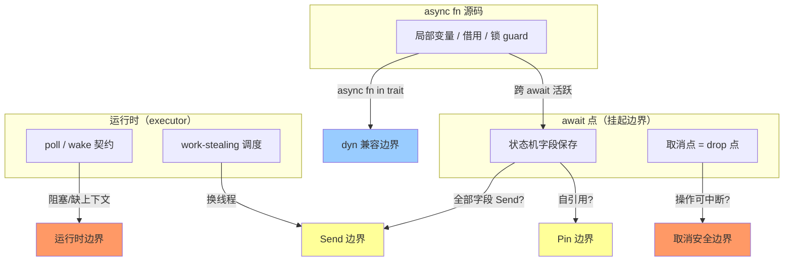
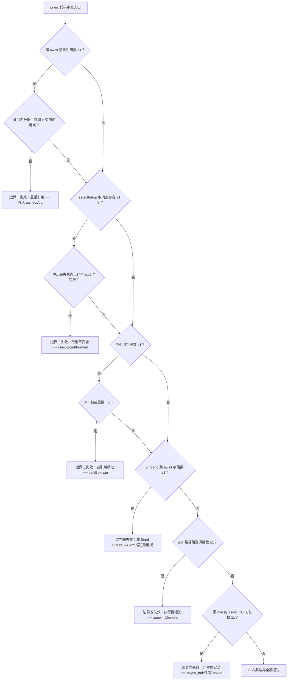
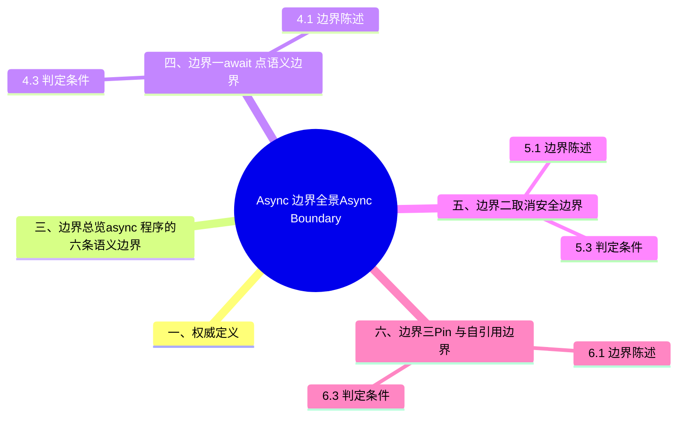

# Async 边界全景（Async Boundary Panorama）

> **内容分级**: [专家级]
> **定理链**: N/A — 边界全景/导航性文档，形式化推导见各权威页
> **EN**: Async Boundary Panorama
> **Summary**: A panorama of the semantic boundaries of Rust async programming: await-point state boundaries, cancellation safety, Pin/self-reference, Send-across-await, executor/runtime contracts, and async trait object-safety — each with boundary statements, counterexamples, and quantitative decision conditions.
> **Rust 版本**: 1.97.0+ (Edition 2024) · Tokio 1.x
> **受众**: [进阶]
> **Bloom 层级**: L3-L4
> **权威来源**: 本文件为 `concept/` 权威页（async 边界全景视角）。
> **定位**: 汇总 Rust 异步编程全部**语义边界**——await 点两侧什么成立/什么不成立、取消何时安全、自引用（Reference）何时合法、Future 何时可跨线程、运行时（Runtime）契约何时被打破、async trait 何时可对象化。每一节给出**边界陈述 → 反例 → 判定条件**三段式。
> **分工声明**:
> async 概念推导（状态机变换、Future trait、语法糖展开）留在 [Async/Await](01_async.md)；
> 取消安全的系统化形式化留在 [Async 取消安全](05_async_cancellation_safety.md)；
> Pin 机制推导留在 [Pin 与 Unpin](08_pin_unpin.md)。本页只做**边界视角的全景汇总**，不重复概念推导（AGENTS.md §2 Canonical 规则）。
> **方法论对齐**: 反事实推理 · 边界测试 (Torchiano et al. 2018) · 判定树机器可读化（见 [decision_trees.yaml](../../00_meta/knowledge_topology/decision_trees.yaml) `DF-ASYNC-07`）
> **全局对应**: 本页是 [安全边界全景](../../05_comparative/03_domain_comparisons/01_safety_boundaries.md) 在 async 域的纵深展开；unsafe 域的对应页为 [Unsafe 边界全景](../02_unsafe/02_unsafe_boundary_panorama.md)。
>
> **来源**:
> [Rust Async Book](https://rust-lang.github.io/async-book/) ·
> [Tokio docs](https://docs.rs/tokio/latest/tokio/) ·
> [Rust Reference — Async blocks](https://doc.rust-lang.org/reference/introduction.html) ·
> [RFC 2394 — async/await](https://rust-lang.github.io/rfcs/2394-async_await.html)

**变更日志**:

- v1.0 (2026-07-12): 初始版本 — 六类 async 语义边界全景（await 点/取消/Pin/Send/executor/async trait），三段式（边界陈述·反例·判定条件）+ 判定总图 + 失效模式总表
- v1.1 (2026-07-12): §9 边界陈述中的解决方案谱系升格至 [Async Trait 对象安全](13_async_trait_object_safety.md)（canonical 迁移：本节保留边界三段式，谱系/选型矩阵改为链接）；§12 交叉引用表补 12/13 两页

---

> **前置概念**: [Async/Await](01_async.md) · [Pin 与 Unpin](08_pin_unpin.md) · [Future 与 Executor 机制](04_future_and_executor_mechanisms.md)
> **后置概念**: [Async 取消安全](05_async_cancellation_safety.md) · [Async Drop（预览）](../../07_future/02_preview_features/22_async_drop_preview.md) · [Unsafe 边界全景](../02_unsafe/02_unsafe_boundary_panorama.md)

## 📑 目录

- [Async 边界全景（Async Boundary Panorama）](#async-边界全景async-boundary-panorama)
  - [📑 目录](#-目录)
  - [一、权威定义](#一权威定义)
  - [二、认知路径](#二认知路径)
  - [三、边界总览：async 程序的六条语义边界](#三边界总览async-程序的六条语义边界)
  - [四、边界一：await 点语义边界](#四边界一await-点语义边界)
    - [4.1 边界陈述](#41-边界陈述)
    - [4.2 反例](#42-反例)
    - [4.3 判定条件](#43-判定条件)
  - [五、边界二：取消安全边界](#五边界二取消安全边界)
    - [5.1 边界陈述](#51-边界陈述)
    - [5.2 反例](#52-反例)
    - [5.3 判定条件](#53-判定条件)
  - [六、边界三：Pin 与自引用边界](#六边界三pin-与自引用边界)
    - [6.1 边界陈述](#61-边界陈述)
    - [6.2 反例](#62-反例)
    - [6.3 判定条件](#63-判定条件)
  - [七、边界四：Send 跨 await 边界](#七边界四send-跨-await-边界)
    - [7.1 边界陈述](#71-边界陈述)
    - [7.2 反例](#72-反例)
    - [7.3 判定条件](#73-判定条件)
  - [八、边界五：Executor 与运行时边界](#八边界五executor-与运行时边界)
    - [8.1 边界陈述](#81-边界陈述)
    - [8.2 反例](#82-反例)
    - [8.3 判定条件](#83-判定条件)
  - [九、边界六：async trait 与 dyn 兼容边界](#九边界六async-trait-与-dyn-兼容边界)
    - [9.1 边界陈述](#91-边界陈述)
    - [9.2 反例](#92-反例)
    - [9.3 判定条件](#93-判定条件)
  - [十、失效模式总表](#十失效模式总表)
  - [十一、边界判定总图](#十一边界判定总图)
  - [十二、与相关文件的分工与交叉引用](#十二与相关文件的分工与交叉引用)
  - [十三、演进方向](#十三演进方向)
  - [权威来源索引](#权威来源索引)
  - [🧭 思维导图（Mindmap）](#-思维导图mindmap)

---

## 一、权威定义

> **[Rust Async Book — async/await](https://rust-lang.github.io/async-book/)**: `async` transforms a block of code into a state machine that implements the `Future` trait; each `.await` is a point where control may be yielded back to the executor.
> **来源**: <https://rust-lang.github.io/async-book/>
> **[Tokio docs — Cancellation safety](https://docs.rs/tokio/latest/tokio/macro.select.html#cancellation-safety)**: To determine whether your own methods are cancellation safe, look for `.await` and consider what state is lost if the future is dropped at that point.
> **来源**: <https://docs.rs/tokio/latest/tokio/macro.select.html#cancellation-safety>
> **[Wikipedia: Coroutine](https://en.wikipedia.org/wiki/Coroutine)**: Coroutines are computer program components that allow execution to be suspended and resumed, generalizing subroutines for cooperative multitasking.
> **来源**: <https://en.wikipedia.org/wiki/Coroutine>
> **[Wikipedia: Reentrancy (computing)](https://en.wikipedia.org/wiki/Reentrancy_(computing))**: A routine is reentrant if it can be interrupted in the middle of its execution and then safely be called again before its previous invocations complete.
> **来源**: <https://en.wikipedia.org/wiki/Reentrancy_(computing)>
> **边界全景的定义**: 一条**语义边界**是这样一个程序点集合：点的一侧某不变式由编译器保证，另一侧该不变式的责任转移到程序员（或运行时）。async 的复杂性几乎全部来自这些边界两侧责任的交接。

---

## 二、认知路径

> **学习递进**: 从"await 是什么"出发，逐层建立边界意识。

**第 1 步：await 点把函数切成几段？**

每个 `.await` 是一个挂起点（suspension point）；编译器把 async fn 切成状态机，每段是状态机的一个状态。

**第 2 步：挂起时什么被保存、什么被丢弃？**

跨 await 活跃的局部变量进状态机字段；不活跃的则被丢弃。这一步决定后续所有边界。

**第 3 步：Future 被 drop 会发生什么？**

取消不是"停止执行"，而是"不再 poll"——这是取消安全问题的根源。

**第 4 步：状态机为什么不能移动？**

自引用字段使状态机地址敏感，Pin 把"不可移动"提升为类型级契约。

**第 5 步：Future 何时能换线程？**

当且仅当所有跨 await 状态都是 Send——这是 work-stealing 运行时的准入边界。

**第 6 步：谁 poll 这个 Future？**

executor 与 Future 之间存在隐性契约（唤醒、非阻塞、运行时上下文），违反即 panic 或死锁。

---

## 三、边界总览：async 程序的六条语义边界



> **认知功能**: 六条边界共用同一个根源——**状态机化**。理解"局部变量在 await 点如何变成字段"，其余五条边界都是这一变换的推论。[💡 原创分析](../../00_meta/00_framework/methodology.md)

---

## 四、边界一：await 点语义边界

`.await` 不是普通运算符，它定义了任务的**让出点（yield point）**——理解其语义边界是预测异步（Async）行为的前提：

- **让出 ≠ 切换线程**：`.await` 把控制交还执行器，任务可能立即在同一线程被重新 poll（如果 Future 已 Ready）——「await 一定会挂起」是错误直觉；
- **await 点是取消点**：Future 只可能在 await 处被安全 drop——两个 await 之间的代码是不可分割的（对取消而言）；
- **await 点划分状态机阶段**：跨 await 存活的局部变量进入状态机字段，决定 `Future` 的 `Send`/`!Send` 与大小——「缩小跨 await 变量的作用域」是减小 Future、恢复 `Send` 的标准手法；
- **嵌套 await 的轮询深度**：深层 `.await` 链展开为深层 `poll` 调用栈——`Pending` 时整条链逐层返回，这是 async 栈溢出来源之一（`Box::pin` 切断）。

判定准则：审查 async 函数时先标出所有 await 点——它们是唯一的调度、取消与 `Send` 判定位置。

### 4.1 边界陈述

`.await` 是 async 代码中**唯一**可能让出执行权的点。边界两侧的不对称性：

- **边界前（同步段）**: 局部变量以栈帧形式存在，借用（Borrowing）规则与普通函数完全相同。
- **边界后（挂起后恢复）**: 只有"跨 await 活跃"的变量被保存进状态机字段；其余变量**已经不存在**。
- **推论 1**: 跨 await 持有引用 ⟹ 状态机字段含引用 ⟹ 该引用指向的数据必须比 Future 活得久。
- **推论 2**: 跨 await 持有 `&mut`、锁 guard、`RefCell` borrow guard ⟹ 它们成为状态机字段，参与 Send 判定与取消判定。

### 4.2 反例

```rust,ignore
async fn bad() {
    let data = vec![1, 2, 3];
    let r = &data[0];
    drop(data);              // ❌ data 在 await 前被释放
    some_io().await;         // r 跨 await 活跃，但已悬垂
    println!("{r}");
}
```

```rust,ignore
async fn also_bad(map: &HashMap<i32, i32>) {
    let v = &map[&1];        // 借用入参
    some_io().await;         // 状态机字段含 &'a i32
    println!("{v}");         // 合法 ⟺ Future<'a> 本身不逃逸 'a
}
```

### 4.3 判定条件

| # | 判定问题 | 定量阈值 | 判定结果 |
|:---:|:---|:---|:---|
| Q-A1 | 跨 await 点保持活跃的引用数是否 ≥1 个？ | ≥1 ⟹ 进入生命周期（Lifetimes）子判定 | 编译期阻止悬垂 |
| Q-A2 | 被引用数据的生存期结束行是否 < 引用最后使用行？ | < ⟹ `does not live long enough` | 编译期阻止 |
| Q-A3 | 跨 await 持有的 guard 类型数（MutexGuard/Ref/RefMut）是否 ≥1 个？ | ≥1 ⟹ 叠加 Send 与取消安全判定 | 见 §七/§五 |

> **修复策略**: 缩短借用使其不跨 await；将 owned 数据移入 Future（`move` 闭包（Closures）/`Arc`）；或用作用域块 `{ ... }` 显式截断借用区间。

---

## 五、边界二：取消安全边界

> 系统化形式化（drop 即取消、操作不变量分类、Tokio API 安全性判定）见权威页 [Async 取消安全](05_async_cancellation_safety.md)；本节只做边界全景定位。

### 5.1 边界陈述

Rust 的取消是**被动**的：executor 不再 poll 一个 Future，Future 在其**当前挂起点**被 drop。边界陈述：

- **边界一侧（取消安全）**: 在任意挂起点中止，不丢数据、不留不一致状态——`select!` 的默认安全分支、纯计算、可重试的读。
- **边界另一侧（取消不安全）**: 挂起点两侧存在"已部分提交"的状态——`tokio::io::AsyncReadExt::read` 读到一半的数据、`Framed` 解码到一半的帧、自维护的游标。
- **关键不对称**: 编译器**不检查**取消安全；这是纯运行时语义边界，判定责任在程序员。

### 5.2 反例

```rust
# macro_rules! select { ($($t:tt)*) => {} }
loop {
    select! {
        line = reader.next_line() => {   // ❌ 取消不安全：
            buf.push(line);              // 读到一半的 line 随 Future drop 丢失
        }
        _ = shutdown() => break,
    }
}
```

### 5.3 判定条件

| # | 判定问题 | 定量阈值 | 判定结果 |
|:---:|:---|:---|:---|
| Q-C1 | 操作在挂起点中止后丢失的已读字节数是否 ≥1 字节？ | ≥1 ⟹ 取消不安全 | 运行时丢数据 |
| Q-C2 | `select!` 分支中被取消后不可重放的状态变更数是否 ≥1 个？ | ≥1 ⟹ 该分支需重构 | 逻辑不一致 |
| Q-C3 | 不变量恢复点（checkpoint）间距的 await 点数是否 = 0？ | =0 ⟹ 全程可安全取消 | ✅ 取消安全 |

> **修复策略**: 用 `Framed`/缓冲读取保证消息原子性；把状态推进到 await 之后；或引入显式 checkpoint（见 [37](05_async_cancellation_safety.md) 的修正模式目录）。

---

## 六、边界三：Pin 与自引用边界

`Pin` 的存在只为解决一个问题：async 状态机可能**自引用**——跨 await 的局部变量被后续阶段的引用指向（如 `let x = 1; let r = &x; foo().await; use(r);` 中 `r` 与 `x` 同住状态机）。移动状态机将使 `r` 悬垂。

边界规则三条：

1. **`Pin<&mut T>` 的契约**：被 Pin 的值不再被 move——`poll` 取 `Pin<&mut Self>` 即此契约的类型编码；
2. **`Unpin` 逃生舱**：不含自引用的类型自动实现 `Unpin`（绝大多数类型），可自由移动——`Box::pin` 后 `Unpin` 与否无差别；
3. **投影（projection）难题**：`Pin<&mut Struct>` 不能安全地给出字段的 `&mut`——`pin-project` crate 的 `#[pin]` 标记区分「结构化字段」（需 `Pin<&mut Field>`）与「非结构化字段」（可直接 `&mut`），手写投影是 `unsafe` 且极易出错。

判定准则：应用层代码永远不应手写 `unsafe` pin 投影——`Box::pin` + `pin-project` 覆盖全部合法需求。

### 6.1 边界陈述

async fn 状态机可能**自引用**（字段 A 是指向字段 B 的引用）。一旦移动，内部引用全部悬垂。边界：

- **边界一侧（Unpin）**: 状态机无自引用（所有跨 await 字段都是 owned 或外部引用），移动永远安全，`Pin<&mut T>` 可自由 `get_mut`。
- **边界另一侧（!Unpin）**: 编译器生成的含自引用状态机，移动即 UB——必须经 `Pin` 固定后才允许 poll。
- **契约交接点**: `unsafe impl Unpin` 或 `Pin::map_unchecked`/`get_unchecked_mut` 是程序员从编译器手中接过"不自引用"证明责任的点。

### 6.2 反例

```rust
struct SelfRef { data: String, ptr: *const u8 }

let mut s = SelfRef { data: "abc".into(), ptr: std::ptr::null() };
s.ptr = s.data.as_ptr();
let _moved = s;              // 移动后 ptr 悬垂
unsafe { println!("{}", *_moved.ptr as char); }  // ❌ UB（ Miri 可检测）
```

```rust,ignore
async fn self_referential() {
    let s = String::from("abc");
    let r = &s;                // 状态机字段 r 指向同状态机内的 s
    noop().await;
    assert_eq!(r.len(), 3);    // ✅ 合法，但生成的 Future: !Unpin
}
```

### 6.3 判定条件

| # | 判定问题 | 定量阈值 | 判定结果 |
|:---:|:---|:---|:---|
| Q-P1 | 状态机中自引用字段数是否 ≥1 个？ | ≥1 ⟹ Future: !Unpin | 必须 Pin 后 poll |
| Q-P2 | 对同一值的 `get_unchecked_mut` 调用次数是否 ≥1 次且无对应不变量论证？ | ≥1 ⟹ Pin 契约疑似违反 | 🔴 潜在 UB |
| Q-P3 | `Box::pin`/`pin!` 之后的移动次数是否 = 0？ | =0 ⟹ 内存稳定成立 | ✅ 合法 |

> **修复策略**: 首选 `pin!` 宏（Macro）或 `Box::pin`；手写自引用结构用 `pin-project`/`pin-project-lite`；详见 [Pin 与 Unpin](08_pin_unpin.md) 与 [39](04_future_and_executor_mechanisms.md)。

---

## 七、边界四：Send 跨 await 边界

`Send` 跨 await 边界是 async 代码最高频的编译错误来源，其规则可一句话概括：**Future 的 `Send` 性 = 其状态机所有字段的 `Send` 性**。跨 `.await` 存活的局部变量都是字段。

典型违规与修复：

| 违规 | 原因 | 修复 |
|:---|:---|:---|
| `Rc` 跨 await | `Rc: !Send` | 换 `Arc` 或把 `Rc` 使用收敛到单个 await 段内 |
| `std::MutexGuard` 跨 await | `!Send`（pthread 要求同线程解锁） | 换 `tokio::sync::Mutex` 或缩小临界区（块作用域） |
| `RefCell` 借用跨 await | `RefMut: !Send` | 提前 drop 借用或重构状态位置 |

`tokio::spawn` 要求 `Future: Send + 'static`（多线程调度）；`spawn_local` 不要求 `Send` 但任务固定线程。调试技巧：编译器错误信息中的 `note: future is not Send as ... awaits` 链会指出具体哪个变量跨了哪个 await——顺着链条缩小作用域即可。

### 7.1 边界陈述

work-stealing 运行时（Tokio 多线程、async-std）可能在**任意 await 点之后**把任务换到另一线程。边界：

- **边界一侧（Future: Send）**: 所有跨 await 状态字段均 `Send` ⟹ 可跨线程调度。
- **边界另一侧（Future: !Send）**: 任一跨 await 字段非 Send（`Rc`、`RefCell` 的 borrow guard、`std::sync::MutexGuard`、裸指针等）⟹ `tokio::spawn` 拒绝编译。
- **易错点**: 非 Send 值在 await **之前** drop 则不进入状态机——是否"跨 await 活跃"是精确的程序点判定，不是"函数体内是否出现"。

### 7.2 反例

```rust,ignore
async fn not_send(rc: Rc<i32>) {
    let guard = rc.clone();
    some_io().await;           // ❌ Rc 跨 await ⟹ Future: !Send
    println!("{guard}");
}
```

```rust,ignore
async fn is_send(rc: Rc<i32>) {
    {
        let guard = rc.clone();
        println!("{guard}");   // guard 在 await 前 drop
    }
    some_io().await;           // ✅ 状态机不含 Rc ⟹ Future: Send
}
```

### 7.3 判定条件

| # | 判定问题 | 定量阈值 | 判定结果 |
|:---:|:---|:---|:---|
| Q-S1 | Future 状态机捕获的非 Send 字段数是否 ≥1 个？ | ≥1 ⟹ `cannot be sent between threads safely` | 编译期阻止 |
| Q-S2 | 跨 await 活跃的 `std::sync::MutexGuard` 数是否 ≥1 个？ | ≥1 ⟹ 换 `tokio::sync::Mutex` 或缩短临界区 | 编译期阻止/死锁风险 |
| Q-S3 | 任务需要跨线程的 await 点数是否 = 0？ | =0 ⟹ 可用 `LocalSet`/`spawn_local` | ✅ 单线程调度 |

> **修复策略**: `Rc`→`Arc`；缩短非 Send 值作用域使其不跨 await；持锁不跨 await（见 [Async 模式](03_async_patterns.md)）；确实单线程的场景用 `LocalSet`。

---

## 八、边界五：Executor 与运行时边界

Rust 的 async 是「无运行时内建」设计——`Future` trait 在 std，执行器在生态 crate。由此产生运行时边界：

- **运行时特定 API 不可移植**：`tokio::spawn`/`tokio::fs`/`tokio::time` 依赖 tokio 上下文（`Handle`），在 async-std/smol 运行时下调用直接 panic「no reactor running」；库的异步代码应只用 `Future`/`Stream` trait，把运行时选择留给二进制；
- **`block_on` 的边界**：同步→异步的唯一入口，嵌套调用（运行时再 `block_on`）在 tokio 中 panic——`spawn_blocking` + `Handle::block_on` 是跨边界的正确姿势；
- **运行时特性的隐性依赖**：tokio 的 `full`/`rt-multi-thread` feature 决定可用的调度器——`#[tokio::main]` 默认多线程，测试常用 `current_thread` 获得确定性；
- **IO 与时间的实现差异**：各运行时的 reactor（epoll/io_uring/kqueue/IOCP）与定时器精度不同——跨运行时库（如 `async-io` 抽象层）以性能换可移植性。

判定准则：写库用 `async-trait`+`Future` 保持运行时中立；写应用尽早选定运行时并拒绝混用。

### 8.1 边界陈述

Future 与 executor 之间存在**隐性双边契约**：

- **Future 侧义务**: `poll` 返回 `Pending` 前必须注册 waker；`poll` 不得阻塞（不得调用阻塞 IO/`thread::sleep`）；`poll` 必须可重复调用直到 `Ready`。
- **Executor 侧义务**: 收到 wake 后必须重新 poll；提供运行时上下文（IO driver、timer、blocking pool）。
- **边界失效形态**: 在 Tokio 上下文外调用 `tokio::spawn`/`.await` Tokio 句柄 ⟹ panic（`no reactor running`）；在 async 中阻塞 ⟹ 执行器线程饿死（吞吐量塌缩甚至死锁）；`block_on` 嵌套 ⟹ panic。

### 8.2 反例

```rust,ignore
async fn starves_executor() {
    std::thread::sleep(Duration::from_secs(1));  // ❌ 阻塞执行器线程
    do_work().await;
}

fn outside_runtime() {
    let h = tokio::net::TcpListener::bind("127.0.0.1:0");  // ❌ 运行时上下文外
    drop(h);
}
```

### 8.3 判定条件

| # | 判定问题 | 定量阈值 | 判定结果 |
|:---:|:---|:---|:---|
| Q-E1 | poll 路径上的阻塞调用（sleep/阻塞 IO/同步锁等待）数是否 ≥1 个？ | ≥1 ⟹ 执行器饿死风险 | 🔴 运行时故障 |
| Q-E2 | 运行时上下文外使用运行时句柄的位置数是否 ≥1 个？ | ≥1 ⟹ `no reactor running` panic | 运行时 panic |
| Q-E3 | 长任务的连续 poll 步进中无 await 的指令预算是否 > 10⁶ 量级？ | 超预算 ⟹ 需 `yield_now()` 切分 | 🟡 延迟尾部长 |

> **修复策略**: 阻塞工作移入 `spawn_blocking`；用 `Handle::enter`/`Runtime::block_on` 建立上下文；长循环插 `tokio::task::yield_now().await`；详见 [Future 与 Executor 机制](04_future_and_executor_mechanisms.md)。

---

## 九、边界六：async trait 与 dyn 兼容边界

trait 中的 async 方法长期是 Rust 异步的最大缺口，现状分三层：

- **静态分发已稳定（1.75）**：`trait T { async fn f(&self); }` 脱糖为「返回 `impl Future` 的关联方法」——泛型（Generics）/静态分发场景直接用，无运行时开销；
- **`dyn` 不兼容**：脱糖产物返回「关联的匿名 Future 类型」，不同 impl 返回不同类型 ⟹ trait 对象不安全。当前方案三选一：① `#[async_trait]` 宏（`Box<dyn Future>` 包装，一次分配/调用）；② nightly `dyn*`/`async Fn` 实验；③ 手动返回 `Pin<Box<dyn Future<Output = T> + Send + '_>>`；
- **`async_trait` 的成本与陷阱**：每次调用堆分配 + 默认加 `Send` 约束（`?Send` 可关闭）——热路径 trait 方法应考虑静态分发重构。

判定准则：新代码默认写原生 async trait；只在确需 `dyn` 时引入 `async_trait`，并在文档中标注分配成本。

### 9.1 边界陈述

trait 中的 `async fn`（1.75 起稳定，RPITIT） desugar 为返回 `impl Future` 的方法。边界：

- **边界一侧（静态分发）**: `T: Trait` 泛型调用 ⟹ 每个 impl 有独立 Future 类型，单态化（Monomorphization），零成本。
- **边界另一侧（dyn Trait）**: `impl Future` 使关联返回类型**不可命名** ⟹ trait 非对象安全，`Box<dyn Trait>` 直接不可用。
- **Send 边界叠加**: `async fn` in trait 默认捕获 `&self` 生命周期（Lifetimes）；生成的 Future 是否 Send 取决于实现——装箱方案默认 `+ Send`。

> **解决方案谱系（canonical 链接）**: dyn 兼容的完整方案谱系（`async_trait` / 手写 boxed / enum 分派 / RTN / dynosaur / 原生 dyn async 探索）、开销分析与选型矩阵（场景×方案×开销×MSRV）统一维护在 [Async Trait 对象安全](13_async_trait_object_safety.md)；本节只保留边界判定，不重复谱系（AGENTS.md §2 Canonical 规则）。

### 9.2 反例

```rust
trait Repo {
    async fn get(&self, id: u64) -> String;   // RPITIT：返回 impl Future
}

// ❌ 非对象安全：impl Trait 返回类型不可命名
// let r: Box<dyn Repo> = ...;
```

```rust
#[async_trait::async_trait]
trait RepoDyn {
    async fn get(&self, id: u64) -> String;   // ✅ 改写为 Boxed Future
}
// let r: Box<dyn RepoDyn> = ...;            // 对象安全，代价：每次调用 1 次 Box 分配
```

### 9.3 判定条件

| # | 判定问题 | 定量阈值 | 判定结果 |
|:---:|:---|:---|:---|
| Q-T1 | trait 中返回 `impl Trait`/async fn 的方法数是否 ≥1 个且需 `dyn`？ | ≥1 ⟹ 非对象安全 | 编译期阻止 |
| Q-T2 | 热路径上 async_trait 装箱调用频率是否 >10⁵ 次/s？ | 超阈 ⟹ 考虑静态分发重构 | 🟡 性能边界 |
| Q-T3 | Boxed Future 缺少 `+ Send` 约束且需跨线程的 spawn 数是否 ≥1 个？ | ≥1 ⟹ 补 `+ Send` 或 `SendWrapper` | 编译期阻止 |

> **修复策略**: 热路径用泛型 + 静态分发；插件/扩展点用 `async_trait` 或手写 boxed future；关注 `dynosaur`/RTN（Return Type Notation，预览）演进，见 [Async 高级主题](02_async_advanced.md)。

---

## 十、失效模式总表

| 失效模式 | 所在边界 | 判定条件 | 典型报错/现象 | 检测手段 | 安全影响 |
|:---|:---:|:---|:---|:---|:---:|
| 跨 await 悬垂引用 | await 点 | Q-A1+Q-A2 | `does not live long enough` | 编译器 | 编译期阻止 |
| 取消丢数据 | 取消安全 | Q-C1 ≥1 字节 | 静默丢消息/半帧 | 代码审查 + 取消注入测试 | 🔴 逻辑错误 |
| 自引用移动 UB | Pin | Q-P1 ≥1 且 Q-P3 ≠0 | 无编译错误 | `cargo miri test` | 🔴 UB |
| Future 非 Send | Send | Q-S1 ≥1 | `cannot be sent between threads safely` | 编译器 | 编译期阻止 |
| 持锁跨 await 死锁 | Send/运行时 | Q-S2 ≥1 | 任务永久挂起 | `clippy::await_holding_lock` | 🔴 死锁 |
| 阻塞执行器 | 运行时 | Q-E1 ≥1 | 吞吐塌缩/P99 飙升 | tokio-console / tracing | 🔴 运行时故障 |
| 运行时上下文缺失 | 运行时 | Q-E2 ≥1 | `no reactor running` panic | 运行即现 | 🟡 panic |
| 非对象安全 trait | dyn 兼容 | Q-T1 ≥1 | `cannot be made into an object` | 编译器 | 编译期阻止 |

---

## 十一、边界判定总图



> **机器可读对应**: 本总图与 [09 推理判定树图谱](../../00_meta/knowledge_topology/09_reasoning_judgment_tree_atlas.md) §3.2/§3.4 的 async 分支及 `DF-ASYNC-07`（[decision_trees.yaml](../../00_meta/knowledge_topology/decision_trees.yaml)）同构；定量判定节点 9/9 含阈值。

---

## 十二、与相关文件的分工与交叉引用

| 文件 | 职责 | 本页引用方式 |
|:---|:---|:---|
| [01_async.md](01_async.md) | async/await 概念推导、语法糖展开、Future trait | 概念定义的来源，本页不重复 |
| [05_async_cancellation_safety.md](05_async_cancellation_safety.md) | 取消安全的形式化、Tokio API 安全性判定目录 | §五 的全部深入内容指向该页 |
| [08_pin_unpin.md](08_pin_unpin.md) | Pin/Unpin 机制推导、投影规则 | §六 的机制细节指向该页 |
| [Stream 代数与背压](09_stream_algebra_and_backpressure.md) | Stream/Iterator 对偶与背压形式模型 | 本页 §2 背压边界的代数纵深 |
| [Executor 公平性与调度](10_executor_fairness_and_scheduling.md) | 调度器公平性与饥饿分析 | 本页 §5 运行时边界的调度纵深 |
| [Pin 投射反例集](11_pin_projection_counterexamples.md) | unsafe 投射 UB 目录 | 本页 §3 Pin 边界的反例全集 |
| [Waker 契约深度解析](12_waker_contract_deep_dive.md) | RawWakerVTable 实现与契约违反目录 | 本页 §八 executor 边界的实现层纵深 |
| [Async Trait 对象安全](13_async_trait_object_safety.md) | dyn 兼容方案谱系与选型矩阵 | 本页 §九 的解决方案谱系权威页（v1.1 升格） |
| [04_future_and_executor_mechanisms.md](04_future_and_executor_mechanisms.md) | executor/waker 机制 | §八 的机制细节指向该页 |
| [02_closure_types.md](../../02_intermediate/04_types_and_conversions/02_closure_types.md) | 闭包（Closures）类型与捕获规则 | async 闭包边界的类型基础 |
| [01_traits.md](../../02_intermediate/00_traits/01_traits.md) | trait 与对象安全 | dyn 兼容边界（§九）的 trait 基础 |
| [02_async_advanced.md](02_async_advanced.md) / [03_async_patterns.md](03_async_patterns.md) | 高级主题与模式 | 修复策略的模式目录 |
| [04_safety_boundaries.md](../../05_comparative/03_domain_comparisons/01_safety_boundaries.md) | 全局安全边界全景 | 本页是其在 async 域的纵深 |
| [32_unsafe_boundary_panorama.md](../02_unsafe/02_unsafe_boundary_panorama.md) | unsafe 域边界全景 | Pin/FFI 边界交汇（自引用结构的手写实现） |

> **双向链接**: [04_safety_boundaries.md](../../05_comparative/03_domain_comparisons/01_safety_boundaries.md) 与 [01_async.md](01_async.md) 均已回链本页。

---

## 十三、演进方向

- **Async Drop（预览）**: drop 语义与 await 的交汇将新增"析构边界"，跟踪 [18_async_drop_preview.md](../../07_future/02_preview_features/22_async_drop_preview.md)。
- **RTN（Return Type Notation）**: 若稳定，§九 dyn 兼容边界的判定条件 Q-T1 需要修订。
- **取消安全 lint**: 社区对 `clippy` 取消安全类 lint 的提案（跟踪 `missing_drop_in_select` 类讨论）成熟后补入 §五检测手段。
- **执行器公平性边界**: `yield_now` 预算的定量基线（Q-E3 的 10⁶ 量级）需用 tokio-console 实测校准。

---

## 权威来源索引

- **P0 官方**: [Rust Async Book](https://rust-lang.github.io/async-book/) · [Tokio docs — select! Cancellation safety](https://docs.rs/tokio/latest/tokio/macro.select.html#cancellation-safety) · [std::pin](https://doc.rust-lang.org/std/pin/index.html) · [RFC 2394](https://rust-lang.github.io/rfcs/2394-async_await.html)
- **P1 学术**: [RustBelt (Jung et al., POPL 2018)](https://plv.mpi-sws.org/rustbelt/)（λ_Rust 对 Pin/UnsafeCell 的建模）
- **P2 生态**: [withoutboats — Asynchronous Clean-up](https://without.boats/blog/asynchronous-clean-up/) · [async-trait crate](https://docs.rs/async-trait/latest/async_trait/)

## 🧭 思维导图（Mindmap）


