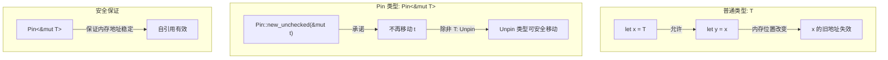
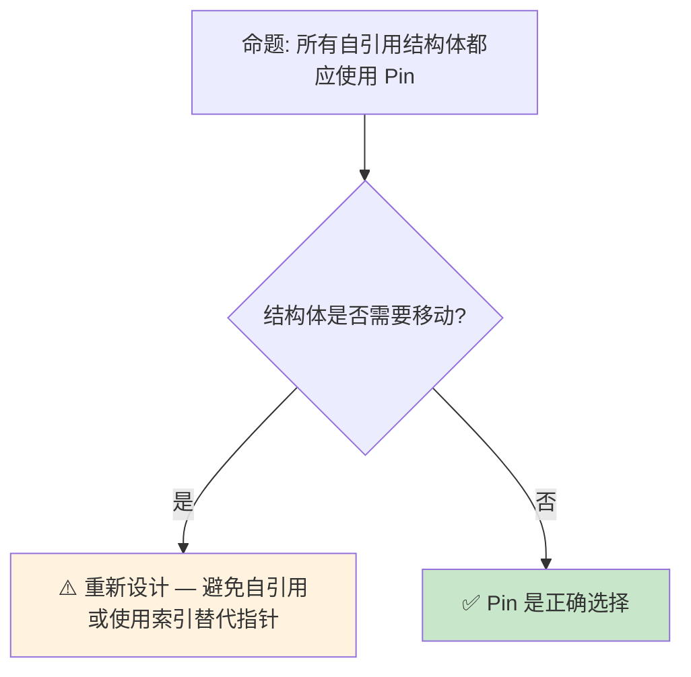

> **内容分级**: [专家级]

# Pin 与 Unpin：自引用类型的不动性保证
>
> **EN**: Pin and Unpin
> **Summary**: Pin and Unpin. Core Rust concept covering mechanism analysis, in-depth analysis, async/await patterns.
> **📎 交叉引用（Reference）**
>
> 本主题在 knowledge 中有系统化的知识索引：[Pin/Unpin](../../../knowledge/03_advanced/async)
> **受众**: [专家]
> **Bloom 层级**: 分析 → 评价
> **A/S/P 标记**: **S** — Structure
> **双维定位**: C×Ana — 分析 Pin 不动性对自引用（Reference）的必要性
> **定位**: 深入分析 Rust 中 **Pin<&mut T>** 和 **Unpin** 的设计动机——解决自引用（Reference）类型（self-referential structs）在内存移动时的安全问题，探讨 Pin 与 Future、Generator 的交互，以及 async/await 的状态机实现。
> **前置概念**: [Async](02_async.md) · [Ownership](../../01_foundation/01_ownership_borrow_lifetime/01_ownership.md) · [Generics](../../02_intermediate/01_generics/02_generics.md)
> **后置概念**: [Unsafe](../02_unsafe/03_unsafe.md) · [Gen Blocks](../../07_future/03_preview_features/22_gen_blocks_preview.md)

---

> **来源**: [Rust Reference — Pin](https://doc.rust-lang.org/std/pin/index.html) · · [Herlihy & Shavit — The Art of Multiprocessor Programming](https://dl.acm.org/doi/10.5555/2385452) · [Batty et al. — The Semantics of Multicore C](https://doi.org/10.1145/2049706.2049711) · [Jung et al. — RustBelt: Securing the Foundations of Rust](https://plv.mpi-sws.org/rustbelt/popl18/) · [Itanium C++ ABI](https://itanium-cxx-abi.github.io/cxx-abi/abi.html)
> [TRPL Ch17 — Pin](https://doc.rust-lang.org/book/ch17-02-concurrency-with-async.html) ·
> [Rustonomicon — Pin](https://doc.rust-lang.org/std/pin/index.html) ·
> [RFC 2349 — Pin](https://github.com/rust-lang/rfcs/pull/2349) ·
> [Tracking Issue #55766](https://github.com/rust-lang/rust/issues/55766)
> **对应 Crate**: [`c06_async`](../../crates/c06_async)
> **对应练习**: [`exercises/src/async_programming/`](../../exercises/src/async_programming)

## 📑 目录
>

- [Pin 与 Unpin：自引用类型的不动性保证](#pin-与-unpin自引用类型的不动性保证)
  - [📑 目录](#-目录)
  - [一、核心概念](#一核心概念)
    - [1.1 问题：自引用类型的移动陷阱](#11-问题自引用类型的移动陷阱)
    - [1.2 Pin 的设计：承诺不再移动](#12-pin-的设计承诺不再移动)
    - [1.3 Unpin：大多数类型的默认](#13-unpin大多数类型的默认)
  - [二、技术细节](#二技术细节)
    - [2.1 Pin API 的契约](#21-pin-api-的契约)
    - [2.2 自引用结构体的安全构建](#22-自引用结构体的安全构建)
    - [2.3 与 async/await 的关系](#23-与-asyncawait-的关系)
  - [三、使用模式](#三使用模式)
  - [四、反命题与边界分析](#四反命题与边界分析)
    - [4.1 反命题树](#41-反命题树)
    - [4.2 边界极限](#42-边界极限)
  - [五、常见陷阱](#五常见陷阱)
    - [编译错误示例](#编译错误示例)
    - [4.4 边界测试：`Pin` 固定栈值后离开作用域（编译错误）](#44-边界测试pin-固定栈值后离开作用域编译错误)
    - [4.5 边界测试：手动实现 `Unpin` 破坏自引用保证（unsafe 逻辑错误）](#45-边界测试手动实现-unpin-破坏自引用保证unsafe-逻辑错误)
  - [六、来源与延伸阅读](#六来源与延伸阅读)
  - [相关概念文件](#相关概念文件)
  - [逆向推理链（Backward Reasoning）](#逆向推理链backward-reasoning)
  - [权威来源索引](#权威来源索引)
    - [10.3 边界测试：`Pin<&mut Self>` 与自引用结构的移动（编译错误）](#103-边界测试pinmut-self-与自引用结构的移动编译错误)
    - [10.4 边界测试：Pin 与 Unpin 的自动实现冲突（编译错误）](#104-边界测试pin-与-unpin-的自动实现冲突编译错误)
  - [认知路径](#认知路径)
    - [核心推理链](#核心推理链)
    - [反命题与边界](#反命题与边界)
  - [实践](#实践)
    - [对应代码示例](#对应代码示例)
    - [建议练习](#建议练习)
  - [导航：下一步去哪？](#导航下一步去哪)
  - [嵌入式测验](#嵌入式测验)
    - [测验 1：Pin 的设计动机（记忆层）](#测验-1pin-的设计动机记忆层)
    - [测验 2：Unpin 自动实现（理解层）](#测验-2unpin-自动实现理解层)
    - [测验 3：Pin::new 的使用限制（应用层）](#测验-3pinnew-的使用限制应用层)
    - [测验 4：async/await 与 Pin（分析层）](#测验-4asyncawait-与-pin分析层)

---

## 一、核心概念
>
>

### 1.1 问题：自引用类型的移动陷阱
>

自引用结构体（self-referential struct）在 Rust 中是一个经典的安全难题：

```rust
// 概念示例（不安全代码）
struct SelfRef {
    data: String,
    ptr_to_data: *const u8,  // 指向 data 内部的指针
}

let mut s = SelfRef {
    data: String::from("hello"),
    ptr_to_data: std::ptr::null(),
};
s.ptr_to_data = s.data.as_ptr();  // 自引用

let s2 = s;  // ❌ 移动后 ptr_to_data 指向旧地址！
// s2.ptr_to_data 现在悬空
```

> **核心问题**: Rust 默认允许移动值，但自引用结构体（Struct）移动后，内部指针变成**悬空指针**（dangling pointer）。这在 C++ 中也是常见问题（move 后自引用失效）。
> [来源: [Rustonomicon — Pinning](https://doc.rust-lang.org/std/pin/index.html)]

---

### 1.2 Pin 的设计：承诺不再移动
>



> **认知功能**: 此图展示 Pin 的**核心契约**——通过类型系统（Type System）承诺值不会被移动，从而使自引用在安全前提下成为可能。
> [来源: [RFC 2592 — Pin](https://github.com/rust-lang/rfcs/pull/2592)]
> **使用建议**: 绝大多数 Rust 代码不需要直接操作 Pin。Pin 主要在 async/await、生成器和特定 unsafe 代码中使用。
> **关键洞察**: Pin 不是"阻止移动"，而是**"承诺不移动"**——如果违反了承诺（通过 unsafe），结果是 UB。
> [来源: [Rust Reference — Pin](https://doc.rust-lang.org/std/pin/index.html)]

---

### 1.3 Unpin：大多数类型的默认
>

```text
Unpin trait 的语义:

  定义: 如果 T: Unpin，则 Pin<&mut T> 可以安全地解包为 &mut T
  含义: Unpin 类型即使被 Pin 包裹，也可以移动

  自动实现:
  ├── 几乎所有类型自动实现 Unpin
  ├── 包含自引用的类型（如 async Future）不实现 Unpin
  └── 可通过 !Unpin 显式标记（unstable）

  常见 Unpin 类型:
  ├── 所有标量类型（i32, bool, f64...）
  ├── String, Vec<T>
  ├── Box<T>（无论 T 是否 Unpin）
  └── 不包含自引用的结构体

  常见 !Unpin 类型:
  ├── async fn 生成的 Future
  ├── gen block 生成的 Generator
  ├── 手动实现的自引用结构体
  └── PhantomPinned（显式标记 !Unpin）
```

> **Unpin 洞察**: Unpin 是 Rust 的**默认安全网**——大多数类型自动 Unpin，只有在真正需要 Pin 保证的类型（如 Future）才不实现 Unpin。这避免了 Pin 污染普通代码。
> [来源: [std::marker::Unpin](https://doc.rust-lang.org/std/marker/trait.Unpin.html)]

---

## 二、技术细节

### 2.1 Pin API 的契约
>

```rust,ignore
use std::pin::Pin;

// Pin 的创建（safe）
let mut data = String::from("hello");
let pinned: Pin<&mut String> = Pin::new(&mut data);
// String: Unpin，所以 Pin<&mut String> 可以解包
let s: &mut String = Pin::into_inner(pinned);

// Pin 的创建（unsafe — 用于 !Unpin 类型）
let mut future = MyAsyncFuture::new();
let pinned: Pin<&mut MyAsyncFuture> = unsafe {
    Pin::new_unchecked(&mut future)
};
// MyAsyncFuture: !Unpin，必须通过 unsafe 创建 Pin
// 创建者承诺: future 在 drop 前不会被移动

// Pin 上的操作
impl<P: Deref> Pin<P> {
    // 安全方法（要求 P::Target: Unpin）
    pub fn into_inner(pin: Pin<P>) -> P { ... }

    // 不安全方法（!Unpin 类型专用）
    pub unsafe fn new_unchecked(pointer: P) -> Pin<P> { ... }
}
```

> **API 设计**: Pin 的 API 区分了**Unpin**和**!Unpin**类型——Unpin 类型操作安全且无需 unsafe；!Unpin 类型需要 unsafe 创建，但创建后的操作是安全的。
> [来源: [std::pin::Pin](https://doc.rust-lang.org/std/pin/struct.Pin.html)]

---

### 2.2 自引用结构体的安全构建
>

```rust,ignore
use std::pin::Pin;
use std::marker::PhantomPinned;

struct SelfReferential {
    data: String,
    // PhantomPinned 使类型 !Unpin
    _pin: PhantomPinned,
}

impl SelfReferential {
    fn new(data: String) -> Pin<Box<Self>> {
        let mut boxed = Box::new(SelfReferential {
            data,
            _pin: PhantomPinned,
        });

        // 初始化自引用（必须在 Pin 之前完成）
        // 或者使用 Pin::into_inner_unchecked 初始化

        // 安全: Box 在堆上，Pin 后不会被移动
        unsafe { Pin::new_unchecked(boxed) }
    }
}

// 使用 Pin 访问
impl SelfReferential {
    fn get_data(self: Pin<&Self>) -> &str {
        &self.data
    }
}
```

> **构建模式**: 自引用结构体（Struct）的安全构建需要**两步初始化**——先在堆上分配（Box），然后 Pin，最后初始化自引用字段。`pin-project` crate 简化了这一过程。
> [来源: [Rustonomicon — Pinning](https://doc.rust-lang.org/std/pin/index.html)]

---

### 2.3 与 async/await 的关系
>

```text
async/await 与 Pin 的关系:

  async fn 生成的状态机:
  ├── 编译器将 async fn 转换为结构体 + Future impl
  ├── 状态机可能包含自引用（如跨 await 点的引用）
  ├── 因此 async Future 是 !Unpin
  └── Future::poll 要求 Pin<&mut Self>

  为什么 Future::poll 需要 Pin?
  ├── async 状态机可能在 .await 点持有对局部变量的引用
  ├── 如果 Future 被移动，这些引用变成悬空
  ├── Pin 保证 Future 在内存中不动
  └── 因此跨 await 的引用始终有效

  async 块的内存布局:
  struct __AsyncFuture_1<'a> {
      state: u8,
      // 可能包含自引用字段
      local_ref: &'a str,
      _pin: PhantomPinned,
  }
```

> **async 洞察**: Pin 是 async/await 的**底层基石**——没有 Pin，异步状态机就无法安全地持有跨 await 点的引用。Pin 使 Rust 的 async 实现既安全又零成本。
> [来源: [Async Working Group — Pin](https://rust-lang.github.io/async-fundamentals-initiative/)]

---

## 三、使用模式

```text
模式 1: 在 safe 代码中使用 Pin（Unpin 类型）
  let mut x = 42;
  let pinned = Pin::new(&mut x);
  // 对 i32 等 Unpin 类型，Pin 是透明的
  // 可直接访问: *pinned

模式 2: async 函数中的 self: Pin<&mut Self>
  impl Future for MyFuture {
      fn poll(self: Pin<&mut Self>, cx: &mut Context) -> Poll<Self::Output> {
          // self 是 Pin<&mut Self>，保证内存不动
          let this = unsafe { self.get_unchecked_mut() };
          // 现在可以 &mut 访问内部字段
      }
  }

模式 3: pin-project 简化自引用结构体
  use pin_project::pin_project;

  #[pin_project]
  struct MyStruct {
      #[pin]  // 标记为 Pin 字段
      self_ref: *const u8,
      data: String,
  }

模式 4: 堆分配 + Pin
  let boxed: Pin<Box<MyFuture>> = Box::pin(MyFuture::new());
  // Box::pin 是 safe 的，因为 Box 在堆上

模式 5: 栈上的 Pin（临时的）
  futures::pin_mut!(future);
  // 宏在栈上创建 Pin<&mut T>，生命周期受限
```

> **最佳实践**: 绝大多数场景使用 `Box::pin` 或 `pin_mut!` 宏（Macro）；手写 unsafe Pin 代码只在实现自定义 Future/Generator 时需要。
> [来源: [pin-project Documentation](https://docs.rs/pin-project/latest/pin_project/)]

---

## 四、反命题与边界分析

### 4.1 反命题树
>



> **认知功能**: 此决策树判断是否使用 Pin。核心判断标准是**是否真的需要自引用且不需要移动**。
> **使用建议**: 优先避免自引用设计；必须自引用时用 Pin；需要移动时重新设计（如使用索引替代指针）。
> **关键洞察**: Pin 是**最后手段**而非首选方案。大多数"需要自引用"的场景可以通过重新设计消除自引用需求。
> [来源: [Rust API Guidelines — Pin](https://rust-lang.github.io/api-guidelines//predictability.html)]

---

### 4.2 边界极限
>

```text
边界 1: Pin 不保证堆分配
├── Pin<&mut T> 可以指向栈或堆
├── 只有 Pin<Box<T>> 保证堆分配
├── 移动 Box 不改变 T 的地址（Box 是指针）
└── 这是 Box::pin 安全的原因

边界 2: Pin 与 Drop
├── Pin 的类型保证: 如果 T: !Unpin，则 Pin<&mut T> 在 drop 前不会被移动
├── 但 drop 本身可以移动值（如果 T: Unpin）
└── Drop::drop 接收 &mut self，不是 Pin<&mut Self>

边界 3: Pin 与 UnsafeCell/RefCell
├── Pin<&mut RefCell<T>> 允许通过 RefCell 获取 &mut T
├── 这可能破坏 Pin 的不动性保证（如果 T: !Unpin）
├── 这是 RefCell 的 Pin 投影不安全的原因
└── 使用 pin-project 处理这类场景

边界 4: 协程/生成器中的 Pin
├── gen block（nightly）生成的 Generator 也是 !Unpin
├── yield 点可能持有自引用
├── Pin 保证生成器在 yield 之间不被移动
└── async 和 gen 都是"挂起/恢复型效果"，共享自引用状态机 + Pin 机制
    [参见: Effect System 中的 Effect × Pin 交叉分析](../../07_future/03_preview_features/04_effects_system.md#64-effect--pin效果与自引用类型的交叉)
```

> **边界要点**: Pin 的边界主要与**内部可变性**和**Drop**交互相关。这些边界反映了 Pin 契约的复杂性——它不仅是一个类型包装器，更是一个**内存地址稳定性的语义保证**。

---

## 五、常见陷阱

```text
陷阱 1: 误以为 Pin 阻止所有移动
  ❌ let mut x = MyFuture::new();
     let pinned = Pin::new(&mut x);  // 编译错误！MyFuture: !Unpin
     // Pin::new 要求 T: Unpin

  ✅ let mut x = MyFuture::new();
     let pinned = Box::pin(x);  // ✅ Box::pin 安全
     // 或: unsafe { Pin::new_unchecked(&mut x) }

陷阱 2: 从 Pin 获取 &mut 后移动
  ❌ let mut pinned = Box::pin(MyStruct::new());
     let r: &mut MyStruct = unsafe { pinned.as_mut().get_unchecked_mut() };
     let _moved = *r;  // ❌ 移动了 !Unpin 值！

  ✅ 只能通过 Pin 的投影访问字段
     使用 pin-project 或手动 unsafe 投影

陷阱 3: 忘记 PhantomPinned
  ❌ struct SelfRef { data: String, ptr: *const u8 }
     // 这个类型是 Unpin 的！
     // 用户可以安全 Pin::new(&mut s) 然后移动

  ✅ struct SelfRef {
       data: String,
       ptr: *const u8,
       _pin: PhantomPinned,
     }
     // 显式标记 !Unpin

陷阱 4: Pin 投影错误
  ❌ impl MyStruct {
       fn field(self: Pin<&Self>) -> &String {
         &self.field  // 如果 field 不是 Pin 字段，这是安全的
         // 但如果 field 是 Pin 字段，需要投影
       }
     }

  ✅ 使用 pin-project 处理结构体字段投影
```

> **陷阱总结**: Pin 的大多数陷阱源于**对 Unpin/!Unpin 的误解**和**不安全的投影操作**。理解 Pin 的语义契约是避免这些陷阱的关键。
> [来源: [Rust Compiler Error Index](https://doc.rust-lang.org/error_codes/index.html)]

### 编译错误示例

```rust,compile_fail
use std::marker::PhantomPinned;
use std::pin::Pin;

struct SelfRef {
    data: String,
    ptr: *const String,
    _pin: PhantomPinned,
}

fn pin_new_requires_unpin() {
    let mut x = SelfRef {
        data: String::from("hello"),
        ptr: std::ptr::null(),
        _pin: PhantomPinned,
    };
    // ❌ 编译错误: `SelfRef` 未实现 `Unpin`
    // Pin::new 要求 T: Unpin
    let pinned = Pin::new(&mut x);
}
```

> **修正**: 对 `!Unpin` 类型使用 `Box::pin` 或 `unsafe { Pin::new_unchecked(&mut x) }`。

```rust,ignore
use std::pin::Pin;

fn pin_project_misuse() {
    let mut x = String::from("hello");
    let pinned = Pin::new(&mut x);
    // ❌ 编译错误: 无法从 `Pin<&mut String>` 获取 `&mut String`
    // Pin 阻止了获取可变引用的能力（除非 T: Unpin）
    let r: &mut String = pinned.get_mut();
}
```

> **修正**: `Pin<&mut T>` 只允许在 `T: Unpin` 时获取 `&mut T`。对 `!Unpin` 类型，只能通过 `unsafe { pinned.as_mut().get_unchecked_mut() }` 访问，且必须遵守 Pin 契约（不移动值）。

```rust,compile_fail
use std::pin::Pin;

struct Wrapper<T>(T);

fn pin_field_access<T>(pinned: Pin<&Wrapper<T>>) -> &T {
    // ❌ 编译错误: 无法直接从 Pin<&Wrapper<T>> 访问字段
    // 因为字段可能是 !Unpin，需要显式投影
    &pinned.0
}
```

> **修正**: 结构体（Struct）字段投影需要 `unsafe` 或 `pin-project` crate。直接访问 `pinned.0` 会绕过 Pin 的地址稳定性保证。

### 4.4 边界测试：`Pin` 固定栈值后离开作用域（编译错误）

```rust,compile_fail
use std::pin::Pin;

fn pin_stack() -> Pin<&mut i32> {
    let mut x = 42;
    // ❌ 编译错误: cannot return reference to local variable `x`
    // Pin<&mut T> 本质上是引用，不能返回指向局部变量的引用
    Pin::new(&mut x)
}

// 正确: 固定到堆上
fn pin_heap() -> Pin<Box<i32>> {
    Box::pin(42) // ✅ Pin<Box<T>> 拥有堆内存
}
```

> **修正**: `Pin<&mut T>` 是引用，必须保证目标内存的存活。固定栈值后返回 `Pin<&mut T>` 会导致悬垂引用。正确做法是将值固定到堆上（`Box::pin`）或使用 `std::pin::pin!` 宏（Rust 1.68+）在局部作用域内固定。[来源: [Rust Standard Library](https://doc.rust-lang.org/std/index.html)]

### 4.5 边界测试：手动实现 `Unpin` 破坏自引用保证（unsafe 逻辑错误）

```rust,ignore
use std::pin::Pin;
use std::marker::PhantomPinned;

struct SelfRef {
    data: String,
    ptr: *const String, // 指向 data
    _pin: PhantomPinned,
}

// ⚠️ 逻辑错误: 为 !Unpin 类型手动实现 Unpin
unsafe impl Unpin for SelfRef {}

fn main() {
    let mut s = SelfRef {
        data: String::from("hello"),
        ptr: std::ptr::null(),
        _pin: PhantomPinned,
    };
    s.ptr = &s.data; // 自引用
    let mut pinned = Box::pin(s);
    // 由于 Unpin，可以安全移动
    let moved = std::mem::replace(&mut *pinned, SelfRef {
        data: String::from("new"),
        ptr: std::ptr::null(),
        _pin: PhantomPinned,
    });
    // s.ptr 现在悬垂！运行时 UB
}
```

> **修正**: 为包含自引用的类型手动实现 `Unpin` 是极其危险的。`Unpin` 是一个 "auto trait"，表示"移动是安全的"。手动实现 `Unpin` 等于告诉编译器"此类型即使被移动也是安全的"——如果类型实际包含自引用，移动后指针将悬垂，导致未定义行为。应始终让编译器自动推导 `Unpin`。[来源: [Rustonomicon](https://doc.rust-lang.org/nomicon/index.html)]

---

## 六、来源与延伸阅读

| 来源 | 可信度 | 说明 |
|:---|:---:|:---|
| [Rust Reference — Pin](https://doc.rust-lang.org/std/pin/index.html) | ✅ 一级 | 官方语言参考 |
| [TRPL Ch17 — Pin](https://doc.rust-lang.org/book/ch17-02-concurrency-with-async.html) | ✅ 一级 | Pin 入门指南 |
| [Rustonomicon — Pinning](https://doc.rust-lang.org/std/pin/index.html) | ✅ 一级 | 深入 Pin 分析 |
| [RFC 2349 — Pin](https://github.com/rust-lang/rfcs/pull/2349) | ✅ 一级 | Pin 设计 RFC |
| [pin-project](https://docs.rs/pin-project/latest/pin_project/) | ✅ 一级 | 自引用结构体（Struct）辅助 crate |
| [std::pin::Pin](https://doc.rust-lang.org/std/pin/struct.Pin.html) | ✅ 一级 | 标准库 API |
| [std::marker::Unpin](https://doc.rust-lang.org/std/marker/trait.Unpin.html) | ✅ 一级 | Unpin 标准库 API |
| [RFC 2394 — Async/Await](https://rust-lang.github.io/rfcs//2394-async_await.html) | ✅ 一级 | async 状态机 RFC |

---

## 相关概念文件

- [Async](02_async.md) — 异步（Async）编程（Pin 的核心用例）
- [Unsafe](../02_unsafe/03_unsafe.md) — unsafe Rust
- [Ownership](../../01_foundation/01_ownership_borrow_lifetime/01_ownership.md) — 所有权（Ownership）模型
- [Gen Blocks](../../07_future/03_preview_features/22_gen_blocks_preview.md) — 生成器（也是 !Unpin）

---

> **权威来源**: [Rust Reference](https://doc.rust-lang.org/reference/introduction.html), [The Rust Programming Language](https://doc.rust-lang.org/book/ch17-00-async-await.html), [Rustonomicon](https://doc.rust-lang.org/nomicon/index.html) · [Brown University Interactive Book](https://rust-book.cs.brown.edu/ch17-00-async-await.html)
>
> **权威来源对齐变更日志**: 2026-05-21 创建，对齐 Rust 1.96.1+ (Edition 2024)

**文档版本**: 1.0
**对应 Rust 版本**: 1.96.1+ (Edition 2024)
**最后更新**: 2026-05-21
**状态**: ✅ 概念文件创建完成

---

## 逆向推理链（Backward Reasoning）

> **从编译错误反推**：
>
> ```text
> Pin 安全 ⟸ !Unpin + 地址稳定
> ```
>
## 权威来源索引

>
>
>

---

---

---

### 10.3 边界测试：`Pin<&mut Self>` 与自引用结构的移动（编译错误）

```rust,ignore
use std::pin::Pin;

struct SelfRef {
    data: String,
    ptr: *const String,
}

impl SelfRef {
    fn new() -> Self {
        Self { data: String::from("hello"), ptr: std::ptr::null() }
    }

    fn init(&mut self) {
        self.ptr = &self.data;
    }
}

fn main() {
    let mut s = SelfRef::new();
    s.init();
    // ❌ 编译错误: 自引用结构移动后 ptr 悬垂
    let s2 = s; // move
}
```

> **修正**:
> 自引用结构（self-referential struct）是 Rust 的**硬问题**：
> `ptr` 指向 `data` 的地址，若结构体移动（`let s2 = s`），`data` 的地址改变，`ptr` 成为悬垂指针。
> `Pin` 是解决关键：`Pin<&mut SelfRef>` 保证 `SelfRef` 在内存中不可移动。
> 创建 `Pin` 的方法：
>
> 1) `Box::pin(SelfRef::new())` — 堆分配 + Pin；
> 2) `pin_utils::pin_mut!` — 栈上 Pin（unsafe）；
> 3) `std::pin::pin!`（1.68+，安全栈 Pin）。
> `Unpin` trait 标记"移动安全"的类型：
> 大多数类型自动实现 `Unpin`，但含自引用字段的类型应 `!Unpin`（通过 `PhantomPinned`）。
> 这与 C++ 的 `this` 指针（对象移动后 `this` 不变，但内部指针可能悬垂）或 Swift 的引用类型（堆分配不移动）不同
> ——Rust 的 `Pin` 类型系统（Type System）显式标记不可移动对象。
> [来源: [Rust Standard Library](https://doc.rust-lang.org/std/pin/struct.Pin.html)] ·
> [来源: [The Rust Programming Language](https://doc.rust-lang.org/book/ch15-04-rc.html)]

### 10.4 边界测试：Pin 与 Unpin 的自动实现冲突（编译错误）

```rust,compile_fail
use std::marker::PhantomPinned;

struct SelfRef {
    data: String,
    _pin: PhantomPinned,
}

fn assert_unpin<T: Unpin>() {}

fn main() {
    // ❌ 编译错误: SelfRef 包含 PhantomPinned，未实现 Unpin
    assert_unpin::<SelfRef>();
}
```

> **修正**: **`Unpin`** 是**auto trait**：1) 编译器自动为大多数类型实现 `Unpin`；2) 包含 `PhantomPinned` 或 `!Unpin` 字段的类型自动 `!Unpin`；3) 不能为 `!Unpin` 类型手动实现 `Unpin`（不安全）。`Pin<P<T>>` 的行为：1) `T: Unpin` — `Pin` 允许 `get_mut()`（数据可安全移动）；2) `T: !Unpin` — `Pin` 禁止 `get_mut()`（数据不可移动）。自引用结构：1) 使用 `PhantomPinned` 标记 `!Unpin`；2) 通过 `Pin<&mut Self>` 访问；3) `unsafe` 创建 `Pin`（需保证数据不移动）。这与 C++ 的 `std::pin`（无原生支持，需手动管理）或 Swift 的引用类型（始终堆分配，无 move 问题）不同——Rust 的 `Pin` 是零成本抽象（Zero-Cost Abstraction），通过类型系统（Type System）保证。[来源: [Pin API](https://doc.rust-lang.org/std/pin/)] · [来源: [The Rustonomicon](https://doc.rust-lang.org/std/pin/index.html)]
> **权威来源**: [Rust Reference](https://doc.rust-lang.org/reference/introduction.html) · [The Rust Programming Language](https://doc.rust-lang.org/book/ch17-00-async-await.html) · [Rust Standard Library](https://doc.rust-lang.org/std/index.html)
> **对应 Rust 版本**: 1.96.1+ (Edition 2024)

## 认知路径

> **认知路径**: 从 L0 基础概念出发，经由本节的 **Pin 与 Unpin：自引用类型的不动性保证** 核心原理，通向 L2 进阶模式与 L3 工程实践。

### 核心推理链

| 定理 | 前提 | 结论 | 置信度 |
|:---|:---|:---|:---|
| Pin 与 Unpin：自引用类型的不动性保证 基础定义 ⟹ 正确用法 | 理解语法与语义 | 能写出符合惯用法的代码 | 高 |
| Pin 与 Unpin：自引用类型的不动性保证 正确用法 ⟹ 常见陷阱 | 忽略边界条件 | 编译错误或运行时（Runtime） bug | 高 |
| Pin 与 Unpin：自引用类型的不动性保证 常见陷阱 ⟹ 深度掌握 | 系统学习反模式 | 能进行代码审查与优化 | 高 |

> 自引用结构安全 ⟸ Pin 不动性保证 ⟸ !Unpin 标记
> 堆分配稳定 ⟸ Pin<Box<T>> ⟸ 地址不变性
> **过渡**: 掌握 Pin 与 Unpin：自引用类型的不动性保证 的基础语法后，下一步需要理解其在类型系统（Type System）中的位置与与其他概念的交互关系。
> **过渡**: 在实践中应用 Pin 与 Unpin：自引用类型的不动性保证 时，务必关注边界条件与异常处理，这是从"能编译"到"能生产"的关键跃迁。
> **过渡**: Pin 与 Unpin：自引用类型的不动性保证 的设计理念体现了 Rust 零成本抽象（Zero-Cost Abstraction）与安全保证的核心权衡，理解这一权衡有助于迁移到更高级的并发与形式化验证领域。

### 反命题与边界

> **反命题**: "Pin 与 Unpin：自引用类型的不动性保证 在所有场景下都是最佳选择" —— 错误。需要根据具体上下文权衡性能、可读性与安全性，某些场景下显式替代方案可能更优。

---

---

## 实践

> 将本节概念转化为可编译代码。

### 对应代码示例

- **[crates/c06_async](../../../crates/c06_async)** — 与本节概念对应的可编译 crate 示例

### 建议练习

1. 阅读 `crates/c06_async/` 中与"Pin 与 Unpin"相关的源码和示例
2. 运行 `cargo test -p c06_async` 验证理解

---

## 导航：下一步去哪？

> **自检**：你当前掌握的核心概念是否已能独立应用？

| 选择 | 条件 | 目标 |
|:---|:---|:---|
| 🔙 巩固基础 | 仍有模糊概念 | 回到 [L2 对应主题](../02_intermediate) 或 [MVP 学习路径](../../00_meta/04_navigation/learning_mvp_path.md) |
| 🔜 深入 L3 其他主题 | 想扩展高级技能 | [L3 README](../README.md) 选择其他主题 |
| 🎓 进入 L4 形式化 | 想理解"为什么"的数学证明 | [L4 形式化](../../04_formal/README.md) |
| 🏗️ 进入 L6 生态 | 想掌握生产工具链 | [L6 生态](../../06_ecosystem/README.md) |

---

## 嵌入式测验

### 测验 1：Pin 的设计动机（记忆层）

**题目**: `Pin` 的核心设计目的是什么？

- A. 优化内存布局，减少缓存未命中
- B. 保证自引用类型在内存中**不再被移动**，防止悬垂指针
- C. 实现线程间的零拷贝数据传输
- D. 替代 `Box`，提供更轻量的堆分配

<details>
<summary>✅ 答案与解析</summary>

**正确答案是 B**。

`Pin<P>` 是一个**包装器**，它承诺被包装的值在内存中的位置不会改变（除非该类型实现了 `Unpin`）。

核心场景：**自引用结构体**（self-referential structs）。例如：

```rust
struct SelfRef {
    data: String,
    ptr: *const String, // 指向 data
}
```

如果 `SelfRef` 被 move，`data` 的地址改变，但 `ptr` 仍指向旧地址 → **悬垂指针**。

`Pin` 通过禁止移动（对 `!Unpin` 类型）来解决这个问题。
</details>

---

### 测验 2：Unpin 自动实现（理解层）

**题目**: 以下代码中，`Test` 是否自动实现 `Unpin`？

```rust
struct Test {
    data: String,
    ptr: *const String,
}
```

- A. 是，因为 `String` 实现了 `Unpin`
- B. 否，因为包含原始指针（Raw Pointer） `*const String`
- C. 是，但仅当 `ptr` 为 `null` 时
- D. 否，但可以通过 `unsafe impl Unpin for Test {}` 手动实现

<details>
<summary>✅ 答案与解析</summary>

**正确答案是 A**。

Rust 的 **auto trait** 机制：

- `Unpin` 是 auto trait，默认所有类型都实现 `Unpin`
- 只有当结构体包含 `!Unpin` 的字段时，它才自动变为 `!Unpin`
- 原始指针（Raw Pointer） `*const T` 本身实现 `Unpin`，因此 `Test` 也自动实现 `Unpin`

**陷阱**: 包含原始指针（Raw Pointer）**不**会使类型变为 `!Unpin`。要使类型真正 `!Unpin`，需要显式声明：

```rust
use std::marker::PhantomPinned;
struct ReallySelfRef {
    data: String,
    _pin: PhantomPinned, // 使类型 !Unpin
}
```

或使用 nightly 的 `impl !Unpin for Test {}`（需要 `negative_impls` feature）。
</details>

---

### 测验 3：Pin::new 的使用限制（应用层）

**题目**: 以下代码能否编译？为什么？

```rust,compile_fail
use std::pin::Pin;

struct NoMove {
    _marker: std::marker::PhantomPinned,
}

fn main() {
    let mut value = NoMove { _marker: std::marker::PhantomPinned };
    let pinned = Pin::new(&mut value);
}
```

- A. 能编译，`Pin::new` 可以固定任何值
- B. 编译错误，`NoMove` 是 `!Unpin`，不能用 `Pin::new`
- C. 编译错误，`PhantomPinned` 不能在栈上创建
- D. 能编译，但运行时（Runtime） panic

<details>
<summary>✅ 答案与解析</summary>

**正确答案是 B**。

`Pin::new` 的签名：

```rust,ignore
impl<'a, T: Unpin> Pin<&'a mut T> {
    pub fn new(pointer: &'a mut T) -> Pin<&'a mut T>;
}
```

**关键约束**: `Pin::new` 要求 `T: Unpin`。

`NoMove` 包含 `PhantomPinned`，而 `PhantomPinned` 是 `!Unpin`，因此 `NoMove` 也是 `!Unpin`。

**正确做法**: 使用 `Box::pin`（不要求 `Unpin`）：

```rust,ignore
let pinned = Box::pin(NoMove { _marker: std::marker::PhantomPinned });
```

或使用 `unsafe` 的 `Pin::new_unchecked`（需要保证值不会被移动）。
</details>

---

### 测验 4：async/await 与 Pin（分析层）

**题目**: 为什么 `Future::poll` 的签名使用 `Pin<&mut Self>` 而不是 `&mut Self`？

```rust,ignore
fn poll(self: Pin<&mut Self>, cx: &mut Context<'_>) -> Poll<Self::Output>;
```

- A. 为了提高性能，避免额外的间接层
- B. 因为 async 状态机可能包含自引用字段，必须保证不被移动
- C. 为了与 `Box<dyn Future>` 兼容
- D. 因为 `Pin` 是 `Send` 的必要条件

<details>
<summary>✅ 答案与解析</summary>

**正确答案是 B**。

`async fn` 编译后的状态机可能包含**自引用字段**：

```rust,ignore
async fn example() {
    let local = String::from("hello");
    let ref_to_local = &local;  // 自引用！
    await_something().await;     // 可能 yield，状态机被 Pin 固定
    println!("{}", ref_to_local);
}
```

编译后的状态机结构类似：

```rust
struct ExampleFuture {
    local: String,
    ref_to_local: *const String, // 指向 local
    state: u8,
}
```

如果状态机被 move（例如从一个线程传递到另一个线程），`local` 的地址改变，但 `ref_to_local` 仍指向旧地址 → **UB**。

`Pin<&mut Self>` 保证：

1. 状态机一旦被 poll，内存位置不再改变
2. 自引用字段始终有效

这是 Rust async/await **零成本抽象（Zero-Cost Abstraction）**的安全基础。
</details>

---

> **测验设计来源**: [Bloom Taxonomy 2001] · [Rust Async Book — Pin](https://rust-lang.github.io/async-book/index.html) · [TRPL Ch17](https://doc.rust-lang.org/book/ch17-02-concurrency-with-async.html)
