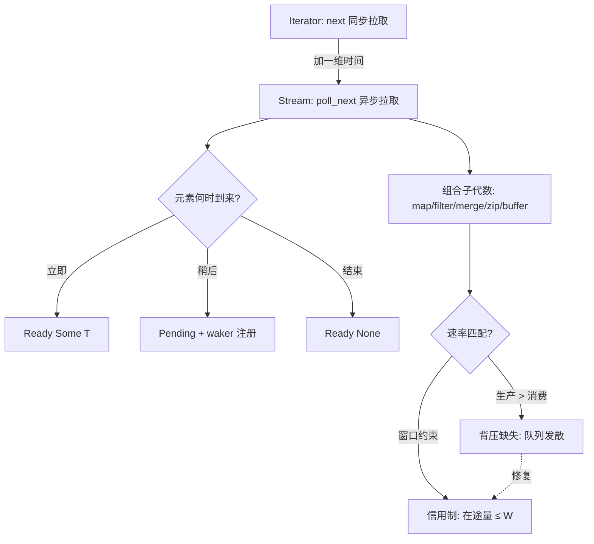
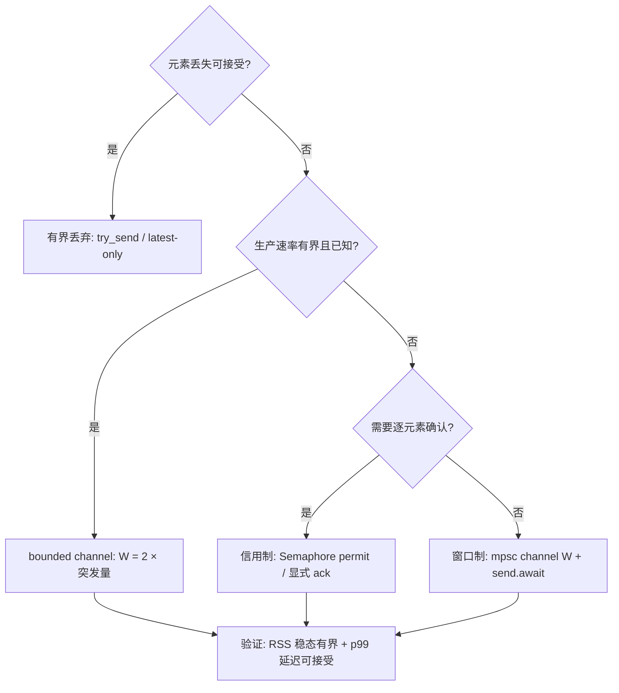
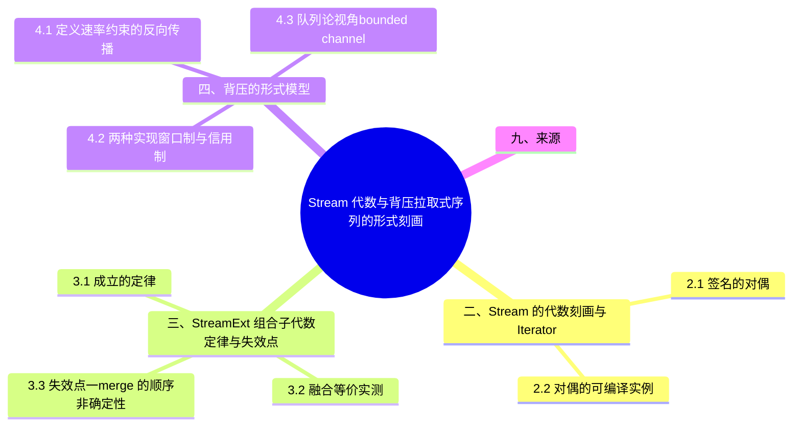

> **内容分级**: [专家级]

# Stream 代数与背压：拉取式序列的形式刻画

> **EN**: Stream Algebra and Backpressure
> **Summary**: Streams as pull-based asynchronous sequences: the exact duality with Iterator (`poll_next` vs `next`), the algebra of StreamExt combinators (fusion, associativity, and where it breaks), and a formal model of backpressure (windows, credits, bounded channels as queueing systems) with paired examples/counterexamples.
>
> **受众**: [进阶]
> **Bloom 层级**: L3-L4
> **权威来源**: 本文件为 `concept/` 权威页（Stream 代数与背压视角）。
> **分工声明**: Stream 的基础概念（`Stream = 异步 Iterator`、dataflow 映射）留在 [Async/Await §15](01_async.md)；Stream/Sink trait 的 API 面分析留在 `01_async.md` §8.10；[Async 边界全景](06_async_boundary_panorama.md) 只做边界汇总。本页专攻三件事：① Stream 与 Iterator 的**代数对偶**；② `StreamExt` 组合子的**代数定律与失效点**；③ 背压的**形式模型**（窗口/信用制、队列论）。三者互不重复（AGENTS.md §2 Canonical 规则）。
> **A/S/P 标记**: **S** — Structure
> **双维定位**: C×Ana — 分析拉取式异步（Async）序列的组合结构与速率约束的传播方向
> **定位**: 把 `Stream` 从「异步（Async）版的 Iterator」这一直觉，上升为可推理的代数对象：对偶签名、组合子定律、以及背压作为「速率约束的反向传播」的形式模型，全部落到可编译验证的示例-反例对上。
> **前置概念**: [Async/Await](01_async.md) · [Pin 与 Unpin](08_pin_unpin.md) · [Future 与 Executor 机制](04_future_and_executor_mechanisms.md)
> **后置概念**: [Executor 公平性与调度](10_executor_fairness_and_scheduling.md) · [Async 取消安全](05_async_cancellation_safety.md) · [Iterator 模式](../../02_intermediate/07_iterators_and_closures/01_iterator_patterns.md)

---

> **Rust 版本**: 1.97.0+ (Edition 2024) · futures 0.3 · tokio-stream 0.1
> **来源**:
> [futures-rs — `Stream`](https://docs.rs/futures/latest/futures/stream/trait.Stream.html) ·
> [futures-rs — `StreamExt`](https://docs.rs/futures/latest/futures/stream/trait.StreamExt.html) ·
> [tokio-stream docs](https://docs.rs/tokio-stream/latest/tokio_stream/) ·
> [withoutboats — poll_next](https://without.boats/blog/poll-next/) ·
> [withoutboats — poll_progress](https://without.boats/blog/poll-progress/)（以上 2026-07-12 curl 实测 HTTP 200）
> **国际权威来源（2026-07-13 补录）**:
> **P0** [Async Book — Streams 章](https://rust-lang.github.io/async-book/05_streams/01_chapter.html) ·
> **P1** [Hoare — Communicating Sequential Processes（CACM 1978）](https://dl.acm.org/doi/10.1145/359576.359585)（背压/有界通道通信模型的理论源头；curl 实测 2026-07-13，ACM 对非浏览器 UA 返回 403 属反爬，DOI 页面浏览器可访问）
> **对应 Crate**: [`c06_async`](../../../crates/c06_async)
> **对应练习**: [`exercises/src/async_programming/`](../../../exercises/src/async_programming)

**变更日志**:

- v1.0 (2026-07-12): 初始版本（W4-1）— 对偶刻画 / 组合子代数 / 背压形式模型，6 个可编译示例 + 1 个反例 + 1 个 compile_fail（rustc 1.97.0 --edition 2024 实测）

## 📑 目录

- [Stream 代数与背压：拉取式序列的形式刻画](#stream-代数与背压拉取式序列的形式刻画)
  - [📑 目录](#-目录)
  - [一、认知路径](#一认知路径)
  - [二、Stream 的代数刻画：与 Iterator 的对偶](#二stream-的代数刻画与-iterator-的对偶)
    - [2.1 签名的对偶](#21-签名的对偶)
    - [2.2 对偶的可编译实例](#22-对偶的可编译实例)
  - [三、StreamExt 组合子代数：定律与失效点](#三streamext-组合子代数定律与失效点)
    - [3.1 成立的定律](#31-成立的定律)
    - [3.2 融合等价（实测）](#32-融合等价实测)
    - [3.3 失效点一：merge 的顺序非确定性](#33-失效点一merge-的顺序非确定性)
    - [3.4 失效点二：`.next()` 的 Unpin 约束](#34-失效点二next-的-unpin-约束)
  - [四、背压的形式模型](#四背压的形式模型)
    - [4.1 定义：速率约束的反向传播](#41-定义速率约束的反向传播)
    - [4.2 两种实现：窗口制与信用制](#42-两种实现窗口制与信用制)
    - [4.3 队列论视角：bounded channel 是 M/M/1/K 系统](#43-队列论视角bounded-channel-是-mm1k-系统)
  - [五、示例-反例对：背压缺失 vs 信用制](#五示例-反例对背压缺失-vs-信用制)
    - [5.1 反例：无界通道 = 背压缺失](#51-反例无界通道--背压缺失)
    - [5.2 正例：有界通道即信用窗口](#52-正例有界通道即信用窗口)
    - [5.3 正例：`buffer_unordered` 的并发信用](#53-正例buffer_unordered-的并发信用)
  - [六、选型判定树](#六选型判定树)
  - [七、工程检查清单](#七工程检查清单)
  - [八、相关概念](#八相关概念)
  - [📋 关键属性](#-关键属性)
  - [🔗 概念关系](#-概念关系)
  - [九、来源](#九来源)
  - [🧭 思维导图（Mindmap）](#-思维导图mindmap)

## 一、认知路径



理解顺序：**对偶（§2）⟹ 组合（§3）⟹ 速率（§4-5）**。对偶回答「Stream 是什么」；组合子代数回答「能对它做什么变换、哪些变换保语义」；背压模型回答「变换链两端的速率不匹配时谁付出代价」。跳过对偶直接学组合子，会在 `.next().await` 报 `cannot be unpinned` 时手足无措（§3.4）。

## 二、Stream 的代数刻画：与 Iterator 的对偶

本节从类型签名层面建立 Stream 与 Iterator 的对偶关系：2.1 给出逐项签名对应，2.2 用可编译实例验证该对偶不只是类比。

### 2.1 签名的对偶

把两个 trait 的方法签名并置，对偶关系一目了然：

| | Iterator（同步拉取） | Stream（异步拉取） |
|---|---|---|
| 方法 | `fn next(&mut self) -> Option<T>` | `fn poll_next(Pin<&mut Self>, &mut Context) -> Poll<Option<T>>` |
| 接收者 | `&mut self` | `Pin<&mut Self>`（允许自引用（Reference）状态机） |
| 驱动者 | 调用者（for 循环） | 执行器（executor 的 poll 循环） |
| 「现在没有」的表达 | 不存在（阻塞即等待） | `Poll::Pending` + waker 注册 |
| 惰性 | 不调用 `next` 就不生产 | 不调用 `poll_next` 就不推进 |

> **定理 T1（拉取对偶）**：`Iterator::next` 与 `Stream::poll_next` 的差异恰好是「时间维度的引入」——返回值外层的 `Poll` 把「值未就绪」从一等阻塞变成一等数据 ⟹ **Stream 是 Iterator 在时间维度上的余纤维化（cofiber）扩展**：多了 `Pending`，多了 `Context`（唤醒通道），多了 `Pin`（跨挂起点地址稳定）。

**异步惰性**是这一定理的推论：同步 Iterator 的惰性是「不调用不计算」；Stream 的惰性是「不 poll 不推进」，且**poll 本身可能不生产值**（Pending）。这引出一条工程公理：流的每一个适配器都必须诚实传播 Pending——吞掉 Pending（假装 Ready）或吞掉唤醒（不转发 waker）都会破坏协议，前者空转烧 CPU，后者永久挂起（waker 契约详见 [Future 与 Executor 机制](04_future_and_executor_mechanisms.md) §2）。

### 2.2 对偶的可编译实例

同一计数逻辑，两种拉取接口，结果逐元素相同：

```rust
use futures::stream::{Stream, StreamExt};
use std::pin::Pin;
use std::task::{Context, Poll};

/// 同步世界：`Iterator::next(&mut self) -> Option<T>`
struct CountUp {
    cur: u32,
    max: u32,
}

impl Iterator for CountUp {
    type Item = u32;
    fn next(&mut self) -> Option<u32> {
        if self.cur >= self.max {
            None
        } else {
            let v = self.cur;
            self.cur += 1;
            Some(v)
        }
    }
}

/// 异步世界：`Stream::poll_next(Pin<&mut Self>, &mut Context) -> Poll<Option<T>>`
/// —— 对偶点：返回值多包一层 `Poll`，表达「此刻无值，稍后唤醒我」。
struct AsyncCountUp {
    inner: CountUp,
}

impl Stream for AsyncCountUp {
    type Item = u32;
    fn poll_next(mut self: Pin<&mut Self>, _cx: &mut Context<'_>) -> Poll<Option<u32>> {
        // 此流总是就绪；真实 I/O 流在无数据时返回 Poll::Pending 并注册 waker。
        Poll::Ready(self.inner.next())
    }
}

#[tokio::main]
async fn main() {
    let sync: Vec<u32> = CountUp { cur: 0, max: 3 }.collect();
    let async_v: Vec<u32> = AsyncCountUp {
        inner: CountUp { cur: 0, max: 3 },
    }
    .collect()
    .await;
    assert_eq!(sync, async_v);
    assert_eq!(sync, vec![0, 1, 2]);
    println!("duality ok: {sync:?} == {async_v:?}");
}
```

> **过渡**：对偶告诉我们 Stream「是什么」，但没有告诉我们能对它「做什么」。同步世界里 Iterator 的强大来自组合子（map/filter/fold 的融合）；异步世界的 `StreamExt` 移植了这套代数——但并非所有定律都原样成立。

## 三、StreamExt 组合子代数：定律与失效点

本节把 StreamExt 组合子当作代数结构检验：3.1 列出成立的定律，3.2 实测融合等价及其失效边界。

### 3.1 成立的定律

| 定律 | 同步形式 | 异步形式 | 成立条件 |
|---|---|---|---|
| map 融合 | `map(f).map(g) ≡ map(g∘f)` | 同左 | f, g 纯函数 |
| filter-map 融合 | `map(f).filter(p) ≡ filter_map(p∘f ? f)` | 同左（§3.2 实测） | 无状态 |
| merge 交换律 | — | `merge(a,b)` 与 `merge(b,a)` 元素多重集相同 | 不关心交错顺序 |
| zip 截断律 | `len(zip(a,b)) = min(len a, len b)` | 同左 | — |
| take/skip 幂等 | `take(n).take(m) = take(min(n,m))` | 同左 | — |

### 3.2 融合等价（实测）

```rust
use futures::stream::{self, StreamExt};

#[tokio::main]
async fn main() {
    let src = stream::iter(0u32..16);

    // 形式 A：先 map 后 filter
    let a: Vec<u32> = src.map(|x| x * 3).filter(|x| futures::future::ready(x % 2 == 0)).collect().await;

    // 形式 B：融合为单步 filter_map（map∘filter 与 filter_map 的语义等价）
    let b: Vec<u32> = stream::iter(0u32..16)
        .filter_map(|x| async move {
            let y = x * 3;
            if y % 2 == 0 { Some(y) } else { None }
        })
        .collect()
        .await;

    assert_eq!(a, b);
    println!("fusion ok: {} items, head={:?}", a.len(), &a[..3]);
}
```

> **定理 T2（异步融合）**：无状态组合子链 `map/filter/filter_map` 在 Stream 上满足与 Iterator 相同的融合等价 ⟹ **融合后的单 pass 适配器与未融合链逐元素等价**，但省掉了中间适配器的状态机层级（每少一层适配器，poll 调用栈少一跳）。

### 3.3 失效点一：merge 的顺序非确定性

`futures::stream::select(a, b)`（tokio-stream 中名为 `StreamExt::merge`）满足交换律的**多重集版本**，但**不满足顺序版本**：交错顺序取决于哪个子流先被 poll 到 Ready，而这是调度决定的：

```rust
use futures::stream::{self, StreamExt};

#[tokio::main]
async fn main() {
    let a = stream::iter(vec![1u32, 3, 5]);
    let b = stream::iter(vec![2u32, 4, 6]);

    // merge（futures::stream::select；tokio-stream 中名为 StreamExt::merge）：
    // 交换律成立（多重集相同），但元素交错顺序依赖 poll 调度，非确定。
    let mut merged: Vec<u32> = stream::select(a, b).collect().await;
    merged.sort_unstable();
    assert_eq!(merged, vec![1, 2, 3, 4, 5, 6]);

    // zip：长度 = min(len_a, len_b)，对齐丢弃尾部。
    let zipped: Vec<(u32, u32)> = stream::iter(1u32..=5).zip(stream::iter(10u32..=12)).collect().await;
    assert_eq!(zipped, vec![(1, 10), (2, 11), (3, 12)]);
    println!("merge/zip ok");
}
```

**推论**：若业务依赖「merge 后的事件顺序反映真实发生顺序」，必须选 `select` 的轮询公平性语义或在元素内嵌时间戳后重排——merge 的代数里根本没有「时间」这个量。

### 3.4 失效点二：`.next()` 的 Unpin 约束

`StreamExt::next` 的签名是 `fn next(&mut self) -> Next<'_, Self> where Self: Unpin`。对流持有一个跨 await 的 future（如 `stream::once(async { ... })` 链）时，整个适配器是 `!Unpin`，直接 `.next().await` 编译失败：

```rust,compile_fail
use futures::stream::{self, StreamExt};

#[tokio::main]
async fn main() {
    // stream::once 持有 async block，而 async block 生成的 future 是 !Unpin，
    // 因此整个流是 !Unpin；StreamExt::next 要求 Self: Unpin。
    let mut s = stream::once(async { 1u32 }).chain(stream::iter(2u32..4));
    // ERROR[E0277]: `{async block ...}` cannot be unpinned
    while let Some(x) = s.next().await {
        println!("{x}");
    }
}
```

修复有两条路：`tokio::pin!(s);` 把流钉在栈上（`Pin<&mut S>: Unpin`，此后 `s.next().await` 合法）；或改用 `while let Some(x) = s.as_mut().next().await` 前先 `let mut s = Box::pin(s)`。机理见 [Pin 与 Unpin](08_pin_unpin.md) §1.2；投射层面的反例目录见 [Pin 投射反例集](11_pin_projection_counterexamples.md)。

> **过渡**：至此我们只讨论了「一条流内部」的代数。真实系统是多条流首尾相接的**管道**：上游生产速率与下游消费速率几乎从不相等。速率差乘以时间就是积压——这就是背压问题的入口。

## 四、背压的形式模型

本节给出背压的形式模型：4.1 定义速率约束的反向传播，4.2 对比窗口制与信用制两种实现，4.3 用 M/M/1/K 队列解释 bounded channel。

### 4.1 定义：速率约束的反向传播

**背压（backpressure）**：在数据路径 `producer → stage₁ → … → consumer` 上，当下游处理速率 `μ` 小于上游到达速率 `λ` 时，下游通过**拒绝接收**（而非无限缓冲）把速率约束沿路径**反向**传播给上游的机制。

形式化：设 stage `i` 的输入缓冲为 `Qᵢ`，背压存在当且仅当存在常数 `B` 使得 ∀t, `|Qᵢ(t)| ≤ B`（**有界性**），且当 `|Qᵢ| = B` 时上游的发送操作被阻塞/挂起（**传播性**）。两条性质缺一不可：有界而无传播（丢弃新元素）是**有界丢弃**（如 `try_send` 失败即丢），不是背压；传播而无界（挂起但队列仍增长）是矛盾，不可能。

### 4.2 两种实现：窗口制与信用制

| 机制 | 不变量 | 典型载体 | 语义 |
|---|---|---|---|
| 窗口制（window） | 在途未确认元素 ≤ W | TCP 滑动窗口、bounded channel | 发送方维护计数，耗尽即停 |
| 信用制（credit） | Σ已发 − Σ已确认 ≤ 已授予信用 | 显式 permit/令牌（`Semaphore`、mpsc 容量） | 接收方主动授予「你还可以发 N 个」 |

二者在离散事件意义下**同构**：窗口 W 等价于初始信用 W、每确认一个归还一单位信用。Tokio 的 `mpsc::channel(W)` 就是窗口制——`send().await` 在窗口耗尽时挂起，正是「传播性」的可观测形态。

### 4.3 队列论视角：bounded channel 是 M/M/1/K 系统

把 bounded channel 建模为容量 K 的排队系统：

- **到达率 λ**（生产者速率）、**服务率 μ**（消费者速率）、**容量 K**（通道窗口）。
- λ < μ 时系统稳定，稳态队列期望长度由 M/M/1/K 公式给出，且 **≤ K**——内存有界。
- λ ≥ μ 时无界队列（K = ∞）的队列长度**线性发散**：`E[Q(t)] ≈ (λ−μ)·t` ⟹ 内存最终耗尽。
- **Little 定律** `L = λ·W`：稳态下在途元素数 = 到达率 × 平均逗留时间。有界通道把 L 硬上限钉在 K，于是逗留时间 W 随负载上升——**背压把「内存增长」兑换成了「延迟增长」**，这是它的全部代价与全部价值。

> **定理 T3（背压守恒）**：无界队列 + λ > μ ⟹ `E[Q(t)] → ∞` ⟹ 内存无界；有界窗口 K ⟹ `L ≤ K`（Little 定律）⟹ 内存有界、延迟随 `(λ/μ)` 上升。⟹ **背压不消除拥塞，它只选择拥塞的呈现形式：延迟（有界）或内存（无界）**。

反向看同样成立 ⟸ **观察到进程 RSS 随时间线性增长且增长速率 ∝ 生产速率 ⟸ 数据路径上存在无界缓冲环节 ⟸ 背压缺失**。这是生产环境排查 async 内存泄漏的第一判别式。

## 五、示例-反例对：背压缺失 vs 信用制

本节以示例-反例对收尾：5.1 展示无界通道如何丢失背压，并给出信用制实现的对照修复。

### 5.1 反例：无界通道 = 背压缺失

```rust
use std::time::Duration;
use tokio::sync::mpsc;

#[tokio::main]
async fn main() {
    // 反例核心：unbounded_channel 的 send 永不等待，生产者可以无限超前。
    let (tx, mut rx) = mpsc::unbounded_channel::<u64>();

    let producer = tokio::spawn(async move {
        for i in 0..100_000u64 {
            // send 是同步的、永不失败背压：队列长度只增不减（消费者睡着时）。
            tx.send(i).expect("receiver alive");
        }
    });

    // 消费者刻意慢：每 1ms 处理一个。
    let consumer = tokio::spawn(async move {
        let mut peak = 0usize;
        while rx.recv().await.is_some() {
            peak = peak.max(rx.len()); // 观察瞬时队列深度
            tokio::time::sleep(Duration::from_millis(1)).await;
            if peak > 50_000 {
                break; // 演示：队列已膨胀到生产者进度的 50% 以上
            }
        }
        peak
    });

    let _ = producer.await;
    let peak = consumer.await.expect("consumer");
    println!("peak queue depth = {peak} (unbounded: grows with producer speed)");
    assert!(peak > 1_000, "backpressure missing: queue must grow");
}
```

实测输出：`peak queue depth = 99998`——生产者在消费者处理第 2 个元素时已把 10 万个元素全部压入队列。每个元素 8 字节看似无害，换成 64 KiB 的帧就是 6.4 GiB 瞬时驻留。

### 5.2 正例：有界通道即信用窗口

```rust
use std::time::Duration;
use tokio::sync::mpsc;

#[tokio::main]
async fn main() {
    const WINDOW: usize = 8; // 信用窗口：任意时刻在途元素 <= 8

    let (tx, mut rx) = mpsc::channel::<u64>(WINDOW);

    let producer = tokio::spawn(async move {
        for i in 0..100u64 {
            // send().await 在窗口耗尽时挂起：生产者速度被消费者牵引。
            tx.send(i).await.expect("receiver alive");
        }
    });

    let consumer = tokio::spawn(async move {
        let mut peak = 0usize;
        let mut n = 0u64;
        while rx.recv().await.is_some() {
            peak = peak.max(rx.len());
            n += 1;
            tokio::time::sleep(Duration::from_millis(1)).await;
        }
        (peak, n)
    });

    producer.await.expect("producer");
    let (peak, n) = consumer.await.expect("consumer");
    println!("credit ok: processed={n}, peak depth={peak} <= WINDOW={WINDOW}");
    assert_eq!(n, 100);
    assert!(peak <= WINDOW, "bounded channel caps queued items");
}
```

实测：`processed=100, peak depth=7 <= WINDOW=8`。同一对生产/消费速率，内存从「线性发散」变为「常数有界」，代价是生产者被牵引到消费者速率（每秒约 1000 个）——正是 T3 的「延迟换内存」。

### 5.3 正例：`buffer_unordered` 的并发信用

流内部的「并发度上限」是另一种信用：`buffer_unordered(n)` 给流中每个元素的处理 future 发放 n 个并发信用，第 n+1 个必须等待：

```rust
use futures::stream::{self, StreamExt};
use std::sync::atomic::{AtomicUsize, Ordering};
use std::sync::Arc;
use std::time::Duration;

#[tokio::main]
async fn main() {
    let inflight = Arc::new(AtomicUsize::new(0));
    let peak = Arc::new(AtomicUsize::new(0));

    let results: Vec<u32> = stream::iter(0u32..20)
        .map(|i| {
            let inflight = Arc::clone(&inflight);
            let peak = Arc::clone(&peak);
            async move {
                let cur = inflight.fetch_add(1, Ordering::SeqCst) + 1;
                peak.fetch_max(cur, Ordering::SeqCst);
                tokio::time::sleep(Duration::from_millis(5)).await;
                inflight.fetch_sub(1, Ordering::SeqCst);
                i
            }
        })
        .buffer_unordered(4) // 并发信用 = 4：第 5 个 future 必须等前面完成
        .collect()
        .await;

    assert_eq!(results.len(), 20);
    let p = peak.load(Ordering::SeqCst);
    println!("buffer_unordered ok: peak concurrency = {p} <= 4");
    assert!(p <= 4);
}
```

注意 withoutboats 在 *poll_progress* 中指出的边界：futures 的 `Buffered`/`BufferUnordered` 只在 `poll_next` 期间推进子 future——若消费循环体本身含 await，缓冲的并发在循环体执行期间**暂停**。需要「循环体与缓冲并行」时，应把消费侧改为独立任务经通道衔接（即把单流管道拆成两级，各自带窗口）。

> **过渡**：背压模型给出的是「约束必须存在」的必要性，但约束放在哪、选窗口还是信用、窗口多大，是工程判定问题。

## 六、选型判定树



判定要点：①「可丢失」才允许无背压（监控采样、最新值语义）；②窗口大小的下界是突发吸收需求，上界是内存预算 ÷ 元素大小；③信用制只在需要「下游按处理能力动态授予」时才值得引入复杂度，否则窗口制更简单且同构。

## 七、工程检查清单

对数据路径上的每一个缓冲环节，依次问：

1. 这个缓冲有容量上界吗？（无 → 背压缺失，§5.1）
2. 上界耗尽时，上游被挂起、被拒绝、还是被丢弃？（丢弃 ≠ 背压）
3. λ/μ 的长期比值 ≤ 1 吗？（>1 时任何有限窗口都只是延缓 OOM）
4. 突发量 × 元素大小 × 窗口数 < 内存预算吗？
5. 消费循环体含 await 吗？（含 → `Buffered` 类适配器的并发在循环体期间暂停，§5.3）
6. merge 后的顺序被业务依赖吗？（依赖 → 嵌时间戳重排，§3.3）
7. 流的 `!Unpin` 适配器在循环里 `.next().await` 吗？（先 `pin!`，§3.4）
8. 压测是否覆盖了「消费者停摆 30 秒」场景并观测 RSS？

⟸ 故障反推速查：RSS 线性增长 ⟸ 无界缓冲（§5.1）；延迟 p99 周期性尖峰 ⟸ 窗口周期性耗尽（§4.2）；任务数随时间增长 ⟸ `buffer_unordered` 缺并发上限（§5.3）。

## 八、相关概念

- [Async/Await](01_async.md) — Stream 基础（§15）与 Stream/Sink API 面（§8.10）的权威页
- [Future 与 Executor 机制](04_future_and_executor_mechanisms.md) — poll/waker 协议是 Pending 传播的载体
- [Pin 与 Unpin](08_pin_unpin.md) — `poll_next` 的 `Pin<&mut Self>` 接收者与 §3.4 的 Unpin 约束
- [Async 取消安全](05_async_cancellation_safety.md) — 背压挂起点同时是取消点，窗口内元素的取消语义
- [Executor 公平性与调度](10_executor_fairness_and_scheduling.md) — 被背压挂起的任务如何被公平唤醒
- [Iterator 模式](../../02_intermediate/07_iterators_and_closures/01_iterator_patterns.md) — 同步侧组合子代数的权威页（L2 向下引用（Reference））
- [Memory Management](../../02_intermediate/02_memory_management/01_memory_management.md) — 队列驻留内存的分配语义基础

## 📋 关键属性

| 属性 | 取值 / 判定 | 依据 |
|---|---|---|
| 对偶签名 | `Stream::poll_next` 与 `Iterator::next` 形式对偶 | 本文 §2.1 |
| 组合子定律 | `map`/`filter` 融合等价成立；`merge` 顺序非确定是失效点 | 本文 §3.1–3.3 |
| Unpin 约束 | `.next()` 方法要求 `Self: Unpin` | 本文 §3.4 |
| 背压模型 | 速率约束的反向传播；窗口制与信用制两种实现 | 本文 §4.1–4.2 |
| 队列论刻画 | bounded channel 近似 M/M/1/K 排队系统 | 本文 §4.3 |

## 🔗 概念关系

- **上位（is-a）**：[异步模式](03_async_patterns.md) 中流处理的形式化专题。
- **下位（实例）**：StreamExt 组合子、有界通道、`buffer_unordered` 并发信用。
- **对偶**：Stream（拉取式异步序列）⇄ Iterator（拉取式同步序列）。
- **组合**：与 [取消安全](05_async_cancellation_safety.md)、[Pin/Unpin](08_pin_unpin.md)（`.next()` 的 Unpin 约束）组合。
- **依赖**：依赖 [Async 基础](01_async.md) 的 poll 模型。

---

## 九、来源

- [futures-rs docs — `Stream` trait](https://docs.rs/futures/latest/futures/stream/trait.Stream.html)（`poll_next` 签名与协议约定，2026-07-12 实测 200）
- [futures-rs docs — `StreamExt`](https://docs.rs/futures/latest/futures/stream/trait.StreamExt.html)（`next` 的 Unpin 约束、`buffer_unordered`/`filter_map` 语义，2026-07-12 实测 200）
- [tokio-stream docs](https://docs.rs/tokio-stream/latest/tokio_stream/)（`StreamExt::merge` 与 tokio 侧流适配，2026-07-12 实测 200）
- [withoutboats — *poll_next*](https://without.boats/blog/poll-next/)（Stream/AsyncIterator 设计、pinning 与长生命周期（Lifetimes）状态机，2026-07-12 实测 200）
- [withoutboats — *poll_progress*](https://without.boats/blog/poll-progress/)（`Buffered`/`BufferUnordered` 与 for-await 循环体的并发边界，2026-07-12 实测 200）
- [withoutboats — *Iterators and traversables*](https://without.boats/blog/iterators-and-traversables/)（iterator 的定义性讨论，2026-07-12 实测 200）
- [Tokio docs — `tokio::sync::mpsc`](https://docs.rs/tokio/latest/tokio/sync/mpsc/)（bounded/unbounded channel 语义与 `send` 的背压行为）
- Little, J. D. C. — *A Proof for the Queuing Formula: L = λW*（Little 定律原始论文，Oper. Res. 9(3), 1961）
- 站内交叉引用：[Async/Await §8.10/§15](01_async.md) · [Async 高级主题](02_async_advanced.md) · [Async 取消安全](05_async_cancellation_safety.md) · [Async 边界全景](06_async_boundary_panorama.md) · [Pin 与 Unpin](08_pin_unpin.md) · [Executor 公平性与调度](10_executor_fairness_and_scheduling.md) · [Pin 投射反例集](11_pin_projection_counterexamples.md)

## 🧭 思维导图（Mindmap）


