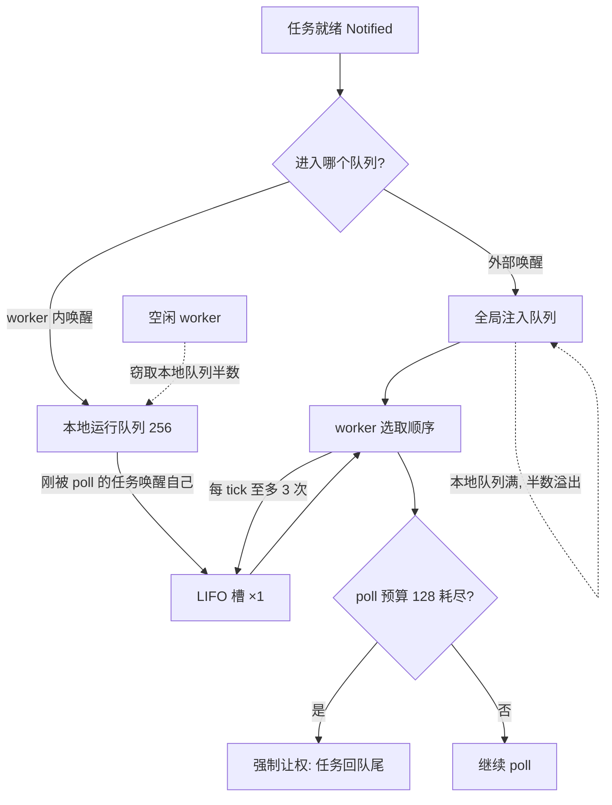
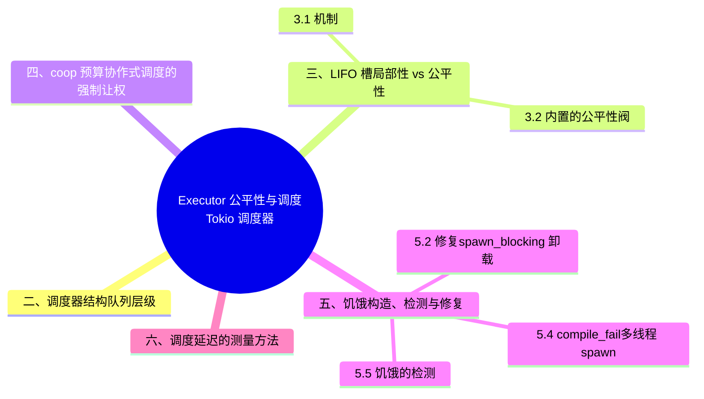

> **内容分级**: [专家级]

# Executor 公平性与调度：Tokio 调度器 internals

> **EN**: Executor Fairness and Scheduling
> **Summary**: Inside Tokio's work-stealing scheduler: local queues, the LIFO slot and its fairness trade-offs, starvation scenarios and their detection, the coop poll budget, a thread-per-core comparison with glommio, and practical methods for measuring scheduling latency.
>
> **受众**: [进阶]
> **Bloom 层级**: L3-L4
> **权威来源**: 本文件为 `concept/` 权威页（executor 公平性与调度视角）。
> **分工声明**: Future/poll/waker 协议与 executor 的**职责模型**留在 [Future 与 Executor 机制](04_future_and_executor_mechanisms.md)；[Async 边界全景](06_async_boundary_panorama.md) §7 只做 executor 契约的边界汇总。本页专攻**调度器内部**：work-stealing 队列结构、LIFO 槽的公平性权衡、饥饿的构造/检测/修复、coop 预算、与 glommio thread-per-core 的对比、调度延迟测量。互不重复（AGENTS.md §2 Canonical 规则）。
> **A/S/P 标记**: **S** — Structure
> **双维定位**: C×Ana — 分析协作式调度下公平性不变量的成立条件与失效模式
> **定位**: 把「tokio 会公平地调度任务」这一模糊信念拆解为可验证的机制事实：任务在哪个队列、谁决定下一个 poll 谁、什么模式让公平性失效、失效如何测量与修复。
> **前置概念**: [Future 与 Executor 机制](04_future_and_executor_mechanisms.md) · [Async/Await](01_async.md) · [Pin 与 Unpin](08_pin_unpin.md)
> **后置概念**: [Stream 代数与背压](09_stream_algebra_and_backpressure.md) · [Async 取消安全](05_async_cancellation_safety.md) · [Memory Management](../../02_intermediate/02_memory_management/01_memory_management.md)

---

> **Rust 版本**: 1.97.0+ (Edition 2024) · Tokio 1.x
> **来源**: [Carl Lerche — Making the Tokio scheduler 10x faster](https://tokio.rs/blog/2019-10-scheduler) · [Blumofe & Leiserson — Scheduling Multithreaded Computations by Work Stealing (JACM 1999)](https://www.lri.fr/~marche/ens/mpri/2-36-1/reading/blumofe-leiserson99.pdf) · [glommio docs](https://docs.rs/glommio/latest/glommio/)（以上 2026-07-12 curl 实测 HTTP 200）
> **国际权威来源（2026-07-13 补录）**: **P0** [Async Book — Execution 章](https://rust-lang.github.io/async-book/02_execution/01_chapter.html) · **P1** [Herlihy & Shavit — The Art of Multiprocessor Programming（Morgan Kaufmann）](https://dl.acm.org/doi/book/10.5555/2385452)（work-stealing 调度与无锁队列的理论基础；curl 实测 2026-07-13，ACM 反爬注记同前页）
> **对应 Crate**: [`c06_async`](../../../crates/c06_async)
> **对应练习**: [`exercises/src/async_programming/`](../../../exercises/src/async_programming)

**变更日志**:

- v1.0 (2026-07-12): 初始版本（W4-2）— work-stealing/LIFO/coop 机制事实（对齐 tokio 1.52.3 源码常量实测）+ 饥饿反例与修复（rustc 1.97.0 --edition 2024 实测运行）

## 📑 目录

- [Executor 公平性与调度：Tokio 调度器 internals](#executor-公平性与调度tokio-调度器-internals)
  - [📑 目录](#-目录)
  - [一、认知路径](#一认知路径)
  - [二、调度器结构：队列层级](#二调度器结构队列层级)
  - [三、LIFO 槽：局部性 vs 公平性](#三lifo-槽局部性-vs-公平性)
    - [3.1 机制](#31-机制)
    - [3.2 内置的公平性阀](#32-内置的公平性阀)
  - [四、coop 预算：协作式调度的强制让权](#四coop-预算协作式调度的强制让权)
  - [五、饥饿：构造、检测与修复](#五饥饿构造检测与修复)
    - [5.1 反例：CPU 密集任务阻塞 worker](#51-反例cpu-密集任务阻塞-worker)
    - [5.2 修复：`spawn_blocking` 卸载](#52-修复spawn_blocking-卸载)
    - [5.3 半修复的陷阱：`yield_now` 经 LIFO 槽立即重入](#53-半修复的陷阱yield_now-经-lifo-槽立即重入)
    - [5.4 compile\_fail：多线程 spawn 的 Send 约束](#54-compile_fail多线程-spawn-的-send-约束)
    - [5.5 饥饿的检测](#55-饥饿的检测)
  - [六、调度延迟的测量方法](#六调度延迟的测量方法)
  - [七、glommio 对比：thread-per-core 的另一种公平](#七glommio-对比thread-per-core-的另一种公平)
  - [八、工程检查清单](#八工程检查清单)
  - [九、相关概念](#九相关概念)
  - [十、来源](#十来源)
  - [🧭 思维导图（Mindmap）](#-思维导图mindmap)

## 一、认知路径



阅读顺序：**结构（§2）⟹ 两个公平性机制（§3-4）⟹ 失效模式（§5）⟹ 测量（§6）⟹ 替代设计（§7）**。核心问题只有一个：协作式调度没有抢占，公平性完全由「队列纪律 + 预算」两条机制提供——本页就是这两条机制的成立条件与失效边界的清单。

## 二、调度器结构：队列层级

Tokio 多线程调度器是 Blumofe-Leiserson work-stealing 的特化实现。每个 worker 维护三级存储（常量均取自 tokio 1.52.3 源码）：

| 层级 | 容量 | 入队来源 | 出队消费者 |
|---|---|---|---|
| LIFO 槽（`lifo_slot`） | 1 | 当前 worker 刚 poll 的任务唤醒的就绪任务 | 仅本 worker，优先于一切 |
| 本地运行队列 | 256 | 本 worker 内 spawn/唤醒的任务；全局队列批量拉取 | 本 worker（LIFO 端）；其他 worker 可窃取（FIFO 端） |
| 全局注入队列 | 无界 | runtime 外部唤醒（如 blocking 池、信号） | 各 worker 批量拉取 |

三条结构事实：

1. **窃取方向相反**：本地队列是双端结构——属主从一端取（新任务，缓存热），窃贼从另一端取（老任务，降低竞争）。这就是 Blumofe-Leiserson 框架的核心不等式来源：窃取只发生在 worker 空闲时，期望窃取次数有界 ⟹ 总调度开销对任务数线性。
2. **溢出路径**：本地队列满（256）时，半数任务被推到全局队列 ⟹ 单个 worker 的热点 burst 不会丢任务，但全局队列成为所有 worker 的竞争点。
3. **无优先级**：tokio 没有任务优先级概念。公平性的全部来源是队列纪律（§3-4），「重要任务优先」必须用独立 runtime 或通道隔离手工实现。

> **定理 T1（work-stealing 有界性，Blumofe-Leiserson）**：对完全严格（fully strict）的多线程计算，P 个 worker 的 work-stealing 调度期望执行时间 ≤ T₁/P + O(T∞)，期望窃取次数 O(P·T∞) ⟹ **只要任务足够细粒度（T∞ 小），调度器开销可忽略；任务粒度越粗、依赖链越长，窃取补偿越频繁，公平性越依赖 §3-4 的纪律机制**。

## 三、LIFO 槽：局部性 vs 公平性

本节剖析 work-stealing 执行器的 LIFO 槽：3.1 解释其缓存局部性收益的机制，3.2 给出运行时（Runtime）内置的公平性阀门。

### 3.1 机制

Carl Lerche 在 *Making the Tokio scheduler 10x faster* 中记录的核心优化：任务 A 在 poll 中唤醒了任务 B（典型的消息传递模式：channel 发送端唤醒接收端），B 不进队列尾部，而是进本 worker 的 **LIFO 槽**，下一个被 poll 的就是 B。

收益是 cache 局部性：A 刚碰过的数据（channel 内部状态、消息本身）还在 L1/L2，B 立即消费 ⟹ 消息传递模式的吞吐提升一个数量级（博文标题即实测结论）。

代价是公平性风险：若 A 和 B 互相唤醒（ping-pong），二者可能垄断 worker，饿死队列里的其他任务。

### 3.2 内置的公平性阀

tokio 用两个机制约束 LIFO 槽（源码实测常量）：

- **`MAX_LIFO_POLLS_PER_TICK = 3`**：连续从 LIFO 槽取任务至多 3 次，之后强制检查全局队列 ⟹ ping-pong 对垄断 worker 的时间有界。
- **LIFO 槽不可窃取但会被清空**：worker 核心被窃取时，LIFO 槽里的任务被挪回运行队列 ⟹ 槽内任务不会被独占到 worker 之外不可达。

> **定理 T2（LIFO 公平性界）**：LIFO 槽深度 1 + 每 tick 至多 3 次 LIFO 调度 ⟹ **任何就绪任务被 LIFO 机制延迟的时间有界于 O(tick 长度)**；真正的饥饿风险不在 LIFO 槽，而在「单个任务不返回」（§5）。

⟸ 反向判别：**消息传递吞吐远低于预期且 CPU 缓存 miss 率高 ⟸ 任务被强制走全局队列（如 runtime 配了 `disable_lifo_slot` 或任务跨 worker 唤醒）⟸ LIFO 局部性失效**。

## 四、coop 预算：协作式调度的强制让权

协作式调度的根本弱点：future 的 `poll` 不返回，调度器毫无办法。tokio 的第二道防线是 **coop（cooperative scheduling）预算**：

- 每个任务每个 tick 的 poll 预算为 **128**（`Budget(Some(128))`，tokio 1.52.3 实测）。
- 某些「逻辑上应让权」的操作（如 `yield_now`、通道操作中的 poll）消耗预算；预算耗尽时，即使 `Poll::Ready` 就绪，任务也被强制重新入队，调度器转去 poll 其他任务。
- `tokio::task::unconstrained` / `coop::unconstrained` 可暂停预算（用于自实现底层原语，业务代码几乎不应使用）。

> **定理 T3（预算⟹有界响应）**：poll 预算 128 + LIFO 上限 3 ⟹ **单个 worker 上「不主动 await 的任务」对同队任务造成的额外延迟有界于 O(128 × 平均 poll 时长)**；注意预算约束的是「Ready 风暴」（任务反复立即就绪），**约束不了「单次 poll 内部不返回」**——后者是 §5 的饥饿场景，唯一的解是把工作移出 poll。

> **过渡**：机制层面 tokio 已经做了能做的一切——队列纪律管住了「任务级」公平，预算管住了「poll 次数级」公平。但协作式调度有一条任何调度器都救不了的边界：poll 内部的黑洞。

## 五、饥饿：构造、检测与修复

本节把饥饿当作可构造的现象处理：5.1 先给出 CPU 密集任务阻塞 worker 的反例，再展开检测与修复手段。

### 5.1 反例：CPU 密集任务阻塞 worker

```rust
use std::time::{Duration, Instant};

#[tokio::main(flavor = "current_thread")] // 单线程运行时把问题放大到可见
async fn main() {
    // 饥饿受害者：一个每 10ms 想醒一次的计时任务。
    let victim = tokio::spawn(async {
        let mut delays = Vec::new();
        let mut last = Instant::now();
        for _ in 0..5 {
            tokio::time::sleep(Duration::from_millis(10)).await;
            delays.push(last.elapsed());
            last = Instant::now();
        }
        delays
    });

    tokio::task::yield_now().await; // 让 victim 先起跑

    // 加害者：纯计算、零 await 的 200ms 忙循环。
    // 在 current_thread 运行时上，它会独占唯一 worker，victim 的定时器全部超时触发。
    let hog_start = Instant::now();
    let mut acc = 0u64;
    while hog_start.elapsed() < Duration::from_millis(200) {
        acc = acc.wrapping_add(1);
    }
    std::hint::black_box(acc);

    let delays = victim.await.expect("victim");
    let worst = delays.iter().max().expect("samples");
    println!("worst timer delay during CPU hog: {worst:?} (expected ~10ms)");
    assert!(*worst > Duration::from_millis(100), "starvation must be observable");
}
```

实测：`worst timer delay during CPU hog: 200.1103ms`——10ms 定时器被延迟 20 倍。多线程运行时下同样的代码饿死的是**同一个 worker 队列里的全部任务**（其他 worker 可窃取老任务，但 LIFO 槽与本地队列头部的新任务仍被阻塞），危害更隐蔽。

### 5.2 修复：`spawn_blocking` 卸载

```rust
use std::time::{Duration, Instant};

#[tokio::main(flavor = "current_thread")]
async fn main() {
    let victim = tokio::spawn(async {
        let mut delays = Vec::new();
        let mut last = Instant::now();
        for _ in 0..5 {
            tokio::time::sleep(Duration::from_millis(10)).await;
            delays.push(last.elapsed());
            last = Instant::now();
        }
        delays
    });

    tokio::task::yield_now().await;

    // 修复：重计算进入 blocking 线程池，不再占用驱动定时器的 async worker。
    let heavy = tokio::task::spawn_blocking(|| {
        let start = Instant::now();
        let mut acc = 0u64;
        while start.elapsed() < Duration::from_millis(200) {
            acc = acc.wrapping_add(1);
        }
        std::hint::black_box(acc);
    });

    heavy.await.expect("blocking");
    let delays = victim.await.expect("victim");
    let worst = delays.iter().max().expect("samples");
    println!("worst timer delay after spawn_blocking fix: {worst:?}");
    assert!(*worst < Duration::from_millis(50), "starvation fixed");
}
```

实测：`worst timer delay after spawn_blocking fix: 21.5924ms`——回到正常水位（current_thread 下定时器本身有毫秒级调度粒度，残余偏差来自计时器合并）。

### 5.3 半修复的陷阱：`yield_now` 经 LIFO 槽立即重入

直觉修法是忙循环里插 `yield_now().await`——但 `yield_now` 唤醒的正是**自己**，于是自己进 LIFO 槽，几乎立即被重新调度：

```rust
use std::time::{Duration, Instant};

#[tokio::main(flavor = "current_thread")]
async fn main() {
    let victim = tokio::spawn(async {
        let mut delays = Vec::new();
        let mut last = Instant::now();
        for _ in 0..3 {
            tokio::time::sleep(Duration::from_millis(10)).await;
            delays.push(last.elapsed());
            last = Instant::now();
        }
        delays
    });
    tokio::task::yield_now().await;

    // 忙循环中周期性 yield_now：任务经 LIFO 槽几乎立即被重新调度，
    // victim 的定时器要等 coop 预算耗尽、调度器扫全局队列/定时器才推进。
    let mut acc = 0u64;
    let start = Instant::now();
    while start.elapsed() < Duration::from_millis(30) {
        acc = acc.wrapping_add(1);
        if acc % 100_000 == 0 {
            tokio::task::yield_now().await;
        }
    }
    std::hint::black_box(acc);

    let delays = victim.await.expect("victim");
    let worst = delays.iter().max().expect("samples");
    println!("worst delay with yield_now-only fix: {worst:?} (still > 10ms on this machine)");
}
```

实测：`16.8ms > 10ms`——有改善但仍超标。`yield_now` 的正确用途是**打破 Ready 风暴中的自相拥**（配合 coop 预算），不是给 CPU 黑洞打补丁。判定：若两次 yield 之间的工作 > 目标延迟预算，`yield_now` 救不了你，只有 `spawn_blocking` 或拆分 await 点能救。

### 5.4 compile_fail：多线程 spawn 的 Send 约束

调度公平性的类型级前提：多线程 worker 可窃取任何任务 ⟹ 任务必须 `Send`。类型系统（Type System）把这条调度不变量提前到编译期：

```rust,compile_fail
use std::rc::Rc;

#[tokio::main(flavor = "multi_thread")]
async fn main() {
    let rc = Rc::new(42u32);
    // ERROR: future cannot be sent between threads safely
    // `tokio::spawn` 要求 F: Send + 'static，因为任务可能被任意 worker 窃取。
    tokio::spawn(async move {
        println!("{rc}");
    })
    .await
    .expect("spawn");
}
```

若确实需要非 Send 状态：用 `LocalSet` + `spawn_local`（钉在当前线程，不参与窃取——公平性语义随之改变：该任务只能被本线程调度，饥饿风险上升），或把非 Send 状态包进 `Mutex`/`spawn_blocking` 闭包（Closures）。

### 5.5 饥饿的检测

- **定时器偏差探针**（本页 §5.1 的 victim 模式）：常驻一个高频定时任务，记录 `实际唤醒间隔 − 名义间隔` 的分布；p99 偏差 > 10× 名义值即告警。这是成本最低、最灵敏的饥饿金丝雀。
- **tokio-console**：观测任务的 `poll time` 直方图与 `idle/busy` 比；单个任务 poll 时长 > 毫秒级即定位黑洞。
- **metrics**：`RuntimeMetrics` 的 `worker_mean_poll_time`、`injection_queue_depth`、`worker_local_queue_depth` 持续高位 ⟸ 队列积压 ⟸ 消费速率不足或存在长 poll。

## 六、调度延迟的测量方法

定义 **调度延迟** = 任务就绪（spawn/wake）→ 首次被 poll 的墙钟间隔。直接测量：

```rust
use std::time::Instant;
use tokio::sync::mpsc;

#[tokio::main(flavor = "multi_thread", worker_threads = 4)]
async fn main() {
    let (tx, mut rx) = mpsc::channel::<u128>(1024);

    for _ in 0..1000 {
        let tx = tx.clone();
        let enqueued = Instant::now();
        tokio::spawn(async move {
            let latency = enqueued.elapsed().as_micros();
            let _ = tx.send(latency).await;
        });
    }
    drop(tx);

    let mut samples = Vec::new();
    while let Some(l) = rx.recv().await {
        samples.push(l);
    }
    samples.sort_unstable();
    let p50 = samples[samples.len() / 2];
    let p99 = samples[samples.len() * 99 / 100];
    println!("scheduling latency: p50={p50}us p99={p99}us n={}", samples.len());
}
```

实测（4 worker、空载）：`p50=3us p99=15us`——空载下调度延迟在微秒级。测量要点：① 看 **p99/p999 而非均值**（饥饿是尾部现象）；② 必须在**负载下**重测，空载数字没有信息量；③ 用 `worker_threads=1` 与满核两组对照，分离「队列纪律开销」与「窃取竞争」。

## 七、glommio 对比：thread-per-core 的另一种公平

glommio（Datadog 出品，Linux/io-uring 专用）选择了与 work-stealing 正交的设计：

| 维度 | tokio multi_thread | glommio |
|---|---|---|
| 任务迁移 | worker 间 work-stealing | 无窃取；task 钉在创建它的线程 |
| 公平性来源 | 队列纪律 + coop 预算 | 每线程内按 **task queue 份额（shares）** 加权调度 |
| `Send` 要求 | spawn 的任务必须 Send | 不需要（不跨线程） |
| 数据共享 | 通道/Arc 跨线程 | 鼓励 sharding：每核一份状态，无锁 |
| I/O 后端 | epoll/kqueue/IOCP | io-uring（Linux only） |
| 适用 | 通用服务 | 存储/数据库类：分片状态 + 长尾延迟敏感 |

核心对比点是**公平性的代价模型**：tokio 用窃取补偿负载不均，代价是任务迁移的 cache 失效与 Send 约束；glommio 用「不迁移」换取数据局部性与无锁，代价是**分片不均时无法补偿**——某个核上的热分片只能等自己。选型判定：状态可按 key 干净分片 + 尾部延迟敏感 ⟹ glommio 模型；状态共享广泛或负载不可预测 ⟹ work-stealing。

⟸ 反向判别：**某核 CPU 100% 其余空闲 + p999 爆炸 ⟸ 分片热点 + 无窃取 ⟸ thread-per-core 的固有边界；吞吐随核数亚线性 + 迁移频繁 ⟸ 共享状态过多 ⟸ work-stealing 的 cache 代价显现**。

## 八、工程检查清单

1. 有任何 `poll` 内的循环可能 > 1ms 吗？（有 → `spawn_blocking`，§5.2）
2. 修复饥饿时，确认过不是只用 `yield_now` 自我安慰吗？（§5.3：两次 yield 间工作量 > 延迟预算即无效）
3. 定时器探针的 p99 偏差接入了告警吗？（§5.5）
4. `spawn_local`/`LocalSet` 的使用是否有「非 Send 状态」之外的动机？（无 → 换 `spawn`，避免失去窃取补偿）
5. 压测是否测量了负载下的调度延迟 p99，而非空载？（§6）
6. 选择 thread-per-core 运行时前，分片键的负载均衡被验证过吗？（§7）
7. 是否存在优先级需求被错误地表达为「多 spawn 几个副本」？（tokio 无优先级，§2）

## 九、相关概念

- [Future 与 Executor 机制](04_future_and_executor_mechanisms.md) — poll/waker 协议与 executor 职责模型的权威页
- [Async/Await](01_async.md) — async 状态机与运行时选型基础
- [Stream 代数与背压](09_stream_algebra_and_backpressure.md) — 被背压挂起的任务如何进入/离开调度队列
- [Async 取消安全](05_async_cancellation_safety.md) — 任务被 abort 时的调度路径
- [Pin 与 Unpin](08_pin_unpin.md) — 任务在 worker 间迁移时地址稳定性的保证来源
- [Async 边界全景](06_async_boundary_panorama.md) — executor 契约的边界汇总视角
- [Waker 契约深度解析](12_waker_contract_deep_dive.md) — wake 入队之前的 waker 实现与契约违反目录
- [Tokio 运行时内部机制](../../06_ecosystem/04_web_and_networking/10_tokio_runtime_internals.md) — 本页调度纪律所在的运行时机制权威页（深度见该页）
- [Memory Management](../../02_intermediate/02_memory_management/01_memory_management.md) — 任务状态机的堆分配与迁移代价（L2 向下引用（Reference））

## 十、来源

- [Carl Lerche — *Making the Tokio scheduler 10x faster*（tokio.rs blog, 2019-10）](https://tokio.rs/blog/2019-10-scheduler)（LIFO 槽、窃取、全局队列的设计动机与实测，2026-07-12 实测 200）
- [Blumofe, R. D. & Leiserson, C. E. — *Scheduling Multithreaded Computations by Work Stealing*（JACM 46(5), 1999）](https://www.lri.fr/~marche/ens/mpri/2-36-1/reading/blumofe-leiserson99.pdf)（work-stealing 的 T₁/P + O(T∞) 界与窃取次数分析，PDF 镜像 2026-07-12 实测 200；正式版本见 ACM DOI 10.1145/328973.328974）
- [glommio docs](https://docs.rs/glommio/latest/glommio/)（thread-per-core、shares 加权调度与 io-uring 后端，2026-07-12 实测 200）
- [Tokio docs — `tokio::task`（`yield_now`/`spawn_blocking`/`LocalSet`/`unconstrained`）](https://docs.rs/tokio/latest/tokio/task/) · [`RuntimeMetrics`](https://docs.rs/tokio/latest/tokio/runtime/struct.RuntimeMetrics.html)
- tokio 1.52.3 源码实测常量：`LOCAL_QUEUE_CAPACITY = 256`、`MAX_LIFO_POLLS_PER_TICK = 3`、coop `Budget(128)`（`runtime/scheduler/multi_thread/{worker,queue}.rs`、`task/coop/mod.rs`）
- 站内交叉引用：[Async/Await](01_async.md) · [Async 高级主题](02_async_advanced.md) · [Future 与 Executor 机制](04_future_and_executor_mechanisms.md) · [Async 取消安全](05_async_cancellation_safety.md) · [Async 边界全景](06_async_boundary_panorama.md) · [Pin 与 Unpin](08_pin_unpin.md) · [Stream 代数与背压](09_stream_algebra_and_backpressure.md) · [Pin 投射反例集](11_pin_projection_counterexamples.md)

## 🧭 思维导图（Mindmap）


