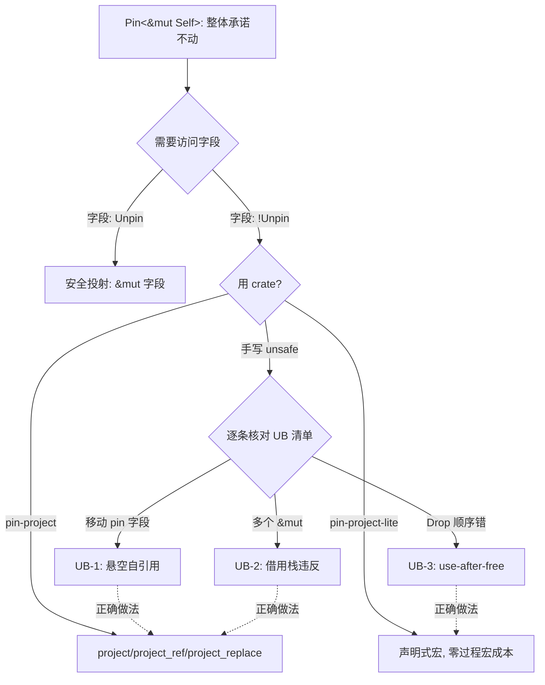
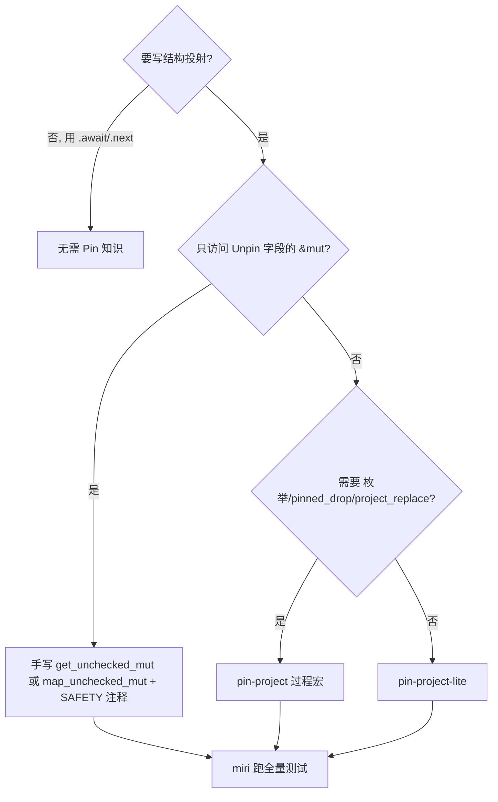

> **内容分级**: [专家级]

# Pin 投射反例集：unsafe 结构投射的 UB 目录与正确模式库

> **EN**: Pin Projection Counterexamples
> **Summary**: A catalog of undefined-behavior patterns in hand-written unsafe pin projections (moving pinned fields, `&mut` aliasing, Drop-order violations) paired with the complete set of correct patterns from pin-project/pin-project-lite, each annotated with its miri-level reasoning.
>
> **受众**: [专家]
> **Bloom 层级**: L3-L4
> **权威来源**: 本文件为 `concept/` 权威页（Pin 投射反例与模式库视角）。
> **分工声明**: Pin/Unpin 的**契约推导与 API**（为什么需要 Pin、`Pin<&mut T>` 的保证、Unpin auto trait）留在 [Pin 与 Unpin](08_pin_unpin.md)。本页只做两件事：① unsafe 手写结构投射的 **UB 反例目录**（每条附 miri 思路）；② pin-project/pin-project-lite 的**正确模式全集**。凡涉及「Pin 是什么/为什么」的问题以 08 为准，本页不重复推导（AGENTS.md §2 Canonical 规则）。
> **A/S/P 标记**: **S** — Structure
> **双维定位**: C×Ana — 分析 pin 不变量在字段级投射下的保持与破坏条件
> **定位**: `Pin<&mut Self>` 保证了「整体不动」，但业务需要的是「字段级访问」——结构投射（structural projection）就是跨越这道缝的技术。本页系统枚举手写投射的全部 UB 模式与全部正确模式，让 unsafe 决策变成查表。
> **前置概念**: [Pin 与 Unpin](08_pin_unpin.md) · [Async/Await](01_async.md) · [Future 与 Executor 机制](04_future_and_executor_mechanisms.md)
> **后置概念**: [Unsafe](../02_unsafe/01_unsafe.md) · [Memory Management](../../02_intermediate/02_memory_management/01_memory_management.md) · [Async 取消安全](05_async_cancellation_safety.md)

---

> **Rust 版本**: 1.97.0+ (Edition 2024) · pin-project 1.1 · pin-project-lite 0.2
> **来源**: [pin-project docs](https://docs.rs/pin-project/latest/pin_project/) · [pin-project-lite docs](https://docs.rs/pin-project-lite/latest/pin_project_lite/) · [Rust Unsafe Code Guidelines](https://rust-lang.github.io/unsafe-code-guidelines/) · [The Rustonomicon](https://doc.rust-lang.org/nomicon/)（以上 2026-07-12 curl 实测 HTTP 200）
> **国际权威来源（2026-07-13 补录）**: **P1** [Jung et al. — RustBelt: Securing the Foundations of Rust（POPL 2018）](https://plv.mpi-sws.org/rustbelt/popl18/)（Pin 不变式所依托的 unsafe/别名语义形式化基础；curl 200 实测 2026-07-13）
> **对应 Crate**: [`c06_async`](../../../crates/c06_async)
> **对应练习**: [`exercises/src/async_programming/`](../../../exercises/src/async_programming)

**变更日志**:

- v1.0 (2026-07-12): 初始版本（W4-3）— 3 个 UB 反例（可编译、miri 思路注解）+ 2 个 compile_fail + 3 个正确模式（rustc 1.97.0 --edition 2024 实测）

## 📑 目录

- [Pin 投射反例集：unsafe 结构投射的 UB 目录与正确模式库](#pin-投射反例集unsafe-结构投射的-ub-目录与正确模式库)
  - [📑 目录](#-目录)
  - [一、认知路径](#一认知路径)
  - [二、投射问题：整体不动 ≠ 字段可动](#二投射问题整体不动--字段可动)
  - [三、UB 反例目录](#三ub-反例目录)
    - [3.1 反例 UB-1：移动被 pin 的字段](#31-反例-ub-1移动被-pin-的字段)
    - [3.2 反例 UB-2：`&mut` 混叠](#32-反例-ub-2mut-混叠)
    - [3.3 反例 UB-3：Drop 顺序违反](#33-反例-ub-3drop-顺序违反)
  - [四、编译期防线：两个 compile\_fail 反例](#四编译期防线两个-compile_fail-反例)
    - [4.1 反例 CE-1：从 `Pin<&mut Self>` 解构移动字段](#41-反例-ce-1从-pinmut-self-解构移动字段)
    - [4.2 反例 CE-2：把投射出的 `Pin<&mut Field>` 当值用](#42-反例-ce-2把投射出的-pinmut-field-当值用)
  - [五、正确模式全集：pin-project](#五正确模式全集pin-project)
  - [六、正确模式：pin-project-lite 与手写 unsafe](#六正确模式pin-project-lite-与手写-unsafe)
    - [6.1 pin-project-lite：声明式宏等价物](#61-pin-project-lite声明式宏等价物)
    - [6.2 手写 unsafe 何时可靠：只投射到 Unpin 字段](#62-手写-unsafe-何时可靠只投射到-unpin-字段)
  - [七、判定树与检查清单](#七判定树与检查清单)
  - [八、相关概念](#八相关概念)
  - [九、来源](#九来源)

## 一、认知路径



阅读顺序：**问题（§2）⟹ 反例（§3-4，先建立恐惧的精确形状）⟹ 正例（§5-6）⟹ 查表决策（§7）**。每条反例给出「miri 思路」——即在 stacked borrows / tree borrows 模型下违反的是哪条公理，而不只是「这样做不对」。

## 二、投射问题：整体不动 ≠ 字段可动

[Pin 与 Unpin](08_pin_unpin.md) 确立的契约：`Pin<&mut T>` 承诺 `T` 的**整体**不再被移动。但实现 `Future::poll`、超时包装、biased select 这类适配器时，必须访问**字段**——把 `Pin<&mut Self>` 拆成「pin 字段的 `Pin<&mut Field>`」+「非 pin 字段的 `&mut Field`」，这就是**结构投射（structural projection）**。

> **定理 T1（投射守恒）**：结构投射是可靠的，当且仅当：① 任何 `!Unpin` 字段始终以 `Pin<&mut Field>` 形式暴露，且其地址在 `Self` 生命周期内不变 ⟹ ② 非 pin 字段可以 `&mut` 自由访问，但**移动它们不得间接触发 pin 字段的移动** ⟹ ③ `Drop` 与 `project_replace` 等整体操作中，pin 字段的析构发生在原处。三条任破其一 ⟹ UB（§3 逐一对应）。

关键洞察：**`Pin` 的契约在类型系统边界之外**。`unsafe { pin.get_unchecked_mut() }` 之后，编译器不再知道任何 pin 不变量，全部责任转移到程序员——这就是反例目录存在的理由。

## 三、UB 反例目录

> **验证方法说明**：以下反例**都能通过编译**（UB 不是编译错误）。检测工具是 miri（`cargo miri run`，项目 `.cargo/config.toml` 已配置 `MIRIFLAGS=-Zmiri-tree-borrows`）。每条注明违反的公理；反例代码经 rustc 1.97.0 实测可编译，运行输出仅作演示，UB 程序的任何输出都不可依赖。

### 3.1 反例 UB-1：移动被 pin 的字段

```rust
//! UB，可编译：手写结构投射后移动被 pin 字段
// miri 思路：`Pin<&mut Self>` 的契约是「字段不再移动」。unsafe 块内拿到
// `&mut self.field` 后 `std::mem::take` 把字段搬走——编译器无法察觉，
// 但自引用结构的指针即刻悬空：经典 UB，miri 下以使用释放后内存报错。
use std::pin::Pin;

struct SelfRef {
    data: String,
    ptr: *const u8, // 指向 data 内部
}

impl SelfRef {
    fn new(s: &str) -> Self {
        let mut this = SelfRef { data: s.to_string(), ptr: std::ptr::null() };
        this.ptr = this.data.as_ptr();
        this
    }
}

fn evil_projection(p: Pin<&mut SelfRef>) {
    // UB 三步：① unsafe 绕过 Pin；② 取字段的可变引用；③ 移动字段。
    let this: &mut SelfRef = unsafe { p.get_unchecked_mut() };
    let stolen = std::mem::take(&mut this.data); // ← 移动了被 pin 的字段
    println!("stolen {stolen} bytes, ptr now dangles at {:p}", this.ptr);
    // 此后若解引用 this.ptr：use-after-move。
}

fn main() {
    let mut v = Box::pin(SelfRef::new("pinned"));
    evil_projection(v.as_mut());
    // 演示到此为止；真实代码中继续使用 v 即踏入未定义行为。
}
```

**违反**：T1-①（pin 字段地址改变）。**正确替代**：pin-project 的 `project()` 根本不会给你 `&mut data`，只给 `Pin<&mut String>`——想移动它，类型上就没有路径（§5）。

### 3.2 反例 UB-2：`&mut` 混叠

```rust
//! UB，可编译：&mut 混叠——同时存在两个可变引用穿透 Pin
// miri 思路：通过裸指针再造一个 &mut SelfRef，违反「可变引用独占」公理。
// stacked borrows 下第二个 &mut 使第一个的标签出栈；tree borrows 下
// 二者互为非法 child——任一模型的 miri 都会在第二次写入时报 UB。
use std::pin::Pin;

struct Pair {
    a: u64,
    b: u64,
}

fn aliased(p: Pin<&mut Pair>) {
    let r1: &mut Pair = unsafe { p.get_unchecked_mut() };
    // get_unchecked_mut 消耗了 p；下面用裸指针强行再造一个 &mut：
    let raw = r1 as *mut Pair;
    let r2: &mut Pair = unsafe { &mut *raw }; // ← 与 r1 混叠的第二个 &mut
    r1.a = 1;
    r2.b = 2; // miri: UB，r2 的创建已使 r1 的标签失效
    println!("{} {}", r1.a, r2.b);
}

fn main() {
    let mut v = Box::pin(Pair { a: 0, b: 0 });
    aliased(v.as_mut());
}
```

**违反**：Rust 引用规则的独占公理（与 pin 无关但常与手写投射结伴出现——`get_unchecked_mut` 是混叠的常见入口）。**正确替代**：需要同时改两个字段就用一次 `project()` 拿到结构化的投射体，字段间是**拆分借用（split borrow）**而非混叠。

### 3.3 反例 UB-3：Drop 顺序违反

```rust
//! UB，可编译：Drop 顺序违反——自引用结构中所有者被提前释放
// miri 思路：Drop impl 内 take 走所有者字段后再读指向它的裸指针，
// 即 use-after-free。字段的自动析构顺序（声明逆序…实为声明顺序的逆）
// 保护不了「手动提前 drop」的模式。
struct OwnerFirst {
    buf: Vec<u8>,      // 先声明 → 先析构
    ptr: *const u8,    // 后声明 → 后析构
}

impl Drop for OwnerFirst {
    fn drop(&mut self) {
        // 注意：自动析构路径下，drop() 运行时字段全部存活，此行合法；
        // 真正的陷阱在下面的 ManuallyFreed。
        unsafe { println!("reading {} via ptr (still valid here)", *self.ptr) };
    }
}

struct ManuallyFreed {
    buf: Option<Vec<u8>>,
    ptr: *const u8,
}

impl Drop for ManuallyFreed {
    fn drop(&mut self) {
        let freed = self.buf.take(); // ① 提前释放所有者
        drop(freed);
        unsafe { println!("{}", *self.ptr) }; // ② use-after-free（miri 报错）
    }
}

fn main() {
    let mut a = OwnerFirst { buf: vec![1, 2, 3], ptr: std::ptr::null() };
    a.ptr = a.buf.as_ptr();
    drop(a);

    let mut b = ManuallyFreed { buf: Some(vec![4, 5, 6]), ptr: std::ptr::null() };
    b.ptr = b.buf.as_ref().unwrap().as_ptr();
    drop(b); // miri 下此处触发 use-after-free；实测输出为不确定值（演示运行输出 32）
}
```

**违反**：T1-③（pin 字段的析构未发生在原处/正确时机）。自引用结构的第一规则：**引用者先析构，所有者后析构**；任何 `take`/`ManuallyDrop`/`mem::replace` 介入字段生命周期都要重新论证顺序。pin-project 的 `#[pinned_drop]` 把这条规则结构化：pinned drop 体里只能拿到 `Pin<&mut Self>` 的投射，无法 `take` 走 pin 字段。

> **过渡**：三个 UB 反例的共同形态是「`get_unchecked_mut` 之后一切靠自觉」。编译器并非全然袖手旁观——不写 unsafe 的越界会被类型系统直接拦下，这就是 §4 的两条编译期防线。

## 四、编译期防线：两个 compile_fail 反例

### 4.1 反例 CE-1：从 `Pin<&mut Self>` 解构移动字段

```rust,compile_fail
use std::pin::Pin;

struct Holder {
    name: String,
}

fn destructure(p: Pin<&mut Holder>) {
    let Holder { name } = *p; // ERROR[E0507]: cannot move out of dereference of Pin<&mut Holder>
    println!("{name}");
}

fn main() {
    let v = Box::pin(Holder { name: "x".into() });
    destructure(v);
}
```

`DerefMut` 目标被 pin 住，解构即移动 ⟹ 编译期拒绝。这道防线只在「不经 unsafe」时存在。

### 4.2 反例 CE-2：把投射出的 `Pin<&mut Field>` 当值用

```rust,compile_fail
use pin_project::pin_project;
use std::pin::Pin;

#[pin_project]
struct Guard {
    #[pin]
    state: String,
}

impl Guard {
    fn steal(self: Pin<&mut Self>) -> String {
        let this = self.project();
        // this.state 的类型是 Pin<&mut String>，不能直接当 String 用：
        let s: String = this.state; // ERROR[E0308]: expected String, found Pin<&mut String>
        s
    }
}

fn main() {}
```

pin-project 的设计让「移动 pin 字段」在类型层面无路径可走：投射体里 pin 字段的类型是 `Pin<&mut T>`，不是 `T`。

> **定理 T2（两道防线的分工）**：不经 unsafe ⟹ 类型系统保证 T1 全部三条（CE-1/CE-2 是边界的两个面）；一经 `get_unchecked_mut` ⟹ 编译器退出，T1 的三条全部由程序员手工维持（UB-1/2/3 是失守的三个面）。⟹ **unsafe 投射的论证义务 = 逐条重证 T1**。

⟸ 反向判别：**自引用结构偶发崩溃/数据错乱且崩溃点远离改动点 ⟸ 某处 unsafe 投射破坏了地址稳定性（UB-1）或析构顺序（UB-3）⟸ 用 miri 复现，定位到违反的 T1 条款**。

## 五、正确模式全集：pin-project

pin-project 以过程宏生成**唯一可靠**的投射代码，模式全集如下：

| 模式 | 方法 | 返回 | 用途 |
|---|---|---|---|
| 可变投射 | `project()` | `Projection<'_>`：pin 字段 `Pin<&mut T>`，其余 `&mut T` | poll 实现、状态更新 |
| 共享投射 | `project_ref()` | `ProjectionRef<'_>`：pin 字段 `Pin<&T>`，其余 `&T` | 只读访问 |
| 整体替换 | `project_replace(v)`（需 `#[pin_project(project_replace)]`） | `ProjectionOwned`：pin 字段已原位 drop（以 `PhantomData` 占位返回），非 pin 字段**按值**返回 | 重置/重建 `!Unpin` 状态 |
| pinned drop | `#[pinned_drop]` + `impl PinnedDrop` | drop 体中只能 `project()`，无法 move pin 字段 | 自引用结构的安全析构 |

可编译全集示例：

```rust
use pin_project::pin_project;
use std::future::Future;
use std::pin::Pin;
use std::task::{Context, Poll};

// project_replace 需显式启用：#[pin_project(project_replace)]
#[pin_project(project_replace)]
struct BiasedPipe<Fut> {
    #[pin]
    fut: Fut,          // 结构投射：!Unpin 字段，投射为 Pin<&mut Fut>
    buf: Vec<u8>,      // 非 pin 字段：投射为 &mut Vec<u8>
    label: String,
}

fn make_fut(v: u32) -> impl Future<Output = u32> {
    async move { v } // 同一 opaque 类型，可整体替换
}

impl<Fut: Future<Output = u32>> BiasedPipe<Fut> {
    fn poll_count(mut self: Pin<&mut Self>, cx: &mut Context<'_>) -> Option<u32> {
        let this = self.as_mut().project(); // 编译期保证的结构投射
        this.buf.push(1);                   // &mut Vec<u8>：自由修改
        this.label.push('.');               // &mut String
        match this.fut.poll(cx) {
            Poll::Ready(v) => Some(v),
            Poll::Pending => None,
        }
    }
}

#[tokio::main]
async fn main() {
    let pipe = BiasedPipe { fut: make_fut(7), buf: vec![], label: "p".into() };
    tokio::pin!(pipe);
    let mut cx = Context::from_waker(std::task::Waker::noop());
    assert_eq!(pipe.as_mut().poll_count(&mut cx), Some(7));

    // project_replace：以新值整体替换，旧的 pin 字段被原位安全 drop。
    let replaced = pipe.as_mut().project_replace(BiasedPipe {
        fut: make_fut(9),
        buf: Vec::new(),
        label: "reset".into(),
    });
    // ProjectionOwned：pin 字段以 PhantomData 占位返回（已原位 drop），
    // 非 pin 字段按值返回——移动它们无需任何 unsafe。
    let _old_buf: Vec<u8> = replaced.buf;
    let _old_label: String = replaced.label;
    assert_eq!(pipe.as_mut().poll_count(&mut cx), Some(9));
    println!("pin-project ok");
}
```

## 六、正确模式：pin-project-lite 与手写 unsafe

### 6.1 pin-project-lite：声明式宏等价物

不需要枚举变体投射、`#[pinned_drop]`、`project_replace` 时，pin-project-lite 以声明宏提供同一安全保证，编译成本显著低于过程宏：

```rust
use pin_project_lite::pin_project;
use std::future::Future;
use std::pin::Pin;
use std::task::{Context, Poll};

pin_project! {
    struct Throttled<Fut> {
        #[pin]
        inner: Fut,
        quota: u32,
    }
}

impl<Fut: Future<Output = u32>> Future for Throttled<Fut> {
    type Output = u32;
    fn poll(self: Pin<&mut Self>, cx: &mut Context<'_>) -> Poll<u32> {
        let this = self.project();
        if *this.quota == 0 {
            return Poll::Ready(0);
        }
        *this.quota -= 1;
        this.inner.poll(cx)
    }
}

#[tokio::main]
async fn main() {
    let t = Throttled { inner: async { 42u32 }, quota: 3 };
    assert_eq!(t.await, 42);
    println!("pin-project-lite ok");
}
```

选型：只要 `project()`/`project_ref()` 且结构简单 ⟹ lite（编译快、无 syn 依赖链）；需要枚举、`project_replace`、`#[pinned_drop]`、UnsafeUnpin ⟹ pin-project。

### 6.2 手写 unsafe 何时可靠：只投射到 Unpin 字段

唯一推荐的手写场景：结构整体 `!Unpin`，但**只需 `&mut` 访问一个自身 `Unpin` 的字段**。此时移动该字段不违反任何 pin 不变量（pin 保护的是 `!Unpin` 状态的地址）：

```rust
use std::marker::PhantomPinned;
use std::pin::Pin;

struct Cfg<F> {
    handler: F,              // Unpin 字段（F: Unpin）
    _pinned: PhantomPinned,  // 结构整体 !Unpin
}

impl<F> Cfg<F> {
    // 可靠手写：只投射到 Unpin 字段 handler，返回 &mut F。
    fn handler_mut(self: Pin<&mut Self>) -> &mut F {
        // SAFETY: 仅访问 Unpin 字段，不移动任何 !Unpin 状态；
        // 不返回 Pin<&mut F>，因此调用者无法对 handler 施加 pin 语义错误。
        unsafe { &mut self.get_unchecked_mut().handler }
    }
}

fn main() {
    let mut c = Box::pin(Cfg { handler: 10u32, _pinned: PhantomPinned });
    *c.as_mut().handler_mut() += 1;
    println!("manual projection ok: {}", c.handler);
}
```

即使这种场景，也应优先 `Pin::map_unchecked_mut`（整体重指向，语义更显式）。手写投射到 `!Unpin` 字段（返回 `Pin<&mut Field>`）在 99% 的代码库里都应是「换成 pin-project」的信号——SAFETY 注释需要重证 T1 全部三条，而 pin-project 用类型替你证完。

## 七、判定树与检查清单



unsafe 投射的 SAFETY 注释检查清单（每条对应一个 §3 反例）：

1. 是否移动了任何 `!Unpin` 字段（含 `mem::take`/`replace`/`swap`、解构、按值返回）？（UB-1）
2. 是否存在两个同时活跃的 `&mut` 穿透同一 pin？（UB-2）
3. Drop/重置路径上，pin 字段是否原位析构、引用者先于所有者？（UB-3）
4. 暴露给调用者的类型是否仍是 `Pin<&mut Field>`，而非 `&mut Field`？（CE-2 的反面）
5. miri（tree-borrows）下全量测试通过？

⟸ 反向判别：**miri 报 stacked/tree borrows 违反且栈轨迹经过 `get_unchecked_mut` ⟸ 手写投射违反了 T1 某条 ⟸ 按本页 §3 对号入座，替换为 §5-6 的 crate 模式**。

## 八、相关概念

- [Pin 与 Unpin](08_pin_unpin.md) — Pin 契约与 API 的权威页（本页的概念前提，分工见文首声明）
- [Async/Await](01_async.md) — async 状态机为何产生 `!Unpin` future
- [Future 与 Executor 机制](04_future_and_executor_mechanisms.md) — 手写 `poll` 时投射的实际使用场景
- [Async 取消安全](05_async_cancellation_safety.md) — drop 即取消路径上的析构顺序（与 UB-3 同族）
- [Async 边界全景](06_async_boundary_panorama.md) — Pin 边界的全景汇总视角
- [Unsafe](../02_unsafe/01_unsafe.md) — unsafe 论证义务的一般框架
- [Memory Management](../../02_intermediate/02_memory_management/01_memory_management.md) — 移动/析构/借用规则的 L2 权威页（向下引用）

## 九、来源

- [pin-project docs](https://docs.rs/pin-project/latest/pin_project/)（`project`/`project_ref`/`project_replace`/`#[pinned_drop]` 的契约与 ProjectionOwned 语义，2026-07-12 实测 200；`project_replace` 需 `#[pin_project(project_replace)]` 显式启用的行为经 1.1.11 源码与编译实测确认）
- [pin-project-lite docs](https://docs.rs/pin-project-lite/latest/pin_project_lite/)（声明式宏投射的适用范围与限制，2026-07-12 实测 200）
- [Rust Unsafe Code Guidelines](https://rust-lang.github.io/unsafe-code-guidelines/)（引用独占、裸指针与别名模型的规范性讨论，2026-07-12 实测 200）
- [The Rustonomicon](https://doc.rust-lang.org/nomicon/)（`mem::replace`/析构顺序/`Pin` 的 unsafe 语义，2026-07-12 实测 200）
- [std docs — `std::pin`](https://doc.rust-lang.org/std/pin/index.html)（pinning 不变的官方表述）
- 站内交叉引用：[Async/Await](01_async.md) · [Async 高级主题](02_async_advanced.md) · [Future 与 Executor 机制](04_future_and_executor_mechanisms.md) · [Async 取消安全](05_async_cancellation_safety.md) · [Async 边界全景](06_async_boundary_panorama.md) · [Pin 与 Unpin](08_pin_unpin.md) · [Stream 代数与背压](09_stream_algebra_and_backpressure.md) · [Executor 公平性与调度](10_executor_fairness_and_scheduling.md)
