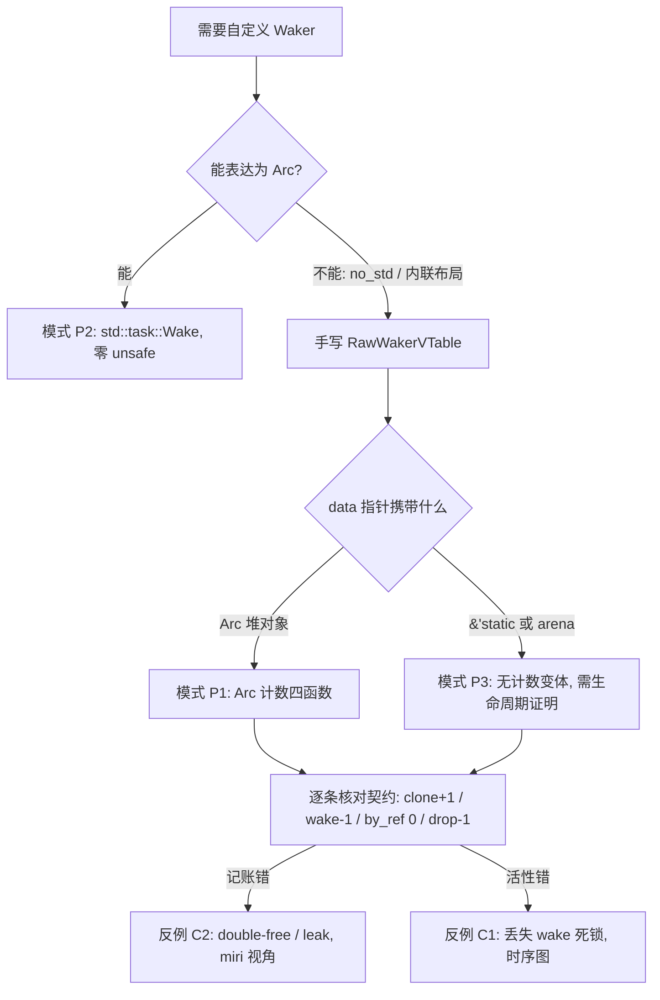
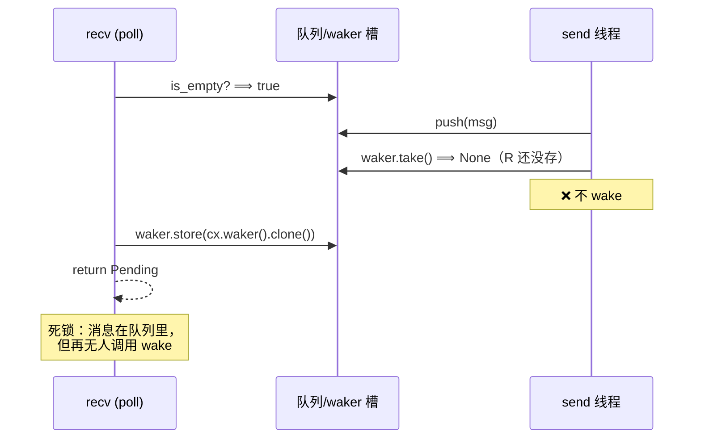
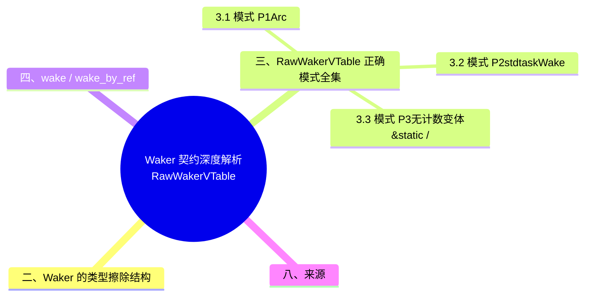

> **内容分级**: [专家级]

# Waker 契约深度解析：RawWakerVTable 实现与契约违反反例集

> **EN**: Waker Contract Deep Dive
> **Summary**: A complete analysis of the Waker contract at the implementation level: the correct pattern repertoire for hand-written `RawWakerVTable`s (Arc-counting, `Wake`-trait, and inline variants), the precise semantics of `wake`/`wake_by_ref` (wake must trigger a re-poll; spurious wakes are legal), and a catalog of contract violations (lost wake deadlock shown with a timing diagram and loom-style reasoning; double-free via incorrect clone/drop accounting shown with miri-level reasoning).
>
> **受众**: [专家]
> **Bloom 层级**: L3-L4
> **权威来源**: 本文件为 `concept/` 权威页（Waker 实现层与契约违反目录视角）。
> **分工声明**: Waker 的**契约概述**（poll⟹Pending⟹已注册、活性三反例、活性调试决策树）与 **VTable 概念性代码**统一维护在 [Async/Await §8.8/§8.9](01_async.md#88-waker-契约与活性)，[Async 高级主题 §8.8/8.9](02_async_advanced.md) 为其高级摘要。本页只做两件事：① `RawWakerVTable` 手工实现的**正确模式全集**（全部 rustc 1.97 实测可编译）；② 契约违反的**反例目录**（时序图 / loom 思路 / miri 思路）。凡涉及「Waker 契约是什么」的问题以 01 为准，本页不重复推导（AGENTS.md §2 Canonical 规则）。
> **A/S/P 标记**: **S** — Structure
> **双维定位**: C×Ana — 分析 Waker 类型擦除结构下引用计数记账与活性契约的保持与破坏条件
> **定位**: `Waker` 是 async Rust 唯一的唤醒原语，也是唯一要求程序员手写 unsafe 才能自造的核心抽象。本页把「正确实现」变成查表，把「错误实现」变成可识别的反例指纹。
> **前置概念**: [Async/Await](01_async.md) · [Future 与 Executor 机制](04_future_and_executor_mechanisms.md) · [Pin 与 Unpin](08_pin_unpin.md)
> **后置概念**: [Executor 公平性与调度](10_executor_fairness_and_scheduling.md) · [Tokio 运行时内部机制](../../06_ecosystem/04_web_and_networking/10_tokio_runtime_internals.md) · [Unsafe](../02_unsafe/01_unsafe.md)

---

> **Rust 版本**: 1.97.0+ (Edition 2024)
> **来源**: [std::task::Wake](https://doc.rust-lang.org/std/task/trait.Wake.html) · [std::task::RawWakerVTable](https://doc.rust-lang.org/std/task/struct.RawWakerVTable.html) · [async-book ch2 — Wakers](https://rust-lang.github.io/async-book/02_execution/03_wakeups.html) · [futures task 模块](https://docs.rs/futures/latest/futures/task/)（以上 2026-07-12 curl 实测 HTTP 200）
> **国际权威来源（2026-07-13 补录）**: **P1** [Jung et al. — RustBelt（POPL 2018）](https://plv.mpi-sws.org/rustbelt/popl18/)（unsafe 契约与手工 vtable 协议的形式化判据；curl 200 实测 2026-07-13）
> **对应 Crate**: [`c06_async`](../../../crates/c06_async)
> **对应练习**: [`exercises/src/async_programming/`](../../../exercises/src/async_programming)

**变更日志**:

- v1.0 (2026-07-12): 初始版本（W4-4）— RawWakerVTable 正确模式全集（std-only 完整示例 rustc 1.97.0 --edition 2024 实测运行通过）+ wake 契约精确语义 + 3 个契约违反反例（时序图/loom 思路/miri 思路注解）

## 📑 目录

- [Waker 契约深度解析：RawWakerVTable 实现与契约违反反例集](#waker-契约深度解析rawwakervtable-实现与契约违反反例集)
  - [📑 目录](#-目录)
  - [一、认知路径](#一认知路径)
  - [二、Waker 的类型擦除结构](#二waker-的类型擦除结构)
  - [三、RawWakerVTable 正确模式全集](#三rawwakervtable-正确模式全集)
    - [3.1 模式 P1：Arc 计数四函数（唯一推荐的手写形态）](#31-模式-p1arc-计数四函数唯一推荐的手写形态)
    - [3.2 模式 P2：`std::task::Wake` trait（首选，零 unsafe）](#32-模式-p2stdtaskwake-trait首选零-unsafe)
    - [3.3 模式 P3：无计数变体（`&'static` / arena 数据）](#33-模式-p3无计数变体static--arena-数据)
  - [四、wake / wake\_by\_ref 契约的精确语义](#四wake--wake_by_ref-契约的精确语义)
  - [五、契约违反反例集](#五契约违反反例集)
    - [5.1 反例 C1：丢失 wake ⟹ 死锁（时序图）](#51-反例-c1丢失-wake--死锁时序图)
    - [5.2 反例 C2：vtable 记账错误 ⟹ double-free（miri 视角）](#52-反例-c2vtable-记账错误--double-freemiri-视角)
    - [5.3 反例 C3：Pending 后未保存 waker（R4 违反）](#53-反例-c3pending-后未保存-wakerr4-违反)
  - [六、判定树与检查清单](#六判定树与检查清单)
  - [七、相关概念](#七相关概念)
  - [八、来源](#八来源)
  - [📋 关键属性](#-关键属性)
  - [🔗 概念关系](#-概念关系)
  - [🧭 思维导图（Mindmap）](#-思维导图mindmap)

## 一、认知路径



阅读顺序：**结构（§2）⟹ 正例（§3，先掌握唯一正确的记账方案）⟹ 语义（§4）⟹ 反例（§5，把契约的每条破坏成可识别的指纹）⟹ 查表（§6）**。

## 二、Waker 的类型擦除结构

`Waker` 是一个两指针宽的句柄：`{ data: *const (), vtable: &'static RawWakerVTable }`。执行器把所有任务类型擦除成同一形状，调度队列因此可以同质存放。VTable 的四个函数指针构成一套**引用计数记账协议**：

| VTable 函数 | 语义（std 文档原文要点） | 对 data 持有权的影响 |
|---|---|---|
| `clone` | 复制 waker，返回新 RawWaker | **+1**（新返回的 data 是一份独立持有权） |
| `wake` | 唤醒，**消耗**本次持有权 | **-1**（函数返回后 data 不可再用） |
| `wake_by_ref` | 唤醒，**不消耗**持有权 | **0**（借用语义） |
| `drop` | 释放一份持有权 | **-1** |

> **关键洞察**：`RawWakerVTable` 的契约本质是一条**守恒律**——`Waker` 句柄的总数（显式 clone 产生 +1，`wake`/`drop` 消耗 -1）必须等于底层对象引用计数的净变化。任何一条函数的实现破坏守恒，结果就是泄漏（计数偏多）或 double-free / use-after-free（计数偏少），§5-C2 给出 miri 视角的完整推导。

## 三、RawWakerVTable 正确模式全集

本节穷举 RawWakerVTable 的正确实现模式：3.1 给出唯一推荐的手写形态——基于 Arc 引用计数的四函数实现，后续变体均由此派生。

### 3.1 模式 P1：Arc 计数四函数（唯一推荐的手写形态）

以下示例为**完整可编译可运行**的 std-only 程序：正确实现 P1，并附带一个最小 `block_on` 执行器演示「wake ⟹ 重新 poll」闭环。rustc 1.97.0 `--edition 2024` 实测运行输出 `ok`。

```rust
//! std-only RawWaker 完整示例（rustc 1.97.0, edition 2024，实测运行通过）
//! 正确的 Arc 计数 RawWakerVTable + 演示 wake ⟹ 重新 poll 的最小执行器
use std::future::Future;
use std::pin::Pin;
use std::sync::Arc;
use std::sync::mpsc::{sync_channel, Receiver, SyncSender};
use std::task::{Context, Poll, RawWaker, RawWakerVTable, Waker};

struct Task; // 唤醒消息占位（真实执行器中携带任务本体）

/// vtable.clone：复制一份 data 指针的持有权（Arc 计数 +1）
unsafe fn raw_clone(data: *const ()) -> RawWaker {
    // SAFETY: data 由 Arc::into_raw 产生且对应持有权仍存活（见守恒律）
    let arc = unsafe { Arc::from_raw(data.cast::<SyncSender<Arc<Task>>>()) };
    let cloned = arc.clone();
    std::mem::forget(arc); // 归还 from_raw 临时拿走的计数
    RawWaker::new(Arc::into_raw(cloned).cast(), &TASK_VTABLE)
}

/// vtable.wake：消耗本次持有权执行唤醒（计数 -1，不归还）
unsafe fn raw_wake(data: *const ()) {
    // SAFETY: 调用方（Waker::wake）移交了一份持有权
    let arc = unsafe { Arc::from_raw(data.cast::<SyncSender<Arc<Task>>>()) };
    let _ = arc.send(Arc::new(Task));
    // arc 随作用域 drop：净效果计数 -1
}

/// vtable.wake_by_ref：借用执行唤醒，计数不变
unsafe fn raw_wake_by_ref(data: *const ()) {
    // SAFETY: 仅借用，forget 保证不消耗
    let arc = unsafe { Arc::from_raw(data.cast::<SyncSender<Arc<Task>>>()) };
    let _ = arc.send(Arc::new(Task));
    std::mem::forget(arc); // 归还，不消耗
}

/// vtable.drop：释放一份持有权
unsafe fn raw_drop(data: *const ()) {
    // SAFETY: drop 调用对应一份待释放的持有权
    drop(unsafe { Arc::from_raw(data.cast::<SyncSender<Arc<Task>>>()) });
}

static TASK_VTABLE: RawWakerVTable =
    RawWakerVTable::new(raw_clone, raw_wake, raw_wake_by_ref, raw_drop);

fn waker_from(tx: &Arc<SyncSender<Arc<Task>>>) -> Waker {
    let raw = RawWaker::new(Arc::into_raw(tx.clone()).cast(), &TASK_VTABLE);
    // SAFETY: vtable 四函数满足 §2 守恒律；data 为有效的 Arc 裸指针
    unsafe { Waker::from_raw(raw) }
}

struct DemoFuture {
    polled: u8,
}
impl Future for DemoFuture {
    type Output = ();
    fn poll(mut self: Pin<&mut Self>, cx: &mut Context<'_>) -> Poll<()> {
        self.polled += 1;
        if self.polled < 3 {
            cx.waker().wake_by_ref(); // 唤醒契约：想再被 poll 就注册唤醒
            Poll::Pending
        } else {
            Poll::Ready(())
        }
    }
}

fn block_on<F: Future>(mut fut: F) -> F::Output {
    let (tx, rx): (SyncSender<Arc<Task>>, Receiver<Arc<Task>>) = sync_channel(16);
    let tx = Arc::new(tx);
    let waker = waker_from(&tx);
    let mut cx = Context::from_waker(&waker);
    let mut fut = unsafe { Pin::new_unchecked(&mut fut) };
    loop {
        match fut.as_mut().poll(&mut cx) {
            Poll::Ready(v) => return v,
            // 收到 wake 消息 ⟹ 回到 loop 顶部重新 poll：
            // 这就是「wake 后必须重新 poll」的唯一合法响应
            Poll::Pending => {
                let _ = rx.recv().unwrap();
            }
        }
    }
}

fn main() {
    block_on(DemoFuture { polled: 0 });
    // spurious wake 合法：对已完成/无关的 waker 再唤醒是无害的（至多一次空转 poll）
    let (tx2, _rx2) = sync_channel(16);
    let w = waker_from(&Arc::new(tx2));
    w.clone().wake(); // wake 消耗 Waker 本身
    w.wake_by_ref(); // wake_by_ref 只借用，w 仍可用
    println!("ok");
}
```

> **记账审计表（P1 的自检方法）**：对每个函数问一句「`Arc::from_raw` 之后计数还回去了吗？」——`clone`：forget 原 arc + into_raw 新 arc（净 +1）；`wake`：不 forget（净 -1）；`wake_by_ref`：forget（净 0）；`drop`：from_raw 后自然 drop（净 -1）。四行答完，实现即正确。

### 3.2 模式 P2：`std::task::Wake` trait（首选，零 unsafe）

```rust
//! Wake trait 路径：rustc 1.97.0 实测可编译（std-only）
use std::sync::Arc;
use std::sync::mpsc::SyncSender;
use std::task::Wake;

struct ThreadParker(std::thread::Thread);

impl Wake for ThreadParker {
    fn wake(self: Arc<Self>) {
        self.0.unpark(); // 消耗 Arc：语义天然正确
    }
    fn wake_by_ref(self: &Arc<Self>) {
        self.0.unpark(); // 借用：无需任何记账
    }
}

fn demo(tx: SyncSender<i32>) {
    let waker = std::task::Waker::from(Arc::new(ThreadParker(std::thread::current())));
    let _ = (waker, tx); // 编译期演示：Arc<impl Wake> 直接转 Waker
}
```

`Wake` trait 的 `wake(self: Arc<Self>)` / `wake_by_ref(self: &Arc<Self>)` 签名本身就是守恒律的类型化表达——消耗语义由 `self: Arc<Self>` 强制，程序员**无法写错**。判据：能用 `Arc<T: Wake>` 表达的数据结构，永远选 P2；只有 no_std、内联布局（data 直接编码任务索引而非指针）、或与既有 C 风格回调对接时才退到 P1/P3。

### 3.3 模式 P3：无计数变体（`&'static` / arena 数据）

嵌入式执行器（如 embassy）常用「任务永不析构」的 arena 模型：data 是 `&'static Task` 或任务索引，`clone` 直接复制 `RawWaker::new(data, &VTABLE)`，`wake`/`wake_by_ref` 只做入队，`drop` 为 no-op。守恒律依然成立（持有权无成本、无限可复制），但**合法性依赖一条外部不变量**：data 指向的对象在整个执行器生命周期内有效。这条不变量超出类型系统表达能力，必须在 SAFETY 注释中显式论证——这正是 `Waker::from_raw` 是 unsafe 的原因。

## 四、wake / wake_by_ref 契约的精确语义

> 契约概述（注册方向）见 [01_async.md §8.8](01_async.md#88-waker-契约与活性)；本节给出**实现方向**的四条精确规则。

| # | 规则 | 说明 |
|:---:|---|---|
| R1 | **wake ⟹ 必须重新 poll** | 执行器收到 wake 后唯一合法的响应是把对应任务重新入队并最终 `poll`。`wake` 不是「数据就绪」的承诺，只是「值得再 poll 一次」的提示。§3.1 的 `block_on` 即最小演示。 |
| R2 | **spurious wake 合法** | 任何时候、任何次数、对任何状态的 waker 调用 wake 都是合法的；最坏代价是一次空转 poll。Future 的 `poll` 因此必须是幂等可重入的：被「无理由」地 poll 不得出错。 |
| R3 | **wake 消耗 / wake_by_ref 借用** | `Waker::wake(self)` 转移所有权（等价于先 wake_by_ref 再 drop）；vtable 层面对应 §2 的 -1 / 0 记账。用错的后果不是活性问题而是内存问题（§5-C2）。 |
| R4 | **Pending 之前的最后一次 waker 才有效** | 每次 poll 都传入新的 `Context`；资源方必须保存**最近一次** poll 收到的 waker 克隆，旧的可以被丢弃。executor 允许每次 poll 更换 waker（例如任务迁移到别的 worker）。 |

> **R2 的工程推论**：测试唤醒逻辑时，「多 wake 几次」永远不能作为 bug 依据；「少 wake 一次」才是。这也解释了为什么 tokio 的 `Notify` 采用「许可（permit）合并」语义——多次 wake 合并为一次通知是合法的。

## 五、契约违反反例集

> **验证方法说明**：反例 C2/C3 的代码均经 rustc 1.97.0 实测可编译（UB 不是编译错误）。本机 stable-x86_64-pc-windows-msvc 工具链不含 miri 组件，故内存反例以 **miri 思路**（违反 stacked/tree borrows 或引用计数模型的哪一条）注解；活性反例 C1 以**时序图 + loom 思路**注解（loom 对 `Arc`/`Atomic` 交织做穷举调度，正是此类 bug 的机械化检测器）。

### 5.1 反例 C1：丢失 wake ⟹ 死锁（时序图）

场景：手写 channel，`recv` 在 `poll` 中发现队列空时**先注册 waker、后复查队列**——经典 check-then-register 竞态的逆序版本：

```text
poll_recv:                        send:
  if queue.is_empty() {
                                       queue.push(msg)     // T2: 入队
                                       if let Some(w) = waker.take() { w.wake() }
                                                          // T3: take() 拿到 None，不 wake
      waker.store(cx.waker())      // T1: 注册晚于 send 的检查
      return Pending               // T4: 消息已在队列，但没人再 wake
  }
```



**loom 思路**：把 `queue`/`waker` 槽建模为 `loom::sync::atomic::AtomicBool` + `Mutex<Option<Waker>>`，loom 会穷举出上述交织（T2/T3 插入 T1 与 T4 之间）。正确实现的不变量是「**注册后必须复查**」：`store(waker)` 之后再检查一次 `is_empty()`，非空则直接 `Ready`——tokio 的 `mpsc` 与 futures 的 `oneshot` 均以此模式实现。检测手段：手写并发原语一律过 loom；无 loom 时用「注册后复查」代码审查规则兜底。

### 5.2 反例 C2：vtable 记账错误 ⟹ double-free（miri 视角）

```rust
//! UB，可编译：wake_by_ref 忘记 forget，计数被多减一次
// miri 思路：Arc 的强计数是内存中的 usize。wake_by_ref 语义为「借用」，
// 但实现里 from_raw 出来的 Arc 被自然 drop ⟹ 计数 -1 且无人归还。
// 当真正的持有权随后释放时计数下溢归零两次 ⟹ 第二次 drop 释放已释放的
// 堆块：double-free。miri 以 "attempting to deallocate ... already freed"
// 或 stacked borrows 的 tag 失效报错。
use std::sync::Arc;
use std::task::{RawWaker, RawWakerVTable};

struct Payload;

unsafe fn bad_wake_by_ref(data: *const ()) {
    let arc = unsafe { Arc::from_raw(data.cast::<Payload>()) };
    // ❌ 缺少 std::mem::forget(arc)：借用被当成消耗
    drop(arc); // 计数 -1，但调用方仍认为持有权有效
}
// clone/drop 略（与 §3.1 相同）——只要 wake_by_ref 错一次，
// N 次 by_ref 调用就把计数提前压到 0，后续 drop ⟹ double-free。
static _BAD: RawWakerVTable = RawWakerVTable::new(
    |_| unimplemented!(),
    |_| unimplemented!(),
    bad_wake_by_ref,
    |_| unimplemented!(),
);
```

对称错误是 `clone` 里忘记 `forget` 原 arc 或直接 `ptr::read` 复制——结果是计数偏少 ⟹ use-after-free；或 `wake` 里多 `forget` 一次 ⟹ 计数偏多 ⟹ 任务对象泄漏（不 UB 但内存只增不减，长期运行等价于资源死锁）。**指纹**：凡是 `from_raw` 出现的地方，数一遍「路径末端计数净变化」与 §2 表是否一致。

### 5.3 反例 C3：Pending 后未保存 waker（R4 违反）

```rust
//! 逻辑错误，可编译：waker 存在栈上，poll 返回即销毁
use std::task::{Context, Poll, Waker};

struct BadSource {
    // ❌ 没有把 cx.waker() 存进结构体
    last_seen: Option<u64>,
}

impl BadSource {
    fn poll_next(&mut self, cx: &mut Context<'_>) -> Poll<u64> {
        let _waker: &Waker = cx.waker(); // 借用到 poll 结束即失效
        match self.last_seen {
            Some(v) => Poll::Ready(v),
            // Pending 后没有任何人持有 waker ⟹ 等价于 C1：永久挂起
            None => Poll::Pending,
        }
    }
}
```

**与 C1 的区别**：C1 是注册了但唤醒路径竞态丢失；C3 是**根本没有注册**。二者现象相同（任务永久 Pending），区分方法：用 `tokio-console` / 自定义 waker 埋点统计「该任务最后一次 poll 后是否有任何 wake 调用」——C3 恒为 0，C1 在特定交织下才为 0。R4 的正模式见 futures `AtomicWaker`：`register`（保存最新 waker 克隆）/ `wake`（取出并唤醒）两步原语。

## 六、判定树与检查清单

```mermaid
flowchart TD
    Q1{任务永久 Pending?} -->|是| Q2{最后一次 poll 后有 wake 调用?}
    Q2 -->|无| F1[C3 未注册 waker ⟹ 存 cx.waker().clone()]
    Q2 -->|偶发无| F2[C1 注册/唤醒竞态 ⟹ 注册后复查 + loom]
    Q1 -->|否| Q3{内存增长或 miri 报 double-free?}
    Q3 -->|double-free| F3[C2 wake_by_ref 多消耗 ⟹ 补 forget]
    Q3 -->|泄漏| F4[C2 wake/clone 少消耗 ⟹ 数净变化]
    Q3 -->|否| OK[✅ 记账守恒 + 活性闭环成立]
```

手写 Waker 前的检查清单：

1. 能用 `Arc<T: Wake>` 吗？（能 ⟹ 模式 P2，到此为止）
2. 四个 vtable 函数的计数净变化是否与 §2 表逐项一致？
3. `from_raw` 的每一条路径是否都有配平的 `forget`/`into_raw`/drop？
4. 资源方是否保存**最近一次** poll 的 waker（R4），且注册后有复查（C1）？
5. Future 的 `poll` 对 spurious wake（R2）是否幂等？

## 七、相关概念

- [Async/Await §8.8/8.9](01_async.md) — Waker 契约概述与活性调试决策树（概念权威节，本页的实现层上游）
- [Async 高级主题](02_async_advanced.md) — Waker 契约的高级摘要页
- [Future 与 Executor 机制](04_future_and_executor_mechanisms.md) — poll/waker 协议与 executor 职责模型
- [Executor 公平性与调度](10_executor_fairness_and_scheduling.md) — wake 入队之后的队列纪律与饥饿分析
- [Tokio 运行时内部机制](../../06_ecosystem/04_web_and_networking/10_tokio_runtime_internals.md) — 工业级执行器中 wake 路径（task 句柄 ⟹ 调度队列）的完整实现
- [Pin 投射反例集](11_pin_projection_counterexamples.md) — 同为 unsafe 反例目录的姊妹页（Pin 域）
- [Async 边界全景](06_async_boundary_panorama.md) — executor 契约的边界汇总视角
- [Memory Management](../../02_intermediate/02_memory_management/01_memory_management.md) — RawWaker data 指针背后的堆分配与引用计数基础（L2 向下引用）

## 八、来源

- [std::task::Wake — std docs](https://doc.rust-lang.org/std/task/trait.Wake.html)（Wake trait 与 `Waker::from(Arc<T>)` 契约，2026-07-12 实测 200）
- [std::task::RawWakerVTable — std docs](https://doc.rust-lang.org/std/task/struct.RawWakerVTable.html)（四函数记账契约与 `Waker::from_raw` 安全条件，2026-07-12 实测 200）
- [The Rust Async Book — ch2 §Wakers（*Waking up*）](https://rust-lang.github.io/async-book/02_execution/03_wakeups.html)（Arc 计数 RawWaker 的权威教学实现；本书整体处于 rewrite WIP，ch2 机制描述与 std 文档交叉核对一致，2026-07-12 实测 200）
- [futures-rs — `task` 模块（`AtomicWaker`/`waker` 适配器）](https://docs.rs/futures/latest/futures/task/)（R4「最新 waker」原语与 waker 组合子的生态权威实现，2026-07-12 实测 200）
- [RFC 2592 — `futures_api`（RawWaker/Waker 设计原文）](https://rust-lang.github.io/rfcs/2592-futures.html)（VTable 类型擦除的设计动机）
- 站内交叉引用：[Async/Await](01_async.md) · [Future 与 Executor 机制](04_future_and_executor_mechanisms.md) · [Executor 公平性与调度](10_executor_fairness_and_scheduling.md) · [Tokio 运行时内部机制](../../06_ecosystem/04_web_and_networking/10_tokio_runtime_internals.md)

## 📋 关键属性

| 属性 | 取值 / 判定 | 依据 |
|---|---|---|
| 类型擦除结构 | `Waker = RawWaker(data 指针 + RawWakerVTable)` | 本文 §二 |
| 推荐模式 | `std::task::Wake` trait（零 unsafe）为首选 | 本文 §3.2 |
| vtable 契约 | `clone`/`wake`/`wake_by_ref`/`drop` 四函数的引用记账必须配对 | 本文 §三–§四 |
| 典型违反 | 丢失 wake（死锁）/ 记账错误（double-free）/ Pending 后未保存 waker | 本文 §五 |
| 验证手段 | miri 可检测 vtable 记账类 UB | 本文 §5.2 |

## 🔗 概念关系

- **上位（is-a）**：[Async 基础](01_async.md) 的执行器底层契约专题。
- **下位（实例）**：P1 Arc 计数四函数、P2 `Wake` trait、P3 无计数变体三种实现模式。
- **组合**：与 [Pin/Unpin](08_pin_unpin.md)、[执行器公平性与调度](10_executor_fairness_and_scheduling.md) 组合。
- **依赖**：依赖 [Unsafe](../02_unsafe/01_unsafe.md) 的 vtable 安全义务。

---

## 🧭 思维导图（Mindmap）


