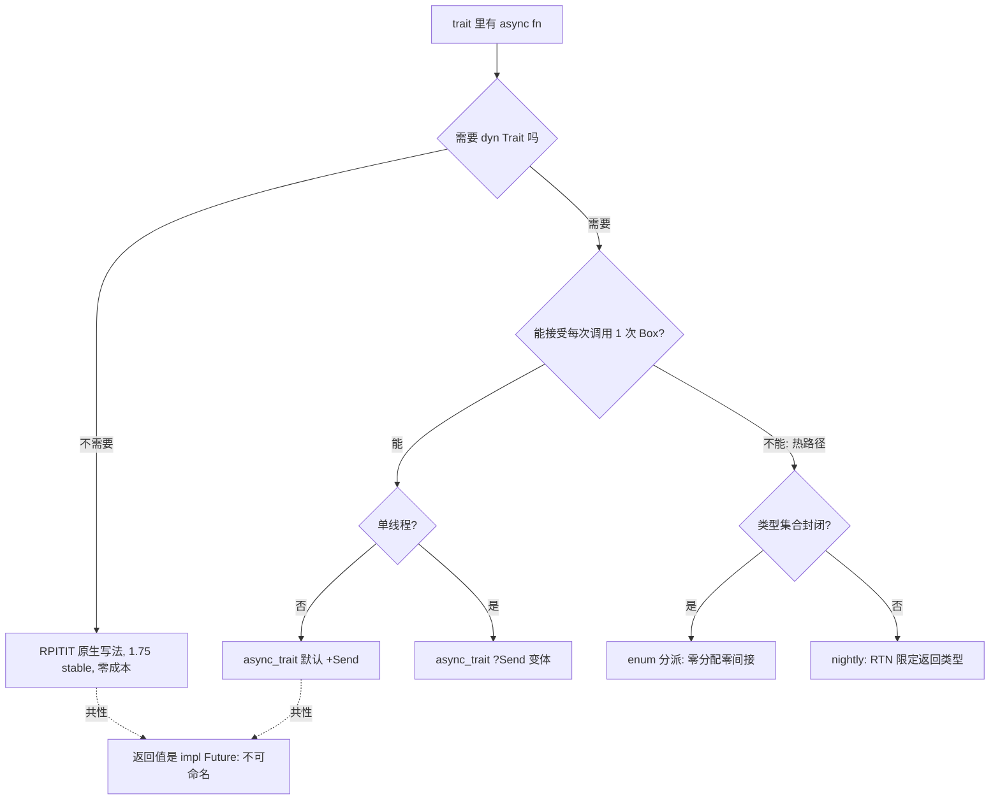
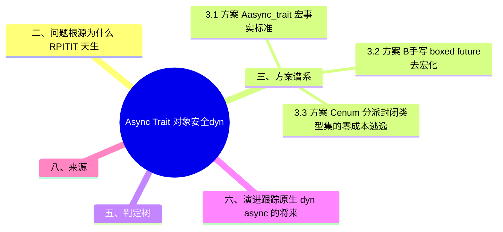

> **内容分级**: [专家级]

# Async Trait 对象安全：dyn 兼容解决方案谱系与选型矩阵

> **EN**: Async Trait Object Safety
> **Summary**: The complete solution spectrum for dyn-compatible async traits: the `async_trait` macro (Box allocation per call, single-thread variant), return type notation (RTN, nightly-only), RPITIT (stable since 1.75 but dyn-incompatible), hand-written boxed futures, and the future of native `async fn` in `dyn Trait` — with a scenario × solution × overhead × MSRV selection matrix.
>
> **受众**: [进阶-专家]
> **Bloom 层级**: L3-L4
> **权威来源**: 本文件为 `concept/` 权威页（async trait 对象安全**解决方案谱系**视角，自 [Async 边界全景 §9](06_async_boundary_panorama.md#九边界六async-trait-与-dyn-兼容边界) 升格）。
> **分工声明**: 「RPITIT 使 trait 非 dyn 兼容」的**边界陈述与反例**（三段式）保留在 [Async 边界全景 §9](06_async_boundary_panorama.md)（该节已摘要化并回链本页）；trait 对象安全的一般理论（vtable、auto trait、关联类型规则）属于 [Traits](../../02_intermediate/00_traits/01_traits.md)。本页只做**解决方案谱系 + 选型矩阵 + 演进跟踪**，不重复边界推导与一般对象安全理论（AGENTS.md §2 Canonical 规则）。
> **A/S/P 标记**: **S** — Structure
> **双维定位**: C×Ana — 分析「不可命名的 Future 返回类型」与「vtable 动态分发」之间的结构性冲突及其各路解法
> **定位**: `async fn` in trait（1.75 stable）解决了静态分发，却留下 Rust async 最著名的缺口：`Box<dyn Trait>` 不可用。本页把社区四年积累的五条路线（宏（Macro）装箱 / 手写装箱 / erased 类型 / RTN / 原生 dyn async）整理为可查表的选型矩阵。
> **前置概念**: [Traits](../../02_intermediate/00_traits/01_traits.md)（L2 向下引用（Reference）：对象安全规则） · [Async/Await](01_async.md) · [Async 边界全景](06_async_boundary_panorama.md)
> **后置概念**: [Async Closures](07_async_closures.md) · [Waker 契约深度解析](12_waker_contract_deep_dive.md)

---

> **Rust 版本**: 1.97.0+ (Edition 2024)
> **生态版本**: async-trait 0.1.89（workspace 锁定）· RTN 需 nightly（`#![feature(return_type_notation)]`）
> **来源**: [RFC 3654 — Return Type Notation](https://rust-lang.github.io/rfcs/3654-return-type-notation.html) · [RFC 3185 — static async fn in trait](https://rust-lang.github.io/rfcs/3185-static-async-fn-in-trait.html) · [Niko Matsakis — Dyn async traits 系列](https://smallcultfollowing.com/babysteps/blog/2021/09/30/dyn-async-traits-part-1/) · [async-trait crate docs](https://docs.rs/async-trait/latest/async_trait/) · [Rust Blog — Async fn & RPITIT in traits（1.75）](https://blog.rust-lang.org/2023/12/21/async-fn-rpit-in-traits.html)（以上 2026-07-12 curl 实测 HTTP 200）
> **国际权威来源（2026-07-13 补录）**: **P1** [Jung et al. — RustBelt（POPL 2018）](https://plv.mpi-sws.org/rustbelt/popl18/)（trait 对象/vtable 动态分发与对象安全规则的语义基础；curl 200 实测 2026-07-13）
> **对应 Crate**: [`c06_async`](../../../crates/c06_async)（workspace `async-trait = "0.1.89"`）
> **对应练习**: [`exercises/src/async_programming/`](../../../exercises/src/async_programming)

**变更日志**:

- v1.0 (2026-07-12): 初始版本（W4-5）— 自 06_async_boundary_panorama §9 升格：五条解决方案路线（async_trait / 手写 boxed / dynosaur / RTN / 原生 dyn async 探索）+ 选型矩阵（场景×方案×开销×MSRV）；代码示例 rustc 1.97.0 实测（async-trait 经 workspace rmeta，RPITIT/手写 boxed std-only，RTN 标注 nightly）
- v1.1 (2026-07-13): 补方案 E `trait_variant`（实测勘误：Send 变体生成 ≠ dyn 安全，`Box<dyn 变体>` 复现 E0038；其价值是 RTN 的 stable 等效——spawn/Send bound）+ 选型矩阵行；原 dynosaur 顺延为方案 F；§6 补 AFIT 术语对齐

## 📑 目录

- [Async Trait 对象安全：dyn 兼容解决方案谱系与选型矩阵](#async-trait-对象安全dyn-兼容解决方案谱系与选型矩阵)
  - [📑 目录](#-目录)
  - [一、认知路径](#一认知路径)
  - [二、问题根源：为什么 RPITIT 天生 dyn-incompatible](#二问题根源为什么-rpitit-天生-dyn-incompatible)
  - [三、方案谱系](#三方案谱系)
    - [3.1 方案 A：`async_trait` 宏（事实标准）](#31-方案-aasync_trait-宏事实标准)
    - [3.2 方案 B：手写 boxed future（去宏化）](#32-方案-b手写-boxed-future去宏化)
    - [3.3 方案 C：enum 分派（封闭类型集的零成本逃逸）](#33-方案-cenum-分派封闭类型集的零成本逃逸)
    - [3.4 方案 D：RTN（Return Type Notation，nightly）](#34-方案-drtnreturn-type-notationnightly)
    - [3.5 方案 E：`trait_variant`（Send 变体生成，RTN 的 stable 替代）](#35-方案-etrait_variantsend-变体生成rtn-的-stable-替代)
    - [3.6 方案 F：erased 类型路线（dynosaur 等）](#36-方案-ferased-类型路线dynosaur-等)
  - [四、选型矩阵（场景 × 方案 × 开销 × MSRV）](#四选型矩阵场景--方案--开销--msrv)
  - [五、判定树](#五判定树)
  - [六、演进跟踪：原生 dyn async 的将来](#六演进跟踪原生-dyn-async-的将来)
  - [七、相关概念](#七相关概念)
  - [八、来源](#八来源)
  - [📋 关键属性](#-关键属性)
  - [🔗 概念关系](#-概念关系)
  - [🧭 思维导图（Mindmap）](#-思维导图mindmap)

## 一、认知路径



阅读顺序：**根源（§2，两分钟理解为什么不行）⟹ 谱系（§3，五条路线各一节）⟹ 查表（§4-5）⟹ 前瞻（§6）**。

## 二、问题根源：为什么 RPITIT 天生 dyn-incompatible

RPITIT（return-position `impl Trait` in trait，1.75 stable）中，`async fn` 脱糖为返回 `impl Future` 的方法：

```rust
//! RPITIT：rustc 1.97.0 实测可编译（std-only + tokio rmeta）
trait Repo {
    async fn get(&self, id: u64) -> String; // ⟹ fn get(&self, id: u64) -> impl Future<Output = String> + '_
}
struct MemRepo;
impl Repo for MemRepo {
    async fn get(&self, id: u64) -> String {
        format!("mem-{id}")
    }
}
async fn fetch<R: Repo>(r: &R) -> String {
    r.get(1).await // 静态分发：每个 R 有独立的 Future 类型，单态化，零成本
}
```

`impl Future` 是**不透明类型**：每个 impl 的返回类型不同且**不可命名**。而 `dyn Trait` 的 vtable 要求每个方法有**单一、确定**的签名——同一个 vtable 槽无法容纳「每个实现各一种类型」的返回值。编译器的拒绝是精确的：

```rust,compile_fail
trait Repo {
    async fn get(&self, id: u64) -> String;
}
fn main() {
    let _r: Box<dyn Repo>;
    // error[E0038]: the trait `Repo` is not dyn compatible
    // （rustc 1.97.0 实测报错措辞）
}
```

> **本质**：这不是「还没实现」的缺口，而是类型擦除与不透明返回类型之间的**结构性冲突**。所有解决方案都在回答同一个问题：用什么代价把「不可命名的 Future」变成「vtable 里可放的东西」。

## 三、方案谱系

本节梳理让 async trait 对象安全的方案谱系：从 3.1 的 `async_trait` 宏（事实标准）到原生 async fn 与手工装箱 Future 的权衡。

### 3.1 方案 A：`async_trait` 宏（事实标准）

```rust
//! async-trait 0.1.89：rustc 1.97.0 实测（经 workspace rmeta typecheck）
use async_trait::async_trait;

#[async_trait]
trait Repo {
    async fn get(&self, id: u64) -> String;
}

struct PgRepo;
#[async_trait]
impl Repo for PgRepo {
    async fn get(&self, id: u64) -> String {
        format!("row-{id}")
    }
}

// 单线程变体：?Send 关闭默认的 + Send 约束（无 Send bound ⟹ 可捕获 !Send 状态）
#[async_trait(?Send)]
trait LocalCache {
    async fn put(&self, v: i32);
}

#[tokio::main(flavor = "current_thread")]
async fn main() {
    let r: Box<dyn Repo> = Box::new(PgRepo);
    assert_eq!(r.get(7).await, "row-7");
}
```

宏把每个方法改写为 `fn get(&self, id: u64) -> Pin<Box<dyn Future<Output = String> + Send + '_>>`：

| 属性 | 值 |
|---|---|
| 开销 | **每次调用 1 次堆分配**（Box）+ 1 层动态分发（poll 时） |
| Send | 默认 `+ Send`（trait 与 impl 处分别可加 `?Send`） |
| MSRV | 极低（宏不依赖语言新特性） |
| 适用 | 插件系统、扩展点、依赖注入测试替身——调用频率低于分配成本的场景 |

### 3.2 方案 B：手写 boxed future（去宏化）

等价于 `async_trait` 的展开结果，但无过程宏（Procedural Macro）依赖、签名完全可见：

```rust
//! 手写 boxed future：rustc 1.97.0 实测（std-only + tokio rmeta）
use std::future::Future;
use std::pin::Pin;

trait RepoDyn {
    fn get(&self, id: u64) -> Pin<Box<dyn Future<Output = String> + Send + '_>>;
}
struct MemRepoDyn;
impl RepoDyn for MemRepoDyn {
    fn get(&self, id: u64) -> Pin<Box<dyn Future<Output = String> + Send + '_>> {
        Box::pin(async move { format!("dyn-{id}") }) // 注意：id 被 move 进 future
    }
}

#[tokio::main(flavor = "current_thread")]
async fn main() {
    let r: Box<dyn RepoDyn> = Box::new(MemRepoDyn);
    assert_eq!(r.get(2).await, "dyn-2");
}
```

与方案 A 同开销、同 MSRV；代价是**签名噪音**（`Pin<Box<dyn Future + Send + '_>>` 每处重复）与手写生命周期（Lifetimes）标注（`+ '_` 不能漏，否则捕获 `&self` 的实现无法通过借用（Borrowing）检查）。判据：宏依赖敏感（编译时间、no-proc-macro 环境）且方法数少 ⟹ 方案 B；否则方案 A。

### 3.3 方案 C：enum 分派（封闭类型集的零成本逃逸）

当「需要 dyn」的真实原因是「想在集合里放多种实现」且**实现集合封闭**时，enum 是严格更优解：

```rust
//! enum 分派：rustc 1.97.0 实测可编译（std-only）
enum Repo {
    Mem(MemRepo),
    Pg(PgRepo),
}
struct MemRepo;
struct PgRepo;
impl Repo {
    async fn get(&self, id: u64) -> String {
        match self {
            Repo::Mem(r) => r.get_mem(id).await, // 各自保持原生 async fn，零分配零间接
            Repo::Pg(r) => r.get_pg(id).await,
        }
    }
}
impl MemRepo { async fn get_mem(&self, id: u64) -> String { format!("mem-{id}") } }
impl PgRepo { async fn get_pg(&self, id: u64) -> String { format!("pg-{id}") } }
```

开销为零，Future 类型在编译期完整可知；代价是开放集合（第三方插件）不可扩展。`enum_dispatch` crate 可消除手写 match 的样板。

### 3.4 方案 D：RTN（Return Type Notation，nightly）

RFC 3654（已合并，实现中）允许在调用点对 `impl Trait` 返回位置施加约束：`T: Trait<method(): Send>` 读作「`method` 的返回类型实现 `Send`」。它解决的是 RPITIT 的另一痛点——**静态分发下给返回的 Future 加 bound**（如要求 `Send` 以便 `tokio::spawn`），而非直接让 trait dyn 兼容：

```rust,ignore
// ⚠️ nightly-only：#![feature(return_type_notation)]，stable 1.97 不可用
async fn spawnable_fetch<R>(r: R) -> String
where
    R: Repo<get(): Send>, // RTN：要求 get 返回的 Future 是 Send
{
    tokio::spawn(async move { r.get(1).await }).await.unwrap()
}
```

RTN 是 dyn 兼容的**前置积木**：RFC 3654 原文明确「We expect to make traits with async functions and RPITIT dyn safe in the future」——RTN 提供了在 vtable 中表达返回类型约束的记号，原生 dyn async（§6）需要它。

### 3.5 方案 E：`trait_variant`（Send 变体生成，RTN 的 stable 替代）

RTN 的痛点是 nightly-only；`trait-variant` crate 用过程宏在 **stable** 上达到等效效果：从基础 trait 生成一个「返回的 Future 满足额外 bound」的变体 trait——**解决 spawn/Send 约束，不解决 dyn 兼容**：

```rust,ignore
//! trait-variant 0.1.2 + tokio 1.52.3：rustc 1.97.0 实测运行通过（输出 ok）
#[trait_variant::make(IntFactory: Send)]
trait LocalIntFactory {
    async fn make(&self) -> i32;
}

struct F;
// 实现端直接实现生成的 Send 变体（签名仍写 async fn）
impl IntFactory for F {
    async fn make(&self) -> i32 { 42 }
}

// 生成的 trait IntFactory: Send ⟹ 返回的 Future 满足 Send，可直接 spawn
async fn spawnable<R: IntFactory + 'static>(r: R) -> i32 {
    tokio::spawn(async move { r.make().await }).await.unwrap()
}
```

宏展开形态（docs 原文）：`trait IntFactory: Send { fn make(&self) -> impl Future<Output = i32> + Send; }`。

| 属性 | 值 |
|---|---|
| 解决什么 | RPITIT 下「给返回 Future 加 `Send` bound 以便 `tokio::spawn`」——RTN（方案 D）的 stable 等效 |
| **不解决什么** | dyn 兼容：变体 trait 仍含 `impl Future` 返回，实测 `Box<dyn IntFactory>` 同样报 E0038 |
| 开销 | 0（静态分发，宏只在编译期展开） |
| MSRV | 低（纯过程宏，不依赖语言新特性） |

> **常见误解（实测勘误）**：`#[trait_variant::make(T: Send)]` 生成的 trait **不是** dyn 安全的——它把 `async fn` 改写为带 bound 的 RPITIT，vtable 依旧不可构造（rustc 1.97.0 实测复现 E0038："method `make` references an `impl Trait` type in its return type"）。需要 `dyn` 时仍须方案 A/B/C/F。

### 3.6 方案 F：erased 类型路线（dynosaur 等）

`dynosaur` crate 用过程宏生成一个 `DynTrait` 包装类型（erased struct 而非 `dyn Trait` 对象），把每个方法擦除为 `Pin<Box<dyn Future>>` 分发，同时**保留原 trait 的对象不安全形态**供静态分发使用——同一份 trait 定义，两种消费方式。定位：需要「静态/动态双模」的库作者；开销与方案 A 同量级（每次调用 1 Box），但生态成熟度低于 `async_trait`。

## 四、选型矩阵（场景 × 方案 × 开销 × MSRV）

| 场景 | 推荐方案 | 每次调用开销 | MSRV | 说明 |
|---|---|---|:---:|---|
| 泛型（Generics）能覆盖（静态分发） | **RPITIT 原生** | 0 | 1.75 | 永远的首选；`dyn` 是退而求其次 |
| 插件/扩展点，调用频率 < 10⁵/s | **async_trait（方案 A）** | 1 Box + 1 间接 | 低 | 事实标准，生态兼容最好 |
| 同上但 no-proc-macro 环境 | **手写 boxed（方案 B）** | 1 Box + 1 间接 | 低 | 签名噪音换零宏依赖 |
| 单线程运行时（Runtime） + `!Send` 状态 | **async_trait(?Send)** | 1 Box + 1 间接 | 低 | 去掉 `Send` bound，可捕获 `Rc`/`RefCell` |
| 实现集合封闭 + 热路径 | **enum 分派（方案 C）** | 0 | 任意 | 严格最优；不可扩展是硬边界 |
| 库需静态/动态双模 | **dynosaur（方案 F）** | 1 Box + 1 间接 | 1.75+ | 一份定义两种消费 |
| 需 `spawn` 但坚持 RPITIT | **RTN（方案 D）** | 0（静态分发） | nightly | 等稳定；stable 替代见下 |
| 同上但要求 stable | **trait_variant（方案 E）** | 0（静态分发） | 低 | RTN 的 stable 等效；不解 dyn |

> **反例（选型错误）**：热路径（>10⁵ 调用/s）上的 trait 对象用方案 A ⟹ 每次调用一次分配 + cache-hostile 间接 poll，分配器成为瓶颈——[Async 边界全景 §9.3](06_async_boundary_panorama.md#93-判定条件) 的 Q-T2 定量阈值即为此设。修复方向：静态分发重构或 enum 分派。

## 五、判定树

```mermaid
flowchart TD
    Q1{调用点能写成泛型 T: Trait?} -->|能| A1[✅ RPITIT 原生, 零成本]
    Q1 -->|不能, 必须 dyn| Q2{实现集合封闭?}
    Q2 -->|是| Q3{热路径 >10^5/s?}
    Q3 -->|是| A2[✅ enum 分派]
    Q3 -->|否| A3[async_trait 或 enum 皆可, 按可扩展性预期]
    Q2 -->|否| Q4{单线程/!Send 状态?}
    Q4 -->|是| A4[✅ async_trait ?Send]
    Q4 -->|否| A5[✅ async_trait 默认]
    Q1 -.静态分发但需 Send bound.-> Q5{接受 nightly?}
    Q5 -->|是| A6[RTN: R: Trait<method(): Send>]
    Q5 -->|否| A7[trait_variant: stable 等效]
```

## 六、演进跟踪：原生 dyn async 的将来

术语对齐：**AFIT**（Async Fn In Trait）是 1.75 稳定特性的工作名，与 RPITIT 指同一机制的两侧（async 语法视角 / 类型脱糖视角）；本页方案 E 的 `trait_variant` 即社区「trait variant」思路的 crate 先行实现。

语言层面的终态是 **`async fn` in trait 直接 dyn 兼容**：编译器为 vtable 生成装箱 shim（每个 impl 的 `impl Future` 被自动包成 `dyn Future`），Niko Matsakis 的 *Dyn async traits* 系列（2021-2022，共 8 篇）给出了完整设计空间——关键决策点包括「装箱是否隐式」（Rust 历史上避免隐式分配）、「vtable 中 Future 的表示」（`dyn*` 提案与 `Box` 之争）、以及 RTN 作为表达返回 bound 的记号。当前状态（2026-07）：RFC 3654（RTN）已合并、nightly 实现中；原生 dyn async 尚无独立 RFC 落地，属 async WG 路线图长期项。

> **实践含义**：方案 A/B 的代码与「未来原生 dyn async」在调用形态上**同构**（都是 `Box<dyn Trait>` + boxed Future），语言落地后迁移成本主要是删除宏与签名中的 `Pin<Box<...>>` 噪音——选型时不必为「未来重写」焦虑，但应把 trait 边界设计得与装箱语义兼容（方法少、参数 owned、返回 owned）。

## 七、相关概念

- [Async 边界全景 §9](06_async_boundary_panorama.md#九边界六async-trait-与-dyn-兼容边界) — 对象安全边界的陈述/反例/判定三段式（本页的上游摘要）
- [Traits](../../02_intermediate/00_traits/01_traits.md) — 对象安全一般规则（vtable、auto trait、关联类型）（L2 向下引用）
- [Async/Await](01_async.md) — async fn 脱糖与 `impl Future` 不透明类型
- [Async Closures](07_async_closures.md) — 返回 `impl Future` 的闭包形态，同样的不可命名性问题
- [Future 与 Executor 机制](04_future_and_executor_mechanisms.md) — `Pin<Box<dyn Future>>` 的擦除形态与 poll 分发

## 八、来源

- [RFC 3654 — Return Type Notation](https://rust-lang.github.io/rfcs/3654-return-type-notation.html)（RTN 语法与动机；「dyn safe in the future」原文依据，2026-07-12 实测 200）
- [RFC 3185 — static async fn in trait](https://rust-lang.github.io/rfcs/3185-static-async-fn-in-trait.html)（RPITIT 设计原文，2026-07-12 实测 200）
- [Rust Blog — Async fn & return-position impl Trait in traits（1.75 稳定公告）](https://blog.rust-lang.org/2023/12/21/async-fn-rpit-in-traits.html)（RPITIT 稳定范围与已知限制，2026-07-12 实测 200）
- [Niko Matsakis — *Dyn async traits, part 1*（及全系列）](https://smallcultfollowing.com/babysteps/blog/2021/09/30/dyn-async-traits-part-1/)（原生 dyn async 的设计空间：装箱 shim、dyn* 提案，2026-07-12 实测 200）
- [async-trait crate docs](https://docs.rs/async-trait/latest/async_trait/)（宏展开语义、`?Send` 变体、开销说明，2026-07-12 实测 200）
- [trait-variant crate docs](https://docs.rs/trait-variant/latest/trait_variant/)（`make` 宏生成带 bound 的 RPITIT 变体 trait；实测明确不解 dyn 兼容，2026-07-13 实测 200）
- [async-fundamentals-initiative 路线图](https://rust-lang.github.io/async-fundamentals-initiative/roadmap.html)（dyn async 在 async WG 路线图中的位置，2026-07-12 实测 200）
- 站内交叉引用：[Async 边界全景](06_async_boundary_panorama.md) · [Traits](../../02_intermediate/00_traits/01_traits.md) · [Async/Await](01_async.md)

## 📋 关键属性

| 属性 | 取值 / 判定 | 依据 |
|---|---|---|
| 问题根源 | RPITIT 返回匿名 future 类型，vtable 无法承载 ⟹ 天生 dyn-incompatible | 本文 §二 |
| 方案谱系 | async_trait 宏 / 手写 boxed / enum 分派 / RTN / trait_variant / erased 六方案 | 本文 §三 |
| 运行时开销 | enum 分派零成本；boxed 方案每次调用一次堆分配 | 本文 §四 |
| MSRV 跨度 | async_trait 低 MSRV；原生 RPITIT 需 1.75+ | 本文 §四 选型矩阵 |
| 演进状态 | 原生 `dyn` async trait 仍处 nightly 跟踪 | 本文 §六 |

## 🔗 概念关系

- **上位（is-a）**：[Traits](../../02_intermediate/00_traits/01_traits.md) 对象安全性的异步（Async）专题。
- **下位（实例）**：方案 A–F 六条 dyn 兼容路线（本文 §三）。
- **对偶**：静态分派（RPITIT，零成本）⇄ 动态分派（`dyn` + boxed future，一次分配）。
- **组合**：与 [GAT](../../02_intermediate/00_traits/07_generic_associated_types.md)、[类型擦除](../06_low_level_patterns/03_type_erasure.md)、[Async Closures](07_async_closures.md) 组合。

---

## 🧭 思维导图（Mindmap）


