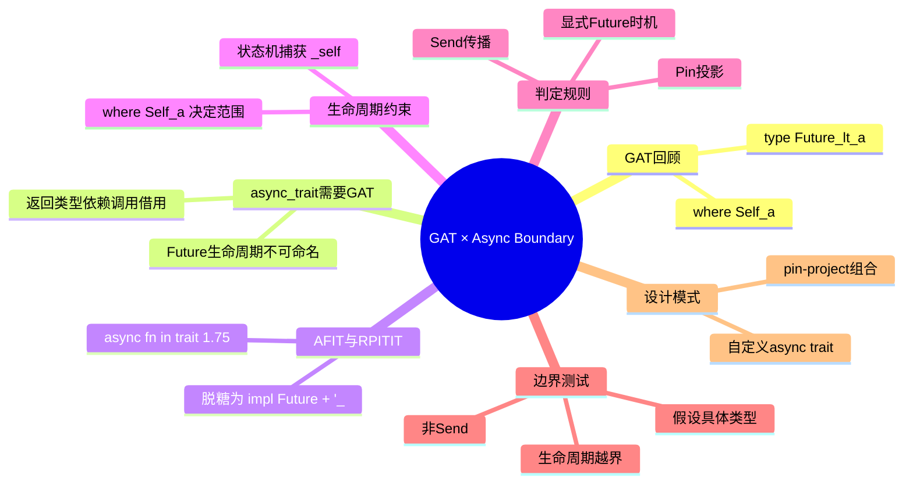
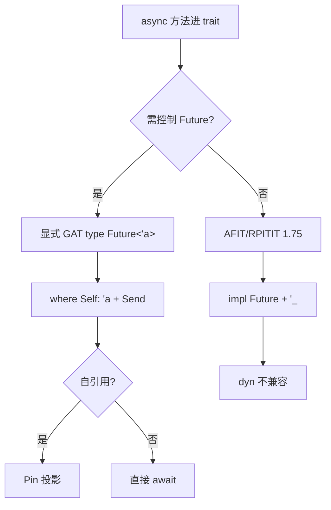

> **内容分级**: [专家级]
>
> **本节关键术语**: Generic Associated Types (GATs) · async fn in trait (AFIT) · Return Position Impl Trait In Trait (RPITIT) · Type Alias Impl Trait (TAIT) · Future 关联类型 · `where Self: 'a` · 自引用（Reference）状态机 (self-referential state machine) · `Send` 传播 — [完整对照表](../../00_meta/01_terminology/01_terminology_glossary.md)

# GAT 与 Async 交叉边界语义

> **EN**: Generic Associated Types (GATs) at the Async Boundary
> **Summary**: The semantic boundary where Generic Associated Types meet async Rust: why explicit `type Future<'a>` is sometimes required, how lifetime constraints on GATs shape the async state machine, and how `Send`/`Pin` propagate through GAT-based async traits.
>
> **受众**: [专家]
> **Bloom 层级**: L4-L5
> **权威来源**: 本文件为 `concept/` 权威页（GAT × Async 交叉语义视角）。GAT 的通用理论见 [`concept/02_intermediate/00_traits/07_generic_associated_types.md`](../../02_intermediate/00_traits/07_generic_associated_types.md)；async trait 的 dyn 兼容解决方案谱系见 [Async Trait 对象安全](13_async_trait_object_safety.md)。
> **A/S/P 标记**: **S+P** — Structure + Procedure
> **双维定位**: C×Ana — 分析 GAT 的类型族结构与 async 状态机生命周期（Lifetimes）约束之间的交互边界
> **定位**: 分析 Rust 1.75+ `async fn in trait` 背后的 GAT/RPITIT 机制，以及 `Send`、`Pin` 在 GAT Future 上的传播规则。
> **前置概念**: [Generic Associated Types](../../02_intermediate/00_traits/07_generic_associated_types.md) · [Async/Await](01_async.md) · [Pin 与 Unpin](08_pin_unpin.md) · [Async Trait 对象安全](13_async_trait_object_safety.md)
> **后置概念**: [Stream 代数与背压](09_stream_algebra_and_backpressure.md) · [Executor 公平性与调度](10_executor_fairness_and_scheduling.md) · [Async FFI 边界](../04_ffi/04_async_ffi_boundary.md)

---

> **Rust 版本**: 1.97.0+ (Edition 2024)
> **来源**:
> [RFC 1598](https://rust-lang.github.io/rfcs/1598-generic_associated_types.html) ·
> [Rust 1.75 AFIT](https://blog.rust-lang.org/2023/12/21/async-fn-rpit-in-traits.html) ·
> [Rust Reference](https://doc.rust-lang.org/reference/items/associated-items.html) ·
> [RFC 2289](https://rust-lang.github.io/rfcs/2289-associated-type-bounds.html) ·
> [pin-project](https://docs.rs/pin-project/latest/pin_project/)
> **国际权威来源**: **P1** [Jung et al. — RustBelt](https://plv.mpi-sws.org/rustbelt/popl18/)
> **对应 Crate**: [`c06_async`](../../../crates/c06_async)
> **对应练习**: [`exercises/src/async_programming/`](../../../exercises/src/async_programming)

**变更日志**: v1.0 (2026-07-15) — 初始版本：核心概念 + 判定规则 + 3 边界测试 + 2 设计模式

## 🧠 知识结构图



## 📑 目录

- [GAT 与 Async 交叉边界语义](#gat-与-async-交叉边界语义)
  - [🧠 知识结构图](#-知识结构图)
  - [📑 目录](#-目录)
  - [一、认知路径](#一认知路径)
  - [二、核心概念](#二核心概念)
    - [2.1 GAT 回顾：`trait Foo { type Bar<'a>; }`](#21-gat-回顾trait-foo--type-bara-)
    - [2.2 为什么 async trait 需要 GAT：返回借用绑定的 Future](#22-为什么-async-trait-需要-gat返回借用绑定的-future)
    - [2.3 `async fn in trait`（Rust 1.75+）与 RPITIT](#23-async-fn-in-traitrust-175与-rpitit)
    - [2.4 GAT 生命周期约束如何影响 async 状态机](#24-gat-生命周期约束如何影响-async-状态机)
  - [三、判定规则](#三判定规则)
    - [3.1 何时需要显式 GAT Future 类型](#31-何时需要显式-gat-future-类型)
    - [3.2 `Send` bound 如何传播到 GAT Future](#32-send-bound-如何传播到-gat-future)
    - [3.3 `Pin` 与 GAT 自引用类型的交互](#33-pin-与-gat-自引用类型的交互)
  - [四、边界测试 / 反例](#四边界测试--反例)
    - [4.1 边界测试：GAT Future 不是 `Send` 导致的 `tokio::spawn` 失败](#41-边界测试gat-future-不是-send-导致的-tokiospawn-失败)
    - [4.2 边界测试：生命周期不满足的 GAT async](#42-边界测试生命周期不满足的-gat-async)
    - [4.3 边界测试：错误地假设 GAT 具体类型](#43-边界测试错误地假设-gat-具体类型)
  - [五、设计模式](#五设计模式)
    - [5.1 用 GAT 实现自定义 async trait](#51-用-gat-实现自定义-async-trait)
    - [5.2 与 `pin-project` 结合](#52-与-pin-project-结合)
  - [六、相关概念](#六相关概念)
  - [七、来源](#七来源)
  - [📋 关键属性](#-关键属性)
  - [🔗 概念关系](#-概念关系)

---

## 一、认知路径



阅读顺序：GAT 回顾 → async trait 需要 GAT → AFIT/RPITIT → 生命周期约束 → 判定规则 → 边界测试 → 设计模式。

---

## 二、核心概念

本节回顾 GAT 基础并建立 async trait 所需的类型族视角。2.1 重温 GAT 语法，2.2 解释普通关联类型无法表达借用绑定 Future 的问题，2.3 介绍 AFIT/RPITIT 语法糖，2.4 说明生命周期约束如何影响 async 状态机字段。

### 2.1 GAT 回顾：`trait Foo { type Bar<'a>; }`

GAT 让关联类型携带泛型（Generics）参数（通常是生命周期），形成「类型构造器（type constructor）」：

```rust
trait LendingIterator {
    type Item<'a> where Self: 'a;
    fn next<'a>(&'a mut self) -> Option<Self::Item<'a>>;
}
```

`type Item<'a> where Self: 'a` 读作：在 `Self` 至少活到 `'a` 时，`Item` 是以 `'a` 为参数的类型族。`where Self: 'a` 是稳定版 GAT 的 **required where clause**（见 [GAT 权威页 §2.2](../../02_intermediate/00_traits/07_generic_associated_types.md#22-where-self-a-是必需的required-where-clause)），省略即编译错误：

```rust,compile_fail
trait Bad {
    type Item<'a>; // ❌ 缺少 where Self: 'a
    fn get(&self) -> Self::Item<'_>;
}

fn main() {}
```

> **关键直觉**：GAT 把「类型」升级为「类型层面的函数」，使 async trait 能表达「Future 依赖本次调用的借用（Borrowing）生命周期」。

### 2.2 为什么 async trait 需要 GAT：返回借用绑定的 Future

如果 async 方法返回的 Future 依赖 `&self` 的生命周期，普通关联类型无法表达：

```rust,compile_fail
use std::future::Future;

// ❌ 普通关联类型无法把「本次 &self 的 lifetime」传入返回类型
trait AsyncTaskBad {
    type Future: Future<Output = &str>;
    fn run(&self) -> Self::Future;
}

struct BorrowedTask<'t> { data: &'t str }

// 无法让 type Future 借用 self：普通关联类型没有生命周期参数
impl<'t> AsyncTaskBad for BorrowedTask<'t> {
    type Future = std::future::Ready<&'t str>;
    fn run(&self) -> Self::Future {
        std::future::ready(self.data)
    }
}

fn main() {}
```

`type Future: Future<Output = &str>` 是零参数的，返回类型无法绑定到「本次调用对 `self` 的借用」。GAT 通过给关联类型加生命周期参数解决这个问题：

```rust
use std::future::Future;
use std::pin::Pin;
use std::task::{Context, Poll};

// ✅ GAT 把 Future 变成类型族，参数化生命周期
trait AsyncTask {
    type Future<'a>: Future<Output = &'a str> + 'a where Self: 'a;
    fn run(&self) -> Self::Future<'_>;
}

struct BorrowedTask<'t> { data: &'t str }

struct BorrowedFuture<'a> { task: &'a BorrowedTask<'a> }

impl<'a> Future for BorrowedFuture<'a> {
    type Output = &'a str;
    fn poll(self: Pin<&mut Self>, _cx: &mut Context<'_>) -> Poll<Self::Output> {
        Poll::Ready(self.task.data)
    }
}

impl<'t> AsyncTask for BorrowedTask<'t> {
    type Future<'a> = BorrowedFuture<'a> where Self: 'a;
    fn run(&self) -> Self::Future<'_> {
        BorrowedFuture { task: self }
    }
}
```

> **本质**：async fn 返回类型必须表达 `impl Future<Output = T> + '_`；GAT 让 trait 作者在不使用 AFIT 时显式写出该依赖。

### 2.3 `async fn in trait`（Rust 1.75+）与 RPITIT

Rust 1.75 稳定的 `async fn in trait`（AFIT）是 **RPITIT**（Return Position `impl Trait` In Trait）的语法糖：

```rust
// AFIT 写法（1.75+ stable）
trait AsyncTask {
    async fn run(&self) -> i32;
}

// 编译器脱糖后等价于 RPITIT 写法
trait AsyncTaskDesugared {
    fn run(&self) -> impl Future<Output = i32> + '_;
}
```

AFIT 由编译器自动引入生命周期参数，并把返回类型变成捕获输入 lifetime 的匿名不透明类型。实现侧使用 **TAIT**（Type Alias Impl Trait）生成该关联类型的具体定义。对使用者而言，AFIT 与显式 `type Future<'a>: Future<Output = i32> + 'a` 在语义上等价，但前者隐藏了 GAT 的 boilerplate。

> **边界**：AFIT/RPITIT 返回的 `impl Future` 是**不可命名类型**，直接导致 `dyn Trait` 不兼容。详细推导见 [Async Trait 对象安全](13_async_trait_object_safety.md)。

### 2.4 GAT 生命周期约束如何影响 async 状态机

async fn 编译为状态机，`.await` 点之间的局部变量变成状态机字段。当 async 方法通过 GAT 返回 Future 时，该 Future 必须声明生命周期约束：

```rust
trait Reader {
    async fn read(&self) -> String; // 脱糖后等价于 GAT Future
}

struct FileReader<'p> { path: &'p str }

impl Reader for FileReader<'_> {
    async fn read(&self) -> String {
        self.path.to_string() // 状态机隐式捕获 &self
    }
}
```

`Self::ReadFuture<'_>` 的 lifetime 上限由 `where Self: 'a` 决定；状态机捕获 `&self`，因此 Future 不能活过 `self` 借用期。

> **状态机视角**：`where Self: 'a` 把「`self` 必须活到 Future 完成」编码进类型签名。

---

## 三、判定规则

本节给出在 async trait 中选择显式 GAT 还是 AFIT/RPITIT 的决策依据。3.1 列出何时需要显式 `type Future<'a>`，3.2 分析 Send bound 的传播路径，3.3 讨论自定义自引用 Future 与 Pin 的交互。

### 3.1 何时需要显式 GAT Future 类型

| 场景 | 推荐写法 | 原因 |
|---|---|---|
| 仅需要 `async fn` 语义，不 care Future 类型名 | `async fn in trait` (AFIT) | 最简洁，编译器处理 GAT/RPITIT |
| 需要给 Future 加额外约束（`Send`、`Sync`、具体 trait bound） | 显式 `type Future<'a>: ...` | AFIT 的返回类型不可直接加 bound（需 RTN 或 trait_variant） |
| 需要命名 Future 类型 | 显式 GAT | RPITIT 返回类型不可命名 |
| 需要 `dyn Trait` 兼容 | `Pin<Box<dyn Future<...>>>` 或 `async_trait` 宏（Macro） | AFIT/RPITIT dyn 不兼容 |
| 需要与 `pin-project` 组合 | 显式 GAT + 自定义 Future 类型 | 需要可命名类型才能派生 projection |

> **决策要点**：能 AFIT 就不手写 GAT；一旦需要控制 Future 的 bound 或形状，立刻切换到显式 GAT。

### 3.2 `Send` bound 如何传播到 GAT Future

`tokio::spawn` 要求 Future 满足 `Send + 'static`。这个要求会沿着 GAT 的 bound 反向传播到实现者：

```rust
use std::future::Future;

// 显式要求 GAT Future 是 Send
trait AsyncTaskSend: Send {
    type Future<'a>: Future<Output = i32> + Send + 'a where Self: 'a;
    fn run(&self) -> Self::Future<'_>;
}
```

如果 trait 不声明 `Send`，调用者就无法在 `tokio::spawn` 中使用 `T::Future<'_>`（除非使用已稳定的显式 `+ Send` bound 或生态 crate `trait_variant`）。传播路径：`spawn` 要求 `Future: Send` → `Future = T::Future<'_>` → trait 显式要求 `Send` → impl 的具体 Future 类型必须 `Send` → Future 的字段必须 `Send`。

> **常见错误**：trait 作者忘记在 GAT bound 上加 `Send`，导致所有使用者都无法 `spawn`。修复在 trait 定义处补 bound。

### 3.3 `Pin` 与 GAT 自引用类型的交互

当 GAT Future 是自定义类型时，必须满足 `Pin` 契约：

- `Unpin` Future：`Pin` 不施加额外限制；
- 自引用 Future：需 `#[pin]` 字段并正确实现 `poll`。

> **Pin 洞察**：GAT 显式命名 Future 类型，把「是否自引用」暴露给实现者；AFIT 由编译器自动处理 Pin。

---

## 四、边界测试 / 反例

本节通过编译失败示例展示 GAT × async 的边界失效模式。4.1 演示非 Send Future 导致无法 `tokio::spawn`，4.2 展示生命周期越界借用，4.3 说明调用方不能假设 GAT 的具体实现类型。

### 4.1 边界测试：GAT Future 不是 `Send` 导致的 `tokio::spawn` 失败

`tokio::spawn` 要求 Future 为 `Send`。若 trait 的 GAT Future 未声明 `Send`，具体实现又含 `Rc` 等非 `Send` 类型，则调用方无法 `spawn`：

```rust,compile_fail
use std::future::Future;
use std::pin::Pin;
use std::rc::Rc;
use std::task::{Context, Poll};

// ❌ trait 未要求 GAT Future 是 Send
trait AsyncTask {
    type Future<'a>: Future<Output = i32> + 'a where Self: 'a;
    fn run(&self) -> Self::Future<'_>;
}

struct NonSendFuture { _rc: Rc<i32> }

impl Future for NonSendFuture {
    type Output = i32;
    fn poll(self: Pin<&mut Self>, _cx: &mut Context<'_>) -> Poll<i32> {
        Poll::Ready(42)
    }
}

struct MyTask;
impl AsyncTask for MyTask {
    type Future<'a> = NonSendFuture where Self: 'a;
    fn run(&self) -> Self::Future<'_> {
        NonSendFuture { _rc: Rc::new(42) }
    }
}

// 若尝试 tokio::spawn(async move { t.run().await })，会得到相同错误
fn require_send<T: Send>(_: T) {}
fn check() {
    let t = MyTask;
    require_send(t.run()); // ❌ NonSendFuture 不是 Send
}

fn main() {}
```

> **修正**：在 trait 定义中给 `type Future<'a>` 加 `Send` bound；若不需要跨线程，使用 `tokio::task::spawn_local` 或单线程 runtime。

### 4.2 边界测试：生命周期不满足的 GAT async

```rust,compile_fail
use std::future::Future;
use std::pin::Pin;
use std::task::{Context, Poll};

trait AsyncTask {
    type Future<'a>: Future<Output = &'a str> + 'a where Self: 'a;
    fn run(&self) -> Self::Future<'_>;
}

struct BorrowedTask<'t> { data: &'t str }
struct BorrowedFuture<'a> { task: &'a BorrowedTask<'a> }

impl<'a> Future for BorrowedFuture<'a> {
    type Output = &'a str;
    fn poll(self: Pin<&mut Self>, _cx: &mut Context<'_>) -> Poll<Self::Output> {
        Poll::Ready(self.task.data)
    }
}

impl<'t> AsyncTask for BorrowedTask<'t> {
    type Future<'a> = BorrowedFuture<'a> where Self: 'a;
    fn run(&self) -> Self::Future<'_> {
        BorrowedFuture { task: self }
    }
}

fn bad_use() {
    let fut;
    {
        let s = String::from("hello");
        let task = BorrowedTask { data: &s };
        fut = task.run(); // fut 借用了 s
    } // s 在此 drop
    // ❌ 编译错误: fut 的生命周期不能超过 s 的生命周期
    let _ = fut;
}

fn main() {}
```

> **修正**：确保 Future 的存活区间不超过它借用的数据。若需要跨作用域，让 task 拥有数据（`String` 而非 `&str`），或把 Future 的执行限制在借用有效期内。

### 4.3 边界测试：错误地假设 GAT 具体类型

```rust,compile_fail
use std::future::Future;
use std::future::Ready;

trait AsyncTask {
    type Future<'a>: Future<Output = i32> + 'a where Self: 'a;
    fn run(&self) -> Self::Future<'_>;
}

struct MyTask;
impl AsyncTask for MyTask {
    type Future<'a> = Ready<i32> where Self: 'a;
    fn run(&self) -> Self::Future<'_> {
        std::future::ready(42)
    }
}

// ❌ 编译错误：不能假设所有实现都使用 Ready<i32>
fn assume_ready<T: AsyncTask>(t: &T) -> Ready<i32> {
    t.run()
}

fn main() {}
```

> **修正**：使用泛型（Generics）约束而非具体类型。应写成 `fn use_task<T: AsyncTask>(t: &T) -> T::Future<'_>` 或进一步用 `Future` trait bound 处理返回值。

---

## 五、设计模式

本节给出可落地的 GAT async trait 实现模式。5.1 展示显式 GAT Future 的标准写法，5.2 说明如何结合 `pin-project` 安全处理自定义自引用类型。

### 5.1 用 GAT 实现自定义 async trait

显式 GAT 在需要「命名 Future 类型」或「附加 bound」时不可替代。下面是一个可编译的 std-only 示例：

```rust
use std::future::Future;

trait AsyncRepo {
    type Fetch<'a>: Future<Output = String> + Send + 'a where Self: 'a;
    fn fetch(&self, id: u64) -> Self::Fetch<'_>;
}

struct MemRepo { prefix: String }

impl AsyncRepo for MemRepo {
    type Fetch<'a> = std::future::Ready<String> where Self: 'a;
    fn fetch(&self, id: u64) -> Self::Fetch<'_> {
        std::future::ready(format!("{}-{}", self.prefix, id))
    }
}

async fn use_repo<R: AsyncRepo>(repo: &R) -> String {
    repo.fetch(7).await
}
```

> **模式要点**：
>
> - `type Fetch<'a>: Future<Output = String> + Send + 'a` 在定义处一次性声明所有 bound；
> - 实现侧只需给出具体类型，bound 由编译器检查；
> - 调用侧可通过 `R::Fetch<'_>` 命名类型，便于存储在 struct 字段中。

### 5.2 与 `pin-project` 结合

当 GAT Future 是自定义自引用类型时，`pin-project` 可以安全地投影内部字段。以下示例展示模式骨架（需 `pin-project` 依赖，标记为 `ignore`）：

```rust,ignore
use std::future::Future;
use std::pin::Pin;
use std::task::{Context, Poll};
use pin_project::pin_project;

trait BufferedReader {
    type ReadFuture<'a>: Future<Output = Vec<u8>> + 'a where Self: 'a;
    fn read(&mut self) -> Self::ReadFuture<'_>;
}

#[pin_project]
struct ReadIntoBufFuture<'a> {
    reader: &'a mut dyn std::io::Read,
    #[pin]
    buf: Vec<u8>,
}

impl<'a> Future for ReadIntoBufFuture<'a> {
    type Output = Vec<u8>;
    fn poll(self: Pin<&mut Self>, cx: &mut Context<'_>) -> Poll<Self::Output> {
        let this = self.project();
        Poll::Ready(std::mem::take(this.buf))
    }
}

struct MyReader;
impl BufferedReader for MyReader {
    type ReadFuture<'a> = ReadIntoBufFuture<'a> where Self: 'a;
    fn read(&mut self) -> Self::ReadFuture<'_> {
        ReadIntoBufFuture { reader: self, buf: vec![0u8; 1024] }
    }
}
```

> **模式要点**：`#[pin_project]` 生成安全 `project()`；GAT 返回自定义 Future；`Pin<&mut Self::Future<'_>>` 保证自引用字段不动。

---

## 六、相关概念

- [Generic Associated Types](../../02_intermediate/00_traits/07_generic_associated_types.md) — GAT 通用理论与 `where Self: 'a` 的完整推导
- [Async/Await](01_async.md) — async/await 语法、Future trait 与状态机脱糖
- [Pin 与 Unpin](08_pin_unpin.md) — 自引用类型与 Pin 契约
- [Async Trait 对象安全](13_async_trait_object_safety.md) — AFIT/RPITIT 与 `dyn Trait` 不兼容的解决方案谱系
- [Async 边界全景](06_async_boundary_panorama.md) — async 语义边界全景视角，含 Send 跨 await 边界
- [Future 与 Executor 机制](04_future_and_executor_mechanisms.md) — Waker、poll、执行器契约

---

## 七、来源

- **一级**: [RFC 1598 — GATs](https://rust-lang.github.io/rfcs/1598-generic_associated_types.html) · [Rust 1.75 — AFIT/RPITIT](https://blog.rust-lang.org/2023/12/21/async-fn-rpit-in-traits.html) · [Rust Reference — Associated Items](https://doc.rust-lang.org/reference/items/associated-items.html) · [RFC 2289 — Associated Type Bounds](https://rust-lang.github.io/rfcs/2289-associated-type-bounds.html) · [pin-project](https://docs.rs/pin-project/latest/pin_project/)
- **P1**: [Jung et al. — RustBelt（POPL 2018）](https://plv.mpi-sws.org/rustbelt/popl18/)

---

> **权威来源**: [Rust Reference](https://doc.rust-lang.org/reference/introduction.html) · [The Rust Programming Language](https://doc.rust-lang.org/book/ch17-00-async-await.html) · [Rust Standard Library](https://doc.rust-lang.org/std/index.html)
>
> **权威来源对齐变更日志**: 2026-07-15 创建 [GAT × Async 交叉语义权威页]

**文档版本**: 1.0
**最后更新**: 2026-07-15
**状态**: ✅ 概念文件创建完成

---

## 📋 关键属性

- **核心命题**: GAT 是显式表达「async trait 返回类型依赖借用生命周期」的最小类型机制；AFIT/RPITIT 是其语法糖。
- **反命题**: 「所有 async trait 都可以写成 AFIT」——错误；需要命名 Future、加 bound、或 dyn 兼容时必须显式 GAT。
- **边界条件**: `where Self: 'a` 必须显式写出；GAT Future 的 `Send` 在 trait 定义处声明；自定义自引用 Future 需要 `Pin` 投影。

## 🔗 概念关系

- 前置: [GAT 理论](../../02_intermediate/00_traits/07_generic_associated_types.md) · [Async/Await](01_async.md) · [Pin 与 Unpin](08_pin_unpin.md)
- 并行: [Async Trait 对象安全](13_async_trait_object_safety.md)
- 后置: [Stream 代数与背压](09_stream_algebra_and_backpressure.md) · [Executor 公平性与调度](10_executor_fairness_and_scheduling.md)
