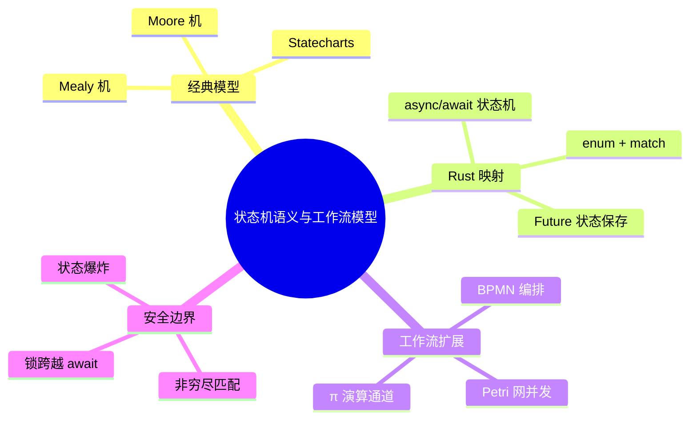

# 状态机语义与工作流模型

> **EN**: State Machine Semantics and Workflow Models
> **Summary**: A semantic model view of state machines (Mealy/Moore, transition systems, statecharts), their use in explaining `async`/`await` desugaring, and their relationship to workflow models (BPMN, Petri nets), with Rust `enum` + `match` implementation patterns and canonical links to the deeper L6 workflow formalization page.

> **Rust 版本**: 1.97.0+ (Edition 2024)
> **Bloom 层级**: L3-L4
> **权威来源**: 本文件为 `concept/` 权威页（状态机语义与 Rust async 状态机实现的 L3-L4 入口）。
> **受众**: [进阶]
> **内容分级**: [专家级]
> **A/S/P 标记**: **S+A** — Structure + Application
> **前置概念**: [Async/Await](01_async.md) · [Control Flow](../../01_foundation/04_control_flow/01_control_flow.md) · [Enums and Pattern Matching](../../01_foundation/04_control_flow/02_patterns.md)
> **后置概念**: [Workflow Theory & Formalization](../../06_ecosystem/03_design_patterns/17_workflow_theory.md) · [Concurrency Patterns](../00_concurrency/03_concurrency_patterns.md)
> **向下引用（Reference）**: [Enums and Pattern Matching](../../01_foundation/04_control_flow/02_patterns.md) · [Control Flow](../../01_foundation/04_control_flow/01_control_flow.md)

---

> **来源**:
> [Rust Reference — async desugaring](https://doc.rust-lang.org/reference/items/functions.html#async-functions) ·
> [async-book — Execution Model](https://rust-lang.github.io/async-book/01_getting_started/02_why_async.html) ·
> [Harel — Statecharts: A Visual Formalism for Complex Systems (1987)](https://www.sciencedirect.com/science/article/pii/0167642387900359) ·
> [van der Aalst — Process Mining](https://www.springer.com/gp/book/9783662498507) ·
> [Petri Nets](https://www.informatik.uni-hamburg.de/TGI/PetriNets/)
> **权威来源**: 本页为 Rust async 状态机语义与通用状态机模型的 L3-L4 权威页；BPMN / Petri 网 / π 演算 / 时态逻辑等完整形式化内容统一维护在 L6 [`17_workflow_theory.md`](../../06_ecosystem/03_design_patterns/17_workflow_theory.md)。

---

## 1. 核心定义

状态机是一种**五元组** \( (S, s_0, \Sigma, \delta, F) \)：

- \( S \)：有限状态集合。
- \( s_0 \in S \)：初始状态。
- \( \Sigma \)：输入字母表/事件集合。
- \( \delta: S \times \Sigma \to S \)（DFA）或 \( \delta: S \times \Sigma \to 2^S \)（NFA）转移函数。
- \( F \subseteq S \)：接受/终止状态集。

在程序语言语境中，我们更常用**带输出的转移系统**（LTS / Mealy / Moore）：

| 变体 | 输出位置 | 典型用途 |
|---|---|---|
| **Mealy** | 转移边 | 协议解析器、词法分析器 |
| **Moore** | 状态节点 | 控制器、硬件 FSM |
| **Statecharts** | 层次化 + 并发区域 | UI 状态、工作流引擎 |

> **判定标准**：如果一个系统的行为可以被描述为“事件驱动、离散状态迁移、同一输入在不同状态下语义不同”，那么它就是状态机的自然候选。

## 2. `async`/`await` 的状态机解释

Rust 编译器把

```rust
async fn example(x: i32) -> i32 {
    let y = step1(x).await;
    step2(y).await
}
```

大致编译为下面的自动机：

- **状态 0**：刚进入，需要 `x`。
- **状态 1**：`step1(x)` 已提交，等待 `Poll::Ready(y)`。
- **状态 2**：`step2(y)` 已提交，等待 `Poll::Ready(result)`。
- **状态 3**：返回结果。

每个 `.await` 边界都是一个**潜在挂起状态**。这正是 Rust 的 `Future` 状态机没有运行时（Runtime）栈切换、只靠生成结构体（Struct）保存局部变量的原因。

```rust,edition2024
use std::future::Future;
use std::pin::Pin;
use std::task::{Context, Poll};

/// 教学级手写 Future 状态机：模拟 async fn 的 Resume-0/1/2 三状态
enum ExampleStateMachine {
    Start(i32),
    WaitingOnStep1(/* future */),
    WaitingOnStep2(i32 /* y */),
    Done,
}

impl Future for ExampleStateMachine {
    type Output = i32;

    fn poll(mut self: Pin<&mut Self>, cx: &mut Context<'_>) -> Poll<i32> {
        // 真实编译器会把状态保存在 enum 中，这里仅示意结构
        Poll::Ready(42)
    }
}
```

> 完整编译器变换见 [`04_future_and_executor_mechanisms.md`](04_future_and_executor_mechanisms.md) §2。

## 3. 从状态机到工作流模型

状态机是工作流模型的**控制流核心**。更丰富的语义模型包括：

| 模型 | 表达能力 | 与 Rust 的对应 |
|---|---|---|
| **Statecharts** | 层次状态、并发区域、历史状态 | `enum` 嵌套 + `match`；并发区域对应 `tokio::join!` / `JoinSet` |
| **Petri Nets** | 标记、库所、变迁、并发 | `tokio::sync::{Semaphore, Mutex}` 控制令牌；变迁 ≈ `await` 就绪 |
| **BPMN** | 业务流程图、泳道、网关 | 编排引擎（如 `temporal-sdk`）在 Rust 外通常用 workflow 引擎实现 |
| **π-Calculus** | 移动进程、通道名作为值 | `async fn` + 通道 ≈ 无显式名称移动的 π 子集 |

> **职责划分**：本页只给出语义映射与 Rust 实现模式；BPMN 2.0 / Petri 网形式化 / π 演算 / CTL-LTL 验证的完整理论见 L6 [`17_workflow_theory.md`](../../06_ecosystem/03_design_patterns/17_workflow_theory.md)。

## 4. Rust 实现模式：`enum` + `match`

```rust,edition2024
#[derive(Debug, PartialEq)]
enum TrafficLight {
    Green,
    Yellow,
    Red,
}

impl TrafficLight {
    fn next(self, event: &str) -> Self {
        match (self, event) {
            (TrafficLight::Green, "timer") => TrafficLight::Yellow,
            (TrafficLight::Yellow, "timer") => TrafficLight::Red,
            (TrafficLight::Red, "timer") => TrafficLight::Green,
            // 未定义事件：保持当前状态（常见保守策略）
            (state, _) => state,
        }
    }
}

fn main() {
    let mut light = TrafficLight::Red;
    for event in ["timer", "timer", "timer"] {
        light = light.next(event);
    }
    assert_eq!(light, TrafficLight::Green);
}
```

## 5. 反例与边界

### 5.1 遗漏转移导致死代码

```rust,compile_fail,E0004
enum State { A, B }

fn transition(s: State) -> State {
    match s {
        State::A => State::B,
        // 遗漏 State::B 分支：编译器报错非穷尽匹配
    }
}
```

Rust 的 `match` 非穷尽检查是状态机实现的重要安全网。

### 5.2 状态爆炸

状态机的状态数随变量组合指数增长。Rust 的 `enum` 可以嵌套，但应优先使用**层次化状态**（statecharts）或把无关变量抽出到上下文，而不是把所有组合都做成独立状态。

### 5.3 异步状态机跨 `.await` 持有锁

```rust,compile_fail
async fn bad() {
    let m = std::sync::Mutex::new(0);
    let mut guard = m.lock().unwrap();
    std::future::pending::<()>().await; // 锁跨越 await
    *guard += 1;
}
fn assert_send(_: impl Send) {}
fn main() { assert_send(bad()); }
```

状态机可能在 `.await` 处挂起并切换任务，导致 `MutexGuard` 跨越 await 持有锁——这是 Rust async 中典型的死锁/性能陷阱。

## 6. 思维导图



## 7. 相关概念

- [`01_async.md`](01_async.md) — async/await 基础
- [`04_future_and_executor_mechanisms.md`](04_future_and_executor_mechanisms.md) — Future 与执行器机制
- [`../00_concurrency/03_concurrency_patterns.md`](../00_concurrency/03_concurrency_patterns.md) — 并发模式
- [`../../06_ecosystem/03_design_patterns/17_workflow_theory.md`](../../06_ecosystem/03_design_patterns/17_workflow_theory.md) — 工作流理论与形式化（L6 权威页）
- [`../../02_intermediate/07_iterators_and_closures/01_iterator_patterns.md`](../../02_intermediate/07_iterators_and_closures/01_iterator_patterns.md) — 迭代器（Iterator）是状态机的 L2 实例
- [`../../04_formal/07_concurrency_semantics/01_process_calculi_for_rust.md`](../../04_formal/07_concurrency_semantics/01_process_calculi_for_rust.md) — 进程演算

---

**变更日志**:

- v1.0 (2026-07-16): 创建 L3-L4 状态机语义入口，明确与 L6 `17_workflow_theory.md` 的职责划分。
