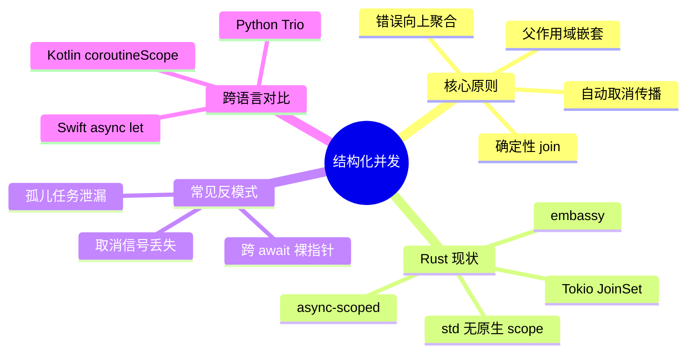

> **内容分级**: [专家级]

# 结构化并发（Structured Concurrency）
>
> **EN**: Structured Concurrency
> **Summary**: Structured concurrency is a discipline for managing concurrent tasks with explicit, bounded lifetimes and automatic cancellation propagation, making async program structure mirror synchronous control flow.
> **Rust 版本**: 1.97.0+ (Edition 2024)
> **受众**: [专家]
> **Bloom 层级**: L3
> **权威来源**: 本文件为 `concept/` 权威页。
> **A/S/P 标记**: **S+P** — Structure + Procedure
> **双维定位**: C×Ana — 分析异步任务生命周期的结构化约束
> **定位**: 响应 Async Book 新版对 "Structured concurrency" 的跟踪需求，为 Rust 异步生态中缺乏原生结构化并发支持的问题建立权威解释。
>
> **前置概念**: [Async/Await](01_async.md) · [Async Cancellation Safety](05_async_cancellation_safety.md) · [Future and Executor Mechanisms](04_future_and_executor_mechanisms.md) · [Error Handling](../../02_intermediate/03_error_handling/01_error_handling.md)
> **后置概念**: [Async IOUring Preview](../../07_future/02_preview_features/39_async_ioring_preview.md) · [Tokio Runtime Internals](../../06_ecosystem/04_web_and_networking/10_tokio_runtime_internals.md)
>
> **来源**:
> [Async Book (WIP)](https://rust-lang.github.io/async-book/) ·
> [Structured Concurrency by Martin Sustrik](https://www.250bpm.com/p/structured-concurrency) ·
> [Project Loom](https://openjdk.org/projects/loom/) ·
> [Kotlin Coroutines](https://kotlinlang.org/docs/coroutine-context-and-dispatchers.html) ·
> [Swift Structured Concurrency](https://docs.swift.org/swift-book/documentation/the-swift-programming-language/concurrency/)

---

> **对应 Crate**: 见 [`c06_async`](../../crates/c06_async)
> **对应练习**: 见 [`exercises/src/async_programming/`](../../exercises/src/async_programming)

## 🧠 知识结构图



## 📑 目录

- [结构化并发（Structured Concurrency）](#结构化并发structured-concurrency)
  - [🧠 知识结构图](#-知识结构图)
  - [📑 目录](#-目录)
  - [一、权威定义](#一权威定义)
  - [二、核心原则](#二核心原则)
  - [三、Rust 现状与缺口](#三rust-现状与缺口)
  - [四、与 `join!` / `select!` / `spawn` 的关系](#四与-join--select--spawn-的关系)
  - [五、取消传播与错误处理](#五取消传播与错误处理)
  - [六、跨语言对比](#六跨语言对比)
  - [七、反命题与边界](#七反命题与边界)
    - [反例：孤儿任务泄漏](#反例孤儿任务泄漏)
  - [八、参考来源](#八参考来源)

---

## 一、权威定义

**结构化并发**要求：

> 任何并发子任务的生存期都必须**嵌套在其父任务的作用域内**；父任务结束时，所有子任务必须已完成或被取消。

这与结构化编程中“goto 不能跳出当前作用域”的思想同源：并发控制流也应具备清晰的入口和出口，避免“孤儿任务”在后台泄漏。

---

## 二、核心原则

| 原则 | 含义 |
|:---|:---|
| **No orphan tasks** | 子任务必须由父任务显式创建，父任务结束即子任务结束 |
| **Cancellation propagation** | 父任务取消时，所有子任务自动收到取消信号 |
| **Error propagation** | 任一子任务失败时，兄弟任务通常应被取消，错误向上聚合 |
| **Structured lifetime** | 子任务句柄的生命周期受父 `async` 块或 `scope` 限制 |
| **Deterministic join** | 父任务退出前必须等待（或取消并等待）所有子任务 |

---

## 三、Rust 现状与缺口

Rust std 与 Tokio 当前**没有原生结构化并发 API**。最接近的构造是：

- `tokio::spawn`：产生独立任务，生命周期不绑定到调用作用域。
- `tokio::task::JoinSet`（Tokio 1.20+）：允许在集合中管理多个子任务，集合 drop 时会取消所有未完成任务，但仍是库级方案。
- `futures::future::join!` / `select!`：组合多个 future，但不提供作用域嵌套。

**真正的结构化并发需要**：

```rust,ignore
// 理想 API（概念演示，非当前 Rust 稳定 API）
async fn parent() -> Result<()> {
    scope(|s| {
        s.spawn(child_a());
        s.spawn(child_b());
        // scope 结束时，所有子任务自动 join/cancel
    }).await
}
```

当前 Rust 生态中较成熟的实现：

| Crate | 机制 | 状态 |
|:---|:---|:---|
| `tokio::task::JoinSet` | 任务集合管理 | 稳定，部分结构化能力 |
| `async-scoped` | unsafe 作用域扩展 | 社区维护 |
| `embassy` | 嵌入式 async executor 内置 scope | 活跃 |
| `must_let` / `task_scope` | 实验性 scope | 实验 |

---

## 四、与 `join!` / `select!` / `spawn` 的关系

```text
结构化并发光谱:

  非结构化 ──────────────────────── 完全结构化
  spawn (孤儿)    join!            scoped spawn
       │            │                  │
       ▼            ▼                  ▼
   生命周期不绑定   组合多个 Future      生命周期绑定到 scope
   需手动 abort     同时 await          自动 cancel/join
```

- `spawn`：fire-and-forget，最容易泄漏。
- `join!`：同时运行多个 future 并等待全部完成，但仍是“一层的”组合。
- `scope`：嵌套、可取消、可传播错误，是结构化并发的核心抽象。

---

## 五、取消传播与错误处理

在结构化并发中，取消是一种**协作式**机制：

1. 父 scope 决定取消（因错误、超时、外部信号）。
2. 取消信号通过 `AbortHandle` / `CancellationToken` 传播到子任务。
3. 子任务在 `.await` 点检查取消并优雅退出。
4. 父 scope 等待所有子任务退出后，再向上返回聚合错误。

```rust,ignore
// 概念 API（演示取消传播）
async fn parent_with_timeout() -> Result<()> {
    timeout(Duration::from_secs(5), async {
        scope(|s| {
            s.spawn(io_task());
            s.spawn(cpu_task());
        }).await
    }).await??;
    Ok(())
}
```

---

## 六、跨语言对比

| 语言/平台 | 结构化并发支持 |
|:---|:---|
| **Swift** | `async let` / `withTaskGroup` — 原生结构化并发 |
| **Kotlin** | `coroutineScope { launch { ... } }` — 原生支持 |
| **Java (Project Loom)** | `StructuredTaskScope` — 原生支持 |
| **Go** | 无原生结构化并发，靠 `errgroup` / `context` 模拟 |
| **Python (Trio)** | Nursery — 完全结构化并发 |
| **Rust** | 库级方案（JoinSet、async-scoped），尚无原生 `scope` |

---

## 七、反命题与边界

- **“结构化并发会消除所有并发 bug”**：不成立。它主要解决**任务泄漏**和**取消传播**问题，不解决数据竞争、死锁、竞态条件。
- **“Rust 没有结构化并发就不能写可靠异步代码”**：不成立。通过 `JoinSet`、显式 `AbortHandle`、超时组合可以实现类似效果，但 boilerplate 更多。
- **边界**：结构化并发对**CPU-bound 任务**和**长时间运行后台任务**的语义需要特殊处理——并非所有任务都适合被强制绑定到父作用域。

### 反例：孤儿任务泄漏

以下代码在 `main` 返回后，`spawn` 出的后台任务可能成为**孤儿任务**：父作用域已结束，子任务仍在运行，导致程序无法正常退出或资源泄漏。

```rust,ignore
use tokio::task;

async fn orphan_task() {
    task::spawn(async {
        // 若父任务取消/退出，此任务可能仍在后台运行
        tokio::time::sleep(std::time::Duration::from_secs(10)).await;
    });
    // 父任务立即返回，未等待、未 abort 子任务
}
```

结构化并发方案要求子任务句柄的生命周期绑定到父 `scope`，scope 退出前必须 join 或 cancel 所有子任务。

---

## 八、参考来源

- Async Book structured concurrency (WIP): <https://rust-lang.github.io/async-book/>
- Martin Sustrik, *Structured Concurrency*: <https://www.250bpm.com/p/structured-concurrency>
- Swift Concurrency: <https://docs.swift.org/swift-book/documentation/the-swift-programming-language/concurrency/>
- Kotlin Coroutines: <https://kotlinlang.org/docs/coroutine-context-and-dispatchers.html>
- Project Loom StructuredTaskScope: <https://openjdk.org/jeps/453>
