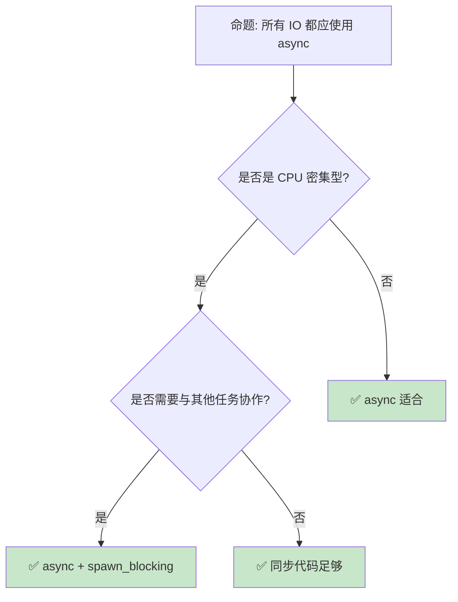

> **内容分级**: [专家级]

# 异步模式：从 Future 到生产级并发
>
> **EN**: Concurrency
> **Summary**: Concurrency. Core Rust concept covering mechanism analysis, in-depth analysis, design patterns.
> **受众**: [专家]
> **Bloom 层级**: 分析 → 评价
> **A/S/P 标记**: **S+P** — Structure + Procedure
> **双维定位**: C×Ana — 分析异步（Async）模式的状态机变换
> **定位**: 深入分析 Rust **异步编程的高级模式**——从 Future 状态机、Pin 保证到并发执行和取消传播，揭示 Rust async/await 如何在零运行时（Runtime）开销下实现高效并发。
> **前置概念**: [Async](02_async.md) · [Pin](06_pin_unpin.md) · [Concurrency](../00_concurrency/01_concurrency.md)
> **后置概念**: [Distributed Systems](../../06_ecosystem/04_web_and_networking/18_distributed_systems.md) · [Tokio](https://tokio.rs/)

---

> **来源**: · [Herlihy & Shavit — The Art of Multiprocessor Programming](https://dl.acm.org/doi/10.5555/2385452) · [Batty et al. — The Semantics of Multicore C](https://doi.org/10.1145/2049706.2049711) · [Brown University — Interactive Rust Book](https://rust-book.cs.brown.edu/) · [Jung et al. — RustBelt: Securing the Foundations of Rust](https://plv.mpi-sws.org/rustbelt/popl18/) · [Itanium C++ ABI](https://itanium-cxx-abi.github.io/cxx-abi/abi.html)
> [TRPL — Async/Await](https://doc.rust-lang.org/book/ch17-00-async-await.html) ·
> [Async Rust Book](https://rust-lang.github.io/async-book/index.html) ·
> [tokio.rs](https://tokio.rs/) ·
> [RFC 2394 — Async/Await](https://rust-lang.github.io/rfcs//2394-async_await.html) ·
> [Wikipedia — Futures and Promises](https://en.wikipedia.org/wiki/Futures_and_promises)
> **对应 Crate**: [`c06_async`](../../crates/c06_async)
> **对应练习**: [`exercises/src/async_programming/`](../../exercises/src/async_programming)

## 📑 目录

- 异步（Async）模式：从 Future 到生产级并发
  - [📑 目录](#-目录)
  - [一、核心概念](#一核心概念)
    - [1.1 Future 与状态机](#11-future-与状态机)
    - 1.2 Pin 与自引用（Reference）
    - [1.3 Waker 与执行器](#13-waker-与执行器)
  - [二、技术细节](#二技术细节)
    - [2.1 并发执行模式](#21-并发执行模式)
    - [2.2 取消与超时](#22-取消与超时)
  - [十、边界测试：异步（Async）模式的编译错误](#十边界测试异步模式的编译错误)
    - 10.1 边界测试：`Stream` 与 `Future` 的所有权（Ownership）混淆（编译错误）
    - [10.2 边界测试：取消安全（Cancellation Safety）违反（逻辑错误）](#102-边界测试取消安全cancellation-safety违反逻辑错误)
    - [2.3 背压与流控制](#23-背压与流控制)
  - [三、异步（Async）模式矩阵](#三异步模式矩阵)
  - [四、反命题与边界分析](#四反命题与边界分析)
    - [4.1 反命题树](#41-反命题树)
    - [4.2 边界极限](#42-边界极限)
  - [五、常见陷阱](#五常见陷阱)
  - [六、来源与延伸阅读](#六来源与延伸阅读)
  - [相关概念文件](#相关概念文件)
  - [逆向推理链（Backward Reasoning）](#逆向推理链backward-reasoning)
  - [权威来源索引](#权威来源索引)
    - 10.3 边界测试：取消安全性（Cancellation Safety）的违反（运行时（Runtime）行为）
    - [10.4 边界测试：`tokio::spawn` 的 `Send` 约束与 `Rc`（编译错误）](#104-边界测试tokiospawn-的-send-约束与-rc编译错误)
    - [10.5 边界测试：`Stream` 的 `fuse` 与 `select_next_some` 的交互（运行时（Runtime） panic）](#105-边界测试stream-的-fuse-与-select_next_some-的交互运行时-panic)
    - [10.3 边界测试：`Stream` 的背压与缓冲区溢出（运行时（Runtime）内存增长）](#103-边界测试stream-的背压与缓冲区溢出运行时内存增长)
    - 10.4 边界测试：async fn 在 trait 中的生命周期（Lifetimes）推断与实现约束（编译错误）
  - [认知路径](#认知路径)
    - [核心推理链](#核心推理链)
    - [反命题与边界](#反命题与边界)
  - [实践](#实践)
    - [对应代码示例](#对应代码示例)
    - [建议练习](#建议练习)
  - [导航：下一步去哪？](#导航下一步去哪)
  - [嵌入式测验](#嵌入式测验)
    - [测验 1：tokio::select!（记忆层）](#测验-1tokioselect记忆层)
    - [测验 2：Backpressure（理解层）](#测验-2backpressure理解层)
    - [测验 3：Actor 模式（应用层）](#测验-3actor-模式应用层)
    - [测验 4：取消安全（分析层）](#测验-4取消安全分析层)

---

## 一、核心概念

### 1.1 Future 与状态机

```text
Future 的本质:

  定义:
  ├── Future 是" eventually 产生值的计算"
  ├── 惰性: 创建时不执行
  ├── 轮询驱动: 执行器 poll 时才推进
  └── 状态机: async fn 编译为状态机

  async fn 的脱糖:
  async fn foo() -> i32 { 42 }

  // 等价于:
  fn foo() -> impl Future<Output = i32> {
      async { 42 }
  }

  状态机结构:
  enum FooFuture {
      Start,
      Waiting1(/* 捕获的局部变量 */),
      Waiting2(/* 捕获的局部变量 */),
      Done,
  }

  执行流程:
  1. 调用 async fn，返回 Future（未启动）
  2. 执行器 poll Future
  3. Future 执行到第一个 .await，返回 Pending
  4. 当等待的任务完成，Waker 唤醒执行器
  5. 执行器再次 poll，从上次暂停点继续
  6. 重复直到 Future 返回 Ready

  零成本特性:
  ├── 编译后状态机与手写等价
  ├── 无运行时分配（除非 Box::pin）
  ├── 与同步代码相同的性能
  └── 只需执行器提供调度
```

> **认知功能**: **Future 是"可暂停的函数"**——编译器将 async/await 转换为状态机，使代码看起来像同步但执行是异步的。
> [来源: [Async Rust Book — Future](https://rust-lang.github.io/async-book//02_execution/02_future.html)]

---

### 1.2 Pin 与自引用
>

```rust,ignore
// Pin: 保证 Future 的内存位置不变

use std::pin::Pin;
use std::future::Future;
use std::task::{Context, Poll};

// async fn 内部可能有自引用:
async fn example() {
    let s = String::from("hello");
    let r = &s;  // r 引用 s
    some_async_op().await;  // 可能暂停，但 r 必须继续有效
    println!("{}", r);
}

// 编译后的状态机:
struct ExampleFuture {
    s: String,
    r: *const String,  // 自引用指针！
    state: u8,
}

// Pin 保证:
// ├── Pin<&mut T> 阻止 T 被移动
// ├── 自引用指针保持有效
// ├── 内存位置不变
// └── 但允许通过 &mut T 修改内容

// 使用 Pin:
fn poll_future(future: Pin<&mut dyn Future<Output = ()>>) {
    let mut cx = Context::from_waker(...);
    let _ = future.poll(&mut cx);
}

// Box::pin: 将 Future Pin 到堆上
let future = Box::pin(async { /* ... */ });
```

> **Pin 洞察**: **Pin 是 Rust async 的基石**——它解决了状态机自引用（Reference）问题，使编译器生成的状态机可以安全地跨越 await 点。
> [来源: [std::pin::Pin](https://doc.rust-lang.org/std/pin/struct.Pin.html)]

---

### 1.3 Waker 与执行器
>

```text
Waker: 异步通知机制

  角色:
  ├── Future 返回 Pending 时，注册 Waker
  ├── 当资源就绪（IO 完成、定时器到期），调用 Waker
  ├── Waker 通知执行器重新 poll Future
  └── 避免忙等待

  执行器（Executor）:
  ├── Tokio: 生产级执行器（多线程）
  ├── Tokio: 标准库风格的执行器
  ├── smol: 小型执行器
  └── 自定义: 可针对特定场景优化

  Tokio 执行器:
  ├── 多线程工作窃取调度
  ├── 任务队列: run queue + LIFO slot
  ├── IO 驱动: epoll/kqueue/IOCP
  ├── 定时器: 时间轮
  └── 阻塞任务: spawn_blocking

  执行模型:
  1. 任务提交到执行器
  2. 工作线程从队列获取任务
  3. poll Future 直到 Pending
  4. 注册 Waker（关联到 IO/定时器）
  5. IO 就绪 → Waker 唤醒 → 重新调度
  6. Future 完成 → 输出结果
```

> **Waker 洞察**: **Waker 是"按需唤醒"的优化**——没有它，执行器需要不断轮询所有任务（忙等待）。
> [来源: [tokio.rs — Runtime](https://tokio.rs/tokio/tutorial)]

---

## 二、技术细节

### 2.1 并发执行模式
>

```rust,ignore
// 异步并发模式

use tokio::task;

// 1. join: 等待所有完成
async fn fetch_all() -> (String, String) {
    let a = fetch_url("url1");
    let b = fetch_url("url2");
    tokio::join!(a, b)  // 同时执行，等待两者
}

// 2. select: 等待任一完成
async fn race() -> String {
    let a = fetch_url("url1");
    let b = fetch_url("url2");
    tokio::select! {
        result = a => result,
        result = b => result,
    }
}

// 3. spawn: 创建独立任务
async fn spawn_tasks() {
    let handle1 = task::spawn(async {
        // 在后台执行
        do_work().await
    });

    let handle2 = task::spawn(async {
        do_other_work().await
    });

    let result1 = handle1.await.unwrap();
    let result2 = handle2.await.unwrap();
}

// 4. 并发限制 (Semaphore)
use tokio::sync::Semaphore;

async fn limited_concurrency(urls: Vec<String>) {
    let sem = Arc::new(Semaphore::new(10));  // 最多 10 并发

    let futures = urls.into_iter().map(|url| {
        let sem = sem.clone();
        async move {
            let _permit = sem.acquire().await.unwrap();
            fetch_url(&url).await
        }
    });

    let results: Vec<_> = futures::future::join_all(futures).await;
}

// 5. 流式处理 (Streams)
use tokio_stream::StreamExt;

async fn process_stream() {
    let mut stream = tokio_stream::iter(0..100);

    while let Some(item) = stream.next().await {
        println!("{}", item);
    }
}
```

> **并发洞察**: **tokio::join! 和 tokio::select! 是异步（Async）并发的核心原语**——它们对应同步并发中的 join 和 select 系统调用。
> [来源: [tokio::select!](https://docs.rs/tokio/latest/tokio/macro.select.html)]

---

### 2.2 取消与超时
>

## 十、边界测试：异步模式的编译错误

### 10.1 边界测试：`Stream` 与 `Future` 的所有权混淆（编译错误）

```rust,compile_fail
use futures::stream::{self, StreamExt};
use futures::future::FutureExt;

async fn bad_mix() {
    let s = stream::iter(vec![1, 2, 3]);
    // ❌ 编译错误: `stream::Iter` 不是 `Future`
    // Stream 和 Future 是不同的 trait，不能混用
    let val = s.await; // Stream 需要 next().await
}

// 正确: 使用 next() 从 Stream 获取 Future
async fn fixed() {
    let mut s = stream::iter(vec![1, 2, 3]);
    while let Some(val) = s.next().await { // ✅ StreamExt::next 返回 Future
        println!("{}", val);
    }
}
```

> **修正**:
> `Stream` 和 `Future` 是 Rust 异步（Async）生态中的两个核心 trait。
> `Future` 代表**单次**异步（Async）计算，`Stream` 代表**多次**异步值序列。
> `Stream` 不实现 `Future`，必须通过 `StreamExt::next()` 获取 `Future<Item = Option<T>>`。
> 这与 JavaScript 的 `AsyncIterator`（`for await...of`）类似，但 Rust 的区分更严格——编译器拒绝将 Stream 直接 await。
> [来源: [futures-rs Documentation](https://docs.rs/futures/)]

### 10.2 边界测试：取消安全（Cancellation Safety）违反（逻辑错误）

```rust
use tokio::sync::mpsc;

async fn bad_cancel_safe() {
    let (tx, mut rx) = mpsc::channel::<i32>(1);
    tx.send(1).await.unwrap();

    // ⚠️ 逻辑错误: 非取消安全的操作
    // 若此 future 在 recv().await 时被取消，消息可能已消费但未处理
    let val = rx.recv().await.unwrap();
    // 若取消发生在 recv 返回后但 val 使用前，消息丢失
    println!("{}", val);
}

// 正确: 使用 cancel-safe 的 channel 或立即处理
async fn fixed() {
    let (tx, mut rx) = mpsc::channel::<i32>(1);
    tx.send(1).await.unwrap();

    // tokio::select! 中必须使用 cancel-safe 操作
    tokio::select! {
        Some(val) = rx.recv() => {
            println!("{}", val); // ✅ 在 select 分支内立即处理
        }
        else => println!("channel closed"),
    }
}
```

> **修正**:
> 取消安全（cancellation safety）指 async 操作在 future 被取消后仍保持正确状态。
> `tokio::sync::mpsc::Receiver::recv` 是取消安全的——若 future 在 `await` 时被丢弃，消息保留在 channel 中。
> 但自定义组合操作可能不 cancel-safe：若在 `await` 前后有状态变更，取消可能导致状态不一致。
> Tokio 文档明确标注每个 API 的取消安全性，这是 Rust 异步（Async）编程相比其他语言更严格的契约。
> [来源: [Tokio Documentation](https://docs.rs/tokio/)]

```rust,ignore
// 取消和超时控制

use tokio::time::{timeout, Duration};

// 1. 超时
async fn fetch_with_timeout() -> Result<String, &'static str> {
    match timeout(Duration::from_secs(5), fetch_url("slow")).await {
        Ok(result) => Ok(result),
        Err(_) => Err("timeout"),
    }
}

// 2. 结构化取消: CancellationToken
use tokio_util::sync::CancellationToken;

async fn cancellable_task(token: CancellationToken) {
    loop {
        tokio::select! {
            _ = token.cancelled() => {
                println!("Cancelled!");
                break;
            }
            _ = do_work() => {}
        }
    }
}

// 3. 优雅关闭
async fn graceful_shutdown() {
    let token = CancellationToken::new();
    let child_token = token.child_token();

    let handle = tokio::spawn(cancellable_task(child_token));

    // 触发取消
    token.cancel();

    // 等待任务完成清理
    handle.await.unwrap();
}

// 4. Drop 取消: 当 Future 被 drop，async 块中的资源被清理
async fn auto_cancel() {
    let guard = scopeguard::guard((), |_| {
        println!("Cleanup on cancel");
    });

    long_operation().await;

    scopeguard::ScopeGuard::into_inner(guard);
}
```

> **取消洞察**: **Rust 的取消通过 Drop 传播**——当 Future 被 drop，所有已获取的资源自动清理，无需显式取消回调。
> [来源: [Async Cancellation](https://rust-lang.github.io/async-book/index.html)]

---

### 2.3 背压与流控制
>

```rust,ignore
// 背压: 防止生产者压倒消费者

use tokio::sync::mpsc;

// 1. 有界通道（内置背压）
async fn bounded_channel_example() {
    let (tx, mut rx) = mpsc::channel(100);  // 缓冲 100 个消息

    // 生产者: 当通道满时，send().await 阻塞
    tokio::spawn(async move {
        for i in 0..1000 {
            tx.send(i).await.unwrap();  // 背压在这里！
        }
    });

    // 消费者: 按自己的节奏处理
    while let Some(msg) = rx.recv().await {
        process(msg).await;
    }
}

// 2. 限流 (Rate Limiting)
use tokio::time::{interval, Duration};

async fn rate_limited() {
    let mut interval = interval(Duration::from_millis(100));

    loop {
        interval.tick().await;  // 每 100ms 允许一次
        make_request().await;
    }
}

// 3. 批量处理
use tokio::time::timeout;

async fn batch_processing(mut rx: mpsc::Receiver<i32>) {
    let mut batch = Vec::new();

    loop {
        match timeout(Duration::from_millis(50), rx.recv()).await {
            Ok(Some(item)) => {
                batch.push(item);
                if batch.len() >= 100 {
                    process_batch(std::mem::take(&mut batch)).await;
                }
            }
            _ => {
                if !batch.is_empty() {
                    process_batch(std::mem::take(&mut batch)).await;
                }
            }
        }
    }
}
```

> **背压洞察**: **有界通道是异步（Async）背压的核心机制**——它使系统在生产者和消费者之间自动平衡负载。
> [来源: [tokio::sync::mpsc](https://docs.rs/tokio/latest/tokio/sync/mpsc/index.html)]

---

## 三、异步模式矩阵

```text
场景 → 模式 → 工具

并发请求:
  → tokio::join!
  → 等待多个 Future 完成
  → let (a, b) = tokio::join!(fa, fb);

竞争/超时:
  → tokio::select! + timeout
  → 取最先完成的
  → select! { r = fa => ..., _ = sleep(5s) => ... }

后台任务:
  → tokio::spawn
  → 独立生命周期
  → let handle = spawn(async { ... });

限流:
  → Semaphore
  → 控制并发数
  → Semaphore::new(10)

背压:
  → 有界 channel
  → 防止内存爆炸
  → mpsc::channel(100)

流处理:
  → Stream
  → 异步迭代
  → stream.next().await

CPU 密集型 offload:
  → tokio::task::spawn_blocking
  → 将阻塞/计算任务移到独立线程池
  → spawn_blocking(|| heavy_compute()).await?
```

> **模式矩阵**: Rust 异步（Async）的**核心模式可以归纳为 7 类**——覆盖从简单并发到复杂流处理的大部分场景。

### 2.4 spawn_blocking 与混合架构

异步运行时（Runtime）擅长 I/O 密集型任务，但不应在异步任务中执行阻塞或 CPU 密集型计算，否则会阻塞事件循环。`tokio::task::spawn_blocking` 将任务卸载到独立线程池：

```rust
use tokio::task;

async fn process_image(data: Vec<u8>) -> Result<Vec<u8>, task::JoinError> {
    task::spawn_blocking(move || {
        // CPU 密集型或阻塞操作
        heavy_compression(data)
    })
    .await
}
```

**决策要点**:

- I/O 密集 → 异步任务
- CPU 密集 → `spawn_blocking` 或 rayon
- 混合工作负载 → 异步 + `spawn_blocking` 组合

> **认知功能**: `spawn_blocking` 是**异步与同步世界之间的桥接器**——它保留了 async/await 的编程模型，同时避免阻塞异步执行器。
> [来源: [Tokio — spawn_blocking](https://docs.rs/tokio/latest/tokio/task/fn.spawn_blocking.html)]
> [来源: [Async Patterns](https://rust-lang.github.io/async-book/index.html)]

---

## 四、反命题与边界分析

### 4.1 反命题树
>



> **认知功能**: **async 适合 IO 密集型，CPU 密集型需要 spawn_blocking 或 rayon**——混合使用是关键。
> [来源: [Async Rust Book — CPU Bound](https://rust-lang.github.io/async-book/index.html)]

---

### 4.2 边界极限
>

```text
边界 1: 异步递归
├── async fn 递归需要 Box::pin
├── 每次递归产生类型爆炸
├── 编译错误难以诊断
└── 缓解: 使用 Box<dyn Future> 或迭代替代

边界 2: 调用栈深度
├── async fn 状态机在堆上分配
├── 但执行栈仍有限
├── 深层递归可能导致栈溢出
└── 缓解: 限制递归深度，使用循环

边界 3: 取消安全
├── 某些操作在取消点可能处于不一致状态
├── select! 可能取消未完成分支
├── 需要显式处理清理
└── 缓解: 使用 scopeguard，避免在 select! 中做非原子操作

边界 4: 调试困难
├── 异步堆栈跟踪复杂
├── 跨越 await 点的调试信息丢失
├── 并发 bug 难以复现
└── 缓解: tokio-console, tracing

边界 5: 生态碎片化
├── Tokio vs Tokio vs smol
├── 不同运行时互不兼容
├── 库选择受运行时约束
└── 缓解: Tokio 是事实标准
```

> **边界要点**: 异步的边界主要与**递归**、**调用栈**、**取消安全**、**调试**和**生态**相关。
> [来源: [Async Rust Book — Workarounds](https://rust-lang.github.io/async-book/index.html)]

---

## 五、常见陷阱

```text
陷阱 1: 在 async 中阻塞
  ❌ async fn bad() {
         std::thread::sleep(Duration::from_secs(10));  // 阻塞线程！
     }

  ✅ async fn good() {
         tokio::time::sleep(Duration::from_secs(10)).await;  // 非阻塞
     }

陷阱 2: 忘记 await
  ❌ async fn bad() {
         do_something();  // 返回 Future 但未 await！
     }

  ✅ async fn good() {
         do_something().await;
     }

陷阱 3: select! 中的资源泄漏
  ❌ select! {
         _ = read_file() => {},
         _ = timeout => {},
     }
     // read_file 可能正在读取，但结果丢失

  ✅ 使用 CancellationToken 或结构化并发

陷阱 4: 在 async 中使用非 Send 类型
  ❌ async fn bad() {
         let rc = Rc::new(5);
         spawn(async move { *rc }).await;  // Rc 不是 Send！
     }

  ✅ 使用 Arc 替代 Rc
     // 或使用 tokio::task::LocalSet

陷阱 5: 无界通道导致内存泄漏
  ❌ let (tx, rx) = mpsc::unbounded_channel();
     // 生产者快于消费者时内存无限增长

  ✅ let (tx, rx) = mpsc::channel(100);
     // 有界通道提供背压
```

> **陷阱总结**: 异步陷阱主要与**阻塞**、**await 遗漏**、**取消安全**、**Send 约束**和**背压**相关。
> [来源: [Common Async Mistakes](https://rust-lang.github.io/async-book/index.html)]

---

## 六、来源与延伸阅读

| 来源 | 可信度 | 说明 |
|:---|:---:|:---|
| [Async Rust Book](https://rust-lang.github.io/async-book/index.html) | ✅ 一级 | 异步权威 |
| [tokio.rs](https://tokio.rs/) | ✅ 一级 | Tokio 文档 |
| [RFC 2394 — Async/Await](https://rust-lang.github.io/rfcs//2394-async_await.html) | ✅ 一级 | 设计 RFC |
| [TRPL — Async](https://doc.rust-lang.org/book/ch17-00-async-await.html) | ✅ 一级 | 基础教程 |
| [tokio::select!](https://docs.rs/tokio/latest/tokio/macro.select.html) | ✅ 一级 | 并发原语 |
| [Rust Reference — Await](https://doc.rust-lang.org/reference/expressions/await-expr.html) | ✅ 一级 | 语言参考 |
| [RFC 2592 — Pin](https://rust-lang.github.io/rfcs//2592-futures.html) | ✅ 一级 | Pin 设计 RFC |
| [std::task::Waker](https://doc.rust-lang.org/std/task/struct.Waker.html) | ✅ 一级 | 标准库 API |

---

## 相关概念文件

- [Async](02_async.md) — 异步基础
- [Pin](06_pin_unpin.md) — Pin 与 Unpin
- [Concurrency](../00_concurrency/01_concurrency.md) — 并发基础
- [Distributed Systems](../../06_ecosystem/04_web_and_networking/18_distributed_systems.md) — 分布式系统

---

> **权威来源**: [Rust Reference](https://doc.rust-lang.org/reference/introduction.html), [The Rust Programming Language](https://doc.rust-lang.org/book/ch17-00-async-await.html)
>
> **权威来源对齐变更日志**: 2026-05-22 创建 [Authority Source Sprint Batch 10](../../00_meta/02_sources/international_authority_index.md)

**文档版本**: 1.0
**对应 Rust 版本**: 1.96.1+ (Edition 2024)
**最后更新**: 2026-05-22
**状态**: ✅ 概念文件创建完成

---

## 逆向推理链（Backward Reasoning）

> **从编译错误反推**：
>
> ```text
> 异步模式安全 ⟸ 取消语义 + Waker 契约
> ```
>
## 权威来源索引

>
>
>
>
>
>

---

### 10.3 边界测试：取消安全性（Cancellation Safety）的违反（运行时行为）

```rust,compile_fail
use tokio::sync::mpsc;

async fn receiver() {
    let (tx, mut rx) = mpsc::channel(1);
    tx.send(1).await.unwrap();

    // ⚠️ 运行时风险: 非取消安全的 future 在 select 中可能丢失数据
    tokio::select! {
        val = rx.recv() => {
            println!("received: {:?}", val);
        }
        _ = tokio::time::sleep(std::time::Duration::from_secs(1)) => {
            println!("timeout");
            // rx.recv() 被取消，若未实现 CancelSafe，消息可能丢失
        }
    }
}
```

> **修正**: 取消安全性（cancellation safety）指 future 在被 `select!` 或 `AbortHandle` 取消后，不处于部分完成的不一致状态。`tokio::sync::mpsc::Receiver::recv` 是取消安全的——若被取消，消息仍在通道中，下次 `recv` 可获取。但许多操作不是取消安全的：1) `tokio::io::AsyncReadExt::read`（部分读取后取消，已读数据丢失）；2) 自定义 future 在 `poll` 中修改状态后返回 `Pending`。安全模式：使用 `tokio::select!` 的 `biased` 模式控制优先级，或将非取消安全操作包装为原子事务。这与 Go 的 `select`（goroutine 不会取消，只是阻塞）或 JavaScript 的 `Promise.race`（Promise 不可取消，只是忽略结果）不同——Rust 的 `select!` 实际取消未完成的分支，要求开发者考虑取消语义。[来源: [Tokio Documentation](https://docs.rs/tokio/)] · [来源: [Rust Async Book](https://rust-lang.github.io/async-book/index.html)]

### 10.4 边界测试：`tokio::spawn` 的 `Send` 约束与 `Rc`（编译错误）

```rust,compile_fail
use std::rc::Rc;
use tokio::task;

async fn work() {
    let data = Rc::new(42);
    // ❌ 编译错误: `Rc<i32>` 不是 `Send`，不能跨线程 spawn
    let handle = task::spawn(async move {
        println!("{}", data);
    });
    handle.await.unwrap();
}
```

> **修正**: `tokio::spawn` 将 future 发送到线程池执行，要求 future 是 `Send + 'static`。`Rc<T>` 不是 `Send`（引用（Reference）计数非原子），因此不能出现在 spawn 的闭包（Closures）中。解决方案：1) 使用 `Arc<T>`（原子引用计数，`Send + Sync`）；2) 在单线程执行器（`tokio::runtime::Builder::new_current_thread()`）中使用 `task::spawn_local`（不要求 `Send`）；3) 使用 `tokio::sync::Mutex` 而非 `std::sync::Mutex`（异步友好的锁）。这与 Go 的 goroutine（任何变量都可共享，通过 channel 同步）或 JavaScript 的 Worker（通过 `postMessage` 传递结构化克隆数据）不同——Rust 在编译期阻止非线程安全数据跨线程，即使通过异步抽象。[来源: [Tokio Documentation](https://docs.rs/tokio/)] · [来源: [The Rust Programming Language](https://doc.rust-lang.org/book/ch16-04-extensible-concurrency-sync-and-send.html)]

### 10.5 边界测试：`Stream` 的 `fuse` 与 `select_next_some` 的交互（运行时 panic）

```rust,compile_fail
use futures::stream::{self, StreamExt};

async fn demo() {
    let mut s = stream::iter(vec![Some(1), Some(2), None]).fuse();

    // ⚠️ 运行时问题: select_next_some 在 None 后 panic（若未 fuse）
    // 但 fuse 后返回 Poll::Pending  forever
    while let Some(x) = s.select_next_some().await {
        println!("{}", x);
    }
}
```

> **修正**: `StreamExt::select_next_some` 是 `future` crate 的便利方法：在 `Some(x)` 时返回 `x`，在 `None` 时 panic（设计为与 `select!` 配合使用）。`fuse()` 在底层流返回 `None` 后使后续 `poll` 始终返回 `None`。`select_next_some` 遇到 `None` panic，因此应与 `Fuse` 流配合时谨慎——`fuse` 不消除 `None`，只是重复它。正确使用：1) `while let Some(x) = stream.next().await`（标准循环）；2) `select!` 中配合 `Fuse` 和 `complete` 分支；3) 避免 `select_next_some` 在可能独立使用的地方。这与 `Option::unwrap`（同样 panic on None）或 `Iterator::next().unwrap()`（同样风险）类似——`select_next_some` 是"我确定还有元素"的断言。[来源: [futures Crate](https://docs.rs/futures/)] · [来源: [Tokio Documentation](https://docs.rs/tokio/)]

### 10.3 边界测试：`Stream` 的背压与缓冲区溢出（运行时内存增长）

```rust,compile_fail
use futures::stream::{self, StreamExt};

async fn process() {
    let s = stream::iter(0..1_000_000);
    // ❌ 运行时问题: buffer_unordered 无界缓冲可能导致内存爆炸
    s.map(|x| async move { x * 2 })
     .buffer_unordered(1000)
     .for_each(|x| async move { println!("{}", x); })
     .await;
}

fn main() {}
```

> **修正**: `Stream::buffer_unordered(n)` 允许最多 `n` 个 future 同时执行，但**不限制总输入速率**。若生产者（`stream::iter`）速度快于消费者（`for_each`），中间结果在缓冲区累积，内存无限增长。**背压**（backpressure）解决：1) 使用有界 channel（`tokio::sync::mpsc::channel(cap)`）限制未处理项数；2) `Stream::ready_chunks(n)` 批量处理；3) 自定义 `Stream` 实现，在 `poll_next` 中返回 `Pending` 直到资源可用。Tokio 的 `Stream` 生态：`tokio_stream::wrappers` 将各种类型转为 Stream，`tokio::time::interval` 生成定时 Stream。这与 Reactive Streams（Java 的 `Flow` API，显式背压协议）或 Node.js 的 stream（自动背压 via `pause`/`resume`）不同——Rust 的 Stream 背压需显式设计。[来源: [futures-rs Documentation](https://docs.rs/futures/)] · [来源: [Tokio Streams](https://docs.rs/tokio-stream/)]

### 10.4 边界测试：async fn 在 trait 中的生命周期推断与实现约束（编译错误）

```rust,ignore
trait AsyncTrait {
    async fn method(&self) -> i32;
}

struct MyStruct;

impl AsyncTrait for MyStruct {
    // ❌ 编译错误: async fn in trait 要求 RPITIT
    // 当前稳定 Rust 已支持（1.75+），但以下模式仍可能失败
    fn method(&self) -> impl std::future::Future<Output = i32> + '_ {
        async { 42 }
    }
}

fn main() {}
```

> **修正**:
> **`async fn` in trait**（稳定于 1.75）：
>
> 1) `trait T { async fn method(&self) -> i32; }` — trait 定义；
> 2) `impl T for S { async fn method(&self) -> i32 { ... } }` — 实现。
> 底层是 **RPITIT**（Return Position Impl Trait In Traits）：`async fn` 返回 `impl Future<Output = i32>`。
>
> 限制：
>
> 1) `async fn` 隐式捕获所有输入 lifetime；
> 2) 不能混用 `async fn` 和返回具体 `Future` 类型；
> 3) `dyn Trait` 不支持 `async fn`（返回类型大小未知）。
>
> `dyn Trait` 替代方案：
>
> 1) `// 注意：Axum 0.8+ 使用原生 AFIT，不再需要 #[async_trait]` 宏（Macro）（将 `async fn` 转为返回 `Pin<Box<dyn Future>>`）；
> 2) `trait T { fn method(&self) -> impl Future<Output = i32>; }` + 手动 `Box::pin`（复杂）。
> 这与 JavaScript 的 `async` 方法（接口中直接声明，无特殊限制）或 Kotlin 的 `suspend` 函数（类似，但编译器处理）不同
> ——Rust 的 `async fn` in trait 是类型系统（Type System）的重大扩展。
> [来源: [Async Fn In Traits](https://blog.rust-lang.org/2023/12/28/Rust-1.75.0.html)] ·
> [来源: [RPITIT](https://rust-lang.github.io/rfcs//2289-associated-type-bounds.html)]
> **权威来源**: [Rust Reference](https://doc.rust-lang.org/reference/introduction.html) ·
> [The Rust Programming Language](https://doc.rust-lang.org/book/ch17-00-async-await.html) ·
> [Rust Standard Library](https://doc.rust-lang.org/std/index.html) ·
> [Rustonomicon](https://doc.rust-lang.org/nomicon/index.html)
> **对应 Rust 版本**: 1.96.1+ (Edition 2024)

## 认知路径

> **认知路径**: 从 L0 基础概念出发，经由本节的 **异步模式：从 Future 到生产级并发** 核心原理，通向 L2 进阶模式与 L3 工程实践。

### 核心推理链

| 定理 | 前提 | 结论 | 置信度 |
|:---|:---|:---|:---|
| 异步模式：从 Future 到生产级并发 基础定义 ⟹ 正确用法 | 理解语法与语义 | 能写出符合惯用法的代码 | 高 |
| 异步模式：从 Future 到生产级并发 正确用法 ⟹ 常见陷阱 | 忽略边界条件 | 编译错误或运行时（Runtime） bug | 高 |
| 异步模式：从 Future 到生产级并发 常见陷阱 ⟹ 深度掌握 | 系统学习反模式 | 能进行代码审查与优化 | 高 |

> 异步状态机安全 ⟸ Pin 不动性 ⟸ Future::poll
> 取消安全 ⟸ async drop 设计 ⟸ 结构化并发
> **过渡**: 掌握 异步模式：从 Future 到生产级并发 的基础语法后，下一步需要理解其在类型系统（Type System）中的位置与与其他概念的交互关系。
> **过渡**: 在实践中应用 异步模式：从 Future 到生产级并发 时，务必关注边界条件与异常处理，这是从"能编译"到"能生产"的关键跃迁。
> **过渡**: 异步模式：从 Future 到生产级并发 的设计理念体现了 Rust 零成本抽象（Zero-Cost Abstraction）与安全保证的核心权衡，理解这一权衡有助于迁移到更高级的并发与形式化验证领域。

### 反命题与边界

> **反命题**: "异步模式：从 Future 到生产级并发 在所有场景下都是最佳选择" —— 错误。需要根据具体上下文权衡性能、可读性与安全性，某些场景下显式替代方案可能更优。

---

---

## 实践

> 将本节概念转化为可编译代码。

### 对应代码示例

- **[crates/c06_async](../../../crates/c06_async)** — 与本节概念对应的可编译 crate 示例
- **[exercises/src/async_programming/](../../../exercises/src/async_programming)** — 配套练习题

### 建议练习

1. 阅读 `crates/c06_async/` 中与"异步设计模式"相关的源码和示例
2. 运行 `cargo test -p c06_async` 验证理解
3. 完成 `exercises/src/async_programming/` 中的练习任务

---

## 导航：下一步去哪？

> **自检**：你当前掌握的核心概念是否已能独立应用？

| 选择 | 条件 | 目标 |
|:---|:---|:---|
| 🔙 巩固基础 | 仍有模糊概念 | 回到 [L2 对应主题](../02_intermediate) 或 [MVP 学习路径](../../00_meta/04_navigation/learning_mvp_path.md) |
| 🔜 深入 L3 其他主题 | 想扩展高级技能 | [L3 README](../README.md) 选择其他主题 |
| 🎓 进入 L4 形式化 | 想理解"为什么"的数学证明 | [L4 形式化](../../04_formal/README.md) |
| 🏗️ 进入 L6 生态 | 想掌握生产工具链 | [L6 生态](../../06_ecosystem/README.md) |

---

## 嵌入式测验

### 测验 1：tokio::select!（记忆层）

**题目**: `tokio::select!` 宏（Macro）的核心作用是什么？

- A. 同时运行多个异步任务并等待全部完成
- B. 同时等待多个异步操作，**其中一个**完成时立即返回
- C. 按顺序执行多个异步操作
- D. 创建一个新的 Tokio 运行时（Runtime）

<details>
<summary>✅ 答案与解析</summary>

**正确答案是 B**。

`tokio::select!` 是 Rust 异步编程中的**竞争等待（race）**原语：

```rust
use tokio::sync::mpsc;
use tokio::time::{sleep, Duration};

async fn example() {
    let (tx, mut rx) = mpsc::channel::<i32>(10);

    tokio::select! {
        // 分支1: 等待 channel 消息
        Some(msg) = rx.recv() => {
            println!("收到消息: {}", msg);
        }
        // 分支2: 等待超时
        _ = sleep(Duration::from_secs(5)) => {
            println!("超时！");
        }
    }
    // 只有一个分支会被执行，先完成的那个
}
```

**与 `join!` 的区别**：

| 宏（Macro） | 行为 | 使用场景 |
|:---|:---|:---|
| `select!` | 等待**第一个**完成的 Future | 超时控制、竞争条件、取消信号 |
| `join!` | 等待**所有** Future 完成 | 并行发起多个独立请求 |
| `try_join!` | 等待所有完成，任一 Err 提前返回 | 并行验证，失败快速退出 |

> **陷阱**: `select!` 中未完成的 Future 会被**取消**（drop）。如果某个分支正在写入文件，被取消可能导致数据不一致。这种情况需要 `AsyncWrite` 的取消安全保证。
</details>

---

### 测验 2：Backpressure（理解层）

**题目**: 以下代码中的 channel 设计存在什么问题？

```rust
use tokio::sync::mpsc;

async fn producer(tx: mpsc::Sender<i32>) {
    for i in 0..1_000_000 {
        tx.send(i).await.unwrap();  // 发送100万个整数
    }
}

async fn consumer(mut rx: mpsc::Receiver<i32>) {
    while let Some(i) = rx.recv().await {
        tokio::time::sleep(tokio::time::Duration::from_millis(10)).await;
        println!("处理: {}", i);
    }
}
```

- A. 代码正确，tokio channel 会自动处理流量控制
- B. 生产者远快于消费者，应使用**有界 channel**实现 backpressure
- C. 应使用 `unbounded_channel` 替代 `channel` 避免阻塞
- D. 应将 `sleep` 移至生产者以减速

<details>
<summary>✅ 答案与解析</summary>

**正确答案是 B**。

**问题分析**：

生产者每秒可发送数百万消息，消费者每秒仅处理100条。使用**无界 channel**（或容量极大的 channel）时，内存会无限增长，最终导致 OOM。

```rust
// 当前代码：tx.send(i).await 在 channel 满时会阻塞
// 但如果 channel 容量是 100_000，内存中可能堆积 100_000 条消息
```

**修复方案 — Backpressure**：

```rust,ignore
// 使用有界 channel，容量 = 消费者处理能力 × 缓冲系数
let (tx, rx) = mpsc::channel::<i32>(100);  // 仅缓冲100条

// 当 channel 满时，tx.send().await 会阻塞生产者
// 生产者自然减速，与消费者同步 — 这就是 backpressure
```

**Backpressure 模式的核心**：

| 组件 | 无 Backpressure | 有 Backpressure |
|:---|:---|:---|
| Channel | `unbounded_channel()` | `channel(capacity)` |
| 生产者 | 全速发送，内存无限增长 | channel 满时阻塞，自动降速 |
| 消费者 | 处理不过来，消息堆积 | 按自身节奏处理，内存稳定 |
| 风险 | OOM、延迟不可控 | 短暂阻塞，系统稳定 |

> **生产环境法则**: 永远使用有界 channel。`unbounded_channel` 只在极少数场景使用（如启动时的一次性配置加载）。
</details>

---

### 测验 3：Actor 模式（应用层）

**题目**: 以下代码实现了一个简单的 Actor 模式。`Actor` 结构体（Struct）的 `handle` 方法被谁调用？

```rust
use tokio::sync::mpsc;

struct Actor {
    rx: mpsc::Receiver<Command>,
    counter: i32,
}

enum Command {
    Increment,
    GetCount(tokio::sync::oneshot::Sender<i32>),
}

impl Actor {
    async fn run(mut self) {
        while let Some(cmd) = self.rx.recv().await {
            self.handle(cmd).await;
        }
    }

    async fn handle(&mut self, cmd: Command) {
        match cmd {
            Command::Increment => self.counter += 1,
            Command::GetCount(tx) => { let _ = tx.send(self.counter); }
        }
    }
}
```

- A. 任何线程都可以直接调用 `actor.handle(cmd)`
- B. 只有 Actor 自己的 `run` 循环调用 `handle`，保证单线程串行执行
- C. Tokio 运行时（Runtime）自动调度 `handle` 到可用线程
- D. `handle` 是 `async fn`，可以被多个调用者并发调用

<details>
<summary>✅ 答案与解析</summary>

**正确答案是 B**。

这是 **Actor 模式**的核心设计：

```rust
// Actor 的所有状态修改都通过 channel 消息串行化
// 无论多少客户端并发发送消息，handle() 始终单线程串行执行

let (tx, rx) = mpsc::channel(100);
let actor = Actor { rx, counter: 0 };

// 启动 Actor 任务
tokio::spawn(actor.run());

// 客户端通过 channel 发送消息（而非直接调用方法）
tx.send(Command::Increment).await?;
let (resp_tx, resp_rx) = tokio::sync::oneshot::channel();
tx.send(Command::GetCount(resp_tx)).await?;
let count = resp_rx.await?;
```

**为什么不用 `Mutex<Actor>`**：

| 方案 | 优点 | 缺点 |
|:---|:---|:---|
| `Mutex<Actor>` | 简单直接 | 锁竞争、死锁风险、跨 await 持有锁导致性能问题 |
| Actor 模式 | 无锁、天然串行、可跨线程 | 需要消息封装、稍微复杂 |

**Actor 模式的扩展**：

- `tokio::sync::mpsc` = 多生产者单消费者（适合 Actor inbox）
- `tokio::sync::oneshot` = 请求-响应模式（GetCount 的返回通道）
- `tokio::sync::broadcast` = 发布-订阅（事件通知）

> **关键洞察**: Actor 模式将**共享状态 + 锁**转换为**消息传递 + 串行处理**，消除了数据竞争的可能性，是 Rust 并发设计的首选模式之一。
</details>

---

### 测验 4：取消安全（分析层）

**题目**: 以下代码使用 `select!` 实现了一个带超时的文件写入操作。存在什么取消安全问题？

```rust
use tokio::fs::File;
use tokio::io::AsyncWriteExt;
use tokio::time::{sleep, Duration};

async fn write_with_timeout(file: &mut File, data: &[u8]) -> std::io::Result<()> {
    tokio::select! {
        result = file.write_all(data) => result,
        _ = sleep(Duration::from_secs(5)) => {
            Err(std::io::Error::new(std::io::ErrorKind::TimedOut, "timeout"))
        }
    }
}
```

- A. 没有问题，`write_all` 是取消安全的
- B. 超时发生时，`write_all` 可能只写了一部分数据，导致文件处于不一致状态
- C. 应使用 `file.write(data).await?` 替代 `write_all`
- D. `select!` 不能用于文件 I/O，应使用 `tokio::time::timeout`

<details>
<summary>✅ 答案与解析</summary>

**正确答案是 B**。

**取消安全问题**：

`file.write_all(data)` 的契约：要么写完所有数据，要么返回 Err。但如果 `select!` 在 `write_all` 写到一半时取消它，`file` 的内部缓冲区可能已部分写入，但 `write_all` 没有机会完成或回滚。

```rust
// 危险场景：
// 1. write_all 开始写入 1024 字节
// 2. 写到 512 字节时，sleep(5s) 先完成
// 3. select! 取消 write_all，返回 Timeout 错误
// 4. 文件现在包含 512 字节的半写数据 — 数据损坏！
```

**修复方案**：

```rust
use tokio::time::timeout;

async fn write_with_timeout(file: &mut File, data: &[u8]) -> std::io::Result<()> {
    // timeout() 包装整个 Future，不会中途取消 write_all
    match timeout(Duration::from_secs(5), file.write_all(data)).await {
        Ok(result) => result,  // write_all 要么全写完，要么 Err
        Err(_) => Err(std::io::Error::new(
            std::io::ErrorKind::TimedOut, "timeout"
        )),
    }
}
```

**`timeout` vs `select!` 的本质区别**：

| 方式 | 取消行为 | 安全性 |
|:---|:---|:---|
| `select!` | 取消未完成的 Future（drop） | 依赖各 Future 的取消安全保证 |
| `timeout()` | 等待 Future 完成或超时，不中途取消 | 更安全，但无法提前终止 |

**Tokio 的取消安全文档**：

- ✅ 取消安全: `sleep`, `yield_now`, `channel::recv`（未消费时）
- ⚠️ 需小心: `write_all`, `flush`, `send`（已部分发送时）
- ❌ 不安全: 自定义状态机未处理 drop

> **黄金法则**: 涉及**副作用**（I/O、状态修改）的操作，优先使用 `timeout()` 而非 `select!`。`select!` 更适合纯计算或接收操作。
</details>

---

> **测验设计来源**: [Bloom Taxonomy 2001] · [TRPL Ch17](https://doc.rust-lang.org/book/ch17-00-async-await.html) · [Tokio Docs](https://tokio.rs/) · [Brown University Interactive TRPL](https://rust-book.cs.brown.edu/ch17-00-async-await.html)

---

## 补充视角：异步设计模式实践

> 本节选编自 `crates/c06_async/docs/tier_02_guides/04_async_design_patterns_practice.md`，
> 作为 canonical 异步模式概念页的工程实践补充。

### 核心模式对比

| 模式 | 核心思想 | 适用场景 | Rust 实现要点 |
| :--- | :--- | :--- | :--- |
| Actor | 私有状态 + 消息邮箱 | 状态机、服务边界 | `tokio::sync::mpsc` + 任务 |
| Reactor | 事件循环 + 处理器分发 | 高并发 I/O、网络服务 | `tokio::net` + `select!` |
| CSP | 顺序进程通过通道通信 | 数据流、流水线 | `tokio::sync::mpsc`/`broadcast` |

### 结构化并发

使用 `tokio::task::JoinSet` 管理同生命周期（Lifetimes）任务组，
确保所有子任务在父任务退出前完成：

```rust,ignore
use tokio::task::JoinSet;

async fn fetch_all(urls: &[&str]) -> Vec<String> {
    let mut set = JoinSet::new();
    for &url in urls {
        // 实际项目需引入 reqwest 等 HTTP crate
        set.spawn(async move { reqwest::get(url).await.unwrap().text().await.unwrap() });
    }
    let mut results = Vec::new();
    while let Some(res) = set.join_next().await {
        results.push(res.unwrap());
    }
    results
}
```

### 生命周期管理要点

- **优雅关闭**：使用 `tokio::sync::mpsc` 发送关闭信号，等待 `JoinSet` 清空。
- **任务取消**：`select!` 与 `tokio::time::timeout` 结合，注意取消安全（cancellation safety）。
- **背压**：通过有界通道限制在途任务数，防止内存无限增长。
