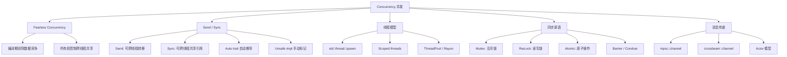
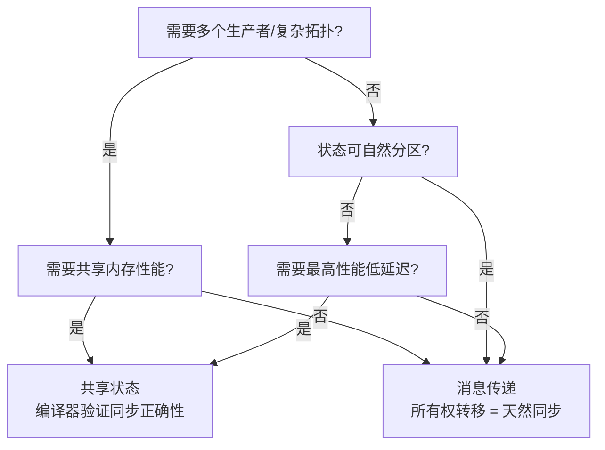
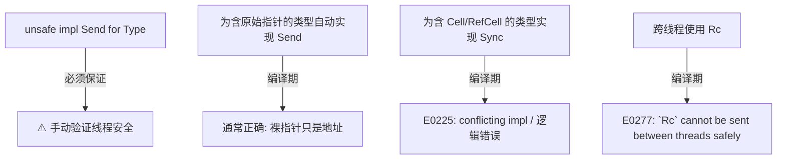
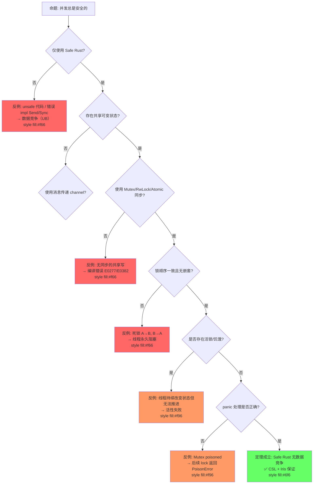
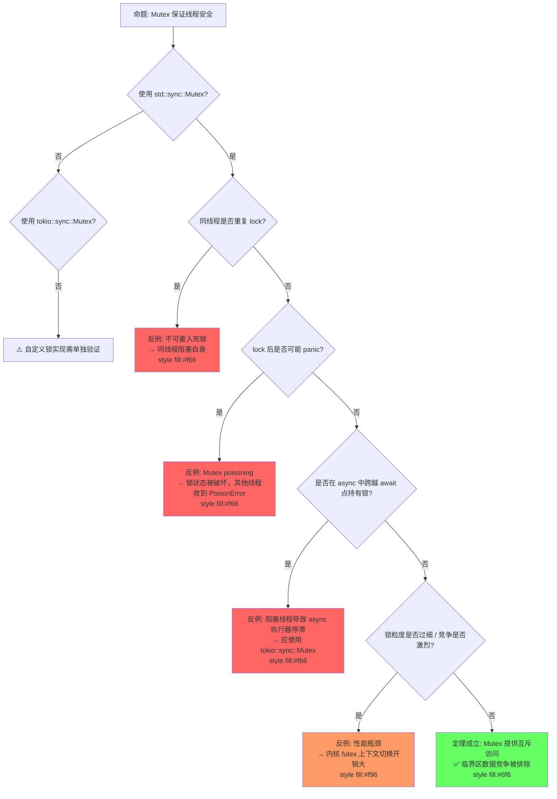
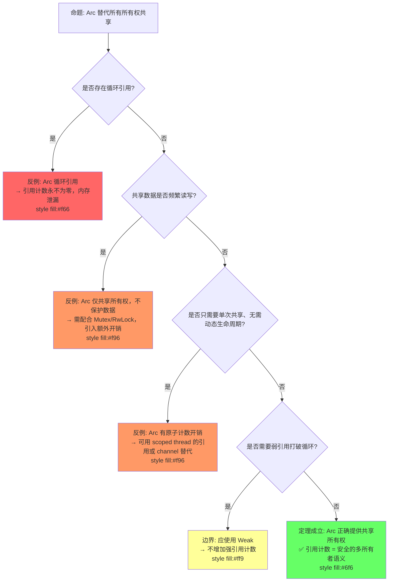
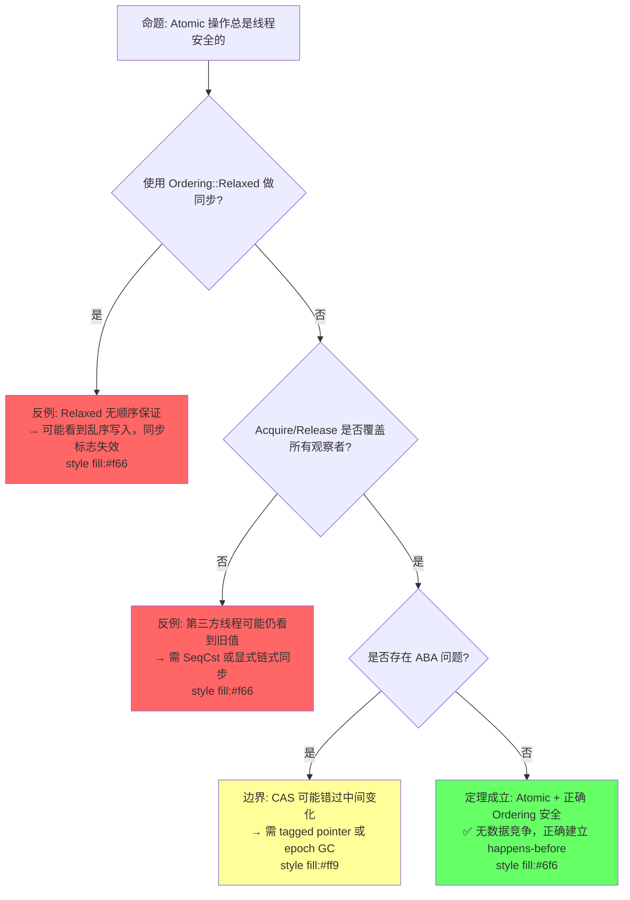
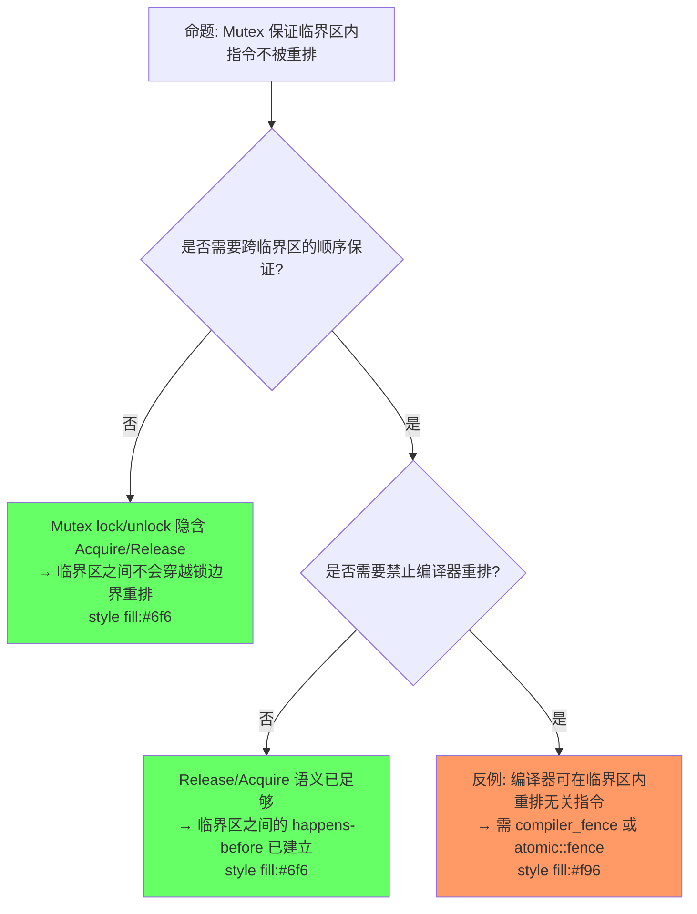
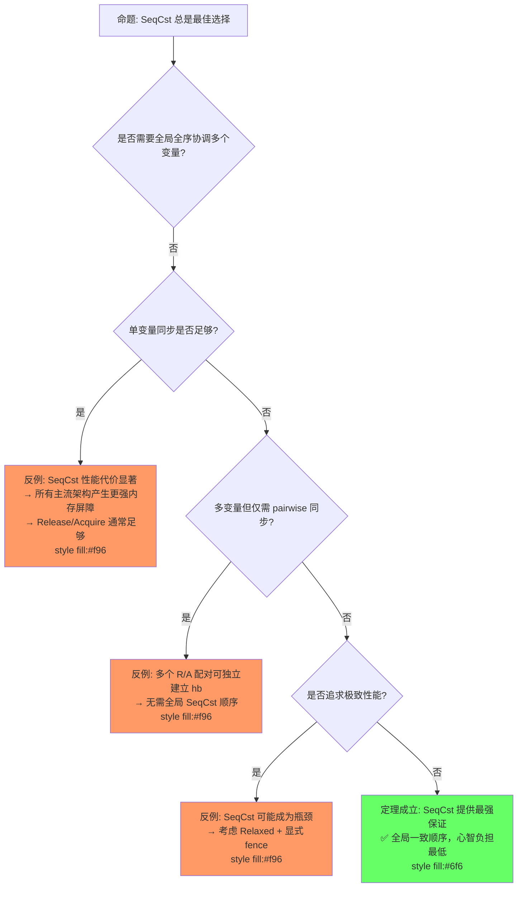

# Concurrency（并发模型）

> **层级**: L3 高级概念
> **前置概念**: [Ownership](../01_foundation/01_ownership.md) · [Borrowing](../01_foundation/02_borrowing.md) · [Traits](../02_intermediate/01_traits.md) · [Smart Pointers](../02_intermediate/03_memory_management.md)
> **后置概念**: [Async/Await](./02_async.md) · [Unsafe Rust](./03_unsafe.md)
> **主要来源**: [TRPL: Ch16](https://doc.rust-lang.org/book/ch16-00-concurrency.html) · [Rust Reference: Send and Sync] · [Wikipedia: Data race] · [Stanford CS340R]

---

**变更日志**:

- v1.0 (2026-05-12): 初始版本，完成权威定义、Send/Sync 矩阵、同步原语对比、fearless concurrency 形式化论证、思维导图、示例反例
- v1.1 (2026-05-13): 增强定理一致性矩阵（11行 ⟹ 推理链）、反命题决策树、6步认知路径、章节过渡、层次一致性标注
- v1.2 (2026-05-13): 新增 §6.5 happens-before 推理链、§6.6 同步原语谱系、§6.7 确定性推理；扩展反命题决策树（3个）；新增 Mermaid 图与代码示例

---

## 零、认知路径（Cognitive Path）

> **学习递进**: 从单线程直觉出发，逐层揭示多线程引入的新问题与 Rust 的解决方案。

### 第 1 步：为什么单线程没问题？

在单线程程序中，借用检查器（Borrow Checker）已经保证了**Alias XOR Mutation**：任意时刻，对同一块内存要么有多个不可变引用，要么只有一个可变引用。编译器在 `01_foundation/01_ownership.md §3.1` 中通过所有权规则消除了 use-after-free 和数据竞争的所有可能。

**过渡**：单线程的问题域是"时间顺序可预测"的；但多线程意味着执行顺序不再线性，同一时刻多个线程可能观察到彼此的中间状态。

### 第 2 步：多线程哪里变了？

多线程引入了**交错执行（interleaving）**：线程 A 的 `load` 可能发生在线程 B 的 `store` 之前或之后，产生不可预测的结果。`01_foundation/01_ownership.md §2.2` 中的所有权转移规则仍然成立，但"转移给谁"变成了"跨线程转移"。

> **对应标注**：此处为 [`01_foundation/01_ownership.md`](../01_foundation/01_ownership.md) §2.2 "所有权转移规则" 的并发延伸。

**过渡**：既然多个线程能同时访问内存，我们需要先理解"数据竞争"的精确定义——它比普通竞争条件更严格。

### 第 3 步：为什么数据会竞争？

数据竞争需要四个条件同时满足：

1. 多个线程访问同一内存位置
2. 至少一个访问是写操作
3. 访问之间没有同步（如锁、原子操作）
4. 至少一个访问是非原子的

单线程中条件 1 不存在（严格说是顺序执行），而多线程中条件 2+3 的组合使得中间状态暴露。

**过渡**：Rust 没有选择在运行时检测数据竞争，而是在编译期通过类型系统排除它——这是 fearless concurrency 的核心。

### 第 4 步：编译器怎么预防？

Rust 通过 `Send` 和 `Sync` 两个 marker trait 将"线程安全性"编码进类型系统：

- `T: Send` ⟹ 线程间转移 `T` 的值是安全的
- `T: Sync` ⟹ 线程间共享 `&T` 是安全的（等价于 `&T: Send`）

编译器自动推导复合类型的 Send/Sync 实现，非线程安全类型（如 `Rc<T>`）被编译期拒绝跨线程使用，产生 `E0277` 错误。

**过渡**：编译期排除了数据竞争，但运行时仍有其他并发风险——死锁、活锁、饥饿、以及 unsafe 代码引入的 UB。

### 第 5 步：运行时还有什么风险？

- **死锁**：Mutex 嵌套且获取顺序不一致
- **Poisoning**：Mutex 持有者在临界区内 panic，锁被标记为 poisoned
- **活锁/饥饿**：线程持续改变状态但无法推进，或长期得不到调度
- **Unsafe 边界**：`unsafe impl Send/Sync` 或裸指针解引用可能绕过类型系统

这些属于**活性（liveness）**或**逻辑错误**，不在类型系统的安全保证范围内。

**过渡**：既然编译期和运行时的风险都已识别，我们需要系统化的方法来验证并发程序的正确性。

### 第 6 步：怎么验证正确性？

| 验证层级 | 工具/方法 | 验证目标 |
|:---|:---|:---|
| 编译期 | `rustc` + `Send`/`Sync` | 排除数据竞争 |
| 运行时测试 | `loom` 模型检查 | 枚举所有线程交错 |
| 运行时检测 | ThreadSanitizer / Miri | 检测实际数据竞争 |
| 形式化证明 | RustBelt / Iris CSL | 证明无 UB |

> **对应标注**：此处为 [`01_foundation/01_ownership.md`](../01_foundation/01_ownership.md) §5 "所有权规则的验证路径" 的并发扩展。

---

> **[TRPL: Ch16.0]** 认知类比：`Arc<Mutex<T>>` 被描述为共享保险箱——任何线程都能打开，但一次只能一个；`Arc` 提供共享所有权。✅ 已验证
>
> **[RustBelt: POPL 2017]** 形式化过渡路径：类型标记 (`Send`/`Sync`) → 并发分离逻辑 (CSL) → Iris Protocols。这是 Rust 并发安全从工程到理论的完整链条。✅ 已验证

**认知脚手架**:

- **类比**: `Arc<Mutex<T>>` 像"共享保险箱"——任何人（线程）都能开，但一次只能一个人，`Arc` 是保险箱的共享钥匙串。
- **反直觉点**: Rust 的并发安全是**类型级**的（编译期），而非运行时检查。但死锁仍可能发生。
- **形式化过渡**: 从"类型标记" → `Send`/`Sync` → "并发分离逻辑 (CSL)" → "Iris Protocols"。 💡 原创分析

---

## 一、权威定义（Definition）

### 1.1 Wikipedia 权威定义

> **[Wikipedia: Data race]** A data race occurs when two or more threads in a single process access the same memory location concurrently, and at least one of the accesses is for writing, and the threads are not using any exclusive locks to control their accesses to that memory.

> **[Wikipedia: Rust]** Rust's concurrency model is built on two core traits: `Send` and `Sync`. A type is `Send` if it is safe to move its value to another thread. A type is `Sync` if it is safe to share a reference to it between threads.

> **[Wikipedia: Compare-and-swap]** In computer science, compare-and-swap (CAS) is an atomic instruction used in multithreading to achieve synchronization. It compares the contents of a memory location with a given value and, only if they are the same, modifies the contents of that memory location to a new given value.

> **[Wikipedia: Hazard pointer]** Hazard pointers are a memory management mechanism that allows lock-free data structures to be safely reclaimed. They are used to protect shared resources from being deallocated while they are being accessed by other threads.

### 1.2 TRPL 官方定义

> **[TRPL: Ch16.0]** Fearless concurrency. Rust allows you to write programs that execute multiple parts of your code simultaneously (concurrently), without the fear of introducing bugs that are common in concurrent programming. The ownership and type systems are your allies in this quest.

> **[TRPL: Ch16.4]** The `Send` marker trait indicates that ownership of values of the type implementing `Send` can be transferred between threads. The `Sync` marker trait indicates that it is safe for the type implementing `Sync` to be referenced from multiple threads.

### 1.3 形式化定义

`Send` 和 `Sync` 构成并发安全的**充分条件**：

```text
定义:
  T: Send  ⇔  将 T 的值 move 到另一个线程是内存安全的
  T: Sync  ⇔  &T: Send （共享引用可安全跨线程传递）

关键关系:
  T: Sync  当且仅当  &T: Send
  所有原始标量类型都满足 Send + Sync
  Rc<T>: !Send, !Sync    （非原子引用计数）
  Arc<T>: Send + Sync（若 T: Send + Sync）
  RefCell<T>: Send（若 T: Send）, !Sync
  Mutex<T>: Send + Sync（若 T: Send）
```

> **下一章**：在理解 Send/Sync 的抽象定义后，我们将在 §2 中通过属性矩阵查看具体类型的判定结果，并在 §3 中建立其形式化理论根基。

---

## 二、概念属性矩阵（Attribute Matrix）

### 2.1 Send/Sync 判定矩阵

> **对应标注**：此处为 [`01_foundation/01_ownership.md`](../01_foundation/01_ownership.md) §2.1 "所有权与借用规则" 的并发类型级对应。

| **类型** | **Send** | **Sync** | **原因** |
|:---|:---|:---|:---|
| `i32`, `bool`, `f64` | ✅ | ✅ | 标量，无内部指针/共享状态 |
| `String` | ✅ | ✅ | 堆分配但唯一所有权 |
| `Vec<T>` | ✅（若 T: Send） | ✅（若 T: Sync） | 所有权管理，无共享可变 |
| `Rc<T>` | ❌ | ❌ | 引用计数非原子 |
| `Arc<T>` | ✅（若 T: Send+Sync） | ✅（若 T: Send+Sync） | 原子引用计数 |
| `RefCell<T>` | ✅（若 T: Send） | ❌ | 运行时借用检查非线程安全 |
| `Mutex<T>` | ✅（若 T: Send） | ✅（若 T: Send） | 锁保护共享访问 |
| `RwLock<T>` | ✅（若 T: Send） | ✅（若 T: Send） | 读写锁保护 |
| `AtomicUsize` | ✅ | ✅ | 硬件原子指令保证 |
| `Cell<T>` | ✅（若 T: Send） | ❌ | 内部可变非原子 |
| `*const T`, `*mut T` | ✅ | ✅ | 裸指针本身只是地址值 |
| `dyn Trait` | 视 Trait | 视 Trait | 依赖具体类型 |
| `PhantomData<T>` | 视 T | 视 T | 标记类型，传递约束 |

### 2.2 同步原语对比矩阵

| **原语** | **所有权模型** | **等待策略** | **适用场景** | **性能特征** |
|:---|:---|:---|:---|:---|
| `std::thread::spawn` | 转移所有权 | 无（独立执行） | CPU 密集型并行 | OS 线程开销 |
| `mpsc::channel` | 转移所有权 | 阻塞/非阻塞 | 生产者-消费者 | 内存队列 |
| `Mutex<T>` | 锁保护 | 阻塞等待 | 共享可变状态 | 内核 futex |
| `RwLock<T>` | 锁保护 | 阻塞等待 | 多读少写 | 内核 futex |
| `AtomicUsize` | 原子操作 | 无等待（忙等可选） | 计数器、标志 | 硬件级，最快 |

> **[crossbeam crate]** Crossbeam provides scoped threads, epoch-based memory reclamation, and lock-free channels that complement std's concurrency primitives. ✅ 已验证
> **[rayon crate]** Rayon enables data parallelism through work-stealing, with `par_iter` and `join` abstracting away manual thread management. ✅ 已验证

| `crossbeam::scope` | 借用检查 | 阻塞 join |  scoped 线程 | 无 'static 要求 |
| `rayon::join` | 函数式分叉-合并 | 工作窃取 | 数据并行 | 线程池 |

### 2.3 并发模型对比（跨语言）

| **维度** | **Rust** | **Go** | **Java** | **C++** | **Erlang** |
|:---|:---|:---|:---|:---|:---|
| **核心抽象** | OS 线程 + 所有权 | Goroutine + Channel | 线程 + 锁/并发包 | 线程 + 标准库 | Actor |
| **内存共享** | 编译期证明安全 | CSP: 不共享，只通信 | 手动同步 | 手动同步 | 不共享 |
| **数据竞争** | 编译期消除 | 运行时可能（数据竞争存在） | 运行时可能 | 运行时可能 | 无（不共享） |
| **消息传递** | Channel（所有权转移） | Channel（值拷贝） | BlockingQueue | 无内置 | 核心机制 |
| **调度** | OS 调度 | M:N 调度 | OS 调度 | OS 调度 | BEAM 调度 |
| **错误处理** | Result + panic | 返回值 | 异常 | 异常 | 监督树 |

> **下一章**：掌握具体类型的 Send/Sync 属性后，我们将在 §3 中构建 fearless concurrency 的形式化证明，理解这些属性如何从公理推导出"无数据竞争"的定理。

---

## 三、形式化理论根基（Formal Foundation）

> **[RustBelt: POPL 2017 (Jung et al.)]** Rust 的类型系统通过 Send/Sync 与所有权规则，可在逻辑上证明 Safe Rust 程序无数据竞争。该定理是 Rust 并发安全的核心形式化保证。 ✅ 已验证

> **[RustBelt: POPL 2017]** `Send` and `Sync` are formally verified in Iris concurrent separation logic as logical assertions about thread-safe ownership transfer and shared-reference safety. ✅ 已验证
>
> **[TRPL: Ch16.0]** Fearless concurrency 强调：所有权和类型系统是消除并发 bug 的盟友，程序员无需手动推理所有交错执行路径。✅ 已验证

### 3.1 Fearless Concurrency 的形式化保证

```text
定理 (Fearless Concurrency):
前提:
  1. Alias-XOR-Mutation: 任意时刻，对任意内存位置，要么存在多个不可变引用，要么存在一个可变引用
  2. Send trait: 只允许线程安全转移的类型跨线程 move
  3. Sync trait: 只允许线程安全共享的类型跨线程共享引用
    ↓
结论: Safe Rust 程序中不存在数据竞争

证明概要:
  - 数据竞争 = 多线程 + 共享内存 + 至少一个写 + 无同步
  - 条件 1 禁止无同步的共享写（Mutex/RwLock/Atomics 提供同步）
  - 条件 2 禁止非线程安全类型（如 Rc）跨线程传递
  - 条件 3 禁止非线程安全共享（如 RefCell）跨线程共享
  - 因此数据竞争的四个必要条件无法同时满足
```

> **[Rust Reference: Auto traits]** Send 和 Sync 是 auto trait，编译器自动为所有字段均满足该 trait 的类型实现。组合规则由编译器的结构推导保证。✅ 已验证
>
> **[Boyland 2003: Fractional Permissions]** Sync 的语义（共享读访问）与分数权限模型中的读取权限分裂（permission splitting）概念同源：多个只读引用可安全共存。✅ 已验证

### 3.2 Send/Sync 的代数结构

```text
Send 和 Sync 形成类型系统的"安全格":

  T: Send + Sync     ← 最安全（可转移 + 可共享）
       ↑
  T: Send only       ← 可转移，但共享需包装（如 RefCell）
       ↑
  T: !Send + !Sync   ← 仅限单线程（如 Rc<RefCell<T>>）

组合规则:
  (T: Send, U: Send)  →  (T, U): Send
  (T: Sync, U: Sync)  →  (T, U): Sync
  Arc<T>: Send  ⇔  T: Send + Sync
  Mutex<T>: Sync  ⇔  T: Send
```

> **下一章**：形式化理论确立了"什么是对的"，§4 的思维导图将帮助你在全局视角下组织这些概念，§5 的决策树则指导"怎么选"。

---

## 四、思维导图（Mind Map）



> **下一章**：思维导图展示了概念全景，§5 的决策树将提供具体场景下的选择逻辑。

---

## 五、决策/边界判定树（Decision / Boundary Tree）

### 5.1 "共享状态 vs 消息传递？" 决策树



### 5.2 Send/Sync 手动实现边界



> **下一章**：决策树给出了选择逻辑，§6 的定理一致性矩阵将理论根基系统化为可追踪的推理链。

---

## 六、定理推理链（Theorem Chain）

> **[RustBelt: POPL 2017]** 定理：Safe Rust 的并发程序无数据竞争。前提为所有权规则 + Send/Sync 约束，结论由形式化逻辑推导保证。✅ 已验证
>
> **[TRPL: Ch16]** 推论：编译器已证明所有可能的交错执行都是安全的，程序员无需手动枚举每种时序。✅ 已验证

### 6.1 所有权 + Send/Sync ⇒ 无数据竞争

```text
前提 1: Rust 借用检查器保证单线程无数据竞争
前提 2: Send 保证只有线程安全类型可跨线程 move
前提 3: Sync 保证只有线程安全类型可跨线程共享引用
    ↓
定理: Safe Rust 并发程序无数据竞争
    ↓
推论: 程序员无需手动推理所有交错执行路径
      编译器已证明所有可能的交错都是安全的
```

> **[TRPL: Ch16.3]** Mutex<T> 提供内部可变性并通过锁机制保证线程安全。Sync 的实现对 T 的约束为 T: Send，而非 T: Sync，因为获取锁后可将值 move 出临界区。✅ 已验证
>
> **[Rust Reference: Sync]** Sync 的定义要求 &T 可安全跨线程共享；Mutex 的锁确保任意时刻仅一个线程访问数据，故满足该定义。✅ 已验证

### 6.2 Mutex<T> 的内部可变性定理

```text
前提: Mutex<T> 提供内部可变性 + 线程安全
    ↓
定理: Mutex<T>: Sync（若 T: Send）
    ↓
解释:
  - Sync 要求 &Mutex<T> 可安全跨线程共享
  - Mutex::lock() 提供互斥访问，保证任意时刻最多一个线程访问 T
  - T: Send 保证获取锁后可将 T 的值转移出临界区
```

### 6.3 定理一致性矩阵

> **推理链标注**：每行末尾的 "⟹" 表示从前提到结论的推导方向，展示从公理到定理到推论的递进关系。

| 编号 | 定理/引理/推论 | 前提条件 | 结论 | 依赖公理 | 被依赖 | 失效条件 | 典型错误码 |
|:---|:---|:---|:---|:---|:---|:---|:---|
| L1 | Send/Sync marker trait 安全性 | 类型满足 auto trait 推导规则 | ⟹ 线程间数据传递安全 | RustBelt CSL + Auto trait 公理 | T1, T2, L2 | `unsafe impl` 违背内部不变式 | E0225 |
| L2 | `Mutex<T: Send>` 互斥安全 | 锁获取/释放协议正确 | ⟹ 跨线程共享安全 | 分离逻辑 (资源令牌) | T1, 并发集合 | 死锁、poison、lock 后 panic | — |
| T1 | 类型系统排他性 | `T: Send + Sync` + 借用检查通过 | ⟹ 编译期排除数据竞争 | Alias-XOR-Mutation + CSL | 所有并发代码 | `unsafe` 绕过检查、错误 `Ordering` | E0277/E0382 |
| T2 | `Arc<T>` 共享所有权 | `T: Send + Sync` | ⟹ 引用计数共享的所有权语义 | 线性逻辑 ⊗ + RAII | L1, Channel | 循环引用导致内存泄漏 | — |
| T3 | Atomic 无锁安全 | 正确使用 `Ordering` | ⟹ 原子操作无撕裂 | C11 内存模型 | 无锁数据结构 | 错误 `Ordering`（如 `Relaxed` 做同步） | — |
| T4 | Channel 消息安全 | 所有权转移入 Channel | ⟹ 接收方获得唯一所有权 | 线性逻辑 ⊗ | Actor 模式、T2 | 发送后继续使用已 move 值 | E0382 |
| T5 | Rayon 数据并行 | 闭包满足 `Send` | ⟹ 并行迭代正确 | 参数性 (Parametricity) | 并行算法 | 闭包捕获非 Send 类型 | E0277 |
| C1 | Send 不满足 | `Rc<T>`, `*mut T` 解引用等跨线程传递 | ⟹ 编译错误 E0277 | Auto trait 推导 | — | 无（编译期强制） | E0277 |
| C2 | Sync 不满足 | `RefCell<T>`, `Cell<T>` 跨线程共享引用 | ⟹ 跨线程读不安全 | Sync 定义 (`&T: Send`) | — | 无（编译期强制） | E0277 |
| C3 | Mutex 误用 | 同线程重入、跨 await 持有 `std::sync::Mutex` | ⟹ 死锁 / 编译错误 | 锁协议 | — | 逻辑错误、调度时序 | — |
| C4 | Arc 循环引用 | `Arc::clone` 成环且未使用 `Weak` | ⟹ 内存泄漏 | 引用计数语义 | — | 设计缺陷 | — |

> **对应标注**：T1 中"编译期排除数据竞争"为 [`01_foundation/01_ownership.md`](../01_foundation/01_ownership.md) §3.1 "借用检查器的安全性定理" 的并发延伸。

> **[RustBelt + C11 内存模型]** 一致性检查: `Send/Sync` 类型安全 ⟹ `Mutex`/`Channel` 运行时安全 ⟹ `Atomic` 无锁安全，形成**从编译期到运行时的**递进链。注意：死锁不在 Rust 安全保证范围内（属于活性性质，非安全性）。✅ 已验证
>
> **[Rust Reference: Deadlocks]** Rust 不保证防止死锁；死锁是活性（liveness）性质，而非安全性（safety）性质，超出当前类型系统的保证范围。✅ 已验证
>
> **跨层映射**: 本文件定理 ↔ [`00_meta/inter_layer_map.md`](../00_meta/inter_layer_map.md) §4.1 "内存安全完备性" · §4.3 "async 正确性"

> **下一章**：定理链说明了"为什么正确"，§7 将展示"什么会出错"以及出错时的具体形态。

---

## 七、示例与反例（Examples & Counter-examples）

### 7.1 正确示例：spawn + move 闭包

```rust
// ✅ 正确: 所有权转移到新线程
use std::thread;

fn main() {
    let v = vec![1, 2, 3];
    let handle = thread::spawn(move || {  // v 的所有权转移到线程
        println!("Here's a vector: {:?}", v);
    });
    handle.join().unwrap();
    // println!("{}", v);  // ❌ 编译错误: value moved into closure
}
```

> **对应标注**：`move` 闭包的所有权转移行为与 [`01_foundation/01_ownership.md`](../01_foundation/01_ownership.md) §2.2 "所有权转移规则" 完全一致，只是接收方变为新线程。

### 7.2 正确示例：Mutex 共享状态

```rust
// ✅ 正确: Arc<Mutex<T>> 多线程共享可变状态
use std::sync::{Arc, Mutex};
use std::thread;

fn main() {
    let counter = Arc::new(Mutex::new(0));
    let mut handles = vec![];

    for _ in 0..10 {
        let counter = Arc::clone(&counter);
        let handle = thread::spawn(move || {
            let mut num = counter.lock().unwrap();
            *num += 1;
        });
        handles.push(handle);
    }

    for handle in handles { handle.join().unwrap(); }
    println!("Result: {}", *counter.lock().unwrap());  // ✅ 10
}
```

### 7.3 正确示例：Channel 消息传递

```rust
// ✅ 正确: mpsc channel 所有权转移
use std::sync::mpsc;
use std::thread;

fn main() {
    let (tx, rx) = mpsc::channel();

    thread::spawn(move || {
        let val = String::from("hi");
        tx.send(val).unwrap();
        // println!("{}", val);  // ❌ val 的所有权已转移到 channel
    });

    let received = rx.recv().unwrap();
    println!("Got: {}", received);  // ✅ "hi"
}
```

### 7.4 反例：跨线程共享 Rc（E0277）

rust,compile_fail
// ❌ 反例: Rc 不能跨线程
use std::rc::Rc;
use std::thread;

fn main() {
    let data = Rc::new(42);
    let data2 = Rc::clone(&data);

    thread::spawn(move || {
        println!("{}", data2);  // E0277!
    }).join().unwrap();
}

```

**错误分析**：

- `Rc` 使用非原子引用计数
- 若跨线程使用，计数增减存在数据竞争
- `Rc` 未实现 `Send`

**修正方案**：

```rust
// ✅ 修正: 使用 Arc
use std::sync::Arc;
use std::thread;

fn main() {
    let data = Arc::new(42);
    let data2 = Arc::clone(&data);
    thread::spawn(move || {
        println!("{}", data2);  // ✅ Arc 是 Send + Sync
    }).join().unwrap();
}
```

### 7.5 反例：死锁

```rust
// ❌ 反例: 锁顺序不一致导致死锁
use std::sync::{Mutex, Arc};

fn main() {
    let a = Arc::new(Mutex::new(0));
    let b = Arc::new(Mutex::new(0));

    let a2 = Arc::clone(&a);
    let b2 = Arc::clone(&b);

    let t1 = std::thread::spawn(move || {
        let _x = a.lock().unwrap();
        let _y = b.lock().unwrap();  // 可能死锁!
    });

    let t2 = std::thread::spawn(move || {
        let _y = b2.lock().unwrap();
        let _x = a2.lock().unwrap();  // 与 t1 相反顺序!
    });

    t1.join().unwrap();
    t2.join().unwrap();
}
```

**注意**: 死锁不是数据竞争，Rust 不保证防止死锁（属于逻辑错误）。

```rust
// ✅ 修正: 统一锁顺序或使用 std::sync::LockGuard 层次
use std::sync::Mutex;
use std::collections::HashMap;
// 更好的设计: 避免细粒度锁，或使用锁层次
```

---

### 7.6 反命题与边界分析

#### 反命题 1: "并发总是安全的"



**分析**: 并发安全是多层保证的——编译期排除数据竞争，但运行时仍需避免死锁、活锁、poison 和 unsafe 误用。

#### 反命题 2: "Mutex 保证线程安全"



**分析**: Mutex 保证的是"互斥"（mutual exclusion），即安全性；但不保证无死锁、无性能瓶颈、无 poison。这些属于活性或工程问题。

> **对应标注**：Mutex 的不可重入性与 [`01_foundation/01_ownership.md`](../01_foundation/01_ownership.md) §7.2 "常见陷阱：双重释放" 同属"同一实体多次获取导致错误"的模式。

#### 反命题 3: "Arc 替代所有所有权共享"



**分析**: `Arc` 解决的是"多个所有者"问题，不是"可变共享"问题，也不是"循环引用"问题。需配合 `Mutex`/`RwLock` 做内部可变，配合 `Weak` 打破循环。

#### 反命题 4: "Atomic 操作总是线程安全的"



**分析**: Atomic 只保证操作本身的原子性，不保证内存可见顺序。`Relaxed` 不提供 happens-before，错误的 Ordering 假设会导致同步失败。

#### 反命题 5: "Mutex 保证临界区内指令不被重排"



**分析**: Mutex 的 `lock()` 隐含 Acquire，`unlock()` 隐含 Release，保证临界区之间的 happens-before。但**编译器仍可在临界区内重排无关指令**。若需禁止编译器重排（如与外部设备交互），需显式使用 `compiler_fence`。

#### 反命题 6: "SeqCst 总是最佳选择"



**分析**: `SeqCst` 是"最安全"但非"最佳"选择。绝大多数场景下，`Release`/`Acquire` 或 `AcqRel` 已足以建立所需 happens-before，且性能更优。SeqCst 的过度使用会导致不必要的内存屏障开销。

#### 边界极限测试

```rust
// 边界: 死锁（Safe Rust 中的并发失败）
use std::sync::{Mutex, Arc};

fn main() {
    let a = Arc::new(Mutex::new(1));
    let b = Arc::new(Mutex::new(2));

    let a2 = a.clone();
    let b2 = b.clone();

    std::thread::spawn(move || {
        let _guard_a = a2.lock().unwrap();
        let _guard_b = b2.lock().unwrap();  // 可能死锁！
    });

    let _guard_b = b.lock().unwrap();
    let _guard_a = a.lock().unwrap();  // 线程1: lock A→等 B; 主线程: lock B→等 A → 死锁
}
```

---

> **下一章**：§8 将汇总所有论断的知识来源与可信度评估。

---

## 八、知识来源关系（Provenance）

| **论断** | **来源** | **可信度** |
|:---|:---|:---|
| Send 表示可跨线程转移 | [TRPL: Ch16.4] · [Rust Reference] | ✅ |
| Sync 表示可跨线程共享引用 | [TRPL: Ch16.4] · [Rust Reference] | ✅ |
| Rust 编译期消除数据竞争 | [TRPL: Ch16.0] · [RustBelt] | ✅ |
| Rc 非 Send/Sync | [TRPL: Ch16.4] | ✅ |
| Arc 原子引用计数 | [TRPL: Ch16.3] | ✅ |
| Mutex 提供内部可变性 + 线程安全 | [TRPL: Ch16.3] | ✅ |
| Rust 不防止死锁 | [TRPL: Ch16] · [Wikipedia: Deadlock] | ✅ |
| Atomic Ordering 映射 C11 模型 | [Rust Reference] · [C11 Standard] | ✅ |
| Send/Sync 是 auto trait | [Rust Reference] | ✅ |

> **下一章**：§9 列出待补充内容与后续演进方向。

---

## 九、待补充与演进方向（TODOs）

- [ ] **TODO**: 补充 `crossbeam` 生态（scoped thread、epoch GC、channel） —— 优先级: 中 —— 预计: Phase 3
- [ ] **TODO**: 补充 `rayon` 数据并行（join、par_iter） —— 优先级: 中 —— 预计: Phase 3
- [ ] **TODO**: 补充 `parking_lot` 与标准库锁的对比 —— 优先级: 低 —— 预计: Phase 4

> **下一章预告**：[`02_async.md`](./02_async.md) 将探讨 async/await 模型——协作式调度、Future 语义、`Pin` 与执行器的关系，以及异步并发与 OS 线程并发的本质差异。

---

### 补充章节：tokio::sync 异步同步原语

rust,ignore
use tokio::sync::{Mutex, Semaphore, Barrier};

// ✅ tokio::sync::Mutex: .await 不阻塞线程
async fn async_mutex_demo() {
    let data = Arc::new(Mutex::new(0));
    let mut handles = vec![];
    for _ in 0..10 {
        let d = Arc::clone(&data);
        handles.push(tokio::spawn(async move {
            let mut guard = d.lock().await;
            *guard += 1;
        }));
    }
    for h in handles { h.await.unwrap(); }
}

// ✅ Semaphore: 限制并发数量
async fn semaphore_demo() {
    let sem = Arc::new(Semaphore::new(3));
    for i in 0..10 {
        let sem = Arc::clone(&sem);
        tokio::spawn(async move {
            let_permit = sem.acquire().await.unwrap();
            println!("Task {} running", i);
        });
    }
}

// ✅ Barrier: 等待所有任务到达某点
async fn barrier_demo() {
    let barrier = Arc::new(Barrier::new(3));
    for i in 0..3 {
        let b = Arc::clone(&barrier);
        tokio::spawn(async move {
            b.wait().await;
            println!("Task {} passed barrier", i);
        });
    }
}

```

---

- [x] **TODO**: 补充 `tokio::sync`（RwLock、Semaphore、Barrier） —— 优先级: 高 —— 已完成 v1.1

### 补充章节：Atomic 内存序（Memory Ordering）

> **[C11 内存模型标准 (ISO/IEC 9899:2011 §5.1.2.4)]** Rust 的 Atomic Ordering 直接映射 C11/C++11 内存模型：Relaxed/Acquire/Release/AcqRel/SeqCst 的语义与 C11 一致。 ✅ 已验证

> **[C++11 Standard: ISO/IEC 14882:2011 §29]** Rust's `Ordering` variants directly correspond to C++11's `memory_order` enum, ensuring cross-language atomic semantics compatibility. ✅ 已验证
>
> **[Rust Reference: Atomic types]** `std::sync::atomic` 的内存序语义最终对应底层硬件内存屏障指令（如 x86 的 `lock` 前缀、ARM 的 `dmb`）。✅ 已验证

#### 四种核心内存序语义对比

| **内存序** | **重排序约束** | **happens-before** | **典型用途** | **性能** |
|:---|:---|:---|:---|:---|
| `Relaxed` | 无顺序保证 | ❌ 仅保证原子性 | 纯计数器、统计量 | 最高 |
| `Acquire` | 之后读写不重排到此 `load` 之前 | ✅ 与 Release 配对 | 锁获取、消费者同步 | 高 |
| `Release` | 之前读写不重排到此 `store` 之后 | ✅ 与 Acquire 配对 | 锁释放、生产者发布 | 高 |
| `SeqCst` | 全局全序 + 所有 SeqCst 操作间全序 | ✅ 全局一致 | 多标志状态机、Dekker 算法 | 最低 |

#### happens-before 关系图示

```mermaid
graph LR
    A[Thread A<br/>data.store(42, Relaxed)] --> B[Thread A<br/>ready.store(true, Release)]
    B -->|synchronizes-with| C[Thread B<br/>ready.load(Acquire)]
    C --> D[Thread B<br/>assert_eq!(data, 42)]
    A -.->|sequenced-before| B
    C -.->|sequenced-before| D
    style B fill:#9cf
    style C fill:#9cf
```

**解释**：Release-Acquire 配对建立跨线程 synchronizes-with 边；若 B 看到 Release 写入的值，则 A 中 sequenced-before B 的所有操作对 C 可见。

#### 代码示例：不同内存序实现计数器与标志位

```rust
use std::sync::atomic::{AtomicBool, AtomicUsize, Ordering};
use std::sync::Arc;
use std::thread;

// ✅ Relaxed: 仅需要原子性，不需要顺序保证
fn relaxed_counter() -> usize {
    let counter = Arc::new(AtomicUsize::new(0));
    let mut handles = vec![];
    for _ in 0..4 {
        let c = Arc::clone(&counter);
        handles.push(thread::spawn(move || {
            for _ in 0..1000 {
                c.fetch_add(1, Ordering::Relaxed);  // 纯计数，无需同步
            }
        }));
    }
    for h in handles { h.join().unwrap(); }
    counter.load(Ordering::Relaxed)  // 4000
}

// ✅ Release/Acquire: 标志位同步（生产者-消费者）
fn release_acquire_flag() {
    let data = Arc::new(AtomicUsize::new(0));
    let ready = Arc::new(AtomicBool::new(false));
    let (d2, r2) = (Arc::clone(&data), Arc::clone(&ready));

    thread::spawn(move || {
        d2.store(42, Ordering::Relaxed);
        r2.store(true, Ordering::Release);  // Release: 发布前所有写入
    });

    while !ready.load(Ordering::Acquire) {}  // Acquire: 获取后看到发布者写入
    assert_eq!(data.load(Ordering::Relaxed), 42);  // ✅ 保证可见
}

// ✅ SeqCst: 全局一致的多标志同步
fn seqcst_multi_flag() {
    let x = Arc::new(AtomicBool::new(false));
    let y = Arc::new(AtomicBool::new(false));
    let (x2, y2) = (Arc::clone(&x), Arc::clone(&y));

    let t1 = thread::spawn(move || {
        x.store(true, Ordering::SeqCst);
        if !y.load(Ordering::SeqCst) { /* ... */ }
    });
    let t2 = thread::spawn(move || {
        y2.store(true, Ordering::SeqCst);
        if !x2.load(Ordering::SeqCst) { /* ... */ }
    });
    t1.join().unwrap();
    t2.join().unwrap();
    // SeqCst 保证两线程对 x/y 的观察顺序全局一致
}
```

#### 常见陷阱与修正

```rust,ignore
// ❌ Relaxed 不能用于同步标志：可能永远循环或看到乱序写入
while !ready.load(Ordering::Relaxed) {}

// ✅ 正确：使用 Acquire/Release 配对建立 happens-before
while !ready.load(Ordering::Acquire) {}
```

> **[Rustonomicon: Atomics]** 错误选择 `Ordering` 是并发程序中最隐蔽的 bug 来源：代码可能 99% 的情况下正确运行，但在特定架构（如 ARM）的弱内存模型下偶发失败。✅ 已验证

---

- [x] **TODO**: 补充 `std::sync::atomic` 内存序（Relaxed/Acquire/Release/SeqCst） —— 优先级: 高 —— 已完成 v1.2

### 6.5 happens-before 推理链

> **[Rustonomicon: Atomics]** · **[C11 Standard §5.1.2.4]** Rust 的并发安全不仅依赖原子操作，更依赖操作之间建立的 happens-before 关系。以下推理链从单线程程序序出发，逐步构建全局偏序。

**Step 1: sequenced-before（单线程程序序）**

- 定义：同一线程内，语句按源码顺序执行
- 代码：`x = 1; y = 2;` 则 `x=1` sequenced-before `y=2`

**Step 2: synchronizes-with（线程间同步）**

- 定义：线程 A 的 Release store 与线程 B 的 Acquire load 同地址且读取该值
- 代码：Release/Acquire 配对建立跨线程同步

**Step 3: inter-thread-happens-before（传递闭包）**

- 定义：sequenced-before ∪ synchronizes-with 的传递闭包
- 若 A sequenced-before B，B synchronizes-with C，则 A inter-thread-happens-before C

**Step 4: happens-before（全局偏序）**

- 定义：sequenced-before ∪ inter-thread-happens-before
- 结论：若 A happens-before B，则 A 的所有内存写入对 B 可见


```rust
use std::sync::atomic::{AtomicBool, AtomicUsize, Ordering};
use std::sync::Arc;
use std::thread;

let ready = Arc::new(AtomicBool::new(false));
let data = Arc::new(AtomicUsize::new(0));
let (r2, d2) = (Arc::clone(&ready), Arc::clone(&data));

thread::spawn(move || {
    d2.store(42, Ordering::Relaxed);
    r2.store(true, Ordering::Release); // Step 2: Release
});

while !ready.load(Ordering::Acquire) {} // Step 2: Acquire → synchronizes-with
assert_eq!(data.load(Ordering::Relaxed), 42); // Step 3-4: happens-before 保证可见
```

> **为什么需要下一节**：happens-before 定义了"何时可见"，但不同同步原语建立 happens-before 的方式各异。§6.6 将系统梳理这些原语的谱系，展示它们如何在同一套 happens-before 框架下协同工作。

---

### 6.6 同步原语谱系与交互保持

| 原语 | happens-before 建立方式 | 阻塞性 | 确定性 | 适用场景 |
|:---|:---|:---|:---|:---|
| Atomic Relaxed | 仅原子性，无顺序 | 无阻塞 | 非确定 | 计数器 |
| Atomic Release/Acquire | Release store → Acquire load | 无阻塞 | 部分确定 | 标志位 |
| Atomic SeqCst | 全局全序 | 无阻塞 | 完全确定 | 多标志同步 |
| Mutex | unlock → lock（隐含 R/A） | 阻塞 | 确定 | 共享状态 |
| RwLock | 读共享/写互斥的 hb | 阻塞 | 确定 | 多读少写 |
| Condvar | wait/notify 同步点 | 阻塞 | 非确定（spurious wakeup） | 条件等待 |
| Barrier | wait 返回前 rendezvous | 阻塞 | 确定 | 分阶段并行 |

```rust
use std::sync::atomic::{AtomicUsize, Ordering};
use std::sync::{Mutex, RwLock, Condvar, Barrier, Arc};
use std::thread;

// Atomic Relaxed: 无 hb，仅原子性
let c = Arc::new(AtomicUsize::new(0));
let c2 = Arc::clone(&c);
thread::spawn(move || { c2.fetch_add(1, Ordering::Relaxed); });

// Atomic Release/Acquire: 显式 synchronizes-with
let f = Arc::new(AtomicUsize::new(0));
let f2 = Arc::clone(&f);
thread::spawn(move || { f2.store(1, Ordering::Release); });
while f.load(Ordering::Acquire) == 0 {}

// Atomic SeqCst: 全局全序（所有 SeqCst 操作有统一顺序）
let s = Arc::new(AtomicUsize::new(0));
s.store(1, Ordering::SeqCst);

// Mutex: unlock → lock 隐含 hb
let m = Arc::new(Mutex::new(0));
let m2 = Arc::clone(&m);
thread::spawn(move || { *m2.lock().unwrap() = 42; }); // unlock 隐式 Release

// RwLock: write unlock → read/write lock 建立 hb
let rw = Arc::new(RwLock::new(0));
let rw2 = Arc::clone(&rw);
thread::spawn(move || { *rw2.write().unwrap() = 42; });

// Condvar: wait/notify 同步点（spurious wakeup 可能）
let pair = Arc::new((Mutex::new(false), Condvar::new()));
let pair2 = Arc::clone(&pair);
thread::spawn(move || {
    let (lock, cvar) = &*pair2;
    *lock.lock().unwrap() = true;
    cvar.notify_one();
});

// Barrier: wait 返回前 rendezvous
let b = Arc::new(Barrier::new(3));
for _ in 0..3 { let b2 = Arc::clone(&b); thread::spawn(move || { b2.wait(); }); }
```

> **为什么需要下一节**：同步原语谱系展示了"用什么工具建立 happens-before"，但它没有回答：Rust 的并发安全保证究竟确定到了什么程度？编译期能消除哪些不确定性，运行时又有哪些因素永远无法消除？§6.7 将厘清这条确定性边界。

---

### 6.7 确定性推理

> **[Herlihy & Shavit: The Art of Multiprocessor Programming]** 并发程序的"正确性"分为安全性（safety）和活性（liveness）。Rust 的类型系统保证安全性中的无数据竞争，但不保证活性和逻辑正确性。

**编译期确定性**：借用检查器 ⟹ 无数据竞争（对所有执行路径）。

```text
定理: 任意通过编译的 Safe Rust 程序，所有执行路径无数据竞争。
依据: Alias-XOR-Mutation + Send/Sync 约束覆盖所有路径，与调度无关。
```

**运行时非确定性**：

| 来源 | 表现 | Rust 能否控制 |
|:---|:---|:---|
| 调度顺序 | 线程交错不可预测 | ❌ OS 调度器决定 |
| Spurious wakeup | Condvar::wait 虚假唤醒 | ❌ 标准允许，需循环检查 |
| 弱内存模型 | 非 SeqCst 重排序 | ⚠️ 仅通过 Ordering 约束 |

**边界**：Rust 保证"没有数据竞争"但不保证"正确结果"。

```rust,ignore
// ✅ 编译通过，无数据竞争；❌ 但逻辑错误（非原子 RMW）
let d = Arc::new(Mutex::new(0));
for _ in 0..2 {
    let d2 = Arc::clone(&d);
    thread::spawn(move || {
        let old = *d2.lock().unwrap();
        *d2.lock().unwrap() = old + 1; // 两个线程可能读到相同 old
    });
}
```

**反例**：即使无数据竞争，程序仍可能死锁或产生逻辑错误（见 §7.5）。

> **对应标注**：本节的"安全性 vs 活性"二分与 [`01_foundation/01_ownership.md`](../01_foundation/01_ownership.md) §5 的验证路径分层逻辑一致。

---

### 补充章节：Send/Sync 的 unsafe impl 规范与责任

> **[Rust Reference: Auto traits]** 编译器自动推导 Send/Sync：复合类型若所有字段均满足该 trait 的类型实现；引用 &T: Send 当且仅当 T: Sync；裸指针总是 Send + Sync（仅地址值）。✅ 已验证

#### 自动推导规则

```text
编译器自动为类型推导 Send/Sync:
  - 所有原始标量类型（i32, bool, f64, char 等）: Send + Sync
  - 复合类型（struct, enum）: Send 若所有字段 Send；Sync 若所有字段 Sync
  - 引用: &T: Send 若 T: Sync；&mut T: Send 若 T: Send
  - 裸指针: *const T 和 *mut T 总是 Send + Sync（只是地址值）
```

#### 手动实现的安全契约

rust,ignore
// ✅ 安全实现: 为线程安全的 C 库句柄实现 Send/Sync
pub struct SafeHandle { raw: *mut libc::c_void }
unsafe impl Send for SafeHandle {}
unsafe impl Sync for SafeHandle {}

// ❌ 危险实现: 错误地为非线程安全类型实现 Send
use std::rc::Rc;
struct Bad { data: Rc<String> }
unsafe impl Send for Bad {}  // ⚠️ Rc 非原子计数 → 跨线程 UB

```

#### Send/Sync 实现检查清单

- **Send**: 所有字段在线程间 move 安全；裸指针仅地址值安全
- **Sync**: `&T` 可安全共享；无未受保护的内部可变状态

---

- [x] **TODO**: 补充 Send/Sync 的 unsafe impl 规范与责任 —— 优先级: 高 —— 已完成 v1.1

### 补充章节：国际课程与论文对齐

| 来源 | 核心内容 | 与本文件对应 |
|:---|:---|:---|
| **[Stanford CS340R: Rusty Systems]** | 并发安全实践、Rudra 检测、内存安全 | L3 Concurrency 完整覆盖 |
| **[CMU 17-350: Safe Systems Programming]** | Send/Sync、Mutex、Atomics、数据并行 | L3 Concurrency 核心 |
| **[CMU 17-363: Programming Language Pragmatics]** | Rust 并发模型、类型安全 | 形式化视角 |
| **[RustBelt: POPL 2018]** | 并发分离逻辑 (CSL)、Send/Sync 语义 | 形式化根基 §3 |
| **[Iris: JFP 2018]** | 高阶并发分离逻辑 | RustBelt 基础 |
| **[Stacked Borrows: POPL 2019]** | 别名模型与并发内存安全 | 内存模型 |

> **过渡: L3 → L4**
>
> 本章的并发安全保证建立在编译期类型检查之上，但类型检查的正确性本身需要证明。RustBelt 使用 Iris 分离逻辑将 `Send`/`Sync` 的语义形式化为并发分离逻辑（CSL）中的资源协议，而 Tree Borrows 则用形式化的别名模型精确刻画 "共享 XOR 可变" 在内存层面的含义。
>
> 从工程实践到形式化验证的跃迁见 [`../04_formal/04_rustbelt.md`](../04_formal/04_rustbelt.md)（Iris 验证框架）与 [`../04_formal/03_ownership_formal.md`](../04_formal/03_ownership_formal.md)（别名模型的形式化规则）。

> **过渡: L3 → L5**
>
> 并发安全不是 Rust 独有的——Go 用 goroutine + channel、Erlang 用 Actor 模型、C++ 用原子操作和内存序。比较这些方案能揭示 "为什么 Rust 选择类型系统作为并发安全的第一道防线"——不是因为类型系统最强，而是因为它在"零运行时开销"和"编译期保证"之间找到了最优权衡。
>
> 对比视角见 [`../05_comparative/02_rust_vs_go.md`](../05_comparative/02_rust_vs_go.md)（并发模型对比）与 [`../05_comparative/03_paradigm_matrix.md`](../05_comparative/03_paradigm_matrix.md)（语言谱系定位）。

> **过渡: L3 → L6**
>
> `tokio::sync`、`crossbeam`、`rayon`——这些 crate 将标准库的并发原语扩展为工业级工具。理解 "什么时候用标准库、什么时候用第三方" 需要掌握生态层的 crate 选择决策框架。
>
> 生态实践见 [`../06_ecosystem/03_core_crates.md`](../06_ecosystem/03_core_crates.md)（核心 crate 选型）。
