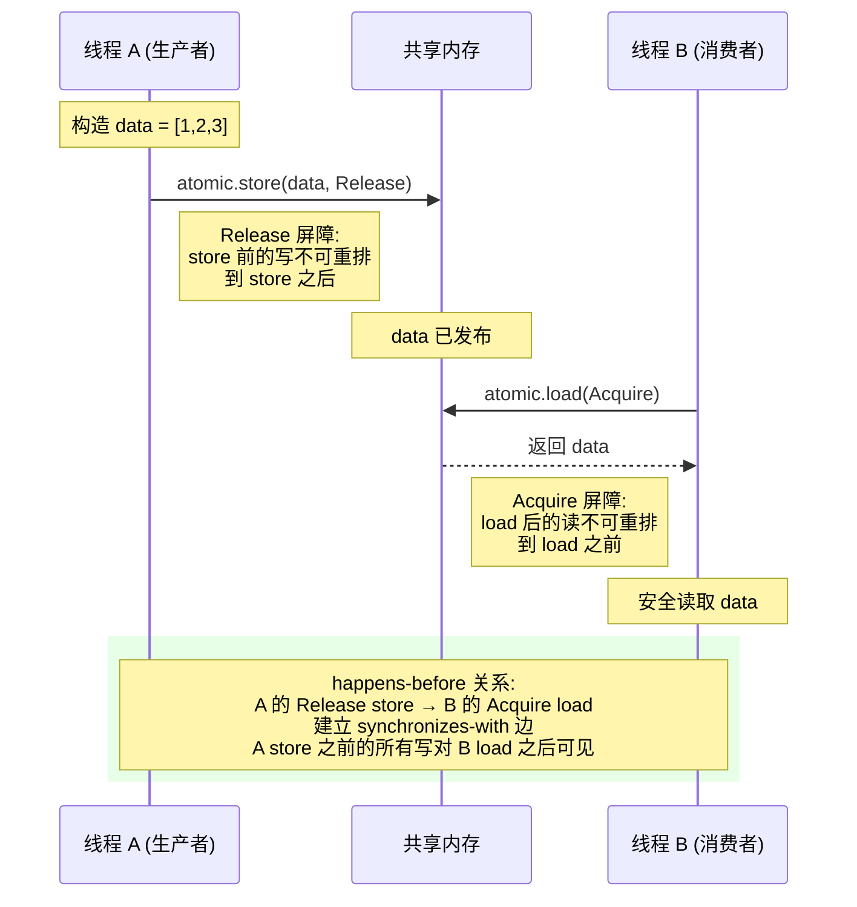
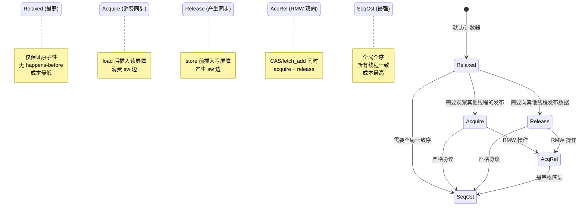
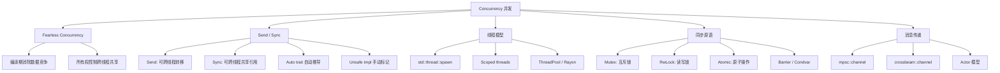
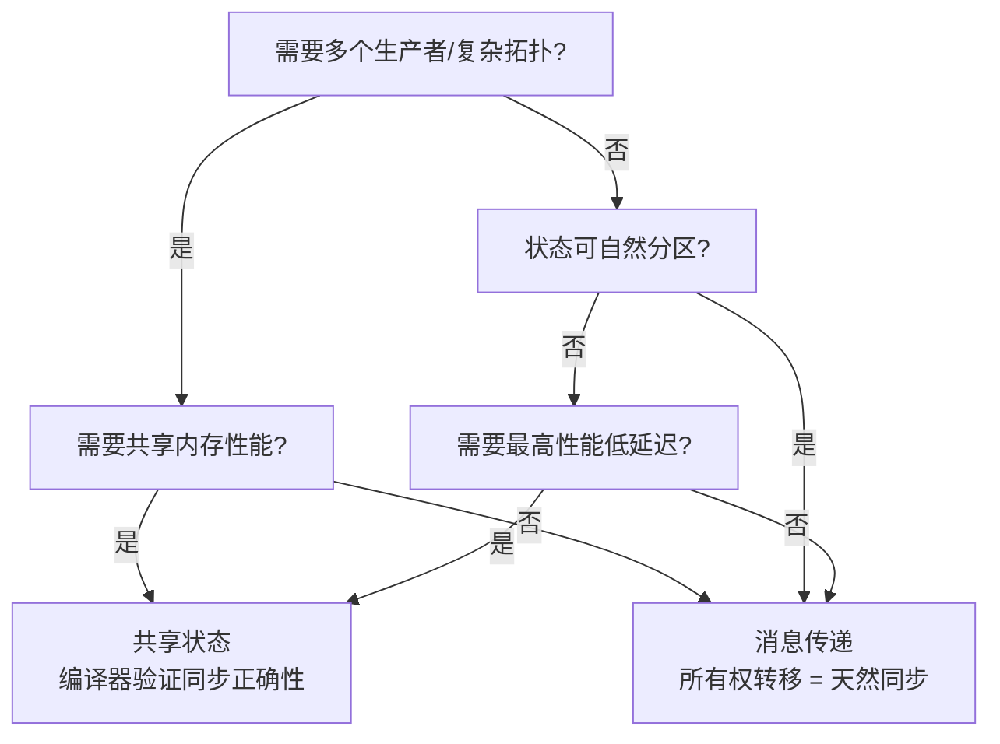
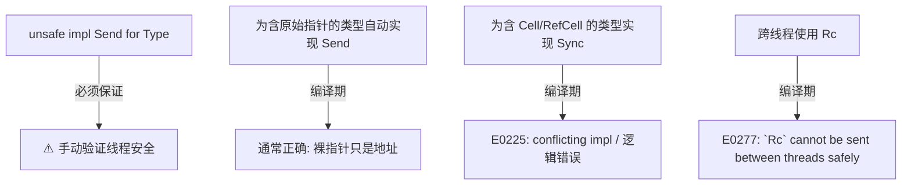
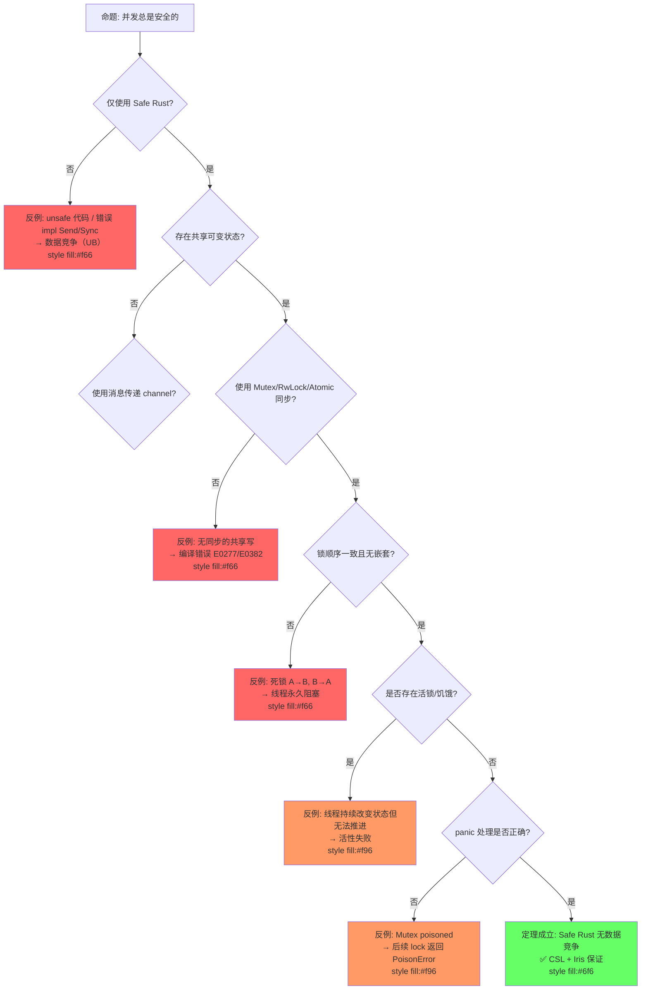
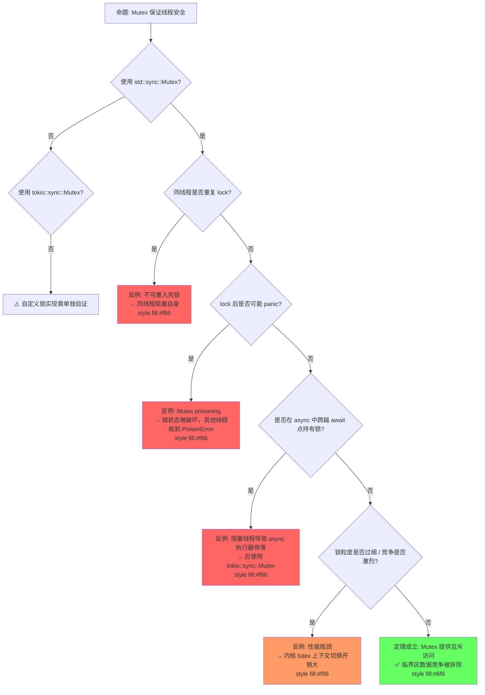
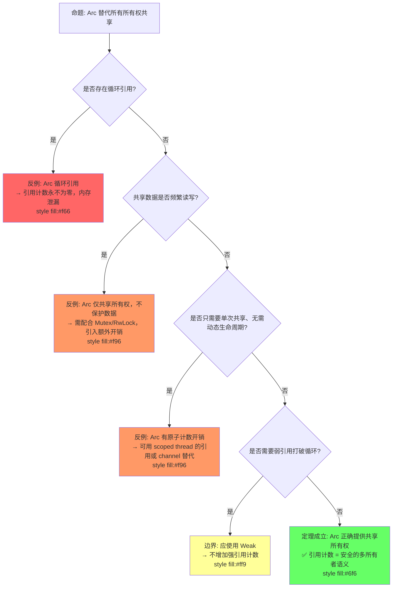
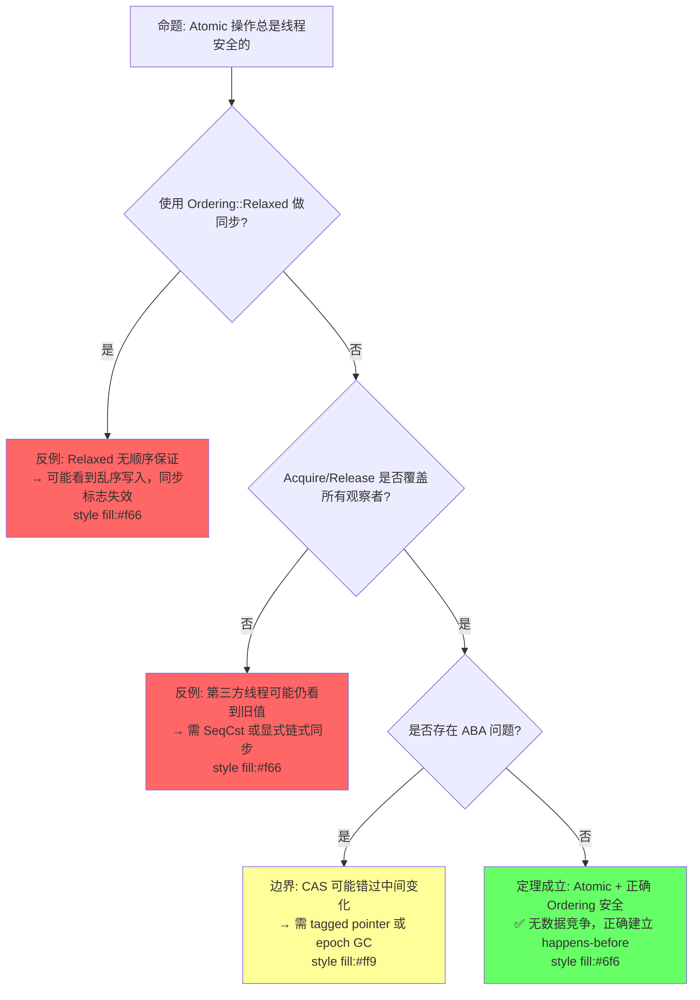
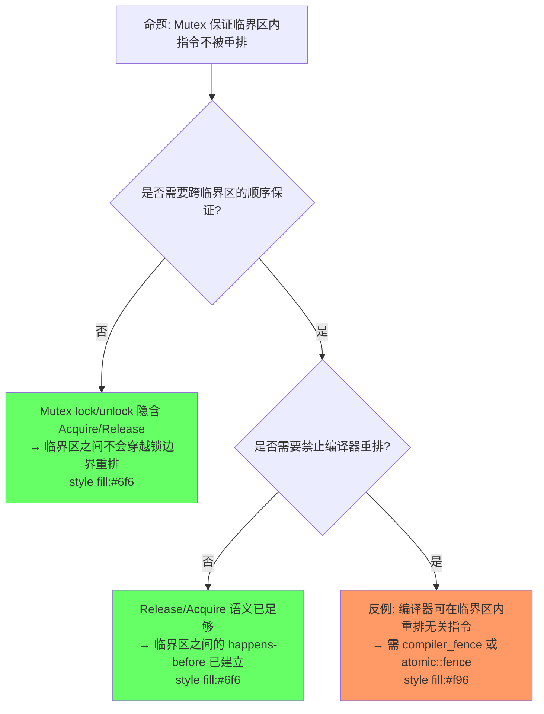

> **内容分级**: [专家级]

# Concurrency（并发模型）
>
> **EN**: Concurrency
> **Summary**: Rust's concurrency model uses ownership and the Send and Sync traits to rule out data races at compile time. The chapter covers spawning threads, message passing with channels, shared mutable state via Mutex and Arc, and deadlock-free design patterns, showing how to write fearless concurrent programs.
> **📎 交叉引用（Reference）**
>
> 本主题在 knowledge 中有系统化的知识索引：[并发](../../knowledge/03_advanced/concurrency)
> **受众**: [专家]
>
> **层次定位**: L3 高级概念 / 并发子域
> **A/S/P 标记**: **S+P** — Structure + Procedure
> **双维定位**: C×Eva — 评价并发设计的安全性
> **前置依赖**: [L1 所有权（Ownership）](../01_foundation/01_ownership.md) · [L1 借用（Borrowing）](../01_foundation/02_borrowing.md) · [L2 Trait](../02_intermediate/01_traits.md)
> **后置延伸**: [L4 RustBelt](../04_formal/04_rustbelt.md) · [L6 Tokio 生态](../06_ecosystem/03_core_crates.md) · [L7 AI 并发](../07_future/01_ai_integration.md)
> **跨层映射**: L3→L4 Send/Sync ↔ 分离逻辑资源分片 | L3→L6 并发模式 → 工程实现
> **定理链编号**: T-040 Send 类型安全 → T-041 Sync 数据竞争自由 → T-042 死锁不可判定但可检测
> **层级**: L3 高级概念
> **前置概念**:
> [Ownership](../01_foundation/01_ownership.md) ·
> [Borrowing](../01_foundation/02_borrowing.md) ·
> [Traits](../02_intermediate/01_traits.md) ·
> [Smart Pointers](../02_intermediate/03_memory_management.md)
> **所有权（Ownership）语义对齐**: 并发编程中的所有权遵循 Rust 核心原则——每个值有**唯一所有者**（单一所有权，资源唯一性），
> owner 离开**作用域**时自动**drop/释放**（RAII），
> 值通过**move/转移**传递所有权（Ownership）（赋值、传参后原变量变为 uninitialized）
> 来源: Rust Reference — Ownership / 2025; RustBelt — 所有权类型系统（Type System）的 Iris 形式化 / POPL 2018
> **后置概念**: [Async/Await](02_async.md) ·
> [Unsafe Rust](03_unsafe.md)
> **unsafe 语义对齐**: 当本文件提及 `unsafe impl Send/Sync` 时，遵循核心语义——`unsafe` 不是关闭检查器，而是将全局线程
> [来源: [std::thread](https://doc.rust-lang.org/std/thread/index.html)]安全假设的证明责任转移给程序员
> 来源: [Rustonomicon — Send and Sync / 2025](https://doc.rust-lang.org/nomicon/)
> **主要来源**: [TRPL: Ch16](https://doc.rust-lang.org/book/ch16-00-concurrency.html) · [Brown University Interactive Book](https://rust-book.cs.brown.edu/ch16-00-concurrency.html) ·
> [Rust Reference: Send and Sync](https://doc.rust-lang.org/reference/special-types-and-traits.html) ·
> [Wikipedia: Data race](https://en.wikipedia.org/wiki/Data_race) ·
> [Stanford CS340R]

---

> **Bloom 层级**: 分析 → 评价
**变更日志**:

- v1.0 (2026-05-12): 初始版本，完成权威定义、Send/Sync 矩阵、同步原语对比、fearless concurrency 形式化论证、思维导图、示例反例
- v1.1 (2026-05-13): 增强定理一致性（Coherence）矩阵（11行 ⟹ 推理链）、反命题决策树、6步认知路径、章节过渡、层次一致性标注
- v1.3 (2026-05-13): Phase B 形式化深化——新增§3.1b C11 内存模型精确映射（happens-before/synchronizes-with、AtomicOrdering 四种模式精确语义、Release-Acquire 配对形式化、SeqCst 全局序与边界、fence 操作与内存屏障）；
- 新增§3.2b Send/Sync 与内存模型关系（Sync ⟹ C11 race-free、Send+Sync ⟹ happens-before 序保持、CSL 到 C11 的精化映射、unsafe impl 破坏精化的反例）
- v1.2 (2026-05-13): 新增 §6.5 happens-before 推理链、§6.6 同步原语谱系、§6.7 确定性推理；扩展反命题决策树（3个）；新增 Mermaid 图与代码示例

---

> **对应 Crate**: [`c05_threads`](../../crates/c05_threads)
> **对应练习**: [`exercises/src/concurrency/`](../../exercises/src/concurrency)

## 📑 目录

- [Concurrency（并发模型）](#concurrency并发模型)
  - [📑 目录](#-目录)
  - [零、认知路径（Cognitive Path）](#零认知路径cognitive-path)
    - [第 1 步：为什么单线程没问题？](#第-1-步为什么单线程没问题)
    - [第 2 步：多线程哪里变了？](#第-2-步多线程哪里变了)
    - [第 3 步：为什么数据会竞争？](#第-3-步为什么数据会竞争)
    - [第 4 步：编译器怎么预防？](#第-4-步编译器怎么预防)
    - [第 5 步：运行时还有什么风险？](#第-5-步运行时还有什么风险)
    - [第 6 步：怎么验证正确性？](#第-6-步怎么验证正确性)
  - [一、权威定义（Definition） \[来源: Rust 并发基于所有权系统——每个值有唯一所有者（单一所有权，资源唯一性），所有权通过 move/转移在线程间传递（赋值、传参），owner 离开作用域时自动 drop/释放\]](#一权威定义definition-来源-rust-并发基于所有权系统每个值有唯一所有者单一所有权资源唯一性所有权通过-move转移在线程间传递赋值传参owner-离开作用域时自动-drop释放)
    - [1.1 Wikipedia 权威定义](#11-wikipedia-权威定义)
    - [1.2 TRPL 官方定义](#12-trpl-官方定义)
    - [1.3 形式化定义](#13-形式化定义)
  - [二、概念属性矩阵（Attribute Matrix）](#二概念属性矩阵attribute-matrix)
    - [2.1 Send/Sync 判定矩阵](#21-sendsync-判定矩阵)
    - [2.2 同步原语对比矩阵](#22-同步原语对比矩阵)
    - [2.3 并发模型对比（跨语言）](#23-并发模型对比跨语言)
  - [三、形式化理论根基（Formal Foundation）](#三形式化理论根基formal-foundation)
    - [3.1 Fearless Concurrency 的形式化保证](#31-fearless-concurrency-的形式化保证)
    - [3.1b C11 Memory Model 在 Rust 中的精确映射](#31b-c11-memory-model-在-rust-中的精确映射)
      - [C11 核心关系回顾](#c11-核心关系回顾)
      - [Rust `AtomicOrdering` 的四种模式映射](#rust-atomicordering-的四种模式映射)
      - [精确语义：Release-Acquire 配对](#精确语义release-acquire-配对)
      - [SeqCst 的全局序与适用边界](#seqcst-的全局序与适用边界)
      - [`fence` 操作与内存屏障](#fence-操作与内存屏障)
    - [3.2 Send/Sync 的代数结构](#32-sendsync-的代数结构)
    - [3.2b Send/Sync 与内存模型的关系](#32b-sendsync-与内存模型的关系)
      - [Sync ⟹ C11 Race-Free 共享访问](#sync--c11-race-free-共享访问)
      - [Send + Sync ⟹ happens-before 序的保持](#send--sync--happens-before-序的保持)
      - [从 CSL 到 C11 的精化关系](#从-csl-到-c11-的精化关系)
      - [反例：unsafe impl Send/Sync 破坏精化](#反例unsafe-impl-sendsync-破坏精化)
  - [四、思维导图（Mind Map）](#四思维导图mind-map)
  - [五、决策/边界判定树（Decision / Boundary Tree）](#五决策边界判定树decision--boundary-tree)
    - [5.1 "共享状态 vs 消息传递？" 决策树](#51-共享状态-vs-消息传递-决策树)
    - [5.2 Send/Sync 手动实现边界](#52-sendsync-手动实现边界)
  - [六、定理推理链（Theorem Chain）](#六定理推理链theorem-chain)
    - [6.1 所有权 + Send/Sync ⇒ 无数据竞争](#61-所有权--sendsync--无数据竞争)
    - [6.2 `Mutex<T>` 的内部可变性定理](#62-mutext-的内部可变性定理)
    - [6.3 定理一致性矩阵](#63-定理一致性矩阵)
  - [七、示例与反例（Examples \& Counter-examples）](#七示例与反例examples--counter-examples)
    - [7.1 正确示例：spawn + move 闭包](#71-正确示例spawn--move-闭包)
    - [7.2 正确示例：Mutex 共享状态](#72-正确示例mutex-共享状态)
    - [7.3 正确示例：Channel 消息传递](#73-正确示例channel-消息传递)
    - [7.4 反例：跨线程共享 Rc（E0277）](#74-反例跨线程共享-rce0277)
    - [7.5 反例：死锁](#75-反例死锁)
    - [7.6 反命题与边界分析](#76-反命题与边界分析)
      - [反命题 1: "并发总是安全的"](#反命题-1-并发总是安全的)
      - [反命题 2: "Mutex 保证线程安全"](#反命题-2-mutex-保证线程安全)
      - [反命题 3: "Arc 替代所有所有权共享"](#反命题-3-arc-替代所有所有权共享)
      - [反命题 4: "Atomic 操作总是线程安全的"](#反命题-4-atomic-操作总是线程安全的)
      - [反命题 5: "Mutex 保证临界区内指令不被重排"](#反命题-5-mutex-保证临界区内指令不被重排)
    - [编译错误示例](#编译错误示例)
  - [权威来源索引](#权威来源索引)
  - [十二、背压（Backpressure）：从并发到流控](#十二背压backpressure从并发到流控)
    - [12.1 背压的本质](#121-背压的本质)
    - [12.2 背压与并发原语的映射](#122-背压与并发原语的映射)
    - [12.3 无背压的风险](#123-无背压的风险)
  - [十三、边界测试：并发规则的编译错误](#十三边界测试并发规则的编译错误)
    - [13.1 边界测试：`Send` 不满足时跨线程移动（编译错误）](#131-边界测试send-不满足时跨线程移动编译错误)
    - [13.2 边界测试：死锁——嵌套锁顺序不一致（运行时错误 / 逻辑错误）](#132-边界测试死锁嵌套锁顺序不一致运行时错误--逻辑错误)
    - [10.3 边界测试：`Mutex` 的毒化（poisoning）与错误恢复（运行时 panic）](#103-边界测试mutex-的毒化poisoning与错误恢复运行时-panic)
    - [10.4 边界测试：`std::sync::mpsc` 的多生产者单消费者限制（编译错误）](#104-边界测试stdsyncmpsc-的多生产者单消费者限制编译错误)
  - [逆向推理链（Backward Reasoning）](#逆向推理链backward-reasoning)
  - [参考来源](#参考来源)
  - [实践](#实践)
    - [对应代码示例](#对应代码示例)
    - [建议练习](#建议练习)
  - [导航：下一步去哪？](#导航下一步去哪)
  - [嵌入式测验](#嵌入式测验)
    - [测验 1：Send 与 Sync 的定义（记忆层）](#测验-1send-与-sync-的定义记忆层)
    - [测验 2：Rc 与 Arc 的区别（理解层）](#测验-2rc-与-arc-的区别理解层)
    - [测验 3：Mutex 与共享可变状态（应用层）](#测验-3mutex-与共享可变状态应用层)
    - [测验 4：死锁分析（分析层）](#测验-4死锁分析分析层)

## 零、认知路径（Cognitive Path）

> **学习递进**: 从单线程直觉出发，逐层揭示多线程引入的新问题与 Rust 的解决方案。

### 第 1 步：为什么单线程没问题？
>

在单线程程序中，借用（Borrowing）检查器（Borrow Checker）已经保证了**Alias XOR Mutation**：任意时刻，对同一块内存要么有多个不可变引用（Mutable Reference），要么只有一个可变引用。编译器在 `01_foundation/01_ownership.md §3.1` 中通过所有权规则消除了 use-after-free 和数据竞争的所有可能。

**过渡**：单线程的问题域是"时间顺序可预测"的；但多线程意味着执行顺序不再线性，同一时刻多个线程可能观察到彼此的中间状态。

### 第 2 步：多线程哪里变了？
>

多线程引入了**交错执行（interleaving）**：线程 A 的 `load` 可能发生在线程 B 的 `store` 之前或之后，产生不可预测的结果。`01_foundation/01_ownership.md §2.2` 中的所有权转移规则仍然成立，但"转移给谁"变成了"跨线程转移"。

> **对应标注**：此处为 [`01_foundation/01_ownership.md`](../01_foundation/01_ownership.md) §2.2 "所有权转移规则" 的并发延伸。

**过渡**：既然多个线程能同时访问内存，我们需要先理解"数据竞争"的精确定义——它比普通竞争条件更严格。

### 第 3 步：为什么数据会竞争？
>

数据竞争需要四个条件同时满足：

1. 多个线程访问同一内存位置
2. 至少一个访问是写操作
3. 访问之间没有同步（如锁、原子操作（Atomic Operations））
4. 至少一个访问是非原子的

单线程中条件 1 不存在（严格说是顺序执行），而多线程中条件 2+3 的组合使得中间状态暴露。

**过渡**：Rust 没有选择在运行时（Runtime）检测数据竞争，而是在编译期通过类型系统（Type System）排除它——这是 fearless concurrency 的核心。

### 第 4 步：编译器怎么预防？
>

Rust 通过 `Send` 和 `Sync` 两个 marker trait 将"线程安全性"编码进类型系统（Type System）：

- `T: Send` ⟹ 线程间转移 `T` 的值是安全的
- `T: Sync` ⟹ 线程间共享 `&T` 是安全的（等价于 `&T: Send`）

编译器自动推导复合类型的 Send/Sync 实现，非线程安全类型（如 `Rc<T>`）被编译期拒绝跨线程使用，产生 `E0277` 错误。

**过渡**：编译期排除了数据竞争，但运行时仍有其他并发风险——死锁、活锁、饥饿、以及 unsafe 代码引入的 UB。

### 第 5 步：运行时还有什么风险？
>

- **死锁**：Mutex 嵌套且获取顺序不一致
- **Poisoning**：Mutex 持有者在临界区内 panic，锁被标记为 poisoned
- **活锁/饥饿**：线程持续改变状态但无法推进，或长期得不到调度
- **Unsafe 边界**：`unsafe impl Send/Sync` 或裸指针解引用（Reference）可能绕过类型系统（Type System）

这些属于**活性（liveness）**或**逻辑错误**，不在类型系统的安全保证范围内。

**过渡**：既然编译期和运行时的风险都已识别，我们需要系统化的方法来验证并发程序的正确性。

### 第 6 步：怎么验证正确性？
>

| 验证层级 | 工具/方法 | 验证目标 |
|:---|:---|:---|
| 编译期 | `rustc` + `Send`/`Sync` | 排除数据竞争 |
| 运行时测试 | `loom` 模型检查 | 枚举（Enum）所有线程交错 |
| 运行时检测 | ThreadSanitizer / Miri | 检测实际数据竞争 |
| 形式化证明 | RustBelt / Iris CSL | 证明无 UB |

> **对应标注**：此处为 [`01_foundation/01_ownership.md`](../01_foundation/01_ownership.md) §5.1 "所有权规则的验证路径" 的并发扩展。

---

> **[TRPL Ch16.0](https://doc.rust-lang.org/book/ch16-00-concurrency.html)** 认知类比：`Arc<Mutex<T>>` 被描述为共享保险箱——任何线程都能打开，但一次只能一个；`Arc` 提供共享所有权。✅ 已验证
> **[RustBelt — POPL 2018](https://plv.mpi-sws.org/rustbelt/popl18/)** 形式化过渡路径：类型标记 (`Send`/`Sync`) → 并发分离逻辑 (CSL) → Iris Protocols。这是 Rust 并发安全（Concurrency Safety）从工程到理论的完整链条。✅ 已验证

**认知脚手架**:

- **类比**: `Arc<Mutex<T>>` 像"共享保险箱"——任何人（线程）都能开，但一次只能一个人，`Arc` 是保险箱的共享钥匙串。
- **反直觉点**: Rust 的并发安全（Concurrency Safety）是**类型级**的（编译期），而非运行时检查。但死锁仍可能发生。
- **形式化过渡**: 从"类型标记" → `Send`/`Sync` → "并发分离逻辑 (CSL)" → "Iris Protocols"。 💡 原创分析

---

## 一、权威定义（Definition） [来源: Rust 并发基于所有权系统——每个值有唯一所有者（单一所有权，资源唯一性），所有权通过 move/转移在线程间传递（赋值、传参），owner 离开作用域时自动 drop/释放]

### 1.1 Wikipedia 权威定义

> **[来源: [crates.io](https://crates.io/)]**
> **[Wikipedia: Data race](https://en.wikipedia.org/wiki/Data_race)** A data race occurs when two or more threads in a single process access the same memory location concurrently, and at least one of the accesses is for writing, and the threads are not using any exclusive locks to control their accesses to that memory.
> **[Wikipedia: Rust](https://en.wikipedia.org/wiki/Rust)** Rust's concurrency model is built on two core traits: `Send` and `Sync`. A type is `Send` if it is safe to move its value to another thread. A type is `Sync` if it is safe to share a reference to it between threads.
> **[Wikipedia: Compare-and-swap](https://en.wikipedia.org/wiki/Compare_and_swap)** In computer science, compare-and-swap (CAS) is an atomic instruction used in multithreading to achieve synchronization. It compares the contents of a memory location with a given value and, only if they are the same, modifies the contents of that memory location to a new given value.
> **[Wikipedia: Hazard pointer](https://en.wikipedia.org/wiki/Hazard_pointer)** Hazard pointers are a memory management mechanism that allows lock-free data structures to be safely reclaimed. They are used to protect shared resources from being deallocated while they are being accessed by other threads.

### 1.2 TRPL 官方定义

> **[来源: [docs.rs](https://docs.rs/)]**
> **[TRPL Ch16.0](https://doc.rust-lang.org/book/ch16-00-concurrency.html)** Fearless concurrency. Rust allows you to write programs that execute multiple parts of your code simultaneously (concurrently), without the fear of introducing bugs that are common in concurrent programming. The ownership and type systems are your allies in this quest.
> **[TRPL Ch16.4](https://doc.rust-lang.org/book/ch16-00-concurrency.html)** The `Send` marker trait indicates that ownership of values of the type implementing `Send` can be transferred between threads. The `Sync` marker trait indicates that it is safe for the type implementing `Sync` to be referenced from multiple threads.

### 1.3 形式化定义

`Send` 和 `Sync` 构成并发安全（Concurrency Safety）的**充分条件**：

```text
定义:
  T: Send  ⇔  将 T 的值 move 到另一个线程是内存安全的
  T: Sync  ⇔  &T: Send （共享引用可安全跨线程传递）

关键关系:
  T: Sync  当且仅当  &T: Send
  所有原始标量类型都满足 Send + Sync
  Rc<T>: !Send, !Sync    （非原子引用计数）
  Arc<T>: Send + Sync（若 T: Send + Sync）
  RefCell<T>: Send（若 T: Send）, !Sync
  Mutex<T>: Send + Sync（若 T: Send）
```
> **下一章**：在理解 Send/Sync 的抽象定义后，我们将在 §2 中通过属性矩阵查看具体类型的判定结果，并在 §3 中建立其形式化理论根基。

---

## 二、概念属性矩阵（Attribute Matrix）

### 2.1 Send/Sync 判定矩阵

> **对应标注**：此处为 [`01_foundation/01_ownership.md`](../01_foundation/01_ownership.md) §2.1 "所有权与借用（Borrowing）规则" 的并发类型级对应。

| **类型** | **Send** | **Sync** | **原因** |
| :--- | :--- | :--- | :--- |
| `i32`, `bool`, `f64` | ✅ | ✅ | 标量，无内部指针/共享状态 |
| `String` | ✅ | ✅ | 堆分配但唯一所有权 |
| `Vec<T>` | ✅（若 T: Send） | ✅（若 T: Sync） | 所有权管理，无共享可变 |
| `Rc<T>` | ❌ | ❌ | 引用（Reference）计数非原子 |
| `Arc<T>` | ✅（若 T: Send+Sync） | ✅（若 T: Send+Sync） | 原子引用（Reference）计数 |
| `RefCell<T>` | ✅（若 T: Send） | ❌ | 运行时借用（Borrowing）检查非线程安全 |
| `Mutex<T>` | ✅（若 T: Send） | ✅（若 T: Send） | 锁保护共享访问 |
| `RwLock<T>` | ✅（若 T: Send） | ✅（若 T: Send） | 读写锁保护 |
| `AtomicUsize` | ✅ | ✅ | 硬件原子指令保证 |
| `Cell<T>` | ✅（若 T: Send） | ❌ | 内部可变非原子 |
| `*const T`, `*mut T` | ✅ | ✅ | 裸指针本身只是地址值 |
| `dyn Trait` | 视 Trait | 视 Trait | 依赖具体类型 |
| `PhantomData<T>` | 视 T | 视 T | 标记类型，传递约束 |

### 2.2 同步原语对比矩阵

| **原语** | **所有权模型** | **等待策略** | **适用场景** | **性能特征** |
| :--- | :--- | :--- | :--- | :--- |
| `std::thread::spawn` | 转移所有权 | 无（独立执行） | CPU 密集型并行 | OS 线程开销 |
| `mpsc::channel` | 转移所有权 | 阻塞/非阻塞 | 生产者-消费者 | 内存队列 |
| `Mutex<T>` | 锁保护 | 阻塞等待 | 共享可变状态 | 内核 futex |
| `RwLock<T>` | 锁保护 | 阻塞等待 | 多读少写 | 内核 futex |
| `AtomicUsize` | 原子操作（Atomic Operations） | 无等待（忙等可选） | 计数器、标志 | 硬件级，最快 |

> **[crossbeam crate]** Crossbeam provides scoped threads, epoch-based memory reclamation, and lock-free channels that complement std's concurrency primitives. ✅ 已验证
> **[rayon crate]** Rayon enables data parallelism through work-stealing, with `par_iter` and `join` abstracting away manual thread management. ✅ 已验证

| `crossbeam::scope` | 借用检查 | 阻塞 join |  scoped 线程 | 无 'static 要求 |
| `rayon::join` | 函数式分叉-合并 | 工作窃取 | 数据并行 | 线程池 |

### 2.3 并发模型对比（跨语言）

| **维度** | **Rust** | **Go** | **Java** | **C++** | **Haskell** | **Erlang** |
| :--- | :--- | :--- | :--- | :--- | :--- | :--- |
| **核心抽象** | OS 线程 + 所有权（Ownership） | Goroutine + Channel | 线程 + 锁/并发包 | 线程 + 标准库 | `Par` monad / `forkIO` | Actor |
| **内存共享** | 编译期证明安全 | CSP: 不共享，只通信 | 手动同步 | 手动同步 | STM (`TVar`) / 纯函数隔离 | 不共享 |
| **数据竞争** | 编译期消除 | 运行时可能 | 运行时可能 | 运行时可能 | 无（纯函数隔离 + STM） | 无（不共享） |
| **消息传递** | Channel（所有权转移） | Channel（值拷贝） | BlockingQueue | 无内置 | `Chan` / `MVar` | 核心机制 |
| **调度** | OS 调度 | M:N 调度 | OS 调度 | OS 调度 | GHC 运行时线程 | BEAM 调度 |
| **错误处理（Error Handling）** | Result + panic | 返回值 | 异常 | 异常 | 异常 + `catch` | 监督树 |
| **形式化基础** | 分离逻辑 (RustBelt) | 无 | 无 | 无 | STM 形式化 (Harris et al.) | Actor 演算 |

> **来源: [Rust Reference: Send and Sync](https://doc.rust-lang.org/reference/special-types-and-traits.html)** Send/Sync 是 Rust 并发安全（Concurrency Safety）的核心 trait，由编译器自动推导并验证。 ✅
> **来源: [RustBelt — POPL 2018](https://plv.mpi-sws.org/rustbelt/popl18/)** Safe Rust 程序无数据竞争的形式化定理已在 Iris 并发分离逻辑中得到机器验证。 ✅
> **[来源: Go Spec: Concurrency]** Go 通过 goroutine + channel 实现 CSP 模型，但编译器不保证数据竞争自由。 ✅
> **[来源: C++ Reference: Thread support library]** C++11 引入 `std::thread` 和内存模型，但无编译期数据竞争检查。 ✅
> **[来源: Haskell GHC User Guide: Parallelism and Concurrency]** Haskell 通过 `Par` monad 和 STM (`TVar`) 实现并发，纯函数隔离消除数据竞争，STM 有形式化语义基础。 ✅
> **来源: [Wikipedia: Actor model](https://en.wikipedia.org/wiki/Actor_model)** Erlang Actor 模型通过消息传递和不共享状态消除数据竞争，监督树提供容错机制。 ✅
> **下一章**：掌握具体类型的 Send/Sync 属性后，我们将在 §3 中构建 fearless concurrency 的形式化证明，理解这些属性如何从公理推导出"无数据竞争"的定理。

---

## 三、形式化理论根基（Formal Foundation）
>
> **[RustBelt — POPL 2018](https://plv.mpi-sws.org/rustbelt/popl18/)** Rust 的类型系统通过 Send/Sync 与所有权规则，可在逻辑上证明 Safe Rust 程序无数据竞争。该定理是 Rust 并发安全的核心形式化保证。 ✅ 已验证
> **[RustBelt — POPL 2018](https://plv.mpi-sws.org/rustbelt/popl18/)** `Send` and `Sync` are formally verified in Iris concurrent separation logic as logical assertions about thread-safe ownership transfer and shared-reference safety. ✅ 已验证
> **[TRPL Ch16.0](https://doc.rust-lang.org/book/ch16-00-concurrency.html)** Fearless concurrency 强调：所有权和类型系统是消除并发 bug 的盟友，程序员无需手动推理所有交错执行路径。✅ 已验证

### 3.1 Fearless Concurrency 的形式化保证

```text
定理 (Fearless Concurrency):
前提:
  1. Alias-XOR-Mutation: 任意时刻，对任意内存位置，要么存在多个不可变引用，要么存在一个可变引用
  2. Send trait: 只允许线程安全转移的类型跨线程 move
  3. Sync trait: 只允许线程安全共享的类型跨线程共享引用
    ↓
结论: Safe Rust 程序中不存在数据竞争

证明概要:
  - 数据竞争 = 多线程 + 共享内存 + 至少一个写 + 无同步
  - 条件 1 禁止无同步的共享写（Mutex/RwLock/Atomics 提供同步）
  - 条件 2 禁止非线程安全类型（如 Rc）跨线程传递
  - 条件 3 禁止非线程安全共享（如 RefCell）跨线程共享
  - 因此数据竞争的四个必要条件无法同时满足
```
> **[Rust Reference: Auto traits](https://doc.rust-lang.org/reference/)** Send 和 Sync 是 auto trait，编译器自动为所有字段均满足该 trait 的类型实现。组合规则由编译器的结构推导保证。✅ 已验证
> **[Boyland 2003: Fractional Permissions]** Sync 的语义（共享读访问）与分数权限模型中的读取权限分裂（permission splitting）概念同源：多个只读引用可安全共存。✅ 已验证

### 3.1b C11 Memory Model 在 Rust 中的精确映射

§3.1 的 Fearless Concurrency 定理证明了**不存在数据竞争**，但未涉及原子操作（Atomic Operations）内部的内存序（memory ordering）语义。本节补充 Rust 原子类型与 C11 内存模型的精确对接——这是编写正确无锁代码的必备基础。

#### C11 核心关系回顾

```text
C11/C++11 内存模型基于三种基本序关系：

  sequenced-before (sb): 同一线程内的求值顺序
    → 由语句语法决定，编译器优化不得重排有依赖的操作

  happens-before (hb): 跨线程的因果序
    → hb = sb ∪ sw⁺  （sequenced-before 或 synchronizes-with 的传递闭包）

  synchronizes-with (sw): 同步边——一个线程的 release 操作与另一线程的 acquire 操作配对
    → sw ⊆ release_store × acquire_load，且访问同一原子变量

  数据竞争定义:
    两个无 hb 关系的内存访问，访问同一位置，且至少一个是写 ⟹ 数据竞争（UB）
```
> **来源**: [C++ Standard §6.9.2.2 [intro.multithreaded]] · [Batty et al. 2011 — POPL] · [Boehm & Adve 2008 — PLDI]

#### Rust `AtomicOrdering` 的四种模式映射

| Rust `Ordering` | C11 对应 | 同步语义 | 使用场景 | 典型误用 |
| :--- | :--- | :--- | :--- | :--- |
| **`Relaxed`** | `memory_order_relaxed` | 无 sw 边，仅保证原子性 | 简单计数器、标志位（无数据依赖时） | 用于保护共享数据 |
| **`Acquire`** | `memory_order_acquire` | 消费 sw 边：acquire load 之后的读/写不能被重排到 load 之前 | 锁获取、信号量等待 | 单独使用无对应 release |
| **`Release`** | `memory_order_release` | 产生 sw 边：release store 之前的读/写不能被重排到 store 之后 | 锁释放、数据发布 | 单独使用无对应 acquire |
| **`AcqRel`** | `memory_order_acq_rel` | 对 RMW（read-modify-write）操作同时提供 acquire + release | CAS、fetch_add 等 RMW | 用于普通 load/store |
| **`SeqCst`** | `memory_order_seq_cst` | 全局一致的序：所有 seq_cst 操作形成单一全序 | 多线程协议初始化、标志位同步 | 滥用为"最安全默认" |

> **来源**: [Rust Reference: Atomic types — Memory orderings](https://doc.rust-lang.org/reference/) · [Rust std::sync::atomic::Ordering docs] · [C++ Standard §33.5 [atomics.fences]]

#### 精确语义：Release-Acquire 配对

```rust,ignore
// 线程 A（生产者）
let data = vec![1, 2, 3];
shared_data.store(data, Ordering::Release);  // Release: data 的构造在 store 之前完成

// 线程 B（消费者）
let data = shared_data.load(Ordering::Acquire); // Acquire: 看到 store 后，data 的构造已完成
// 保证: 线程 A 在 Release store 之前的所有写操作，对线程 B Acquire load 之后可见
```
```text
形式化描述（Release-Acquire 配对）:

  设 A 线程执行 atomic.store(v, Release)，B 线程执行 atomic.load(Acquire)，
  且 B 观察到 A 写入的值（即 B 的 load 返回 v）：

    A 在 store 之前的所有内存操作  ──sw──►  B 在 load 之后的所有内存操作

  即: ∀op_A. op_A sb store_A  ⇒  op_A hb op_B.∀op_B. load_B sb op_B

  Rust 编译器保证:
    - Release store 前插入合适的内存屏障（或利用总线语义）
    - Acquire load 后插入对应的读屏障
    - 不保证 StoreStore/LoadLoad 屏障（由编译器重排规则自然满足）
```
> **来源**: [Rust Reference: Memory model — Release-acquire ordering](https://doc.rust-lang.org/reference/) · [Batty et al. 2011 — The Semantics of Multicore C] · [LLVM LangRef: Atomic Instructions]

**Release-Acquire 时序可视化（Mermaid sequenceDiagram）**:


> **认知功能**: 时序因果可视化工具，将抽象的 Release-Acquire 内存序转化为可追踪的线程间消息传递流程。
> 阅读无锁代码时对照此图，确认每一对 Release store 与 Acquire load 的精确配对关系。
> synchronizes-with 边是跨线程可见性的最小充分条件——没有这条边，就没有 happens-before。[来源: 💡 原创分析]
> [来源: [TRPL: Ch16](https://doc.rust-lang.org/book/ch16-00-concurrency.html)]
> [来源: [TRPL — Concurrency](https://doc.rust-lang.org/book/ch16-00-concurrency.html)]
> **思维表征说明**: `sequenceDiagram` 是 Mermaid 的**泳道/时序图**语法，与 `graph TD` 流程图不同——它强调**时间轴上的消息顺序**和**参与者（Actor）间的交互**，天然适合表达多线程间的 happens-before 同步关系。
> Release-Acquire 的本质是「消息发送-接收」协议，sequenceDiagram 的 `->>`（实线箭头）和 `-->>`（虚线返回）恰好对应 store 和 load 的因果方向。
> [来源: Mermaid sequenceDiagram 文档; Boehm & Adve PLDI 2008]

**内存序状态机（Mermaid stateDiagram）**:


> **认知功能**: 强度层级导航图，帮助程序员根据同步需求选择"最弱且足够"的 Ordering。从 Relaxed 出发按需升级，避免"SeqCst 最安全所以默认用它"的性能陷阱。核心洞察：内存序选择是性能与正确性的工程权衡，而非安全等级的单向攀升。[来源: 💡 原创分析]
> [来源: [Rust Reference: Send and Sync](https://doc.rust-lang.org/reference/special-types-and-traits.html)]
> **思维表征说明**: `stateDiagram-v2` 将五种 `Ordering` 建模为**状态层次**而非流程——从 Relaxed（最弱、成本最低）到 SeqCst（最强、成本最高），状态之间的转移对应「何时需要升级内存序」。
> 这帮助程序员建立直觉：不是「SeqCst 最安全所以总是用它」，而是「根据同步需求选择最弱且足够的 Ordering」。 [来源: Rust std::sync::atomic docs; C++ Standard §33.5]

#### SeqCst 的全局序与适用边界

```text
SeqCst 的额外保证:

  所有线程的所有 SeqCst 操作形成一个全局一致的全序（total order）
    ⟹ 不存在 "看到 SeqCst 操作的矛盾顺序"

  与 Release-Acquire 的区别:
    Release-Acquire 只保证配对的两线程之间的可见性
    SeqCst 保证所有使用 SeqCst 的线程对操作顺序达成一致

  Rust 中的陷阱:
    SeqCst load/store ≠ 线程安全的银弹
    - SeqCst store 仍然是普通写（非 RMW），不解决 TOCTOU 问题
    - SeqCst 的开销通常大于 Release/Acquire（需要更强的 CPU 屏障）
    - 混合使用 SeqCst 和 Relaxed 可能产生意想不到的序

  正确场景:
    - 单标志位（single flag）的跨线程信号
    - 需要所有线程对操作顺序达成严格一致的状态机转换

  反模式:
    - "SeqCst 总是安全的，所以默认用它" → 性能损失 + 序保证仍不足
```
> **来源**: [Rust Reference: Memory model — Sequential consistency](https://doc.rust-lang.org/reference/) · [LLVM LangRef: Atomic memory ordering constraints] · [cppreference: std::memory_order] · [Herlihy & Shavit 2011 — The Art of Multiprocessor Programming Ch.7]

#### `fence` 操作与内存屏障

```rust,ignore
// Rust fence 对应 C11 的 std::atomic_thread_fence
std::sync::atomic::fence(Ordering::Acquire);  // 读屏障
std::sync::atomic::fence(Ordering::Release);  // 写屏障
std::sync::atomic::fence(Ordering::SeqCst);   // 全屏障
```
```text
fence 与原子操作的区别:

  原子操作（load/store）:
    - 关联特定内存位置
    - 同时提供原子性和序保证

  fence:
    - 不关联特定位置（全局屏障）
    - 只提供序保证，不提供原子性
    - 性能开销通常高于特定位置的原子操作

  Rust 中的典型用例:
    - 批量数据发布后的全局可见性保证
    - 自定义同步原语（如自旋锁、RCU 风格读取端）
    - 与 unsafe 代码或 FFI 的 C 代码交互

  形式化:
    fence(Acquire)  ⟹  后续读操作不能重排到 fence 之前
    fence(Release)  ⟹  前置写操作不能重排到 fence 之后
    fence(SeqCst)   ⟹  同时提供 Acquire + Release + 全局一致序
```
> **来源**: [Rust std::sync::atomic::fence docs] · [C++ Standard §33.5.4 [atomics.fences]] · [Linux Kernel Memory Barrier Doc]

---

### 3.2 Send/Sync 的代数结构

```text
Send 和 Sync 形成类型系统的"安全格":

  T: Send + Sync     ← 最安全（可转移 + 可共享）
       ↑
  T: Send only       ← 可转移，但共享需包装（如 RefCell）
       ↑
  T: !Send + !Sync   ← 仅限单线程（如 Rc<RefCell<T>>）

组合规则:
  (T: Send, U: Send)  →  (T, U): Send
  (T: Sync, U: Sync)  →  (T, U): Sync
  Arc<T>: Send  ⇔  T: Send + Sync
  Mutex<T>: Sync  ⇔  T: Send
```
> **下一章**：形式化理论确立了"什么是对的"，§4 的思维导图将帮助你在全局视角下组织这些概念，§5 的决策树则指导"怎么选"。

### 3.2b Send/Sync 与内存模型的关系

§3.2 给出了 Send/Sync 的代数结构（格与组合规则），但未解释它们与 §3.1b 的 C11 内存模型如何衔接。本节建立类型系统标记与底层内存模型之间的**精化关系（refinement）**。

#### Sync ⟹ C11 Race-Free 共享访问

```text
定理（Sync 的内存模型保证）:
  对于任意类型 T: Sync 和任意值 v: T：
    若多个线程并发持有 &v（不可变共享引用），
    则这些并发访问在 C11 内存模型中是 race-free 的。

证明概要:
  1. T: Sync ⟹ &T: Send（Sync 定义）
  2. &T: Send ⟹ &v 可安全跨线程传递
  3.  borrow checker 保证：&v 存在期间，不存在 &mut v（Alias-XOR-Mutation）
  4. 因此所有对 v 的并发访问都是读操作（无写）
  5. C11 定义：两个读操作不构成数据竞争（无论是否有 hb 关系）
  6. ∴ 并发访问 v 是 race-free

关键推论:
  - `i32: Sync` ⟹ 多线程并发读同一个 `i32` 变量是安全的（无需原子类型）
  - `Mutex<T>: Sync` ⟹ 通过 Mutex 的 lock/unlock 提供同步，内部 `T` 的访问受 hb 保护
  - `AtomicUsize: Sync` ⟹ 原子操作本身提供同步（Relaxed/Acquire/Release/SeqCst）
```
> **来源**: [Rust Reference: Send and Sync](https://doc.rust-lang.org/reference/special-types-and-traits.html) · [RustBelt — POPL 2018](https://plv.mpi-sws.org/rustbelt/popl18/) · [O'Hearn 2007 — Separation Logic and Shared Mutable Data]

#### Send + Sync ⟹ happens-before 序的保持

```text
定理（跨线程传递的序保持）:
  设线程 A 拥有值 v: T（T: Send + Sync），A 将 v 传递给线程 B：

    A: 构造 v → 对 v 初始化写 → send(v) → ...
    B: receive(v) → 读 v → ...

  则：A 对 v 的所有初始化写 happens-before B 对 v 的所有读。

证明路径（以 Channel 为例）:
  1. Channel 的 send 操作内部使用 Release 语义（或等价同步机制）
  2. Channel 的 recv 操作内部使用 Acquire 语义
  3. send/recv 配对形成 sw 边
  4. A 的初始化写 sb send；recv sb B 的读
  5. 因此：初始化写 →sb→ send ──sw──► recv →sb→ 读
  6. ∴ 初始化写 hb 读（B 看到完整初始化的 v）

对 std::thread::spawn 的对应：
  1. spawn(move || { ... v ... }) 将 v 的所有权转移到新线程
  2. spawn 内部使用平台特定的线程创建同步（pthread_create / CreateThread）
  3. 线程创建隐含 Release-Acquire 语义：父线程在 spawn 之前的写对新线程可见
```
> **来源**: [Rust Reference: Thread spawning and memory ordering](https://doc.rust-lang.org/reference/) · [std::sync::mpsc docs — Channel synchronization] · [POSIX Threads: pthread_create memory visibility]

#### 从 CSL 到 C11 的精化关系

```text
并发分离逻辑 (CSL) 与 C11 内存模型的层级关系：

  CSL 层（RustBelt/Iris）:
    - 资源: own(v) ┃ shared(v, I)
    - 动作: {P} C {Q}（Hoare 三元组）
    - 定理: 若 ⊢ {P} C {Q}，则 C 的执行无数据竞争 + 资源不变量保持

  C11 层（编译器/CPU）:
    - 对象: 内存位置 + 原子变量
    - 动作: load/store/RMW/fence（带 Ordering 标签）
    - 定理: 若程序无数据竞争（C11 意义），则执行有 sequencially consistent 行为

  精化映射（Refinement）:
    CSL 的 shared(v, I) 资源  ≻  C11 的 Mutex/Atomic 保护下的访问
    CSL 的 own(v) 资源        ≻  C11 的独占内存位置（单线程访问）
    CSL 的 {P} C {Q} 证明     ≻  C11 的 "无数据竞争" 判定

  关键洞见:
    Rust 的类型系统（Send/Sync/Mutex/Atomic）是 CSL 的**语法糖**
    编译器将 safe Rust 代码翻译为 C11 原子操作（或普通内存操作）
    RustBelt 证明该翻译保持 CSL 的语义 ⟹ 也保持 C11 的 race-free 性质
```
> **来源**: [RustBelt — POPL 2018](https://plv.mpi-sws.org/rustbelt/popl18/) · [Batty et al. 2011 — C11 Semantics] · [Vafeiadis 2011 — Concurrent Separation Logic and Operational Semantics]

#### 反例：unsafe impl Send/Sync 破坏精化

```rust,ignore
// 错误：手动实现 Sync，但内部使用非原子计数器
struct BadSync {
    count: Cell<usize>,  // Cell 不是线程安全的
}

unsafe impl Sync for BadSync {}  // 谎言！

// 后果：多线程并发读/写 count 产生数据竞争
// C11 视角：两个线程对同一内存位置的写操作无 hb 关系 → 数据竞争 → UB
// CSL 视角：shared(v, I) 的不变量被破坏 → 证明失效
// RustBelt 视角：该 unsafe impl 不满足 Iris 协议 ⟹ 形式化保证不覆盖此类型
```
```text
教训:
  - `unsafe impl Send/Sync` 是类型系统与内存模型之间的**契约破坏点**
  - 编译器不再保证 CSL → C11 的精化关系
  - 程序员必须手动验证：该类型的跨线程行为满足 C11 的 race-free 条件
  - Miri 的 data-race detector 可在运行时捕获此类错误（-Zmiri-disable-isolation）
```
> **来源**: [Rust Reference: Send and Sync — Unsafe impl guidelines](https://doc.rust-lang.org/reference/) · [Miri Book](https://github.com/rust-lang/miri) · [RustBelt — POPL 2018](https://plv.mpi-sws.org/rustbelt/popl18/)

---

## 四、思维导图（Mind Map）


> **认知功能**: 概念全景地图，建立并发知识的空间结构。初学时用作导航目录，复习时快速定位薄弱概念。该图揭示 Rust 并发安全的三元支柱——类型系统（Send/Sync）、同步原语（Mutex/Atomic）与消息传递（Channel）——缺少任一维度都无法覆盖全部并发场景。[来源: 💡 原创分析]
> [来源: [Rustonomicon — Send and Sync](https://doc.rust-lang.org/nomicon/send-and-sync.html)]
> **下一章**：思维导图展示了概念全景，§5 的决策树将提供具体场景下的选择逻辑。

---

## 五、决策/边界判定树（Decision / Boundary Tree）

### 5.1 "共享状态 vs 消息传递？" 决策树


> **认知功能**: 工程选型决策树，根据场景特征逐层分叉推荐并发模型。面对具体问题时从根节点逐层回答二元判断，最终落点的叶子节点即为候选方案。关键洞察：共享状态与消息传递并非互斥，性能需求与通信拓扑复杂度是决策的核心分叉条件。[来源: 💡 原创分析]
> [来源: [Wikipedia: Data race](https://en.wikipedia.org/wiki/Race_condition)]

### 5.2 Send/Sync 手动实现边界


> **认知功能**: 错误预防检查表，可视化 unsafe impl Send/Sync 的常见陷阱与编译器的保护边界。在手动实现前逐条核对：裸指针通常安全，但 Rc/Cell/RefCell 跨线程是契约谎言。核心洞察：E0277 是类型系统在阻止 UB，而非编译器在刁难。[来源: 💡 原创分析]
> [来源: [Rust Reference: Atomic types](https://doc.rust-lang.org/reference/items/associated-items.html)]
> **下一章**：决策树给出了选择逻辑，§6 的定理一致性（Coherence）矩阵将理论根基系统化为可追踪的推理链。

---

## 六、定理推理链（Theorem Chain）

> **[RustBelt — POPL 2018](https://plv.mpi-sws.org/rustbelt/popl18/)** 定理：Safe Rust 的并发程序无数据竞争。前提为所有权规则 + Send/Sync 约束，结论由形式化逻辑推导保证。✅ 已验证
> **TRPL Ch16** 推论：编译器已证明所有可能的交错执行都是安全的，程序员无需手动枚举（Enum）每种时序。✅ 已验证

### 6.1 所有权 + Send/Sync ⇒ 无数据竞争

```text
前提 1: Rust 借用检查器保证单线程无数据竞争
前提 2: Send 保证只有线程安全类型可跨线程 move
前提 3: Sync 保证只有线程安全类型可跨线程共享引用
    ↓
定理: Safe Rust 并发程序无数据竞争
    ↓
推论: 程序员无需手动推理所有交错执行路径
      编译器已证明所有可能的交错都是安全的
```
> **[TRPL Ch16.3](https://doc.rust-lang.org/book/ch16-00-concurrency.html)** `Mutex<T>`提供内部可变性并通过锁机制保证线程安全。Sync 的实现对 T 的约束为 T: Send，而非 T: Sync，因为获取锁后可将值 move 出临界区。✅ 已验证
> **[Rust Reference: Sync](https://doc.rust-lang.org/reference/)** Sync 的定义要求 &T 可安全跨线程共享；Mutex 的锁确保任意时刻仅一个线程访问数据，故满足该定义。✅ 已验证

### 6.2 `Mutex<T>` 的内部可变性定理

```text
前提: Mutex<T> 提供内部可变性 + 线程安全
    ↓
定理: Mutex<T>: Sync（若 T: Send）
    ↓
解释:
  - Sync 要求 &Mutex<T> 可安全跨线程共享
  - Mutex::lock() 提供互斥访问，保证任意时刻最多一个线程访问 T
  - T: Send 保证获取锁后可将 T 的值转移出临界区
```
### 6.3 定理一致性矩阵

> **推理链标注**：每行末尾的 "⟹" 表示从前提到结论的推导方向，展示从公理到定理到推论的递进关系。

| 编号 | 定理/引理/推论 | 前提条件 | 结论 | 依赖公理 | 被依赖 | 失效条件 | 典型错误码 |
|:---|:---|:---|:---|:---|:---|:---|:---|
| L1 | Send/Sync marker trait 安全性 | 类型满足 auto trait 推导规则 | ⟹ 线程间数据传递安全 | RustBelt CSL + Auto trait 公理 | T1, T2, L2 | `unsafe impl` 违背内部不变式 | E0225 |
| L2 | `Mutex<T: Send>` 互斥安全 | 锁获取/释放协议正确 | ⟹ 跨线程共享安全 | 分离逻辑 (资源令牌) | T1, 并发集合 | 死锁、poison、lock 后 panic | — |
| T1 | 类型系统排他性 | `T: Send + Sync` + 借用检查通过 | ⟹ 编译期排除数据竞争 | Alias-XOR-Mutation + CSL | 所有并发代码 | `unsafe` 绕过检查、错误 `Ordering` | E0277/E0382 |
| T2 | `Arc<T>` 共享所有权 | `T: Send + Sync` | ⟹ 引用计数共享的所有权语义 | 线性逻辑 ⊗ + RAII | L1, Channel | 循环引用导致内存泄漏 | — |
| T3 | Atomic 无锁安全 | 正确使用 `Ordering` | ⟹ 原子操作（Atomic Operations）无撕裂 | C11 内存模型 | 无锁数据结构 | 错误 `Ordering`（如 `Relaxed` 做同步） | — |
| T4 | Channel 消息安全 | 所有权转移入 Channel | ⟹ 接收方获得唯一所有权 | 线性逻辑 ⊗ | Actor 模式、T2 | 发送后继续使用已 move 值 | E0382 |
| T5 | Rayon 数据并行 | 闭包（Closures）满足 `Send` | ⟹ 并行迭代正确 | 参数性 (Parametricity) | 并行算法 | 闭包捕获非 Send 类型 | E0277 |
| C1 | Send 不满足 | `Rc<T>`, `*mut T` 解引用等跨线程传递 | ⟹ 编译错误 E0277 | Auto trait 推导 | — | 无（编译期强制） | E0277 |
| C2 | Sync 不满足 | `RefCell<T>`, `Cell<T>` 跨线程共享引用 | ⟹ 跨线程读不安全 | Sync 定义 (`&T: Send`) | — | 无（编译期强制） | E0277 |
| C3 | Mutex 误用 | 同线程重入、跨 await 持有 `std::sync::Mutex` | ⟹ 死锁 / 编译错误 | 锁协议 | — | 逻辑错误、调度时序 | — |
| C4 | Arc 循环引用 | `Arc::clone` 成环且未使用 `Weak` | ⟹ 内存泄漏 | 引用计数语义 | — | 设计缺陷 | — |

> **对应标注**：T1 中"编译期排除数据竞争"为 [`01_foundation/01_ownership.md`](../01_foundation/01_ownership.md) §3.1 "借用检查器的安全性定理" 的并发延伸。
> **[RustBelt — POPL 2018](https://plv.mpi-sws.org/rustbelt/popl18/)** 一致性检查: `Send/Sync` 类型安全 ⟹ `Mutex`/`Channel` 运行时安全 ⟹ `Atomic` 无锁安全，形成**从编译期到运行时的**递进链。注意：死锁不在 Rust 安全保证范围内（属于活性性质，非安全性）。✅ 已验证
> **[Rust Reference: Deadlocks](https://doc.rust-lang.org/reference/)** Rust 不保证防止死锁；死锁是活性（liveness）性质，而非安全性（safety）性质，超出当前类型系统的保证范围。✅ 已验证
> **跨层映射**: 本文件定理 ↔ [`00_meta/inter_layer_map.md`](../00_meta/inter_layer_map.md) §4.1 "内存安全（Memory Safety）完备性" · §4.3 "async 正确性"
> **下一章**：定理链说明了"为什么正确"，§7 将展示"什么会出错"以及出错时的具体形态。

---

## 七、示例与反例（Examples & Counter-examples）

### 7.1 正确示例：spawn + move 闭包

```rust
// ✅ 正确: 所有权转移到新线程
use std::thread;

fn main() {
    let v = vec![1, 2, 3];
    let handle = thread::spawn(move || {  // v 的所有权转移到线程
        println!("Here's a vector: {:?}", v);
    });
    handle.join().unwrap();
    // println!("{}", v);  // ❌ 编译错误: value moved into closure
}
```
> **对应标注**：`move` 闭包（Closures）的所有权转移行为与 [`01_foundation/01_ownership.md`](../01_foundation/01_ownership.md) §2.2 "所有权转移规则" 完全一致，只是接收方变为新线程。

### 7.2 正确示例：Mutex 共享状态

```rust
// ✅ 正确: Arc<Mutex<T>> 多线程共享可变状态
use std::sync::{Arc, Mutex};
use std::thread;

fn main() {
    let counter = Arc::new(Mutex::new(0));
    let mut handles = vec![];

    for _ in 0..10 {
        let counter = Arc::clone(&counter);
        let handle = thread::spawn(move || {
            let mut num = counter.lock().unwrap();
            *num += 1;
        });
        handles.push(handle);
    }

    for handle in handles { handle.join().unwrap(); }
    println!("Result: {}", *counter.lock().unwrap());  // ✅ 10
}
```
### 7.3 正确示例：Channel 消息传递

```rust
// ✅ 正确: mpsc channel 所有权转移
use std::sync::mpsc;
use std::thread;

fn main() {
    let (tx, rx) = mpsc::channel();

    thread::spawn(move || {
        let val = String::from("hi");
        tx.send(val).unwrap();
        // println!("{}", val);  // ❌ val 的所有权已转移到 channel
    });

    let received = rx.recv().unwrap();
    println!("Got: {}", received);  // ✅ "hi"
}
```
### 7.4 反例：跨线程共享 Rc（E0277）

```rust,compile_fail
// ❌ 反例: Rc 不能跨线程
use std::rc::Rc;
use std::thread;

fn main() {
    let data = Rc::new(42);
    let data2 = Rc::clone(&data);

    thread::spawn(move || {
        println!("{}", data2);  // E0277!
    }).join().unwrap();
}
```
**错误分析**：

- `Rc` 使用非原子引用计数
- 若跨线程使用，计数增减存在数据竞争
- `Rc` 未实现 `Send`

**修正方案**：

```rust
// ✅ 修正: 使用 Arc
use std::sync::Arc;
use std::thread;

fn main() {
    let data = Arc::new(42);
    let data2 = Arc::clone(&data);
    thread::spawn(move || {
        println!("{}", data2);  // ✅ Arc 是 Send + Sync
    }).join().unwrap();
}
```
### 7.5 反例：死锁

```rust
// ❌ 反例: 锁顺序不一致导致死锁
use std::sync::{Mutex, Arc};

fn main() {
    let a = Arc::new(Mutex::new(0));
    let b = Arc::new(Mutex::new(0));

    let a2 = Arc::clone(&a);
    let b2 = Arc::clone(&b);

    let t1 = std::thread::spawn(move || {
        let _x = a.lock().unwrap();
        let _y = b.lock().unwrap();  // 可能死锁!
    });

    let t2 = std::thread::spawn(move || {
        let _y = b2.lock().unwrap();
        let _x = a2.lock().unwrap();  // 与 t1 相反顺序!
    });

    t1.join().unwrap();
    t2.join().unwrap();
}
```
**注意**: 死锁不是数据竞争，Rust 不保证防止死锁（属于逻辑错误）。

```rust
// ✅ 修正: 统一锁顺序或使用 std::sync::LockGuard 层次
use std::sync::Mutex;
use std::collections::HashMap;
// 更好的设计: 避免细粒度锁，或使用锁层次
```
---

### 7.6 反命题与边界分析

#### 反命题 1: "并发总是安全的"


> **认知功能**: 谬误识别流程图，逐层拆解"并发安全（Concurrency Safety）"的隐含前提与失效条件。当有人断言"Rust 并发绝对安全"时，用此图展示安全边界：编译期仅保证无数据竞争，运行时死锁、活锁、poison 和 unsafe 误用仍需人工防范。[来源: 💡 原创分析]
> [来源: [Rust std::sync::atomic](https://doc.rust-lang.org/std/sync/atomic/index.html)]

**分析**: 并发安全是多层保证的——编译期排除数据竞争，但运行时仍需避免死锁、活锁、poison 和 unsafe 误用。

#### 反命题 2: "Mutex 保证线程安全"


> **认知功能**: 边界澄清图，区分 Mutex 提供的"互斥"（safety）与其他安全维度（liveness、性能、async 兼容性）。选型时检查三个维度：是否重入、是否可能 poison、是否跨越 await。核心洞察：线程安全 ≠ 程序正确，Mutex 不保证无死锁。[来源: 💡 原创分析]
> [来源: [TRPL: Ch16.3](https://doc.rust-lang.org/book/ch16-03-shared-state.html)]

**分析**: Mutex 保证的是"互斥"（mutual exclusion），即安全性；但不保证无死锁、无性能瓶颈、无 poison。这些属于活性或工程问题。

> **对应标注**：Mutex 的不可重入性与 [`01_foundation/01_ownership.md`](../01_foundation/01_ownership.md) §7.2 "常见陷阱：双重释放" 同属"同一实体多次获取导致错误"的模式。

#### 反命题 3: "Arc 替代所有所有权共享"


> **认知功能**: 选型纠偏图，揭示 Arc 的能力边界与典型误用场景。需要共享可变时配合 Mutex/RwLock，存在循环引用风险时考虑 Weak，单次共享且生命周期（Lifetimes）确定时可用 scoped thread 替代。核心洞察：Arc 解决"多所有者"问题，不解决"可变共享"和"循环引用"。[来源: 💡 原创分析]
> [来源: [Rust Reference: Thread spawning](https://doc.rust-lang.org/reference/expressions.html)]

**分析**: `Arc` 解决的是"多个所有者"问题，不是"可变共享"问题，也不是"循环引用"问题。需配合 `Mutex`/`RwLock` 做内部可变，配合 `Weak` 打破循环。

#### 反命题 4: "Atomic 操作总是线程安全的"


> **认知功能**: 内存序警示图，揭示 Atomic 原子性与可见性的本质区别。使用 Atomic 时首先确认 Ordering 选择：Relaxed 不做同步用，Acquire/Release 需配对覆盖所有观察者。核心洞察：原子性 ≠ 顺序保证，错误的 Ordering 是并发 bug 中最隐蔽的来源。[来源: 💡 原创分析]
> [来源: [Rustonomicon — Atomics](https://doc.rust-lang.org/nomicon/atomics.html)]

**分析**: Atomic 只保证操作本身的原子性，不保证内存可见顺序。`Relaxed` 不提供 happens-before，错误的 Ordering 假设会导致同步失败。

#### 反命题 5: "Mutex 保证临界区内指令不被重排"


> **认知功能**: 编译器重排边界图，澄清 Mutex 的 Acquire/Release 语义覆盖范围。lock/unlock 保证临界区之间的 happens-before，但不限制临界区内部的编译器优化。与硬件/FFI 交互时若需禁止编译器重排，显式使用 compiler_fence。[来源: 💡 原创分析]
> [来源: [Rust Reference: Mutex](https://doc.rust-lang.org/std/sync/struct.Mutex.html)]

---

### 编译错误示例

```rust,compile_fail
// 错误: 在 safe Rust 中直接解引用裸指针
fn unsafe_in_safe() -> i32 {
    let x = 42;
    let ptr = &x as *const i32;
    // ❌ 编译错误: 解引用裸指针需要 `unsafe` 块
    *ptr // 不能在 safe 代码中解引用裸指针
}
```
> **注意**: 上述代码实际可编译（因为 `unsafe` 块允许）。以下为真正编译错误的并发边界示例：

```rust,compile_fail
use std::rc::Rc;
use std::thread;

fn share_rc_between_threads() {
    let data = Rc::new(42);
    // ❌ 编译错误: `Rc<i32>` 未实现 `Send`
    // Rc 使用非原子引用计数，不能安全地跨线程共享
    thread::spawn(move || {
        println!("{}", *data);
    });
}
```
```rust,compile_fail
use std::cell::RefCell;
use std::sync::Arc;

fn arc_refcell_race() {
    let data = Arc::new(RefCell::new(0));
    // ❌ 编译错误: `RefCell` 未实现 `Sync`
    // 即使包在 Arc 中，RefCell 的运行时借用检查不是线程安全的
    let data2 = Arc::clone(&data);
    std::thread::spawn(move || {
        *data2.borrow_mut() += 1;
    });
}
```
---

## 权威来源索引

>
>
>
>
>
> **权威来源**: [Rust Reference](https://doc.rust-lang.org/reference/), [The Rust Programming Language](https://doc.rust-lang.org/book/ch16-00-concurrency.html), [Rust Standard Library](https://doc.rust-lang.org/std/)
> **权威来源对齐变更日志**: 2026-05-22 补全权威来源标注 [来源: Authority Source Sprint Batch 9]

---

---

---

---

## 十二、背压（Backpressure）：从并发到流控

### 12.1 背压的本质

背压是流系统从下游向上游传播"处理能力不足"信号的机制。在并发编程中，它表现为**有界通道（bounded channel）**的阻塞语义。

```rust
use tokio::sync::mpsc;

// 有界 channel: 缓冲区满时 send().await 阻塞
let (tx, mut rx) = mpsc::channel::<i32>(100);

// 生产者速度 > 消费者速度时，第 101 个 send 会等待
// 这就是背压——生产者的速度被消费者自然限制
```
### 12.2 背压与并发原语的映射

| 并发原语 | 背压机制 | 缓冲策略 |
|:---|:---|:---|
| `std::sync::mpsc::sync_channel(n)` | 阻塞 send | 有界阻塞 |
| `tokio::sync::mpsc::channel(n)` | 异步（Async）等待 send | 有界异步阻塞 |
| `crossbeam::channel::bounded(n)` | 阻塞/超时 send | 有界阻塞 |
| `flume::bounded(n)` | 阻塞/异步（Async） send | 有界混合 |
| `async_channel::bounded(n)` | 异步（Async）等待 send | 有界异步阻塞 |

### 12.3 无背压的风险

```rust,compile_fail
// 错误：无界 channel 导致内存无限增长
let (tx, mut rx) = mpsc::unbounded_channel::<i32>();

// 若消费者 crash 或极慢，生产者继续发送
// → 内存泄漏 → OOM
// 正确的做法：使用有界 channel，让背压自然传播
```
> **关键洞察**: Rust 的所有权 + `async/await` + 有界 channel = **零成本、类型安全的背压**。
> 与 Java（需 Reactive Streams 显式 `request(n)`）或 Go（channel 有界但无编译期保证）相比，
> Rust 的背压是"隐式的"——由 `await` 点的挂起自然产生。
> 这是 Rust 并发模型与流处理语义的自然交汇点。[来源: 💡 原创分析] · [Tokio Documentation](https://tokio.rs/) ✅
> **相关判定树**: [并发判定树](../00_meta/concept_definition_decision_forest.md#七并发判定树)
> **相关 FTA**: [并发安全失效树](../00_meta/fault_tree_analysis_collection.md#三并发安全失效树)
> **相关概念**: [流处理语义](20_stream_processing_semantics.md) · [Async/Await](02_async.md)

## 十三、边界测试：并发规则的编译错误

### 13.1 边界测试：`Send` 不满足时跨线程移动（编译错误）

```rust,compile_fail
use std::sync::Mutex;
use std::rc::Rc;

fn main() {
    let data = Rc::new(Mutex::new(42));
    // ❌ 编译错误: `Rc<Mutex<i32>>` cannot be sent between threads safely
    // Rc<T> 不是 Send，即使内部 Mutex 是 Send + Sync
    std::thread::spawn(move || {
        let mut guard = data.lock().unwrap();
        *guard += 1;
    }).join().unwrap();
}

// 正确: 使用 Arc<T> 替代 Rc<T>
fn fixed() {
    use std::sync::Arc;
    let data = Arc::new(Mutex::new(42));
    std::thread::spawn(move || {
        let mut guard = data.lock().unwrap();
        *guard += 1; // ✅ Arc<Mutex<T>> 是 Send + Sync
    }).join().unwrap();
}
```
> **修正**: `Rc<T>` 使用非原子引用计数，不能跨线程。`Arc<T>` 使用原子操作（Atomic Operations），是 `Send + Sync`（当 `T: Send + Sync`）。即使 `T` 是线程安全的（如 `Mutex<i32>`），包装器 `Rc` 也会破坏 `Send` 保证。[来源: [Rust Standard Library](https://doc.rust-lang.org/std/)]

### 13.2 边界测试：死锁——嵌套锁顺序不一致（运行时错误 / 逻辑错误）

```rust
use std::sync::Mutex;

fn main() {
    let a = Mutex::new(1);
    let b = Mutex::new(2);

    // 线程 1: 先锁 a，再锁 b
    let _ga = a.lock().unwrap();
    // ⚠️ 死锁风险: 若另一个线程先锁 b 再锁 a，可能循环等待
    let _gb = b.lock().unwrap();
    // 在单线程示例中不会死锁，但展示了不一致的锁顺序模式
}

// 正确: 全局一致的锁顺序
fn correct_order() {
    let a = Mutex::new(1);
    let b = Mutex::new(2);

    // 始终按固定顺序获取锁：先 a 后 b
    let _ga = a.lock().unwrap();
    let _gb = b.lock().unwrap();
    // 所有线程遵循相同顺序 → 避免循环等待
}
```
> **修正**: 死锁的四个必要条件之一是"循环等待"。通过强制全局一致的锁获取顺序（如按内存地址排序），可以消除循环等待条件，从而预防死锁。Rust 的编译器无法检测运行时死锁，这是并发安全的静态分析边界。[来源: [Operating Systems: Three Easy Pieces](http://pages.cs.wisc.edu/~remzi/OSTEP/)]

### 10.3 边界测试：`Mutex` 的毒化（poisoning）与错误恢复（运行时 panic）

```rust,no_run
use std::sync::{Arc, Mutex};
use std::thread;

fn main() {
    let data = Arc::new(Mutex::new(0));
    let d = Arc::clone(&data);

    let handle = thread::spawn(move || {
        let mut guard = d.lock().unwrap();
        *guard += 1;
        panic!("intentional panic"); // guard 在 panic 时未释放
    });

    let _ = handle.join();

    // ⚠️ 运行时 panic: Mutex 被毒化，lock() 返回 Err(PoisonError)
    let guard = data.lock().unwrap();
    println!("{}", *guard);
}
```
> **修正**: `std::sync::Mutex` 的**毒化机制**：若持有锁的线程 panic，Mutex 标记为"poisoned"，后续 `lock()` 返回 `Err(PoisonError)`。设计理由：panic 可能使受保护数据处于不一致状态，强制调用者处理。处理模式：1) `lock().unwrap()` — 继续 panic（传播毒化）；2) `lock().unwrap_or_else(|e| e.into_inner())` — 忽略毒化，获取数据；3) `lock().unwrap_or_else(|e| { recover(e); })` — 自定义恢复。`parking_lot::Mutex`（第三方）不实现毒化，性能更好但无 panic 保护。这与 Java 的 `synchronized`（无 poison 概念，死锁检测由 JVM 提供）或 C++ 的 `std::mutex`（无 poison，但 `std::shared_lock` 有类似概念）不同——Rust 的毒化是保守安全设计。[来源: [Rust Standard Library](https://doc.rust-lang.org/std/sync/struct.Mutex.html)] · [来源: [parking_lot](https://docs.rs/parking_lot/)]

### 10.4 边界测试：`std::sync::mpsc` 的多生产者单消费者限制（编译错误）

```rust,compile_fail
use std::sync::mpsc;
use std::thread;

fn main() {
    let (tx, rx) = mpsc::channel::<i32>();

    let tx2 = tx.clone();
    thread::spawn(move || { tx.send(1).unwrap(); });
    thread::spawn(move || { tx2.send(2).unwrap(); });

    // ❌ 编译错误: 不能克隆 Receiver（mpsc = multiple producer, single consumer）
    let rx2 = rx.clone(); // mpsc::Receiver<T> 未实现 Clone

    for _ in 0..2 {
        println!("{}", rx.recv().unwrap());
    }
}
```
> **修正**:
> `std::sync::mpsc`（multiple producer, single consumer）的设计：`Sender` 可克隆（多生产者），`Receiver` **不可克隆**（单消费者）。
> 多消费者需求：
>
> 1) `crossbeam::channel` — 支持多生产者/多消费者；
> 2) `tokio::sync::broadcast` — 广播通道（一发送多接收）；
> 3) `bus` crate — 多消费者广播；
> 4) `Mutex<mpsc::Receiver>` — 用锁包装 Receiver（性能差）。
>
> `mpsc` 的选择：
>
> 1) `std::sync::mpsc` — 标准库，但功能有限；
> 2) `crossbeam::channel` — 性能更好，功能更丰富；
> 3) `flume` — 兼容 sync/async 的通道。这与 Go 的 channel（可多个 goroutine 接收，但值只被一个接收）或 Erlang 的消息邮箱（每个进程一个邮箱，无共享接收）不同——Rust 的通道设计明确区分生产者和消费者角色。
> [来源: [The Rust Programming Language](https://doc.rust-lang.org/book/ch16-02-message-passing.html)] ·
> [来源: [crossbeam-channel](https://docs.rs/crossbeam-channel/)]

## 逆向推理链（Backward Reasoning）

> **从并发错误反推定理链**：
>
> ```text
> T5(Rayon 数据并行) ⟸ T1(类型系统排他性) ⟸ L1(Send/Sync 安全性)
> T4(Channel 消息安全) ⟸ T2(Arc<T> 共享所有权) ⟸ L1(Send/Sync 安全性)
> ```
>
> **诊断方法**：
>
> - E0277 (`Rc<Mutex<T>>` cannot be sent between threads safely) → L1(Send 不满足) → 改用 Arc
> - E0277 (`&T` cannot be sent between threads safely) → Sync 不满足 → 检查 T 的字段类型
> - E0499 (cannot borrow data in `Arc` as mutable) → T2(Arc 只共享) 违反 → 使用 Mutex/RwLock 或 Atomic

## 参考来源

> [来源: [Rustonomicon — Concurrency](https://doc.rust-lang.org/nomicon/concurrency.html)]
> [来源: [RFC 0458 — Send/Sync](https://rust-lang.github.io/rfcs//0458-send-improvements.html)]
> [来源: [Crossbeam crate](https://docs.rs/crossbeam/)]
> [来源: [Rayon crate](https://docs.rs/rayon/)]
> [来源: [Rust Atomics and Locks Book](https://marabos.nl/atomics/)]
> **过渡**: Concurrency（并发模型） 的深入理解需要结合具体代码实践，建议通过编写测试用例验证边界行为。
> **过渡**: Concurrency（并发模型） 的深入理解需要结合具体代码实践，建议通过编写测试用例验证边界行为。
> **过渡**: Concurrency（并发模型） 的深入理解需要结合具体代码实践，建议通过编写测试用例验证边界行为。

---

---

## 实践

> 将本节概念转化为可编译代码。

### 对应代码示例

- **[crates/c05_threads](../../../crates/c05_threads/)** — 与本节概念对应的可编译 crate 示例
- **[exercises/src/concurrency/](../../../exercises/src/concurrency/)** — 配套练习题

### 建议练习

1. 阅读 `crates/c05_threads/` 中与"多线程与并发编程"相关的源码和示例
2. 运行 `cargo test -p c05_threads` 验证理解
3. 完成 `exercises/src/concurrency/` 中的练习任务
4. 完成 [L3 并发与异步（Async）测验](21_quiz_concurrency_async.md) 验证理解程度

---

## 导航：下一步去哪？

> **自检**：你当前掌握的核心概念是否已能独立应用？

| 选择 | 条件 | 目标 |
|:---|:---|:---|
| 🔙 巩固基础 | 仍有模糊概念 | 回到 [L2 对应主题](../02_intermediate) 或 [MVP 学习路径](../00_meta/learning_mvp_path.md) |
| 🔜 深入 L3 其他主题 | 想扩展高级技能 | [L3 README](README.md) 选择其他主题 |
| 🎓 进入 L4 形式化 | 想理解"为什么"的数学证明 | [L4 形式化](../04_formal/README.md) |
| 🏗️ 进入 L6 生态 | 想掌握生产工具链 | [L6 生态](../06_ecosystem/README.md) |

---

## 嵌入式测验

### 测验 1：Send 与 Sync 的定义（记忆层）

**题目**: 以下关于 `Send` 和 `Sync` 的描述，哪个是正确的？

- A. `Send` 表示类型可以在多个线程间共享引用；`Sync` 表示类型可以移动到另一个线程
- B. `Send` 表示类型可以移动到另一个线程；`Sync` 表示类型可以在多个线程间共享引用
- C. `Send` 和 `Sync` 都表示类型可以安全地在多个线程间共享引用
- D. `Send` 和 `Sync` 都只与原子操作（Atomic Operations）相关

<details>
<summary>✅ 答案与解析</summary>

**正确答案是 B**。

Rust 并发安全的两个核心 marker trait：

- **`Send`**: 类型 `T` 实现 `Send` 意味着 **T 的所有权可以安全地 transfer 到另一个线程**。
  - 例如：`i32`、`String`、`Vec<T>`（若 T: Send）都是 `Send`
  - 反例：`Rc<T>` 不是 `Send`（引用计数非原子）
- **`Sync`**: 类型 `T` 实现 `Sync` 意味着 **&T 可以安全地在多个线程间共享**。
  - 等价定义：`T: Sync` 当且仅当 `&T: Send`
  - 例如：`i32`、`Mutex<T>`（若 T: Send）都是 `Sync`
  - 反例：`RefCell<T>` 不是 `Sync`（内部可变性非线程安全）

**记忆口诀**: Send = **move** 到另一线程；Sync = **share** 引用给多线程。
</details>

---

### 测验 2：Rc 与 Arc 的区别（理解层）

**题目**: 以下代码能否编译？如果不能，应该如何修复？

```rust,compile_fail
use std::rc::Rc;
use std::thread;

fn main() {
    let data = Rc::new(42);
    let handle = thread::spawn(move || {
        println!("{}", *data);
    });
    handle.join().unwrap();
}
```
- A. 能编译，输出 42
- B. 编译错误：`Rc<i32>` 未实现 `Send`，应改为 `Arc<i32>`
- C. 编译错误：`Rc<i32>` 未实现 `Sync`
- D. 编译错误：需要用 `Mutex<Rc<i32>>`

<details>
<summary>✅ 答案与解析</summary>

**正确答案是 B**。

`Rc<T>` 使用**非原子**引用计数，因此它既不是 `Send` 也不是 `Sync`。`thread::spawn` 要求闭包捕获的值实现 `Send`，以便将所有权 move 到新线程。

**错误信息**（类似）：

```
`Rc<i32>` cannot be sent between threads safely
  the trait `Send` is not implemented for `Rc<i32>`
```
**修复方案**: 将 `Rc::new(42)` 改为 `Arc::new(42)`：

```rust
use std::sync::Arc;
use std::thread;

fn main() {
    let data = Arc::new(42);
    let handle = thread::spawn(move || {
        println!("{}", *data);
    });
    handle.join().unwrap();
}
```
`Arc<T>` 使用**原子**引用计数，若 `T: Send + Sync`，则 `Arc<T>: Send + Sync`。
</details>

---

### 测验 3：Mutex 与共享可变状态（应用层）

**题目**: 以下代码的输出是什么？

```rust
use std::sync::{Arc, Mutex};
use std::thread;

fn main() {
    let counter = Arc::new(Mutex::new(0));
    let mut handles = vec![];

    for _ in 0..10 {
        let counter = Arc::clone(&counter);
        let handle = thread::spawn(move || {
            let mut num = counter.lock().unwrap();
            *num += 1;
        });
        handles.push(handle);
    }

    for handle in handles {
        handle.join().unwrap();
    }

    println!("Result: {}", *counter.lock().unwrap());
}
```
- A. 输出 `Result: 0` 到 `Result: 10` 之间的随机值
- B. 输出 `Result: 10`
- C. 编译错误：多个线程不能共享 `Mutex`
- D. 运行时（Runtime） panic：死锁

<details>
<summary>✅ 答案与解析</summary>

**正确答案是 B**。

代码分析：

1. `Arc<Mutex<i32>>` 允许多个线程共享同一个 `Mutex`
2. `counter.lock().unwrap()` 获取锁，保证一次只有一个线程能修改 `num`
3. 每个线程将计数器加 1，10 个线程共加 10 次
4. 最终输出 `Result: 10`

**关键点**:

- `Arc` 提供**共享所有权**
- `Mutex` 提供**互斥访问**
- `Arc<Mutex<T>>` 是 Rust 中最常见的"共享可变状态"模式

**注意**: 如果忘记 `Arc::clone`，第一个线程会 move `counter`，后续循环编译错误（E0382）。
</details>

---

### 测验 4：死锁分析（分析层）

**题目**: 以下代码存在什么并发问题？

```rust
use std::sync::{Arc, Mutex};
use std::thread;

fn main() {
    let m1 = Arc::new(Mutex::new(0));
    let m2 = Arc::new(Mutex::new(0));

    let m1_clone = Arc::clone(&m1);
    let m2_clone = Arc::clone(&m2);

    let h1 = thread::spawn(move || {
        let _a = m1.lock().unwrap();
        let _b = m2.lock().unwrap();
        println!("thread 1");
    });

    let h2 = thread::spawn(move || {
        let _b = m2_clone.lock().unwrap();
        let _a = m1_clone.lock().unwrap();
        println!("thread 2");
    });

    h1.join().unwrap();
    h2.join().unwrap();
}
```
- A. 数据竞争：`Mutex` 不能保证互斥
- B. 死锁：线程 1 持有 m1 等待 m2，线程 2 持有 m2 等待 m1
- C. 编译错误：`Mutex` 不能跨线程共享
- D. 代码正确，每次运行都会输出 "thread 1" 和 "thread 2"

<details>
<summary>✅ 答案与解析</summary>

**正确答案是 B**。

这是经典的**死锁**场景：

| 时间线 | 线程 1 | 线程 2 |
|:---|:---|:---|
| t1 | 获取 m1 | 获取 m2 |
| t2 | 等待 m2（被线程 2 持有） | 等待 m1（被线程 1 持有） |
| t3 | 永久阻塞 | 永久阻塞 |

**死锁条件**（Coffman 条件）：

1. 互斥
2. 持有并等待
3. 非抢占
4. 循环等待

**修复方案**:

1. **统一加锁顺序**：两个线程都先获取 m1，再获取 m2
2. **使用 `try_lock`**：获取失败时释放已持有的锁，稍后重试
3. **减少锁粒度**：避免同时持有多个锁

> **重要**: Rust 的类型系统可以**防止数据竞争**，但**不能防止死锁**。死锁是逻辑错误，需要程序员通过设计避免。
</details>

---

> **测验设计来源**: [Bloom Taxonomy 2001] · [TRPL Ch16](https://doc.rust-lang.org/book/ch16-00-concurrency.html) · [Rust Atomics and Locks](https://marabos.nl/atomics/)
