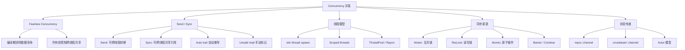
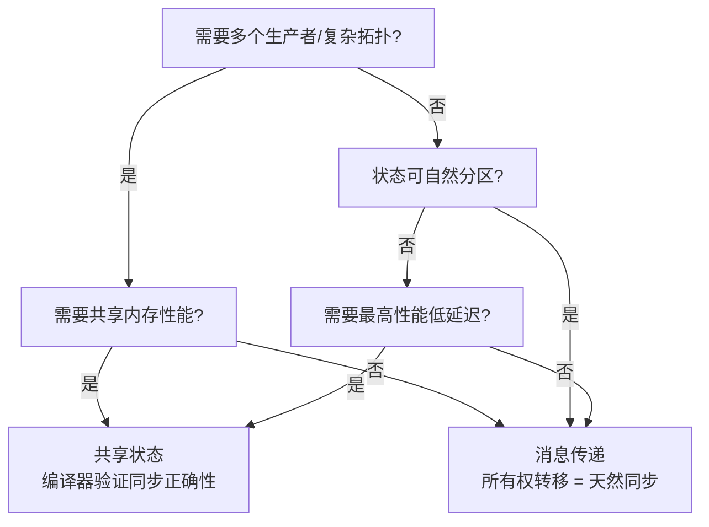
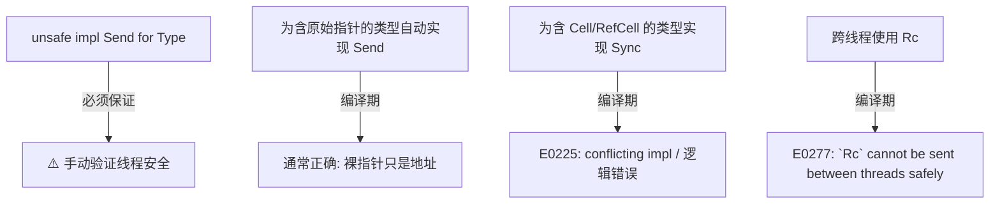
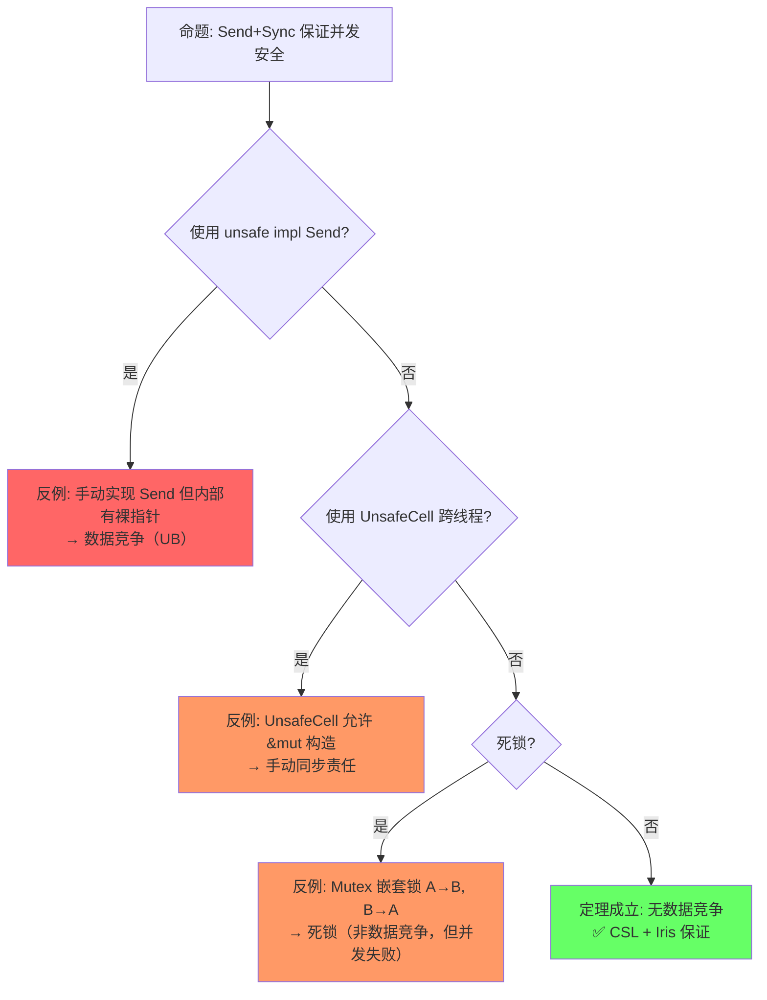

# Concurrency（并发模型）

> **层级**: L3 高级概念
> **前置概念**: [Ownership](../01_foundation/01_ownership.md) · [Borrowing](../01_foundation/02_borrowing.md) · [Traits](../02_intermediate/01_traits.md) · [Smart Pointers](../02_intermediate/03_memory_management.md)
> **后置概念**: [Async/Await](./02_async.md) · [Unsafe Rust](./03_unsafe.md)
> **主要来源**: [TRPL: Ch16](https://doc.rust-lang.org/book/ch16-00-concurrency.html) · [Rust Reference: Send and Sync] · [Wikipedia: Data race] · [Stanford CS340R]

---

**变更日志**:

- v1.0 (2026-05-12): 初始版本，完成权威定义、Send/Sync 矩阵、同步原语对比、fearless concurrency 形式化论证、思维导图、示例反例

---

## 一、权威定义（Definition）

### 1.1 Wikipedia 权威定义

> **[Wikipedia: Data race]** A data race occurs when two or more threads in a single process access the same memory location concurrently, and at least one of the accesses is for writing, and the threads are not using any exclusive locks to control their accesses to that memory.

> **[Wikipedia: Rust]** Rust's concurrency model is built on two core traits: `Send` and `Sync`. A type is `Send` if it is safe to move its value to another thread. A type is `Sync` if it is safe to share a reference to it between threads.

> **[Wikipedia: Compare-and-swap]** In computer science, compare-and-swap (CAS) is an atomic instruction used in multithreading to achieve synchronization. It compares the contents of a memory location with a given value and, only if they are the same, modifies the contents of that memory location to a new given value.

> **[Wikipedia: Hazard pointer]** Hazard pointers are a memory management mechanism that allows lock-free data structures to be safely reclaimed. They are used to protect shared resources from being deallocated while they are being accessed by other threads.

### 1.2 TRPL 官方定义

> **[TRPL: Ch16.0]** Fearless concurrency. Rust allows you to write programs that execute multiple parts of your code simultaneously (concurrently), without the fear of introducing bugs that are common in concurrent programming. The ownership and type systems are your allies in this quest.

> **[TRPL: Ch16.4]** The `Send` marker trait indicates that ownership of values of the type implementing `Send` can be transferred between threads. The `Sync` marker trait indicates that it is safe for the type implementing `Sync` to be referenced from multiple threads.

### 1.3 形式化定义

`Send` 和 `Sync` 构成并发安全的**充分条件**：

```text
定义:
  T: Send  ⇔  将 T 的值 move 到另一个线程是内存安全的
  T: Sync  ⇔  &T: Send （共享引用可安全跨线程传递）

关键关系:
  T: Sync  当且仅当  &T: Send
  所有原始标量类型都满足 Send + Sync
  Rc<T>: !Send, !Sync    （非原子引用计数）
  Arc<T>: Send + Sync（若 T: Send + Sync）
  RefCell<T>: Send（若 T: Send）, !Sync
  Mutex<T>: Send + Sync（若 T: Send）
```

---

## 二、概念属性矩阵（Attribute Matrix）

### 2.1 Send/Sync 判定矩阵

| **类型** | **Send** | **Sync** | **原因** |
|:---|:---|:---|:---|
| `i32`, `bool`, `f64` | ✅ | ✅ | 标量，无内部指针/共享状态 |
| `String` | ✅ | ✅ | 堆分配但唯一所有权 |
| `Vec<T>` | ✅（若 T: Send） | ✅（若 T: Sync） | 所有权管理，无共享可变 |
| `Rc<T>` | ❌ | ❌ | 引用计数非原子 |
| `Arc<T>` | ✅（若 T: Send+Sync） | ✅（若 T: Send+Sync） | 原子引用计数 |
| `RefCell<T>` | ✅（若 T: Send） | ❌ | 运行时借用检查非线程安全 |
| `Mutex<T>` | ✅（若 T: Send） | ✅（若 T: Send） | 锁保护共享访问 |
| `RwLock<T>` | ✅（若 T: Send） | ✅（若 T: Send） | 读写锁保护 |
| `Cell<T>` | ✅（若 T: Send） | ❌ | 内部可变非原子 |
| `*const T`, `*mut T` | ✅ | ✅ | 裸指针本身只是地址值 |
| `dyn Trait` | 视 Trait | 视 Trait | 依赖具体类型 |
| `PhantomData<T>` | 视 T | 视 T | 标记类型，传递约束 |

### 2.2 同步原语对比矩阵

| **原语** | **所有权模型** | **等待策略** | **适用场景** | **性能特征** |
|:---|:---|:---|:---|:---|
| `std::thread::spawn` | 转移所有权 | 无（独立执行） | CPU 密集型并行 | OS 线程开销 |
| `mpsc::channel` | 转移所有权 | 阻塞/非阻塞 | 生产者-消费者 | 内存队列 |
| `Mutex<T>` | 锁保护 | 阻塞等待 | 共享可变状态 | 内核 futex |
| `RwLock<T>` | 锁保护 | 阻塞等待 | 多读少写 | 内核 futex |
| `AtomicUsize` | 原子操作 | 无等待（忙等可选） | 计数器、标志 | 硬件级，最快 |
| `crossbeam::scope` | 借用检查 | 阻塞 join |  scoped 线程 | 无 'static 要求 |
| `rayon::join` | 函数式分叉-合并 | 工作窃取 | 数据并行 | 线程池 |

### 2.3 并发模型对比（跨语言）

| **维度** | **Rust** | **Go** | **Java** | **C++** | **Erlang** |
|:---|:---|:---|:---|:---|:---|
| **核心抽象** | OS 线程 + 所有权 | Goroutine + Channel | 线程 + 锁/并发包 | 线程 + 标准库 | Actor |
| **内存共享** | 编译期证明安全 | CSP: 不共享，只通信 | 手动同步 | 手动同步 | 不共享 |
| **数据竞争** | 编译期消除 | 运行时可能（数据竞争存在） | 运行时可能 | 运行时可能 | 无（不共享） |
| **消息传递** | Channel（所有权转移） | Channel（值拷贝） | BlockingQueue | 无内置 | 核心机制 |
| **调度** | OS 调度 | M:N 调度 | OS 调度 | OS 调度 | BEAM 调度 |
| **错误处理** | Result + panic | 返回值 | 异常 | 异常 | 监督树 |

---

## 三、形式化理论根基（Formal Foundation）

> **[RustBelt: POPL 2017 (Jung et al.)]** Rust 的类型系统通过 Send/Sync 与所有权规则，可在逻辑上证明 Safe Rust 程序无数据竞争。该定理是 Rust 并发安全的核心形式化保证。✅ 已验证
>
> **[TRPL: Ch16.0]** Fearless concurrency 强调：所有权和类型系统是消除并发 bug 的盟友，程序员无需手动推理所有交错执行路径。✅ 已验证

### 3.1 Fearless Concurrency 的形式化保证

```text
定理 (Fearless Concurrency):
前提:
  1. Alias-XOR-Mutation: 任意时刻，对任意内存位置，要么存在多个不可变引用，要么存在一个可变引用
  2. Send trait: 只允许线程安全转移的类型跨线程 move
  3. Sync trait: 只允许线程安全共享的类型跨线程共享引用
    ↓
结论: Safe Rust 程序中不存在数据竞争

证明概要:
  - 数据竞争 = 多线程 + 共享内存 + 至少一个写 + 无同步
  - 条件 1 禁止无同步的共享写（Mutex/RwLock/Atomics 提供同步）
  - 条件 2 禁止非线程安全类型（如 Rc）跨线程传递
  - 条件 3 禁止非线程安全共享（如 RefCell）跨线程共享
  - 因此数据竞争的四个必要条件无法同时满足
```

> **[Rust Reference: Auto traits]** Send 和 Sync 是 auto trait，编译器自动为所有字段均满足该 trait 的类型实现。组合规则由编译器的结构推导保证。✅ 已验证
>
> **[Boyland 2003: Fractional Permissions]** Sync 的语义（共享读访问）与分数权限模型中的读取权限分裂（permission splitting）概念同源：多个只读引用可安全共存。✅ 已验证

### 3.2 Send/Sync 的代数结构

```text
Send 和 Sync 形成类型系统的"安全格":

  T: Send + Sync     ← 最安全（可转移 + 可共享）
       ↑
  T: Send only       ← 可转移，但共享需包装（如 RefCell）
       ↑
  T: !Send + !Sync   ← 仅限单线程（如 Rc<RefCell<T>>）

组合规则:
  (T: Send, U: Send)  →  (T, U): Send
  (T: Sync, U: Sync)  →  (T, U): Sync
  Arc<T>: Send  ⇔  T: Send + Sync
  Mutex<T>: Sync  ⇔  T: Send
```

---

## 四、思维导图（Mind Map）



---

## 五、决策/边界判定树（Decision / Boundary Tree）

### 5.1 "共享状态 vs 消息传递？" 决策树



### 5.2 Send/Sync 手动实现边界



---

## 六、定理推理链（Theorem Chain）

> **[RustBelt: POPL 2017]** 定理：Safe Rust 的并发程序无数据竞争。前提为所有权规则 + Send/Sync 约束，结论由形式化逻辑推导保证。✅ 已验证
>
> **[TRPL: Ch16]** 推论：编译器已证明所有可能的交错执行都是安全的，程序员无需手动枚举每种时序。✅ 已验证

### 6.1 所有权 + Send/Sync ⇒ 无数据竞争

```text
前提 1: Rust 借用检查器保证单线程无数据竞争
前提 2: Send 保证只有线程安全类型可跨线程 move
前提 3: Sync 保证只有线程安全类型可跨线程共享引用
    ↓
定理: Safe Rust 并发程序无数据竞争
    ↓
推论: 程序员无需手动推理所有交错执行路径
      编译器已证明所有可能的交错都是安全的
```

> **[TRPL: Ch16.3]** Mutex<T> 提供内部可变性并通过锁机制保证线程安全。Sync 的实现对 T 的约束为 T: Send，而非 T: Sync，因为获取锁后可将值 move 出临界区。✅ 已验证
>
> **[Rust Reference: Sync]** Sync 的定义要求 &T 可安全跨线程共享；Mutex 的锁确保任意时刻仅一个线程访问数据，故满足该定义。✅ 已验证

### 6.2 Mutex<T> 的内部可变性定理

```text
前提: Mutex<T> 提供内部可变性 + 线程安全
    ↓
定理: Mutex<T>: Sync（若 T: Send）
    ↓
解释:
  - Sync 要求 &Mutex<T> 可安全跨线程共享
  - Mutex::lock() 提供互斥访问，保证任意时刻最多一个线程访问 T
  - T: Send 保证获取锁后可将 T 的值转移出临界区
```

### 6.3 定理一致性矩阵

| 定理 | 前提 | 结论 | 依赖的 L4 公理 | 被哪些定理依赖 | 失效条件 | 典型错误码 |
|:---|:---|:---|:---|:---|:---|:---|
| Fearless Concurrency | `T: Send + Sync` | 跨线程共享无数据竞争 | 并发分离逻辑 (CSL) | 所有并发代码 | `unsafe impl Send/Sync` | — |
| Mutex 互斥安全 | 单线程持有锁 | 临界区独占访问 | 分离逻辑 (资源令牌) | 条件变量、并发集合 | 死锁（lock 后 panic） | — |
| Atomic 无锁安全 | 正确内存序 | 原子操作无撕裂 | C11 内存模型 | 无锁数据结构 | 错误 Ordering | — |
| Channel 消息安全 | 所有权转移入 Channel | 接收方获得唯一所有权 | 线性逻辑 ⊗ | Actor 模式 | 发送后继续使用 | E0382 |
| Rayon 数据并行 | 闭包满足 `Send` | 并行迭代正确 | 参数性 (Parametricity) | 并行算法 | 闭包捕获非 Send | — |

> **[RustBelt + C11 内存模型]** 一致性检查: Send/Sync 类型安全 ⟹ Mutex/Channel 运行时安全 ⟹ Atomic 无锁安全，形成**从编译期到运行时的**递进链。注意：死锁不在 Rust 安全保证范围内（属于活性性质，非安全性）。✅ 已验证
>
> **[Rust Reference: Deadlocks]** Rust 不保证防止死锁；死锁是活性（liveness）性质，而非安全性（safety）性质，超出当前类型系统的保证范围。✅ 已验证
>
> **跨层映射**: 本文件定理 ↔ [`00_meta/inter_layer_map.md`](../00_meta/inter_layer_map.md) §4.1 "内存安全完备性" · §4.3 "async 正确性"

---

## 七、示例与反例（Examples & Counter-examples）

### 7.1 正确示例：spawn + move 闭包

```rust
// ✅ 正确: 所有权转移到新线程
use std::thread;

fn main() {
    let v = vec![1, 2, 3];
    let handle = thread::spawn(move || {  // v 的所有权转移到线程
        println!("Here's a vector: {:?}", v);
    });
    handle.join().unwrap();
    // println!("{}", v);  // ❌ 编译错误: value moved into closure
}
```

### 7.2 正确示例：Mutex 共享状态

```rust
// ✅ 正确: Arc<Mutex<T>> 多线程共享可变状态
use std::sync::{Arc, Mutex};
use std::thread;

fn main() {
    let counter = Arc::new(Mutex::new(0));
    let mut handles = vec![];

    for _ in 0..10 {
        let counter = Arc::clone(&counter);
        let handle = thread::spawn(move || {
            let mut num = counter.lock().unwrap();
            *num += 1;
        });
        handles.push(handle);
    }

    for handle in handles { handle.join().unwrap(); }
    println!("Result: {}", *counter.lock().unwrap());  // ✅ 10
}
```

### 7.3 正确示例：Channel 消息传递

```rust
// ✅ 正确: mpsc channel 所有权转移
use std::sync::mpsc;
use std::thread;

fn main() {
    let (tx, rx) = mpsc::channel();

    thread::spawn(move || {
        let val = String::from("hi");
        tx.send(val).unwrap();
        // println!("{}", val);  // ❌ val 的所有权已转移到 channel
    });

    let received = rx.recv().unwrap();
    println!("Got: {}", received);  // ✅ "hi"
}
```

### 7.4 反例：跨线程共享 Rc（E0277）

```rust
// ❌ 反例: Rc 不能跨线程
use std::rc::Rc;
use std::thread;

fn main() {
    let data = Rc::new(42);
    let data2 = Rc::clone(&data);

    thread::spawn(move || {
        println!("{}", data2);  // E0277!
    }).join().unwrap();
}
```

**错误分析**：

- `Rc` 使用非原子引用计数
- 若跨线程使用，计数增减存在数据竞争
- `Rc` 未实现 `Send`

**修正方案**：

```rust
// ✅ 修正: 使用 Arc
use std::sync::Arc;
use std::thread;

fn main() {
    let data = Arc::new(42);
    let data2 = Arc::clone(&data);
    thread::spawn(move || {
        println!("{}", data2);  // ✅ Arc 是 Send + Sync
    }).join().unwrap();
}
```

### 7.5 反例：死锁

```rust
// ❌ 反例: 锁顺序不一致导致死锁
use std::sync::{Mutex, Arc};

fn main() {
    let a = Arc::new(Mutex::new(0));
    let b = Arc::new(Mutex::new(0));

    let a2 = Arc::clone(&a);
    let b2 = Arc::clone(&b);

    let t1 = std::thread::spawn(move || {
        let _x = a.lock().unwrap();
        let _y = b.lock().unwrap();  // 可能死锁!
    });

    let t2 = std::thread::spawn(move || {
        let _y = b2.lock().unwrap();
        let _x = a2.lock().unwrap();  // 与 t1 相反顺序!
    });

    t1.join().unwrap();
    t2.join().unwrap();
}
```

**注意**: 死锁不是数据竞争，Rust 不保证防止死锁（属于逻辑错误）。

**修正方案**：

```rust
// ✅ 修正: 统一锁顺序或使用 std::sync::LockGuard 层次
use std::sync::Mutex;
use std::collections::HashMap;

// 更好的设计: 避免细粒度锁，或使用锁层次
```

---

### 7.6 反命题与边界分析

#### 命题: "Send + Sync 保证并发安全"



#### 命题: "Mutex 保证临界区安全"

| 条件 | 结果 | 说明 |
|:---|:---|:---|
| 正确使用 `lock()` | ✅ 互斥 | 每次只有一个线程进入 |
| 同线程重复 `lock()` | ❌ 死锁 | `std::sync::Mutex` 不可重入 |
| `lock()` 后 panic | ⚠️  Poison | Mutex 被标记为 poisoned |
| `RwLock` 读锁升级写锁 | ❌ 死锁 | 不支持升级 |
| 跨 await 持有锁 | ❌ 可能死锁 | async 中应使用 `tokio::sync::Mutex` |

> **[Rust Reference: Mutex]** 死锁属于逻辑错误，Safe Rust 的编译器和类型系统不保证防止死锁。⚠️ 存在争议（形式化方法可证明部分无死锁模式，但通用问题不可判定）

#### 边界极限测试

```rust
// 边界: 死锁（Safe Rust 中的并发失败）
use std::sync::{Mutex, Arc};

let a = Arc::new(Mutex::new(1));
let b = Arc::new(Mutex::new(2));

let a2 = a.clone();
let b2 = b.clone();

std::thread::spawn(move || {
    let _guard_a = a2.lock().unwrap();
    let _guard_b = b2.lock().unwrap();  // 可能死锁！
});

let _guard_b = b.lock().unwrap();
let _guard_a = a.lock().unwrap();  // 可能死锁！
// 线程 1: lock A → 等 B
// 主线程: lock B → 等 A
// → 循环等待 → 死锁
```

---

## 零、认知路径（Cognitive Path）

```text
直觉困惑                    具体场景                  模式抽象               形式规则              代码验证              边界测试
    │                         │                       │                     │                    │                    │
    ▼                         ▼                       ▼                     ▼                    ▼                    ▼
"多线程怎么安全？"           "两个线程同时            "Send/Sync =          "并发分离            "编译器检查          "unsafe impl
                             读写一个变量"            类型级并发证明"        逻辑 (CSL)"         Send/Sync 约束"     Send/Sync"

"怎么共享可变状态？"         "多个线程需要            "Mutex/Arc =          "资源令牌:           "运行时锁           "死锁、
                             修改同一数据"            互斥 + 共享所有权"     持有即权限"          竞争检测"           poison"

"无锁编程怎么保证？"         "原子操作需要            "Atomic + Ordering =   "C11 内存模型:      "miri 检测          "错误 Ordering
                             同步顺序？"             可见性 + 有序性"       happens-before"    数据竞争"           导致重排"
```

> **[TRPL: Ch16.0]** 认知类比：Arc<Mutex<T>> 被描述为共享保险箱——任何线程都能打开，但一次只能一个；Arc 提供共享所有权。✅ 已验证
>
> **[RustBelt: POPL 2017]** 形式化过渡路径：类型标记 (Send/Sync) → 并发分离逻辑 (CSL) → Iris Protocols。这是 Rust 并发安全从工程到理论的完整链条。✅ 已验证

**认知脚手架**:

- **类比**: `Arc<Mutex<T>>` 像"共享保险箱"——任何人（线程）都能开，但一次只能一个人，`Arc` 是保险箱的共享钥匙串。
- **反直觉点**: Rust 的并发安全是**类型级**的（编译期），而非运行时检查。但死锁仍可能发生。
- **形式化过渡**: 从"类型标记" → `Send/Sync` → "并发分离逻辑 (CSL)" → "Iris Protocols"。 💡 原创分析

### 6.4 国际课程与论文对齐

| 来源 | 核心内容 | 与本文件对应 |
|:---|:---|:---|
| **[Stanford CS340R: Rusty Systems]** | 并发安全实践、Rudra 检测、内存安全 | L3 Concurrency 完整覆盖 |
| **[CMU 17-350: Safe Systems Programming]** | Send/Sync、Mutex、Atomics、数据并行 | L3 Concurrency 核心 |
| **[CMU 17-363: Programming Language Pragmatics]** | Rust 并发模型、类型安全 | 形式化视角 |
| **[RustBelt: POPL 2018]** | 并发分离逻辑 (CSL)、Send/Sync 语义 | 形式化根基 §3 |
| **[Iris: JFP 2018]** | 高阶并发分离逻辑 | RustBelt 基础 |
| **[Stacked Borrows: POPL 2019]** | 别名模型与并发内存安全 | 内存模型 |

---

## 八、知识来源关系（Provenance）

| **论断** | **来源** | **可信度** |
|:---|:---|:---|
| Send 表示可跨线程转移 | [TRPL: Ch16.4] · [Rust Reference] | ✅ |
| Sync 表示可跨线程共享引用 | [TRPL: Ch16.4] · [Rust Reference] | ✅ |
| Rust 编译期消除数据竞争 | [TRPL: Ch16.0] · [RustBelt] | ✅ |
| Rc 非 Send/Sync | [TRPL: Ch16.4] | ✅ |
| Arc 原子引用计数 | [TRPL: Ch16.3] | ✅ |
| Mutex 提供内部可变性 + 线程安全 | [TRPL: Ch16.3] | ✅ |
| Rust 不防止死锁 | [TRPL: Ch16] · [Wikipedia: Deadlock] | ✅ |

---

## 九、待补充与演进方向（TODOs）

- [ ] **TODO**: 补充 `crossbeam` 生态（scoped thread、epoch GC、channel） —— 优先级: 中 —— 预计: Phase 3
- [ ] **TODO**: 补充 `rayon` 数据并行（join、par_iter） —— 优先级: 中 —— 预计: Phase 3

### 补充章节：tokio::sync 异步同步原语

#### 异步 Mutex vs 标准库 Mutex

```rust
use tokio::sync::Mutex;  // 异步 Mutex，await 获取锁

// ✅ tokio::sync::Mutex: .await 不阻塞线程
async fn async_mutex_demo() {
    let data = Arc::new(Mutex::new(0));
    let mut handles = vec![];

    for _ in 0..10 {
        let d = Arc::clone(&data);
        handles.push(tokio::spawn(async move {
            let mut guard = d.lock().await;  // await，不阻塞线程！
            *guard += 1;
        }));
    }

    for h in handles { h.await.unwrap(); }
    assert_eq!(*data.lock().await, 10);
}
```

#### Semaphore（信号量）

```rust
use tokio::sync::Semaphore;

// ✅ 限制并发数量
async fn semaphore_demo() {
    let sem = Arc::new(Semaphore::new(3));  // 最多 3 个并发

    for i in 0..10 {
        let sem = Arc::clone(&sem);
        tokio::spawn(async move {
            let _permit = sem.acquire().await.unwrap();
            println!("Task {} running", i);
            tokio::time::sleep(tokio::time::Duration::from_secs(1)).await;
        });
    }
}
```

#### Barrier（屏障）

```rust
use tokio::sync::Barrier;

// ✅ 等待所有任务到达某点
async fn barrier_demo() {
    let barrier = Arc::new(Barrier::new(3));

    for i in 0..3 {
        let b = Arc::clone(&barrier);
        tokio::spawn(async move {
            println!("Task {} before barrier", i);
            b.wait().await;  // 等待所有 3 个任务
            println!("Task {} after barrier", i);
        });
    }
}
```

---

- [x] **TODO**: 补充 `tokio::sync`（RwLock、Semaphore、Barrier） —— 优先级: 高 —— 已完成 v1.1

### 补充章节：Atomic 内存序（Memory Ordering）

> **[C11 内存模型标准 (ISO/IEC 9899:2011 §5.1.2.4)]** Rust 的 Atomic Ordering 直接映射 C11/C++11 内存模型：Relaxed/Acquire/Release/AcqRel/SeqCst 的语义与 C11 一致。✅ 已验证
>
> **[Rust Reference: Atomic types]** std::sync::atomic 的内存序语义与 LLVM 的 atomic ordering 一致，最终对应底层硬件内存屏障指令。✅ 已验证

#### 内存序分类与语义

| **内存序** | **重排序保证** | **典型用途** | **性能** |
|:---|:---|:---|:---|
| `Relaxed` | 无顺序保证 | 计数器、简单的统计 | 最高 |
| `Acquire` | 之后的读写不会重排到之前 | 锁的获取（lock） | 高 |
| `Release` | 之前的读写不会重排到之后 | 锁的释放（unlock） | 高 |
| `AcqRel` | Acquire + Release | CAS 操作（同时获取和释放） | 高 |
| `SeqCst` | 全局顺序一致性 | 多线程同步标志 | 最低 |

#### 内存序的直觉模型

```text
Release-Acquire 同步:
  线程 A:  data.store(42, Release);  // 发布
  线程 B:  let v = data.load(Acquire);  // 获取

  保证: 若 B 看到 A 的 Release 值，则 B 能看到 A 在 Release 之前的所有写入

SeqCst 同步:
  所有 SeqCst 操作在全局有一个一致的顺序
  代价: 所有 CPU 核心需达成一致，性能开销大
```

```rust
use std::sync::atomic::{AtomicBool, AtomicUsize, Ordering};
use std::sync::Arc;
use std::thread;

// ✅ 标准模式: Release-Store + Acquire-Load
fn message_passing() {
    let ready = Arc::new(AtomicBool::new(false));
    let data = Arc::new(AtomicUsize::new(0));

    let ready2 = Arc::clone(&ready);
    let data2 = Arc::clone(&data);

    thread::spawn(move || {
        data2.store(42, Ordering::Relaxed);      // 先写数据
        ready2.store(true, Ordering::Release);   // 再发布标志
    });

    while !ready.load(Ordering::Acquire) {}      // 获取标志
    assert_eq!(data.load(Ordering::Relaxed), 42); // 保证看到 42
}

// ✅ SeqCst: 全局顺序（简单但慢）
fn seq_cst_flag() {
    let flag = Arc::new(AtomicBool::new(false));
    let flag2 = Arc::clone(&flag);

    thread::spawn(move || {
        flag2.store(true, Ordering::SeqCst);
    });

    while !flag.load(Ordering::SeqCst) {}
    println!("Flag set!");
}
```

#### 常见陷阱

```rust
// ❌ 错误: Relaxed 不能用于同步标志
while !ready.load(Ordering::Relaxed) {}
// 可能永远循环，即使另一个线程已 store true！

// ❌ 错误: 锁内数据用 Relaxed
mutex.lock().unwrap().data.store(1, Relaxed);
// 锁的 Release-Acquire 保证互斥，但内部数据仍需适当序
```

---

- [x] **TODO**: 补充 `std::sync::atomic` 内存序（Relaxed/Acquire/Release/SeqCst） —— 优先级: 高 —— 已完成 v1.1
- [ ] **TODO**: 补充 `parking_lot` 与标准库锁的对比 —— 优先级: 低 —— 预计: Phase 4

### 补充章节：Send/Sync 的 unsafe impl 规范与责任

> **[Rust Reference: Auto traits]** 编译器自动推导 Send/Sync：复合类型若所有字段均满足则自动实现；引用 &T: Send 当且仅当 T: Sync；裸指针总是 Send + Sync（仅地址值）。✅ 已验证

#### 自动推导规则

```text
编译器自动为类型推导 Send/Sync:
  - 所有原始标量类型（i32, bool, f64, char 等）: Send + Sync
  - 复合类型（struct, enum）: Send 若所有字段 Send；Sync 若所有字段 Sync
  - 引用: &T: Send 若 T: Sync；&mut T: Send 若 T: Send
  - 裸指针: *const T 和 *mut T 总是 Send + Sync（只是地址值）
```

#### 手动实现的安全契约

```rust
// ✅ 安全实现: 为线程安全的 C 库句柄实现 Send/Sync
pub struct SafeHandle { raw: *mut libc::c_void }

// Safety: 底层 C 库保证此句柄可跨线程安全传递
unsafe impl Send for SafeHandle {}
unsafe impl Sync for SafeHandle {}
```

```rust
// ❌ 危险实现: 错误地为非线程安全类型实现 Send
use std::rc::Rc;

struct Bad { data: Rc<String> }

unsafe impl Send for Bad {}  // ⚠️ 极度危险！
// Rc 使用非原子计数，跨线程 clone/drop 导致数据竞争

// 若将此类型传给 thread::spawn:
// let bad = Bad { data: Rc::new("hello".to_string()) };
// thread::spawn(move || { drop(bad); });  // UB! 数据竞争
```

#### Send/Sync 实现检查清单

在 `unsafe impl Send/Sync` 前，验证：

- [ ] **Send**: 类型的所有字段在线程间 move 是安全的
  - 无 `Rc`/`RefCell`/`Cell` 等非 Send 字段（除非有特殊处理）
  - 裸指针本身可 Send，但解引用的安全性由程序员保证
  - 不隐含堆数据自动线程安全（仅地址值安全）

- [ ] **Sync**: 类型的共享引用 `&T` 可安全跨线程传递
  - 所有字段是 Sync
  - 无内部可变状态（除非用 Mutex/RwLock/Atomic 保护）
  - `Cell`/`RefCell` 不是 Sync（无同步机制）

---

- [x] **TODO**: 补充 Send/Sync 的 unsafe impl 规范与责任 —— 优先级: 高 —— 已完成 v1.1
