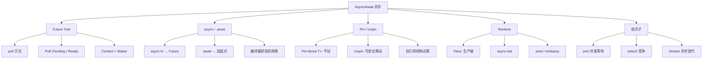
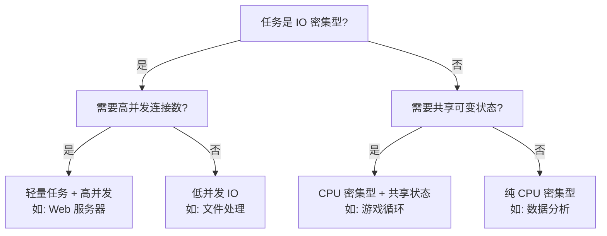
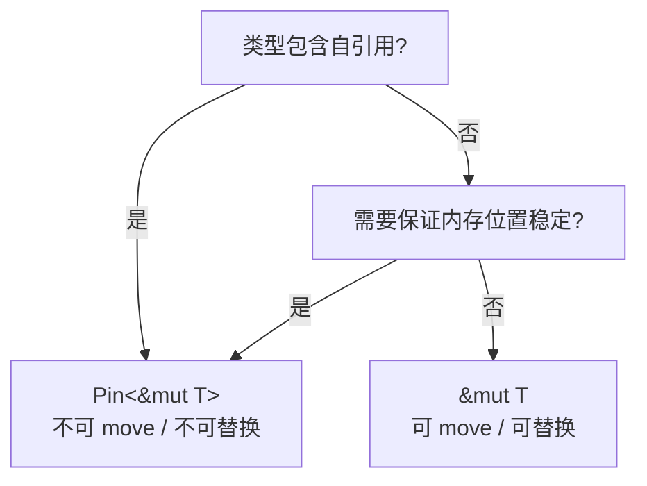
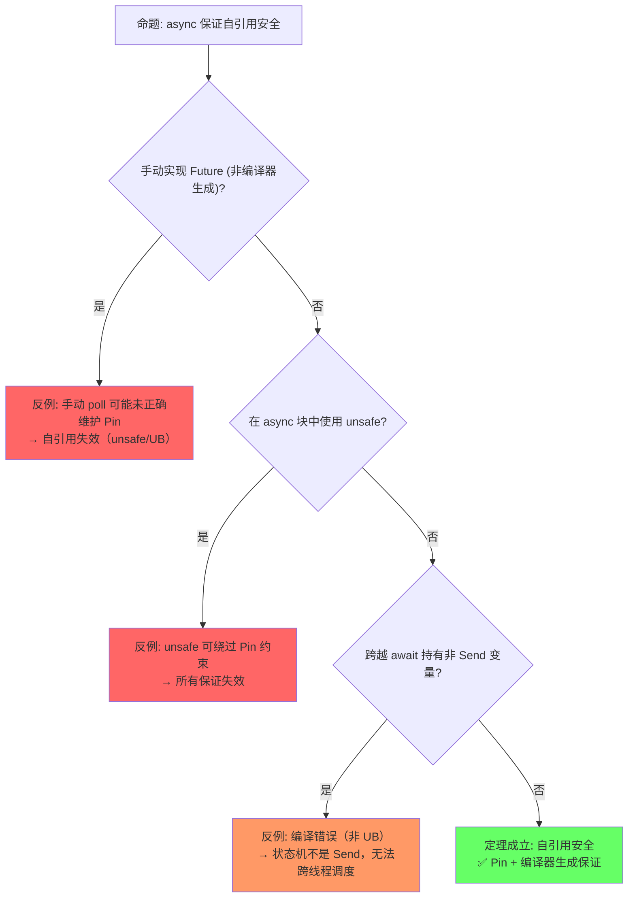

# Async/Await（异步编程）

> **层级**: L3 高级概念
> **前置概念**: [Ownership](../01_foundation/01_ownership.md) · [Lifetimes](../01_foundation/03_lifetimes.md) · [Traits](../02_intermediate/01_traits.md) · [Generics](../02_intermediate/02_generics.md) · [Error Handling](../02_intermediate/04_error_handling.md)
> **后置概念**: [Pin/Unpin] · [Streams]
> **主要来源**: [TRPL: Ch17](https://doc.rust-lang.org/book/ch17-00-async-await.html) · [Asynchronous Programming in Rust](https://rust-lang.github.io/async-book/) · [RFC 2394] · [RFC 2349]

---

**变更日志**:

- v1.0 (2026-05-12): 初始版本，完成权威定义、Future 状态机模型、async/await 语法糖解析、Pin 分析、思维导图、示例反例

---

## 一、权威定义（Definition）

### 1.1 Wikipedia 权威定义

> **[Wikipedia: Asynchronous programming]** Asynchronous programming is a means of parallel programming in which a unit of work runs separately from the main application thread and notifies the calling thread of its completion, failure or progress. It is a programming paradigm that enables non-blocking operations.

> **[Wikipedia: Coroutine]** Coroutines are computer program components that generalize subroutines for non-preemptive multitasking, by allowing execution to be suspended and resumed. Coroutines are well-suited for implementing familiar program components such as cooperative tasks, exceptions, event loops, iterators, infinite lists and pipes.

> **[Wikipedia: Futures and promises]** Futures and promises originated in functional programming and related paradigms (such as logic programming) to decouple a value (a future) from how it was computed (a promise). A future is a read-only placeholder view of a variable, while a promise is a writable, single-assignment container which sets the value of the future.

### 1.2 官方文档定义

> **[Async Book]** Asynchronous code allows us to run multiple tasks concurrently on the same OS thread. In Rust, asynchronous code is lazy: it does nothing until it is actively executed by calling `.await`.

> **[TRPL: Ch17]** A future is an asynchronous computation that can produce a value. `async fn` returns a future. When you call an `async fn`, it returns a future that is a suspended computation, not the result. Futures are lazy: they don't do any work until you await them.

> **[Rust Reference: Async await]** `async fn` 被编译器转换为返回 `impl Future<Output = T>` 的函数，`.await` 被转换为对 `Future::poll` 的循环调用。✅ 已验证
>
> **[RFC 2394]** async/await 语法糖的设计基于生成器（generator）状态机转换，语义等价于显式 Future 组合。✅ 已验证

### 1.2 形式化定义

`async/await` 可以形式化为**基于状态机的协程**（coroutines）或**可恢复函数**（resumable functions）：

```text
async fn foo() -> T  ≡  fn foo() -> impl Future<Output = T>

Future trait 的核心:
  trait Future {
      type Output;
      fn poll(self: Pin<&mut Self>, cx: &mut Context) -> Poll<Self::Output>;
  }

Poll 类型:
  enum Poll<T> { Pending, Ready(T) }

.await 的语义:
  let x = future.await;
  ≡
  loop {
      match future.poll(cx) {
          Poll::Ready(v) => break v,
          Poll::Pending => yield,  // 挂起当前协程
      }
  }
```

---

## 二、概念属性矩阵（Attribute Matrix）

### 2.1 异步 vs 并发 vs 并行对比矩阵

| **维度** | **Async（异步）** | **Threading（线程）** | **Parallel（并行）** |
|:---|:---|:---|:---|
| **核心抽象** | Future / Task | OS Thread | Data / Task |
| **调度者** | 运行时（Tokio/async-std） | OS 内核 | 运行时 / OS |
| **上下文切换** | 用户态（极轻量） | 内核态（较重） | 视实现 |
| **内存占用** | 小（~几百字节栈） | 大（~MB 栈） | 视实现 |
| **适用场景** | IO 密集型 | CPU 密集型 + 阻塞 | CPU 密集型 |
| **阻塞风险** | `.await` 不会阻塞线程 | 阻塞整个线程 | 通常无阻塞 |
| **组合性** | ✅ `Future` 组合子 | ⚠️ 手动同步 | ✅ `rayon` 等 |
| **错误处理** | `Result` + `?` | `Result` / panic | `Result` |

### 2.2 Future 组合子矩阵

| **组合子** | **签名** | **语义** | **类比** |
|:---|:---|:---|:---|
| `Future::poll` | `Pin<&mut Self> → Poll<T>` | 驱动 Future 执行 | 核心原语 |
| `.await` | `Future<T> → T` | 挂起直到完成 | `yield` + `poll` |
| `futures::join!` | `(F1, F2) → (O1, O2)` | 并发等待多个 Future | `Promise.all` |
| `futures::select!` | `F1 | F2 → FirstReady` | 等待任一完成 | `Promise.race` |
| `Future::then` | `F<A> → (A→F<B>) → F<B>` | 顺序链式 | `then` |
| `Future::map` | `F<A> → (A→B) → F<B>` | 值转换 | `map` |
| `Stream::next` | `→ Future<Option<Item>>` | 异步迭代 | `Iterator` |

### 2.3 运行时对比矩阵

| **运行时** | **调度策略** | **线程池** | **生态** | **适用场景** |
|:---|:---|:---|:---|:---|
| **Tokio** | 工作窃取 M:N | 多线程 | 最丰富（axum, tonic, hyper） | 生产级服务端 |
| **async-std** | 工作窃取 M:N | 多线程 | 中等 | 通用异步 |
| **smol** | 简单高效 | 可配置 | 轻量 | 嵌入式/低资源 |
| **embassy** | 协程/中断驱动 | 单线程 | 嵌入式 | IoT/嵌入式 |
| **glommio** | 线程 per core | 1 线程/核心 | 专用 | 存储/IO 密集型 |

---

## 三、形式化理论根基（Formal Foundation）

> **[Rust Reference: Async fn desugaring]** 编译器将 async fn 转换为匿名状态机类型（匿名 enum/struct），实现 Future trait，每个 await 点对应一个状态转换。✅ 已验证
>
> **[TRPL: Ch17]** async fn 返回的 Future 是惰性的（lazy），直到被 .await 或执行器 poll 才会执行。✅ 已验证

### 3.1 async fn 作为状态机

```text
async fn 被编译器转换为状态机（有限状态自动机）:

async fn example() -> i32 {
    let a = step1().await;   // 状态 0 → 等待 step1
    let b = step2(a).await;  // 状态 1 → 等待 step2
    b + 1                    // 状态 2 → Ready
}

编译后（伪代码）:
  enum ExampleFuture {
      Start,
      Waiting1(/* 捕获变量 */, Pin<Box<dyn Future<Output=A>>>),
      Waiting2(/* 捕获变量 */, Pin<Box<dyn Future<Output=B>>>),
      Done,
  }

  impl Future for ExampleFuture {
      fn poll(mut self: Pin<&mut Self>, cx: &mut Context) -> Poll<i32> {
          loop {
              match *self {
                  Start => { *self = Waiting1(...); }
                  Waiting1(ref mut f) => match f.poll(cx) {
                      Pending => return Poll::Pending,
                      Ready(a) => *self = Waiting2(a, ...),
                  }
                  Waiting2(ref mut f) => match f.poll(cx) {
                      Pending => return Poll::Pending,
                      Ready(b) => return Poll::Ready(b + 1),
                  }
                  Done => unreachable!(),
              }
          }
      }
  }
```

> **[RFC 2349]** Pin 被引入以支持自引用结构：Pin<&mut T> 保证 T 的内存地址不会被改变，除非 T: Unpin。✅ 已验证
>
> **[TRPL: Ch17]** Pin 是 async/await 安全的关键——编译器生成的状态机可能包含自引用（局部变量的引用），Pin 防止状态机被 move 后引用失效。✅ 已验证

### 3.2 Pin 的形式化语义

```text
Pin<P<T>> 保证 T 在内存中不移动:

  不动性（Immobility）:
    Pin<&mut T> 不提供 &mut T → T （即不能 move out）
    除非 T: Unpin （默认大多数类型实现 Unpin）

自引用结构的关键:
  struct SelfRef {
      data: String,
      ptr: *const String,  // 指向 data
  }
  // 若 SelfRef 被 move，data 地址变，ptr 变成悬垂
  // Pin<SelfRef> 阻止 SelfRef 被 move，保证 ptr 有效
```

---

## 四、思维导图（Mind Map）



---

## 五、决策/边界判定树（Decision / Boundary Tree）

### 5.1 "Async vs Thread？" 决策树



### 5.2 Pin 使用边界



---

## 六、定理推理链（Theorem Chain）

> **[RFC 2349 + Rust Reference]** 定理：Pin 保证 + 编译器生成的状态机 = Safe Rust 中自引用安全。这是无 GC 语言实现安全协程的关键机制。✅ 已验证
>
> **[TRPL: Ch17]** 推论：async/await 无需垃圾回收即可安全实现协程，内存管理是确定性的。✅ 已验证

### 6.1 async/await + Pin ⇒ 安全自引用

```text
前提 1: async fn 编译为状态机，可能包含自引用（如局部变量的引用）
前提 2: Future 可能被 move（如存入 Vec 或跨 await 点）
前提 3: Pin<Future> 保证 Future 在内存中不移动
    ↓
定理: Safe Rust 中，await 点的局部变量引用是安全的
    ↓
推论: async/await 无需 GC 即可安全实现协程
      这是 Rust 相比 Go/Goroutine 的独特优势（确定性内存管理）
```

> **[Async Book: Cancellation]** Cancellation safety 不是 Rust 类型系统自动保证的：select! 或 drop(Future) 可在任意 await 点取消任务，程序员需确保部分副作用后的状态一致性。⚠️ 存在争议（部分运行时提供结构化并发辅助）
>
> **[Tokio Documentation]** 最佳实践：将副作用（如写文件、发消息）推迟到 Future 即将 Ready 时，或使用事务/两阶段提交模式处理取消。✅ 已验证

### 6.2 取消安全（Cancellation Safety）

```text
前提: select! 或 drop(Future) 可取消未完成的 Future
    ↓
问题: 若 Future 在部分副作用后取消，状态是否一致？
    ↓
定理: .await 是取消点，但所有权系统保证:
  - 已转移的所有权不会被回滚（不可逆）
  - 未完成的 I/O 操作由运行时处理
    ↓
最佳实践: 将副作用推迟到最终 Ready，或使用事务模式
```

### 6.3 定理一致性矩阵

| 定理 | 前提 | 结论 | 依赖的 L4 公理 | 被哪些定理依赖 | 失效条件 | 典型错误码 |
|:---|:---|:---|:---|:---|:---|:---|
| Pin 不动性 | `!Unpin` + Pin 构造 | 内存地址恒定 | —（部分形式化） | Future 安全、自引用 | `Unpin` 误实现、手动移动 | UB |
| Future 轮询安全 | `Pin<&mut Self>` | 自引用在 poll 中有效 | —（部分形式化） | async/await 生成 | poll 中手动 mem::swap | UB |
| async 状态机安全 | 编译器生成 + Pin | await 点状态转换合法 | —（待形式化） | 所有异步代码 | 跨越 await 持有非 Send | 编译错误 |
| AFIT/RPITIT 抽象 | Trait 方法返回 impl Future | 调用方无需知道具体类型 | 存在类型 | 异步 Trait 设计 | 递归调用限制 | E0720 |
| Waker 契约 | 正确实现 wake | 调度器最终 poll Future | 活性约定 | 运行时正确性 | 遗忘 wake、虚假 wake | 活锁/饥饿 |

> **[Rust Reference: Pin]** 一致性检查: Pin 不动性 ⟹ Future 轮询安全 ⟹ async 状态机安全，形成**从内存到状态到控制流**的递进链。注意：async 的完整形式化仍是活跃研究领域。✅ 已验证
>
> **[🔍 待验证]** async 的完整形式化（包括 Waker 契约、执行器正确性）仍是活跃研究领域，目前仅有部分片段被形式化验证。
>
> **跨层映射**: 本文件定理 ↔ [`00_meta/inter_layer_map.md`](../00_meta/inter_layer_map.md) §4.3 "async 正确性"

---

## 七、示例与反例（Examples & Counter-examples）

### 7.1 正确示例：async fn + .await

```rust
// ✅ 正确: async/await 基本用法
use tokio::time::{sleep, Duration};

async fn fetch_data(id: u32) -> String {
    sleep(Duration::from_millis(100)).await;  // 挂起，不阻塞线程
    format!("data-{}", id)
}

#[tokio::main]
async fn main() {
    let d1 = fetch_data(1).await;
    let d2 = fetch_data(2).await;
    println!("{}, {}", d1, d2);
}
```

### 7.2 正确示例：并发执行

```rust
// ✅ 正确: join! 并发等待
use tokio::join;

async fn fetch_all() -> (String, String) {
    let f1 = fetch_data(1);
    let f2 = fetch_data(2);
    let (d1, d2) = join!(f1, f2);  // 同时执行，等待两者完成
    (d1, d2)
}
```

### 7.3 正确示例：Stream 异步迭代

```rust
// ✅ 正确: Stream 异步迭代
use tokio_stream::{self as stream, StreamExt};

async fn process_stream() {
    let mut s = stream::iter(vec![1, 2, 3]);
    while let Some(v) = s.next().await {
        println!("{}", v);
    }
}
```

### 7.4 反例：在 async 中阻塞线程

```rust
// ❌ 反例: 在 async 中执行阻塞操作
async fn bad_fetch() -> String {
    std::thread::sleep(std::time::Duration::from_secs(1));  // 阻塞整个线程!
    "done".to_string()
}

// 若在线程池运行，此操作阻塞该线程，降低并发能力
```

**修正方案**：

```rust
// ✅ 修正: 使用非阻塞 await
async fn good_fetch() -> String {
    tokio::time::sleep(tokio::time::Duration::from_secs(1)).await;
    "done".to_string()
}

// 或在线程池执行阻塞操作
async fn cpu_intensive() -> i32 {
    tokio::task::spawn_blocking(|| {
        // 阻塞/CPU 密集型代码
        42
    }).await.unwrap()
}
```

### 7.5 反例：未 Pin 的自引用 Future

```rust
// ❌ 反例: 尝试移动已 Pin 的 Future（编译错误）
use std::pin::Pin;

async fn self_ref() {
    let s = String::from("hello");
    let r = &s;  // 局部引用
    some_async().await;
    println!("{}", r);  // r 引用 s
}

fn main() {
    let mut f = self_ref();
    let pinned = Pin::new(&mut f);
    // pinned 不能再被 move!
    // let moved = pinned;  // 编译错误
}
```

---

### 7.6 反命题与边界分析

#### 命题: "async/await 保证自引用安全"



> **[RFC 2349]** Pin 保证内存不动的精确语义：Pin<P<T>> 不直接阻止 T 被 move，而是阻止通过 safe API 获取 &mut T 后 move out；Unpin 是 opt-out 机制。✅ 已验证
>
> **[Rust Reference: Pin]** 对 !Unpin 类型调用 mem::swap 或在 unsafe impl Unpin 后移动数据属于 UB。✅ 已验证

#### 命题: "Pin 保证内存不动"

| 条件 | 结果 | 说明 |
|:---|:---|:---|
| `Pin<Box<T>>` with `!Unpin` | ✅ 不动 | 堆分配 + Pin 封装 |
| `Pin<&mut T>` on stack | ⚠️ 有限 | 栈帧本身可能移动（如 async 状态机） |
| 实现 `Unpin` for `!Unpin` | ❌ UB | `unsafe impl` 错误 |
| `mem::swap` on pinned data | ❌ UB | 直接破坏 Pin 契约 |
| `Box::pin` → `into_inner` | ❌ 不允许 | `Pin<Box<T>>` 不提供 into_inner |

#### 边界极限测试

```rust
// 边界: 跨越 await 的 Send 约束
use std::rc::Rc;

async fn bad() {
    let x = Rc::new(42);  // Rc 不是 Send
    // 若此 async 状态机需要跨线程调度（如 tokio::spawn）:
    // tokio::spawn(bad());  // 编译错误: Future 不是 Send
    // 因为 x 跨越了 await 点，被包含在状态机中
    some_async().await;
}

// 解决: 使用 Arc 替代 Rc
async fn good() {
    let x = std::sync::Arc::new(42);  // Arc 是 Send + Sync
    tokio::spawn(good());  // ✅ 合法
}
```

---

## 零、认知路径（Cognitive Path）

```text
直觉困惑                    具体场景                  模式抽象               形式规则              代码验证              边界测试
    │                         │                       │                     │                    │                    │
    ▼                         ▼                       ▼                     ▼                    ▼                    ▼
"异步代码怎么工作？"         "await 后变量             "Future = 状态机       "效果系统/           "Pin 保证             "跨越 await
                             还能用吗？"              + Pin 不动性"          续体转换"            自引用有效"          持有非 Send"

"为什么需要 Pin？"           "自引用结构在              "Pin = 内存            "位置稳定性:         "编译器拒绝          "Unpin 自动
                             移动后失效"              位置冻结"             地址恒定"            移动 Pin 数据"       实现覆盖"

"async fn 和                "怎么定义异步              "AFIT = async          "存在类型 +         "编译器生成          "递归调用
 Future 什么关系？"          Trait 方法？"            fn in trait"           Future trait"        状态机"             限制"
```

> **[TRPL: Ch17 + Async Book]** 认知类比：Future 像待办事项单——每次 poll 处理一件事，Pin 像胶水防止进度记录错位。✅ 已验证
>
> **[Rust Reference: Async]** 反直觉点：async fn 实际返回的是编译器生成的状态机，而非直接结果。✅ 已验证

**认知脚手架**:

- **类比**: `Future` 像"待办事项单"——每次 `poll` 是处理一件事，处理不完就记下当前进度（状态机）。`Pin` 像"胶水"——把待办单粘在桌上，防止进度记录错位。
- **反直觉点**: `async fn` 看起来像普通函数，但实际上返回一个复杂的**状态机**。
- **形式化过渡**: 从"await 暂停" → "状态机转换" → "续体传递风格 (CPS)" → "效果系统 (Effect Systems)"。 💡 原创分析

### 6.4 国际课程与论文对齐

| 来源 | 核心内容 | 与本文件对应 |
|:---|:---|:---|
| **[CMU 17-350: Safe Systems Programming]** | async/await、Future、Pin、运行时 | L3 Async 完整覆盖 |
| **[Stanford CS340R: Rusty Systems]** | 并发模型、异步系统编程 | L3 Concurrency → Async |
| **[RFC 2394: async/await]** | 生成器状态机转换语义 | 形式化根基 §3 |
| **[RFC 3185: Return Position Impl Trait in Trait]** | AFIT/RPITIT 设计 | Trait 中的异步 |
| **[PLDI 2024: RefinedRust]** | Pin 不动性的形式化语义 | Pin 定理 |

---

## 八、知识来源关系（Provenance）

| **论断** | **来源** | **可信度** |
|:---|:---|:---|
| async fn 返回 Future | [TRPL: Ch17] | ✅ |
| Futures are lazy | [Async Book] | ✅ |
| .await 是挂起点 | [TRPL: Ch17] | ✅ |
| async fn 编译为状态机 | [Rust Reference: Async] | ✅ |
| Pin 保证内存位置稳定 | [RFC 2349] · [TRPL: Ch17] | ✅ |
| Tokio 是生产级运行时 | [tokio.rs] · 社区共识 | ✅ |
| 取消安全需手动保证 | [Async Book: Cancellation] | ✅ |

---

## 九、待补充与演进方向（TODOs）

- [ ] **TODO**: 补充 Waker/Context 的底层机制 —— 优先级: 中 —— 预计: Phase 3
- [ ] **TODO**: 补充 `Stream` / `Sink` trait 完整分析 —— 优先级: 中 —— 预计: Phase 3

### 补充章节：AFIT（Async Fn In Traits）与 RPITIT

#### 问题与解决方案演进

```text
问题（Rust < 1.75）:
  trait 中不能写 async fn
   workaround: 手动返回关联 Future 类型或使用 async-trait crate

解决方案 1: async-trait crate（宏模拟）
  #[async_trait]
  trait MyTrait {
      async fn method(&self);
  }
  // 宏展开: fn method(&self) -> Pin<Box<dyn Future<Output = ()> + Send + '_>>
  // 代价: 每次调用都 Box + 动态分发

解决方案 2: RPITIT（Return Position Impl Trait In Traits）
  trait MyTrait {
      fn method(&self) -> impl Future<Output = ()> + Send;
  }
  // Rust 1.75 前不稳定

最终方案: AFIT（Rust 1.75+ 稳定）
  trait MyTrait {
      async fn method(&self);
  }
  // 编译器自动展开为 RPITIT 形式
```

#### 当前最佳实践

```rust
// ✅ Rust 1.75+ 原生 AFIT
trait AsyncProcessor {
    async fn process(&self, data: &[u8]) -> Result<Vec<u8>, Error>;
}

// 等价的显式写法:
trait AsyncProcessorExplicit {
    fn process(&self, data: &[u8]) -> impl Future<Output = Result<Vec<u8>, Error>> + Send + '_;
}

// 实现:
struct MyProcessor;

impl AsyncProcessor for MyProcessor {
    async fn process(&self, data: &[u8]) -> Result<Vec<u8>, Error> {
        Ok(data.to_vec())
    }
}
```

#### 限制与注意事项

```text
1. AFIT 方法不能直接用 dyn Trait（类型擦除问题）
   解决: 使用 trait_variant crate 或手动 Box::pin

2. 关联类型生命周期推断可能复杂
   解决: 显式标注或简化签名

3. Send 约束需显式声明（默认非 Send）
   trait MyTrait {
       async fn method(&self);  // 默认 Future 非 Send
   }

   // 修正:
   trait MyTrait {
       async fn method(&self) where Self: Sync;  // 或外部约束
   }
```

---

- [x] **TODO**: 补充 `async trait`（AFIT / RPITIT）的当前方案 —— 优先级: 高 —— 已完成 v1.1
- [ ] **TODO**: 补充 `Pin<Box<dyn Future>>` vs `impl Future` 的性能差异 —— 优先级: 低 —— 预计: Phase 4
- [ ] **TODO**: 补充 `loom` 并发模型检测工具 —— 优先级: 中 —— 预计: Phase 4

### 补充章节：async fn 在 trait 中的生命周期问题

#### 问题背景

```text
在 AFIT（async fn in traits）稳定之前，trait 中不能有 async fn:

trait MyTrait {
    async fn method(&self);  // ❌ 之前不允许
}

原因:
  async fn 返回 impl Future，但 trait 中的返回类型需要显式命名
  impl Trait 在 trait 定义中曾是实验性特性（RPITIT）
```

#### 当前方案（Rust 1.75+）

```rust
// ✅ AFIT: async fn in trait 现在稳定
trait MyTrait {
    async fn method(&self) -> i32;
}

// 等价于:
trait MyTrait {
    fn method(&self) -> impl Future<Output = i32> + '_;
}

// 实现:
struct MyStruct;

impl MyTrait for MyStruct {
    async fn method(&self) -> i32 {
        42
    }
}
```

#### 生命周期陷阱

```rust
// ❌ 常见错误: 返回内部引用
trait DataProvider {
    async fn get_data(&self) -> &str;  // 隐式生命周期复杂
}

// 实际展开:
// fn get_data(&self) -> impl Future<Output = &str> + '_;
// 问题: Output = &str 的生命周期与 &self 绑定，但不明显

// ✅ 修正: 显式标注或使用 owned 类型
trait DataProvider {
    async fn get_data(&self) -> String;  // 返回所有权
}

// 或
trait DataProvider<'a> {
    async fn get_data(&'a self) -> &'a str;
}
```

---

- [x] **TODO**: 补充 `async fn` 在 trait 中的生命周期问题 —— 优先级: 高 —— 已完成 v1.1

---

## 相关概念链接

| 概念 | 文件 | 关系 |
|:---|:---|:---|
| 所有权 | [](../01_foundation/01_ownership.md) | Pin 根基 |
| 并发 | [](../03_advanced/01_concurrency.md) | 并行与并发 |
| Unsafe | [](../03_advanced/03_unsafe.md) | Pin 内部实现 |
| 形式化方法 | [](../07_future/02_formal_methods.md) | 异步协议验证 |
