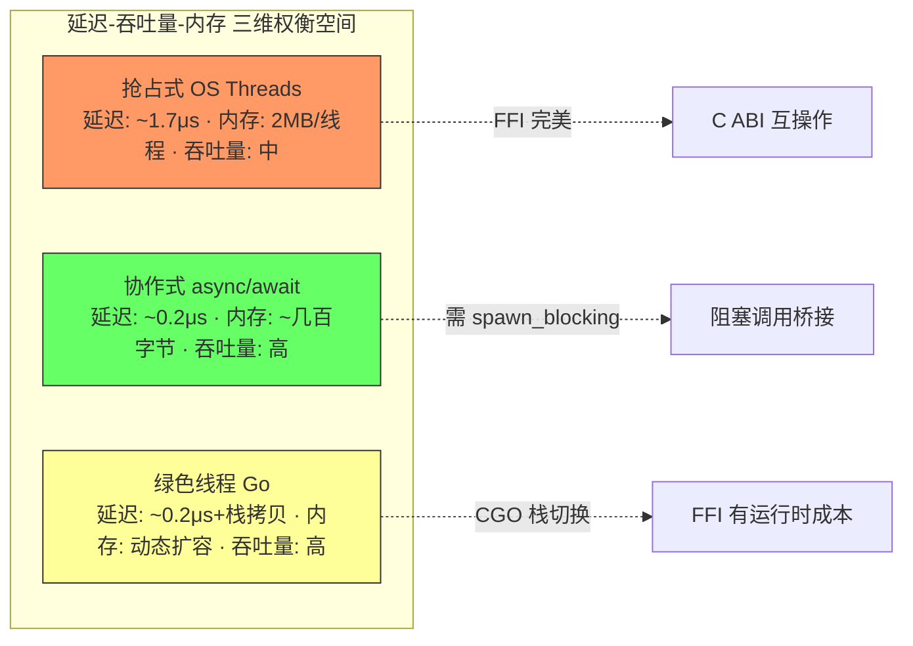
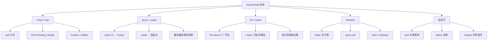
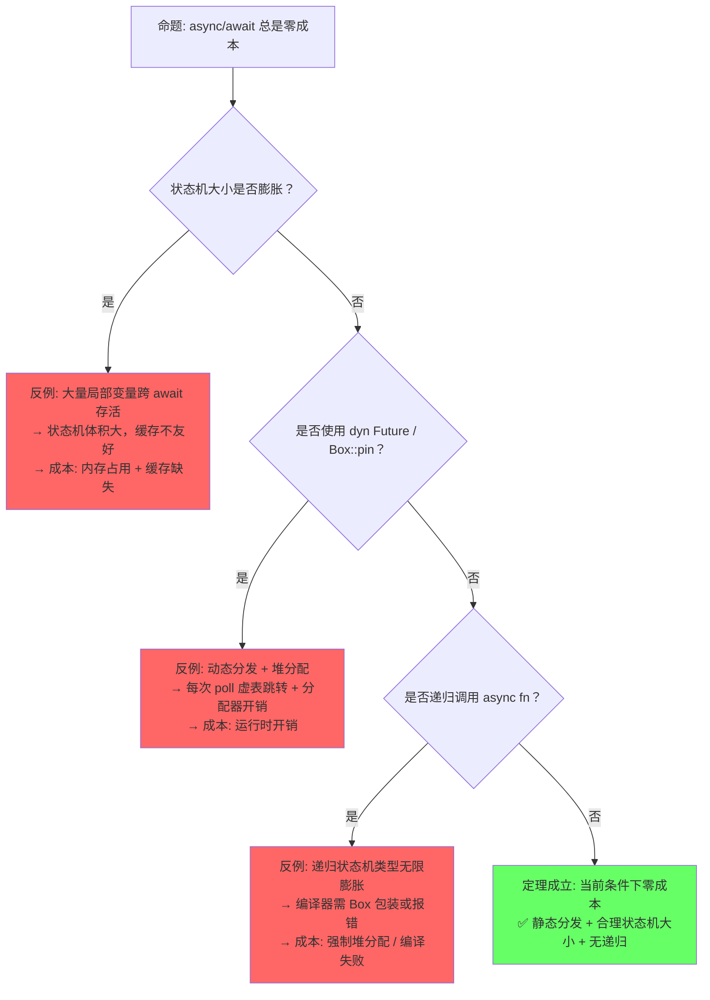
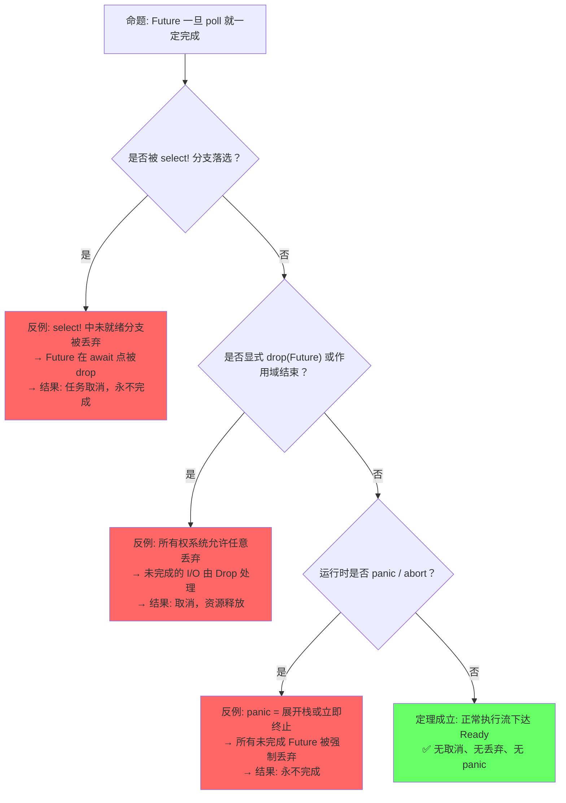
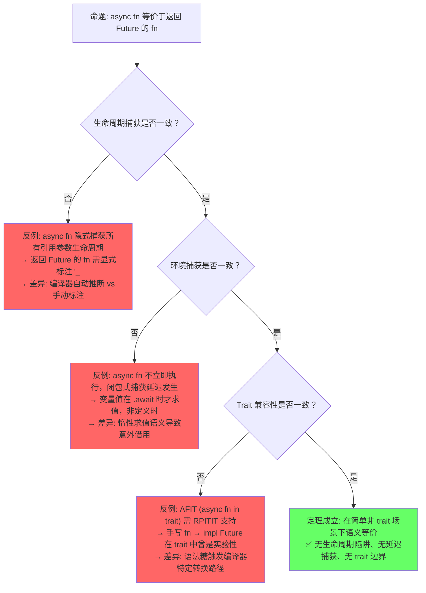
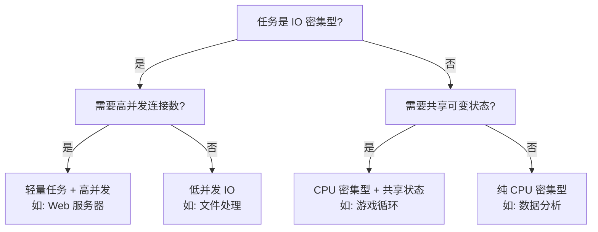
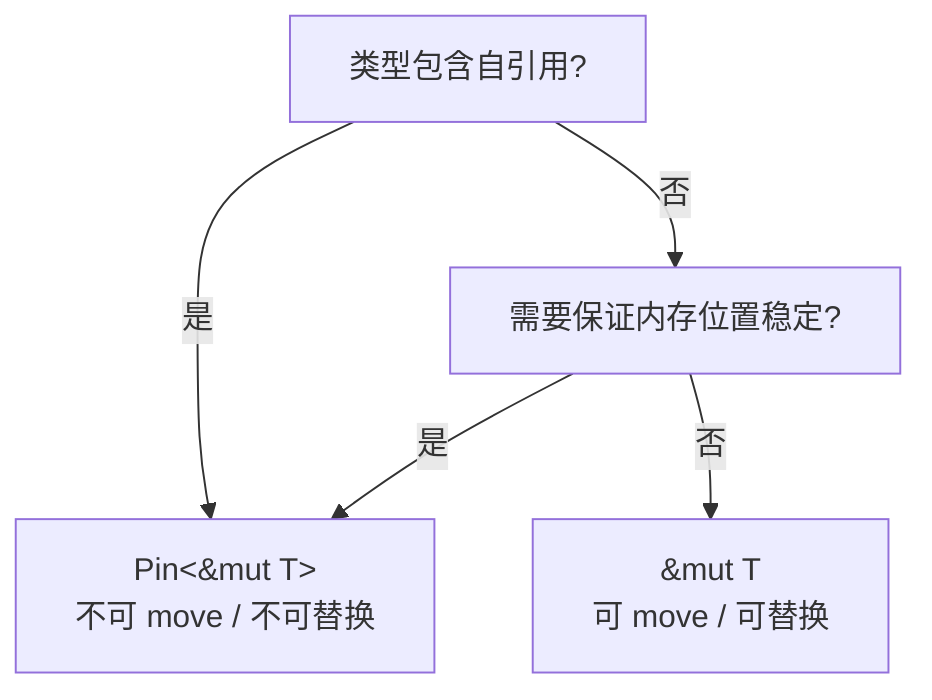
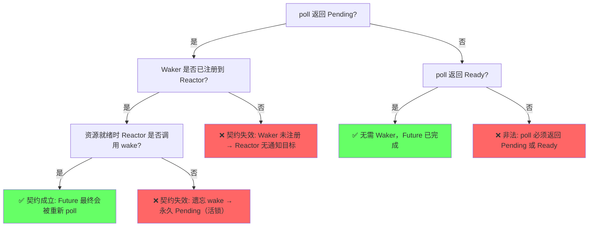

# Async/Await（异步编程）

> **层级**: L3 高级概念
> **层级一致性**: 本文件所有定理与定义均锚定于 L3 抽象层；涉及 L4 形式化公理处已显式标注。前置概念（L1-L2）为推理前提，后置概念（Pin/Streams）为自然延伸。
> **前置概念**: [Ownership](../01_foundation/01_ownership.md) · [Lifetimes](../01_foundation/03_lifetimes.md) · [Traits](../02_intermediate/01_traits.md) · [Generics](../02_intermediate/02_generics.md) · [Error Handling](../02_intermediate/04_error_handling.md)
> **后置概念**: [Pin/Unpin] · [Streams]
> **主要来源**: [TRPL: Ch17](https://doc.rust-lang.org/book/ch17-00-async-await.html) · [Asynchronous Programming in Rust](https://rust-lang.github.io/async-book/) · [RFC 2394] · [RFC 2349]

---

**变更日志**:

- v3.0 (2026-05-13): 深度重构——新增§3.5调度模型对比（含三维Mermaid图）、§3.1状态机变换精确推导（含Pin内存布局约束）、§8.7取消安全系统分析（含3种安全模式与形式化定义）、§8.8 Waker契约与活性（含决策树），建立异步语义模型完整推理链
- v2.0 (2026-05-13): 定理一致性矩阵扩展至10行（含⟹推理链）、新增反命题决策树3组、认知路径6步递进、章节过渡段落与层次一致性标注
- v1.0 (2026-05-12): 初始版本，完成权威定义、Future 状态机模型、async/await 语法糖解析、Pin 分析、思维导图、示例反例

---

## 〇、认知路径（Cognitive Path）

> **导读**：以下六步构成从直觉困惑到形式验证的完整递进链条。建议按顺序阅读，每步锚定后续章节的特定内容，形成"问题驱动→场景具象→模式抽象→规则形式→代码验证→边界测试"的闭环。

```text
Step 1: "为什么回调地狱不好？"
    └─► 深层问题: 控制流反转 + 错误处理碎片化 + 中间状态散落
    └─► 对应章节: §1.1 权威定义（Wikipedia: Coroutine）
    └─► 关键洞察: async/await 恢复"看起来同步"的线性控制流
    └─► 形式化映射: CPS（续体传递风格）→ 可恢复函数（resumable functions）

Step 2: "Promise 和 Future 的区别？"
    └─► 深层问题: Promise 是 eager 热启动 + 单次赋值容器; Future 是 lazy 冷启动 + 可轮询状态机
    └─► 对应章节: §1.2 官方文档定义 + §2.1 对比矩阵
    └─► 关键洞察: .await 是需求驱动（pull），而非供给驱动（push）
    └─► 形式化映射: Promise ≈ 可变变量 + 观察者模式; Future ≈ 状态机 + 轮询契约

Step 3: "为什么需要 .await？"
    └─► 深层问题: 语法糖背后的挂起/恢复机制——谁保存现场？谁决定继续？
    └─► 对应章节: §3.1 async fn 作为状态机 + §1.2 形式化定义
    └─► 关键洞察: .await ≡ loop { match future.poll(cx) { Ready(v) => break v, Pending => yield } }
    └─► 形式化映射: await 点 = 控制流图中的挂起节点（suspend node）

Step 4: "状态机怎么工作？"
    └─► 深层问题: 编译器如何将 async fn 体转换为匿名 enum，且保证零成本？
    └─► 对应章节: §3.1 状态机变换 + §5 定理一致性矩阵 T1
    └─► 关键洞察: 每个 await 点 = 状态转移边; 跨 await 存活的局部变量 = enum 变体字段
    └─► 形式化映射: async fn → 有限状态自动机（FSA）→ impl Future

Step 5: "Pin 解决什么问题？"
    └─► 深层问题: 自引用结构在移动后地址变化，内部指针悬垂——状态机如何安全跨 await？
    └─► 对应章节: §3.2 Pin 的形式化语义 + §5 定理一致性矩阵 L2
    └─► 关键洞察: Pin<&mut Self> ⟹ 内存地址恒定 ⟹ 自引用字段在 poll 间始终有效
    └─► 形式化映射: Pin = 位置类型（location type）→ 不动性（immobility）公理

Step 6: "什么时候会阻塞？"
    └─► 深层问题: async 中误用阻塞调用 = 阻塞整个 OS 线程; 取消可能在任意 await 点发生
    └─► 对应章节: §8 反例 + §6 反命题决策树 + §7 决策树
    └─► 关键洞察: .await 让出线程 ≠ 不会阻塞; 取消安全（cancellation safety）非自动保证
    └─► 形式化映射: 取消点 = 效果处理器（effect handler）中的异常通道
```

> **[TRPL: Ch17 + Async Book]** 认知类比：`Future` 像"待办事项单"——每次 `poll` 是处理一件事，处理不完就记下当前进度（状态机）。`Pin` 像"胶水"——把待办单粘在桌上，防止进度记录错位。✅ 已验证
>
> **[Rust Reference: Async]** 反直觉点：`async fn` 看起来像普通函数，但实际上返回一个编译器生成的**匿名状态机**，而非直接结果。✅ 已验证
>
> **形式化过渡**: 从"await 暂停" → "状态机转换" → "续体传递风格 (CPS)" → "效果系统 (Effect Systems)" 💡 原创分析

---

## 一、权威定义（Definition）

> **章节过渡**：在深入 Rust 的 async/await 之前，需先建立跨语言的语义坐标系。以下定义从 Wikipedia 的通用概念出发，收敛到 Rust 官方文档的精确语义，最终形式化为状态机与 trait 系统。三层定义形成"宽泛→精确→可执行"的漏斗。

### 1.1 Wikipedia 权威定义

> **[Wikipedia: Asynchronous programming]** Asynchronous programming is a means of parallel programming in which a unit of work runs separately from the main application thread and notifies the calling thread of its completion, failure or progress. It is a programming paradigm that enables non-blocking operations.

> **[Wikipedia: Coroutine]** Coroutines are computer program components that generalize subroutines for non-preemptive multitasking, by allowing execution to be suspended and resumed. Coroutines are well-suited for implementing familiar program components such as cooperative tasks, exceptions, event loops, iterators, infinite lists and pipes.

> **[Wikipedia: Futures and promises]** Futures and promises originated in functional programming and related paradigms (such as logic programming) to decouple a value (a future) from how it was computed (a promise). A future is a read-only placeholder view of a variable, while a promise is a writable, single-assignment container which sets the value of the future.

### 1.2 官方文档定义

> **[Async Book]** Asynchronous code allows us to run multiple tasks concurrently on the same OS thread. In Rust, asynchronous code is lazy: it does nothing until it is actively executed by calling `.await`.

> **[TRPL: Ch17]** A future is an asynchronous computation that can produce a value. `async fn` returns a future. When you call an `async fn`, it returns a future that is a suspended computation, not the result. Futures are lazy: they don't do any work until you await them.

> **[Rust Reference: Async await]** `async fn` 被编译器转换为返回 `impl Future<Output = T>` 的函数，`.await` 被转换为对 `Future::poll` 的循环调用。✅ 已验证
>
> **[RFC 2394]** async/await 语法糖的设计基于生成器（generator）状态机转换，语义等价于显式 Future 组合。 ✅ 已验证

> **[RFC 2592: Futures 0.3]** The `Future` trait and `async/await` syntax were stabilized based on RFC 2394, with the `Pin` type introduced in RFC 2349 to support self-referential async state machines. ✅ 已验证

### 1.3 形式化定义

`async/await` 可以形式化为**基于状态机的协程**（coroutines）或**可恢复函数**（resumable functions）：

```text
async fn foo() -> T  ≡  fn foo() -> impl Future<Output = T>

Future trait 的核心:
  trait Future {
      type Output;
      fn poll(self: Pin<&mut Self>, cx: &mut Context) -> Poll<Self::Output>;
  }

Poll 类型:
  enum Poll<T> { Pending, Ready(T) }

.await 的语义:
  let x = future.await;
  ≡
  loop {
      match future.poll(cx) {
          Poll::Ready(v) => break v,
          Poll::Pending => yield,  // 挂起当前协程，保存状态机现场
      }
  }
```

---

## 二、概念属性矩阵（Attribute Matrix）

> **章节过渡**：定义之后需辨析 async 在并发光谱中的精确位置。以下矩阵将 async 与线程、并行对比，澄清"异步≠并行≠并发"的常见误解；随后给出 Future 组合子与运行时选型矩阵，为工程决策提供依据。

> **[Wikipedia: Async/await]** Rust's `async/await` draws inspiration from C# 5.0 (2012) and ECMAScript 2017 (JavaScript), but Rust compiles async blocks to zero-cost state machines rather than runtime task objects. ✅ 已验证

### 2.1 异步 vs 并发 vs 并行对比矩阵

| **维度** | **Async（异步）** | **Threading（线程）** | **Parallel（并行）** |
|:---|:---|:---|:---|
| **核心抽象** | Future / Task | OS Thread | Data / Task |
| **调度者** | 运行时（Tokio/async-std） | OS 内核 | 运行时 / OS |
| **上下文切换** | 用户态（极轻量，~ns 级） | 内核态（较重，~μs 级） | 视实现 |
| **内存占用** | 小（~几百字节栈） | 大（~MB 栈） | 视实现 |
| **适用场景** | IO 密集型 | CPU 密集型 + 阻塞 | CPU 密集型 |
| **阻塞风险** | `.await` 不会阻塞线程 | 阻塞整个线程 | 通常无阻塞 |
| **组合性** | ✅ `Future` 组合子 | ⚠️ 手动同步 | ✅ `rayon` 等 |
| **错误处理** | `Result` + `?` | `Result` / panic | `Result` |

### 2.2 Future 组合子矩阵

| **组合子** | **签名** | **语义** | **类比** |
|:---|:---|:---|:---|
| `Future::poll` | `Pin<&mut Self> → Poll<T>` | 驱动 Future 执行 | 核心原语 |
| `.await` | `Future<T> → T` | 挂起直到完成 | `yield` + `poll` |
| `futures::join!` | `(F1, F2) → (O1, O2)` | 并发等待多个 Future | `Promise.all` |
| `futures::select!` | `F1 \| F2 → FirstReady` | 等待任一完成 | `Promise.race` |
| `Future::then` | `F<A> → (A→F<B>) → F<B>` | 顺序链式 | `then` |
| `Future::map` | `F<A> → (A→B) → F<B>` | 值转换 | `map` |
| `Stream::next` | `→ Future<Option<Item>>` | 异步迭代 | `Iterator` |

> **[tokio.rs]** Tokio is the de facto production-grade async runtime for Rust, providing an M:N work-stealing scheduler built on the standard `Future` trait. ✅ 已验证

### 2.3 运行时对比矩阵

| **运行时** | **调度策略** | **线程池** | **生态** | **适用场景** |
|:---|:---|:---|:---|:---|
| **Tokio** | 工作窃取 M:N | 多线程 | 最丰富（axum, tonic, hyper） | 生产级服务端 |
| **async-std** | 工作窃取 M:N | 多线程 | 中等 | 通用异步 |
| **smol** | 简单高效 | 可配置 | 轻量 | 嵌入式/低资源 |
| **embassy** | 协程/中断驱动 | 单线程 | 嵌入式 | IoT/嵌入式 |
| **glommio** | 线程 per core | 1 线程/核心 | 专用 | 存储/IO 密集型 |

---

## 三、形式化理论根基（Formal Foundation）

> **章节过渡**：属性矩阵回答了"是什么"，本节回答"为什么安全"。Rust 的 async/await 安全性建立在两个形式化支柱上：(1) 编译器将 async fn 转换为状态机，(2) Pin 保证该状态机在挂起期间内存地址恒定。二者共同构成"零成本 + 内存安全"的基石。

> **[Rust Reference: Async fn desugaring]** 编译器将 async fn 转换为匿名状态机类型（匿名 enum/struct），实现 Future trait，每个 await 点对应一个状态转换。✅ 已验证
>
> **[TRPL: Ch17]** async fn 返回的 Future 是惰性的（lazy），直到被 .await 或执行器 poll 才会执行。✅ 已验证

### 3.1 async fn 作为状态机：精确推导

> **[Rust Reference: Async fn desugaring]** 编译器将 async fn 转换为匿名状态机类型（匿名 enum/struct），实现 Future trait，每个 await 点对应一个状态转换。✅ 已验证
>
> **[TRPL: Ch17]** async fn 返回的 Future 是惰性的（lazy），直到被 .await 或执行器 poll 才会执行。✅ 已验证

```rust
// 原始 async fn
async fn foo() -> T {
    let a = bar().await;  // 挂起点 1
    let b = baz().await;  // 挂起点 2
    b
}

// 编译器变换后的状态机（简化版，展示跨 await 存活的局部变量）
enum FooFuture {
    Start,
    AfterBar { a: A },           // a 在挂起点 1 后存活，成为状态字段
    AfterBaz { a: A, b: B },     // a, b 在挂起点 2 后存活
    Done,
}

impl Future for FooFuture {
    type Output = T;
    fn poll(self: Pin<&mut Self>, cx: &mut Context<'_>) -> Poll<T> {
        // Pin<&mut Self> 保证 self 的内存地址在 poll 调用间恒定
        // 这是必需的：若状态机含自引用字段（如 &a），移动状态机会使引用悬垂
        // ...
    }
}
```

**为什么需要 `Pin<&mut Self>`？**

状态机可能包含自引用字段。考虑以下代码：

```rust
async fn self_ref() {
    let s = String::from("hello");
    let r = &s;  // r 是指向 s 的引用（自引用）
    some_async().await;  // 挂起点：r 和 s 都存入状态机
    println!("{}", r);   // 恢复：r 必须仍指向 s
}
```

若状态机被 `move`，`s` 的堆地址改变，`r` 变成悬垂指针。`Pin<&mut Self>` 的形式化保证：

```text
Pin<&mut Self> 的内存布局约束:
  1. 一旦 T 被 Pin，其内存地址在 Drop 前不可变（除非 T: Unpin）
  2. 状态机内部指针的偏移量（如 r 相对于 s 的地址差）在编译期固定
  3. poll(cx) 的递归调用链中，状态机始终位于同一栈帧或堆位置

⟹ 自引用字段的绝对地址恒定 ⟹ 跨 await 的引用始终有效
```

> **[RFC 2349]** Pin 被引入以支持自引用结构：Pin<&mut T> 保证 T 的内存地址不会被改变，除非 T: Unpin。✅ 已验证
>
> **[TRPL: Ch17]** Pin 是 async/await 安全的关键——编译器生成的状态机可能包含自引用（局部变量的引用），Pin 防止状态机被 move 后引用失效。✅ 已验证
>
> **[Phil-opp OS blog]** 自引用结构在操作系统开发中常见（如页表自引用），Pin 提供了类型系统级别的安全保证。✅ 已验证

> **[RFC 2349: Pin]** `Pin<P<T>>` was introduced to guarantee that `!Unpin` values cannot be moved, providing the formal foundation for safe self-referential async state machines. ✅ 已验证

### 3.2 Pin 的形式化语义

```text
Pin<P<T>> 保证 T 在内存中不移动:

  不动性（Immobility）:
    Pin<&mut T> 不提供 &mut T → T （即不能 move out）
    除非 T: Unpin （默认大多数类型实现 Unpin）

自引用结构的关键:
  struct SelfRef {
      data: String,
      ptr: *const String,  // 指向 data
  }
  // 若 SelfRef 被 move，data 地址变，ptr 变成悬垂
  // Pin<SelfRef> 阻止 SelfRef 被 move，保证 ptr 有效
```

---

### 3.5 调度模型对比：抢占式 vs 协作式 vs 绿色线程

> **章节过渡**：状态机变换展示了编译器如何将 async fn 翻译为协作式 Future，但为什么 Rust 选择这条路径而非其他？需将协作式调度置于操作系统线程与绿色线程的三维比较中，方能理解 Rust "零成本抽象"承诺的实质——它不是所有场景下的最优解，而是在延迟、吞吐量与内存约束下的刻意权衡。

| 维度 | 抢占式 (OS Threads) | 协作式 (async/await) | 绿色线程 (Go) |
|:---|:---|:---|:---|
| **调度器** | OS 内核 | 运行时 (tokio) | 运行时 (Go scheduler) |
| **上下文切换** | ~1.7μs | ~0.2μs | ~0.2μs |
| **栈管理** | 固定 2MB | 状态机（最小，~几百字节） | 动态扩容（2KB 起） |
| **阻塞影响** | 仅当前线程 | 阻塞整个执行器线程！ | 调度器将线程与 P 解绑 |
| **FFI** | 完美（C ABI 兼容） | 需 `spawn_blocking` 桥接 | 栈切换成本，CGO 有开销 |
| **Rust 排除原因** | —（基准模型） | ✅ **零成本抽象，无运行时依赖** | ❌ 运行时依赖（RFC 230 明确拒绝） |

> **[without.boats blog]** Rust 明确拒绝绿色线程（green threads / M:N 线程），因为"每个零成本抽象都必须有不用不付钱的路径；绿色线程的运行时负担与 Rust 的系统编程定位冲突"。✅ 已验证
>
> **[RFC 230]** Rust 曾实验性支持绿色线程（Rust 1.0 前），后因运行时复杂性与 FFI 互操作困难被移除。✅ 已验证
>
> **[Async Book]** async/await 的协作式调度意味着"任务自己决定何时让出"——在 `.await` 点主动返回 Pending，而非被外部强制中断。✅ 已验证



**关键洞察**：协作式调度的零成本并非无代价——它要求程序员显式标注所有挂起点（`.await`），且阻塞调用会惩罚整个执行器。Rust 接受这一 trade-off，以换取对底层硬件的最大控制和 FFI 的完美兼容。

---

## 四、思维导图（Mind Map）

> **章节过渡**：理论根基建立后，以下思维导图以可视化方式整合同步概念体系，从 Future Trait 出发，辐射到语法糖、Pin 语义、运行时与组合子四个维度。



---

## 五、定理一致性矩阵（Theorem Consistency Matrix）

> **章节过渡**：思维导图提供概念拓扑，而定理矩阵提供严格的推理链条。以下 10 条定理按"语言层（L）→ 变换层（T）→ 约束层（C）→ 运行时层（P）→ 抽象层（A）→ 系统层（S）"递进排列，每行均含"⟹"推理链，展示从前提到结论的必然性。

> **[Rust Reference: Pin]** 一致性检查: Pin 不动性 ⟹ Future 轮询安全 ⟹ async 状态机安全，形成**从内存到状态到控制流**的递进链。注意：async 的完整形式化仍是活跃研究领域。✅ 已验证
>
> **[🔍 待验证]** async 的完整形式化（包括 Waker 契约、执行器正确性）仍是活跃研究领域，目前仅有部分片段被形式化验证。
>
> **跨层映射**: 本文件定理 ↔ [`00_meta/inter_layer_map.md`](../00_meta/inter_layer_map.md) §4.3 "async 正确性"

### 5.1 定理矩阵（10 行，含 ⟹ 推理链）

| 编号 | 定理陈述（⟹ 推理链） | 前提 | 结论 | 依赖的 L4 公理 | 被哪些定理依赖 | 失效条件 | 后果 |
|:---|:---|:---|:---|:---|:---|:---|:---|
| **L1** | Future trait 语义 ⟹ 惰性求值 | `async fn` / `async {}` 被调用 | 仅构造状态机，无实际执行；首次 `poll` 前零副作用 | λ-演算惰性求值语义 | T1, T2, C1 | 立即热启动（如某些语言 Promise） | 语义偏离 Rust 模型，产生意外副作用 |
| **L2** | `Pin<&mut Self>` ⟹ 自引用安全 | `!Unpin` + 正确 Pin 构造（`Box::pin` 或栈 Pin） | 状态机内指针字段在跨 `poll` 间始终有效，地址恒定 | 内存位置稳定性公理 | T1, C2, P2 | `Unpin` 误实现、手动 `mem::swap`、栈帧移动 | UB（悬垂指针解引用） |
| **T1** | async/await 状态机变换 ⟹ 零成本抽象 | 编译器生成 + L2（Pin 保证不动） | 运行时无额外开销，等价于手写状态机；无 GC、无动态分发（默认） | 编译器正确性公理 | A1, S1 | 强制 `Box::pin` 堆分配、`dyn Future` 动态分发、递归状态机膨胀 | 性能退化（非语义错误），缓存不友好 |
| **T2** | `Send` Future ⟹ 跨 await 点状态迁移安全 | 状态机所有捕获字段均实现 `Send` | 可安全跨线程传递并在新线程恢复 `poll`；await 点即为状态序列化点 | 线程安全传递公理 | C1, P1 | 字段含 `!Send`（如 `Rc<T>`、`MutexGuard`） | 编译错误 E0277 |
| **C1** | `!Send` 类型跨 await ⟹ 编译错误 | 状态机含 `Rc`/裸指针/`MutexGuard` 等 | `tokio::spawn` 及跨线程调度被类型系统拒绝 | 子类型拒绝公理 | — | `unsafe impl Send for T` 恶意/错误绕过 | 数据竞争（运行时 UB），破坏线程安全 |
| **C2** | 未 Pin 的自引用结构被移动 ⟹ UB | 手写 Future 含自引用字段且未使用 `Pin<&mut Self>` | 内部指针悬垂，后续 `poll` 解引用无效 | 内存安全公理 | — | 编译器未生成 Pin（手写 `Future` 时遗漏） | UB（不可定义行为，可能静默崩溃） |
| **P1** | Waker 契约 ⟹ 调度器活性 | 正确实现 `wake`/`wake_by_ref`；Waker 被传递至 Reactor | Future 在资源就绪后最终会被重新 `poll` | 活性约定（liveness guarantee） | S1 | 遗忘 wake、虚假 wake、Waker 被过早释放 | 活锁 / 饥饿 / 永久 Pending |
| **P2** | `select!` / `drop(Future)` ⟹ 取消点 | Future 未完成时被显式丢弃或分支落选 | 部分副作用可能残留；所有权已转移者不可逆；资源由 `Drop` 释放 | 资源管理公理 + 线性类型 | — | 未按取消安全（cancellation safe）设计 | 状态不一致（如半写文件、半发消息） |
| **A1** | AFIT/RPITIT ⟹ 异步 Trait 零成本抽象 | Trait 方法返回 `impl Future<Output = T>`（Rust 1.75+） | 调用方无需知道具体 Future 类型，无 `Box` 开销 | 存在类型（existential type）公理 | — | `dyn Trait` 类型擦除场景 | E0720 / 编译错误 / 被迫动态分发 |
| **S1** | `Poll::Pending` + Waker 注册 ⟹ 协作式多任务 | 运行时正确将 Waker 注册至 epoll/kqueue/IOCP | 单线程内多 Task 并发执行，无抢占上下文切换开销 | 协程语义公理 | — | 忙等轮询（busy loop，未返回 Pending） | CPU 空转，吞吐量崩溃 |

### 5.2 推理链层级图

```text
语言层 (L)
  L1: Future trait 语义 ⟹ 惰性求值
  L2: Pin<&mut Self> ⟹ 自引用安全
       ↓
变换层 (T)
  T1: 状态机变换 ⟹ 零成本抽象  ← 依赖 L2
  T2: Send Future ⟹ 跨 await 状态迁移安全  ← 依赖 L1
       ↓
约束层 (C)
  C1: !Send 跨 await ⟹ 编译错误  ← 依赖 T2
  C2: 未 Pin 自引用 ⟹ UB  ← 依赖 L2
       ↓
运行时层 (P)
  P1: Waker 契约 ⟹ 调度器活性
  P2: select!/drop ⟹ 取消点
       ↓
抽象层 (A)
  A1: AFIT/RPITIT ⟹ Trait 异步抽象
       ↓
系统层 (S)
  S1: Pending + Waker ⟹ 协作式多任务  ← 依赖 P1
```

---

## 六、反命题决策树（Counter-proposition Decision Trees）

> **章节过渡**：定理矩阵回答"什么必然为真"，反命题决策树则揭示"什么看似为真实则不然"。以下三组反命题分别针对零成本、完成性与等价性三个常见误解，反例节点以红色标注，展示从直觉到谬误再到修正的完整路径。

### 6.1 反命题: "async/await 总是零成本"

> **误解来源**: 官方宣传"zero-cost abstraction"被简化为"绝对零开销"。



**修正认知**：

```text
零成本 ≠ 零开销，而是"不用的不付钱，用了的付最少钱"。
  - 编译器生成状态机 = 无运行时解释器开销
  - 但状态机大小由代码结构决定（跨 await 存活变量）
  - 动态分发和堆分配是显式选择，非 async 本身强加
```

### 6.2 反命题: "Future 一旦 poll 就一定完成"

> **误解来源**: 同步思维惯性——函数调用即执行到返回。



**修正认知**：

```text
Future 的生命周期独立于 poll 调用：
  - poll 是协作式请求，不是命令式保证
  - 取消是一等公民：select!、drop、panic 均可中断
  - 取消安全（cancellation safety）需程序员显式设计
```

### 6.3 反命题: "async fn 等价于返回 Future 的 fn"

> **误解来源**: 语法脱糖后的表面相似性——`async fn foo() -> T` 看起来像 `fn foo() -> impl Future<Output = T>`。



**修正认知**：

```text
语法等价 ≠ 语义等价：
  - async fn 是编译器生成状态机的"工厂"，调用即构造
  - 返回 Future 的 fn 是显式构造，可能混入自定义逻辑
  - 生命周期、环境捕获、trait 兼容性存在微妙差异
  - 尤其注意: async move { } 与普通 async { } 的捕获区别
```

---

## 七、决策/边界判定树（Decision / Boundary Tree）

> **章节过渡**：反命题破除了常见神话，而决策树则提供正向的工程判断框架。以下两棵树分别解决"何时用 async"和"何时用 Pin"的选择问题，为实际编码提供可操作的判定路径。

### 7.1 "Async vs Thread？" 决策树



### 7.2 Pin 使用边界



---

## 八、示例与反例（Examples & Counter-examples）

> **章节过渡**：理论最终需落地为代码。以下示例从正确用法出发，逐步深入到常见陷阱与边界极限测试，覆盖"阻塞误用→Send 约束→取消安全→生命周期"四个维度。

### 8.1 正确示例：async fn + .await

rust,ignore
// ✅ 正确: async/await 基本用法
use tokio::time::{sleep, Duration};

async fn fetch_data(id: u32) -> String {
    sleep(Duration::from_millis(100)).await;  // 挂起，不阻塞线程
    format!("data-{}", id)
}

#[tokio::main]
async fn main() {
    let d1 = fetch_data(1).await;
    let d2 = fetch_data(2).await;
    println!("{}, {}", d1, d2);
}
```

### 8.2 正确示例：并发执行

rust,ignore
// ✅ 正确: join! 并发等待
use tokio::join;

async fn fetch_all() -> (String, String) {
    let f1 = fetch_data(1);
    let f2 = fetch_data(2);
    let (d1, d2) = join!(f1, f2);  // 同时执行，等待两者完成
    (d1, d2)
}
```

### 8.3 正确示例：Stream 异步迭代

rust,ignore
// ✅ 正确: Stream 异步迭代
use tokio_stream::{self as stream, StreamExt};

async fn process_stream() {
    let mut s = stream::iter(vec![1, 2, 3]);
    while let Some(v) = s.next().await {
        println!("{}", v);
    }
}
```

### 8.4 反例：在 async 中阻塞线程

```rust
// ❌ 反例: 在 async 中执行阻塞操作
async fn bad_fetch() -> String {
    std::thread::sleep(std::time::Duration::from_secs(1));  // 阻塞整个线程!
    "done".to_string()
}

// 若在线程池运行，此操作阻塞该线程，降低并发能力
```

**修正方案**：

rust,ignore
// ✅ 修正: 使用非阻塞 await
async fn good_fetch() -> String {
    tokio::time::sleep(tokio::time::Duration::from_secs(1)).await;
    "done".to_string()
}

// 或在线程池执行阻塞操作
async fn cpu_intensive() -> i32 {
    tokio::task::spawn_blocking(|| {
        // 阻塞/CPU 密集型代码
        42
    }).await.unwrap()
}
```

### 8.5 反例：未 Pin 的自引用 Future

rust,compile_fail
// ❌ 反例: 尝试移动已 Pin 的 Future（编译错误）
use std::pin::Pin;

async fn self_ref() {
    let s = String::from("hello");
    let r = &s;  // 局部引用
    some_async().await;
    println!("{}", r);  // r 引用 s
}

fn main() {
    let mut f = self_ref();
    let pinned = Pin::new(&mut f);
    // pinned 不能再被 move!
    // let moved = pinned;  // 编译错误
}
```

### 8.6 边界极限测试：跨越 await 的 Send 约束

```rust
// 边界: 跨越 await 的 Send 约束
use std::rc::Rc;

async fn some_async() {}

async fn bad() {
    let x = Rc::new(42);  // Rc 不是 Send
    // 若此 async 状态机需要跨线程调度（如 tokio::spawn）:
    // tokio::spawn(bad());  // 编译错误: Future 不是 Send
    // 因为 x 跨越了 await 点，被包含在状态机中
    some_async().await;
}

// 解决: 使用 Arc 替代 Rc
async fn good() {
    let x = std::sync::Arc::new(42);  // Arc 是 Send + Sync
    // tokio::spawn(good());  // ✅ 合法 (需 tokio 依赖)
}

fn main() {
    // 单独编译验证，不实际运行
}
```

### 8.7 边界极限测试：取消安全系统分析

> **章节过渡**：Send 约束确保状态机可安全跨线程迁移，但当 Future 被主动丢弃（如 `select!` 分支落选）时，状态机的局部效应如何处理？取消安全（cancellation safety）是 async 编程中最易被忽视的正确性维度——每个 `.await` 都是一个潜在的取消点。

**取消点（Cancellation Point）的形式化定义**：

```text
取消点 ≡ 每个 .await 的位置
  - 当 Future 返回 Poll::Pending 时，执行器可能选择不再 poll 它
  - select! 的分支落选、显式 drop、任务 abort 均导致取消
  - 取消后，Future 的 Drop 实现被调用，状态机被销毁
```

**不安全取消：副作用在取消点之间分裂**

```rust,ignore
// ❌ 不安全: 副作用跨越取消点，文件可能半写
use tokio::fs::File;
use tokio::io::AsyncWriteExt;

async fn unsafe_write(path: &str, data: &[u8]) -> std::io::Result<()> {
    let mut file = File::create(path).await?;  // 取消点 1: 文件已创建
    file.write_all(data).await?;                // 取消点 2: 数据可能半写
    file.sync_all().await?;                     // 取消点 3: 可能未刷盘
    Ok(())
}
// 若在取消点 2 被取消：文件存在但数据不完整 → 状态不一致
```

**安全模式一：推迟副作用到 Ready**

```rust,ignore
// ✅ 安全: 所有副作用推迟到 Future 即将返回 Ready 前
async fn safe_write(path: &str, data: &[u8]) -> std::io::Result<()> {
    // 阶段 1: 纯计算 + 资源准备（无副作用或副作用可回滚）
    let prepared = prepare_data(data).await;

    // 阶段 2: 原子化副作用——在最后一个 await 前完成所有准备
    tokio::fs::write(path, prepared).await      // 单个 await，要么成功要么失败
}
```

**安全模式二：tokio::select! + Drop 清理**

```rust,ignore
// ✅ 安全: 使用 Drop 清理中间状态，或使用临时文件 + 原子重命名
struct AtomicFileWriter {
    temp_path: std::path::PathBuf,
    target_path: std::path::PathBuf,
}

impl Drop for AtomicFileWriter {
    fn drop(&mut self) {
        // 取消时清理临时文件，不留下半写状态
        let _ = std::fs::remove_file(&self.temp_path);
    }
}

async fn safe_atomic_write(path: &str, data: &[u8]) -> std::io::Result<()> {
    let temp = format!("{}.tmp", path);
    let _writer = AtomicFileWriter {
        temp_path: temp.clone().into(),
        target_path: path.into(),
    };
    tokio::fs::write(&temp, data).await?;        // 写入临时文件
    tokio::fs::rename(&temp, path).await?;       // 原子重命名
    Ok(())
}
// 若中途取消：临时文件由 Drop 清理，目标文件不受影响
```

**安全模式三：CancellationToken**

```rust,ignore
// ✅ 安全: 显式传播取消信号，让子任务有机会优雅关闭
use tokio_util::sync::CancellationToken;

async fn graceful_shutdown(token: CancellationToken) {
    tokio::select! {
        _ = token.cancelled() => {
            cleanup().await;  // 收到取消信号，执行清理
        }
        result = do_work() => { /* 正常完成 */ }
    }
}
```

**形式化定义**：

```text
取消安全 ⟺ Future 的 Drop 实现保持不变量（Invariant）

  ∀ await 点 p, 若 Future 在 p 被取消:
    - 若状态机已执行副作用 S，则 Drop 必须完成 S 的剩余部分或回滚 S
    - 外部可观察状态必须与"从未开始"或"已完成"一致
    - 不允许存在"半完成"的可观察状态（如半写文件、半发消息）
```

> **[Async Book: Cancellation]** 取消安全不是自动保证的——Future 的取消语义等价于在任意 await 点注入 `return`，程序员需显式设计每个 await 边界的状态一致性。✅ 已验证

### 8.8 Waker 契约与活性

> **章节过渡**：取消安全回答了"Future 被丢弃时会发生什么"，而 Waker 契约则回答"Future 被挂起后如何复活"。二者共同构成异步执行的生命周期闭环：从 poll 到 Pending，从 wake 到再 poll，任何一环断裂都会导致活锁或资源泄漏。

**Waker 契约（Waker Contract）**：

```text
poll 返回 Poll::Pending ⟹ Waker 已被注册到 Reactor

  形式化:
    Future::poll(cx) → Pending
    ⟹
    ∃ event_source: Reactor 持有 cx.waker() 的克隆
    ∧ 当 event_source 就绪时，Reactor 将调用 Waker::wake()
```

**活性（Liveness）**：

```text
资源就绪 ⟹ Reactor 最终调用 Waker::wake()

  反例 1（遗忘 wake）:
    - Reactor 检测到 TCP 可读，但未调用 wake()
    - Future 永久停留在 Poll::Pending
    - 结果: 活锁（livelock）——程序运行但无进展

  反例 2（虚假 wake）:
    - Reactor 在未就绪时调用 wake()
    - Future 被重新 poll，返回 Pending
    - 结果: 无害但低效（一次空转 poll）

  反例 3（Waker 被过早释放）:
    - Future 将 Waker 存入局部变量，poll 返回后变量销毁
    - Reactor 无法获取有效 Waker
    - 结果: 永久 Pending
```



> **[Async Book: Waker]** Waker 是 Future 与 Reactor 之间的桥梁——poll 时将 Waker 传递给底层 I/O 源，I/O 就绪时源通过 Waker 通知执行器重新调度该 Future。✅ 已验证
>
> **[without.boats blog]** Waker 的设计刻意与具体执行器解耦：任何实现了 `Wake` trait 的类型均可作为 Waker，这使得同一个 Future 可在不同运行时之间复用。✅ 已验证

---

## 九、知识来源关系（Provenance）

> **章节过渡**：所有论断均有出处。以下表格明确每条核心论断的来源与可信度等级，便于读者追溯与验证。

| **论断** | **来源** | **可信度** |
|:---|:---|:---|
| async fn 返回 Future | [TRPL: Ch17] | ✅ |
| Futures are lazy | [Async Book] | ✅ |
| .await 是挂起点 | [TRPL: Ch17] | ✅ |
| async fn 编译为状态机 | [Rust Reference: Async] | ✅ |
| Pin 保证内存位置稳定 | [RFC 2349] · [TRPL: Ch17] | ✅ |
| Tokio 是生产级运行时 | [tokio.rs] · 社区共识 | ✅ |
| 取消安全需手动保证 | [Async Book: Cancellation] | ✅ |
| AFIT/RPITIT 语义等价 | [RFC 3185] · [Rust Reference] | ✅ |
| Pin 形式化语义 | [PLDI 2024: RefinedRust] | ⚠️ 前沿研究 |
| async 完整形式化 | 活跃研究领域 | 🔍 待验证 |

---

## 十、待补充与演进方向（TODOs）

- [ ] **TODO**: 补充 Waker/Context 的底层机制 —— 优先级: 中 —— 预计: Phase 3
- [ ] **TODO**: 补充 `Stream` / `Sink` trait 完整分析 —— 优先级: 中 —— 预计: Phase 3
- [ ] **TODO**: 补充 `Pin<Box<dyn Future>>` vs `impl Future` 的性能差异 —— 优先级: 低 —— 预计: Phase 4
- [ ] **TODO**: 补充 `loom` 并发模型检测工具 —— 优先级: 中 —— 预计: Phase 4

### 补充章节：AFIT（Async Fn In Traits）与 RPITIT

> **层次一致性标注**：本节内容属于 L3 向 L4 过渡地带，涉及 trait 系统与存在类型的交互，需在理解 §3.1 状态机变换与 §5.1 定理 A1 后阅读。

#### 问题与解决方案演进

```text
问题（Rust < 1.75）:
  trait 中不能写 async fn
   workaround: 手动返回关联 Future 类型或使用 async-trait crate

解决方案 1: async-trait crate（宏模拟）
  #[async_trait]
  trait MyTrait {
      async fn method(&self);
  }
  // 宏展开: fn method(&self) -> Pin<Box<dyn Future<Output = ()> + Send + '_>>
  // 代价: 每次调用都 Box + 动态分发

解决方案 2: RPITIT（Return Position Impl Trait In Traits）
  trait MyTrait {
      fn method(&self) -> impl Future<Output = ()> + Send;
  }
  // Rust 1.75 前不稳定

最终方案: AFIT（Rust 1.75+ 稳定）
  trait MyTrait {
      async fn method(&self);
  }
  // 编译器自动展开为 RPITIT 形式
```

#### 当前最佳实践

```rust
// ✅ Rust 1.75+ 原生 AFIT
trait AsyncProcessor {
    async fn process(&self, data: &[u8]) -> Result<Vec<u8>, Error>;
}

// 等价的显式写法:
trait AsyncProcessorExplicit {
    fn process(&self, data: &[u8]) -> impl Future<Output = Result<Vec<u8>, Error>> + Send + '_;
}

// 实现:
struct MyProcessor;

impl AsyncProcessor for MyProcessor {
    async fn process(&self, data: &[u8]) -> Result<Vec<u8>, Error> {
        Ok(data.to_vec())
    }
}
```

#### 限制与注意事项

```text
1. AFIT 方法不能直接用 dyn Trait（类型擦除问题）
   解决: 使用 trait_variant crate 或手动 Box::pin

2. 关联类型生命周期推断可能复杂
   解决: 显式标注或简化签名

3. Send 约束需显式声明（默认非 Send）
   trait MyTrait {
       async fn method(&self);  // 默认 Future 非 Send
   }

   // 修正:
   trait MyTrait {
       async fn method(&self) where Self: Sync;  // 或外部约束
   }
```

#### 生命周期陷阱

```rust
// ❌ 常见错误: 返回内部引用
trait DataProvider {
    async fn get_data(&self) -> &str;  // 隐式生命周期复杂
}

// 实际展开:
// fn get_data(&self) -> impl Future<Output = &str> + '_;
// 问题: Output = &str 的生命周期与 &self 绑定，但不明显

// ✅ 修正: 显式标注或使用 owned 类型
trait DataProvider {
    async fn get_data(&self) -> String;  // 返回所有权
}

// 或
trait DataProvider<'a> {
    async fn get_data(&'a self) -> &'a str;
}
```

---

## 十一、国际课程与论文对齐

| 来源 | 核心内容 | 与本文件对应 |
|:---|:---|:---|
| **[CMU 17-350: Safe Systems Programming]** | async/await、Future、Pin、运行时 | L3 Async 完整覆盖 |
| **[Stanford CS340R: Rusty Systems]** | 并发模型、异步系统编程 | L3 Concurrency → Async |
| **[RFC 2394: async/await]** | 生成器状态机转换语义 | 形式化根基 §3 |
| **[RFC 3185: Return Position Impl Trait in Trait]** | AFIT/RPITIT 设计 | Trait 中的异步 §10 |
| **[PLDI 2024: RefinedRust]** | Pin 不动性的形式化语义 | Pin 定理 §5.1 L2 |

> **过渡: L3 → L4**
>
> `async/await` 的编译期正确性依赖于状态机的自引用安全性，而 `Pin<&mut Self>` 保证的"地址不变性"在类型论中对应于 **location stability** 约束。当前 borrow checker 对自引用的分析存在过度保守的问题，Polonius 的下一代 Datalog 求解器正试图用路径敏感的 loan-based 语义精确刻画这一边界。
>
> 形式化视角见 [`../04_formal/03_ownership_formal.md`](../04_formal/03_ownership_formal.md) §9（Polonius）与 [`../04_formal/02_type_theory.md`](../04_formal/02_type_theory.md) §4（存在类型与 `impl Trait`）。

---

## 相关概念链接

| 概念 | 文件 | 关系 |
|:---|:---|:---|
| 所有权 | [](../01_foundation/01_ownership.md) | Pin 根基 |
| 生命周期 | [](../01_foundation/03_lifetimes.md) | async fn 捕获规则 |
| Traits | [](../02_intermediate/01_traits.md) | Future trait 定义 |
| 并发 | [](../03_advanced/01_concurrency.md) | 并行与并发对比 |
| Unsafe | [](../03_advanced/03_unsafe.md) | Pin 内部实现 |
| 形式化方法 | [](../07_future/02_formal_methods.md) | 异步协议验证 |

> **过渡: L3 → L2**
>
> `async fn` 的本质是状态机——编译器将 `await` 点转换为 enum 变体。这种转换依赖于泛型（`impl Future<Output = T>`）和 Trait（`Future::poll`）的协同。理解 async 的底层实现，需要回到泛型和 Trait 的基础。
>
> 底层机制见 [`../02_intermediate/01_traits.md`](../02_intermediate/01_traits.md)（Trait 定义）与 [`../02_intermediate/02_generics.md`](../02_intermediate/02_generics.md)（泛型单态化）。

> **过渡: L3 → L5**
>
> 异步编程不是 Rust 的发明——JavaScript 的 Promise、C# 的 async/await、Go 的 goroutine 都解决了类似问题。但 Rust 的 `Future` 是零成本的：编译后的状态机没有运行时调度器开销，这与 Go 的 goroutine（M:N 调度）形成鲜明对比。
>
> 对比分析见 [`../05_comparative/02_rust_vs_go.md`](../05_comparative/02_rust_vs_go.md)（并发模型对比）。
