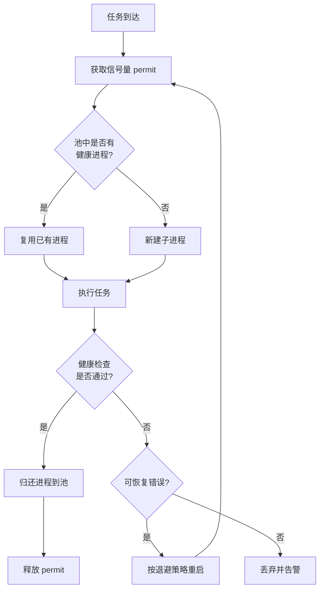

> **EN**: Advanced Process Management in Rust
> **Summary**: Enterprise-grade process patterns in Rust: process pools, load balancing, health checks, resource quotas, and fault recovery, built on `std::process` and `tokio::process`.
> **Rust Version**: 1.96.1+
> **受众**: [专家]
> **内容分级**: [专家级]
> **Bloom 层级**: 分析 → 评价
> **A/S/P 标记**: **A+P** — Application + Procedure
> **双维定位**: A×Eva — 评价高级进程管理策略
> **前置依赖**: [Process Model and Lifecycle](01_process_model_and_lifecycle.md) · [Error Handling](../../02_intermediate/03_error_handling/04_error_handling.md) · [Concurrency](../00_concurrency/01_concurrency.md)
> **后置概念**: [Async Process Management](03_async_process_management.md) · [Process Monitoring](06_process_monitoring_and_diagnostics.md) · [Process Performance Engineering](08_process_performance_engineering.md)
> **定理链**: Process Pool ⟹ Health Check ⟹ Fault Recovery

# Rust 高级进程管理

> **权威页地位**：本页为 Rust 高级进程管理概念的 canonical 解释来源。
> **对应 crate 示例**：`crates/c07_process/docs/04_advanced_process_management.md` 现为摘要页，指向此处。

---

## 1. 进程池（Process Pool）

频繁创建和销毁进程代价高昂。进程池通过维护一组可复用的子进程来降低启动开销，并提供：

- 最大并发数限制（信号量）
- 空闲超时与自动回收
- 健康检查与故障隔离
- 运行统计与可观测性

```rust
use std::process::{Command, Stdio};
use std::sync::{Arc, Mutex};
use std::collections::VecDeque;
use std::time::{Duration, Instant};
use tokio::sync::Semaphore;

#[derive(Debug, Clone)]
pub struct ProcessPoolConfig {
    pub min_processes: usize,
    pub max_processes: usize,
    pub initial_processes: usize,
    pub idle_timeout: Duration,
    pub health_check_interval: Duration,
    pub max_idle_time: Duration,
}

impl Default for ProcessPoolConfig {
    fn default() -> Self {
        Self {
            min_processes: 2,
            max_processes: 10,
            initial_processes: 5,
            idle_timeout: Duration::from_secs(30),
            health_check_interval: Duration::from_secs(10),
            max_idle_time: Duration::from_secs(300),
        }
    }
}

#[derive(Debug)]
struct PooledProcess {
    child: tokio::process::Child,
    created_at: Instant,
    last_used: Instant,
    usage_count: u64,
    is_healthy: bool,
}

pub struct ProcessPool {
    config: ProcessPoolConfig,
    processes: Arc<Mutex<VecDeque<PooledProcess>>>,
    semaphore: Arc<Semaphore>,
    base_command: String,
    base_args: Vec<String>,
}

impl ProcessPool {
    pub fn new(config: ProcessPoolConfig, base_command: String, base_args: Vec<String>) -> Self {
        let semaphore = Arc::new(Semaphore::new(config.max_processes));
        Self {
            config,
            processes: Arc::new(Mutex::new(VecDeque::new())),
            semaphore,
            base_command,
            base_args,
        }
    }

    async fn create_process(&self) -> Result<PooledProcess, Box<dyn std::error::Error>> {
        let mut child = Command::new(&self.base_command)
            .args(&self.base_args)
            .stdin(Stdio::piped())
            .stdout(Stdio::piped())
            .stderr(Stdio::piped())
            .spawn()?;

        Ok(PooledProcess {
            child,
            created_at: Instant::now(),
            last_used: Instant::now(),
            usage_count: 0,
            is_healthy: true,
        })
    }
}
```

## 2. 负载均衡策略

当系统需要管理多个进程池或工作进程时，可采用以下策略分配任务：

| 策略 | 说明 | 适用场景 |
| :--- | :--- | :--- |
| Round Robin | 轮询 | 负载均匀、任务同质 |
| Least Connections | 最小连接数 | 长连接、任务耗时差异大 |
| Weighted Round Robin | 加权轮询 | 机器性能不一致 |
| Random | 随机 | 简单、无状态 |
| Least Response Time | 最小响应时间 | 对延迟敏感 |

## 3. 健康检查与故障恢复

企业级进程管理需要监控子进程状态并在故障时恢复：

- **健康检查**：定期 ping 子进程或检查其最近输出。
- **故障恢复**：根据退出码、stderr 输出分类错误，设置重启策略（固定延迟、指数退避、最大重试次数）。
- **避免僵尸进程**：确保对 `Child` 调用 `wait` 或 `wait_with_output`。

```text
Created → Running → Waiting → Terminated
            ↓         ↓
          Failed   Stopping
```

## 4. 资源限制与配额管理

### 4.1 进程级资源限制

在 Unix 平台上，可通过 `nix::sys::resource::setrlimit` 设置：

- 内存限制（`RLIMIT_AS`）
- 文件描述符限制（`RLIMIT_NOFILE`）
- CPU 时间限制（`RLIMIT_CPU`）

Windows 平台需使用对应的 Windows API 进行资源限制配置。

### 4.2 配额管理系统

- 为每个用户/任务分配 CPU、内存、I/O 配额。
- 使用 `cgroup`（Linux）或 Job Object（Windows）实现更细粒度的资源控制。

## 5. 最佳实践

- 总是为进程执行设置超时。
- 使用 RAII 模式，依赖 `Drop` 自动释放资源。
- 异步（Async）等待时优先使用 `tokio::time::timeout`。
- 区分可恢复错误与致命错误，避免无限重启循环。

---

> **L2 向下引用（Reference）**: 进程池模式建立在 [Trait 系统](../../02_intermediate/00_traits/01_traits.md)、[并发模型](../00_concurrency/01_concurrency.md) 与 [异步（Async）编程](../01_async/02_async.md) 之上。

## 相关概念

- [进程模型与生命周期（Lifetimes）](01_process_model_and_lifecycle.md)
- [异步进程管理](03_async_process_management.md)
- [跨平台进程管理](04_cross_platform_process_management.md)
- [IPC 机制](05_ipc_mechanisms.md)

---

## 6. 调度策略

当任务到达顺序或优先级对系统行为有显著影响时，可在进程池之上引入调度策略。

| 策略 | 核心思想 | 适用场景 |
| :--- | :--- | :--- |
| FIFO | 按任务到达顺序执行 | 公平性要求低、负载均匀 |
| 优先级调度 | 高优先级任务优先 | 关键任务需要低延迟 |
| 公平调度/时间片轮转 | 按时间片轮流服务 | 避免长任务独占资源 |
| 实时调度（EDF） | 截止时间最早优先 | 有硬/软实时约束 |

```rust
use std::cmp::Ordering;
use std::collections::BinaryHeap;
use std::time::{Instant, Duration};

#[derive(Eq, PartialEq)]
struct DeadlineTask { deadline: Instant, command: String }

impl Ord for DeadlineTask {
    fn cmp(&self, other: &Self) -> Ordering {
        other.deadline.cmp(&self.deadline)
    }
}
impl PartialOrd for DeadlineTask {
    fn partial_cmp(&self, other: &Self) -> Option<Ordering> { Some(self.cmp(other)) }
}
```

## 7. 进程间协调

在由多个 Rust 进程组成的分布式或本地工作组中，常见协调需求包括互斥、选主和任务分配。

### 7.1 分布式锁

基于文件创建原子性实现的互斥锁，结合 `Drop` 自动释放，适用于同一文件系统下的多进程互斥。

### 7.2 选主算法

Bully 算法等经典选主协议可用于进程组中的 leader 选举；leader 负责任务分发或元数据维护。

### 7.3 一致性哈希任务分配

将任务 ID 哈希后映射到 worker 进程，可在 worker 加入或退出时最小化任务迁移。

## 8. 容错与恢复

企业级进程管理需要区分可恢复错误与致命错误，并避免无限重启循环。

- **健康检查**：定期检测子进程是否存活或响应。
- **重启策略**：固定延迟、线性退避或指数退避，并设置最大重试次数。
- **检查点**：在关键状态点持久化 `ProcessState`，失败后可从检查点恢复。
- **优雅关闭**：先发送 SIGTERM（或 Windows 对应事件），等待宽限期后再强制终止。

---

> **权威来源**: [Rust Standard Library](https://doc.rust-lang.org/std/process/) · [Tokio Process](https://docs.rs/tokio/latest/tokio/process/) · [nix crate](https://docs.rs/nix/latest/nix/sys/resource/)

---

## 9. 进程池与故障恢复流程（Mermaid）



---

## 10. 可运行示例：健康检查循环

```rust,ignore
use tokio::process::Command;
use tokio::time::{interval, Duration};

async fn health_check_loop(program: &str) {
    let mut tick = interval(Duration::from_secs(5));
    loop {
        tick.tick().await;
        match Command::new(program).output().await {
            Ok(out) if out.status.success() => println!("{} is healthy", program),
            _ => println!("{} is unhealthy", program),
        }
    }
}
```

## 认知路径

1. **问题识别**: 识别频繁创建/销毁进程带来的延迟与资源开销。
2. **概念建立**: 掌握进程池、负载均衡、健康检查与故障恢复的设计模式。
3. **机制推理**: 通过池化 ⟹ 限流 ⟹ 自愈的定理链分析生产级进程管理。
4. **边界辨析**: 辨析“进程越多越好”等反命题，理解上下文切换与内存占用边界。
5. **迁移应用**: 将高级进程管理与监控、性能工程主题链接，构建可观测系统。

## 定理链

| 定理 | 前提 | 结论 |
|:---|:---|:---|
| 进程池化 ⟹ 降低启动延迟 | 维护一组可复用子进程 | 单位任务响应时间显著缩短 |
| 健康检查 ⟹ 故障隔离 | 定期检测子进程存活与响应 | 异常进程可被及时替换，避免级联失败 |
| 资源配额 ⟹ 可预测性 | 限制并发数、内存与 CPU 使用 | 系统在高负载下仍保持稳定 |

## 反命题

> **反命题 1**: "进程池越大性能越好" ⟹ 不成立。过大的池会加剧上下文切换与内存占用，反而降低吞吐。
>
> **反命题 2**: "只要子进程能启动就说明健康" ⟹ 不成立。启动成功不能覆盖死锁、响应超时等运行时（Runtime）故障。
>
> **反命题 3**: "故障恢复只需重启进程" ⟹ 不成立。无状态重启可能丢失上下文，需结合重试策略与幂等设计。
>
## 反向推理

> **反向推理 1**: 观察到任务排队时间持续增长 ⟸ 说明进程池容量不足或任务分布不均。
>
> **反向推理 2**: 发现子进程频繁重启但问题依旧 ⟸ 说明健康检查指标未覆盖真正的失效模式。
>
## 过渡段

> **过渡**: 从进程创建开销过渡到进程池，可以理解池化是生产环境降低延迟的关键手段。
>
> **过渡**: 从进程池过渡到健康检查，可以建立“先预防、后自愈”的运维思维。
>
> **过渡**: 从故障恢复过渡到监控与性能工程，可以形成完整的进程管理闭环。
>
