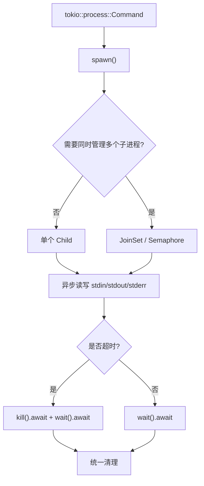

> **EN**: Async Process Management in Rust
> **Summary**: Managing child processes inside Rust's async runtime: tokio::process, async I/O, timeouts, cancellation, and structured concurrency.
> **Rust Version**: 1.97.0+
> **受众**: [专家]
> **内容分级**: [专家级]
> **Bloom 层级**: 分析 → 评价
> **权威来源**: 本文件为 `concept/` 权威页。
> **A/S/P 标记**: **A+P** — Application + Procedure
> **双维定位**: A×App — 应用异步（Async）进程管理
> **前置依赖**: [Process Model and Lifecycle](01_process_model_and_lifecycle.md) · [Async](../01_async/02_async.md) · [Error Handling](../../02_intermediate/03_error_handling/04_error_handling.md)
> **后置概念**: [IPC Mechanisms](05_ipc_mechanisms.md) · [Process Monitoring](06_process_monitoring_and_diagnostics.md) · [Modern Process Libraries](10_modern_process_libraries.md)
> **定理链**: Async Runtime ⟹ tokio::process ⟹ Cancellation Safety

# Rust 异步进程管理

> **权威页地位**：本页为 Rust 异步（Async）进程管理概念的 canonical 解释来源。
> **对应 crate 示例**：`crates/c07_process/docs/05_async_process_management.md` 现为摘要页，指向此处。

---

## 1. 为什么需要异步进程管理

在异步运行时（Runtime）中管理子进程时，同步 `std::process` 会阻塞当前线程，导致整个运行时线程池被占满。`tokio::process` 将 `std::process` 的 I/O 与等待操作转移到异步任务中，从而：

- 不阻塞工作线程
- 支持并发管理大量子进程
- 与 `tokio::time::timeout`、取消 token 无缝集成

## 2. `tokio::process` 核心 API

| 类型 | 作用 |
| :--- | :--- |
| `tokio::process::Command` | 异步进程构建器 |
| `tokio::process::Child` | 子进程句柄 |
| `tokio::process::ChildStdin` | 异步标准输入 |
| `tokio::process::ChildStdout` | 异步标准输出 |
| `tokio::process::ChildStderr` | 异步标准错误 |

```rust
use tokio::process::Command;

#[tokio::main]
async fn main() -> Result<(), Box<dyn std::error::Error>> {
    let output = Command::new("echo")
        .arg("hello from async process")
        .output()
        .await?;

    println!("{}", String::from_utf8_lossy(&output.stdout));
    Ok(())
}
```

## 3. 异步生命周期管理

### 3.1 超时控制

```rust
use tokio::process::Command;
use tokio::time::{timeout, Duration};

async fn run_with_timeout() -> Result<(), Box<dyn std::error::Error>> {
    let result = timeout(
        Duration::from_secs(5),
        Command::new("sleep").arg("10").output(),
    ).await;

    match result {
        Ok(Ok(output)) => println!("完成: {}", output.status),
        Ok(Err(e)) => println!("进程错误: {}", e),
        Err(_) => println!("超时"),
    }
    Ok(())
}
```

### 3.2 异步通信

通过 `tokio::io::AsyncWriteExt` 和 `AsyncBufReadExt` 异步读写子进程管道：

```rust
use tokio::io::{AsyncWriteExt, AsyncBufReadExt, BufReader};
use tokio::process::Command;
use std::process::Stdio;

async fn communicate() -> Result<(), Box<dyn std::error::Error>> {
    let mut child = Command::new("cat")
        .stdin(Stdio::piped())
        .stdout(Stdio::piped())
        .spawn()?;

    if let Some(mut stdin) = child.stdin.take() {
        stdin.write_all(b"hello\n").await?;
        // 关闭 stdin，让子进程结束
    }

    if let Some(stdout) = child.stdout.take() {
        let reader = BufReader::new(stdout);
        let mut lines = reader.lines();
        while let Some(line) = lines.next_line().await? {
            println!("{}", line);
        }
    }

    child.wait().await?;
    Ok(())
}
```

## 4. 结构化并发

使用 `tokio::select!` 或 `JoinSet` 同时管理多个子进程，并在取消时统一清理：

```rust
use tokio::process::Command;

async fn run_many() -> Result<(), Box<dyn std::error::Error>> {
    let mut set = tokio::task::JoinSet::new();

    for i in 0..4 {
        set.spawn(async move {
            Command::new("echo").arg(format!("task {}", i)).output().await
        });
    }

    while let Some(result) = set.join_next().await {
        let output = result??;
        println!("{}", String::from_utf8_lossy(&output.stdout));
    }

    Ok(())
}
```

## 5. 取消与清理

当持有 `Child` 句柄的任务被取消时，`Child` 的 `Drop` 实现默认会尝试 `kill` 子进程，但**不会等待其结束**。对于需要确保资源完全释放的场景，应显式调用 `kill().await` 和 `wait().await`。

```rust
async fn cancellable_child() -> Result<(), Box<dyn std::error::Error>> {
    let mut child = Command::new("long_running_task").spawn()?;

    // 在取消时显式清理
    tokio::select! {
        _ = child.wait() => {}
        _ = tokio::signal::ctrl_c() => {
            child.kill().await?;
            child.wait().await?;
        }
    }

    Ok(())
}
```

## 6. 最佳实践

- 优先使用 `tokio::process` 而非 `std::process`  inside async runtime。
- 为所有可能长时间运行的子进程设置超时。
- 在取消路径中显式等待子进程终止，避免僵尸进程。
- 将子进程输出流式处理，避免一次性加载大量数据。

---

## 相关概念

- [进程模型与生命周期（Lifetimes）](01_process_model_and_lifecycle.md)

---

## 7. 大规模并发与流控

在异步运行时（Runtime）中管理大量子进程时，需要控制并发度、避免资源耗尽，并保证可预测的行为。

### 7.1 并发度限制

使用 `tokio::sync::Semaphore` 限制同时运行的子进程数量，防止因进程数过多导致文件描述符或内存耗尽。

```rust
use tokio::process::Command;
use tokio::sync::Semaphore;
use std::sync::Arc;

pub async fn run_limited(
    commands: Vec<Vec<String>>,
    max: usize,
) -> Vec<std::io::Result<std::process::Output>> {
    let sem = Arc::new(Semaphore::new(max));
    let mut handles = Vec::new();
    for cmd in commands {
        let sem = sem.clone();
        handles.push(tokio::spawn(async move {
            let _permit = sem.acquire().await.unwrap();
            let mut iter = cmd.into_iter();
            let program = iter.next().unwrap_or_default();
            Command::new(&program).args(iter).output().await
        }));
    }
    let mut results = Vec::new();
    for h in handles {
        results.push(h.await.unwrap());
    }
    results
}
```

### 7.2 异步进程池

将工作进程池与异步任务结合，通过 `tokio::sync::mpsc` 分派任务并由固定数量的 worker 顺序执行，减少进程创建开销。

```rust
use tokio::process::Command;
use tokio::sync::mpsc;

pub struct AsyncProcessPool {
    tx: mpsc::Sender<(String, Vec<String>, mpsc::Sender<std::io::Result<std::process::Output>>)>,
}

impl AsyncProcessPool {
    pub fn new(workers: usize) -> Self {
        let (tx, mut rx) = mpsc::channel(128);
        for _ in 0..workers {
            let mut rx = rx.clone();
            tokio::spawn(async move {
                while let Some((program, args, reply)) = rx.recv().await {
                    let result = Command::new(&program).args(&args).output().await;
                    let _ = reply.send(result).await;
                }
            });
        }
        Self { tx }
    }

    pub async fn execute(
        &self,
        program: String,
        args: Vec<String>,
    ) -> std::io::Result<std::process::Output> {
        let (reply_tx, mut reply_rx) = mpsc::channel(1);
        self.tx.send((program, args, reply_tx)).await.unwrap();
        reply_rx.recv().await.unwrap()
    }
}
```

### 7.3 优先级调度

当任务具有不同优先级时，可使用 `BinaryHeap` 实现按优先级取出的调度器，高优先级任务先获得进程资源。

```rust
use std::cmp::Ordering;
use std::collections::BinaryHeap;

#[derive(Eq, PartialEq)]
struct Task { priority: u32, seq: u64, command: String }

impl Ord for Task {
    fn cmp(&self, other: &Self) -> Ordering {
        other.priority.cmp(&self.priority)
            .then_with(|| self.seq.cmp(&other.seq))
    }
}
impl PartialOrd for Task {
    fn partial_cmp(&self, other: &Self) -> Option<Ordering> { Some(self.cmp(other)) }
}
```

### 7.4 超时、重试与断路器

- **超时**：对所有可能长时间运行的子进程使用 `tokio::time::timeout`。
- **重试**：对可恢复错误按固定间隔或指数退避重试，但设置最大重试次数。
- **断路器**：当失败率达到阈值时暂停启动新进程，避免级联故障。

### 7.5 优雅取消

取消持有 `Child` 的任务时，`Child` 的 `Drop` 默认会 kill 但不等待。如需确保子进程完全退出，应显式调用 `kill().await` 和 `wait().await`。

- [高级进程管理](02_advanced_process_management.md)
- [Async/Await](../01_async/02_async.md)
- [Future 与 Executor 机制](../01_async/39_future_and_executor_mechanisms.md)

---

> **权威来源**: [Tokio Process](https://docs.rs/tokio/latest/tokio/process/) · [Rust Async Book](https://rust-lang.github.io/async-book/)

---

## 8. 异步进程生命周期（Mermaid）



---

## 补充视角：异步标准 IO 管理

> 来源：`crates/c07_process/docs/async_stdio_guide.md`

在异步运行时中管理子进程时，标准输入/输出/错误也需要异步化。核心要点：

- 使用 `tokio::process::Command` 的 `.stdin(Stdio::piped())` / `.stdout(Stdio::piped())` 创建管道。
- 通过 `tokio::io::AsyncWriteExt` 异步写入 stdin，`AsyncBufReadExt` 异步读取 stdout/stderr。
- 写入完毕后必须关闭 stdin（发送 EOF），否则某些进程（如 `cat`）不会结束。
- 使用 `tokio::time::timeout` 为长时间运行的进程设置超时，避免无限等待。
- Windows 与 Unix 的命令、路径和环境变量存在差异，使用 `cfg!(windows)` 做条件处理。

相关权威页：

- [Async/Await](../01_async/02_async.md)
- [进程模型与生命周期（Lifetimes）](01_process_model_and_lifecycle.md)

---

## 9. 可运行示例：带取消的异步 select

```rust,ignore
use tokio::process::Command;
use tokio::time::{timeout, Duration};

async fn run_with_cancellation() -> std::io::Result<()> {
    let mut child = Command::new("sleep").arg("30").spawn()?;
    let result = timeout(Duration::from_secs(2), child.wait()).await;
    if result.is_err() {
        child.kill().await?;
        child.wait().await?;
    }
    Ok(())
}
```

## 认知路径

1. **问题识别**: 识别在异步运行时中调用同步 `std::process` 会阻塞工作线程的问题。
2. **概念建立**: 掌握 `tokio::process::Command`、`Child`、`ChildStdout` 等异步 API。
3. **机制推理**: 通过异步运行时 ⟹ 非阻塞 I/O ⟹ 取消安全的定理链分析设计约束。
4. **边界辨析**: 辨析“异步一定更快”等反命题，理解运行时调度和缓冲策略的影响。
5. **迁移应用**: 将异步进程管理与超时、取消、结构化并发主题链接。

## 定理链

| 定理 | 前提 | 结论 |
|:---|:---|:---|
| 异步进程 I/O ⟹ 不阻塞运行时线程 | I/O 与等待由运行时事件驱动 | 线程池可服务更多并发任务 |
| 超时 + 取消 ⟹ 避免挂起 | `tokio::time::timeout` 与 AbortHandle | 资源不会被无限期占用 |
| 结构化并发 ⟹ 简化生命周期 | 子任务与父任务共命运 | 子进程在父任务取消时被正确清理 |

## 反命题

> **反命题 1**: "异步进程管理总是比同步快" ⟹ 不成立。低并发或 CPU 密集型任务可能因运行时开销而劣势。
>
> **反命题 2**: "取消任务后子进程会自动结束" ⟹ 不成立。需在 Drop 或取消逻辑中显式 `kill`/`wait` 子进程。
>
> **反命题 3**: "可以直接混用 `std::process` 与 `tokio::process` 句柄" ⟹ 不成立。混用易导致阻塞与竞争条件。
>
## 反向推理

> **反向推理 1**: 观察到运行时线程池被占满 ⟸ 说明存在同步进程调用阻塞了异步执行器。
>
> **反向推理 2**: 发现取消任务后子进程仍在运行 ⟸ 说明未在 Drop 中实现子进程清理逻辑。
>
## 过渡段

> **过渡**: 从同步进程阻塞问题过渡到 `tokio::process`，可以理解异步封装的核心动机。
>
> **过渡**: 从异步 I/O 过渡到取消安全，可以建立“启动—监控—清理”的责任边界。
>
> **过渡**: 从取消安全过渡到结构化并发，可以形成高可靠性异步进程管理的设计原则。
>
