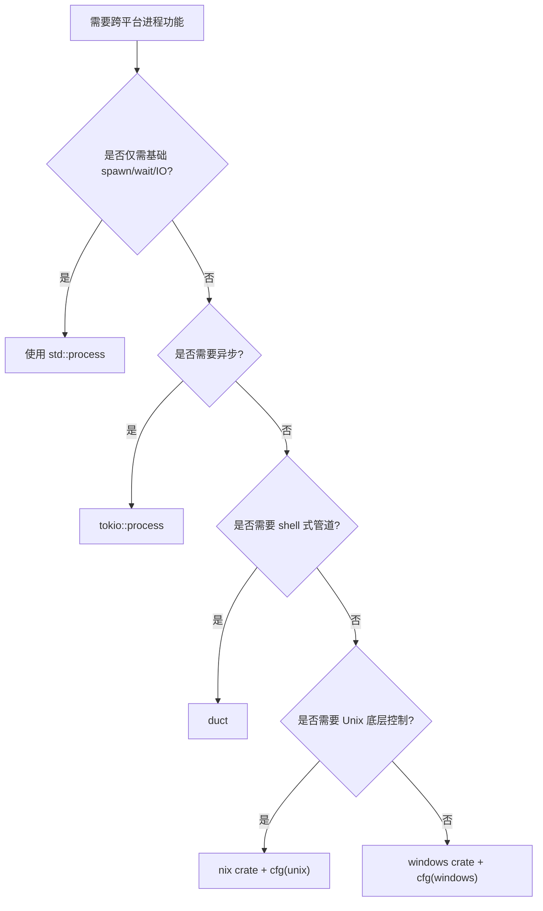

> **EN**: Cross-Platform Process Management in Rust
> **Summary**: Writing portable process-management code across Windows, Linux, and macOS using std::process, platform extensions, and conditional compilation.
> **Rust Version**: 1.96.1+
> **受众**: [专家]
> **内容分级**: [专家级]
> **Bloom 层级**: 分析 → 评价
> **A/S/P 标记**: **S+P** — Structure + Procedure
> **双维定位**: S×Eva — 评价跨平台进程管理可移植性
> **前置依赖**: [Process Model and Lifecycle](01_process_model_and_lifecycle.md) · [Conditional Compilation](../03_proc_macros/28_conditional_compilation.md) · [Module System](../../02_intermediate/05_modules_and_visibility/10_module_system.md)
> **后置概念**: [IPC Mechanisms](05_ipc_mechanisms.md) · [Process Security](07_process_security_and_sandboxing.md) · [Modern Process Libraries](10_modern_process_libraries.md)
> **定理链**: Platform Differences ⟹ cfg Abstraction ⟹ Portable API

# Rust 跨平台进程管理

> **权威页地位**：本页为 Rust 跨平台进程管理概念的 canonical 解释来源。
> **对应 crate 示例**：`crates/c07_process/docs/06_cross_platform_process_management.md` 现为摘要页，指向此处。

---

## 1. 平台差异概述

Rust 的 `std::process` 已经封装了大部分跨平台差异，但某些功能仍依赖平台特定扩展：

| 平台 | 进程创建 | 服务管理 | 路径分隔符 | 信号处理 |
| :--- | :--- | :--- | :--- | :--- |
| Windows | `CreateProcess` | Windows Service | `\` | Windows 信号/事件 |
| Linux | `fork/exec` | systemd | `/` | Unix 信号 |
| macOS | `fork/exec` | launchd | `/` | Unix 信号 |

## 2. 统一抽象层

通过条件编译和 trait 抽象，可以编写跨平台的进程管理代码：

```rust
use std::process::{Command, Stdio};
use std::path::PathBuf;

#[derive(Debug, Clone)]
pub enum Platform {
    Windows,
    Linux,
    MacOS,
    Unix,
    Unknown,
}

#[derive(Debug, Clone)]
pub struct CrossPlatformConfig {
    pub default_shell: String,
    pub path_separator: char,
    pub executable_extension: String,
    pub temp_dir: PathBuf,
    pub supports_process_groups: bool,
    pub supports_signals: bool,
    pub supports_job_control: bool,
}

impl CrossPlatformConfig {
    pub fn for_current_platform() -> (Platform, Self) {
        if cfg!(target_os = "windows") {
            (Platform::Windows, Self {
                default_shell: "cmd.exe".into(),
                path_separator: '\\',
                executable_extension: ".exe".into(),
                temp_dir: std::env::var("TEMP").map(PathBuf::from).unwrap_or_else(|_| PathBuf::from("C:\\Temp")),
                supports_process_groups: false,
                supports_signals: false,
                supports_job_control: true,
            })
        } else if cfg!(target_os = "linux") {
            (Platform::Linux, Self {
                default_shell: "/bin/bash".into(),
                path_separator: '/',
                executable_extension: "".into(),
                temp_dir: PathBuf::from("/tmp"),
                supports_process_groups: true,
                supports_signals: true,
                supports_job_control: true,
            })
        } else if cfg!(target_os = "macos") {
            (Platform::MacOS, Self {
                default_shell: "/bin/zsh".into(),
                path_separator: '/',
                executable_extension: "".into(),
                temp_dir: PathBuf::from("/tmp"),
                supports_process_groups: true,
                supports_signals: true,
                supports_job_control: true,
            })
        } else {
            (Platform::Unknown, Self {
                default_shell: "/bin/sh".into(),
                path_separator: '/',
                executable_extension: "".into(),
                temp_dir: PathBuf::from("/tmp"),
                supports_process_groups: cfg!(unix),
                supports_signals: cfg!(unix),
                supports_job_control: cfg!(unix),
            })
        }
    }
}
```

## 3. 平台特定扩展

Rust 通过 `std::os` 模块提供平台扩展 trait：

- `std::os::unix::process::CommandExt`
- `std::os::windows::process::CommandExt`

```rust
use std::process::Command;

#[cfg(unix)]
fn configure_unix(cmd: &mut Command) {
    use std::os::unix::process::CommandExt;
    cmd.process_group(0); // 创建新进程组
}

#[cfg(windows)]
fn configure_windows(cmd: &mut Command) {
    use std::os::windows::process::CommandExt;
    const CREATE_NO_WINDOW: u32 = 0x08000000;
    cmd.creation_flags(CREATE_NO_WINDOW);
}
```

## 4. 路径与环境变量

跨平台路径处理应使用 `std::path` 而非硬编码分隔符：

```rust
use std::path::PathBuf;

fn config_path() -> PathBuf {
    let mut path = PathBuf::from("config");
    path.push("app.toml");
    path
}
```

## 5. 服务集成

| 平台 | 服务管理器 | Rust 集成方式 |
| :--- | :--- | :--- |
| Linux | systemd | D-Bus / systemd notify crate |
| Windows | Windows Service | `windows-service` crate |
| macOS | launchd | plist 配置 + `launchctl` |

## 6. 决策树

```text
处理跨平台差异
│
├── 是否需要平台特定功能？
│   ├── 是 → 使用条件编译
│   │   ├── Windows → Windows API
│   │   ├── Linux → systemd / nix
│   │   └── macOS → launchd / nix
│   └── 否 → 使用 std::process 统一抽象层
```

## 7. 最佳实践

- 默认使用 `std::process` 保持可移植性。
- 将平台特定逻辑隔离在 `#[cfg(...)]` 模块中。
- 路径操作始终使用 `std::path::Path` 和 `PathBuf`。
- 在 CI 中针对目标平台进行交叉编译与测试。

## 补充视角：平台特定 API 与资源控制

> 本节选编自 `crates/c07_process/docs/10_cross_platform_guide.md`，
> 作为 canonical 跨平台进程管理概念页的工程实践补充。

### Windows 特定能力

- **作业对象（Job Objects）**：将一组进程绑定到统一资源限制与生命周期管理单元。
- **服务管理**：通过 `sc` 命令或 `windows-service` crate 注册/管理 Windows Service。
- **进程优先级**：`SetPriorityClass` 设置 `IDLE` 到 `REALTIME` 优先级。

### Unix/Linux 特定能力

- **进程组与会话**：`setpgid`、`setsid` 控制进程组与终端会话。
- **资源限制**：`nix::sys::resource::setrlimit` 设置内存、文件描述符、CPU 时间上限。
- **用户/组切换**：`setuid` / `setgid` 实现特权降级。

### 命令解析差异

- Windows 默认由 `cmd.exe /C` 解析复杂命令，需注意引号与空格转义。
- Unix 通常直接 `exec` 目标程序，参数按数组传递。

---

## 相关概念

- [进程模型与生命周期](01_process_model_and_lifecycle.md)
- [高级进程管理](02_advanced_process_management.md)
- [异步进程管理](03_async_process_management.md)
- [条件编译](../03_proc_macros/28_conditional_compilation.md)

---

## 补充视角：跨平台命令抽象与测试策略

### 跨平台 Shell 抽象

当需要执行平台特定的 shell 命令时，可以封装一个 `run_shell_command` 函数，根据 `cfg!(windows)` 选择 `cmd /C` 或 `sh -c`。

### 通用命令映射

对常用系统命令建立平台映射表，避免在业务代码中散布 `#[cfg]`。

```rust
fn list_command() -> (&'static str, &'static [&'static str]) {
    if cfg!(windows) { ("cmd", &["/C", "dir"]) } else { ("ls", &["-la"]) }
}
```

### 统一抽象层

将平台相关配置（默认 shell、路径分隔符、可执行扩展名、是否支持信号/进程组）封装为 `CrossPlatformConfig`，结合 `std::path::PathBuf` 与 `std::env` 减少平台分支。

### 跨平台测试策略

- 在 CI 中针对 `ubuntu-latest`、`macos-latest`、`windows-latest` 运行测试。
- 对平台相关代码使用 `#[cfg(unix)]` / `#[cfg(windows)]` 条件编译测试。
- 使用 mock 进程或内置命令（如 `echo`）减少对外部环境的依赖。

---

> **权威来源**: [Rust Standard Library — std::process](https://doc.rust-lang.org/std/process/) · [Rust Reference — Conditional Compilation](https://doc.rust-lang.org/reference/conditional-compilation.html)

---

## 8. 跨平台抽象决策流程（Mermaid）



---

## 9. 可运行示例：跨平台路径处理

```rust,editable
use std::path::PathBuf;

fn config_path() -> PathBuf {
    let base = std::env::var("HOME")
        .map(PathBuf::from)
        .unwrap_or_else(|_| PathBuf::from("."));
    base.join(".config").join("app.toml")
}

fn main() {
    println!("config path: {}", config_path().display());
}
```

## 认知路径

1. **问题识别**: 识别 Windows、Linux、macOS 在进程创建、信号、路径与权限上的差异。
2. **概念建立**: 掌握 `#[cfg(target_os = "...")]` 与 `std::os::*` 平台扩展的使用。
3. **机制推理**: 通过平台差异 ⟹ 条件编译 ⟹ 统一接口的定理链设计可移植代码。
4. **边界辨析**: 辨析“std::process 已完全跨平台”等反命题，明确信号、守护进程等边界。
5. **迁移应用**: 将跨平台进程管理与 CI 矩阵、安全沙箱主题链接。

## 定理链

| 定理 | 前提 | 结论 |
|:---|:---|:---|
| 条件编译隔离 ⟹ 可移植性 | 平台代码限制在最小模块 | 上层 API 保持统一 |
| 平台扩展 trait ⟹ 类型安全 | `std::os::unix::process::CommandExt` | 编译期阻止在错误平台调用 |
| CI 矩阵覆盖 ⟹ 缺陷早发 | 多 OS/架构持续集成 | 平台相关问题在合并前暴露 |

## 反命题

> **反命题 1**: "`std::process` 完全隐藏了所有平台差异" ⟹ 不成立。信号、权限、路径分隔符仍需显式处理。
>
> **反命题 2**: "只需在开发机上测试即可保证跨平台正确" ⟹ 不成立。Windows 与 Unix 的进程模型差异可能导致仅在特定平台暴露的 bug。
>
> **反命题 3**: "条件编译会降低代码可读性" ⟹ 不成立。合理封装的 cfg 模块比分支平台代码更易维护。
>
## 反向推理

> **反向推理 1**: 发现 Windows CI 上命令行参数解析失败 ⟸ 说明未处理 shell 转义与参数拼接差异。
>
> **反向推理 2**: 发现 Unix 上信号未按预期传递 ⟸ 说明混淆了 Unix 信号与 Windows 事件机制。
>
## 过渡段

> **过渡**: 从平台差异概述过渡到条件编译，可以理解 `#[cfg]` 是跨平台进程管理的第一道防线。
>
> **过渡**: 从条件编译过渡到统一抽象层，可以建立“平台相关代码内聚、通用逻辑平台无关”的设计原则。
>
> **过渡**: 从可移植抽象过渡到安全与沙箱，可以理解跨平台代码同样需要最小权限约束。
>
