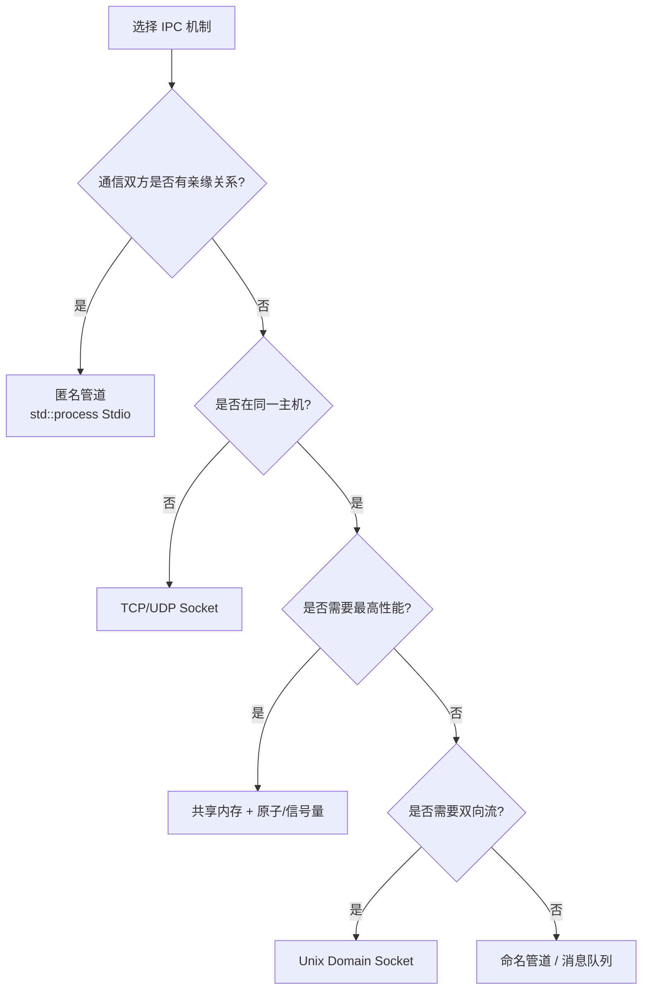

> **EN**: Inter-Process Communication Mechanisms in Rust
> **Summary**: IPC patterns in Rust: anonymous pipes, named pipes, Unix sockets, TCP/UDP sockets, shared memory, message queues, and signal handling.
> **Rust Version**: 1.96.1+

# Rust 进程间通信机制（IPC）

> **权威页地位**：本页为 Rust IPC 概念的 canonical 解释来源。
> **对应 crate 示例**：`crates/c07_process/docs/tier_02_guides/02_ipc_communication_practice.md` 现为摘要页，指向此处。

---

## 1. IPC 机制概览

| 机制 | 性能 | 跨网络 | 复杂度 | 适用场景 |
| :--- | :--- | :--- | :--- | :--- |
| 管道（Pipe） | 中 | ❌ | 低 | 父子进程 |
| 命名管道（FIFO） | 中 | ❌ | 低 | 本地无亲缘进程 |
| Unix 域套接字 | 高 | ❌ | 中 | 本地复杂通信 |
| TCP/UDP 套接字 | 中 | ✅ | 中 | 跨网络通信 |
| 共享内存 | 最高 | ❌ | 高 | 大数据高性能 |
| 消息队列 | 中 | ❌ | 中 | 异步消息传递 |
| 信号（Signal） | 低 | ❌ | 低 | 事件通知 |

## 2. 匿名管道

通过 `std::process::Command` 的 I/O 重定向实现父子进程间单向通信：

```rust
use std::process::{Command, Stdio};
use std::io::Write;

fn basic_pipe() -> Result<(), Box<dyn std::error::Error>> {
    let mut child = Command::new("cat")
        .stdin(Stdio::piped())
        .stdout(Stdio::piped())
        .spawn()?;

    if let Some(mut stdin) = child.stdin.take() {
        stdin.write_all(b"Hello Pipe!\n")?;
        // stdin 在这里 drop，子进程读取到 EOF 后退出
    }

    let output = child.wait_with_output()?;
    println!("{}", String::from_utf8_lossy(&output.stdout));
    Ok(())
}
```

**关键点**：

- 必须调用 `take()` 获取管道所有权。
- 写入后关闭 stdin（或 drop），否则子进程会一直等待。
- 使用 `wait_with_output()` 同时等待进程结束并收集输出。

## 3. 命名管道（FIFO）

命名管道允许无亲缘关系的本地进程通信。Unix 上通过 `nix::unistd::mkfifo` 创建，Windows 上通过 `tokio::net::windows::named_pipe` 或 `windows-named-pipe` crate 实现。

## 4. Unix 域套接字

Unix 域套接字提供本地双向流式通信，性能通常高于 TCP 回环：

```rust
use std::os::unix::net::{UnixListener, UnixStream};
use std::io::{Read, Write};

fn server() -> Result<(), Box<dyn std::error::Error>> {
    let listener = UnixListener::bind("/tmp/rust_ipc.sock")?;

    if let Ok((mut stream, _)) = listener.accept() {
        let mut buf = [0u8; 1024];
        let n = stream.read(&mut buf)?;
        stream.write_all(&buf[..n])?;
    }

    Ok(())
}
```

## 5. TCP/UDP 套接字

`std::net` 提供跨平台 TCP/UDP 通信，适合本地或网络场景：

```rust
use std::net::{TcpListener, TcpStream};

fn tcp_server() -> Result<(), Box<dyn std::error::Error>> {
    let listener = TcpListener::bind("127.0.0.1:8080")?;
    for stream in listener.incoming() {
        let _stream: TcpStream = stream?;
        // 处理连接
    }
    Ok(())
}
```

## 6. 共享内存

共享内存通过多个进程映射同一物理内存区域实现高速数据交换，但需要额外同步机制（如信号量、互斥锁、原子操作）防止数据竞争：

```rust
// 示意：使用 memmap2 创建共享内存映射
use memmap2::MmapOptions;
use std::fs::OpenOptions;

fn shared_memory() -> Result<(), Box<dyn std::error::Error>> {
    let file = OpenOptions::new()
        .read(true)
        .write(true)
        .open("/tmp/shm")?;

    let mmap = unsafe { MmapOptions::new().map_mut(&file)? };
    // 通过 mmap 读写共享数据，需配合同步原语
    Ok(())
}
```

## 7. 消息队列

用户空间消息队列 crate（如 `crossbeam-channel`、`ipc-channel`）提供比内核消息队列更易用的抽象，适合同一机器内进程或线程间通信。

## 8. 信号处理

Unix 信号用于通知进程异步事件。Rust 中常用 `signal-hook` 或 `tokio::signal`：

```rust
use signal_hook::iterator::Signals;

fn handle_signals() -> Result<(), Box<dyn std::error::Error>> {
    let mut signals = Signals::new(&[signal_hook::consts::SIGTERM, signal_hook::consts::SIGINT])?;

    for sig in signals.forever() {
        println!("收到信号: {}", sig);
        // 执行清理并退出
    }

    Ok(())
}
```

## 9. 选型建议

- 父子进程简单通信：匿名管道。
- 本地无亲缘进程：命名管道或 Unix 域套接字。
- 高性能大数据：共享内存 + 同步原语。
- 跨网络通信：TCP/UDP 套接字。
- 异步事件通知：信号。
- 同一主机进程/线程间消息传递：`crossbeam-channel`。

> **L2 向下引用**: IPC 安全抽象建立在 [Trait 系统](../../02_intermediate/00_traits/01_traits.md) 与 [错误处理](../../02_intermediate/03_error_handling/04_error_handling.md) 之上。

## 补充视角：IPC 机制工程选型速查

> 本节选编自 `crates/c07_process/docs/02_ipc_mechanisms.md`，
> 作为 canonical IPC 概念页的工程实践补充。

### 机制对比

| 机制 | 适用场景 | 跨平台 | 性能 | 复杂度 |
| :--- | :--- | :--- | :--- | :--- |
| 管道 | 父子进程简单通信 | 是 | 中 | 低 |
| 命名管道 | 无亲缘进程通信 | 否 | 中 | 中 |
| 套接字 | 网络/本地通用 | 是 | 中高 | 中 |
| 共享内存 | 大数据量高速交换 | 否 | 高 | 高 |
| 信号 | 异步事件通知 | 否 | 低 | 低 |
| 消息队列 | 异步/多生产多消费 | 否 | 中 | 中 |

### 选型原则

- 优先选用标准库和成熟 crate。
- 跨平台场景优先考虑管道与套接字。
- 高性能场景可用共享内存，但必须配合同步原语防止数据竞争。

---

## 相关概念

- [进程模型与生命周期](01_process_model_and_lifecycle.md)
- [并发模型](../00_concurrency/01_concurrency.md)
- [原子操作与内存序](../00_concurrency/11_atomics_and_memory_ordering.md)
- [Rust 网络编程](../06_low_level_patterns/18_network_programming.md)

---

> **权威来源**: [Rust Standard Library — std::process](https://doc.rust-lang.org/std/process/) · [Rust Standard Library — std::net](https://doc.rust-lang.org/std/net/) · [signal-hook crate](https://docs.rs/signal-hook/) · [memmap2 crate](https://docs.rs/memmap2/)

---

## 10. IPC 选型决策流程（Mermaid）



---

## 11. 可运行示例：父子匿名管道

```rust,editable
use std::io::Write;
use std::process::{Command, Stdio};

fn main() -> std::io::Result<()> {
    let mut child = Command::new("cat")
        .stdin(Stdio::piped())
        .stdout(Stdio::piped())
        .spawn()?;

    if let Some(mut stdin) = child.stdin.take() {
        writeln!(stdin, "hello pipe")?;
    }

    let output = child.wait_with_output()?;
    println!("{}", String::from_utf8_lossy(&output.stdout));
    Ok(())
}
```
