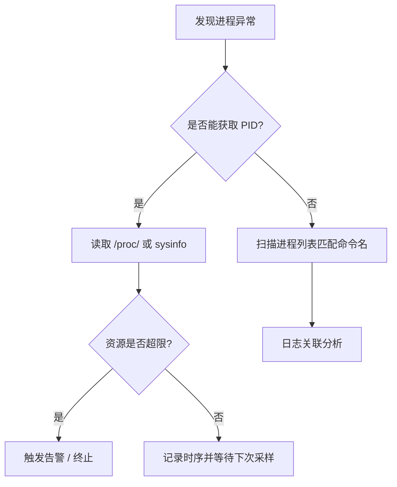

> **EN**: Process Monitoring and Diagnostics in Rust
> **Summary**: Monitoring process status, resource usage, logging, and diagnostic techniques for Rust child processes.
> **Rust Version**: 1.97.0+
> **受众**: [专家]
> **内容分级**: [专家级]
> **Bloom 层级**: 分析 → 评价
> **权威来源**: 本文件为 `concept/` 权威页。
> **A/S/P 标记**: **A+P** — Application + Procedure
> **双维定位**: A×Eva — 评价进程监控与诊断方法
> **前置依赖**: [Process Model and Lifecycle](01_process_model_and_lifecycle.md) · [IPC Mechanisms](05_ipc_mechanisms.md) · [Error Handling](../../02_intermediate/03_error_handling/04_error_handling.md)
> **后置概念**: [Process Security](07_process_security_and_sandboxing.md) · [Process Performance Engineering](08_process_performance_engineering.md) · [Process Testing](09_process_testing_and_benchmarking.md)
> **定理链**: Observable Metrics ⟹ Diagnostic Loop ⟹ Recovery

# Rust 进程监控与诊断

> **权威页地位**：本页为 Rust 进程监控与诊断概念的 canonical 解释来源。
> **L2 向下引用（Reference）**: 进程监控实现建立在 [Trait 系统](../../02_intermediate/00_traits/01_traits.md)、[L2 错误处理（Error Handling）](../../02_intermediate/03_error_handling/04_error_handling.md) 与 [并发模型](../00_concurrency/01_concurrency.md) 之上。

## 1. 概念定义

**进程监控与诊断 (Process Monitoring and Diagnostics)** 是跟踪子进程状态、资源使用、输出日志并据此定位问题的技术集合，服务于开发调试、生产运维和性能分析。

核心关注点：

- **状态监控**：进程是否存活，以及运行、停止、僵尸等状态。
- **资源监控**：CPU、内存、I/O 使用量。
- **日志与跟踪**：stdout/stderr 捕获、结构化日志。
- **诊断工具**：持久化记录、告警、自动化恢复。

## 2. 状态监控

### 2.1 存活检查

跨平台存活检查通常利用信号 0（Unix）或进程枚举（Windows）。下面的 `nix` 示例仅在 Unix 平台生效：

```rust,ignore
#[cfg(unix)]
fn is_alive(pid: u32) -> bool {
    use nix::sys::signal::{kill, Signal};
    use nix::unistd::Pid;
    kill(Pid::from_raw(pid as i32), Signal::from_c_int(0).unwrap()).is_ok()
}
```

### 2.2 非阻塞轮询

使用 `std::process::Child::try_wait()` 可以在不阻塞当前线程的情况下更新进程状态，避免子进程变僵尸：

```rust,editable
use std::collections::HashMap;
use std::process::{Child, Command, Stdio};
use std::thread;
use std::time::{Duration, Instant};

struct MonitoredProcess {
    child: Child,
    started_at: Instant,
}

struct ProcessMonitor {
    processes: HashMap<u32, MonitoredProcess>,
}

impl ProcessMonitor {
    fn spawn(&mut self, program: &str, args: &[&str]) -> std::io::Result<u32> {
        let child = Command::new(program)
            .args(args)
            .stdout(Stdio::piped())
            .stderr(Stdio::piped())
            .spawn()?;
        let pid = child.id();
        self.processes.insert(pid, MonitoredProcess {
            child,
            started_at: Instant::now(),
        });
        Ok(pid)
    }

    fn poll_all(&mut self) {
        let pids: Vec<u32> = self.processes.keys().copied().collect();
        for pid in pids {
            if let Some(mp) = self.processes.get_mut(&pid) {
                match mp.child.try_wait() {
                    Ok(Some(status)) => {
                        println!("[{}] exited with {}", pid, status);
                        self.processes.remove(&pid);
                    }
                    Ok(None) => {}
                    Err(e) => eprintln!("[{}] wait error: {}", pid, e),
                }
            }
        }
    }

    fn is_alive(&self, pid: u32) -> bool {
        self.processes.contains_key(&pid)
    }
}

fn main() -> std::io::Result<()> {
    let mut monitor = ProcessMonitor { processes: HashMap::new() };
    let pid = monitor.spawn("sleep", &["2"])?;
    println!("spawned {}", pid);
    for _ in 0..10 {
        monitor.poll_all();
        if !monitor.is_alive(pid) {
            break;
        }
        thread::sleep(Duration::from_millis(500));
    }
    Ok(())
}
```

### 2.3 状态机

| 状态 | 含义 | 检测方式 |
| :--- | :--- | :--- |
| Running | 正在运行 | `try_wait()` 返回 `Ok(None)` |
| Stopped | 被信号暂停 | Unix `/proc/[pid]/stat` |
| Zombie | 已退出但未被回收 | `/proc/[pid]/stat` 状态为 `Z` |
| Unknown | 不可识别 | 其他情况 |

### 2.4 批量监控

维护 `HashMap<u32, Child>` 的进程管理器，定期调用 `try_wait()` 更新状态并清理已退出进程，避免僵尸进程。

## 3. 资源监控

### 3.1 使用 `sysinfo`

`sysinfo` crate 提供跨平台进程与系统信息查询，是资源监控的常用选择：

```rust,ignore
use sysinfo::{System, SystemExt, ProcessExt};

fn print_top_memory_processes() {
    let mut sys = System::new_all();
    sys.refresh_all();
    let mut procs: Vec<_> = sys.processes().values().collect();
    procs.sort_by(|a, b| b.memory().cmp(&a.memory()));
    for p in procs.iter().take(5) {
        println!("{} pid={} mem={} KB", p.name(), p.pid(), p.memory() / 1024);
    }
}
```

### 3.2 Linux `/proc` 解析

在没有 `sysinfo` 的环境中，可以直接读取 `/proc/[pid]/stat` 获取 CPU 时间、RSS 等数据：

```rust,ignore
use std::fs;

fn read_proc_stat(pid: u32) -> Option<String> {
    fs::read_to_string(format!("/proc/{}/stat", pid)).ok()
}
```

### 3.3 I/O 监控

对管道进行带计数的流式读取，统计字节数与事件次数。结合 `BufReader` 与自定义 `Read` 包装器即可实现。

## 4. 日志与调试

- **stdout/stderr 捕获**：通过 `Stdio::piped()` 与 `BufReader` 流式读取。
- **结构化日志**：使用 `tracing` 等框架将进程事件、PID、退出码、资源使用一并输出。
- **调试技巧**：为每个子进程分配唯一 ID，记录启动参数、环境变量、超时配置。

```rust,ignore
use tracing::{info, warn};
use std::process::Stdio;
use tokio::process::Command;

async fn traced_command(program: &str, args: &[&str]) -> std::io::Result<()> {
    let output = Command::new(program)
        .args(args)
        .stdout(Stdio::piped())
        .stderr(Stdio::piped())
        .output()
        .await?;
    if output.status.success() {
        info!(target: "process", program, "stdout" = ?String::from_utf8_lossy(&output.stdout));
    } else {
        warn!(target: "process", program, "stderr" = ?String::from_utf8_lossy(&output.stderr));
    }
    Ok(())
}
```

## 5. 告警与自动恢复

当资源使用超过阈值时，监控系统可以自动发送告警或触发重启策略：

| 指标 | 阈值示例 | 动作 |
| :--- | :--- | :--- |
| CPU | 80% 持续 60s | 记录 + 告警 |
| 内存 | 500MB | 触发优雅终止 |
| 运行时（Runtime）长 | 超过最大允许时间 | 强制 kill |
| 退出码非 0 | 连续 3 次 | 指数退避重启 |

## 6. 诊断决策流程



## 7. 最佳实践

- 定期检查 `Child::try_wait()`，及时回收子进程。
- 监控文件描述符数量，防止泄漏。
- 对监控数据设置采样间隔，避免高频轮询带来的开销。
- 将监控事件持久化到日志或时序数据库，便于回溯。
- 在异步（Async）运行时（Runtime）中优先使用 `tokio::process` + `tokio::time::interval` 做轮询。

## 8. 相关概念

- [进程模型与生命周期（Lifetimes）](01_process_model_and_lifecycle.md)
- [高级进程管理](02_advanced_process_management.md)
- [异步（Async）进程管理](03_async_process_management.md)
- [IPC 机制](05_ipc_mechanisms.md)
- [Rust 性能工程](08_process_performance_engineering.md)

---

> **权威来源**: [Rust Standard Library — std::process](https://doc.rust-lang.org/std/process/) · [sysinfo crate](https://docs.rs/sysinfo/) · [procfs crate](https://docs.rs/procfs/) · [tracing crate](https://docs.rs/tracing/)

## 认知路径

1. **问题识别**: 识别子进程运行时状态、资源使用与输出日志的可观测性需求。
2. **概念建立**: 掌握存活检查、资源监控、结构化日志与跟踪技术。
3. **机制推理**: 通过指标 ⟹ 诊断 ⟹ 恢复的定理链构建监控闭环。
4. **边界辨析**: 辨析“监控只在生产环境重要”等反命题，理解开发阶段同样需要可观测性。
5. **迁移应用**: 将监控与诊断与安全、性能、测试主题链接。

## 定理链

| 定理 | 前提 | 结论 |
|:---|:---|:---|
| 可观测指标 ⟹ 快速定位 | 收集退出码、CPU、内存、I/O 与日志 | 异常模式可被量化识别 |
| 结构化日志 ⟹ 可查询 | JSON/OTLP 格式替代自由文本 | 诊断效率与告警准确率提升 |
| 诊断闭环 ⟹ 系统韧性 | 监控—告警—恢复形成反馈 | 故障影响面被最小化 |

## 反命题

> **反命题 1**: "监控只在生产环境重要" ⟹ 不成立。开发阶段的监控可提前暴露资源泄漏与性能退化。
>
> **反命题 2**: "只要进程还在运行就是健康的" ⟹ 不成立。进程可能处于死锁或无限循环状态。
>
> **反命题 3**: "日志越多越好" ⟹ 不成立。无结构化的高频日志会淹没关键信号并增加存储成本。
>
## 反向推理

> **反向推理 1**: 发现内存占用持续上升但代码无显式泄漏 ⟸ 说明子进程句柄或管道未正确关闭。
>
> **反向推理 2**: 告警触发但日志无法定位根因 ⟸ 说明缺少结构化上下文或关键指标未采集。
>
## 过渡段

> **过渡**: 从状态监控过渡到资源监控，可以建立“存活只是最低要求，资源健康才是可持续运行”的视角。
>
> **过渡**: 从资源监控过渡到结构化日志，可以理解指标与日志互补才能支撑根因分析。
>
> **过渡**: 从诊断技术过渡到恢复策略，可以形成监控闭环并链接安全与性能主题。
>
