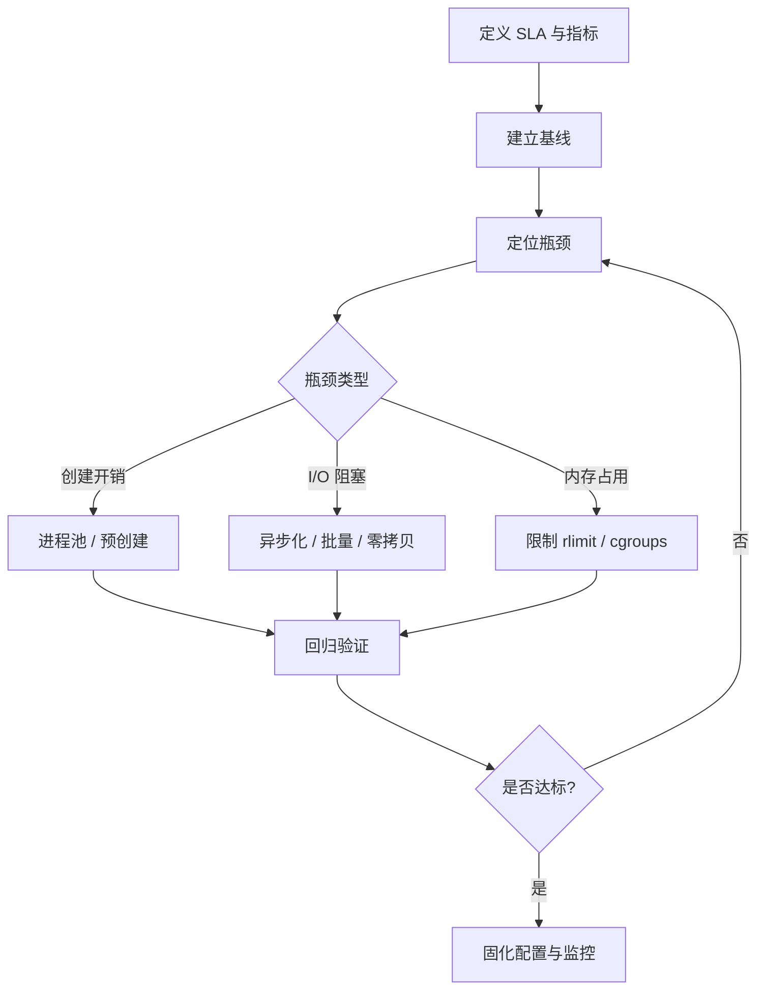

> **EN**: Process Performance Engineering in Rust
> **Summary**: Performance analysis, profiling tools, zero-copy IPC, process pool optimization, and production monitoring for Rust process management.
> **Rust Version**: 1.96.1+
> **受众**: [专家]
> **内容分级**: [专家级]
> **Bloom 层级**: 分析 → 评价
> **A/S/P 标记**: **A+P** — Application + Procedure
> **双维定位**: A×App — 应用进程级性能优化
> **前置依赖**: [Process Model and Lifecycle](01_process_model_and_lifecycle.md) · [IPC Mechanisms](05_ipc_mechanisms.md) · [Concurrency](../00_concurrency/01_concurrency.md)
> **后置概念**: [Process Monitoring](06_process_monitoring_and_diagnostics.md) · [Process Testing](09_process_testing_and_benchmarking.md) · [Modern Process Libraries](10_modern_process_libraries.md)
> **定理链**: Spawn Latency ⟹ Throughput ⟹ Resource Reclaim

# Rust 进程性能工程

> **权威页地位**：本页为 Rust 进程级性能工程概念的 canonical 解释来源。
> **L2 向下引用（Reference）**: 性能工程建立在 [Trait 系统](../../02_intermediate/00_traits/01_traits.md)、[L2 错误处理（Error Handling）](../../02_intermediate/03_error_handling/04_error_handling.md) 与 [并发模型](../00_concurrency/01_concurrency.md) 之上。
>
> 通用性能优化方法论请参见 [性能优化：Rust 代码的测量与调优](../../06_ecosystem/10_performance/15_performance_optimization.md)。

## 1. 概念定义

**进程性能工程 (Process Performance Engineering)** 关注进程创建、执行、通信与回收全链路的性能：减少进程创建开销、降低 I/O 延迟、避免资源泄漏、实现可观测的度量闭环。

## 2. 关键性能指标

| 指标 | 说明 | 测量方式 |
| :--- | :--- | :--- |
| 进程创建延迟 | spawn 到 exec 完成的时间 | 高分辨率计时 |
| 吞吐量 | 单位时间处理任务数 | Criterion / 自定义计数 |
| 内存占用 | 子进程 RSS、句柄数 | sysinfo / procfs |
| I/O 等待 | 管道阻塞时间 | strace / perf |
| 回收延迟 | `wait` 返回时间 | 高分辨率计时 |

## 3. 性能分析工具

- **perf**：Linux 采样分析，定位热点。
- **cargo-flamegraph**：可视化调用栈。
- **strace/ltrace**：追踪系统调用与库调用。
- **pprof**：运行时（Runtime） CPU profiling。
- **dhat/heaptrack**：堆分配分析。

## 4. 优化策略

### 4.1 减少进程创建开销

- 使用进程池复用长期运行的 worker。
- 预创建 worker，避免任务到达时才 spawn。
- Windows 上进程创建成本更高，优先使用进程池。

### 4.2 I/O 优化

- 使用异步（Async）管道与 `tokio::process` 避免阻塞线程。
- 合理设置缓冲区大小，批量读写。
- 避免父子进程同时双向写入导致的死锁。

### 4.3 零拷贝 IPC

- **splice**：Linux 上在两个文件描述符之间直接移动数据，避免用户空间拷贝。
- **sendfile**：文件到 socket 的高效传输。
- **mmap**：大文件共享访问，减少 `read`/`write` 次数。

```rust,ignore
#[cfg(target_os = "linux")]
use nix::fcntl::{splice, SpliceFFlags};

#[cfg(target_os = "linux")]
fn zero_copy_pipe(read_fd: i32, write_fd: i32, len: usize) -> nix::Result<usize> {
    splice(read_fd, None, write_fd, None, len, SpliceFFlags::empty())
}
```

## 5. 进程池性能

- 池大小应根据 CPU 核心数、I/O 密集度和外部资源限制调整。
- 使用有界队列防止任务无限堆积。
- 监控队列深度、worker 利用率、任务等待时间。

## 6. 进程创建延迟基准

下面是一个仅使用标准库测量 `Command::spawn()` 延迟的可复现示例：

```rust,editable
use std::process::Command;
use std::time::Instant;

fn main() {
    const N: u32 = 100;
    let start = Instant::now();
    for i in 0..N {
        let mut child = Command::new("echo")
            .arg(format!("iteration {}", i))
            .spawn()
            .expect("spawn failed");
        let _ = child.wait();
    }
    let elapsed = start.elapsed();
    println!(
        "spawn {} processes in {:?}; avg {:?}",
        N,
        elapsed,
        elapsed / N
    );
}
```

## 7. Criterion 基准套件

使用 Criterion 建立可重复的基准，例如比较不同 IPC 机制的小包延迟：

```rust,ignore
use criterion::{black_box, criterion_group, criterion_main, Criterion};
use std::process::{Command, Stdio};

fn bench_pipe_latency(c: &mut Criterion) {
    c.bench_function("pipe_round_trip", |b| {
        b.iter(|| {
            let output = Command::new("echo")
                .arg(black_box("payload"))
                .stdout(Stdio::piped())
                .output()
                .unwrap();
            black_box(output.stdout);
        })
    });
}

criterion_group!(benches, bench_pipe_latency);
criterion_main!(benches);
```

## 8. 性能调优闭环



## 9. 生产监控

- 暴露进程创建/退出速率、活跃进程数、退出码分布。
- 使用 Prometheus 等指标系统建立基线与告警。
- 定期进行回归测试，防止性能退化。

## 10. 最佳实践

- 在优化前先测量，避免过早优化。
- 优先使用 `tokio::process` 处理高并发 I/O。
- 对共享内存等高性能 IPC 必须配合同步原语防止数据竞争。
- 将基准测试纳入 CI，检测每次合并的性能回归。

## 11. 相关概念

- [进程模型与生命周期（Lifetimes）](01_process_model_and_lifecycle.md)
- [异步（Async）进程管理](03_async_process_management.md)
- [IPC 机制](05_ipc_mechanisms.md)
- [进程监控与诊断](06_process_monitoring_and_diagnostics.md)
- [性能优化：Rust 代码的测量与调优](../../06_ecosystem/10_performance/15_performance_optimization.md)

---

> **权威来源**: [Rust Performance Book](https://nnethercote.github.io/perf-book/) · [cargo-flamegraph](https://github.com/flamegraph-rs/flamegraph) · [nix crate](https://docs.rs/nix/) · [memmap2 crate](https://docs.rs/memmap2/)

## 认知路径

1. **问题识别**: 识别进程创建、执行、通信与回收全链路的性能瓶颈。
2. **概念建立**: 掌握零拷贝 IPC、进程池、批量启动与资源回收技术。
3. **机制推理**: 通过创建延迟 ⟹ 吞吐 ⟹ 回收延迟的定理链优化系统。
4. **边界辨析**: 辨析“减少进程数总能提升性能”等反命题，理解并行度与资源竞争的关系。
5. **迁移应用**: 将性能工程与监控、测试、生态库主题链接。

## 定理链

| 定理 | 前提 | 结论 |
|:---|:---|:---|
| 进程池化 ⟹ 降低创建延迟 | 复用已初始化子进程 | 单位任务响应时间与系统负载更稳定 |
| 零拷贝 IPC ⟹ 提升吞吐 | 共享内存 / memfd 避免数据拷贝 | 大数据量场景下 CPU 占用显著下降 |
| 及时回收 ⟹ 避免资源耗尽 | `wait` 与超时机制快速释放句柄 | 长时运行服务可保持资源可控 |

## 反命题

> **反命题 1**: "进程数越少性能越好" ⟹ 不成立。过少会限制并行度，无法利用多核。
>
> **反命题 2**: "零拷贝总是优于拷贝" ⟹ 不成立。小数据量下同步开销可能超过拷贝收益。
>
> **反命题 3**: "只优化热点代码就够了" ⟹ 不成立。进程创建、IPC 与回收的全链路都可能成为瓶颈。
>
## 反向推理

> **反向推理 1**: 观察到 CPU 使用率不高但吞吐上不去 ⟸ 说明可能存在 IPC 或进程创建开销瓶颈。
>
> **反向推理 2**: 发现句柄数持续增长 ⟸ 说明子进程或管道未回收，导致资源耗尽。
>
## 过渡段

> **过渡**: 从关键性能指标过渡到进程池，可以理解减少创建延迟是提升响应性的直接手段。
>
> **过渡**: 从进程池过渡到零拷贝 IPC，可以建立“计算并行 + 通信高效”的组合优化思路。
>
> **过渡**: 从通信优化过渡到资源回收，可以形成全链路性能工程的闭环。
>
