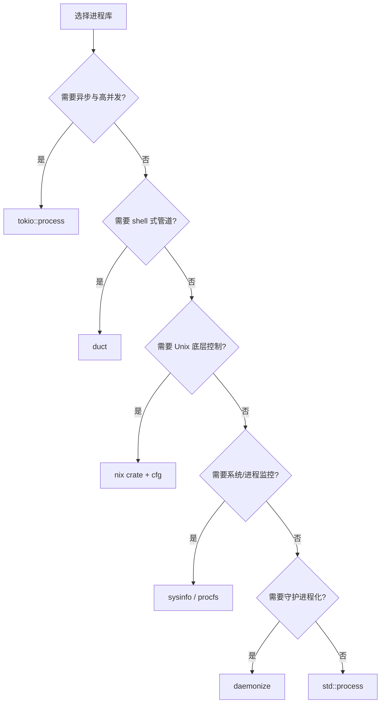

> **EN**: Modern Process Management Libraries in Rust
> **Summary**: Ecosystem survey of Rust process management libraries: std::process, tokio::process, duct, nix, sysinfo, procfs, daemonize, caps, users.
> **Rust Version**: 1.96.1+

# Rust 现代进程管理库

> **权威页地位**：本页为 Rust 现代进程管理库生态的 canonical 解释来源。
> **L2 向下引用**: 进程库的选型与封装建立在 [Trait 系统](../../02_intermediate/00_traits/01_traits.md)、[L2 错误处理](../../02_intermediate/03_error_handling/04_error_handling.md) 与 [并发模型](../00_concurrency/01_concurrency.md) 之上。

## 1. 核心库对比

| 库 | 定位 | 关键特性 | 适用场景 |
| :--- | :--- | :--- | :--- |
| `std::process` | 标准库 | 同步、跨平台、零依赖 | 简单命令执行 |
| `tokio::process` | 异步运行时 | 与 Tokio 集成、异步 I/O、超时 | 高并发异步场景 |
| `duct` | 进程组合 | 链式管道、易读 API | shell-like 命令链 |
| `nix` | Unix 系统调用 | fork/exec、信号、rlimit、namespace | 需要 Unix 底层控制 |
| `sysinfo` | 系统信息 | 跨平台进程/系统监控 | 监控工具 |
| `procfs` | /proc 解析 | 详细 Linux 进程信息 | Linux 系统工具 |
| `daemonize` | 守护进程化 | 后台运行、PID 文件、权限降级 | Unix 守护进程 |
| `caps` | Linux Capabilities | 细粒度权限控制 | 安全沙箱 |
| `users` | 用户/组查询 | 解析 uid/gid、用户名 | 权限管理 |

> **注意**：`async-std` 已进入维护模式，新项目建议优先评估 Tokio 或 smol。

## 2. 标准库示例

对于跨平台、零依赖的场景，`std::process` 仍然是最稳定的选择：

```rust,editable
use std::process::Command;

fn main() -> std::io::Result<()> {
    let output = Command::new("echo")
        .args(["hello", "from", "std::process"])
        .output()?;
    if output.status.success() {
        println!("{}", String::from_utf8_lossy(&output.stdout));
    }
    Ok(())
}
```

## 3. Tokio 异步进程

在 Tokio 运行时中管理子进程，可避免阻塞工作线程并支持超时与取消：

```rust,ignore
use tokio::process::Command;
use tokio::time::{timeout, Duration};

#[tokio::main]
async fn main() -> std::io::Result<()> {
    let result = timeout(
        Duration::from_secs(5),
        Command::new("sleep").arg("1").output(),
    )
    .await;
    println!("{:?}", result);
    Ok(())
}
```

## 4. Duct 进程组合

`duct` 提供类似 shell 的链式管道 API，适合构建复杂命令链：

```rust,ignore
use duct::cmd;

fn count_rust_files() -> std::io::Result<String> {
    let output = cmd!("find", ".", "-name", "*.rs")
        .pipe(cmd!("wc", "-l"))
        .stdout_capture()
        .run()?;
    Ok(String::from_utf8_lossy(&output.stdout).trim().to_string())
}
```

## 5. nix 系统调用封装

`nix` 适合需要精细 Unix 控制的场景，例如信号、rlimit、命名空间：

```rust,ignore
#[cfg(unix)]
fn set_nofile_limit(soft: u64, hard: u64) -> Result<(), Box<dyn std::error::Error>> {
    use nix::sys::resource::{setrlimit, Resource};
    setrlimit(Resource::RLIMIT_NOFILE, soft, hard)?;
    Ok(())
}
```

## 6. 系统监控库

`sysinfo` 与 `procfs` 用于获取进程与系统状态：

```rust,ignore
use sysinfo::{System, SystemExt, ProcessExt};

fn print_self_memory() {
    let mut sys = System::new_all();
    sys.refresh_all();
    let pid = sysinfo::get_current_pid();
    if let Some(proc) = sys.process(pid) {
        println!("self RSS: {} KB", proc.memory() / 1024);
    }
}
```

## 7. 守护进程化

`daemonize` 帮助将程序转为 Unix 守护进程，处理 PID 文件、工作目录与权限切换：

```rust,ignore
use daemonize::Daemonize;

fn daemonize_with_pid_file() -> std::io::Result<()> {
    let daemonize = Daemonize::new()
        .pid_file("/tmp/myapp.pid")
        .working_directory("/tmp")
        .user("nobody")
        .group("daemon");
    daemonize.start()?;
    Ok(())
}
```

## 8. 库选型决策树



## 9. 集成模式

- **Tokio + nix**：在异步框架中执行精细的 Unix 控制（信号、namespace）。
- **sysinfo + tokio**：异步轮询系统与进程指标。
- **duct + 流式处理**：利用 duct 简洁语法构建复杂管道，再用 `BufReader` 流式消费输出。
- **daemonize + caps**：以最小权限启动并守护进程化。

## 10. 版本与平台兼容性

| 库 | Unix | Windows | 最小 Rust 版本 |
| :--- | :--- | :--- | :--- |
| `std::process` | ✅ | ✅ | 1.0 |
| `tokio::process` | ✅ | ✅ | 1.70+ |
| `duct` | ✅ | ✅ | 1.63+ |
| `nix` | ✅ | ❌ | 1.69+ |
| `sysinfo` | ✅ | ✅ | 1.70+ |
| `daemonize` | ✅ | ❌ | 1.60+ |

## 11. 最佳实践

- 优先使用标准库或成熟 crate，避免重复封装。
- 根据平台支持范围选择库：`nix` 仅 Unix，`sysinfo`/`duct`/`tokio` 跨平台。
- 锁定版本，避免使用通配符依赖。
- 将平台相关代码隔离在 `#[cfg]` 模块中。
- 定期审计依赖的安全公告与维护状态。

## 12. 相关概念

- [进程模型与生命周期](01_process_model_and_lifecycle.md)
- [异步进程管理](03_async_process_management.md)
- [跨平台进程管理](04_cross_platform_process_management.md)
- [进程安全与沙箱](07_process_security_and_sandboxing.md)
- [核心开源库谱系](../../06_ecosystem/02_core_crates/03_core_crates.md)

---

> **权威来源**: [crates.io](https://crates.io/) · [Tokio Process](https://docs.rs/tokio/latest/tokio/process/) · [duct crate](https://docs.rs/duct/) · [nix crate](https://docs.rs/nix/) · [sysinfo crate](https://docs.rs/sysinfo/) · [procfs crate](https://docs.rs/procfs/) · [daemonize crate](https://docs.rs/daemonize/)
