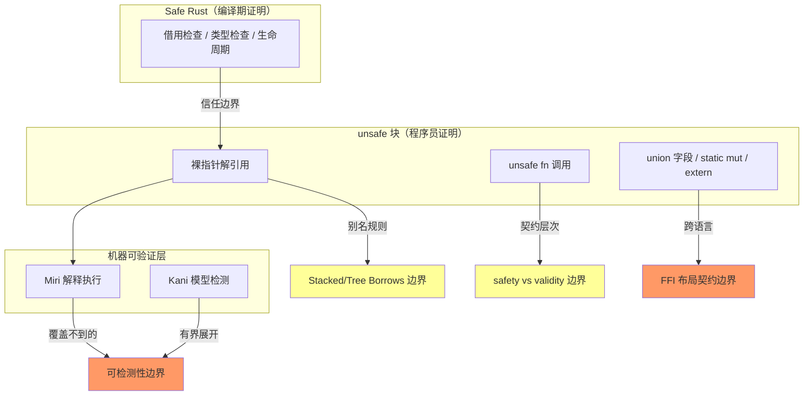

# Unsafe 边界全景（Unsafe Boundary Panorama）

> **内容分级**: [专家级]
> **定理链**: N/A — 边界全景/导航性文档，形式化推导见各权威页

> **EN**: Unsafe Boundary Panorama
> **Summary**: A panorama of the semantic boundaries of unsafe Rust: the UB taxonomy boundary, the Stacked/Tree Borrows aliasing-model boundary, the Miri detectable-vs-undetectable boundary, the safety-vs-validity invariant contract boundary, and the FFI layout contract boundary — each with boundary statements, counterexamples, and quantitative decision conditions.

> **Rust 版本**: 1.97.0+ (Edition 2024)
> **受众**: [进阶-专家]
> **Bloom 层级**: L3-L4
> **权威来源**: 本文件为 `concept/` 权威页（unsafe 边界全景视角）。
> **定位**: 从 [Unsafe Rust](01_unsafe.md) 中抽离**边界视角**：不做 unsafe 概念推导，只回答五类边界问题——什么算 UB、别名模型管到哪、Miri 能查到什么、安全抽象的契约划在哪、FFI 布局契约何时成立。每一节给出**边界陈述 → 反例 → 判定条件**三段式。
> **分工声明**: unsafe 的概念推导（五类 unsafe 操作、unsafe fn/trait、SAFETY 注释规范、完整示例）留在 [Unsafe Rust](01_unsafe.md)；unsafe 工程模式留在 [Unsafe Rust 模式](04_unsafe_rust_patterns.md)；Miri/Kani 工具链推导留在 [Miri](../../04_formal/04_model_checking/08_miri.md) 与 [Kani](../../04_formal/04_model_checking/09_kani.md)。本页只做**边界全景汇总**，不重复概念推导（AGENTS.md §2 Canonical 规则）。
> **方法论对齐**: 反事实推理 · 边界测试 (Torchiano et al. 2018) · 判定树机器可读化（见 [decision_trees.yaml](../../00_meta/knowledge_topology/decision_trees.yaml) `DF-UNSAFE-08`/`J-UNSAFE-05`）
> **全局对应**: 本页是 [安全边界全景](../../05_comparative/03_domain_comparisons/01_safety_boundaries.md) 在 unsafe 域的纵深展开；async 域的对应页为 [Async 边界全景](../01_async/06_async_boundary_panorama.md)。
>
> **来源**: [The Rustonomicon](https://doc.rust-lang.org/nomicon/) · [Rust Reference — Undefined behavior](https://doc.rust-lang.org/reference/introduction.html) · [Tree Borrows (Neven et al., 2023)](https://perso.crans.org/vanille/treebor/) · [Miri](https://github.com/rust-lang/miri)

**变更日志**:

- v1.0 (2026-07-12): 初始版本 — 五类 unsafe 语义边界全景（UB 分类学/别名模型/Miri 可检测性/安全抽象契约/FFI 布局），三段式（边界陈述·反例·判定条件）+ 判定总图 + 失效模式总表

---

> **前置概念**: [Unsafe Rust](01_unsafe.md) · [Rust 内存模型](06_memory_model.md) · [NLL 与 Polonius](03_nll_and_polonius.md)
> **后置概念**: [Miri](../../04_formal/04_model_checking/08_miri.md) · [Kani](../../04_formal/04_model_checking/09_kani.md) · [Async 边界全景](../01_async/06_async_boundary_panorama.md)
> **下层概念（L2）**: [内部可变性](../../02_intermediate/02_memory_management/02_interior_mutability.md) · [智能指针（Smart Pointer）](../../02_intermediate/02_memory_management/04_smart_pointers.md) · [内存管理](../../02_intermediate/02_memory_management/01_memory_management.md)

## 📑 目录

- [Unsafe 边界全景（Unsafe Boundary Panorama）](#unsafe-边界全景unsafe-boundary-panorama)
  - [📑 目录](#-目录)
  - [一、权威定义](#一权威定义)
  - [二、认知路径](#二认知路径)
  - [三、边界总览：unsafe 的五条语义边界](#三边界总览unsafe-的五条语义边界)
  - [四、边界一：UB 分类学边界](#四边界一ub-分类学边界)
    - [4.1 边界陈述](#41-边界陈述)
    - [4.2 反例](#42-反例)
    - [4.3 判定条件](#43-判定条件)
  - [五、边界二：Stacked/Tree Borrows 模型边界](#五边界二stackedtree-borrows-模型边界)
    - [5.1 边界陈述](#51-边界陈述)
    - [5.2 反例](#52-反例)
    - [5.3 判定条件](#53-判定条件)
  - [六、边界三：Miri 可检测 vs 不可检测边界](#六边界三miri-可检测-vs-不可检测边界)
    - [6.1 边界陈述](#61-边界陈述)
    - [6.2 反例](#62-反例)
    - [6.3 判定条件](#63-判定条件)
  - [七、边界四：安全抽象契约边界（safety vs validity）](#七边界四安全抽象契约边界safety-vs-validity)
    - [7.1 边界陈述](#71-边界陈述)
    - [7.2 反例](#72-反例)
    - [7.3 判定条件](#73-判定条件)
  - [八、边界五：FFI 布局契约边界](#八边界五ffi-布局契约边界)
    - [8.1 边界陈述](#81-边界陈述)
    - [8.2 反例](#82-反例)
    - [8.3 判定条件](#83-判定条件)
  - [九、失效模式总表](#九失效模式总表)
  - [十、边界判定总图](#十边界判定总图)
  - [十一、与 03\_unsafe.md 的分工与交叉引用](#十一与-03_unsafemd-的分工与交叉引用)
  - [十二、演进方向](#十二演进方向)
  - [权威来源索引](#权威来源索引)

---

## 一、权威定义

> **[Rust Reference — Undefined behavior](https://doc.rust-lang.org/reference/behavior-considered-undefined.html)**: It is the programmer's responsibility when writing `unsafe` code to ensure that any safe code interacting with the `unsafe` code cannot trigger these behaviors. `unsafe` code that satisfies this property is called sound.
> **来源**: <https://doc.rust-lang.org/reference/behavior-considered-undefined.html>

> **[The Rustonomicon — What unsafe does](https://doc.rust-lang.org/nomicon/what-unsafe-does.html)**: The only things that are different in Unsafe Rust are that you can: dereference raw pointers, call unsafe functions, implement unsafe traits, mutate statics, and access fields of unions.
> **来源**: <https://doc.rust-lang.org/nomicon/what-unsafe-does.html>

> **[Wikipedia: Undefined behavior](https://en.wikipedia.org/wiki/Undefined_behavior)**: Undefined behavior is the result of executing computer code whose behavior is not prescribed by the language specification to which the code can adhere.
> **来源**: <https://en.wikipedia.org/wiki/Undefined_behavior>

> **[Wikipedia: Aliasing (computing)](https://en.wikipedia.org/wiki/Aliasing_(computing))**: Aliasing describes a situation in which a data location in memory can be accessed through different symbolic names in the program.
> **来源**: <https://en.wikipedia.org/wiki/Aliasing_(computing)>

> **边界全景的定义**: unsafe 的五条边界共同回答一个问题——**"编译器不再证明的这部分性质，由谁、用什么方法、在多强的模型下证明？"** 边界的一侧是机器可检查，另一侧是程序员论证。

---

## 二、认知路径

> **学习递进**: 从"什么算 UB"出发，逐层收紧边界。

**第 1 步：UB 的清单有多长？**

Reference 给出 UB 的开放式清单——边界不是"清单内违法"，而是"清单外也不保证"。

**第 2 步：引用和裸指针谁能别名谁？**

Stacked/Tree Borrows 给出可执行的别名规则——这是"借用规则在 unsafe 中的延续"。

**第 3 步：违反规则一定会被发现吗？**

Miri 是解释器不是 oracle：覆盖不到的路径、不支持的操作构成可检测性边界。

**第 4 步：safe API 凭什么安全？**

安全抽象靠两类不变量——validity（机器级，任何时刻）与 safety（库级，API 契约），划错层次是 soundness bug 的主因。

**第 5 步：跨语言边界谁负责布局？**

FFI 没有共同的类型系统，`#[repr(C)]`/对齐/ABI 契约靠两侧人工对齐。

---

## 三、边界总览：unsafe 的五条语义边界



> **认知功能**: 五条边界中，B1/B2 是"规则是什么"，B3 是"规则跨语言如何延续"，B4 是"规则能否被机器复核"。评审 unsafe 代码时按 B1→B2→B3→B4 的顺序逐项过。[💡 原创分析](../../00_meta/00_framework/methodology.md)

---

## 四、边界一：UB 分类学边界

本节围绕「边界一：UB 分类学边界」展开，依次讨论边界陈述、反例与判定条件。

### 4.1 边界陈述

Rust Reference 的 UB 清单是**开放式**的（"including but not limited to"）。边界的三层结构：

- **核心层（永远 UB）**: 悬垂/未对齐/空指针解引用、数据竞争、无效值（`bool` 取 2、`!` 类型实例化、枚举越界判别值）、别名规则违反、跨 FFI 边界 unwind。
- **依赖层（平台/布局相关）**: 未初始化内存读取（即使类型全位模式有效，如整数——Reference 明确为 UB）、padding 字节读取、`repr(Rust)` 布局假设。
- **非 UB 但常被误判**: 内存泄漏（`mem::forget`）、死锁、整数溢出（release 下 defined wrapping）、逻辑错误——这些**不是** soundness 问题。
- **边界本质**: "不在清单上" ≠ "不是 UB"；safe 代码的任何输入组合都不能触发 UB 是 sound 的充要条件。

### 4.2 反例

```rust
let b: bool = unsafe { std::mem::transmute::<u8, bool>(2u8) };
// ❌ 无效值 UB：即使之后从未使用 b，构造本身即 UB
```

```rust
let mut v = vec![0u8; 4];
let p = v.as_mut_ptr();
drop(v);
unsafe { *p = 1; }          // ❌ use-after-free：核心层 UB
```

```rust
let x = Box::leak(Box::new(42)); // ✅ 内存泄漏：非 UB（安全边界内的合法削弱）
```

### 4.3 判定条件

| # | 判定问题 | 定量阈值 | 判定结果 |
|:---:|:---|:---|:---|
| Q-U1 | 构造无效值（bool>1/枚举越界/! 实例）的位置数是否 ≥1 个？ | ≥1 ⟹ UB（无需使用即成立） | 🔴 UB |
| Q-U2 | 解引用前指针的最后释放/失效行是否 < 解引用行？ | < ⟹ use-after-free | 🔴 UB |
| Q-U3 | "危险但未定义"操作数（leak/deadlock/溢出）是否 ≥1 个？ | ≥1 ⟹ 记录为非 soundness 问题 | 🟡 非 UB |

> **修复策略**: 无效值用 `MaybeUninit` + 逐字段初始化；悬垂用所有权重构替代裸指针；详见 [01_unsafe.md](01_unsafe.md) §八与 [Unsafe Rust 模式](04_unsafe_rust_patterns.md)。

---

## 五、边界二：Stacked/Tree Borrows 模型边界

本节从边界陈述、反例与判定条件切入，剖析「边界二：Stacked/Tree Borrows 模型边界」的核心内容。

### 5.1 边界陈述

safe Rust 的"别名 XOR 可变性"在 unsafe 中延续为**可执行的别名模型**：

- **Stacked Borrows（栈模型）**: 每个位置维护 borrow 栈；访问需找到匹配的 tag 并弹出其上方所有项。重借用压栈，原始指针的 tag 使其可被"弹掉"。
- **Tree Borrows（树模型，Miri 默认）**: borrow 关系形成树；访问只影响**被访问子树**，不打扰兄弟分支——接受更多合法的"父写子读"交错模式。
- **模型边界 1（适用范围）**: 两个模型都只管**引用派生的访问**；纯整数转指针（int2ptr）、外部（C/汇编）写入不在模型管辖内——Miri 以保守近似处理。
- **模型边界 2（provenance）**: 指针携带来源（provenance），`ptr as usize` 后算术再转回会丢失/改变来源；跨分配的指针算术越界即出模型。
- **边界本质**: 模型是"哪些 unsafe 写法合法"的判定器；模型演进（SB→TB）意味着昨天 UB 的写法今天可能合法——**代码不应依赖模型边界处的行为**。

### 5.2 反例

```rust
let mut x = 0u32;
let r1 = &mut x as *mut u32;
let r2 = unsafe { &mut *r1 };   // r2 压栈，r1 的 tag 在其下
unsafe { *r1 = 1; }             // ❌ SB 下 UB：访问使 r2 的 tag 失效后仍持有 r2
// let _ = *r2;
```

```rust
let a = [0u8; 4];
let b = [0u8; 4];
let p = a.as_ptr().wrapping_add(8);  // ❌ 跨分配算术：超出 a 的 provenance
// unsafe { let _ = *p; }            // UB（即使碰巧落在 b 内）
```

### 5.3 判定条件

| # | 判定问题 | 定量阈值 | 判定结果 |
|:---:|:---|:---|:---|
| Q-B1 | 同一分配的活跃 &mut 链上，失效 tag 的再使用次数是否 ≥1 次？ | ≥1 ⟹ SB/TB 违规 | 🔴 UB（Miri 可检测） |
| Q-B2 | 跨分配边界的指针算术次数是否 ≥1 次？ | ≥1 ⟹ provenance 越界 | 🔴 UB |
| Q-B3 | 依赖"SB 拒绝但 TB 接受"行为的代码位置数是否 ≥1 个？ | ≥1 ⟹ 模型边界依赖，需重写 | 🟡 脆弱代码 |

> **修复策略**: 重借用用"从最新引用再派生"；裸指针运算限制在单分配内（`wrapping_*` 不换分配）；用 `NonNull`/`addr_of!` 减少中间引用；验证走 [Miri](../../04_formal/04_model_checking/08_miri.md)（默认 Tree Borrows）。

---

## 六、边界三：Miri 可检测 vs 不可检测边界

本节将「边界三：Miri 可检测 vs 不可检测边界」分解为若干主题：边界陈述、反例与判定条件。

### 6.1 边界陈述

Miri 是 MIR 解释器，能精确建模内存、tag、provenance——但它是**动态**工具：

- **可检测（覆盖路径内）**: 别名违规（SB/TB）、无效值、UAF、越界、未初始化读取、数据竞争（部分）、对齐错误、内存泄漏报告。
- **不可检测（边界外）**:
  - **未执行路径**: 测试未覆盖的分支中的 UB（这是测试覆盖问题，不是模型问题）；
  - **不支持的操作**: 大部分 SIMD intrinsics、内联汇编（Inline Assembly）、真实 FFI 调用（只能 shim 部分 libc）、多线程弱内存序的完整探索；
  - **非确定性空间**: Miri 对调度/地址做采样，单次运行未触发 ≠ 不存在；
  - **规范未定区域**: 模型尚未规定的操作（如某些 int2ptr 模式）Miri 只能近似。
- **边界推论**: "Miri 通过" 是**必要不充分**条件；性质级保证（所有输入）需 [Kani](../../04_formal/04_model_checking/09_kani.md) 等有界模型检测补位。

### 6.2 反例

```rust
fn ub_on_rare_path(x: u8) {
    if x == 255 {                          // 测试只覆盖 x=0..3
        let b: bool = unsafe { std::mem::transmute(x) };  // ❌ Miri 也查不到
        let _ = b;
    }
}
```

```rust
// ✅ Miri 通过 ≠ 性质成立：Kani 可对所有 x: u8 证明/反驳
#[kani::proof]
fn check(x: u8) { assert!(x != 255 || true); }
```

### 6.3 判定条件

| # | 判定问题 | 定量阈值 | 判定结果 |
|:---:|:---|:---|:---|
| Q-M1 | `cargo miri test` 的 UB 报错数是否 ≥1 条？ | ≥1 ⟹ 必须修复 | 🔴 UB |
| Q-M2 | unsafe 函数中被测试执行的代码路径占比是否 <100%？ | <100% ⟹ 未覆盖路径按"未检测"处理 | 🟡 覆盖缺口 |
| Q-M3 | unsafe 模块中 SIMD/asm!/真实 FFI 调用点数是否 ≥1 个？ | ≥1 ⟹ 该点超出 Miri 管辖，需人工论证 | 🟡 工具边界 |

> **修复策略**: 用 `cargo miri test` + `cargo kani` 组合（动态覆盖 + 有界全输入）；FFI 侧用 cbindgen/ABI 测试补位；工具细节见 [31_miri.md](../../04_formal/04_model_checking/08_miri.md)。

---

## 七、边界四：安全抽象契约边界（safety vs validity）

本节围绕「边界四：安全抽象契约边界（safety vs validi…」展开，依次讨论边界陈述、反例与判定条件。

### 7.1 边界陈述

安全抽象的 soundness 依赖两类**层次不同**的不变量（Rustonomicon 区分）：

- **Validity invariant（有效性，机器级）**: 任何时刻、任何上下文都必须成立的类型级性质——`bool ∈ {0,1}`、引用非空且对齐、指针 provenance 有效。违反即 UB，**与是否被观察无关**。
- **Safety invariant（安全性，库级）**: 库自建的逻辑性质——"`Vec` 的 `len ≤ capacity`"、"该字段已初始化"、"锁已持有"。safe 代码可以**暂时**违反 safety invariant（如 `Vec` 扩容中途），只要在 safe API 可观察的边界上恢复。
- **边界错位（经典 bug 模式）**: 把 safety invariant 当 validity 用（"我检查了 len 所以索引安全"——但另一个 safe 方法可修改 len）；或把 validity 责任推给 safe 调用方（safe 函数要求调用方保证指针有效 ⟹ 非 sound）。
- **契约交接点**: `unsafe fn` 把 safety 前置条件写进文档（`# Safety`）；`unsafe trait` 把不变量写进 trait 文档；`unsafe impl` 是实现者的签名承诺。

### 7.2 反例

```rust
pub struct BadVec { ptr: *mut u8, len: usize }

impl BadVec {
    // ❌ 非 sound：safe API 的"安全"依赖调用方不先调 shrink——
    // safety invariant 被当成 validity 使用
    pub fn shrink(&mut self) { self.len = 0; }
    pub fn get_unchecked_safe(&self, i: usize) -> u8 {
        unsafe { *self.ptr.add(i) }       // shrink 后 i=0 越界 ⟹ safe 代码触发 UB
    }
}
```

```rust
impl BadVec {
    // ✅ sound：unsafe fn 把前置条件显式化，责任交接给调用方
    /// # Safety
    /// `i < self.len` 必须成立。
    pub unsafe fn get_unchecked(&self, i: usize) -> u8 {
        unsafe { *self.ptr.add(i) }
    }
}
```

### 7.3 判定条件

| # | 判定问题 | 定量阈值 | 判定结果 |
|:---:|:---|:---|:---|
| Q-S1 | safe 公开 API 依赖的 unsafe 不变式数是否 ≥1 个？ | ≥1 ⟹ 存在 soundness 缺口 | 🔴 非 sound |
| Q-S2 | `unsafe fn` 中缺失 `# Safety` 文档的个数是否 ≥1 个？ | ≥1 ⟹ 契约不可审计 | 🟡 文档不足 |
| Q-S3 | safe 方法可违反且未在返回前恢复的不变量数是否 ≥1 个？ | ≥1 ⟹ 不变量泄漏到可观察边界 | 🔴 非 sound |

> **修复策略**: 不变量封装进私有字段 + 构造器校验；`get_unchecked` 类 API 一律 `unsafe fn`；用 [Safety Tags/模式](04_unsafe_rust_patterns.md) 规范化文档；`unsafe impl Send/Sync` 必须逐条论证（见 [并发](../../03_advanced/00_concurrency/01_concurrency.md) 的 auto trait 章）。

---

## 八、边界五：FFI 布局契约边界

本节将「边界五：FFI 布局契约边界」分解为若干主题：边界陈述、反例与判定条件。

### 8.1 边界陈述

FFI 边界没有共享类型系统，契约靠**两侧人工对齐**：

- **布局契约**: `#[repr(C)]` 提供 C 兼容布局（字段顺序、对齐、padding）；`repr(Rust)` 跨 FFI 无任何保证；`repr(transparent)` 保证单字段新类型与内层同布局。
- **类型契约**: 平台相关类型（`c_long`、枚举判别值、`_Bool`）随目标三元组变化；Rust 枚举（即使 `#[repr(C)]`）与 C enum 的**无效判别值**行为不同——C 侧传越界值 ⟹ Rust 侧 UB。
- **所有权（Ownership）/生命周期契约**: 谁分配谁释放（allocator 配对）、句柄的线程亲和性、回调的重入性，全部靠文档约定。
- **控制流契约**: panic 穿越 `extern "C"` 边界 = UB（用 `extern "C-unwind"` 或 `catch_unwind` 兜底）。
- **边界本质**: FFI 契约的违反**编译器零提示**，Miri 对真实 C 代码也力不从心——这是五条边界中机器辅助最弱的一条。

### 8.2 反例

```rust
#[repr(Rust)]
struct Point { x: f32, y: f32 }        // ❌ repr(Rust) 布局无跨语言保证
// extern { fn draw(p: Point); }       // C 侧按结构体传参 ⟹ 布局错位
```

```rust
#[repr(C)]
enum Color { Red, Green, Blue }        // C 传 3 ⟹ Rust 侧无效判别值 = UB
// 修复：用 #[repr(u8)] + match 兜底未知值，或 c_int + 常量
```

```rust
extern "C" fn callback() { panic!("boom"); }  // ❌ unwind 穿越 extern "C" = UB
```

### 8.3 判定条件

| # | 判定问题 | 定量阈值 | 判定结果 |
|:---:|:---|:---|:---|
| Q-F1 | 跨 FFI 传递的 `repr(Rust)` 类型数是否 ≥1 个？ | ≥1 ⟹ 布局无保证 | 🔴 布局 UB 风险 |
| Q-F2 | 接收 C 枚举/布尔且无兜底分支的 `extern` 函数数是否 ≥1 个？ | ≥1 ⟹ 无效判别值可致 UB | 🔴 UB 风险 |
| Q-F3 | `extern "C"` 回调中未 `catch_unwind` 的 panic 路径数是否 ≥1 条？ | ≥1 ⟹ unwind 越界 UB | 🔴 UB |
| Q-F4 | 跨边界的分配/释放不成对的资源句柄数是否 ≥1 个？ | ≥1 ⟹ allocator 错配 | 🔴 UB/泄漏 |

> **修复策略**: 边界类型一律 `#[repr(C)]`/`transparent`；用 `cbindgen`/`bindgen` 从单一事实源生成两侧声明；枚举用整数 + 转换层；回调包 `catch_unwind`；详见 [01_unsafe.md](01_unsafe.md) §九（Unsafe/FFI 2024：权限分离与显式契约）与 [Rust FFI](../04_ffi/01_rust_ffi.md) · [FFI Advanced](../04_ffi/02_ffi_advanced.md)。

---

## 九、失效模式总表

| 失效模式 | 所在边界 | 判定条件 | 典型现象 | 检测手段 | 安全影响 |
|:---|:---:|:---|:---|:---|:---:|
| 无效值构造 | UB 分类学 | Q-U1 ≥1 | 即时 UB，可能无崩溃 | Miri | 🔴 UB |
| use-after-free | UB 分类学 | Q-U2 释放行 < 使用行 | 堆损坏/偶发崩溃 | Miri / ASan | 🔴 UB |
| 别名规则违规 | SB/TB | Q-B1 ≥1 | Miri 报 tag 失效 | `cargo miri test` | 🔴 UB |
| provenance 越界 | SB/TB | Q-B2 ≥1 | 跨分配访问 | Miri | 🔴 UB |
| 未覆盖路径 UB | 可检测性 | Q-M2 <100% | 生产环境才触发 | 覆盖工具 + Kani | 🔴 潜伏 UB |
| 超出工具管辖 | 可检测性 | Q-M3 ≥1 | Miri 跳过/shim | 人工论证 | 🟡 盲区 |
| safe API 非 sound | 契约层次 | Q-S1 ≥1 | safe 代码触发 UB | 代码审查 + Miri | 🔴 非 sound |
| 契约文档缺失 | 契约层次 | Q-S2 ≥1 | 误用 unsafe fn | `cargo geiger` + 审查 | 🟡 可维护性 |
| FFI 布局错位 | FFI 契约 | Q-F1 ≥1 | 参数错位/栈损坏 | ABI 测试 | 🔴 UB 风险 |
| unwind 越界 | FFI 契约 | Q-F3 ≥1 | 进程 abort/UB | `panic = "abort"` 测试 | 🔴 UB |
| allocator 错配 | FFI 契约 | Q-F4 ≥1 | 堆损坏 | Valgrind / 审查 | 🔴 UB |

---

## 十、边界判定总图

```mermaid
flowchart TD
    Z[unsafe 代码审查入口] --> Q1{"构造无效值/悬垂访问的位置数 ≥1？"}
    Q1 -->|是| F1[边界一失效：核心层 UB ⟹ MaybeUninit/所有权重构]
    Q1 -->|否| Q2{"失效 tag 再使用或跨分配算术 ≥1 次？"}
    Q2 -->|是| F2[边界二失效：别名/provenance 违规 ⟹ 从最新引用派生]
    Q2 -->|否| Q3{"Miri UB 报错数 ≥1？"}
    Q3 -->|是| F3[边界三失效：覆盖路径内 UB ⟹ 先修再谈]
    Q3 -->|否| Q4{"unsafe 路径覆盖率 <100% 或 SIMD/asm/FFI 调用点 ≥1？"}
    Q4 -->|是| F4[边界三缺口：补 Kani/人工论证/ABI 测试]
    Q4 -->|否| Q5{"safe 公开 API 依赖 unsafe 不变式数 ≥1？"}
    Q5 -->|是| F5[边界四失效：非 sound ⟹ unsafe fn 化/封装不变量]
    Q5 -->|否| Q6{"FFI 侧 repr(Rust)/无兜底枚举/未 catch_unwind ≥1？"}
    Q6 -->|是| F6[边界五失效：FFI 契约违反 ⟹ repr(C)/转换层/catch_unwind]
    Q6 -->|否| OK[✅ 五条边界全部通过]
```

> **机器可读对应**: 本总图与 [09 推理判定树图谱](../../00_meta/knowledge_topology/09_reasoning_judgment_tree_atlas.md) §3.5（`J-UNSAFE-05`）及判定森林 `DF-UNSAFE-08`（[decision_trees.yaml](../../00_meta/knowledge_topology/decision_trees.yaml)）同构；定量判定节点 6/6 含阈值。

---

## 十一、与 01_unsafe.md 的分工与交叉引用

| 文件 | 职责 | 本页引用方式 |
|:---|:---|:---|
| [01_unsafe.md](01_unsafe.md) | unsafe 概念推导：五类 unsafe 操作、unsafe fn/trait、SAFETY 注释规范、完整示例与形式化根基 | 概念定义与示例的来源，本页不重复推导 |
| [04_unsafe_rust_patterns.md](04_unsafe_rust_patterns.md) | 安全抽象的工程模式（Safety Tags 等） | §七 修复策略的模式目录 |
| [06_memory_model.md](06_memory_model.md) | 内存模型（Ordering、happens-before） | 数据竞争边界的机制细节 |
| [03_nll_and_polonius.md](03_nll_and_polonius.md) | 借用检查器演进 | §五 别名模型的 safe 侧对应 |
| [31_miri.md](../../04_formal/04_model_checking/08_miri.md) / [32_kani.md](../../04_formal/04_model_checking/09_kani.md) | 验证工具链 | §六 工具能力的权威页 |
| [04_safety_boundaries.md](../../05_comparative/03_domain_comparisons/01_safety_boundaries.md) | 全局安全边界全景 | 本页是其在 unsafe 域的纵深 |
| [38_async_boundary_panorama.md](../01_async/06_async_boundary_panorama.md) | async 域边界全景 | Pin/自引用边界交汇（手写自引用结构） |
| [08_interior_mutability.md](../../02_intermediate/02_memory_management/02_interior_mutability.md) | 内部可变性（L2） | UnsafeCell 作为 unsafe 边界的合法入口 |

> **分工声明（再确认）**: 概念推导留 [01_unsafe.md](01_unsafe.md)，边界全景在本页。两页通过本节与 [01_unsafe.md](01_unsafe.md) 的"相关概念链接"建立双向引用。

---

## 十二、演进方向

- **MiniRust / 形式化规范进展**: Rust 官方规范（Ferrocene Language Specification）对 UB 清单的逐项确认，可能移动 §四"依赖层"中若干条目的归属。
- **Tree Borrows 稳定化**: TB 若在 Miri 中完全取代 SB，§五 Q-B3 的"模型边界依赖"条目需更新为单一模型判定。
- **int2ptr 规范（strict/exposed provenance）**: provenance API 稳定后补入 §五判定条件。
- **FFI 安全新提案**: `extern` 安全注解、crabi 等 ABI 稳定化提案成熟后补入 §八。
- **Miri 覆盖率集成**: Q-M2 的路径覆盖率目前需外部工具组合，等待 `cargo miri` 与覆盖工具的原生集成。

---

## 权威来源索引

- **P0 官方**: [The Rustonomicon](https://doc.rust-lang.org/nomicon/) · [Rust Reference — Behavior considered undefined](https://doc.rust-lang.org/reference/behavior-considered-undefined.html) · [std::mem::MaybeUninit](https://doc.rust-lang.org/std/mem/union.MaybeUninit.html) · [Ferrocene Language Specification](https://spec.ferrocene.dev/)
- **P1 学术**: [Tree Borrows (Neven et al., POPL 2024)](https://perso.crans.org/vanille/treebor/) · [Stacked Borrows (Jung et al., POPL 2020)](https://plv.mpi-sws.org/rustbelt/stacked-borrows/) · [RustBelt (Jung et al., POPL 2018)](https://plv.mpi-sws.org/rustbelt/)
- **P2 生态**: [Miri](https://github.com/rust-lang/miri) · [Kani](https://model-checking.github.io/kani/) · [cbindgen](https://github.com/mozilla/cbindgen) · [bindgen](https://rust-lang.github.io/rust-bindgen/)
