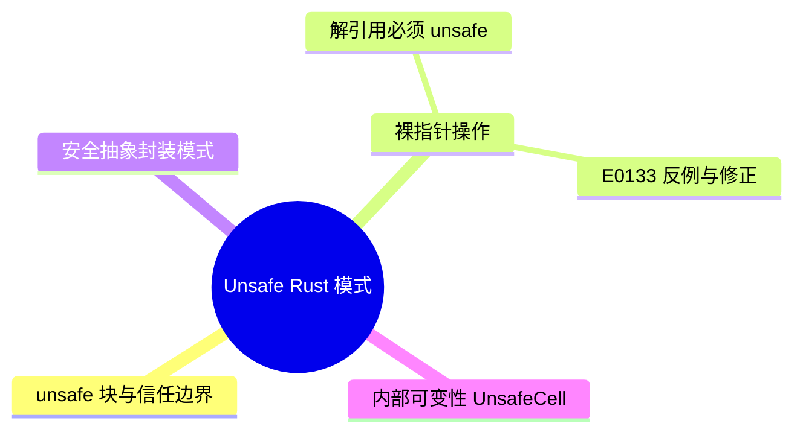

> **内容分级**: [专家级]
> **受众**: [专家]
> **前置概念**: [Unsafe Rust](01_unsafe.md)
> **后置概念**: [Unsafe Rust 安全编程](01_unsafe.md)

# Unsafe Rust 模式：安全抽象的核心技术

> **EN**: Unsafe Rust
> **Summary**: Redirect stub for Unsafe Rust patterns; authoritative content is in 03_unsafe.md.
> **状态**: 已重定向
> **说明**: 本文件内容与 [`concept/03_advanced/02_unsafe/01_unsafe.md`](01_unsafe.md) 高度重叠。为消除重复、统一权威来源，本文件已作为重定向页保留，全部内容请在 `concept/` 权威文件中查阅。
> **前往权威文件**: [Unsafe Rust 安全编程 — concept/03_advanced/02_unsafe/01_unsafe.md](01_unsafe.md)
> **权威来源**: 本文件为 `concept/` 权威页。
---

> **权威来源**:
> [Rust Reference](https://doc.rust-lang.org/reference/introduction.html),
> [The Rust Programming Language](https://doc.rust-lang.org/book/ch20-01-unsafe-rust.html),
> [Rustonomicon](https://doc.rust-lang.org/nomicon/index.html) ·
> [RustBelt — POPL 2018](https://plv.mpi-sws.org/rustbelt/popl18/) ·
> [O'Hearn — Separation Logic and Shared Mutable Data](https://doi.org/10.1017/S0960129501001003) ·
> [Brown University — Interactive Rust Book](https://rust-book.cs.brown.edu/)
> **Rust 版本**: 1.97.0+ (Edition 2024)

## 认知路径

1. **问题识别**: 识别需要 unsafe 的场景：FFI、裸指针、内联汇编（Inline Assembly）、自定义分配器等。
2. **概念建立**: 理解 unsafe 块、unsafe 函数与 unsafe trait 的契约关系。
3. **机制推理**: 通过需求 ⟹ 安全抽象 ⟹ 安全 API 的定理链组织 unsafe 代码。
4. **边界辨析**: 辨析“unsafe 总是坏的”等反命题，理解 unsafe 是 Rust 系统编程的必要边界。
5. **迁移应用**: 将 unsafe 模式与 Unsafe Rust 权威页、内存模型、FFI 主题链接。

## 反命题

> **反命题 1**: "unsafe 代码总是错误的" ⟹ 不成立。unsafe 是 Rust 提供的合法能力，关键在于维持 soundness 契约。
>
> **反命题 2**: "把 safe 代码放进 unsafe 块可以提升性能" ⟹ 不成立。不必要的 unsafe 不会带来优化，反而增加风险。
>

---

## 国际权威参考 / International Authority References（P1 学术 · P2 生态）

> 依据 `AGENTS.md` §2「对齐网络国际化权威内容」补充：仅追加已验证可达的权威链接，不改动正文事实。

- **P2 生态/社区**: [docs.rs/zerocopy — 生态权威 API 文档](https://docs.rs/zerocopy) · [docs.rs/memmap2 — 生态权威 API 文档](https://docs.rs/memmap2)

---

## ⚠️ 反例与陷阱：unsafe 操作必须在 unsafe 块内

**反例**（rustc 1.97 实测编译失败：E0133）：

```rust,compile_fail
fn main() {
    let x = 1i32;
    let p = &x as *const i32;
    println!("{}", *p);
}
```

解引用裸指针是 unsafe 操作，E0133 强制用 `unsafe {}` 显式圈出信任边界——这是 unsafe 抽象「边界可见」原则的第一道防线。

**修正**：

```rust
fn main() {
    let x = 1i32;
    let p = &x as *const i32;
    unsafe { println!("{}", *p); }
}
```

## 🧭 思维导图（Mindmap）


