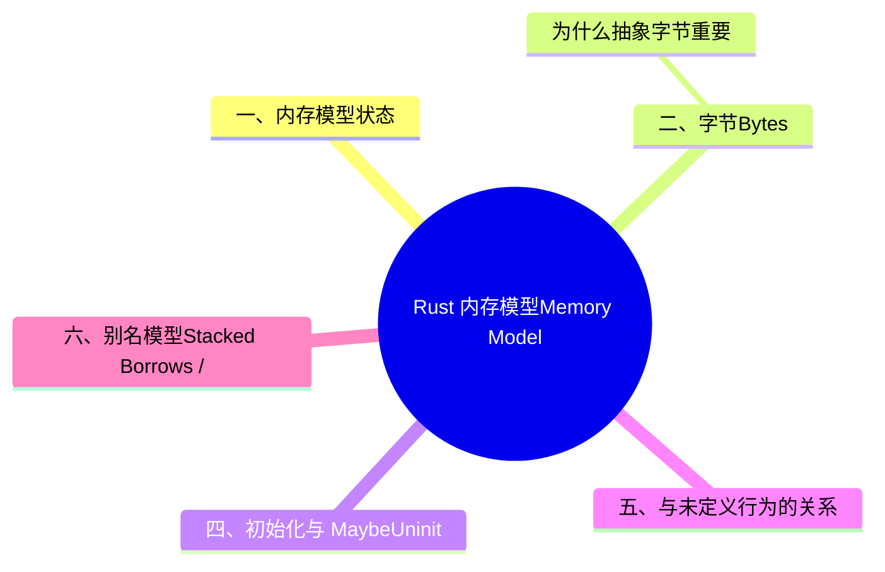

# Rust 内存模型（Memory Model）

> **EN**: Memory Model
> **Summary**: Rust 内存模型的核心概念：抽象字节、初始化字节、未初始化字节与 provenance，及其对未定义行为的影响。 Core concepts of the Rust memory model: abstract bytes, initialized/uninitialized bytes, provenance, and their impact on undefined behavior.
> **Rust 版本**: 1.97.0+ (Edition 2024)
>
> **受众**: [专家]
> **内容分级**: [专家级]
> **Bloom 层级**: L2-L4
> **权威来源**: 本文件为 `concept/` 权威页。
> **目录归属说明**: 本文件虽非 unsafe 语法主题，但内存模型（抽象字节、provenance、未初始化内存）是 unsafe 代码未定义行为（UB）判定的语义基础，与 `02_unsafe/` 的 unsafe 语义强相关，故保留在本目录；其并发内存序维度见 [Atomics and Memory Ordering](../00_concurrency/06_atomics_and_memory_ordering.md)。
> **A/S/P 标记**: **S** — Specification
> **双维定位**: S×Ana — 规范分析
> **前置依赖**:
> [Unsafe Rust](01_unsafe.md) ·
> [Ownership](../../01_foundation/01_ownership_borrow_lifetime/01_ownership.md) ·
> [Behavior Considered Undefined](../../04_formal/01_ownership_logic/06_behavior_considered_undefined.md)
> **后置概念**:
> [Atomics and Memory Ordering](../00_concurrency/06_atomics_and_memory_ordering.md) ·
> [Inline Assembly](../05_inline_assembly/01_inline_assembly.md) ·
> [Tree Borrows](../../04_formal/01_ownership_logic/05_tree_borrows_deep_dive.md)
> **定理链**: Byte Model → Provenance → UB Boundary
> **主要来源**:
> [Rust Reference — Memory Model](https://doc.rust-lang.org/reference/memory-model.html) ·
> [RustBelt — POPL 2018](https://plv.mpi-sws.org/rustbelt/popl18/) ·
> [O'Hearn — Separation Logic and Shared Mutable Data](https://doi.org/10.1017/S0960129501001003) ·
> [Brown University — Interactive Rust Book](https://rust-book.cs.brown.edu/) ·
> [Rust Reference — Behavior Considered Undefined](https://doc.rust-lang.org/reference/behavior-considered-undefined.html)
>
> **来源**: [Rust Reference — Memory Model](https://doc.rust-lang.org/reference/memory-model.html) · [Rust Reference — Behavior Considered Undefined](https://doc.rust-lang.org/reference/behavior-considered-undefined.html)

---

> **跨层回溯**: [内存管理](../../02_intermediate/02_memory_management/01_memory_management.md)

---

## 📑 目录

- [Rust 内存模型（Memory Model）](#rust-内存模型memory-model)
  - [📑 目录](#-目录)
  - [认知路径](#认知路径)
  - [反命题决策树](#反命题决策树)
  - [一、内存模型状态](#一内存模型状态)
  - [二、字节（Bytes）](#二字节bytes)
    - [为什么抽象字节重要](#为什么抽象字节重要)
  - [三、Provenance](#三provenance)
  - [四、初始化与 MaybeUninit](#四初始化与-maybeuninit)
  - [五、与未定义行为的关系](#五与未定义行为的关系)
  - [六、别名模型：Stacked Borrows / Tree Borrows](#六别名模型stacked-borrows--tree-borrows)
  - [七、内存对齐与 Layout](#七内存对齐与-layout)
  - [八、指针与整数转换规则](#八指针与整数转换规则)
  - [九、常见内存模型反模式](#九常见内存模型反模式)
    - [9.1 读取未初始化 padding](#91-读取未初始化-padding)
    - [9.2 通过整数重建指针](#92-通过整数重建指针)
    - [9.3 别名违规](#93-别名违规)
  - [十、实践建议](#十实践建议)
  - [十一、相关概念](#十一相关概念)
  - [过渡段](#过渡段)
  - [反向推理](#反向推理)
  - [Rust 1.97.0 交叉语义](#rust-1970-交叉语义)
    - [1. `cfg(target_has_atomic_primitive_alignment)` 的语义定位](#1-cfgtarget_has_atomic_primitive_alignment-的语义定位)
    - [2. 与类型对齐 / `repr(C)` / `repr(align)` 的正交关系](#2-与类型对齐--reprc--repralign-的正交关系)
    - [3. 与原子指令生成的关系（查询 → codegen 分支）](#3-与原子指令生成的关系查询--codegen-分支)
    - [4. 跨平台边界与旧名废弃说明](#4-跨平台边界与旧名废弃说明)
  - [📋 关键属性](#-关键属性)
  - [🔗 概念关系](#-概念关系)
  - [国际权威参考 / International Authority References（P1 学术 · P2 生态）](#国际权威参考--international-authority-referencesp1-学术--p2-生态)
  - [嵌入式测验（Embedded Quiz）](#嵌入式测验embedded-quiz)
    - [测验 1：抽象字节（🟢 基础）](#测验-1抽象字节-基础)
    - [测验 2：未初始化内存与 MaybeUninit（🟡 进阶）](#测验-2未初始化内存与-maybeuninit-进阶)
    - [测验 3：Provenance 与别名模型（🔴 专家）](#测验-3provenance-与别名模型-专家)
  - [🧭 思维导图（Mindmap）](#-思维导图mindmap)

---

## 认知路径

1. **问题识别**: 为什么 Rust 内存模型值得关注？正确编写 `unsafe` 代码、FFI 和内联汇编（Inline Assembly）都需要理解内存模型边界。
2. **概念建立**: 掌握抽象字节、初始化/未初始化字节、provenance 和别名规则的核心定义。
3. **机制推理**: 通过 ⟹ 定理链将字节模型、provenance 和 UB 边界串联起来。
4. **迁移应用**: 将 Rust 内存模型与原子操作（Atomic Operations）、内联汇编（Inline Assembly）、Tree Borrows 等概念链接，形成跨层知识网络。

---

## 反命题决策树

> **反命题 1**: "Rust 内存模型在所有场景下都完全确定" ⟹ 不成立。Rust 的内存模型目前尚不完整，部分细节仍在 Unsafe Code Guidelines 工作组讨论中。

> **反命题 2**: "忽略 Rust 内存模型的细节也能写出正确 unsafe 代码" ⟹ 不成立。未初始化内存读取、provenance 丢失和别名违规都是常见的 UB 来源。

> **反命题 3**: "其他语言对内存模型的处理方式可以直接迁移到 Rust" ⟹ 不成立。Rust 的所有权（Ownership）、借用（Borrowing）和 provenance 模型具有语言特有形态。

## 一、内存模型状态

> **警告**: Rust 的内存模型目前尚不完整，部分细节尚未最终确定。

Rust 内存模型定义了程序执行期间内存的状态以及哪些操作是合法的。理解内存模型对于编写正确的 `unsafe` 代码至关重要。(Source: [Rust Reference — Memory Model](https://doc.rust-lang.org/reference/memory-model.html))

## 二、字节（Bytes）

Rust 内存的最基本单位是**字节（byte）**。与硬件字节不同，Rust 使用一种**抽象字节**，可以区分硬件字节无法区分的状态：(Source: [Unsafe Code Guidelines — Memory Model](https://rust-lang.github.io/unsafe-code-guidelines/))

- **已初始化字节（initialized byte）**: 包含一个 `u8` 值，以及可选的 provenance。
- **未初始化字节（uninitialized byte）**: 不包含确定值。

> 注意：上述列表尚未保证穷尽，未来内存模型可能引入更多字节状态。

### 为什么抽象字节重要

抽象字节的区分直接影响程序是否存在未定义行为（UB）。例如：

- 读取未初始化内存是 UB（除 `union` 字段和结构体（Struct） padding 外）。
- 指针的 provenance 决定了解引用（Reference）是否合法。

## 三、Provenance

**Provenance** 是指针值携带的"来源"信息，说明它指向哪个分配（allocation）。Rust 编译器利用 provenance 进行优化并判断指针使用的合法性。(Source: [Rust Reference — Memory Model](https://doc.rust-lang.org/reference/memory-model.html#provenance))

关键规则：

- 将带有 provenance 的指针转译为整数再转回指针，可能丢失 provenance 信息。
- 在 const 上下文中，指针 provenance 的重组受到严格限制。

```rust,ignore
// 危险：可能丢失 provenance
let ptr: *mut u8 = alloc(layout);
let addr = ptr as usize;
let restored = addr as *mut u8; // provenance 可能无效
```

## 四、初始化与 MaybeUninit

`MaybeUninit<T>` 是处理未初始化内存的核心类型：(Source: [Rust Reference — MaybeUninit](https://doc.rust-lang.org/reference/introduction.html#maybeuninit), [std::mem::MaybeUninit](https://doc.rust-lang.org/std/mem/union.MaybeUninit.html))

```rust
use std::mem::MaybeUninit;

let mut x: MaybeUninit<i32> = MaybeUninit::uninit();
x.write(42);
let val = unsafe { x.assume_init() };
```

| 操作 | 安全/Unsafe | 说明 |
|:---|:---|:---|
| `MaybeUninit::uninit()` | Safe | 创建未初始化值 |
| `write()` | Safe | 写入值 |
| `assume_init()` | Unsafe | 断言已初始化，读取值 |
| `assume_init_ref()` | Unsafe | 获取已初始化引用（Reference） |

## 五、与未定义行为的关系

内存模型与 UB 清单紧密相关：

- 访问悬垂指针指向的内存是 UB。
- 访问未初始化字节（除允许场景外）是 UB。
- 破坏指针别名规则是 UB。

参见 [Behavior Considered Undefined](../../04_formal/01_ownership_logic/06_behavior_considered_undefined.md) 获取完整 UB 清单。

## 六、别名模型：Stacked Borrows / Tree Borrows

Rust 正在从 Stacked Borrows 向 Tree Borrows 演进，作为内存模型的别名规则部分：

| 模型 | 特点 |
|:---|:---|
| Stacked Borrows | 基于栈的借用（Borrowing）权限追踪，严格但限制较多 |
| Tree Borrows | 基于树的权限模型，对更多合法 unsafe 模式更宽容 |

Tree Borrows 详见 [Tree Borrows](../../04_formal/01_ownership_logic/05_tree_borrows_deep_dive.md)。

## 七、内存对齐与 Layout

Rust 内存模型规定了类型的对齐（alignment）和大小（size）：

```rust
use std::alloc::{alloc, dealloc, Layout};

unsafe {
    let layout = Layout::new::<u64>();
    let ptr = alloc(layout) as *mut u64;
    if ptr.is_null() {
        panic!("allocation failed");
    }
    ptr.write(0xDEAD_BEEF);
    assert_eq!(*ptr, 0xDEAD_BEEF);
    dealloc(ptr as *mut u8, layout);
}
```

| 概念 | 说明 |
|:---|:---|
| `size_of::<T>()` | 类型占用字节数 |
| `align_of::<T>()` | 类型对齐要求 |
| `Layout` | 分配大小与对齐的组合 |
| `offset` | 字段在结构体（Struct）中的偏移 |

## 八、指针与整数转换规则

指针与整数的互转是 `unsafe` 代码中 provenance 丢失的主要来源：

```rust
let x = 42u64;
let ptr = &x as *const u64;
let addr = ptr as usize;

// 危险：round-trip 可能丢失 provenance
let maybe_dangling = addr as *const u64;
```

| 转换 | 结果 | 风险 |
|:---|:---|:---|
| `*const T -> usize` | 获取地址 | 丢失 provenance |
| `usize -> *const T` | 创建裸指针 | 无有效 provenance |
| `*const T -> *const U` | 类型转换 | provenance 保留，但需保证对齐 |

## 九、常见内存模型反模式

本节盘点内存模型层面的三个经典反模式，每个都是 Miri 可检测的 UB：

- **读取未初始化 padding（9.1）**：结构体填充字节无定义值——`transmute` 整个结构体到字节数组读取 padding 是 UB（即使「只是想看看」）；正确做法是逐字段读取或 `#[repr(C, packed)]`（后者引入未对齐字段的新问题）；
- **通过整数重建指针（9.2）**：`ptr as usize` 再 `usize as *const T`——丢失 provenance（来源），strict provenance 模型下重建的指针解引用是 UB；正确做法是 `with_addr`/`map_addr`（1.84+）或 `expose_provenance`（声明「我接受地址猜测」）；
- **别名违规（9.3）**：`&mut` 存在期间通过裸指针副本写入同一内存——Stacked/Tree Borrows 模型直接判定 UB；「先转裸指针再安全使用」的直觉是错的：从 `&mut` 派生的裸指针继承其独占义务。

检测纪律：含 `unsafe` 的代码至少跑一次 `cargo miri test`——这三类反模式 Miri 全部可检测，无 Miri 的 unsafe 审查是不完整的。

### 9.1 读取未初始化 padding

```rust,compile_fail
#[repr(C)]
struct WithPadding {
    a: u8,
    b: u32,
}

unsafe {
    let s: WithPadding = std::mem::zeroed();
    let bytes = std::slice::from_raw_parts(
        &s as *const _ as *const u8,
        std::mem::size_of::<WithPadding>()
    );
    // 读取 bytes[1..4]（padding）是 UB！
}
```

### 9.2 通过整数重建指针

```rust,ignore
let v = vec![1, 2, 3];
let ptr = v.as_ptr();
let addr = ptr as usize;
drop(v);
// 此时 addr 对应的分配已释放
let bad = addr as *const i32; // UB if dereferenced
```

### 9.3 别名违规

```rust,compile_fail
let mut x = 0;
let r1 = &mut x as *mut i32;
let r2 = &mut x as *mut i32;
unsafe {
    *r1 = 1;
    *r2 = 2; // 如果 r1 和 r2 同时使用，可能违反别名规则
}
```

## 十、实践建议

1. **避免读取未初始化内存**: 使用 `MaybeUninit<T>` 明确表示可能未初始化的值。
2. **谨慎处理 provenance**: 避免在 `unsafe` 代码中将指针与整数随意互转。
3. **关注模型演进**: Rust 内存模型仍在完善，重要代码应跟踪 Unsafe Code Guidelines 和 Miri 的更新。
4. **使用 Miri 测试**: Miri 是检测内存模型违规的重要工具。
5. **优先使用安全抽象**: 如 `Vec`、`Box`、`UnsafeCell` 等，它们已封装内存模型细节。

```bash
cargo miri test（需每日构建版工具链）
```

## 十一、相关概念

| 概念 | 关系 |
|:---|:---|
| [Behavior Considered Undefined](../../04_formal/01_ownership_logic/06_behavior_considered_undefined.md) | 内存模型定义了 UB 的边界 |
| [Tree Borrows](../../04_formal/01_ownership_logic/05_tree_borrows_deep_dive.md) | 别名模型是内存模型的一部分 |
| [Atomics and Memory Ordering](../00_concurrency/06_atomics_and_memory_ordering.md) | 并发内存语义依赖内存模型 |
| [Inline Assembly](../05_inline_assembly/01_inline_assembly.md) | 内联汇编必须遵守内存模型约束 |
| [Unsafe Rust](01_unsafe.md) | 内存模型主要约束 unsafe 代码 |
| [Panic](../../02_intermediate/03_error_handling/03_panic.md) | panic 时的栈展开必须保持内存安全（Memory Safety） |

---

> **权威来源**: [Rust Reference — Memory Model](https://doc.rust-lang.org/reference/memory-model.html) · [Rust Reference — Behavior Considered Undefined](https://doc.rust-lang.org/reference/behavior-considered-undefined.html) · [RustBelt — POPL 2018](https://plv.mpi-sws.org/rustbelt/popl18/) · [Unsafe Code Guidelines](https://rust-lang.github.io/unsafe-code-guidelines/)

## 过渡段

> **过渡**: 从抽象字节模型过渡到初始化与 provenance，可以理解 Rust 内存模型如何在底层区分“值”与“来源”。
>
> **过渡**: 从 provenance 过渡到 UB 边界，可以建立“合法操作必须保持指针来源”的直觉。
>
> **过渡**: 从 UB 边界过渡到 Miri 等检测工具，可以形成“规范—违反—验证”的闭环。
>

## 反向推理

> **反向推理**: Miri 报告未定义行为 ⟸ 说明代码中存在未初始化读取、provenance 丢失或别名违规。
>
> **反向推理**: unsafe 代码在升级 Rust 版本后行为变化 ⟸ 说明之前依赖了未规范化的内存模型细节。
>

---

## Rust 1.97.0 交叉语义

> **适用版本**: Rust 1.97.0+ (Edition 2024)
> **交叉域**: 内存模型（Memory Model）× 类型布局（Type Layout）× 原子指令生成（Atomics）× 目标平台（Target）
> **审计出处**: `reports/GLOBAL_SEMANTIC_CRITICAL_AUDIT_2026_07_11.md` §2.4、§4 P2-2 缺口 #3
> **本小节性质**: 交叉语义补充，**只增不删**；原有字节/provenance/对齐（§二–§八）保持不变。

### 1. `cfg(target_has_atomic_primitive_alignment)` 的语义定位

Rust 1.97.0 稳定了条件编译标志 `cfg(target_has_atomic_primitive_alignment)`。它在 release notes 中仅被列为 *Language* 类稳定项 `"Stabilize cfg(target_has_atomic_primitive_alignment)"`；版本页 §2.4 给出其用途：**判断目标平台上原子类型的对齐是否等于其对应原始整数类型的对齐**。

```rust,ignore
// edition = "2024", rust = "1.97" —— 作为“目标能力查询”使用的 cfg
#[cfg(target_has_atomic_primitive_alignment = "64")]
fn assumes_native_atomic64_alignment() {
    // 该分支仅在“64 位原子类型与 u64 对齐相同”的目标上编译
}

#[cfg(not(target_has_atomic_primitive_alignment = "64"))]
fn assumes_native_atomic64_alignment() {
    // 其它目标：不能假设 64 位原子按 u64 自然对齐，需走保守路径
}
```

**与本文 §七（内存对齐与 Layout）的关系**：本 cfg 是一个**编译期目标能力查询**，它**不**改变任何类型的 `size_of`/`align_of`/字段偏移——那些仍由类型布局规则（本文 §七、[`42_type_layout.md`](../../04_formal/05_rustc_internals/08_type_layout.md) §二 “Size 与 Alignment”）决定。它只回答“在这个 target 上，原子类型的对齐保证是什么”，供 `unsafe`/可移植代码在编译期选择实现路径。

### 2. 与类型对齐 / `repr(C)` / `repr(align)` 的正交关系

内存模型要求：对原子类型的访问必须满足其对齐要求，否则为未定义行为（与本文 §二 “读取未初始化/未对齐是 UB”、§八 “指针转换需保证对齐” 同源）。三类机制职责不同，**不可混淆**：

| 机制 | 作用层 | 是否改变类型布局 | 说明 |
|:---|:---|:---:|:---|
| `#[repr(align(N))]` | 类型布局 | ✅ 提高对齐到至少 `N` | 主动**抬高**某类型的对齐（[`42_type_layout.md`](../../04_formal/05_rustc_internals/08_type_layout.md) §三 `#[repr(align(n))]`） |
| `#[repr(C)]` | 类型布局 | ✅ 固定字段顺序 + C-ABI 对齐 | 对齐遵循目标 C ABI；**不**单独保证“原子自然对齐”（同页 §三 `#[repr(C)]`） |
| `cfg(target_has_atomic_primitive_alignment)` | 编译期查询 | ❌ 不改变布局 | 仅**查询**目标对齐保证，用于 codegen/分支选择 |

```rust,ignore
// edition = "2024", rust = "1.97" —— repr(align) 抬高对齐；cfg 查询目标；二者正交
use std::sync::atomic::AtomicU64;

#[repr(align(16))]            // 主动把对齐抬高到 16 字节（布局变化）
struct Aligned16(AtomicU64);

#[repr(C)]                     // 字段顺序按 C ABI；对齐按目标 C ABI（≠ 必然等于原子自然对齐）
struct CRepr {
    a: u8,
    b: AtomicU64,
}

fn align_check() {
    assert_eq!(core::mem::align_of::<Aligned16>(), 16);
    // 是否能对 Aligned16.0 使用依赖自然对齐的原子指令，由 cfg 在编译期回答：
    let _ = cfg!(target_has_atomic_primitive_alignment = "64");
    let _ = core::mem::align_of::<CRepr>();
}
```

> **边界**：`#[repr(align(N))]` 可以把对齐**抬高**到超过原子自然对齐，这总是安全的（更强对齐 ⟹ 仍满足较弱要求）；危险的是反过来——当一个值的**实际对齐低于**原子操作所需对齐时对其执行原子操作，是 UB（本文 §八）。`cfg(...)` 的用途正是让代码在“目标不保证自然对齐”时**拒绝或改走保守路径**，而非“修复”对齐。

### 3. 与原子指令生成的关系（查询 → codegen 分支）

原子指令通常要求操作数**自然对齐**：例如多字节原子的 load/store/CAS 需要地址按操作数宽度对齐；16 字节原子（如 `AtomicU128` 在支持的目标上）可能要求 16 字节对齐；32 位目标上的 64 位原子是否可由单条指令完成，取决于该目标的对齐与指令集。当对齐**不被保证**时，后端要么插入对齐检查/屏障，要么退回到 `compiler_rt` 的 `__atomic_*` libcall，要么在编译期拒绝。`cfg(target_has_atomic_primitive_alignment)` 让可移植代码**在编译期**区分这些情形（原理见 [`11_atomics_and_memory_ordering.md`](../00_concurrency/06_atomics_and_memory_ordering.md) 已引用的 LLVM Atomic Instructions；该页 §Rust 1.97.0 交叉语义 给出 codegen 侧的对称说明）。

> ⚠ **需专家复核**：本 cfg 的**取值域**（除版本页示例 `"64"` 外还可取哪些值，如按位宽 `"8"/"16"/"32"/"128"` 或 `"ptr"` 形式）在 release notes 与版本页中**未完整列出**；上例沿用版本页 §2.4 的 `"64"` 写法，具体可取值以 Rust Reference — Conditional compilation / 该 cfg 的稳定化文档为准。

### 4. 跨平台边界与旧名废弃说明

- **跨平台边界（原则）**：在多数 64 位主流目标上，原子类型对齐与对应原始整数对齐一致；但在部分 32 位或特殊目标上，某宽度原子的**要求对齐**可能高于同宽度原始整数的“惯用”对齐，或高于指针宽度——这正是该 cfg 存在的理由。
- ⚠ **需专家复核**：具体“哪些目标上 primitive 对齐 ≠ 指针宽度对齐”的目标清单，release notes 与版本页**未给出**；本小节不枚举目标名，避免臆测。需要精确清单时请查阅 Rust Reference — Conditional compilation 与各 target 的 `target_has_atomic_*` 定义。
- **旧名 `target_has_atomic_equal_alignment` 的废弃**：任务背景（审计 §2.4/P2-2）指出该 cfg 曾用名 `target_has_atomic_equal_alignment`，1.97 起稳定为 `target_has_atomic_primitive_alignment`，旧名废弃。⚠ **需专家复核**：release notes 与版本页**未提及**该旧名及其废弃时间表；旧名/废弃说法当前仅来自审计背景，未在两类权威来源中核对到，使用前请以 Rust Reference 与对应稳定化 PR 为准。

> **来源**: [Rust 1.97.0 Release Notes — Language](https://releases.rs/docs/1.97.0/) · [Rust Reference — Conditional compilation](https://doc.rust-lang.org/reference/conditional-compilation.html) · [Rustonomicon — Atomics](https://doc.rust-lang.org/nomicon/atomics.html) · 版本页 [`rust_1_97_stabilized.md`](../../07_future/00_version_tracking/rust_1_97_stabilized.md)（§2.4）
> **交叉反链**: [`feature_domain_matrix_197.md`](../../07_future/00_version_tracking/feature_domain_matrix_197.md) · [`migration_197_decision_tree.md`](../../07_future/00_version_tracking/migration_197_decision_tree.md) · [`42_type_layout.md`](../../04_formal/05_rustc_internals/08_type_layout.md) · [`11_atomics_and_memory_ordering.md`](../00_concurrency/06_atomics_and_memory_ordering.md)

---

## 📋 关键属性

| 属性 | 取值 / 判定 | 依据 |
|---|---|---|
| 规范化状态 | Rust 内存模型仍在规范化进程中，尚未完全定稿 | 本文 §一 |
| 抽象字节 | 内存以抽象字节建模，附带初始化状态与 provenance 元数据 | 本文 §二 |
| Provenance | 指针携带来源信息；整数→指针转换丢失 provenance 属反模式 | 本文 §三、§八 |
| 未初始化内存 | `MaybeUninit` 是合法处理未初始化内存的唯一途径 | 本文 §四 |
| 别名模型 | Stacked Borrows → Tree Borrows 演进 | 本文 §六 |

## 🔗 概念关系

- **上位（is-a）**：[Unsafe](01_unsafe.md) 的语义基础层。
- **下位（实例）**：抽象字节、provenance、`MaybeUninit`、别名模型、对齐与 layout。
- **组合**：与 [原子操作与内存序](../00_concurrency/06_atomics_and_memory_ordering.md)、[Unsafe 边界全景](02_unsafe_boundary_panorama.md) 组合。
- **依赖**：依赖 [值与引用语义](../../01_foundation/03_values_and_references/02_value_vs_reference_semantics.md)。

---

## 国际权威参考 / International Authority References（P1 学术 · P2 生态）

> 依据 `AGENTS.md` §2「对齐网络国际化权威内容」补充：仅追加已验证可达的权威链接，不改动正文事实。

- **P2 生态/社区**: [docs.rs/embedded-hal — 生态权威 API 文档](https://docs.rs/embedded-hal) · [docs.rs/libc — 生态权威 API 文档](https://docs.rs/libc)

---

## 嵌入式测验（Embedded Quiz）

> W3-b 补充（2026-07-12）：本页原无嵌入式测验，按四级题型规范补 3 题（🟢🟡🔴 各 1 题，`<details>` 折叠答案），内容与本页正文严格一致。

### 测验 1：抽象字节（🟢 基础）

Rust 内存模型中的"抽象字节"可以区分哪些状态？

- A. 仅有 0–255 的硬件字节值
- B. 已初始化字节（包含 `u8` 值及可选的 provenance）与未初始化字节（不包含确定值）
- C. 堆字节与栈字节
- D. 只读字节与可写字节

<details>
<summary>✅ 答案</summary>

**B 正确**。按本页「二、字节（Bytes）」：与硬件字节不同，Rust 使用**抽象字节**，可区分已初始化字节（包含一个 `u8` 值，以及可选的 provenance）与未初始化字节（不包含确定值）。注意该列表尚未保证穷尽，未来内存模型可能引入更多字节状态。

</details>

---

### 测验 2：未初始化内存与 MaybeUninit（🟡 进阶）

关于未初始化内存，下列说法正确的是？

- A. 读取未初始化内存总是安全的
- B. 读取未初始化内存是 UB（除 `union` 字段和结构体 padding 外）；`MaybeUninit<T>` 是处理未初始化内存的核心类型
- C. `MaybeUninit::assume_init()` 是安全函数
- D. 未初始化字节的值固定为 0

<details>
<summary>✅ 答案</summary>

**B 正确**。按本页「二、字节」与「四、初始化与 MaybeUninit」：读取未初始化内存是 UB（除允许场景外）；`MaybeUninit::uninit()` 与 `write()` 是 Safe 操作，而 `assume_init()` / `assume_init_ref()` 是 **Unsafe**——断言已初始化，证明责任在程序员（C 错）。D 错：未初始化字节不包含确定值。

</details>

---

### 测验 3：Provenance 与别名模型（🔴 专家）

关于指针 provenance 与别名模型演进，下列说法正确的是？

- A. 指针转整数再转回总能完整保留 provenance
- B. provenance 是指针值携带的"来源"信息（指向哪个分配）；Rust 正从 Stacked Borrows 向 Tree Borrows 演进，后者对更多合法 unsafe 模式更宽容
- C. Rust 内存模型已完全确定，不会再变化
- D. 别名规则只影响安全 Rust，与 `unsafe` 无关

<details>
<summary>✅ 答案</summary>

**B 正确**。按本页「三、Provenance」：provenance 说明指针指向哪个分配，将带 provenance 的指针转译为整数再转回**可能丢失** provenance（A 错）。「六、别名模型」：Rust 正从 Stacked Borrows（基于栈的借用权限追踪，严格但限制较多）向 Tree Borrows（基于树的权限模型，对更多合法 unsafe 模式更宽容）演进。C 错：本页明确警告"Rust 的内存模型目前尚不完整，部分细节尚未最终确定"。

</details>

---

> **Rust 1.91 起**：`ptr::with_exposed_provenance(_mut)` 稳定，为整数↔指针往返提供显式 provenance 暴露路径；**1.96 起**「valid for read/write」定义重构（排除 null，由各方法单独声明例外），统一指针有效性契约。详见 [1.91 版本页](../../07_future/00_version_tracking/rust_1_91_stabilized.md) 与 [1.96 版本页](../../07_future/00_version_tracking/rust_1_96_stabilized.md)（特性矩阵节）。

## 🧭 思维导图（Mindmap）


