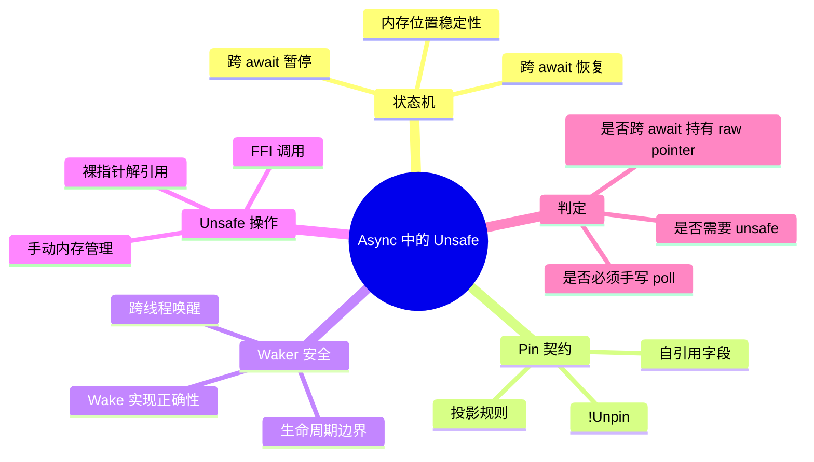
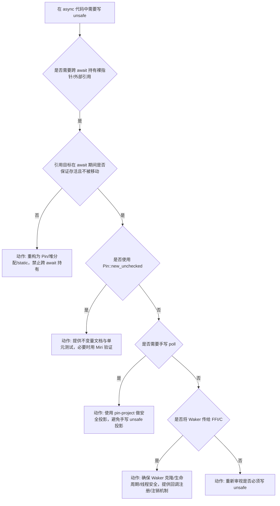

> **内容分级**: [专家级]
>
> **Rust 版本**: 1.97.0+ (Edition 2024)
> **本节关键术语**: async · unsafe · Pin · Waker · 自引用（Reference） · 契约 — [完整对照表](../../00_meta/01_terminology/01_terminology_glossary.md)

# Async 中的 Unsafe：异步上下文的安全契约

> **EN**: Unsafe in Async Contexts
> **Summary**: Unsafe operations inside async Rust: how the async state machine, Pin contract, and Waker safety interact with raw pointers, FFI, and manual memory management. Covers the soundness boundaries that are not enforced by the borrow checker across await points.
> **受众**: [专家]
> **Bloom 层级**: L4-L5
> **权威来源**: 本文件为 `concept/` 权威页。
> **A/S/P 标记**: **S+P** — Structure + Procedure
> **双维定位**: C×Eva — 评判 async 与 unsafe 交叉处的契约充分性
> **定位**: 系统分析 async/await 状态机与 unsafe 操作的交叉语义：await 点两侧什么保持有效、Pin 如何约束自引用状态机、Waker 如何跨越 safe/unsafe 边界、手写 poll 时哪些不变量必须由程序员保证。
> **前置概念**: [Async/Await](../01_async/01_async.md) · [Pin 与 Unpin](../01_async/08_pin_unpin.md) · [Unsafe Rust](01_unsafe.md) · [Waker 契约](../01_async/12_waker_contract_deep_dive.md) · [Traits](../../02_intermediate/00_traits/01_traits.md)
> **后置概念**: [Async FFI Boundary](../04_ffi/04_async_ffi_boundary.md) · [Async Boundary Panorama](../01_async/06_async_boundary_panorama.md)

---

> **来源**:
> [Rust Reference — Async Blocks](https://doc.rust-lang.org/reference/expressions/block-expr.html#async-blocks) ·
> [Rust Reference — Unsafe Rust](https://doc.rust-lang.org/reference/unsafe-keyword.html) ·
> [RFC 2349 — Pin](https://rust-lang.github.io/rfcs/2349-pin.html) ·
> [RFC 2394 — async/await](https://rust-lang.github.io/rfcs/2394-async_await.html) ·
> [Rust Async Book — Executing Futures](https://rust-lang.github.io/async-book/02_execution/02_future.html)

---

## 🧠 知识结构图



## 📑 目录

- [Async 中的 Unsafe：异步上下文的安全契约](#async-中的-unsafe异步上下文的安全契约)
  - [🧠 知识结构图](#-知识结构图)
  - [📑 目录](#-目录)
  - [一、权威定义](#一权威定义)
  - [二、核心交互矩阵](#二核心交互矩阵)
  - [三、Await 点作为安全边界](#三await-点作为安全边界)
    - [3.1 边界陈述](#31-边界陈述)
    - [3.2 反例：跨 await 悬垂裸指针](#32-反例跨-await-悬垂裸指针)
  - [四、Pin 与自引用状态机](#四pin-与自引用状态机)
    - [4.1 边界陈述](#41-边界陈述)
    - [4.2 反例：手写 poll 破坏 Pin 契约](#42-反例手写-poll-破坏-pin-契约)
  - [五、Waker 的跨边界契约](#五waker-的跨边界契约)
    - [5.1 边界陈述](#51-边界陈述)
    - [5.2 反例：FFI 回调中错误唤醒](#52-反例ffi-回调中错误唤醒)
  - [六、判定树](#六判定树)
  - [七、反例与失效模式](#七反例与失效模式)
  - [八、相关概念](#八相关概念)

---

## 一、权威定义

> **Rust Reference**: An async block is a variant of a block expression which, when evaluated, executes the body of the block expression and returns a value of type `impl Future<Output = T>`.
> **Rust Reference**: The `unsafe` keyword is used on a block to indicate it contains operations that would be invalid outside the block, and that the programmer is responsible for ensuring the operations inside the block are valid.

**Async + Unsafe 交叉定义**：在异步状态机中执行编译器无法验证其安全性的操作。这些操作通常涉及：

- 跨 `.await` 点保持裸指针或外部引用有效；
- 在 `poll` 中解引用自引用字段；
- 将 `Waker` 传递给外部（FFI/C）代码并保证其唤醒语义；
- 在 unsafe 块中创建或固定 Future，并自行维护 Pin 契约。

---

## 二、核心交互矩阵

| async 机制 | unsafe 关切 | 安全责任归属 |
|---|---|---|
| `async fn` 状态机 | 状态机字段可能自引用 | 编译器生成安全代码；手写 poll 时由程序员保证 |
| `.await` 挂起点 | 挂起时栈帧变为状态机堆内存 | 运行时（Runtime）/executor 保证状态机不被移动（Pin） |
| `Pin<&mut Self>` in `poll` | 自引用字段地址稳定性 | 调用 poll 的代码保证；投影时由实现者保证 |
| `Waker` | 可能跨线程、跨 FFI 传递 | 使用方保证 wake 只发生一次且目标仍存活 |
| `unsafe` 块内部 `.await` | 块内建立的临时不变量跨 await 可能失效 | 程序员保证每次恢复后不变量仍成立 |

---

## 三、Await 点作为安全边界

### 3.1 边界陈述

`unsafe` 块在同步代码中是一个**词法作用域**：块结束时，块内建立的临时不变量可以丢弃。但在 async 块中，`unsafe` 块可能跨越 `.await`：

```rust
async fn unsound_across_await() {
    let raw: *const u8 = /* 某个有效指针 */;
    unsafe {
        // 此时 raw 有效
        something().await;
        // 恢复执行后，raw 是否仍有效？
        let _ = *raw;
    }
}
```

**判定条件**：

1. 如果 `raw` 指向的数据在 `await` 期间由 Rust 的所有权（Ownership）/借用（Borrowing）系统保护（如 `&u8`），则安全；
2. 如果 `raw` 指向的数据可能在 `await` 期间被释放、移动或重新分配，则解引用 `raw` 是 UB。

### 3.2 反例：跨 await 悬垂裸指针

```rust,ignore
use std::pin::Pin;

async fn dangling_across_await() {
    let mut local = String::from("hello");
    let raw = local.as_ptr();

    something().await; // local 可能被 drop/move，raw 悬垂

    unsafe {
        // UB: raw 可能已悬垂
        let _ = *raw;
    }
}
```

**修正**：不要跨 await 持有指向栈局部变量的裸指针；应使用 `Pin`、堆分配或 `'static` 数据。

---

## 四、Pin 与自引用状态机

### 4.1 边界陈述

`async fn` 编译后的状态机可能包含自引用字段。`Future::poll` 要求 `self: Pin<&mut Self>`，即调用方必须保证状态机在内存中固定。

在 unsafe 代码中：

- **可以**使用 `Pin::new_unchecked` 创建 Pin，但必须保证目标值不会被移动；
- **禁止**在 `!Unpin` 类型上执行可能移动状态机的操作；
- 对自引用字段的投影必须使用 `pin-project` 或等价 unsafe 投影，并保证投影后的指针合法。

### 4.2 反例：手写 poll 破坏 Pin 契约

```rust
use std::future::Future;
use std::pin::Pin;
use std::task::{Context, Poll};

struct BadFuture {
    data: String,
    ptr: *const String, // 自引用：指向 data
}

impl Future for BadFuture {
    type Output = ();

    // 危险：mut self 允许重新赋值 self，可能破坏 Pin 不变量
    fn poll(mut self: Pin<&mut Self>, _cx: &mut Context<'_>) -> Poll<Self::Output> {
        self.ptr = &self.data;
        Poll::Ready(())
    }
}
```

**修正**：

```rust,ignore
fn poll(self: Pin<&mut Self>, _cx: &mut Context<'_>) -> Poll<Self::Output> {
    let this = unsafe { self.get_unchecked_mut() };
    this.ptr = &this.data;
    // 必须保证 this 不会被移动
    Poll::Ready(())
}
```

---

## 五、Waker 的跨边界契约

### 5.1 边界陈述

`Waker` 是 async 运行时的核心回调机制。当 unsafe/FFI 代码持有 `Waker` 时，必须保证：

1. **`Waker::wake` 只调用一次**（或按 `Clone` 计数调用）；
2. **`Waker` 指向的任务在 wake 发生时仍存活**；
3. **`Waker` 可以安全跨线程传递**（若使用 `Send` bound）。

### 5.2 反例：FFI 回调中错误唤醒

```rust,ignore
extern "C" fn c_callback(waker: *const Waker) {
    unsafe {
        // 危险：未验证 waker 是否仍有效
        (*waker).wake_by_ref();
    }
}
```

**风险**：

- `waker` 可能已被释放；
- 可能并发调用导致 use-after-free；
- 未克隆的 Waker 被 wake_by_ref 后再次使用。

**修正**：使用 `Waker::clone` 创建独立所有权，或使用 Arc<Waker> 等线程安全包装。

---

## 六、判定树



---

## 七、反例与失效模式

| 失效模式 | 根因 | 检测手段 | 修复方向 |
|---|---|---|---|
| 跨 await 悬垂裸指针 | await 期间局部变量被释放 | Miri / 代码审查 | 使用 Pin 或堆分配 |
| 手写 poll 移动自引用状态机 | `Pin<&mut Self>` 使用错误 | 编译错误 E0277 / Miri | 使用 pin-project |
| FFI 回调 use-after-wake | Waker 生命周期（Lifetimes）管理错误 | 运行时崩溃 / Miri | 克隆 Waker，建立注册/注销契约 |
| `Pin::new_unchecked` 后值被移动 | 违反 Pin 契约 | UB（可能无立即症状） | 保证目标内存固定 |

---

## 八、相关概念

- [Async/Await](../01_async/01_async.md)
- [Pin 与 Unpin](../01_async/08_pin_unpin.md)
- [Unsafe Rust](01_unsafe.md)
- [Waker 契约深度解析](../01_async/12_waker_contract_deep_dive.md)
- [Async FFI Boundary](../04_ffi/04_async_ffi_boundary.md)
- [Async 边界全景](../01_async/06_async_boundary_panorama.md)

---

> **权威来源**:
> [Rust Reference — Async Blocks](https://doc.rust-lang.org/reference/expressions/block-expr.html#async-blocks) ·
> [Rust Reference — Unsafe Rust](https://doc.rust-lang.org/reference/unsafe-keyword.html) ·
> [RFC 2349 — Pin](https://rust-lang.github.io/rfcs/2349-pin.html) ·
> [Rust Async Book — Executing Futures](https://rust-lang.github.io/async-book/02_execution/02_future.html)
