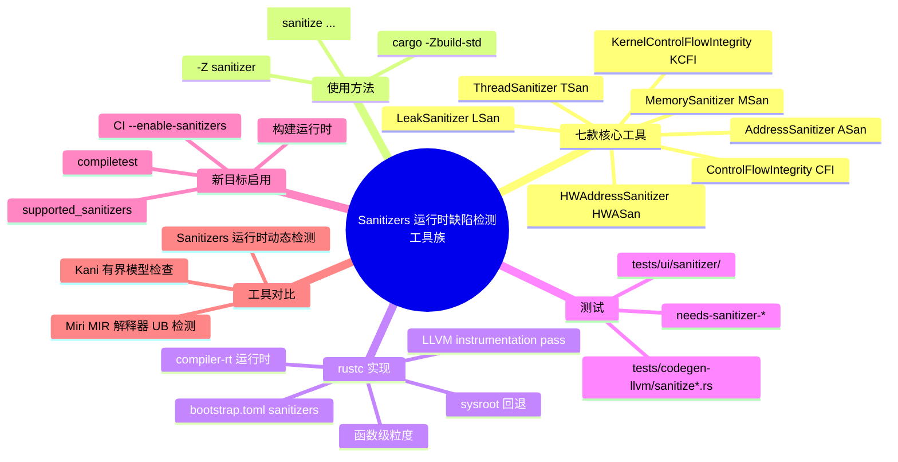

> **内容分级**: [专家级]
>
> **本节关键术语**: Sanitizer · AddressSanitizer · ControlFlowIntegrity · HWAddressSanitizer · KernelControlFlowIntegrity · LeakSanitizer · MemorySanitizer · ThreadSanitizer — [完整对照表](../../00_meta/01_terminology/01_terminology_glossary.md)

# Sanitizers：运行时缺陷检测工具族

> **EN**: Sanitizers: Runtime Bug-Detection Tool Family
> **Summary**: Rust sanitizers are LLVM-based runtime instrumentation tools that detect memory errors, uninitialized reads, data races, leaks, and control-flow hijacking. They complement static verification by operating on the compiled binary and require nightly/unstable `-Z sanitizer=...` flags.
> **Rust 版本**: 1.97.0+ (Edition 2024)
>
> **受众**: [专家]
> **Bloom 层级**: L3-L4
> **权威来源**: 本文件为 `concept/` 权威页。
> **A/S/P 标记**: **P+A** — Procedure + Application
> **双维定位**: T×Eva — 工具链与运行时（Runtime）验证
> **定位**: 将 Sanitizers 从“LLVM 黑盒”还原为 unsafe/底层代码审查与 CI 的可选动态检测层。
> **前置概念**:
> [Unsafe Rust](01_unsafe.md) ·
> [Memory Model](06_memory_model.md) ·
> [Memory Management](../../02_intermediate/02_memory_management/01_memory_management.md) ·
> [Behavior Considered Undefined](../../04_formal/01_ownership_logic/06_behavior_considered_undefined.md)
> **后置概念**:
> [Miri](../../04_formal/04_model_checking/08_miri.md) ·
> [Kani](../../04_formal/04_model_checking/09_kani.md)
> **定理链**: Unsafe Contract → UB 清单 → Runtime Instrumentation → Sanitizer Report
> **主要来源**:
> [rustc-dev-guide — Sanitizers support](https://rustc-dev-guide.rust-lang.org/sanitizers.html) ·
> [The Unstable Book — sanitizer](https://doc.rust-lang.org/unstable-book/compiler-flags/sanitizer.html) ·
> [Clang AddressSanitizer](https://clang.llvm.org/docs/AddressSanitizer.html) ·
> [Clang ThreadSanitizer](https://clang.llvm.org/docs/ThreadSanitizer.html) ·
> [Clang MemorySanitizer](https://clang.llvm.org/docs/MemorySanitizer.html) ·
> [Clang ControlFlowIntegrity](https://clang.llvm.org/docs/ControlFlowIntegrity.html)

---

## 📑 目录

- [Sanitizers：运行时缺陷检测工具族](#sanitizers运行时缺陷检测工具族)
  - [📑 目录](#-目录)
  - [一、Sanitizer 概览](#一sanitizer-概览)
    - [1.1 七款核心 Sanitizer](#11-七款核心-sanitizer)
    - [1.2 适用场景速查](#12-适用场景速查)
  - [二、使用方法](#二使用方法)
    - [2.1 基本编译标志](#21-基本编译标志)
    - [2.2 与 `cargo`/`build-std` 联用](#22-与-cargobuild-std-联用)
    - [2.3 函数级开关 `#[sanitize(...)]`](#23-函数级开关-sanitize)
  - [三、rustc 中的实现机制](#三rustc-中的实现机制)
    - [3.1 LLVM 集成总览](#31-llvm-集成总览)
    - [3.2 运行时库与 bootstrap.toml](#32-运行时库与-bootstraptoml)
    - [3.3 代码生成与函数粒度](#33-代码生成与函数粒度)
    - [3.4 链接与 sysroot 回退](#34-链接与-sysroot-回退)
  - [四、测试与 CI](#四测试与-ci)
    - [4.1 codegen 测试](#41-codegen-测试)
    - [4.2 UI 功能测试](#42-ui-功能测试)
    - [4.3 compiletest 指令](#43-compiletest-指令)
  - [五、为新目标启用 Sanitizer](#五为新目标启用-sanitizer)
  - [六、Sanitizers vs Miri vs Kani](#六sanitizers-vs-miri-vs-kani)
    - [6.1 对比矩阵](#61-对比矩阵)
    - [6.2 选型建议](#62-选型建议)
  - [七、来源与延伸阅读](#七来源与延伸阅读)
  - [⚠️ 反命题与边界陷阱](#️-反命题与边界陷阱)
    - [反命题 1：“Sanitizers 能替代 safe Rust / 类型系统”](#反命题-1sanitizers-能替代-safe-rust--类型系统)
    - [反命题 2：“Sanitizers 能发现所有 UB”](#反命题-2sanitizers-能发现所有-ub)
    - [边界陷阱](#边界陷阱)
    - [反例：未执行路径的 UB 漏报](#反例未执行路径的-ub-漏报)
  - [🧭 思维导图（Mindmap）](#-思维导图mindmap)

---

## 一、Sanitizer 概览

> **核心定义**：Sanitizer 是编译器在代码中插入额外运行时检查，以捕获特定类别缺陷的动态检测工具族。Rust 的 sanitizer 支持由 rustc 集成 LLVM 的 instrumentation pass 与 compiler-rt 运行时库共同提供。
>
> **来源**: [rustc-dev-guide — Sanitizers support](https://rustc-dev-guide.rust-lang.org/sanitizers.html)

与 Miri 在 MIR 层解释执行不同，Sanitizers 在**编译后的目标代码**上工作：它们通过插桩（instrumentation）记录内存状态、引用关系或控制流，然后在运行时报告违规。由于依赖 LLVM，它们通常需要 nightly 工具链与 `-Z sanitizer=...` 标志。

### 1.1 七款核心 Sanitizer

| Sanitizer | `-Z sanitizer=` 值 | 检测目标 | 典型缺陷 |
|:---|:---|:---|:---|
| **AddressSanitizer (ASan)** | `address` | 内存错误 | 堆/栈/全局越界、use-after-free、double-free、invalid-free、memory leaks |
| **ControlFlowIntegrity (CFI)** | `cfi` | 控制流完整性 | 间接调用/跳转到达非法目标、类型混淆的攻击面 |
| **HWAddressSanitizer (HWASan)** | `hwaddress` | 硬件辅助内存错误 | 与 ASan 类似，但基于 Armv8 的内存标记扩展（MTE），内存开销更低 |
| **KernelControlFlowIntegrity (KCFI)** | `kcfi` | 内核控制流完整性 | OS 内核中的前向控制流保护 |
| **LeakSanitizer (LSan)** | `leak` | 内存泄漏 | 程序终止时仍可达但未释放的堆分配 |
| **MemorySanitizer (MSan)** | `memory` | 未初始化读取 | 使用未初始化内存（包括传播链） |
| **ThreadSanitizer (TSan)** | `thread` | 数据竞争 | 多线程间无同步的读写冲突 |

> **来源**: [rustc-dev-guide — Sanitizers support](https://rustc-dev-guide.rust-lang.org/sanitizers.html) · [The Unstable Book — sanitizer](https://doc.rust-lang.org/unstable-book/compiler-flags/sanitizer.html)

### 1.2 适用场景速查

```text
内存相关 UB（UAF、OOB、泄漏、未初始化） → ASan / HWASan / LSan / MSan
并发数据竞争                         → TSan
控制流劫持/ROP 防护                  → CFI / KCFI
内核或裸机环境                       → HWASan / KCFI / KASAN（KernelAddressSanitizer）
```

> **注意**：The Unstable Book 将 Sanitizers 分为“测试/模糊测试用”（ASan、HWASan、LSan、MSan、TSan 等）与“可用于生产环境”（CFI、KCFI、DataFlowSanitizer、MemTagSanitizer、SafeStack、ShadowCallStack）。 Rust 1.97.0 的 rustc-dev-guide 主要文档化前七款；其他需在 The Unstable Book 中查看最新支持矩阵。
>
> **来源**: [The Unstable Book — sanitizer](https://doc.rust-lang.org/unstable-book/compiler-flags/sanitizer.html)

---

## 二、使用方法

Sanitizers 目前仍是不稳定工具链特性，需要在 nightly rustc 下通过 `-Z sanitizer=...` 启用，并通常配合 `-Zbuild-std` 重新链接标准库。本节覆盖命令行标志、cargo 联用与函数级开关三种使用方式。

### 2.1 基本编译标志

在 nightly 工具链下，通过 `-Z sanitizer=<name>` 启用：

```bash
rustc -Z sanitizer=address main.rs --target x86_64-unknown-linux-gnu
```

合法的 `<name>` 包括：

```text
address, cfi, hwaddress, kcfi, leak, memory, thread
```

更详细的用户级说明参见 The Unstable Book 的 [`sanitizer`](https://doc.rust-lang.org/unstable-book/compiler-flags/sanitizer.html) 章节。

> **来源**: [rustc-dev-guide — How to use the sanitizers?](https://rustc-dev-guide.rust-lang.org/sanitizers.html#how-to-use-the-sanitizers)

### 2.2 与 `cargo`/`build-std` 联用

由于 sanitizer 运行时需要与 std 一起重新链接，通常配合 `-Zbuild-std` 使用：

```bash
export RUSTFLAGS=-Zsanitizer=address
export RUSTDOCFLAGS=-Zsanitizer=address
cargo build -Zbuild-std --target x86_64-unknown-linux-gnu
```

CFI 因需要 LTO，额外要求链接器与 LTO 标志：

```bash
RUSTFLAGS="-Clinker-plugin-lto -Clinker=clang -Clink-arg=-fuse-ld=lld -Zsanitizer=cfi" \
cargo run -Zbuild-std -Zbuild-std-features --release --target x86_64-unknown-linux-gnu
```

> **来源**: [The Unstable Book — sanitizer](https://doc.rust-lang.org/unstable-book/compiler-flags/sanitizer.html)

### 2.3 函数级开关 `#[sanitize(...)]`

rustc 支持在函数上标记是否对某个 sanitizer 开启或关闭插桩：

```rust,ignore
#[sanitize(address = "off")]
fn hot_path_that_cannot_be_instrumented() {
    // 该函数不会被 ASan 插桩
}
```

取值形式为 `#[sanitize(xyz = "on|off|<other>")]`。因为开关粒度是**函数级**，当相邻函数的决策不一致时，可能需要在 MIR 层或 LLVM 层抑制内联，以避免 instrumentation 边界被悄悄消除。

> **来源**: [rustc-dev-guide — How are sanitizers implemented in rustc?](https://rustc-dev-guide.rust-lang.org/sanitizers.html#how-are-sanitizers-implemented-in-rustc)

---

## 三、rustc 中的实现机制

rustc 本身并不重新实现 sanitizer 的检查逻辑，而是作为 LLVM instrumentation pass 与 compiler-rt 运行时之间的集成层。理解这一机制有助于在自定义目标、自定义 sysroot 或 CI 中调试链接与 codegen 问题。

### 3.1 LLVM 集成总览

除 CFI 外，Rust 的 sanitizer 实现几乎完全依赖 LLVM：

- **编译时**：rustc 将 Rust 源码编译为 LLVM IR，再由 LLVM 的 sanitizer instrumentation pass 在 IR 中插入检查代码。
- **运行时**：插入的代码调用 compiler-rt 提供的运行时库（runtime libraries），由运行时维护影子内存（shadow memory）或同步状态。

 rustc 的角色是 **LLVM 插桩 pass 与运行时库之间的集成点**。

> **来源**: [rustc-dev-guide — How are sanitizers implemented in rustc?](https://rustc-dev-guide.rust-lang.org/sanitizers.html#how-are-sanitizers-implemented-in-rustc)

### 3.2 运行时库与 bootstrap.toml

运行时库属于 compiler-rt 项目。要在自定义构建的 rustc 中启用 sanitizer，需要在 `bootstrap.toml` 中设置：

```toml
build.sanitizers = true
```

构建完成后，运行时库会被放入目标 libdir（`target libdir`），供后续链接使用。

> **来源**: [rustc-dev-guide — How are sanitizers implemented in rustc?](https://rustc-dev-guide.rust-lang.org/sanitizers.html#how-are-sanitizers-implemented-in-rustc)

### 3.3 代码生成与函数粒度

在 LLVM 代码生成阶段，需要插桩的函数会被附加 LLVM 属性：

| Sanitizer | LLVM 属性 |
|:---|:---|
| ASan | `SanitizeAddress` |
| HWASan | `SanitizeHWAddress` |
| MSan | `SanitizeMemory` |
| TSan | `SanitizeThread` |

默认情况下所有函数都会被插桩，但可通过 `#[sanitize(...)]` 按函数调整。由于决策粒度是函数级，当不同函数之间 decision 不一致时，可能需要抑制 MIR 层与 LLVM 层的内联，以保证 instrumentation 语义不被破坏。

LLVM IR 的 instrumentation pass 在**优化 pass 之后**被调用；每种 sanitizer 有各自独立的 LLVM pass。

> **来源**: [rustc-dev-guide — How are sanitizers implemented in rustc?](https://rustc-dev-guide.rust-lang.org/sanitizers.html#how-are-sanitizers-implemented-in-rustc)

### 3.4 链接与 sysroot 回退

生成可执行文件时，rustc 会链接对应 sanitizer 的运行时库。库搜索顺序为：

1. 相对于**被覆盖的 sysroot**（sysroot override）的 target libdir。
2. 若未找到，再回退到**默认 sysroot** 的 target libdir。

这一回退机制保证使用 `cargo -Z build-std` 或 xargo 构造的临时 sysroot 时，sanitizer 运行时仍然可用。

> **来源**: [rustc-dev-guide — How are sanitizers implemented in rustc?](https://rustc-dev-guide.rust-lang.org/sanitizers.html#how-are-sanitizers-implemented-in-rustc)

---

## 四、测试与 CI

Sanitizer 相关测试分布在 rustc 的 codegen、UI 与 compiletest 框架中。为 rustc 贡献新 sanitizer 支持或启用 CI 时，需要熟悉这些测试目录与指令约定。

### 4.1 codegen 测试

Rust 编译器通过 codegen 测试验证 sanitizer 是否正确生成了 LLVM IR 属性或调用：

```text
tests/codegen-llvm/sanitize*.rs
```

这些测试通常检查 `SanitizeAddress`、`SanitizeHWAddress` 等 LLVM 属性是否出现在期望的函数上。

> **来源**: [rustc-dev-guide — Testing sanitizers](https://rustc-dev-guide.rust-lang.org/sanitizers.html#testing-sanitizers)

### 4.2 UI 功能测试

端到端功能测试位于：

```text
tests/ui/sanitizer/
```

这些测试运行实际程序，并验证 sanitizer 能在运行时报告预期错误。

> **来源**: [rustc-dev-guide — Testing sanitizers](https://rustc-dev-guide.rust-lang.org/sanitizers.html#testing-sanitizers)

### 4.3 compiletest 指令

运行 sanitizer 测试需要：

- 已构建 sanitizer 运行时（`build.sanitizers = true`）
- 目标平台支持对应 sanitizer

当目标不支持某 sanitizer 时，相关测试会被忽略。该行为由 compiletest 的 `needs-sanitizer-*` 指令控制，例如：

```rust,ignore
// needs-sanitizer-address
```

> **来源**: [rustc-dev-guide — Testing sanitizers](https://rustc-dev-guide.rust-lang.org/sanitizers.html#testing-sanitizers)

---

## 五、为新目标启用 Sanitizer

若目标已被 LLVM 支持，但 rustc 尚未开启对应 sanitizer，可按以下 5 步扩展支持：

1. **在目标定义中加入 sanitizer**：将 sanitizer 加入目标 spec 的 `supported_sanitizers` 列表。此后 `rustc --target .. -Zsanitizer=..` 会识别该 sanitizer 为受支持。
2. **构建并放置运行时库**：为目标构建 compiler-rt 运行时，并将其放入 target libdir。
3. **告知 compiletest**：让 compiletest 知道该目标已支持此 sanitizer；带有 `needs-sanitizer-*` 的测试将开始在该目标上运行。
4. **运行功能测试验证**：执行 `./x test --force-rerun tests/ui/sanitize/` 确认测试通过。
5. **在 CI 中启用 `--enable-sanitizers`**：使发布流程构建并分发 sanitizer 运行时。

> **来源**: [rustc-dev-guide — Enabling a sanitizer on a new target](https://rustc-dev-guide.rust-lang.org/sanitizers.html#enabling-a-sanitizer-on-a-new-target)

---

## 六、Sanitizers vs Miri vs Kani

Sanitizers、Miri 与 Kani 分别对应运行时动态检测、MIR 级解释执行和有界模型检查三种验证范式。它们在检测时机、可检测缺陷类型、运行成本与平台支持上互补，而非互斥。

### 6.1 对比矩阵

| 维度 | Sanitizers | Miri | Kani |
|:---|:---|:---|:---|
| **工作层级** | 编译后二进制 / LLVM IR 插桩 | MIR 解释器 | 源码级有界模型检查 |
| **检测方式** | 运行时动态检测 | 运行时动态检测（解释执行） | 符号执行 + SAT/SMT 求解 |
| **覆盖范围** | 实际执行路径 | 实际执行路径 | 边界内所有路径/输入 |
| **主要能力** | 内存错误、数据竞争、控制流完整性、泄漏 | 别名违规、UAF、未初始化读取、无效值 | 无 panic、无越界、函数合约、循环不变量 |
| **并发支持** | TSan 专门支持 | 有限 | 当前主要支持单线程 |
| **工具链要求** | nightly + `-Z sanitizer` | nightly + `cargo miri` | `cargo kani` / CBMC |
| **运行时开销** | 2–10× 或更高 | 100–1000× 解释开销 | 模型检查状态空间爆炸 |
| **主要局限** | 只能发现实际运行到的 bug；依赖 target 支持 | 单线程解释；不支持硬件/FFI 未建模行为 | 有界验证；循环需合约或展开；部分 std API 建模不全 |
| **典型定位** | CI 动态回归测试、模糊测试搭档 | unsafe 代码开发期 UB 审查 | 安全关键属性形式化证明 |

### 6.2 选型建议

```text
开发 unsafe/底层代码时：
  1. 先用 Miri 在 MIR 层快速定位 UB；
  2. 再用 ASan/MSan/TSan 在真实二进制上验证运行时行为；
  3. 对关键不变量使用 Kani 做有界形式化证明。

CFI/KCFI 则用于构建需要控制流完整性的生产二进制或内核组件。
```

- 需要**检测所有运行时内存错误** → ASan / MSan / TSan
- 需要**解释型、详细的 UB 诊断** → [Miri](../../04_formal/04_model_checking/08_miri.md)
- 需要**形式化证明关键属性** → [Kani](../../04_formal/04_model_checking/09_kani.md)
- 需要**理解 UB 边界** → [Behavior Considered Undefined](../../04_formal/01_ownership_logic/06_behavior_considered_undefined.md)

---

## 七、来源与延伸阅读

| 来源 | 可信度 | 说明 |
|:---|:---:|:---|
| [rustc-dev-guide — Sanitizers](https://rustc-dev-guide.rust-lang.org/sanitizers.html) | ✅ 一级 | rustc 官方实现文档 |
| [The Unstable Book — sanitizer](https://doc.rust-lang.org/unstable-book/compiler-flags/sanitizer.html) | ✅ 一级 | 用户级 `-Z sanitizer` 使用说明 |
| [Clang AddressSanitizer](https://clang.llvm.org/docs/AddressSanitizer.html) | ✅ 二级 | ASan 详细能力与限制 |
| [Clang ThreadSanitizer](https://clang.llvm.org/docs/ThreadSanitizer.html) | ✅ 二级 | TSan 数据竞争检测 |
| [Clang MemorySanitizer](https://clang.llvm.org/docs/MemorySanitizer.html) | ✅ 二级 | MSan 未初始化读取检测 |
| [Clang ControlFlowIntegrity](https://clang.llvm.org/docs/ControlFlowIntegrity.html) | ✅ 二级 | CFI 原理与跨语言支持 |
| [Miri](../../04_formal/04_model_checking/08_miri.md) | ✅ 一级（项目内） | MIR 层 UB 动态检测 |
| [Kani](../../04_formal/04_model_checking/09_kani.md) | ✅ 一级（项目内） | 有界模型检查 |
| [SoK: Sanitizing for Security](https://doi.org/10.1109/SP.2019.00073) | ✅ 一级 | IEEE S&P 2019，系统梳理各类 Sanitizer 的设计、能力与攻击面 |
| [SoK: Eternal War in Memory](https://doi.org/10.1109/SP.2013.13) | ✅ 一级 | IEEE S&P 2013，内存安全防御技术综述，涵盖 ASan/MSan 等运行时检测 |
| [Memory Tagging and how it improves C/C++ memory safety](https://arxiv.org/abs/1802.09517) | ✅ 一级 | arXiv 2018，HWASan/MTE 的硬件标记内存安全方案 |
| [google/sanitizers Wiki](https://github.com/google/sanitizers/wiki) | ✅ 二级 | LLVM/compiler-rt Sanitizer 上游文档与问题追踪 |

---

## ⚠️ 反命题与边界陷阱

Sanitizers 是强大的动态检测工具，但存在明确的适用范围、平台限制与误报/漏报边界。本节澄清常见误解并给出具体陷阱示例。

### 反命题 1：“Sanitizers 能替代 safe Rust / 类型系统”

❌ **不成立**。Sanitizers 是**运行时动态检测**，只能在实际执行路径上发现问题；它们不能替代编译期的所有权、借用和生命周期检查。写出 `unsafe` 代码时，仍须人工维护 Safety Contract。

### 反命题 2：“Sanitizers 能发现所有 UB”

❌ **不成立**。与 Miri 一样，Sanitizers 受限于：

- 只检查执行到的路径；
- 需要目标平台与运行时支持；
- 对编译器尚未建模的行为（如部分 FFI、内联汇编）无能为力。

### 边界陷阱

| 陷阱 | 说明 |
|:---|:---|
| **需要 nightly/unstable** | `-Z sanitizer=...` 是不稳定标志，stable rustc 不可用 |
| **运行时开销显著** | ASan 通常 2× 左右，TSan 5–10×，MSan 3× 以上；不适合生产常驻 |
| **必须重链 std** | 使用 `-Zbuild-std` 或自定义 sysroot，否则运行时库可能链接失败 |
| **函数粒度决策需抑制内联** | `#[sanitize(...)]` 不同取值时，内联可能破坏 instrumentation 语义 |
| **不能替代 Miri/Kani** | Sanitizers 检测运行时二进制；Miri 检测 MIR 语义；Kani 做有界证明；三者互补 |

### 反例：未执行路径的 UB 漏报

以下代码在 `unsafe` 块中仅在 `debug_mode` 为真时执行有缺陷的指针操作。若测试用例未覆盖 `debug_mode = true` 分支，ASan 不会报告任何错误，但 UB 仍然存在。

```rust,ignore
fn process(data: &[u8], debug_mode: bool) {
    if debug_mode {
        unsafe {
            // 仅在 debug_mode 为 true 时越界读取
            let _ = *data.as_ptr().add(data.len());
        }
    }
}
```

**教训**：Sanitizers 只能证明“执行到的路径上未发现某类错误”，不能证明“代码不存在 UB”。

---

## 🧭 思维导图（Mindmap）



> **认知功能**: 本 mindmap 从“Sanitizers 工具族”的章节结构提炼，一级分支覆盖七款核心工具、使用方法、rustc 实现、测试、目标扩展与工具对比，可作为本页的快速导航与复习索引。


## 补充国际权威来源（P1/P2 覆盖）

- [Rust Blog](https://blog.rust-lang.org/)
- [miri docs](https://docs.rs/miri/latest/miri/)
