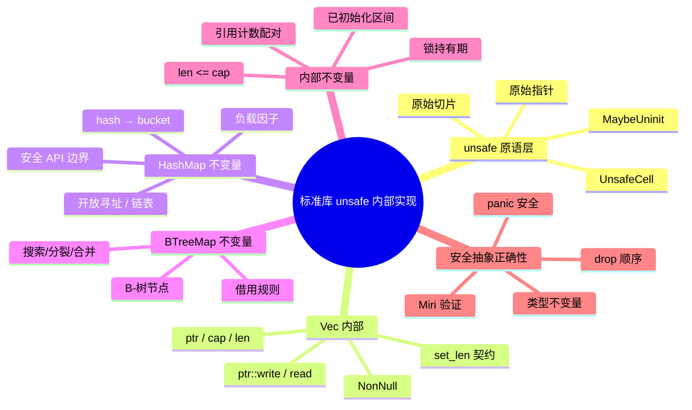
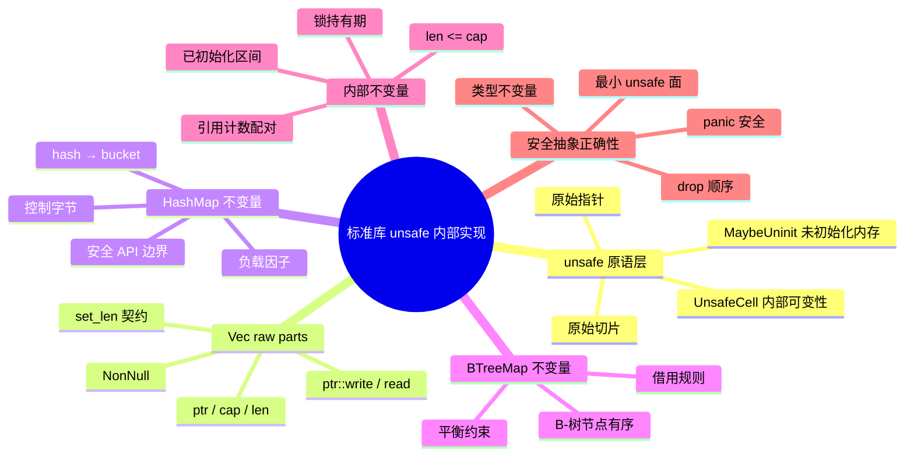

> **内容分级**: [专家级]
>
> **Rust 版本**: 1.97.0+ (Edition 2024)
> **本节关键术语**: unsafe internals · Vec raw parts · HashMap invariants · BTreeMap invariants · UnsafeCell · MaybeUninit · raw slice · internal invariants · sound abstraction

# 标准库 unsafe 内部实现概念解析

> **EN**: Standard Library Unsafe Internals
> **Summary**: Conceptual survey of how the Rust standard library uses `unsafe` internally: `Vec` raw parts, `HashMap`/`BTreeMap` invariants, `UnsafeCell`, `MaybeUninit`, raw slice helpers, internal invariants, and why the safe abstractions are sound.
> **受众**: [专家]
> **Bloom 层级**: L3-L5
> **权威来源**: 本文件为 `concept/` 权威页。
> **A/S/P 标记**: **S** — Structure
> **双维定位**: S×Ana — 结构分析
> **定位**: 从**概念层面**解析标准库如何在 `unsafe` 原语之上构建安全抽象，重点说明内部不变量（invariants）与 public API 之间的信任边界；不追求完整重实现，而是建立阅读、审查和扩展 std 风格代码的心智模型。
> **前置概念**:
> [Unsafe Rust](01_unsafe.md) ·
> [Unsafe Rust 模式](04_unsafe_rust_patterns.md) ·
> [Memory Management](../../02_intermediate/02_memory_management/01_memory_management.md) ·
> [Interior Mutability](../../02_intermediate/02_memory_management/02_interior_mutability.md)
> **后置概念**:
> [Unsafe 集合内部实现：Vec、Arc、Mutex](../07_unsafe_internals/01_unsafe_collections_internals.md) ·
> [Custom Allocators](../06_low_level_patterns/01_custom_allocators.md) ·
> [Rust 内存模型](06_memory_model.md)

---

> **权威来源 / Provenance**:
> [The Rustonomicon — Implementing Vec](https://doc.rust-lang.org/nomicon/vec.html) ·
> [The Rustonomicon — Implementing Arc and Mutex](https://doc.rust-lang.org/nomicon/arc-and-mutex.html) ·
> [Rust Reference — Unsafe Blocks](https://doc.rust-lang.org/reference/unsafe-blocks.html) ·
> [Rust Reference — Behavior Considered Undefined](https://doc.rust-lang.org/reference/behavior-considered-undefined.html) ·
> [Rust Unsafe Code Guidelines](https://rust-lang.github.io/unsafe-code-guidelines/) ·
> [std::mem::MaybeUninit](https://doc.rust-lang.org/std/mem/union.MaybeUninit.html) ·
> [std::cell::UnsafeCell](https://doc.rust-lang.org/std/cell/struct.UnsafeCell.html) ·
> [std::slice](https://doc.rust-lang.org/std/slice/index.html) ·
> [RustBelt — POPL 2018](https://plv.mpi-sws.org/rustbelt/popl18/)

---

## 🧠 知识结构图



## 📑 目录

- [标准库 unsafe 内部实现概念解析](#标准库-unsafe-内部实现概念解析)
  - [🧠 知识结构图](#-知识结构图)
  - [📑 目录](#-目录)
  - [一、概述：unsafe 是标准库的实现细节](#一概述unsafe-是标准库的实现细节)
  - [二、核心 unsafe 原语](#二核心-unsafe-原语)
    - [2.1 `UnsafeCell`：内部可变性的编译器原语](#21-unsafecell内部可变性的编译器原语)
    - [2.2 `MaybeUninit<T>`：未初始化内存的安全占位](#22-maybeuninitt未初始化内存的安全占位)
    - [2.3 原始指针与原始切片](#23-原始指针与原始切片)
  - [三、`Vec<T>` 的 raw parts](#三vect-的-raw-parts)
  - [四、`HashMap` 的内部不变量](#四hashmap-的内部不变量)
  - [五、`BTreeMap` 的内部不变量](#五btreemap-的内部不变量)
  - [六、内部不变量与安全抽象的正确性](#六内部不变量与安全抽象的正确性)
  - [七、边界测试 / 反例](#七边界测试--反例)
    - [7.1 反例：读取未初始化的 `MaybeUninit`](#71-反例读取未初始化的-maybeuninit)
    - [7.2 反例：错误的 `Vec::set_len`](#72-反例错误的-vecset_len)
    - [7.3 反例：`slice::from_raw_parts` 的空指针](#73-反例slicefrom_raw_parts-的空指针)
    - [7.4 反例：通过 `unsafe impl Send/Sync` 破坏集合不变量](#74-反例通过-unsafe-impl-sendsync-破坏集合不变量)
  - [八、嵌入式测验](#八嵌入式测验)
    - [测验 1：`UnsafeCell` 的作用](#测验-1unsafecell-的作用)
    - [测验 2：`MaybeUninit` 与未初始化内存](#测验-2maybeuninit-与未初始化内存)
    - [测验 3：`Vec` 的核心不变量](#测验-3vec-的核心不变量)
    - [测验 4：原始切片构造条件](#测验-4原始切片构造条件)
  - [九、国际权威参考](#九国际权威参考)
  - [🧭 思维导图（Mindmap）](#-思维导图mindmap)

---

## 一、概述：unsafe 是标准库的实现细节

Rust 标准库大量依赖 `unsafe` 实现高性能、低层抽象（`Vec`、`HashMap`、`BTreeMap`、`Mutex`、`Rc`、`Arc` 等），但对外暴露的 API 绝大多数是 safe 的。理解这一点有助于建立正确的心智模型：

- **`unsafe` 不是 bug 的同义词**，而是“编译器无法自动验证此处契约”的标记；
- **安全抽象的正确性取决于内部不变量**（invariants）是否在所有 public API 路径上都被维护；
- 阅读 std 源码时，应关注“哪些不变量被哪些 API 维护”，而不是逐行跟踪每一行汇编。

```text
unsafe 原语（原始指针 / UnsafeCell / MaybeUninit）
        ↓ 维护内部不变量
内部数据结构（Vec / HashMap / BTreeMap / ...）
        ↓ 对外隐藏 unsafe
safe public API
```

> **关键洞察**：标准库的安全不是“没有 unsafe”，而是“unsafe 被限制在最小内核中，并且安全 API 保证任何合法调用都不会破坏这些内核不变量”。

---

## 二、核心 unsafe 原语

### 2.1 `UnsafeCell`：内部可变性的编译器原语

`UnsafeCell<T>` 是 Rust 内部可变性的**底层原语**。它告诉编译器：“这块内存即使通过共享引用（`&T`）也可能被修改，不要基于 `noalias` 做激进优化”。

```rust
use std::cell::UnsafeCell;

pub struct MyCell<T> {
    value: UnsafeCell<T>,
}

impl<T: Copy> MyCell<T> {
    pub fn new(value: T) -> Self {
        Self { value: UnsafeCell::new(value) }
    }

    pub fn get(&self) -> T {
        // 通过 &self 安全地读取内部值
        unsafe { *self.value.get() }
    }

    pub fn set(&self, value: T) {
        // 通过 &self 安全地写入内部值
        unsafe { *self.value.get() = value; }
    }
}
```

> **`RefCell<T>`、`Mutex<T>`、`RwLock<T>`、原子类型等，底层都使用 `UnsafeCell`**。它们之间的区别不是“能不能修改”，而是**运行时如何保证 Rust 别名规则**：`RefCell` 用 borrow flag，`Mutex` 用 OS 锁，原子类型用硬件原子指令。

### 2.2 `MaybeUninit<T>`：未初始化内存的安全占位

`MaybeUninit<T>` 是一块大小/对齐与 `T` 相同、但可能未初始化的内存。它解决了旧 API `std::mem::uninitialized()` 的 UB 问题：后者会制造一个“可能无效”的 `T` 值，而 `MaybeUninit` 不承诺已初始化，因此不会触发 validity invariant。

```rust
use std::mem::MaybeUninit;

fn demo() {
    let mut x = MaybeUninit::<i32>::uninit();
    unsafe {
        x.as_mut_ptr().write(42);
        assert_eq!(x.assume_init(), 42);
    }
}
```

**典型用途**：

- `Vec::with_capacity(n)`：分配 `n` 个 `MaybeUninit<T>` 槽位，延迟初始化；
- FFI：C 结构体允许部分初始化；
- 栈上数组：避免先零初始化再覆盖的成本。

> **危险操作**：在确认写入之前调用 `assume_init()` 会读取未初始化内存 → UB。

### 2.3 原始指针与原始切片

原始指针 `*const T` / `*mut T` 是去掉了生命周期与别名保证的引用。原始切片通过 `std::slice::from_raw_parts` 构造，调用者必须保证：

1. 指针非空且正确对齐；
2. 指向 `len` 个连续、已初始化的 `T`；
3. `len * size_of::<T>()` 不溢出 `isize`；
4. 整个切片在访问期间有效（生命周期）。

```rust
use std::slice;

fn safe_view(data: &[u8]) -> &[u8] {
    // 从有效引用构造原始切片是安全的
    unsafe { slice::from_raw_parts(data.as_ptr(), data.len()) }
}
```

> **来源**: [std::slice::from_raw_parts](https://doc.rust-lang.org/std/slice/fn.from_raw_parts.html)

---

## 三、`Vec<T>` 的 raw parts

`Vec<T>` 的核心结构可概念化为：

```text
Vec<T> {
    ptr:  *mut T,      // 指向堆缓冲区
    cap:  usize,       // 缓冲区可容纳的元素数
    len:  usize,       // 当前已初始化元素数
}
```

实际 std 使用 `NonNull<T>`（保证非空）和 `Unique<T>` 等类型携带更多别名信息，但概念模型相同。

**关键不变量**：

- `len <= cap`；
- `0..len` 区间内的元素已初始化；
- `len..cap` 区间内的元素未初始化；
- 只有 `len` 个元素需要在 drop 时被析构。

**典型 unsafe 操作**：

```rust,ignore
// Vec::push 概念实现
pub fn push(&mut self, value: T) {
    if self.len == self.cap {
        self.grow();
    }
    unsafe {
        // 向未初始化槽位写入，不读取旧值
        std::ptr::write(self.ptr.as_ptr().add(self.len), value);
    }
    self.len += 1;
}

// Vec::pop 概念实现
pub fn pop(&mut self) -> Option<T> {
    if self.len == 0 {
        return None;
    }
    self.len -= 1;
    unsafe {
        // 移出已初始化元素，不 drop 原槽位
        Some(std::ptr::read(self.ptr.as_ptr().add(self.len)))
    }
}
```

> **为什么 `push` 是安全的**：容量检查保证不会越界；`ptr::write` 只写入未初始化内存；`len += 1` 精确标记新元素已初始化。只要 public API 遵守这些步骤，外部调用者无需了解内部指针。
>
> 更详细的实现级讨论见 [Unsafe 集合内部实现：Vec、Arc、Mutex](../07_unsafe_internals/01_unsafe_collections_internals.md)。

---

## 四、`HashMap` 的内部不变量

标准库 `HashMap<K, V, S>` 基于瑞士表（SwissTable，Rust 1.36+）实现，核心不变量包括：

1. **负载因子控制**：元素数量与桶数量的比值保持在阈值以下（约 0.875），保证平均查找 O(1)。
2. **Hash 一致性**：同一 `K` 的 `hash` 值与 `eq` 必须一致；`S`（hasher）改变后必须重新哈希。
3. **控制字节（control bytes）与数据槽一一对应**：每个桶的元数据字节（empty/deleted/full）与元素存储位置同步。
4. **安全 API 边界**：
   - `insert`/`get` 借用的生命周期由签名保证；
   - `Drain`、`IntoIter`、`IterMut` 等迭代器在遍历时不破坏表结构；
   - `RawEntryBuilder` 等底层入口仅用于标准库内部 unsafe API，普通用户不会触及。

```rust
use std::collections::HashMap;

fn demo() {
    let mut map = HashMap::new();
    map.insert("key", 42);
    // safe API 内部完成了 hash → bucket → probe → 插入全套 unsafe 操作
    assert_eq!(map.get("key"), Some(&42));
}
```

> **为什么安全**：调用者提供的 `K` 必须满足 `Hash + Eq`；标准库保证不会在同一时间通过多个可变引用访问同一槽位；resize 时会把所有元素迁移到新表并更新控制字节。

---

## 五、`BTreeMap` 的内部不变量

`BTreeMap<K, V>` 基于 B-树实现，内部不变量包括：

1. **节点有序**：每个节点内的键按序排列；
2. **B-树平衡**：所有叶子节点深度相同；每个节点键数在 `[MIN, MAX]` 之间（根节点除外）；
3. **父子边界**：子树的所有键位于父节点相邻键之间；
4. **借用规则**：`BTreeMap` 的 `Entry`、`IterMut`、`RangeMut` 等 API 通过 Rust 借用检查器保证同一时刻对同一节点的独占或共享访问。

```rust
use std::collections::BTreeMap;

fn demo() {
    let mut map = BTreeMap::new();
    map.insert(3, "c");
    map.insert(1, "a");
    map.insert(2, "b");
    // 迭代时按键序返回，内部维持节点有序与平衡
    let keys: Vec<_> = map.keys().copied().collect();
    assert_eq!(keys, vec![1, 2, 3]);
}
```

> **为什么安全**：`BTreeMap` 的所有修改操作（插入、删除、分裂、合并）都通过 safe Rust 控制流完成，只有节点内存分配/释放等极少数步骤使用 `unsafe`；借用检查器保证 `&mut self` 方法不会与任何迭代器共存。

---

## 六、内部不变量与安全抽象的正确性

标准库 safe API 的 soundness 建立在以下通用原则上：

| 原则 | 含义 | 在 std 中的体现 |
|:---|:---|:---|
| **类型不变量** | 类型的每个合法值都满足一组谓词 | `String` 内部字节是合法 UTF-8；`Vec` 满足 `len <= cap` |
| **方法前置条件** | public 方法要求调用者提供合法输入 | `Vec::set_len` 要求新长度内的元素已初始化 |
| **panic 安全** | panic 路径不破坏不变量 | `Vec::push` 先 `ptr::write` 再 `len += 1`，panic 时不会 double drop |
| **drop 顺序** | 析构时只 drop 已初始化元素 | `Vec::drop` 用 `ptr::drop_in_place` 处理 `0..len` 切片 |
| **最小 unsafe 面** | unsafe 代码集中在不可再分的原语层 | `HashMap` 的 unsafe 只在内存分配与原始指针访问 |

```rust
struct LoudDrop(&'static str);
impl Drop for LoudDrop {
    fn drop(&mut self) { println!("drop {}", self.0); }
}

fn main() {
    let mut v = Vec::new();
    v.push(LoudDrop("a"));
    v.push(LoudDrop("b"));
    v.pop(); // 只 drop "b"
    // v 离开作用域时 drop "a"
}
```

> **核心结论**：标准库的 safe API 不是“魔法”，而是“把 unsafe 原语封装在满足不变量的类型与 RAII 结构后面”。只要不变量在所有 public 路径上成立，外部代码就不可能触发 UB。

---

## 七、边界测试 / 反例

### 7.1 反例：读取未初始化的 `MaybeUninit`

```rust,no_run
use std::mem::MaybeUninit;

fn main() {
    let x = MaybeUninit::<i32>::uninit();
    unsafe {
        // ❌ UB：读取未初始化内存（运行时 UB，不应当执行）
        let _ = x.assume_init();
    }
}
```

**修正**：

```rust
use std::mem::MaybeUninit;

fn main() {
    let mut x = MaybeUninit::<i32>::uninit();
    unsafe {
        x.as_mut_ptr().write(42);
        assert_eq!(x.assume_init(), 42);
    }
}
```

### 7.2 反例：错误的 `Vec::set_len`

```rust,no_run
fn main() {
    let mut v = Vec::<String>::with_capacity(10);
    unsafe {
        // ❌ UB：把未初始化槽位标记为已初始化，drop 时会读取垃圾值
        v.set_len(10);
    }
}
```

**修正**：

```rust,ignore
// 只有在确实写入了 len 个元素后才能 set_len
unsafe {
    std::ptr::write(v.as_mut_ptr().add(0), String::from("x"));
    v.set_len(1);
}
```

### 7.3 反例：`slice::from_raw_parts` 的空指针

```rust,no_run
use std::slice;

fn main() {
    let ptr: *const u8 = std::ptr::null();
    unsafe {
        // ❌ UB：空指针不能构造切片
        let _ = slice::from_raw_parts(ptr, 4);
    }
}
```

> **注意**：此示例能编译通过，但运行时通过 Miri 会报告 UB。`no_run` 表示“不要在真实环境中执行”；实际代码中此类错误会潜伏到运行时才暴露。

### 7.4 反例：通过 `unsafe impl Send/Sync` 破坏集合不变量

```rust,ignore
use std::cell::Cell;

struct Bad {
    data: Cell<i32>,
}

// ❌ 错误：Cell 不是 Sync，以下实现会破坏 HashMap/BTreeMap 等依赖 Sync 的容器
unsafe impl Sync for Bad {}
```

> **修正**：不要为包含非线程安全内部可变性的类型 `unsafe impl Sync`。标准库的线程安全集合依赖 `K: Send + Sync` 等约束来避免数据竞争。

---

## 八、嵌入式测验

### 测验 1：`UnsafeCell` 的作用

**题目**：`UnsafeCell<T>` 的主要作用是什么？

- A. 让 `T` 自动实现 `Copy`
- B. 允许通过共享引用 `&T` 安全地修改内部值，禁用基于 `noalias` 的优化
- C. 替代 `Mutex` 提供无锁并发
- D. 让 `T` 不需要初始化

<details>
<summary>✅ 答案与解析</summary>

**正确答案是 B**。

`UnsafeCell` 是内部可变性的编译器原语，它告诉优化器这块内存可能通过共享引用被修改。它本身不提供同步，真正的同步由 `RefCell`、`Mutex`、原子类型等在之上实现。

</details>

---

### 测验 2：`MaybeUninit` 与未初始化内存

**题目**：以下关于 `MaybeUninit<T>` 的说法，正确的是？

- A. 调用 `assume_init()` 之前必须先写入有效值
- B. `MaybeUninit::uninit()` 会创建一个零初始化的 `T`
- C. `MaybeUninit` 的大小与对齐与 `T` 无关
- D. `assume_init()` 可以安全地调用任意多次

<details>
<summary>✅ 答案与解析</summary>

**正确答案是 A**。

`MaybeUninit` 只分配空间，不初始化。`assume_init()` 把未初始化内存当作 `T` 读取，未写入就调用是 UB。`MaybeUninit` 的大小和对齐与 `T` 相同。

</details>

---

### 测验 3：`Vec` 的核心不变量

**题目**：`Vec<T>` 的以下不变量中，哪一项是安全抽象正确性的关键？

- A. `len == cap`
- B. `len <= cap`，且 `0..len` 区间已初始化
- C. `ptr` 总是指向栈内存
- D. `cap` 必须为 2 的幂

<details>
<summary>✅ 答案与解析</summary>

**正确答案是 B**。

`len <= cap` 保证不会越界；`0..len` 已初始化保证 drop 和索引访问不会读取未初始化内存。`ptr` 指向堆内存，`cap` 的具体策略是未承诺实现细节。

</details>

---

### 测验 4：原始切片构造条件

**题目**：`std::slice::from_raw_parts(ptr, len)` 对 `ptr` 的要求不包括？

- A. 非空且正确对齐
- B. 指向 `len` 个已初始化的元素
- C. 指向只读内存
- D. 整个切片在访问期间有效

<details>
<summary>✅ 答案与解析</summary>

**正确答案是 C**。

原始切片可以指向可变或只读内存（对应 `from_raw_parts` / `from_raw_parts_mut`）。但指针必须非空、对齐、有效，且元素已初始化。

</details>

---

## 九、国际权威参考

> 依据 `AGENTS.md` §2 对齐网络国际化权威内容。

- **P1 学术/规范**:
  - [The Rustonomicon — Implementing Vec](https://doc.rust-lang.org/nomicon/vec.html)
  - [The Rustonomicon — Implementing Arc and Mutex](https://doc.rust-lang.org/nomicon/arc-and-mutex.html)
  - [Rust Reference — Unsafe Blocks](https://doc.rust-lang.org/reference/unsafe-blocks.html)
  - [Rust Reference — Behavior Considered Undefined](https://doc.rust-lang.org/reference/behavior-considered-undefined.html)
  - [Rust Unsafe Code Guidelines](https://rust-lang.github.io/unsafe-code-guidelines/)
  - [RustBelt — POPL 2018](https://plv.mpi-sws.org/rustbelt/popl18/)
- **P2 生态/社区**:
  - [std::mem::MaybeUninit](https://doc.rust-lang.org/std/mem/union.MaybeUninit.html)
  - [std::cell::UnsafeCell](https://doc.rust-lang.org/std/cell/struct.UnsafeCell.html)
  - [std::slice](https://doc.rust-lang.org/std/slice/index.html)
  - [docs.rs/hashbrown](https://docs.rs/hashbrown)（SwissTable 参考实现）

> **权威来源对齐变更日志**: 2026-07-31 创建，对齐 Rust 1.97.0+ (Edition 2024)。

**文档版本**: 1.0
**最后更新**: 2026-07-31
**状态**: ✅ 概念文件创建完成

---

## 🧭 思维导图（Mindmap）


