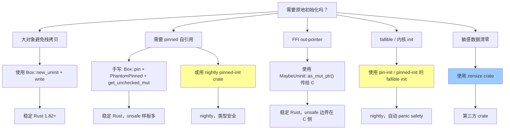
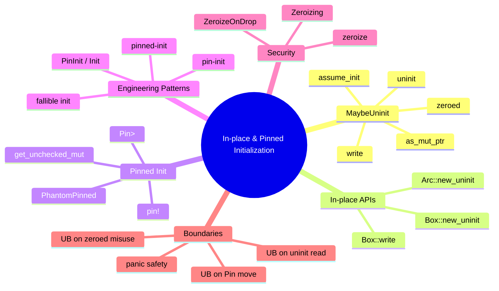

> **内容分级**: [专家级]
>
> **本节关键术语**: 原地初始化 (In-place Initialization) · 固定初始化 (Pinned Initialization) · `MaybeUninit<T>` · `Pin<Box<T>>` · `pin!` · `pin-init` · `Zeroize` — [完整对照表](../../00_meta/01_terminology/01_terminology_glossary.md)
>
# 原地初始化与固定初始化模式
>
> **EN**: In-place and Pinned Initialization Patterns
> **Summary**: Rust's safe and unsafe patterns for initializing memory in-place, covering `MaybeUninit<T>`, standard library in-place allocation APIs, manual `PhantomPinned` self-referential construction, and the `pin-init` / `pinned-init` engineering pattern.
> **Rust 版本**: 1.97.0+ (Edition 2024)
> **受众**: [专家]
> **权威来源**: 本文件为 `concept/` 权威页。
> **层级**: L3-L4 高级概念 / 形式化契约
> **A/S/P 标记**: **S+P** — Structure + Procedure
> **双维定位**: P×Eva — 评判初始化契约的充分性
> **前置概念**:
> [Unsafe Rust](01_unsafe.md) ·
> [Memory Model](../../02_intermediate/02_memory_management/01_memory_management.md) ·
> [Pin / Unpin](../01_async/08_pin_unpin.md) ·
> [Smart Pointers](../../02_intermediate/02_memory_management/01_memory_management.md)
> **后置概念**:
> [Field Projections](../../07_future/02_preview_features/23_field_projections_preview.md) ·
> [Async Trait Object Safety](../01_async/13_async_trait_object_safety.md) ·
> [Unsafe Fields Preview](../../07_future/02_preview_features/11_unsafe_fields_preview.md) ·
> [Pin Formal Semantics](../../04_formal/03_operational_semantics/12_pin_and_self_referential_semantics.md)
> **主要来源**:
> [Rust Project Goals 2025H2 — In-place Initialization](https://rust-lang.github.io/rust-project-goals/2025h2/in-place-initialization.html) ·
> [RFC PR #2884 — Placement by return](https://github.com/rust-lang/rfcs/pull/2884) ·
> [RFC 1892 — MaybeUninit](https://rust-lang.github.io/rfcs/1892-uninitialized-uninhabited.html) ·
> [rust-lang/rust #53491](https://github.com/rust-lang/rust/issues/53491) ·
> [rust-lang/rust #153825](https://github.com/rust-lang/rust/issues/153825) ·
> [lang-team#336](https://github.com/rust-lang/lang-team/issues/336) ·
> [Alice Ryhl — Init expressions](https://hackmd.io/@aliceryhl/BJutRcPblx) ·
> [Rust Reference — Memory Model](https://doc.rust-lang.org/reference/memory-model.html) ·
> [Rust Reference — Behavior Considered Undefined](https://doc.rust-lang.org/reference/behavior-considered-undefined.html) ·
> [std::mem::MaybeUninit](https://doc.rust-lang.org/std/mem/union.MaybeUninit.html) ·
> [Rustonomicon — Working With Uninitialized Memory](https://doc.rust-lang.org/nomicon/uninitialized.html) ·
> [Rustonomicon — Pinning](https://doc.rust-lang.org/nomicon/pin.html) ·
> [Rust-for-Linux — The Safe Pinned Initialization Problem](https://rust-for-linux.com/the-safe-pinned-initialization-problem) ·
> [pin-init crate docs](https://rust.docs.kernel.org/pin_init/) ·
> [pinned-init on crates.io](https://crates.io/crates/pinned-init) ·
> [zeroize crate docs](https://docs.rs/zeroize/latest/zeroize/) ·
> [std::boxed::Box](https://doc.rust-lang.org/std/boxed/struct.Box.html)
>
> **内容去重提示**:
> 本文是 In-place / Pinned Initialization 的 `concept/` 唯一权威来源。
> 关于 `Pin` / `Unpin` 的一般语义请见 [`../01_async/08_pin_unpin.md`](../01_async/08_pin_unpin.md)；
> 关于内存模型与未初始化内存的底层解释请见 [`06_memory_model.md`](06_memory_model.md)；
> 关于 `Pin` 的形式化语义请见 [`../../04_formal/03_operational_semantics/12_pin_and_self_referential_semantics.md`](../../04_formal/03_operational_semantics/12_pin_and_self_referential_semantics.md)。

---

> **Bloom 层级**: L3-L4
> **变更日志**:
> - v1.0 (2026-08-03): 初始权威页，覆盖 `MaybeUninit`、std in-place API、手动 `PhantomPinned`、`pin-init` 模式、`zeroize` 模式、决策树与反例

---

## 📑 目录

- [原地初始化与固定初始化模式](#原地初始化与固定初始化模式)
  - [📑 目录](#-目录)
  - [一、权威定义与动机](#一权威定义与动机)
  - [二、核心概念：Initialization Invariant](#二核心概念initialization-invariant)
  - [三、`MaybeUninit<T>` 语义](#三maybeuninitt-语义)
    - [3.1 基本 API](#31-基本-api)
    - [3.2 `zeroed()` 的合法与非法用法](#32-zeroed-的合法与非法用法)
  - [四、数组与结构体逐字段初始化](#四数组与结构体逐字段初始化)
    - [4.1 数组初始化与 panic safety](#41-数组初始化与-panic-safety)
    - [4.2 结构体字段投影写入](#42-结构体字段投影写入)
  - [五、Out-pointer / FFI 模式](#五out-pointer--ffi-模式)
  - [六、标准库 In-place 分配 API](#六标准库-in-place-分配-api)
    - [6.1 `Box::new_uninit` 与 `Box::write`](#61-boxnew_uninit-与-boxwrite)
    - [6.2 `Arc::new_uninit`](#62-arcnew_uninit)
  - [七、固定原地初始化](#七固定原地初始化)
    - [7.1 手动 `PhantomPinned` 自引用结构](#71-手动-phantompinned-自引用结构)
    - [7.2 栈固定：`pin!`](#72-栈固定pin)
  - [八、`pin-init` / `pinned-init` 工程模式](#八pin-init--pinned-init-工程模式)
  - [九、`zeroize` 安全清零模式](#九zeroize-安全清零模式)
  - [十、选型决策树](#十选型决策树)
  - [十一、反例与边界](#十一反例与边界)
  - [十二、国际来源对齐表](#十二国际来源对齐表)
  - [🧭 思维导图（Mindmap）](#-思维导图mindmap)

---

## 一、权威定义与动机

**原地初始化（In-place Initialization）** 指在已分配但尚未类型化的内存位置上直接构造值，避免「先构造完整值再 move」的中间步骤。典型动机：

- **大对象避免栈拷贝**：`Box::new_uninit()` 直接在堆上构造，避免 `BigStruct` 先栈后堆的复制。
- **固定自引用结构**：`PhantomPinned` 字段指向自身，必须在最终地址上初始化。
- **FFI out-pointer**：C 函数通过 `*mut T` 输出结果，调用方提供未初始化内存。
- **fallible init**：初始化失败时需要安全回滚已初始化字段。

> **[Rust Project Goals 2025H2](https://rust-lang.github.io/rust-project-goals/2025h2/in-place-initialization.html)** In-place initialization is a language goal to enable writing to uninitialized memory safely and ergonomically, reducing stack-to-heap copies and enabling pinned constructors. **固定初始化（Pinned Initialization）** 是其子类：构造 `T: !Unpin` 并保证地址对 safe 代码不可变，由 `pin-init` / `pinned-init` crate 提供成熟工程抽象。

---

## 二、核心概念：Initialization Invariant

Rust 的 **Initialization Invariant** 规定：任何类型为 `T` 的值的内存必须始终满足 `T` 的 validity invariant，否则读取该值是 **UB**。`MaybeUninit<T>` 是一块按 `T` 对齐的内存，但**不承诺已包含有效 `T`**，因此创建和写入是 safe 的，而 `assume_init()` 是 unsafe 的，因为调用者必须担保 invariant 已成立。

形式化状态机、部分初始化与 panic safety、以及 `PinInit` / `Init` trait 语义详见形式化 companion：
[`concept/04_formal/03_operational_semantics/13_in_place_initialization_semantics.md`](../../04_formal/03_operational_semantics/13_in_place_initialization_semantics.md)。

> **[Rustonomicon — Working With Uninitialized Memory](https://doc.rust-lang.org/nomicon/uninitialized.html)** Reading uninitialized memory is UB. `MaybeUninit<T>` is the only safe abstraction in Rust for dealing with possibly-uninitialized memory.

---

## 三、`MaybeUninit<T>` 语义

### 3.1 基本 API

```rust
use std::mem::MaybeUninit;

fn main() {
    // 1. 创建未初始化槽位
    let mut slot: MaybeUninit<String> = MaybeUninit::uninit();

    // 2. 安全写入（返回 &mut T，但所有权仍由 MaybeUninit 持有）
    slot.write(String::from("hello"));

    // 3. 确认初始化后取出 T（unsafe：调用者保证已写入有效值）
    let s: String = unsafe { slot.assume_init() };
    assert_eq!(s, "hello");

    // 4. assume_init_ref / assume_init_mut 在确认已初始化后借用
    let mut n: MaybeUninit<i32> = MaybeUninit::uninit();
    n.write(42);
    assert_eq!(unsafe { n.assume_init_ref() }, &42);
}
```

关键区分：

| API | 返回类型 | 消费 slot？ | 安全前提 |
|:---|:---|:---:|:---|
| `write(v)` | `&mut T` | 否 | 无（写入前是否未初始化均可） |
| `assume_init()` | `T` | 是 | 已写入有效 `T` |
| `assume_init_ref()` | `&T` | 否 | 已写入有效 `T` |
| `assume_init_mut()` | `&mut T` | 否 | 已写入有效 `T` |
| `as_mut_ptr()` | `*mut T` | 否 | 仅用于 out-pointer / 逐字段写入 |

### 3.2 `zeroed()` 的合法与非法用法

`MaybeUninit::<T>::zeroed()` 将内存清零。仅当全零字节是 `T` 的合法位模式时，`assume_init()` 才是 sound 的。

```rust
use std::mem::MaybeUninit;

fn main() {
    // ✅ 合法：u32 的 0 是有效值
    let zero: u32 = unsafe { MaybeUninit::<u32>::zeroed().assume_init() };
    assert_eq!(zero, 0);

    // ✅ 合法：Option<&u32> 的 niche 优化使全 0 对应 None
    // （但依赖布局，不建议生产代码直接使用）
    // let none: Option<&u32> = unsafe { MaybeUninit::zeroed().assume_init() };

    // ❌ 非法：bool 全 0 不一定有效（取决于 validity invariant）
    // let _b: bool = unsafe { MaybeUninit::<bool>::zeroed().assume_init() };
    // UB：bool 必须是 0 或 1
}
```

> **[std::mem::MaybeUninit](https://doc.rust-lang.org/std/mem/union.MaybeUninit.html)** `zeroed().assume_init()` is sound only if all-zero bytes is a valid bit pattern for `T`.

---

## 四、数组与结构体逐字段初始化

### 4.1 数组初始化与 panic safety

固定大小数组的原地初始化是 `MaybeUninit` 最典型的应用。Rust 1.95 起可使用 `MaybeUninit::from` 在初始化后与 `[T; N]` 相互转换。

```rust
use std::mem::MaybeUninit;

fn init_array<F, T, const N: usize>(mut f: F) -> [T; N]
where
    F: FnMut(usize) -> T,
{
    let mut arr: [MaybeUninit<T>; N] = [const { MaybeUninit::uninit() }; N];
    for i in 0..N {
        arr[i].write(f(i));
    }
    // Safety: 每个元素都已写入有效 T
    unsafe { std::mem::transmute_copy(&arr) }
}

fn main() {
    let squares: [i32; 5] = init_array(|i| (i * i) as i32);
    assert_eq!(squares, [0, 1, 4, 9, 16]);

    // Rust 1.95+: MaybeUninit<[T; N]> ↔ [MaybeUninit<T>; N]
    let buf: [MaybeUninit<u8>; 4] = [const { MaybeUninit::uninit() }; 4];
    let _wrapped: MaybeUninit<[u8; 4]> = MaybeUninit::from(buf);
}
```

**Panic safety 要点**：若 `f(i)` 在初始化过程中 panic，已初始化的元素需要被显式 drop，否则泄漏资源。形式化状态机与 `ManuallyDrop` 包装模式详见
[形式化 companion](../../04_formal/03_operational_semantics/13_in_place_initialization_semantics.md#二部分初始化与-panic-safety)。

### 4.2 结构体字段投影写入

`MaybeUninit<Struct>` 的字段投影写入需要 `&raw mut`（避免创建无效引用的中间步骤）或直接操作字段地址。

```rust
use std::mem::MaybeUninit;
use std::ptr::addr_of_mut;

struct Point { x: f64, y: f64 }

fn init_point_at(p: *mut Point, x: f64, y: f64) {
    // Safety: p 指向已分配的 Point 大小内存
    unsafe {
        (*addr_of_mut!((*p).x)) = x;
        (*addr_of_mut!((*p).y)) = y;
    }
}

fn main() {
    let mut slot: MaybeUninit<Point> = MaybeUninit::uninit();
    init_point_at(slot.as_mut_ptr(), 1.0, 2.0);
    let p: Point = unsafe { slot.assume_init() };
    assert_eq!((p.x, p.y), (1.0, 2.0));
}
```

> **边界**：Safe Rust 目前无法直接对 `Box<MaybeUninit<T>>` 做字段投影并返回 `Box<MaybeUninit<Field>>`；这是 [Field Projections](../../07_future/02_preview_features/23_field_projections_preview.md) 语言目标试图解决的问题。

---

## 五、Out-pointer / FFI 模式

FFI 中常见「调用方分配、被调用方写入」的 out-pointer 模式。`MaybeUninit::as_mut_ptr()` 提供指向未初始化内存的裸指针，避免创建无效 `&mut T`。

```rust
use std::mem::MaybeUninit;
use std::os::raw::{c_char, c_int};

// 模拟 C API：将字符串长度写入 *mut c_int
unsafe extern "C" fn c_get_len(out_len: *mut c_int, s: *const c_char) {
    if out_len.is_null() || s.is_null() {
        return;
    }
    // 实际 FFI 中会调用 C 函数；此处用纯 Rust 模拟
    let mut len = 0;
    let mut p = s;
    while unsafe { *p } != 0 {
        len += 1;
        p = unsafe { p.add(1) };
    }
    unsafe { out_len.write(len); }
}

fn main() {
    let s = std::ffi::CString::new("hello").unwrap();
    let mut len: MaybeUninit<c_int> = MaybeUninit::uninit();

    // Safety: out_len 来自 MaybeUninit::as_mut_ptr()，指向有效未初始化内存
    unsafe {
        c_get_len(len.as_mut_ptr(), s.as_ptr());
    }

    let len = unsafe { len.assume_init() };
    assert_eq!(len, 5);
}
```

> **契约**：调用 `assume_init()` 前必须确认 C 函数确实写入了有效值；否则读取未初始化 `c_int` 是 UB。

---

## 六、标准库 In-place 分配 API

### 6.1 `Box::new_uninit` 与 `Box::write`

`Box::<T>::new_uninit()`（稳定于 1.82）返回 `Box<MaybeUninit<T>>`，允许在堆上未初始化内存中直接构造 `T`，避免大对象栈分配。

```rust
fn main() {
    // 在堆上分配 MaybeUninit<String>，无需先在栈上构造 String
    let mut b: Box<std::mem::MaybeUninit<String>> = Box::new_uninit();

    // 直接写入堆内存
    b.write(String::from("heap-born"));

    // 转换为 Box<String>
    let s: Box<String> = unsafe { b.assume_init() };
    assert_eq!(s.as_str(), "heap-born");
}
```

### 6.2 `Arc::new_uninit`

`Arc::new_uninit()` 返回 `Arc<MaybeUninit<T>>`，适用于需要在共享所有权内存中原地初始化的场景。

```rust
use std::mem::MaybeUninit;
use std::sync::Arc;

fn main() {
    let mut a: Arc<MaybeUninit<String>> = Arc::new_uninit();

    // 获取 Arc 内部的可变引用并写入
    // Safety: 此时没有其他 Arc 克隆，引用计数为 1
    Arc::get_mut(&mut a).unwrap().write(String::from("shared"));

    // 转换为 Arc<String>
    let s: Arc<String> = unsafe { Arc::<MaybeUninit<String>>::assume_init(a) };
    assert_eq!(s.as_str(), "shared");
}
```

> **边界**：`Arc::get_mut_unchecked` 要求当前唯一持有 `Arc`；`Arc::assume_init` 要求内部已完全初始化。

---

## 七、固定原地初始化

### 7.1 手动 `PhantomPinned` 自引用结构

构建自引用结构的标准模式：先分配 `Pin<Box<T>>`，再固定地址后写入自引用字段。

```rust
use std::marker::PhantomPinned;
use std::pin::Pin;

struct SelfRef {
    data: String,
    ptr: *const String,
    _pin: PhantomPinned,
}

impl SelfRef {
    fn new(data: String) -> Pin<Box<Self>> {
        let mut b: Pin<Box<Self>> = Box::pin(Self {
            data,
            ptr: std::ptr::null(),
            _pin: PhantomPinned,
        });

        // Safety: b 已被 Pin 固定，其地址在 Pin 生命周期内不变
        let ptr: *const String = &b.data;
        unsafe {
            b.as_mut().get_unchecked_mut().ptr = ptr;
        }
        b
    }

    fn data(self: Pin<&Self>) -> &String {
        // Safety: ptr 指向 self.data，且 self 已被 Pin 固定
        unsafe { &*self.ptr }
    }
}

fn main() {
    let s = SelfRef::new(String::from("pinned"));
    assert_eq!(s.as_ref().data(), "pinned");
}
```

> **安全契约**：`PhantomPinned` 使 `SelfRef: !Unpin`；自引用字段必须在 `Pin<Box<Self>>` 建立后写入；`get_unchecked_mut()` 仅用于初始化，不能暴露给可能移动值的用户代码。

### 7.2 栈固定：`pin!`

`pin!` 宏（稳定于 1.95）在栈上创建 `Pin<&mut T>`，适用于临时固定场景，不能获得 `'static` 保证。

```rust
use std::pin::{pin, Pin};
use std::marker::PhantomPinned;

struct StackPinned {
    data: String,
    ptr: *const String,
    _pin: PhantomPinned,
}

fn init_on_stack() {
    let mut p: Pin<&mut StackPinned> = pin!(StackPinned {
        data: String::from("stack"),
        ptr: std::ptr::null(),
        _pin: PhantomPinned,
    });

    let ptr: *const String = &p.data;
    unsafe {
        p.as_mut().get_unchecked_mut().ptr = ptr;
    }

    assert_eq!(unsafe { &*p.ptr }, "stack");
}

fn main() {
    init_on_stack();
}
```

> **对比**：`pin!` 提供临时地址稳定性；长期自引用应使用 `Box::pin` 或 `Pin<Box<T>>`。

---

## 八、`pin-init` / `pinned-init` 工程模式

Rust-for-Linux 的 `pin-init` crate（用户空间对应 `pinned-init`）提供了一套安全的 pinned initialization DSL：通过 `#[pin_data]` 标记 pinned 字段、`pin_init!` 宏生成初始化表达式、`PinInit` / `Init` trait 表达可失败初始化。

> **当前状态**：`pin-init` / `pinned-init` 依赖 nightly 特性（`allocator_api`、`negative_impls` 等），不能直接用于 stable Rust 1.97。以下示例使用 `rust,ignore` 标注。

```rust,ignore
// 需 nightly + pin-init / pinned-init crate
use pinned_init::{pin_init, PinInit};
use std::pin::Pin;

#[pin_data(PinnedDrop)]
struct Device {
    #[pin]
    state: Mutex<Inner>,
    name: String,
}

impl Device {
    fn new(name: &str) -> impl PinInit<Self> {
        pin_init!(Self {
            state <- Mutex::new(Inner::default()),
            name: name.to_owned(),
        })
    }
}

fn main() {
    let dev: Pin<Box<Device>> = Box::pin_init(Device::new("eth0")).unwrap();
}
```

**设计要点**：`<-` 语法初始化 pinned field；`PinInit` 保证构造过程中地址不变；fallible init 失败时自动 drop 已初始化字段，避免 panic safety 漏洞。

> **[Rust-for-Linux — The Safe Pinned Initialization Problem](https://rust-for-linux.com/the-safe-pinned-initialization-problem)** 解释为何需要 `pin-init`：手动 `Pin::new_unchecked` 加 `MaybeUninit` 的样板代码容易违反 pinning 契约，而类型化初始化表达式可在编译期拒绝错误模式。

---

## 九、`zeroize` 安全清零模式

安全敏感数据在离开作用域时应显式清零，防止编译器优化掉「写入 0」。`zeroize` crate 提供 `Zeroize`、`ZeroizeOnDrop`、`Zeroizing<T>`。

> **当前状态**：`zeroize` 是第三方 crate；示例使用 `rust,ignore`。

```rust,ignore
use zeroize::{Zeroize, ZeroizeOnDrop, Zeroizing};

#[derive(Zeroize, ZeroizeOnDrop)]
struct SecretKey([u8; 32]);

fn main() {
    // 1. 栈上密钥在 drop 时自动清零
    let mut key = SecretKey([0x42; 32]);
    key.zeroize();

    // 2. Zeroizing wrapper：离开作用域即清零
    let secret: Zeroizing<String> = Zeroizing::new(String::from("password"));
    assert_eq!(secret.as_str(), "password");
} // secret 在此处被显式清零，不受编译器优化影响
```

**与 `MaybeUninit` 结合**：若 secret 在 `MaybeUninit` 中初始化失败或部分初始化，应在 dealloc 前对未初始化内存调用 `zeroize`，避免残留敏感字节。

> **[zeroize crate docs](https://docs.rs/zeroize/latest/zeroize/)** `ZeroizeOnDrop` ensures the memory is overwritten with zeros before `Drop` runs, even in the presence of compiler optimizations.

---

## 十、选型决策树



---

## 十一、反例与边界

### 反例 1：在未初始化内存上调用 `assume_init()` / `assume_init_ref()`

```rust
use std::mem::MaybeUninit;

fn main() {
    let x: MaybeUninit<String> = MaybeUninit::uninit();
    let _s: String = unsafe { x.assume_init() }; // UB

    let y: MaybeUninit<i32> = MaybeUninit::uninit();
    let _r: &i32 = unsafe { y.assume_init_ref() }; // UB
}
```

> **Miri 检测**：`MIRIFLAGS="-Zmiri-backtrace=1" cargo miri run` 会报 `using uninitialized data`。

### 反例 3：先 `set_len` 后写入

```rust
use std::mem::MaybeUninit;

fn main() {
    let mut v: Vec<MaybeUninit<String>> = Vec::with_capacity(4);
    unsafe { v.set_len(4); } // ❌ 错误：尚未初始化就宣称长度为 4
    // 后续读取 v[0] 是 UB
}
```

> **修正**：先写入，再 `set_len`；或在 `Vec` 中使用 `spare_capacity_mut` + `assume_init` 模式。

### 反例 4：`zeroed().assume_init()` 对非零类型

```rust
use std::mem::MaybeUninit;

fn main() {
    // ❌ UB：bool 的 validity invariant 要求 0 或 1，但不应依赖 zeroed 初始化
    let _b: bool = unsafe { MaybeUninit::<bool>::zeroed().assume_init() };
}
```

> **边界**：`bool` 全 0 在大多数平台是 `false`，但 Rust validity invariant 不一定允许任意 zeroed 假设；对引用、`NonNull`、函数指针等类型全 0 是明确 UB。

### 反例 6：`zeroize` 无法阻止 `Vec` realloc 残留

```rust,ignore
use zeroize::Zeroize;

fn main() {
    let mut v = vec![0xABu8; 1024];
    v.zeroize();
    // ❌ v 的原始缓冲区可能已被 realloc 释放，旧内存仍残留敏感字节
}
```

> **修正**：敏感数据应使用固定大小的栈数组或 `Zeroizing<Box<[u8]>>`，避免 `Vec` 扩容导致旧缓冲区残留。

---

## 十二、国际来源对齐表

| 概念 / 章节 | 国际权威来源 | 具体链接 |
|:---|:---|:---|
| In-place initialization 语言目标 | Rust Project Goals 2025H2 | <https://rust-lang.github.io/rust-project-goals/2025h2/in-place-initialization.html> |
| Placement by return | RFC PR #2884 | <https://github.com/rust-lang/rfcs/pull/2884> |
| Init expressions 设计 | Alice Ryhl (HackMD) | <https://hackmd.io/@aliceryhl/BJutRcPblx> |
| Lang-team experiment | lang-team#336 | <https://github.com/rust-lang/lang-team/issues/336> |
| `MaybeUninit` 引入 | RFC 1892 | <https://rust-lang.github.io/rfcs/1892-uninitialized-uninhabited.html> |
| 未初始化内存语义 | Rustonomicon | <https://doc.rust-lang.org/nomicon/uninitialized.html> |
| `MaybeUninit` API | std docs | <https://doc.rust-lang.org/std/mem/union.MaybeUninit.html> |
| `Pin` 语义 | Rustonomicon / RFC 2349 | <https://doc.rust-lang.org/nomicon/pin.html> |
| 安全 pinned init 问题 | Rust-for-Linux | <https://rust-for-linux.com/the-safe-pinned-initialization-problem> |
| `pin-init` crate | kernel.org docs / GitHub | <https://rust.docs.kernel.org/pin_init/> · <https://github.com/Rust-for-Linux/pin-init> |
| `pinned-init` 用户空间版 | crates.io / docs.rs | <https://crates.io/crates/pinned-init> · <https://docs.rs/pinned-init/latest/pinned_init/> |
| Secure zeroing | zeroize crate | <https://docs.rs/zeroize/latest/zeroize/> |
| `Box::new_uninit` 等 | std::boxed::Box | <https://doc.rust-lang.org/std/boxed/struct.Box.html> |

---

## 🧭 思维导图（Mindmap）



---

---

## 国际权威来源（P1 补充）

- [RustBelt: Securing the Foundations of the Rust Programming Language (POPL 2018)](https://dl.acm.org/doi/10.1145/3158154)
- [Stacked Borrows: An Aliasing Model for Rust (POPL 2020)](https://dl.acm.org/doi/10.1145/3371109)
