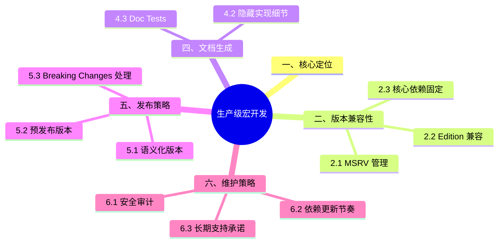

> **内容分级**: [专家级]
>

# 生产级宏开发
>
> **EN**: Production-Grade Macro Development
> **Summary**: Engineering practices for shipping and maintaining Rust procedural macro crates: MSRV policy, edition compatibility, span-aware diagnostics, documentation, semantic versioning, CI/CD, and long-term maintenance.
>
> **受众**: [专家]
> **层级**: L3 高级概念
> **Bloom 层级**: L3-L5
> **A/S/P 标记**: **S+A+P** — Structure + Application + Procedure
> **双维定位**: P×Eva — 评估宏（Macro）库工程实践
> **前置概念**:
> [过程宏（Procedural Macro）](02_proc_macro.md) ·
> [宏调试与诊断](04_macro_debugging_and_diagnostics.md) ·
> [元编程](../../02_intermediate/06_macros_and_metaprogramming/04_metaprogramming.md) ·
> [Cargo 注册表与包发布](../../06_ecosystem/01_cargo/08_cargo_registries_and_publishing.md)
> **后置概念**:
> [Cargo semver-checks](../../07_future/03_preview_features/27_cargo_semver_checks_preview.md) ·
> [工程实践与生产级模式](../../06_ecosystem/03_design_patterns/13_engineering_and_production_patterns.md)
>
> **主要来源**:
> [The Rust Reference](https://doc.rust-lang.org/reference/procedural-macros.html) ·
> [Cargo Book](https://doc.rust-lang.org/cargo/index.html) ·
> [Rust API Guidelines](https://rust-lang.github.io/api-guidelines/) ·
> [Semantic Versioning](https://semver.org/) ·
> [Keep a Changelog](https://keepachangelog.com/)
>
> **Rust 版本**: 1.97.0+ (Edition 2024)
> **权威来源**: 本文件为 `concept/` 权威页。

---

> **来源**: 本文档由 `crates/*/docs/` 合规整改迁移而来。原始 crate 文档现为摘要页，指向本权威页：
> **权威来源**: [concept/03_advanced/03_proc_macros/05_production_grade_macro_development.md](05_production_grade_macro_development.md)

---

## 一、核心定位

生产级宏（Macro）开发不仅是“让宏能工作”，还需要考虑：

- **版本兼容性**: MSRV、Edition、依赖版本策略。
- **错误诊断**: 用户遇到宏错误时能否快速修复。
- **文档与示例**: 生成的 API 是否易于理解和使用。
- **发布与维护**: 语义化版本、Changelog、CI/CD、安全审计。

---

## 二、版本兼容性

过程宏 crate 的版本兼容有三条独立轴，生产级开发必须分别管理：

1. **syn 主版本轴**：syn 1.x 与 2.x API 不兼容（`Meta` 匹配 → `parse_nested_meta` 回调）——宏生态的依赖树中 syn 版本分裂会导致编译时间倍增（两份 syn 编译），升级策略是跟随生态主流窗口批量升级；
2. **rustc 最低版本（MSRV）轴**：过程宏在**编译期运行**，其 MSRV 受 `proc_macro` API 演进约束（如 `Span::source_text` 需要特定版本）——`Cargo.toml` 声明 `rust-version` 并在 CI 测试 MSRV 工具链；
3. **生成代码的兼容性轴**：宏展开结果在用户 crate 中编译——生成代码用到的语法/feature 不能超过用户 MSRV（如生成 `let else` 要求用户 1.65+），文档必须声明「生成代码 MSRV」。

判定准则：三条轴在 README 与 CHANGELOG 中分别记录——宏 crate 的破坏性变更 = 任一轴的不兼容变更。

### 2.1 MSRV 管理

```toml
[package]
name = "my_macro"
version = "1.0.0"
rust-version = "1.70.0"  # 最低支持的 Rust 版本（示例值，摘自 Cargo Book 原文；本项目 MSRV 为 1.97.0）
```

(Source: [Cargo Book — The rust-version field](https://doc.rust-lang.org/cargo/reference/manifest.html#the-rust-version-field))

**保守策略**（推荐）：

- Minor 版本不提升 MSRV。
- Major 版本可提升 MSRV，且应至少支持最近 6 个月的稳定版。

```text
v1.0.0 (MSRV 1.65)
v1.1.0 (MSRV 1.65) ✅ 不变
v2.0.0 (MSRV 1.70) ✅ Major 可更新
```

### 2.2 Edition 兼容

过程宏（Procedural Macro） crate 本身的 `edition` 不影响使用方的 edition，但生成代码中使用的语法特性需要兼容目标 edition (Source: [Rust Reference — Editions](https://doc.rust-lang.org/reference/introduction.html))：

```rust
# macro_rules! quote { ($($t:tt)*) => {} }
// 生成代码时使用全限定路径，避免 edition 相关解析差异
quote! { ::std::vec::Vec::new() }
```

### 2.3 核心依赖固定

```toml
[dependencies]
syn = "2.0"
quote = "1.0"
proc-macro2 = "1.0"
```

> **关键洞察**: `syn`、`quote`、`proc-macro2` 是过程宏生态的“基石依赖”。固定其 Major 版本可避免用户依赖图中出现不兼容的多个版本。

---

## 三、错误诊断最佳实践

过程宏的用户体验 90% 由错误诊断质量决定，生产级标准四条：

1. **永不 panic**：宏 panic 只显示 `proc macro panicked` 无位置信息——所有错误用 `syn::Error` + `to_compile_error()` 转为编译错误返回；
2. **错误绑定 span**：`syn::Error::new_spanned(tokens, msg)` 把错误钉在用户的具体 token 上，而非宏调用整体——多 span 错误用 `combine` 累积后一次性报告；
3. **错误信息可行动**：说明「期望什么、收到什么、如何修复」——如「expected `#[derive(MyTrait)]` on struct, found enum; use `#[my_trait(allow_enum)]` to opt in」；
4. **对抗性测试**：`trybuild` crate 编译 `tests/ui/*.rs` 失败用例并比对 `.stderr` 快照——错误信息回归测试是宏 crate 的标配 CI 环节。

进阶：`proc_macro_error2` 提供 `proc_macro_error` 属性式错误流（`abort!`/`emit_error!`），本库 vendor 目录维护了其本地修复版。

### 3.1 保留原始 Span

```rust,ignore
use syn::{Error, Field};

fn validate_field(field: &Field) -> Result<(), Error> {
    if field.attrs.is_empty() {
        return Err(Error::new(
            field.span(),
            "expected at least one attribute",
        ));
    }
    Ok(())
}
```

### 3.2 提供上下文和帮助

```rust,ignore
use syn::Error;

fn report_type_mismatch(field: &syn::Field, expected: &str, found: &str) -> Error {
    Error::new(
        field.span(),
        format!(
            "expected field type `{}`, found `{}`\n\
             \n\
             help: change the field type to `{}`\n\
             note: this restriction is due to the `Serialize` trait requirement",
            expected, found, expected
        ),
    )
}
```

### 3.3 多错误聚合

一次性报告所有问题，避免用户逐个修复：

```rust,ignore
match validate_all(&input) {
    Ok(_) => generate_code(),
    Err(errors) => errors
        .into_iter()
        .map(|e| e.to_compile_error())
        .collect::<proc_macro2::TokenStream>()
        .into(),
}
```

---

## 四、文档生成

宏的文档有其特殊性——用户消费的是「展开后的行为」，不是函数签名：

- **文档注释即用户手册**：`///` 写在宏项上（`#[proc_macro]`/`#[proc_macro_derive]`/`#[proc_macro_attribute]`），docs.rs 会渲染——必须包含：功能一句话、完整调用示例、生成代码的示意（`cargo expand` 输出节选）、属性参数表；
- **文档测试的限制**：`#[proc_macro]` crate 自身不能 `use` 自己（过程宏只能在其他 crate 使用）——文档测试需放在独立示例 crate 或用 `ignore` 标注 + CI 中单独验证；
- **展开示例维护**：生成的代码示意与真实 `cargo expand` 输出会漂移——用 CI 步骤（`cargo expand | diff` 或 insta 快照）保证同步；
- **错误目录**：为每个 `syn::Error` 消息写一节「触发条件 + 修复示例」——serde 的 errors 文档是行业标杆。

判定准则：用户只读文档就能正确使用并诊断全部错误——达不到则文档不完整。

### 4.1 完整示例

````rust
/// Derive a builder for a struct.
///
/// # Examples
///
/// ```
/// use my_macro::Builder;
///
/// #[derive(Builder)]
/// struct Config {
///     host: String,
///     port: u16,
/// }
///
/// let config = ConfigBuilder::new()
///     .host("localhost".to_string())
///     .port(8080)
///     .build();
/// ```
#[proc_macro_derive(Builder, attributes(builder))]
pub fn derive_builder(input: TokenStream) -> TokenStream {
    // ...
}
````

### 4.2 隐藏实现细节

```rust
/// ⚠️ Internal implementation detail, do not use directly.
#[doc(hidden)]
pub mod __internal {
    pub fn helper_function() {}
}
```

### 4.3 Doc Tests

````rust
/// ```compile_fail
/// use my_macro::Builder;
/// #[derive(Builder)]
/// struct Invalid { field } // 缺少类型
/// ```
#[proc_macro_derive(Builder)]
pub fn derive_builder(input: TokenStream) -> TokenStream { /* ... */ }
````

---

## 五、发布策略

过程宏 crate 的发布比库 crate 多两个约束，发布清单如下：

1. **版本同步策略**：主 crate 与宏 crate 分离时（如 `serde`/`serde_derive`），采用「同版本号同步发布」或「宏内嵌主 crate 路径（`$crate` 等价物：`proc_macro_crate` 探测重命名）」——用户 `rename` 依赖（`serde2 = { package = "serde" }`）时宏必须仍能定位主 crate；
2. **发布前检查**：`cargo publish --dry-run`、MSRV 工具链编译、`cargo semver-checks` 比对 API 兼容性、docs.rs 构建特性组合（`package.metadata.docs.rs` 声明 `all-features`）；
3. **破坏性变更管理**：宏的破坏性变更包括「生成代码行为变更」——即使 API 签名不变；此类变更需主版本号 + 迁移指南；
4. **yank 与修复窗口**：发布后 72 小时是问题高发期，准备好 yank 决策树（影响面 × 修复 ETA）。

判定准则：发布清单进 CI/release 文档，人工发布步骤不超过 3 步（`cargo release` 类工具可自动化）。

### 5.1 语义化版本

(Source: [Semantic Versioning 2.0.0](https://semver.org/spec/v2.0.0.html))

| 变更类型 | 版本段 | 示例 |
|:---|:---|:---|
| 破坏性变更 | MAJOR | 1.5.0 → 2.0.0 |
| 新功能（向后兼容） | MINOR | 1.5.0 → 1.6.0 |
| Bug 修复 | PATCH | 1.5.0 → 1.5.1 |

### 5.2 预发布版本

```toml
[package]
version = "2.0.0-rc.1"
```

### 5.3 Breaking Changes 处理

```rust,ignore
// v1.8.0: 先添加弃用警告
#[deprecated(since = "1.8.0", note = "will be removed in 2.0.0, use `new_api()`")]
pub fn old_api() { new_api(); }

// v2.0.0: 移除旧 API
```

### 5.4 CI/CD 发布流程

(Source: [Cargo Book — Publishing on crates.io](https://doc.rust-lang.org/cargo/reference/publishing.html))

```yaml
# .github/workflows/release.yml
name: Release
on:
  push:
    tags: ["v*"]

jobs:
  publish:
    runs-on: ubuntu-latest
    steps:
      - uses: actions/checkout@v4
      - uses: actions-rust-lang/setup-rust-toolchain@v1
      - run: cargo test --all-features
      - run: cargo publish --token ${{ secrets.CARGO_TOKEN }}
```

---

## 六、维护策略

宏 crate 的长期维护聚焦四个可持续性问题：

- **rustc 演进跟踪**：nightly 上跑 CI（`cargo +nightly test`）提前发现 `proc_macro` API 变化与内部不稳定行为——宏依赖的编译器内部行为越少越好（只用 `proc_macro` 稳定 API + syn 解析）；
- **syn 升级周期**：跟随 syn 主版本升级的节奏是「生态主流迁移后 1–2 个版本内」——过早承担兼容性风险，过晚让用户编译两份 syn；
- **issue 分诊模板**：宏 bug 报告必须附「输入代码 + 期望展开 + 实际错误」——`cargo expand` 输出与 `RUSTFLAGS="--pretty=expanded"` 是分诊第一要求；
- **社区与治理**：README 声明维护状态（active/maintenance/looking-for-maintainer），宏 crate 停更但生成代码仍可用是其特殊优势——语义版本纪律比功能更新更重要。

判定准则：维护负担主要来自「rustc 变化 × syn 升级 × 用户多样性」三角——每一项都有对应的 CI 信号，让机器先报警。

### 6.1 安全审计

(Source: [RustSec cargo-audit](https://github.com/RustSec/rustsec/tree/main/cargo-audit))

```yaml
# .github/workflows/audit.yml
name: Security Audit
on:
  schedule:
    - cron: "0 0 * * *"

jobs:
  audit:
    runs-on: ubuntu-latest
    steps:
      - uses: actions/checkout@v4
      - uses: rustsec/audit-check@v1
```

### 6.2 依赖更新节奏

| 版本类型 | 检查频率 |
|:---|:---|
| PATCH | 每周 |
| MINOR | 每月 |
| MAJOR | 每季度 |

### 6.3 长期支持承诺

- Major 版本至少维护 2 年。
- 弃用旧 API 前提前 6 个月通告。
- 提供迁移指南或自动化迁移工具。

---

## 七、生产级宏开发检查清单

- [ ] 声明 MSRV 并在 CI 中测试
- [ ] 核心依赖固定 Major 版本
- [ ] 错误消息指向用户代码位置
- [ ] 提供清晰的帮助文本（help/note）
- [ ] 文档包含完整可运行示例
- [ ] 使用 `#[doc(hidden)]` 隐藏内部实现
- [ ] 包含编译失败 doc test 或 trybuild 测试
- [ ] 遵循语义化版本
- [ ] 维护 Changelog
- [ ] 配置 `cargo audit` 安全扫描
- [ ] 发布前运行 `cargo publish --dry-run`

---

> **权威来源**: [Rust Reference](https://doc.rust-lang.org/reference/introduction.html) · [Cargo Book](https://doc.rust-lang.org/cargo/index.html) · [Rust API Guidelines](https://rust-lang.github.io/api-guidelines/) · [SemVer](https://semver.org/) · [Keep a Changelog](https://keepachangelog.com/)
>
> **权威来源对齐变更日志**: 2026-07-09 由 `crates/c11_macro_system_proc/docs/tier_04_advanced/06_production_grade_macro_development.md` 按 AGENTS.md §6.4 迁移至此

**文档版本**: 1.0
**最后更新**: 2026-07-09
**状态**: ✅ 权威来源对齐完成

## 认知路径

1. **问题识别**: 识别发布和维护过程宏 crate 在兼容性、诊断与文档上的特殊挑战。
2. **概念建立**: 掌握 MSRV 策略、edition 兼容、span 感知诊断、文档与 CI/CD 最佳实践。
3. **机制推理**: 通过兼容性 ⟹ 诊断质量 ⟹ 可持续维护的定理链评估工程成熟度。
4. **边界辨析**: 辨析“宏 crate 不需要 semver”等反命题，理解下游兼容性风险。
5. **迁移应用**: 将生产级宏开发与 semver-checks、工程模式主题链接。

## 定理链

| 定理 | 前提 | 结论 |
|:---|:---|:---|
| 明确 MSRV 策略 ⟹ 降低兼容性风险 | 在文档与 CI 中声明最低 Rust 版本 | 下游用户可以预测升级成本 |
| span 感知诊断 ⟹ 减少 issue 噪音 | 错误信息指向用户代码而非宏内部 | 维护者处理支持请求的时间下降 |
| 多工具链 CI ⟹ 及早发现回归 | 覆盖 stable、beta 与每日构建版及多 edition | 破坏性变更在发布前暴露 |

## 反命题

> **反命题 1**: "宏 crate 不需要 semver" ⟹ 不成立。derive/attribute 的签名变化会直接破坏下游代码。
>
> **反命题 2**: "文档对宏 crate 不重要" ⟹ 不成立。宏的隐式行为尤其需要清晰文档与示例。
>
> **反命题 3**: "测试只需测 happy path" ⟹ 不成立。应包含 `compile_fail` 测试验证错误场景。
>
## 反向推理

> **反向推理 1**: 下游在 minor 版本升级后报告编译失败 ⟸ 说明发生了意外的破坏性变更或 semver 标注不准确。
>
> **反向推理 2**: 用户频繁提问宏报错含义 ⟸ 说明诊断信息缺少 span 上下文或文档不足。
>
## 过渡段

> **过渡**: 从 MSRV 与 semver 过渡到 span 诊断，可以理解“先保证兼容，再优化体验”的工程顺序。
>
> **过渡**: 从诊断质量过渡到文档与测试，可以建立用户自助排错的能力。
>
> **过渡**: 从测试策略过渡到 CI/CD，可以形成长期可维护的宏库发布流程。
>

---

## 国际权威参考 / International Authority References（P1 学术 · P2 生态）

> 依据 `AGENTS.md` §2「对齐网络国际化权威内容」补充：仅追加已验证可达的权威链接，不改动正文事实。

- **P1 学术/形式化**: [Kohlbecker et al.: Hygienic Macro Expansion (LFP 1986, 卫生宏奠基)](https://dl.acm.org/doi/10.1145/319838.319859)

## 🧭 思维导图（Mindmap）


