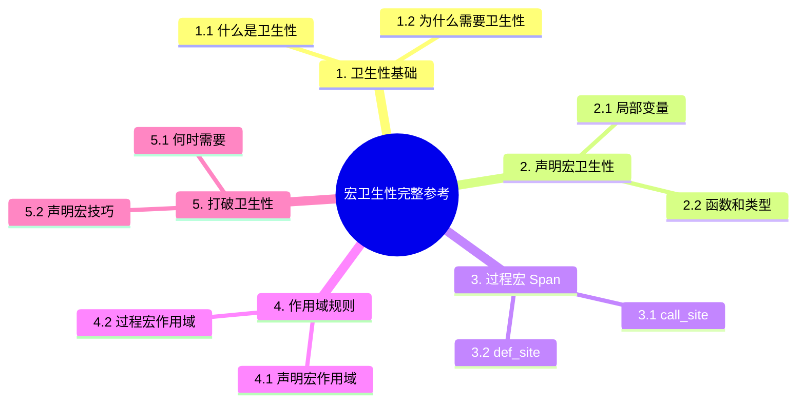

> **EN**: Macro Hygiene
> **Summary**: Authoritative concept page for `宏卫生性完整参考`. Content migrated from `crates/c11_macro_system_proc/docs/tier_03_references/04_macro_hygiene_reference.md`.
> **Rust 版本**: 1.97.0+ (Edition 2024)
> **受众**: [专家]
> **内容分级**: [专家级]
> **Bloom 层级**: L4-L5
> **权威来源**: 本文件为 `concept/` 权威页。
> **A/S/P 标记**: **S+A** — Structure + Application
> **双维定位**: S×Eva — 评估宏（Macro）卫生性设计
> **前置依赖**: [过程宏（Procedural Macro）](02_proc_macro.md) · [syn/quote 参考](08_syn_quote_reference.md)
> **后置概念**: [生产级宏（Macro）开发](05_production_grade_macro_development.md) · [宏调试与诊断](04_macro_debugging_and_diagnostics.md)
> **定理链**: Hygiene ⟹ Span Selection ⟹ Name Collision Prevention
>
> **权威来源**: 本页为 `Macro Hygiene` 的权威概念页；crate 文档仅保留导航 stub。

# 宏卫生性完整参考

**最后更新**: 2025-12-11
**适用版本**: Rust 1.97.0+

本文档详细说明 Rust 宏的卫生性(Hygiene)机制、作用域规则和最佳实践。

---

## 📋 目录

- [宏卫生性完整参考](#宏卫生性完整参考)
  - [📋 目录](#-目录)
  - [1. 卫生性基础](#1-卫生性基础)
    - [1.1 什么是卫生性](#11-什么是卫生性)
    - [1.2 为什么需要卫生性](#12-为什么需要卫生性)
    - [1.3 Rust 的卫生性模型](#13-rust-的卫生性模型)
  - [2. 声明宏卫生性](#2-声明宏卫生性)
    - [2.1 局部变量](#21-局部变量)
    - [2.2 函数和类型](#22-函数和类型)
    - [2.3 模块和导入 (Modules and Imports)](#23-模块和导入-modules-and-imports)
  - [3. 过程宏 Span](#3-过程宏-span)
    - [3.1 call\_site()](#31-call_site)
    - [3.2 def\_site()](#32-def_site)
    - [3.3 mixed\_site()](#33-mixed_site)
  - [4. 作用域规则](#4-作用域规则)
    - [4.1 声明宏作用域](#41-声明宏作用域)
    - [4.2 过程宏作用域](#42-过程宏作用域)
    - [4.3 跨 crate 作用域](#43-跨-crate-作用域)
  - [5. 打破卫生性](#5-打破卫生性)
    - [5.1 何时需要](#51-何时需要)
    - [5.2 声明宏技巧](#52-声明宏技巧)
    - [5.3 过程宏技巧](#53-过程宏技巧)
  - [6. 常见问题](#6-常见问题)
    - [6.1 变量捕获](#61-变量捕获)
    - [6.2 类型解析](#62-类型解析)
    - [6.3 trait 解析](#63-trait-解析)
  - [7. 最佳实践](#7-最佳实践)
    - [7.1 设计原则](#71-设计原则)
    - [7.2 调试技巧](#72-调试技巧)
  - [8. 高级主题](#8-高级主题)
    - [8.1 宏 2.0 (未稳定)](#81-宏-20-未稳定)
    - [8.2 与其他语言对比](#82-与其他语言对比)
  - [9. 实测示例：声明宏的变量卫生（2026-07-12 回填）](#9-实测示例声明宏的变量卫生2026-07-12-回填)
  - [附录 A：语法上下文与实现细节（2026-07-13 迁移去重合并）](#附录-a语法上下文与实现细节2026-07-13-迁移去重合并)
    - [A.1 语法上下文 (Syntax Context)](#a1-语法上下文-syntax-context)
    - [A.2 标识符分类：绑定 / 引用 / 标签](#a2-标识符分类绑定--引用--标签)
    - [A.3 实现细节：Span ID 与标记 (Mark)](#a3-实现细节span-id-与标记-mark)
  - [认知路径](#认知路径)
  - [定理链](#定理链)
  - [反命题](#反命题)
  - [反向推理](#反向推理)
  - [过渡段](#过渡段)
  - [📋 关键属性](#-关键属性)
  - [🔗 概念关系](#-概念关系)
  - [国际权威参考 / International Authority References（P1 学术 · P2 生态）](#国际权威参考--international-authority-referencesp1-学术--p2-生态)
  - [⚠️ 反例与陷阱](#️-反例与陷阱)
    - [反例：宏内 `let` 绑定泄漏假设（rustc 1.97.0 实测）](#反例宏内-let-绑定泄漏假设rustc-1970-实测)
    - [✅ 修正：由调用点传入标识符](#-修正由调用点传入标识符)
  - [🧭 思维导图（Mindmap）](#-思维导图mindmap)

---

## 1. 卫生性基础

卫生性（Hygiene）是宏系统的「作用域隔离」机制：**宏展开生成的标识符默认不会与调用点作用域中的同名标识符互相捕获**。本节从三个层面建立基础：

1. **什么是卫生性**（1.1）：以 C 预处理器 `SWAP` 宏的经典事故为反例——文本替换不携带作用域信息，`temp` 变量会捕获调用点的同名变量；
2. **为什么需要卫生性**（1.2）：宏是可组合的代码生成器，没有卫生性则每个宏的内部变量名都成为公共 API 的一部分，库升级即可能破坏下游；
3. **Rust 的卫生性模型**（1.3）：Rust 采用**部分卫生（partial/mixed-site hygiene）**——局部变量与标签卫生，而类型名、函数名、模块路径默认按调用点解析。

判定准则：判断一个宏是否卫生，问「展开结果中的每个标识符按哪个作用域解析」——答案必须对每个标识符明确，而非笼统。

### 1.1 什么是卫生性

**卫生性 (Hygiene)** 是指宏展开后，宏内外的标识符不会意外冲突的特性。

**卫生宏**:

- 宏内定义的变量不泄露到外部
- 宏外的变量不被宏意外捕获

**非卫生宏** (C/C++):

```c
#define SWAP(a, b) { int temp = a; a = b; b = temp; }

int temp = 1;
int x = 2, y = 3;
SWAP(x, y);  // ❌ temp 被覆盖！
```

---

### 1.2 为什么需要卫生性

**问题场景**:

```rust
// 假设宏不卫生
macro_rules! bad_macro {
    ($e:expr) => {
        {
            let result = $e;  // 如果不卫生，可能冲突
            result * 2
        }
    };
}

let result = 10;
let x = bad_macro!(result + 1);  // 如果不卫生会有问题
```

**卫生性的好处**:

1. 避免意外的名称冲突
2. 提高宏的可组合性
3. 使宏行为可预测

---

### 1.3 Rust 的卫生性模型

Rust 使用 **语法上下文 (Syntax Context)** 追踪标识符来源：

```rust
macro_rules! demo {
    () => {
        let x = 1;  // x 有 "宏定义" 上下文
    };
}

let x = 0;      // x 有 "调用点" 上下文
demo!();
println!("{}", x);  // 0，使用调用点的 x
```

**关键概念**:

- 每个标识符都有关联的 **Span**
- Span 包含 **Syntax Context**
- 不同上下文的同名标识符被视为不同

---

## 2. 声明宏卫生性

`macro_rules!` 的卫生性是「混合位置卫生」的具体化，按标识符类别分三条规则：

- **局部变量（2.1）**：宏内 `let` 绑定与调用点完全隔离——宏内 `let result = ...` 永远不会捕获或污染调用点的 `result`。这是卫生性最强的一类；
- **函数和类型（2.2）**：宏展开中的函数调用与类型名按**调用点**解析——宏可以直接使用调用点作用域中的函数与类型，这既是便利也是耦合（调用点缺少对应导入时错误信息会指向展开位置）；
- **模块和导入（2.3）**：宏内的 `use` 与路径解析同样按调用点进行，跨 crate 宏必须用 `$crate` 前缀引用自身 crate 的项，否则依赖调用点的导入环境。

实践含义：编写可导出宏时，内部所有对自身 crate 项的引用必须写成 `$crate::path::item`——这是 `macro_export` 宏能跨 crate 工作的前提。

### 2.1 局部变量

```rust
macro_rules! with_temp {
    ($e:expr) => {
        {
            let temp = $e;  // 宏定义的 temp
            temp * 2
        }
    };
}

let temp = 10;
let result = with_temp!(5);  // 15
println!("temp = {}", temp); // 10，不受影响
```

**规则**:

- 宏内定义的局部变量 **不会** 泄露到外部
- 宏外的局部变量 **不会** 被宏内引用（Reference）（除非通过 `$var`）

---

### 2.2 函数和类型

```rust
macro_rules! call_helper {
    () => {
        helper_function()
    };
}

fn helper_function() -> i32 {
    42
}

// ✅ 如果 helper_function 在调用点作用域内可见
let result = call_helper!();  // OK

// ❌ 如果 helper_function 不在作用域内
mod inner {
    // let result = call_helper!();  // 错误！
}
```

**规则**:

- 宏内引用（Reference）的函数/类型，在 **调用点** 解析
- 使用完整路径避免歧义：`::std::vec::Vec`

---

### 2.3 模块和导入 (Modules and Imports)

```rust
macro_rules! use_hashmap {
    () => {
        {
            use std::collections::HashMap;  // 导入在宏内
            let mut map = HashMap::new();
            map.insert("key", "value");
            map
        }
    };
}

// HashMap 不在外部作用域
let map = use_hashmap!();
// let another = HashMap::new();  // 错误！HashMap 未导入
```

**规则**:

- `use` 语句在宏内生效
- 不会影响外部作用域

---

## 3. 过程宏 Span

过程宏操作 `TokenStream`，每个 token 携带一个 `Span`——卫生性在过程宏中不是自动规则，而是**由宏作者通过 Span 选择显式控制**的。三个工厂函数对应三种解析位置：

| Span | 解析位置 | 典型用途 |
|:---|:---|:---|
| `Span::call_site()` | 调用点作用域 | 生成需要访问调用点局部变量/导入的代码（如 `println!` 风格的格式化宏） |
| `Span::def_site()` | 宏定义 crate 作用域 | 生成宏内部辅助项，完全隔离（**仍 nightly**，`proc_macro_def_site` feature） |
| `Span::mixed_site()` | 混合：局部变量按 def_site，其余按 call_site | 复现 `macro_rules!` 的卫生行为，过程宏的默认推荐 |

关键判定：用 `Ident::new("name", span)` 创建标识符时，span 选择决定了生成的 `name` 能否被调用点代码引用——选错 span 是过程宏「展开正确但编译报未定义」的头号原因。

### 3.1 call_site()

**最卫生的选择**，标识符使用调用点的作用域：

```rust
use proc_macro::Span;
use quote::quote;

let ident = syn::Ident::new("result", Span::call_site());

quote! {
    let #ident = 42;  // 使用调用点作用域
}
```

**效果**:

```rust
# macro_rules! my_macro { ($($t:tt)*) => {} }
// 调用
my_macro!();

// 展开为（概念上）
let result = 42;  // result 在调用点作用域
```

---

### 3.2 def_site()

**不卫生**，标识符使用宏定义点的作用域（需要每日构建版工具链）：

```rust
// 需启用实验特性门 proc_macro_def_site（每日构建版工具链）

use proc_macro::Span;

let ident = syn::Ident::new("internal_var", Span::def_site());

quote! {
    let #ident = 42;  // internal_var 在宏定义作用域
}
```

**用途**:

- 宏内部辅助变量
- 避免与用户代码冲突

---

### 3.3 mixed_site()

**折中方案**，适合大多数场景（Rust 1.45+）：

```rust
use proc_macro::Span;

let ident = syn::Ident::new("helper", Span::mixed_site());

quote! {
    fn #ident() {  // helper 使用混合上下文
        // ...
    }
}
```

**特点**:

- 对 `macro_rules!` 扩展更友好
- 平衡卫生性和灵活性

---

## 4. 作用域规则

宏的**可用性作用域**（哪里能调用）与**卫生性作用域**（标识符如何解析）是两组独立规则，本节梳理前者：

- **声明宏作用域（4.1）**：`macro_rules!` 遵循**文本作用域**——宏只在定义点之后、同一模块树范围内可用；`#[macro_use]` 可向上游模块提升，`#[macro_export]` 则把宏挂到 crate 根；
- **过程宏作用域（4.2）**：过程宏是独立编译的 crate（`proc-macro = true`），通过普通 `use` 引入，作用域规则与函数完全一致——没有文本顺序限制；
- **跨 crate 作用域（4.3）**：`#[macro_export]` 宏在依赖方以 `use crate_name::macro_name` 引入（2018 edition），卫生性跨 crate 保持：宏内绑定仍不泄漏，但 `$crate` 解析回定义 crate。

常见错误：在 `macro_rules!` 定义点之前调用（E0432/未定义宏），或忘记 `#[macro_use]` 导致子模块不可见。

### 4.1 声明宏作用域

```rust,ignore
macro_rules! outer {
    () => {
        macro_rules! inner {  // 内部宏
            () => { 42 };
        }
        inner!()  // ✅ 可以调用
    };
}

let x = outer!();  // 42
// inner!();  // ❌ inner 不在作用域
```

**规则**:

- 宏可以定义宏
- 内部宏作用域限于外部宏展开的代码块

---

### 4.2 过程宏作用域

```rust,ignore
use quote::quote;

#[proc_macro]
pub fn gen_code(_input: TokenStream) -> TokenStream {
    quote! {
        mod internal {
            pub fn helper() -> i32 { 42 }
        }

        internal::helper()  // 可访问
    }.into()
}

// 使用
let x = gen_code!();
// internal::helper();  // ❌ internal 不在外部作用域
```

**规则**:

- 宏生成的项（函数、结构体（Struct）、模块（Module））在展开位置可见
- 除非明确标记 `pub`，否则不会泄露到外部

---

### 4.3 跨 crate 作用域

```rust
// 库 crate
#[macro_export]
macro_rules! my_macro {
    () => {
        // 使用完整路径
        ::std::vec::Vec::<i32>::new()
    };
}

// 用户 crate
use my_crate::my_macro;

let v = my_macro!();  // ✅ 即使未导入 Vec
```

**最佳实践**:

- 跨 crate 宏使用完整路径：`::std::...`
- 避免依赖调用点的导入

---

## 5. 打破卫生性

卫生性保护宏内部，但有时宏**需要**与调用点交互——「打破卫生性」是受控的交互设计，不是漏洞利用。三条合法通道：

1. **何时需要（5.1）**：生成的代码必须引用调用点的特定变量（如 `tracing::info!` 读取调用点上下文）、必须注入调用点作用域的项（如某些 derive 生成的辅助函数）；
2. **声明宏技巧（5.2）**：由调用方传入标识符（`$name:ident` 参数天然携带调用点上下文）、用 `$crate` 引用定义 crate、用 `concat_idents!`（nightly）拼接标识符；
3. **过程宏技巧（5.3）**：`Span::call_site()` 让生成标识符按调用点解析，`parse_macro_input!` 解析调用方传入的标识符再回注。

判定准则：打破卫生性必须**由调用方显式提供标识符或显式选择 span**——隐式捕获调用点变量名的宏是 bug 而非特性。

### 5.1 何时需要

**合理场景**:

1. DSL 宏需要访问外部变量
2. 测试框架需要注入变量
3. 特定领域约定

**示例**:

```rust
// 测试框架
macro_rules! assert_eq_with_context {
    ($left:expr, $right:expr) => {
        {
            let left_val = $left;
            let right_val = $right;
            assert_eq!(left_val, right_val,
                "Assertion failed in test");
        }
    };
}
```

---

### 5.2 声明宏技巧

**技巧 1: 约定的变量名**:

```rust,ignore
macro_rules! with_context {
    ($body:expr) => {
        {
            let ctx = Context::new();  // 约定名称
            $body  // 用户代码可访问 ctx
        }
    };
}

// 使用
with_context!({
    ctx.do_something();  // ❌ 实际不行，因为卫生性
});
```

**技巧 2: 显式参数**:

```rust,ignore
macro_rules! with_context {
    ($ctx:ident, $body:expr) => {
        {
            let $ctx = Context::new();  // 用户指定名称
            $body
        }
    };
}

// 使用
with_context!(ctx, {
    ctx.do_something();  // ✅ 可以访问
});
```

---

### 5.3 过程宏技巧

**使用 `Span::call_site()` + 约定**:

```rust
use proc_macro::Span;
use quote::quote;

#[proc_macro_attribute]
pub fn inject_var(_attr: TokenStream, item: TokenStream) -> TokenStream {
    let item: syn::ItemFn = syn::parse(item).unwrap();

    // 使用 call_site，让标识符在用户作用域
    let injected = syn::Ident::new("injected_var", Span::call_site());

    quote! {
        #item

        // 用户函数可以访问 injected_var
        let #injected = 42;
    }.into()
}
```

---

## 6. 常见问题

本节归纳卫生性相关的三类高频故障及其诊断方法：

- **变量捕获（6.1）**：症状是「宏在某些调用点工作、在另一些报 E0425」——根因是宏依赖了调用点的变量名而未通过参数传入；诊断用 `cargo expand` 对比展开结果；
- **类型解析（6.2）**：宏内写 `Vec::new()` 而调用点导入了冲突的 `Vec`（如自定义类型遮蔽 prelude）——修复是用完全限定路径 `::std::vec::Vec` 或 `$crate` 重导出；
- **trait 解析（6.3）**：宏生成的代码调用的 trait 方法要求 trait 在调用点 `use` 可见——导出宏应在文档中声明 trait 导入要求，或在宏内用完全限定调用 `<T as Trait>::method` 消除依赖。

通用诊断顺序：`cargo expand` 看展开 → 逐标识符判定解析位置 → 对照本节三类故障定位。

### 6.1 变量捕获

**问题**:

```rust
macro_rules! double {
    ($x:ident) => {
        $x * 2  // ✅ 捕获用户的 $x
    };
}

let value = 10;
let result = double!(value);  // 20
```

**注意**:

- `$x:ident` 捕获标识符，保留其上下文
- `$x:expr` 捕获表达式，在宏内求值

---

### 6.2 类型解析

**问题**:

```rust
macro_rules! use_vec {
    () => {
        Vec::new()  // ❌ 如果 Vec 未导入
    };
}

// 解决：使用完整路径
macro_rules! use_vec {
    () => {
        ::std::vec::Vec::new()  // ✅
    };
}
```

---

### 6.3 trait 解析

**问题**:

```rust
macro_rules! default_value {
    ($t:ty) => {
        <$t>::default()  // ❌ 如果 Default 未导入
    };
}

// 解决
macro_rules! default_value {
    ($t:ty) => {
        <$t as ::std::default::Default>::default()  // ✅
    };
}
```

---

## 7. 最佳实践

本节把卫生性规则收敛为可执行的两组实践：

- **设计原则（7.1）**：① 宏内所有自身 crate 的引用走 `$crate`；② 需要调用点标识符一律通过参数传入，绝不猜测变量名；③ 过程宏默认用 `mixed_site()`，只在确知需要时用 `call_site()`；④ 生成的公开项名加 crate 前缀或 `__` 私有前缀降低冲突面；
- **调试技巧（7.2）**：`cargo expand` 查看展开结果是第一工具；`RUSTFLAGS="-Z macro-backtrace"`（nightly）定位展开错误链；为宏编写「调用点存在同名变量」的对抗性测试——如宏内用 `result`，测试用例就声明一个 `let result = ...` 验证不冲突。

配套单测模式见后续代码块：用 `macro_rules!` 生成测试用例批量验证卫生性不变量。

### 7.1 设计原则

1. **默认使用卫生宏**

   ```rust
   macro_rules! good {
       ($e:expr) => {
           {
               let _temp = $e;  // 使用 _ 前缀避免冲突
               _temp
           }
       };
   }
   ```

2. **使用完整路径**

   ```rust
   macro_rules! safe {
       () => {
           ::std::vec::Vec::<i32>::new()
       };
   }
   ```

3. **明确文档化非卫生行为**

   ```rust
   /// ⚠️ 此宏会在当前作用域定义 `result` 变量
   macro_rules! defines_result {
       ($e:expr) => {
           let result = $e;
       };
   }
   ```

---

### 7.2 调试技巧

**技巧 1: 使用 cargo expand**:

```bash
cargo expand my_module::my_function
```

**技巧 2: 添加诊断**:

```rust
macro_rules! debug_hygiene {
    ($x:ident) => {
        {
            let local = 42;
            println!("Macro local: {}", local);
            println!("User var: {}", $x);
        }
    };
}
```

**技巧 3: 单元测试**:

```rust
#[test]
fn test_hygiene() {
    let local = 10;
    my_macro!(local);
    assert_eq!(local, 10);  // 确保未被修改
}
```

---

## 8. 高级主题

本节覆盖卫生性机制的前沿与横向对比：

- **宏 2.0（8.1，未稳定）**：`macro` 关键字声明的新一代声明宏（`macro` feature，nightly），目标是卫生性更完整（默认全卫生）、作用域改为基于路径而非文本顺序、错误信息显著改善；与 `macro_rules!` 将长期共存，无迁移强制；
- **与其他语言对比（8.2）**：Lisp/Scheme 是卫生宏的理论源头（Kohlbecker 1986），其 `syntax-case` 提供完全的上下文控制；C/C++ 预处理器零卫生（纯文本替换）是反面教材；Zig 的 `comptime` 与 D 的 mixin 选择了「编译期函数求值」路线，用阶段分离替代卫生机制。

Rust 的位置：以**部分卫生**换取「宏可以自然引用调用点类型与函数」的人体工学，是理论 purity 与工程可用性的折中点。

### 8.1 宏 2.0 (未稳定)

```rust,ignore
// 需启用实验特性门 decl_macro（每日构建版工具链）

pub macro my_macro($e:expr) {
    $e * 2
}
```

**特性**:

- 更好的卫生性控制
- 更灵活的导出
- 改进的作用域规则

---

### 8.2 与其他语言对比

| 语言     | 卫生性  | 机制           |
| :--- | :--- | :--- || **Rust** | ✅ 是   | Syntax Context |
| C/C++    | ❌ 否   | 文本替换       |
| Scheme   | ✅ 是   | Syntax Objects |
| Lisp     | ⚠️ 部分 | 依赖实现       |
| Scala    | ⚠️ 部分 | 准引用         |

---

**相关文档**:

- [声明宏完整参考](/crates/c11_macro_system_proc/docs/tier_03_references/01_declarative_macros_complete_reference.md)
- [过程宏API参考](/crates/c11_macro_system_proc/docs/tier_03_references/02_procedural_macro_api_reference.md)
- [syn-quote参考](/crates/c11_macro_system_proc/docs/tier_03_references/03_syn_quote_reference.md)

---

> **权威来源**: [Rust Reference](https://doc.rust-lang.org/reference/), [The Rust Programming Language](https://doc.rust-lang.org/book/), [Rust Standard Library](https://doc.rust-lang.org/std/)
>
> **权威来源对齐变更日志**: 2026-05-19 新增 Rust Reference、TRPL、标准库官方来源标注 [来源: Authority Source Sprint Batch 8]

**文档版本**: 1.1
**最后更新**: 2026-05-19
**状态**: ✅ 权威来源对齐完成 (Batch 8)

---

## 9. 实测示例：声明宏的变量卫生（2026-07-12 回填）

> **来源**: [Rust Reference — Macros By Example: Hygiene](https://doc.rust-lang.org/reference/macros-by-example.html#hygiene)

`macro_rules!` 对**局部变量**实行 def-site 卫生：宏内部绑定的变量不会与调用处同名变量混淆，反之亦然。rustc 1.97.0 `--edition 2024` 实测：

```rust
macro_rules! make_fn {
    ($name:ident) => {
        fn $name() -> u32 {
            let value = 42; // def-site 变量：与调用处 value 不同源
            value
        }
    };
}

make_fn!(answer);

fn main() {
    let value = 1;
    assert_eq!(answer(), 42); // 宏内 value 不受调用处遮蔽
    assert_eq!(value, 1);     // 调用处 value 不被宏污染
}
```

对照要点（呼应 §1–§3）：

- **类型/函数/宏** 等条目名在 `macro_rules!` 中是 call-site 解析（非卫生）——上例 `$name` 按调用处可见性生成 `fn answer`；
- **局部变量、生命周期、标签** 是 def-site 卫生——这是上例成立的依据；
- 需要刻意跨边界时，用 `$crate` 引用定义处条目（见 §3 过程宏 Span 的对照）；过程宏则通过 `Span::call_site()` / `Span::def_site()`（nightly）显式控制。

> **权威来源**: [Rust Reference — Macros By Example: Hygiene](https://doc.rust-lang.org/reference/macros-by-example.html#hygiene) · [Rust Reference — Procedural Macros](https://doc.rust-lang.org/reference/procedural-macros.html)（链接 2026-07-12 curl 实测 200；代码 rustc 1.97.0 实测）

---

## 附录 A：语法上下文与实现细节（2026-07-13 迁移去重合并）

> 本附录合并自 `crates/c11_macro_system_proc/docs/tier_04_advanced/05_macro_hygiene_in_depth.md` 的迁移内容。
> 与原主体重复的章节（卫生性定义、跨 crate 卫生性、故意打破卫生性、最佳实践）已按 `AGENTS.md` §2 canonical 规则去重，仅保留原主体未覆盖的三个专题：语法上下文的形式化、标识符分类、Span 内部实现。

### A.1 语法上下文 (Syntax Context)

卫生性在编译器内部的形式化模型是：**标识符 = 符号名 + 语法上下文 ID（SyntaxContext）**。两个符号名相同的标识符，只要 SyntaxContext 不同，就是不同的绑定——这就是宏内 `let x` 与调用点 `let x` 互不干扰的根本原因。

```text
标识符 = 符号名 + 语法上下文 ID

语法上下文 ID 决定标识符来自哪个作用域：
- 调用点（call site）的上下文
- 宏定义处（definition site）的上下文
- 混合上下文（mixed site）
```

```rust
// 宏定义时的上下文
macro_rules! hygienic {
    () => {
        let x = 1;  // 标记为 "宏定义上下文"
    };
}

fn main() {
    hygienic!();   // 调用点上下文与宏定义上下文分离
    let x = 2;     // 不同的语法上下文，不会冲突
}
```

### A.2 标识符分类：绑定 / 引用 / 标签

宏参数 `$name:ident` 的卫生行为取决于它在展开结果中的**使用位置**，三类位置各有一条规则：

- **绑定位置（Binding）**：`let $name = ...;`——绑定本身被赋予宏的上下文，外部同名变量不受影响：

```rust
macro_rules! bind {
    ($name:ident) => {
        let $name = 42;  // $name 是绑定位置
    };
}

fn main() {
    bind!(x);          // x 绑定到宏内部的 let
    println!("{}", x); // ✅ 使用绑定的 x
}
```

- **引用位置（Reference）**：`println!("{}", $name)`——引用按调用点上下文解析，能看到调用者的绑定：

```rust
macro_rules! reference {
    ($name:ident) => {
        println!("{}", $name);  // $name 是引用位置
    };
}

fn main() {
    let y = 42;
    reference!(y);     // y 引用外部的绑定
}
```

- **标签（Label）**：循环标签与生命周期同样卫生，宏内标签不会捕获调用点的同名标签：

```rust
macro_rules! with_label {
    ($label:lifetime) => {
        $label: loop { break $label; }
    };
}

fn main() {
    with_label!('outer);  // 标签也是卫生的
}
```

### A.3 实现细节：Span ID 与标记 (Mark)

rustc 内部用 Span 记录每个 token 的来源，卫生性即 Span 中 `ctxt` 字段的相等性判定：

```text
Span 结构:
- lo: BytePos (起始位置)
- hi: BytePos (结束位置)
- ctxt: SyntaxContext (语法上下文 ID)

SyntaxContext 结构:
- opaque: u32 (不透明上下文 ID)
- transparent: Vec<Mark> (透明标记链)
```

```text
Mark 表示宏展开层级:
- Mark 0: 顶层（无宏）
- Mark 1: 第一次宏展开
- Mark 2: 第二次宏展开（嵌套宏）
...
```

每次宏展开压入一个 Mark；名称解析时比较两个标识符的 Mark 链，链不同即视为不同作用域——`cargo expand` 看到的「展开后同名变量不冲突」正是这套机制的运行结果。

---

> **权威来源**: [Rust Reference](https://doc.rust-lang.org/reference/), [The Rust Programming Language](https://doc.rust-lang.org/book/), [Rust Standard Library](https://doc.rust-lang.org/std/)
>
> **权威来源对齐变更日志**: 2026-05-19 新增 Rust Reference、TRPL、标准库官方来源标注 [来源: Authority Source Sprint Batch 8]

**文档版本**: 1.1
**最后更新**: 2026-05-19
**状态**: ✅ 权威来源对齐完成 (Batch 8)

---

> **向下引用**: 参见 [17_macro_patterns](../../02_intermediate/06_macros_and_metaprogramming/03_macro_patterns.md)

## 认知路径

1. **问题识别**: 识别宏展开时标识符作用域可能泄漏或冲突的问题。
2. **概念建立**: 掌握声明宏与过程宏的卫生性模型、span 类型（call_site/def_site/mixed_site）及其影响。
3. **机制推理**: 通过卫生性 ⟹ span 选择 ⟹ 名称冲突预防的定理链设计安全宏。
4. **边界辨析**: 辨析“hygiene 使宏无法调试”等反命题，理解卫生性是可靠性的基础。
5. **迁移应用**: 将卫生性与生产级开发、宏调试主题链接。

## 定理链

| 定理 | 前提 | 结论 |
|:---|:---|:---|
| 卫生性 ⟹ 防止名称冲突 | 宏生成的标识符不会意外捕获外部变量 | 展开后的代码更可预测 |
| call_site span ⟹ 用户上下文可见 | 生成的标识符表现得像用户写的 | 适用于需要用户覆盖的场景 |
| def_site span ⟹ 内部封装 | 标识符仅在宏定义处解析 | 防止外部意外干扰宏内部实现 |

## 反命题

> **反命题 1**: "宏卫生性使调试变得不可能" ⟹ 不成立。卫生性是作用域规则，不影响 cargo-expand 等展开查看工具。
>
> **反命题 2**: "所有生成标识符都应该用 call_site" ⟹ 不成立。call_site 会增加名称冲突与捕获风险。
>
> **反命题 3**: "声明宏与过程宏卫生性完全相同" ⟹ 不成立。二者实现细节与 span 控制能力存在差异。
>
## 反向推理

> **反向推理 1**: 宏展开后出现未定义的局部变量名冲突 ⟸ 说明 hygiene 未正确应用或错误使用了 call_site。
>
> **反向推理 2**: 用户无法在宏外覆盖某个生成标识符 ⟸ 说明 def_site 过度封装，应根据需求调整 span。
>
## 过渡段

> **过渡**: 从名称冲突风险过渡到卫生性机制，可以理解 hygiene 是宏可靠性的第一道防线。
>
> **过渡**: 从卫生性过渡到 span 选择，可以建立“何时开放用户上下文、何时封装内部实现”的决策框架。
>
> **过渡**: 从 span 决策过渡到生产级实践，可以将 hygiene 规则融入宏开发与测试流程。
>

---

## 📋 关键属性

| 属性 | 取值 / 判定 | 依据 |
|---|---|---|
| 卫生性定义 | 宏展开不意外捕获外部标识符，也不泄漏内部临时名 | 本文 §1.1 |
| Rust 模型 | 部分卫生：声明宏局部变量卫生，类型/路径按调用点解析 | 本文 §1.3 |
| Span 三态 | `call_site()` / `def_site()` / `mixed_site()` 控制解析位置 | 本文 §3.1–3.3 |
| 作用域 | 声明宏为文本作用域，过程宏跨 crate 经 Span 传递 | 本文 §四 |
| 打破卫生 | 需要时用 `$crate`、显式路径或由调用方传入标识符 | 本文 §五 |

## 🔗 概念关系

- **上位（is-a）**：[过程宏](02_proc_macro.md) 的语义核心专题。
- **下位（实例）**：声明宏卫生、过程宏 Span、跨 crate 作用域规则。
- **组合**：与 [宏调试与诊断](04_macro_debugging_and_diagnostics.md)（Span 与错误定位）组合。
- **依赖**：依赖 [关键字](../../01_foundation/00_start/06_keywords.md) 与标识符解析规则。

---

## 国际权威参考 / International Authority References（P1 学术 · P2 生态）

> 依据 `AGENTS.md` §2「对齐网络国际化权威内容」补充：仅追加已验证可达的权威链接，不改动正文事实。

- **P2 生态/社区**: [docs.rs/async-trait — 生态权威 API 文档](https://docs.rs/async-trait) · [docs.rs/syn — 生态权威 API 文档](https://docs.rs/syn)
- **P1 学术/形式化**: [Kohlbecker et al.: Hygienic Macro Expansion (LFP 1986, 卫生宏奠基)](https://dl.acm.org/doi/10.1145/319838.319859)

## ⚠️ 反例与陷阱

本节以宏引入的局部绑定对调用点不可见为反例，展示声明宏混合卫生的具体表现。

### 反例：宏内 `let` 绑定泄漏假设（rustc 1.97.0 实测）

```rust,compile_fail,E0425
macro_rules! define {
    () => { let secret = 42; };
}
fn main() {
    define!();
    println!("{}", secret); // ❌ 卫生规则：宏的局部变量不泄漏到调用点
}
```

**错误**：`E0425 cannot find value secret in this scope`——局部变量卫生使宏内绑定留在宏的语法上下文中。

### ✅ 修正：由调用点传入标识符

```rust
macro_rules! define {
    ($name:ident) => { let $name = 42; };
}
fn main() {
    define!(secret); // 标识符来自调用点，卫生上下文一致
    println!("{}", secret);
}
```

## 🧭 思维导图（Mindmap）


