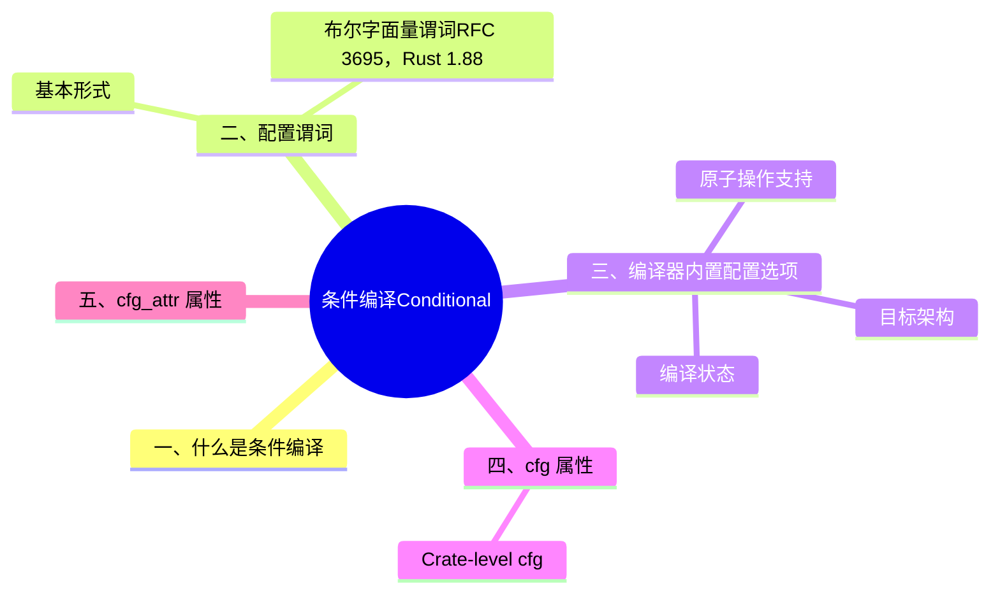

> **内容分级**: [专家级]
>
# 条件编译（Conditional Compilation）

> **EN**: Conditional Compilation
> **Summary**: Rust 条件编译机制：`cfg` 配置选项、`cfg`/`cfg_attr` 属性、`cfg!`/`cfg_select!` 宏（Macro），以及常见目标平台 cfg。
> **Rust 版本**: 1.97.0+ (Edition 2024)
>
> **受众**: [中级] / [进阶]
> **Bloom 层级**: L2-L3
> **权威来源**: 本文件为 `concept/` 权威页。
> **A/S/P 标记**: **S** — Specification / Language semantics
> **双维定位**: S×Sys — 语言与平台交互
> **前置依赖**:
> [Attributes and Macros](../../01_foundation/09_macros_basics/01_attributes_and_macros.md) ·
> [Modules and Paths](../../01_foundation/07_modules_and_items/01_modules_and_paths.md) ·
> [Error Handling](../../02_intermediate/03_error_handling/01_error_handling.md)
> **后置概念**:
> [FFI Advanced](../04_ffi/02_ffi_advanced.md) ·
> [Linkage](../04_ffi/03_linkage.md) ·
> [Cargo Profiles and Lints](../../06_ecosystem/01_cargo/11_cargo_profiles_and_lints.md)
> **定理链**: N/A — 语言规范/平台相关文档
> **主要来源**:
> [Rust Reference — Conditional Compilation](https://doc.rust-lang.org/reference/conditional-compilation.html) ·
> [Kohlbecker et al. — Hygienic Macro Expansion](https://doi.org/10.1145/41625.41632) ·
> [Flatt — Binding as Sets of Scopes](https://doi.org/10.1145/2814304.2814305) ·
> [TRPL](https://doc.rust-lang.org/book/title-page.html) ·
> [Brown University — Interactive Rust Book](https://rust-book.cs.brown.edu/) ·
> [Oxide: The Essence of Rust](https://arxiv.org/abs/1903.00982) ·
> [Itanium C++ ABI](https://itanium-cxx-abi.github.io/cxx-abi/abi.html)
>
> **来源**: [Rust Reference — Conditional Compilation](https://doc.rust-lang.org/reference/conditional-compilation.html)

---

## 一、什么是条件编译

**条件编译** 指仅在特定条件下才编译某段源代码。Rust 通过以下方式实现：(Source: [Rust Reference — Conditional Compilation](https://doc.rust-lang.org/reference/conditional-compilation.html))

- `cfg` 属性：`#[cfg(...)]`
- `cfg_attr` 属性：`#[cfg_attr(..., attr)]`
- `cfg!` 宏（Macro）：`cfg!(predicate)`
- `cfg_select!` 宏（Macro）：`cfg_select! { ... }`

条件编译的判定依据是**配置谓词（configuration predicate）**，谓词求值为 `true` 或 `false`。(Source: [Rust Reference — Configuration Predicates](https://doc.rust-lang.org/reference/conditional-compilation.html#configuration-predicates))

---

## 二、配置谓词

`#[cfg(predicate)]` 的谓词语言是「键值对 + 布尔组合」的受限逻辑，本节系统枚举：

- **基本形式**：`#[cfg(feature = "x")]`、`#[cfg(unix)]`、`#[cfg(target_arch = "x86_64")]`——单谓词直接判定；组合用 `all()`/`any()`/`not()`（无裸 `&&`，嵌套是递归的）；
- **布尔字面量谓词**（RFC 3695，1.88 稳定）：`#[cfg(true)]`/`#[cfg(false)]`——看似无用，实为「程序化生成 cfg」与「临时禁用代码」的规范形式（替代 `#[cfg(any())]` 等 hack）；
- **目标平台谓词**：`target_arch`/`target_os`/`target_env`/`target_family`/`target_pointer_width`/`target_endian`——平台代码的标准门控维度；
- **编译状态谓词**：`debug_assertions`（dev profile）、`test`（`cargo test` 构建）、`doc`（rustdoc）、`miri`（Miri 解释器，非官方但稳定约定）。

判定准则：谓词名与值拼写错误**默认静默为 false**——`unexpected_cfgs` lint（1.80+ 默认 warn）应纳入 CI 防止拼写腐烂。

### 基本形式

| 谓词 | 含义 |
|:---|:---|
| `name` | 配置选项 `name` 被设置时为真 |
| `key = "value"` | 配置键值对匹配时为真 |
| `all(p1, p2, ...)` | 所有谓词为真时为真；空列表为真 |
| `any(p1, p2, ...)` | 任一谓词为真时为真；空列表为假 |
| `not(p)` | `p` 为假时为真 |
| `true` / `false` | 字面量，恒真/恒假 |

```rust
#[cfg(all(unix, target_pointer_width = "32"))]
fn on_32bit_unix() {}

#[cfg(any(target_os = "linux", target_os = "macos"))]
fn on_linux_or_macos() {}

#[cfg(not(windows))]
fn not_windows() {}
```

### 布尔字面量谓词（RFC 3695，Rust 1.88 稳定）

> **来源**: [RFC 3695 — Allow boolean literals as cfg predicates](https://rust-lang.github.io/rfcs/3695-cfg-boolean-literals.html) · [Rust Reference — Conditional Compilation](https://doc.rust-lang.org/reference/conditional-compilation.html) · [Rust 1.88.0 Release Blog](https://blog.rust-lang.org/2025/06/26/Rust-1.88.0/)

自 Rust 1.88 起，配置谓词语言支持布尔字面量 `true` / `false`，分别表示恒启用与恒禁用：

```rust
// rustc 1.97.0 --edition 2024 实测通过
#[cfg(false)]
fn never_compiled() {}   // 等价于旧式 #[cfg(any())]，但语义显式

#[cfg(true)]
fn always_compiled() {}  // 等价于旧式 #[cfg(all())]

fn main() {
    always_compiled();
    if cfg!(false) { unreachable!() }  // cfg! 宏同样支持
}
```

适用范围：`#[cfg]`、`#[cfg_attr]`、内置 `cfg!` 宏，以及 Cargo 清单与配置中的 `[target.'cfg(...)']` 表。注意 `cfg(r#true)` / `cfg(r#false)` 保留旧行为（作为自定义 cfg 选项名，由 `--cfg true` 控制），与布尔字面量区分。

---

## 三、编译器内置配置选项

编译器自动设置的 cfg 选项全集（除目标平台外）：

- **`debug_assertions`**：dev 构建时设置——`debug_assert!`/`debug_assert_eq!` 的生效条件，自定义「仅调试检查」代码用 `#[cfg(debug_assertions)]`；
- **`test`**：`cargo test` 构建测试 harness 时设置——`#[cfg(test)] mod tests` 的底层机制，也可用于「测试专用的 mock 实现」；
- **`doc`**：rustdoc 构建时设置——文档测试中注入辅助代码（`#[cfg(doc)]` 块只在文档构建存在）；
- **`doctest`**（1.40+）：文档测试编译时设置——区分「rustdoc 渲染」与「doctest 运行」；
- **`miri`**：Miri 解释执行时设置——`#[cfg(miri)]` 跳过 Miri 不支持的操作（内联汇编、部分 SIMD）或减慢的测试（迭代次数降级）；
- **`target_has_atomic`** 系列：按宽度声明原子支持——`no_std`/嵌入式目标的可移植性门控依据。

完整权威列表见 [Rust Reference — Conditional compilation](https://doc.rust-lang.org/reference/conditional-compilation.html)。

### 目标架构

| 选项 | 说明 | 示例 |
|:---|:---|:---|
| `target_arch` | CPU 架构 | `"x86_64"`, `"aarch64"`, `"arm"`, `"wasm32"` |
| `target_feature` | 平台特性 | `"avx2"`, `"sse4.1"`, `"crt-static"` |
| `target_pointer_width` | 指针宽度 | `"32"`, `"64"` |
| `target_endian` | 字节序 | `"little"`, `"big"` |

### 目标操作系统与环境

| 选项 | 说明 | 示例 |
|:---|:---|:---|
| `target_os` | 操作系统 | `"windows"`, `"linux"`, `"macos"`, `"none"` |
| `target_family` | 目标族 | `"unix"`, `"windows"`, `"wasm"` |
| `unix` / `windows` | `target_family` 的简写 | — |
| `target_env` | ABI/libc 环境 | `"gnu"`, `"msvc"`, `"musl"`, `""` |
| `target_abi` | ABI 补充信息 | `"llvm"`, `"eabihf"`, `""` |
| `target_vendor` | 目标 vendor | `"apple"`, `"pc"`, `"unknown"` |

### 编译状态

| 选项 | 说明 |
|:---|:---|
| `test` | 使用 `--test` 编译测试 harness 时启用 |
| `debug_assertions` | 非优化编译时默认启用，控制 `debug_assert!` 行为 |
| `proc_macro` | 编译 `proc-macro` crate 时启用 |
| `panic = "abort"` / `panic = "unwind"` | 根据 panic 策略设置 |

### 原子操作支持

| 选项 | 说明 |
|:---|:---|
| `target_has_atomic = "8"` | 目标支持 8 位原子操作（Atomic Operations） |
| `target_has_atomic = "ptr"` | 目标支持指针宽度原子操作（Atomic Operations） |

> Rust 1.97 新增 `target_has_atomic_primitive_alignment = "ptr"`，详见 [Rust 1.97 稳定特性](../../07_future/00_version_tracking/rust_1_97_stabilized.md)。

---

## 四、`cfg` 属性

`#[cfg(predicate)]` 仅在谓词为真时包含被修饰的项。

```rust
#[cfg(target_os = "macos")]
fn macos_only() {}

#[cfg(any(foo, bar))]
fn needs_foo_or_bar() {}

#[cfg(panic = "unwind")]
fn when_unwinding() {}
```

### Crate-level cfg

```rust
#![no_std]
#![cfg(false)]

// 该函数不会被包含，但 #![no_std] 仍然有效保留
pub fn example() {}
```

> **注意**：crate-level `cfg(false)` 会移除后续所有内容，但**保留**它前面的 crate 属性。

---

## 五、`cfg_attr` 属性

`#[cfg_attr(predicate, attr1, attr2, ...)]` 在谓词为真时展开为后续属性。

```rust,ignore
#[cfg_attr(target_os = "linux", path = "linux.rs")]
#[cfg_attr(windows, path = "windows.rs")]
mod os;
```

```rust
#[cfg_attr(feature = "magic", sparkles, crackles)]
fn bewitched() {}

// 当 feature = "magic" 时等价于：
// #[sparkles]
// #[crackles]
// fn bewitched() {}
```

> `cfg_attr` 可以嵌套展开为另一个 `cfg_attr`。

---

## 六、`cfg!` 宏

`cfg!(predicate)` 在编译期求值为 `true` 或 `false` 字面量。(Source: [std::cfg!](https://doc.rust-lang.org/std/macro.cfg.html))

```rust
let machine_kind = if cfg!(unix) {
    "unix"
} else if cfg!(windows) {
    "windows"
} else {
    "unknown"
};
```

> 与 `#[cfg]` 不同，`cfg!` 的两分支代码都会被编译，只是运行时（Runtime）选择路径。

---

## 七、`cfg_select!` 宏

`cfg_select!` 在编译期根据多个配置谓词选择代码，第一个为真的臂被展开。(Source: [Rust Reference — cfg_select!](https://doc.rust-lang.org/reference/conditional-compilation.html#the-cfg_select-macro))

```rust
cfg_select! {
    unix => {
        fn foo() { /* unix specific */ }
    }
    target_pointer_width = "32" => {
        fn foo() { /* non-unix 32-bit */ }
    }
    _ => {
        fn foo() { /* fallback */ }
    }
}
```

- `_` 谓词恒为真，作为 fallback。
- 如果没有谓词为真，则编译错误。

---

## 八、自定义 cfg 选项

通过 `rustc --cfg name` 或 `RUSTFLAGS="--cfg name"` 可以设置任意 cfg 选项。

```bash
rustc --cfg foo main.rs
```

```rust
#[cfg(foo)]
fn custom_item() {}
```

Cargo 中通过 `RUSTFLAGS` 或在 `.cargo/config.toml` 中设置。

---

## 九、实践建议

1. **优先使用 `target_family` 简写**：`#[cfg(unix)]` 比 `#[cfg(target_family = "unix")]` 更简洁。
2. **避免 cfg 碎片化**：过多平台分支会降低可维护性，考虑使用 crate 如 `cfg-if` 或抽象平台无关 API。
3. **`cfg!` 用于运行时（Runtime）选择**：当两个分支都需要编译时使用 `cfg!`；当某平台完全不需要编译某段代码时使用 `#[cfg]`。
4. **测试不同目标**：使用 `cargo check --target` 验证条件编译代码。

---

## 十、相关概念

| 概念 | 关系 |
|:---|:---|
| [Attributes and Macros](../../01_foundation/09_macros_basics/01_attributes_and_macros.md) | `cfg` 是属性的重要用例 |
| [Linkage](../04_ffi/03_linkage.md) | `target_feature = "crt-static"` 影响 C 运行时（Runtime）链接 |
| [FFI Advanced](../04_ffi/02_ffi_advanced.md) | 平台相关 FFI 代码常用 `cfg` 条件编译 |
| [Cargo Features](../../06_ecosystem/01_cargo/10_cargo_manifest_reference.md) | `feature = "..."` 是 Cargo 传递给 rustc 的自定义 cfg |

> **权威来源**: [Rust Reference — Conditional Compilation](https://doc.rust-lang.org/reference/conditional-compilation.html), [TRPL](https://doc.rust-lang.org/book/title-page.html), [Cargo Reference — Features](https://doc.rust-lang.org/cargo/reference/features.html)
>
> **权威来源对齐变更日志**: 2026-07-10 Stage F L3 补全权威来源块与关键引用 [Authority Source Sprint Batch 10](../../00_meta/02_sources/05_international_authority_index.md)

---

## 国际权威参考 / International Authority References（P1 学术 · P2 生态）

> 依据 `AGENTS.md` §2「对齐网络国际化权威内容」补充：仅追加已验证可达的权威链接，不改动正文事实。

- **P2 生态/社区**: [docs.rs/async-trait — 生态权威 API 文档](https://docs.rs/async-trait) · [docs.rs/syn — 生态权威 API 文档](https://docs.rs/syn)

---

## ⚠️ 反例与陷阱：引用被 cfg 排除的项

**反例**（rustc 1.97 实测编译失败：E0425）：

```rust,compile_fail
#[cfg(any())]
fn platform_helper() {}
fn main() {
    platform_helper();
}
```

`#[cfg(...)]` 在名称解析前裁剪代码；条件不满足时该项根本不存在，调用处报「未定义」而非「配置不匹配」。演示用恒假 `any()` 保证各平台一致复现。

**修正**：

```rust
#[cfg(any())]
fn platform_helper() {}
#[cfg(not(any()))]
fn platform_helper() { println!("fallback"); }
fn main() {
    platform_helper();
}
```

## 🧭 思维导图（Mindmap）


