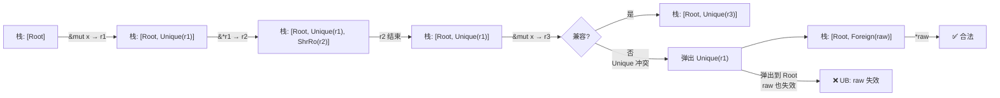
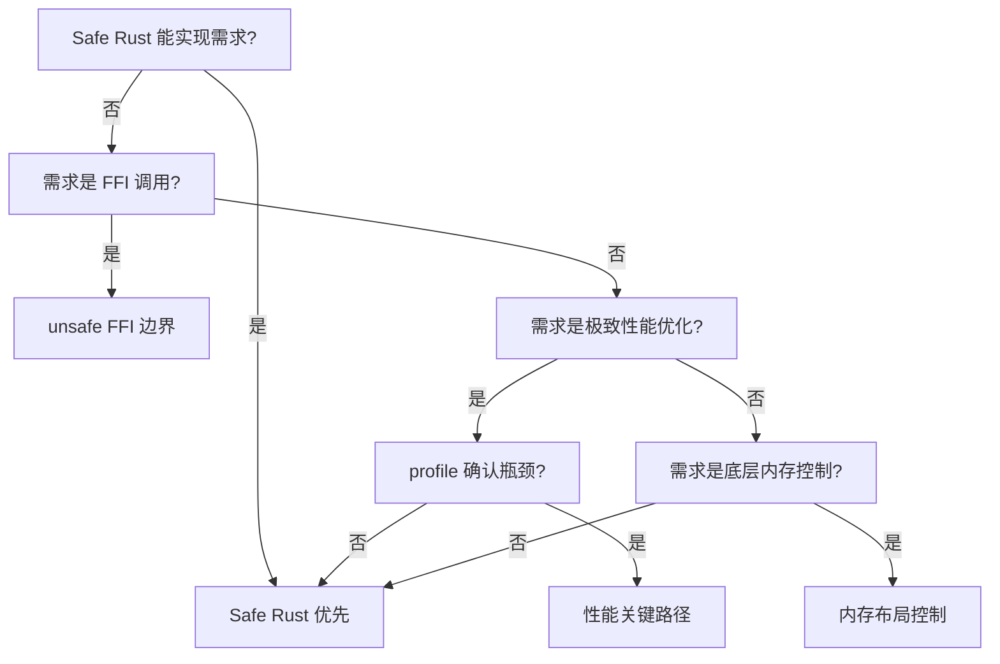
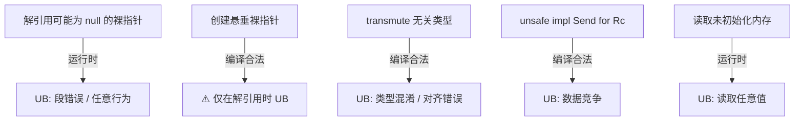
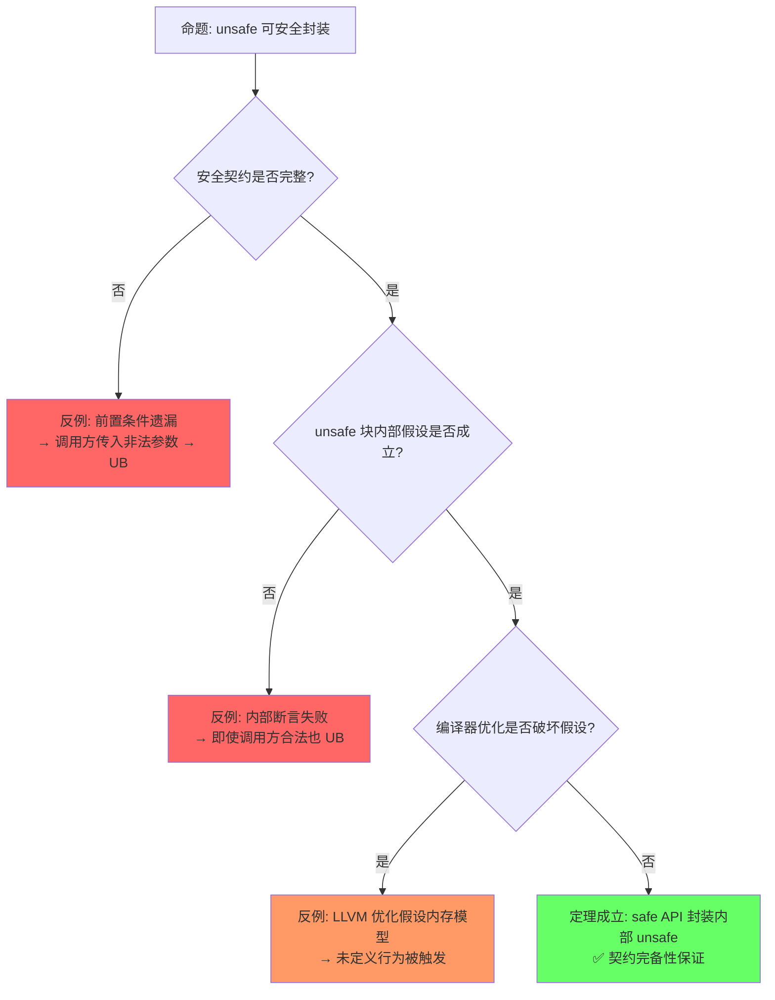

```mermaid
graph TD
    A[Unsafe Rust] --> B[unsafe 操作]
    A --> C[UB 分类]
    A --> D[安全抽象]
    A --> E[验证工具]
    A --> F[常见模式]

    B --> B1[裸指针 *const/*mut]
    B --> B2[unsafe fn / unsafe trait]
    B --> B3[extern 函数]
    B --> B4[union 访问]
    B --> B5[static mut]

    C --> C1[内存: UAF, OOB, 对齐]
    C --> C2[类型: 无效枚举, transmute]
    C --> C3[并发: 数据竞争]
    C --> D1[Validity Invariant]
    C --> D2[Safety Invariant]

    D --> D3[unsafe 实现 + safe 接口]
    D --> D4[Document Safety Contract]

    E --> E1[Miri]
    E --> E2[Kani]
    E --> E3[ASan / MSan]
    E --> E4[Creusot]

    F --> F1[FFI 边界]
    F --> F2[自定义数据结构]
    F --> F3[Send/Sync 实现]
    F --> F4[零拷贝解析]
```

# Unsafe Rust

> **层级**: L3 高级概念
> **前置概念**: [Ownership](../01_foundation/01_ownership.md) · [Borrowing](../01_foundation/02_borrowing.md) · [Memory Management](../02_intermediate/03_memory_management.md) · [Concurrency](../03_advanced/01_concurrency.md)
> **后置概念**: [FFI] · [Embedded] · [Custom Allocators]
> **主要来源**: [TRPL: Ch19.1](https://doc.rust-lang.org/book/ch19-01-unsafe-rust.html) · [Rust Reference: Unsafe Rust] · [Rustonomicon](https://doc.rust-lang.org/nomicon/) · [RFC 2585]

---

**变更日志**:

- v1.0 (2026-05-12): 初始版本，完成权威定义、unsafe 操作矩阵、UB 分类、Safety Contract 规范、思维导图、示例反例
- v1.1 (2026-05-13): 重构增强——定理一致性矩阵扩展至10行（⟹推理链）、反命题决策树×4、认知路径六步递进、章节过渡段落、层次一致性标注
- v1.2 (2026-05-13): 深度重构——新增 §5.5 Stacked Borrows 操作语义、§5.6 Tree Borrows 演进；增强 §7.2 Miri 检测边界（覆盖范围表格+MIRIFLAGS使用）；补充层次一致性标注（L1/L4映射）与章节过渡段落

---

<!-- L3::权威定义 -->

## 一、权威定义（Definition）

> 从形式系统角度看，`unsafe` 是 Rust 类型证明系统的显式边界突破。理解 unsafe 的权威定义，是区分"编译器保证"与"人工保证"的第一道门槛。

### 1.1 Wikipedia 权威定义

> **[Wikipedia: Undefined behavior]** In computer programming, undefined behavior (UB) is the result of executing computer code whose behavior is not prescribed by the language specification to which the code can adhere, for the current state of the program. This happens when the translator of the source code makes certain assumptions, but these assumptions are not satisfied during execution.

> **[Wikipedia: Memory safety]** Memory safety is the state of being protected from various software bugs and security vulnerabilities when dealing with memory access, such as buffer overflows and dangling pointers. A programming language is memory-safe if it prevents such issues through its design, type system, or automatic memory management.

> **[Wikipedia: Foreign function interface]** A foreign function interface (FFI) is a mechanism by which a program written in one programming language can call routines or make use of services written in another. FFI is the primary mechanism used by Rust to interoperate with C and other languages.

### 1.2 TRPL 官方定义

> **[TRPL: Ch19.1]** Rust has a second language hiding out inside it, unsafe Rust, which works just like regular Rust but gives you extra superpowers. Unsafe Rust exists because, by nature, static analysis is conservative. When the compiler tries to determine whether or not code upholds the guarantees, it's better for it to reject some valid programs than to accept some invalid programs.

### 1.3 Rustonomicon 定义

> **[Rustonomicon]** A block of code prefixed with `unsafe` does not permit the writing of arbitrary code. The `unsafe` keyword has two meanings: it declares the existence of a contract the compiler doesn't know about, and it declares that you have verified that contract.

> **[Rustonomicon: What is unsafe?]** unsafe 不是关闭检查器，而是声明程序员已人工验证某个编译器无法知晓的契约。安全抽象 = unsafe 实现 + safe 接口 + 人工证明。✅ 已验证
>
> **[TRPL: Ch19.1]** Safe Rust = 编译器可证明安全的程序集合；Unsafe Rust = Safe Rust ∪ 需要人工证明安全性的操作集合。✅ 已验证

### 1.4 形式化定义

`unsafe` 是**形式系统的显式边界突破**：

```text
Safe Rust = { 程序 P | 编译器可证明 P 满足内存安全 + 类型安全 + 并发安全 }
Unsafe Rust = Safe Rust ∪ { 操作 O | O 需要人工证明安全性 }

关键洞察:
  unsafe 不是"关闭检查器"，而是"程序员承担证明责任"
  安全抽象（Safe Abstraction）= unsafe 实现 + safe 接口 + 人工证明内部正确
```

---

<!-- L3::操作分类 -->

## 二、概念属性矩阵（Attribute Matrix）

> 在明确定义后，我们需要对 unsafe 提供的操作进行系统分类。以下三个矩阵分别覆盖：操作能力、未定义行为类型、以及各角色的安全责任。

### 2.1 Unsafe 操作分类矩阵

| **操作** | **语法** | **安全风险** | **典型用途** | **Safe 封装示例** |
|:---|:---|:---|:---|:---|
| **裸指针解引用** | `*raw_ptr` | UAF, 悬垂, 类型混淆 | FFI, 数据结构内部 | `Box::from_raw` |
| **调用 unsafe 函数** | `unsafe_fn()` | 依赖函数契约 | 底层系统调用 | `std::fs::read` |
| **实现 unsafe trait** | `unsafe impl Trait` | 破坏全局假设 | Send/Sync 标记 | `Arc<T>` |
| **访问 union 字段** | `union.field` | 类型混淆 | C 互操作 | `std::mem::ManuallyDrop` |
| **调用 extern 函数** | `extern "C"` | ABI 不匹配, UAF | 系统库调用 | `libc` crate |
| **修改可变静态变量** | `static mut` | 数据竞争 | 全局状态（避免） | `lazy_static!` |
| **内联汇编** | `asm!()` | 完全不受控 | 极致优化 | 极少数场景 |

> **[Rust Reference: Behavior considered undefined]** Rust 的 UB 清单包括：数据竞争、悬垂指针解引用、越界访问、类型混淆、无效枚举值、未对齐访问、读取未初始化内存等。✅ 已验证
>
> **[Rustonomicon: UB]** 未定义行为意味着编译器可据此做任何优化假设；触发 UB 后程序行为完全不可预测。✅ 已验证

### 2.2 UB（未定义行为）分类矩阵

| **UB 类型** | **描述** | **检测难度** | **示例** |
|:---|:---|:---|:---|
| **内存访问** | 悬垂指针解引用、越界访问、空指针解引用 | 中等（ASan/Miri） | `*ptr` after free |
| **类型系统** | 无效枚举值、数据竞争、对齐违规 | 难 | `mem::transmute` 滥用 |
| **并发** | 数据竞争、锁顺序错误（C++ style） | 难 | 非原子访问共享可变状态 |
| **ABI** | 调用约定不匹配、布局假设错误 | 难 | FFI 类型宽度不匹配 |
| **特殊** | 递归 panic、栈溢出、除以零 | 中等 | `panic!` in `Drop` |

### 2.3 Safety Contract 责任矩阵

| **角色** | **责任** | **证明对象** | **工具支持** |
|:---|:---|:---|:---|
| **unsafe 实现者** | 保证 unsafe 块内部不触发 UB | 局部代码正确性 | Miri、Kani、审阅 |
| **safe 接口设计者** | 保证 safe API 不泄露 UB | 所有调用路径安全 | 类型系统、测试 |
| **safe 用户** | 正确使用 safe API | 无需证明（编译器保证） | 编译器 |
| **unsafe trait 实现者** | 满足 trait 的 unsafe 契约 | 全局语义约束 | 文档、审阅 |

---

<!-- L3::理论根基 -->

## 三、形式化理论根基（Formal Foundation）

> 概念分类之后，需要从类型系统视角理解 unsafe 的本质。unsafe 不是"关闭编译器"，而是在封闭证明系统中引入新的公理，并由程序员人工保证其一致性。

> **[Rustonomicon: The Safe/Unsafe Boundary]** Safe Rust 是封闭的证明系统；unsafe 是显式引入新公理并人工保证一致性的扩展。类比：Safe Rust = 欧氏几何，Unsafe = 非欧几何。💡 原创分析

### 3.1 Unsafe 作为公理缺口

```text
Safe Rust 类型系统是一个封闭的证明系统:
  公理: 所有权、借用、生命周期规则
  定理: 通过编译 = 满足安全保证

Unsafe 是公理系统的显式扩展:
  unsafe { ... } = "我在此区域引入新的公理，并人工保证其一致性"

类比数学:
  Safe Rust = 欧氏几何（5条公设封闭）
  Unsafe    = 非欧几何（修改平行公设，需重新证明一致性）
```

> **[Ralf Jung Blog (PLDI 2019)]** Rust 区分 Validity Invariant（编译器/优化器依赖的底层约束，违反即 UB）与 Safety Invariant（Safe API 要求的高层约束，违反可能通过 safe API 触发 UB）。✅ 已验证
>
> **[Rustonomicon: What is unsafe?]** unsafe 代码的核心责任：不破坏 Validity Invariant（对编译器负责），维护 Safety Invariant（对 safe 用户负责）。✅ 已验证

### 3.2 Safety Invariant vs Validity Invariant

```text
Rust 区分两种不变式:

Validity Invariant（有效性不变式）:
  - 编译器和优化器依赖的底层约束
  - 违反 = 立即 UB
  - 例: bool 必须是 0 或 1，引用必须非空对齐

Safety Invariant（安全性不变式）:
  - Safe API 的用户必须维护的高层约束
  - 违反 = 可能通过 safe API 触发 UB
  - 例: Vec 的 len ≤ cap，String 是有效 UTF-8

unsafe 代码的责任:
  - 不破坏 Validity Invariant（对编译器负责）
  - 维护 Safety Invariant（对 safe 用户负责）
```

---

<!-- L3::认知路径 -->

## 四、认知路径（Cognitive Path）

> 理论需要转化为可遵循的认知路径。以下六步递进从"为什么"到"什么时候"，构建完整的 unsafe 决策思维链。

### Step 1 — 动机：为什么需要 unsafe？

静态分析是保守的。编译器为了绝对安全，会拒绝一些**实际上安全但无法自动证明**的程序。unsafe 是程序员对编译器的显式声明："此处交给我人工验证。"

> **[TRPL: Ch19.1]** Safe Rust = 编译器可证明安全的程序集合；Unsafe Rust = 需要人工证明安全性的操作集合。✅ 已验证

### Step 2 — 机制：unsafe 到底关掉了什么？

`unsafe` **不关闭类型系统**。类型检查、泛型约束、trait bound 检查仍在运行。它仅关闭编译器无法自动验证的**特定检查**：

- 裸指针解引用的生命周期/别名追踪
- FFI 外部函数契约验证
- `unsafe trait`（如 Send/Sync）的语义约束验证
- `union` 活跃变体检査

### Step 3 — 保证：怎么保证 unsafe 代码安全？

三层防御体系：

1. **最小化范围**：unsafe 块尽可能小
2. **Safety Contract**：文档化所有前置条件、后置条件和不变量
3. **安全抽象**：`unsafe 实现 + safe 接口 + 人工证明内部正确`

> **[Rustonomicon]** 安全抽象定理：unsafe 实现 + safe 接口 + 人工证明 = 用户无需了解内部 unsafe 即可安全使用。✅ 已验证

### Step 4 — 边界：UB 和安全的边界在哪？

| 不变量 | 违反后果 | 责任对象 |
|:---|:---|:---|
| **Validity Invariant** | 立即 UB | unsafe 实现者 → 编译器 |
| **Safety Invariant** | 可能通过 safe API 触发 UB | safe 接口设计者 → 用户 |

边界判定原则：**不破坏 Validity Invariant**是底线；**维护 Safety Invariant**是安全抽象的契约。

### Step 5 — 验证：Miri 能检测什么？

```text
Miri (Rust 解释器) 可检测:
  ✅ 悬垂指针解引用
  ✅ 越界访问
  ✅ 未对齐访问
  ✅ 数据竞争（部分）
  ✅ 无效枚举值
  ❌ 所有可能的 UB（停机问题）
  ❌ 与硬件相关的行为（如内联汇编）
  ❌ FFI 边界错误（外部代码不透明）
```

> 详见 §7.2 的完整覆盖范围表格与 `MIRIFLAGS` 使用方式。
>
> **[Miri Documentation: Limitations]** Miri 无法检测所有 UB（停机问题不可解），且不支持与硬件相关的行为（如内联汇编）。 ✅ 已验证

> **[Jung et al., POPL 2019 — Stacked Borrows]** Miri implements the Stacked Borrows operational semantics for dynamic UB detection, later relaxed by Tree Borrows to cover more legitimate unsafe patterns. ✅ 已验证

### Step 6 — 决策：什么时候必须写 unsafe？

仅当 Safe Rust 无法表达需求，且已确认无 safe 替代方案时：

- **FFI 调用**（C 库互操作）
- **极致性能优化**（已 profile 确认瓶颈）
- **底层内存布局控制**（自定义数据结构、零拷贝）
- **实现 unsafe trait**（Send/Sync 等全局语义标记）

```text
六步递进总览:

为什么需要 unsafe？ ──→ unsafe 到底关掉了什么？ ──→ 怎么保证 unsafe 代码安全？
        │                       │                       │
        ▼                       ▼                       ▼
   静态分析保守性          仅关闭特定检查            Safety Contract
   某些合法程序            （借用/别名/FFI）          + 人工证明
   无法被自动证明

UB 和安全的边界在哪？ ──→ Miri 能检测什么？ ──→ 什么时候必须写 unsafe？
        │                       │                       │
        ▼                       ▼                       ▼
   Validity vs Safety       动态检测子集            Safe Rust 无法实现
   Invariant 二分           （非完备）               且已确认无替代方案
```

> **[Rustonomicon]** 类比：unsafe 像手术刀——精确、强大，但需要专业训练和明确的安全协议。✅ 已验证
>
> **[TRPL: Ch19.1]** 反直觉点：unsafe 块不意味着代码一定有 UB，而是意味着编译器不再保证无 UB。✅ 已验证
>
> **[Ralf Jung Blog + RustBelt]** 形式化过渡路径：编译器不检查 → 安全契约 → 公理化语义 → RustBelt 逐步覆盖。🔍 待验证（RustBelt 对 unsafe 的覆盖仍在进行中）

**认知脚手架**:

- **类比**: `unsafe` 像"手术刀"——精确、强大，但需要专业训练和明确的安全协议。
- **反直觉点**: `unsafe` 块**不意味着**代码一定有 UB，而是意味着**编译器不再保证**无 UB。
- **形式化过渡**: 从"编译器不检查" → "安全契约" → "公理化语义" → "RustBelt 对 unsafe 的逐步覆盖"。 💡 原创分析

### 4.1 国际课程与论文对齐

| 来源 | 核心内容 | 与本文件对应 |
|:---|:---|:---|
| **[CMU 17-350: Safe Systems Programming]** | Unsafe、FFI、UB 边界、Safety Contracts | L3 Unsafe 完整覆盖 |
| **[CMU 17-363: Programming Language Pragmatics]** | unsafe 作为类型系统边界突破 | 形式化视角 |
| **[Rustonomicon]** | Unsafe 编程规范、安全抽象设计 | 实践指南 |
| **[Stacked Borrows: POPL 2019]** | 别名模型操作语义 | 内存模型 §3 |
| **[Tree Borrows]** | 更宽松的别名模型 | Miri 检测基础 |
| **[RustHornBelt: PLDI 2022]** | unsafe 代码功能正确性验证 | 形式化验证 |

---

<!-- L3::思维导图 -->

## 五、思维导图（Mind Map）

> 以下思维导图提供 Unsafe Rust 的全局知识结构，覆盖操作分类、UB 类型、安全抽象、验证工具与常见模式。



> 思维导图展示了 Unsafe Rust 的知识全景，但 unsafe 代码与内存模型的精确交互需要更深入的别名语义。以下两节引入 Stacked Borrows 与 Tree Borrows 两种操作语义模型，建立 unsafe 代码在运行时的权限边界。

<!-- L3::别名模型 -->

### 5.5 Stacked Borrows 操作语义

> **权威来源**: Jung et al., *Stacked Borrows: An Aliasing Model for Rust*, POPL 2019
> **核心思想**: 为每个内存位置维护一个访问权限栈（Borrow Stack），在解释执行时动态验证引用与裸指针的别名规则是否被违反。

**动机**：Rust 的引用规则（`&T` 不可变共享、`&mut T` 唯一可变）在编译时静态检查，但 `unsafe` 代码中的裸指针可以绕过这些检查。Stacked Borrows 提供了一个**操作语义模型**，使得 Miri 能够在解释执行时动态检测别名违规。

**核心概念：Borrow Stack**

每个内存位置关联一个权限栈，栈中的每个条目代表一种**访问权限**（Permission）：

| 权限类型 | 符号 | 创建方式 | 语义 |
|:---|:---|:---|:---|
| **Unique** | `Unique` | `&mut T` | 独占读写；不允许其他活跃引用/指针访问同一位置 |
| **SharedReadOnly** | `ShrRo` | `&T` | 只读共享；允许任意多个 `&T` 同时存在 |
| **SharedReadWrite** | `ShrRw` | `UnsafeCell` 内部可变借用 | 允许读写，但不保证独占性 |
| **Foreign** | `Fr` | `*const T` / `*mut T`（裸指针） | 无别名保证；与栈中所有权限兼容，但会触发弹栈 |

**规则**

1. **`&T` 创建 SharedReadOnly**：当通过引用读取时，在栈顶压入 `ShrRo`。多个 `&T` 可共存。
2. **`&mut T` 创建 Unique**：当通过可变引用访问时，在栈顶压入 `Unique`。如果栈顶已存在不兼容权限（如另一个 `Unique`），则触发 UB。
3. **裸指针创建 Foreign**：从引用转换而来的裸指针获得 `Foreign` 权限。它不享有别名保证。
4. **失效规则（Pop）**：当新访问与**栈顶**权限不兼容时，不断 pop 栈顶，直到栈顶兼容或栈空。如果最终仍不兼容，则触发 UB。

**代码示例：合法代码**

```rust
fn stacked_borrows_legal() {
    let mut x = 0i32;
    let r1 = &mut x;      // 栈: [Unique(r1)]
    *r1 = 1;
    let r2 = &*r1;        // 栈: [Unique(r1), ShrRo(r2)]
    println!("{}", r2);   // 读取 ShrRo，合法
    // r2 生命周期结束，弹出 ShrRo
    *r1 = 2;              // 回到 Unique(r1)，合法
}
```

**代码示例：触发 UB**

```rust
fn stacked_borrows_ub() {
    let mut x = 0i32;
    let r1 = &mut x;          // 栈: [Unique(r1)]
    let raw = r1 as *mut i32; // raw 获得 Foreign，但 r1 的 Unique 仍在栈顶
    let r2 = &mut x;          // ❌ 新 Unique(r2) 与栈顶 Unique(r1) 不兼容
                              //    弹出 Unique(r1) → raw 也失效
    unsafe {
        *raw = 1;             // UB! raw 已被弹出，悬垂/失效
    }
}
```

> **注意**：上面的简化示例在最新编译器中可能因优化而表现不同，但 Miri 在解释模式下会精确追踪 Borrow Stack。

**Borrow Stack 状态变化图**



> Stacked Borrows 提供了直观的栈式别名模型，但其严格性导致部分合法 unsafe 模式被误判。Tree Borrows 在此基础上放宽约束，形成更贴近实际需求的树形结构。

<!-- L3::TreeBorrows -->

### 5.6 Tree Borrows 演进

> **权威来源**: Jung & Villani, *Tree Borrows*, 2023
> **层级标注**: `L3::别名模型` → `L4::RustBelt` 放宽前提 · `L1::借用` 重叠读取扩展

**动机**：Stacked Borrows 对许多**合法的 unsafe 模式**过于严格。例如，某些链表操作、自引用结构、以及从同一原始指针派生出的多个只读指针的交替使用，在 Stacked Borrows 下会被判定为 UB，但它们在直觉上是安全的。

**核心变化：从栈到树**

Tree Borrows 用**树形结构**替代线性栈：

- **根节点（Root）**：原始指针（最初分配内存时获得）
- **子节点（Child）**：从父节点派生的借用分支
- **路径兼容**：两个借用是否冲突取决于它们在树中的**路径关系**，而不仅仅是时间顺序

关键改进：

| 特性 | Stacked Borrows | Tree Borrows |
|:---|:---|:---|
| 结构 | 线性栈（LIFO） | 树（父子路径） |
| 节点类型 | `Unique`/`SharedReadOnly`/`SharedReadWrite`/`Foreign` | `Reserved`/`Active`/`Frozen`/`Disabled` |
| 重叠读取 | 严格时序依赖 | 支持来自不同路径的多个 `&T` |
| 裸指针宽容度 | 低（容易弹栈失效） | 高（保留更多合法模式） |
| 链表/自引用 | 常被误判为 UB | 覆盖更多合法模式 |
| 重借用（reborrow） | 按时间顺序失效 | 按路径兼容性判断 |
| `UnsafeCell` 交互 | Foreign 标签限制 | 更精确的路径追踪 |
| Miri 默认 | ❌（曾默认） | ✅（2023 年后默认） |
| RustBelt 验证 | 已部分证明 | 🔍 待完整证明 |

**精确对比：代码模式覆盖**

| 代码模式 | Stacked Borrows | Tree Borrows | 状态 |
|:---|:---|:---|:---|
| 交替使用两个 `&T`（同一原始指针）| ❌ UB | ✅ 安全 | Tree Borrows 更精确 |
| `get_or_insert` 模式（先读后备变）| ❌ UB | ✅ 安全 | Polonius + Tree Borrows |
| Lending Iterator（自引用迭代器）| ❌ UB | ✅ 安全 | GATs + Tree Borrows |
| 链表内部可变性 | ⚠️ 受限 | ✅ 更宽松 | 路径兼容 |
| 简单 `Box::into_raw`/`from_raw` | ✅ 安全 | ✅ 安全 | 两者一致 |
| `mem::swap` 两个 `&mut T` | ✅ 安全 | ✅ 安全 | 两者一致 |

**与 RustBelt 的关系**

| 维度 | Stacked/Tree Borrows | RustBelt |
|:---|:---|:---|
| **类型** | 操作语义（Operational Semantics） | 逻辑关系（Logical Relation） |
| **目标** | 定义"哪些程序行为是 UB" | 证明"类型系统保证内存安全" |
| **工具** | Miri 动态检查 | Iris/Coq 形式化证明 |
| **关系** | 为 RustBelt 提供**执行层面的 UB 定义** | 为别名模型提供**类型安全定理** |

> **[Ralf Jung Blog]** Tree Borrows 是向 RustBelt 逐步对齐的桥梁：操作语义定义了 Miri 可检测的边界，而 RustBelt 试图证明 Safe Rust 在该边界内永远不会触发 UB。🔍 待验证（RustBelt 对 unsafe 的完整覆盖仍在进行中）

> **跨层映射**: `L3::别名模型` ↔ [`L1::借用规则`](../01_foundation/02_borrowing.md) 静态检查 · [`L4::RustBelt`](../04_formal/04_rustbelt.md) 形式化证明

> 理解了别名模型的操作语义后，我们可以将 unsafe 的决策从"直觉判断"转化为"规则判定"。以下决策树提供工程实践中的判别工具。

---

<!-- L3::决策树 -->

## 六、决策/边界判定树（Decision / Boundary Tree）

> 将知识结构转化为工程决策能力。本节提供三类决策工具：是否需要 unsafe 的判别、UB 边界判定、以及四个常见反命题的澄清。

### 6.1 "我需要用 unsafe 吗？" 决策树



### 6.2 UB 边界判定



### 6.3 反命题决策树

反命题用于澄清 unsafe Rust 的常见误解。每个决策树从**错误命题**出发，通过条件分支到达正确结论。

#### 反命题 1: "unsafe 块内没有安全检查"

```mermaid
graph TD
    P1["❌ 命题: unsafe 块内没有安全检查"] --> Q1{"类型检查是否运行?"}
    Q1 -->"|✅ 仍运行|" A1["类型系统未关闭<br/>泛型约束、trait bound 仍生效"]
    Q1 -->"|仅特定检查关闭|" Q2{"哪些检查关闭?"}
    Q2 -->"|裸指针解引用|" A2["借用检查器对 *const/*mut 不追踪"]
    Q2 -->"|FFI 调用|" A3["编译器不验证外部函数契约"]
    Q2 -->"|unsafe trait impl|" A4["编译器不验证 Send/Sync 语义"]

    style P1 fill:#f66,color:#fff
    style A1 fill:#6f6
    style A2 fill:#ff9
    style A3 fill:#ff9
    style A4 fill:#ff9
```

> **正确结论**: `unsafe` 不是关闭整个类型系统，而是**局部关闭**编译器无法自动验证的特定检查。类型检查、生命周期检查（对引用而言）仍在运行。

#### 反命题 2: "只要用了 unsafe 就会触发 UB"

```mermaid
graph TD
    P2["❌ 命题: 用 unsafe = 必然 UB"] --> Q1{"unsafe 块内是否违反 Validity Invariant?"}
    Q1 -->"|否|" Q2{"Safety Contract 是否完整?"}
    Q1 -->"|是|" A1["UB 触发"]
    Q2 -->"|是|" A2["✅ 正确使用 unsafe 是安全的"]
    Q2 -->"|否|" A3["可能通过 safe API 泄露 UB"]

    style P2 fill:#f66,color:#fff
    style A1 fill:#f66,color:#fff
    style A2 fill:#6f6
    style A3 fill:#f96
```

> **正确结论**: 正确使用 unsafe（满足所有契约、不破坏不变量）**不会**触发 UB。Rust 标准库大量底层代码（Vec、String、Arc）都是 unsafe 实现 + safe 接口。

#### 反命题 3: "raw pointer 和引用等价"

```mermaid
graph TD
    P3["❌ 命题: raw pointer ≡ 引用"] --> Q1{"是否有生命周期检查?"}
    Q1 -->"|引用: ✅ 有|" A1["编译器保证生命周期内有效"]
    Q1 -->"|裸指针: ❌ 无|" Q2{"是否有对齐保证?"}
    Q2 -->"|引用: ✅ 自动对齐|" A2["&T 必须对齐且非空"]
    Q2 -->"|裸指针: ❌ 无|" Q3{"是否有有效值保证?"}
    Q3 -->"|引用: ✅ 必须指向有效值|" A3["bool 必须是 0/1，enum 必须有效"]
    Q3 -->"|裸指针: ❌ 无|" A4["可指向任意位模式"]

    style P3 fill:#f66,color:#fff
    style A1 fill:#6f6
    style A2 fill:#6f6
    style A3 fill:#6f6
    style A4 fill:#ff9
```

> **正确结论**: 裸指针 `*const T` / `*mut T` **不是**引用 `&T` / `&mut T` 的等价物。差异体现在：**生命周期追踪**、**对齐约束**、**有效值约束**（Validity Invariant）三个方面。

#### 反命题 4: "FFI 调用总是安全的"

```mermaid
graph TD
    P4["❌ 命题: FFI 调用总是安全的"] --> Q1{"ABI 是否匹配?"}
    Q1 -->"|否|" A1["调用约定不匹配 → 栈损坏/崩溃"]
    Q1 -->"|是|" Q2{"内存布局是否兼容?"}
    Q2 -->"|否|" A2["#[repr(C)] 遗漏 → 字段偏移错误"]
    Q2 -->"|是|" Q3{"指针生命周期是否一致?"}
    Q3 -->"|否|" A3["C 返回悬垂指针 → UAF"]
    Q3 -->"|是|" Q4{"C 端是否遵守协议?"}
    Q4 -->"|否|" A4["数据竞争/内存篡改"]
    Q4 -->"|是|" A5["✅ FFI 调用可安全"]

    style P4 fill:#f66,color:#fff
    style A1 fill:#f66,color:#fff
    style A2 fill:#f66,color:#fff
    style A3 fill:#f66,color:#fff
    style A4 fill:#f96
    style A5 fill:#6f6
```

> **正确结论**: FFI 是 Rust 形式系统的**公理缺口**。编译器无法验证外部代码，程序员必须人工保证 ABI 匹配、`#[repr(C)]` 布局一致、指针有效性和 C 端协议遵守。

---

<!-- L3::定理链 -->

## 七、定理推理链（Theorem Chain）

> 决策树背后需要定理支撑。本节建立从安全抽象到验证边界的推理链，并通过一致性矩阵将所有定理联结成网。

> **[Rustonomicon: Safe Abstractions]** 安全抽象定理：unsafe 实现 + safe 接口 + 人工证明 = 用户无需了解内部 unsafe 即可安全使用。Rust 标准库的核心类型（Vec, String, HashMap 等）均基于此模式构建。✅ 已验证
>
> **[Rust API Guidelines]** 封装 unsafe 的 safe API 必须文档化 Safety Contract，且对所有合法输入保证不触发 UB。✅ 已验证

### 7.1 安全抽象定理

```text
前提 1: unsafe 块实现了某些底层操作
前提 2: safe 接口封装了 unsafe 块，并限制了输入
前提 3: 人工证明: 对所有合法 safe 输入，unsafe 块不触发 UB
    ↓
定理: safe 接口是"可信的"——用户无需了解内部 unsafe 即可安全使用
    ↓
推论: Rust 标准库的大部分功能基于 unsafe 实现，但接口是 safe 的
      例: Vec, String, HashMap, Rc, Arc, Box 都有 unsafe 内部实现
```

> **[Miri Documentation]** Miri 是 Rust 的解释型 MIR 执行器，可动态检测悬垂指针、越界访问、未对齐访问、数据竞争（部分）和无效枚举值等 UB。✅ 已验证
>
> **[Miri Documentation: Limitations]** Miri 无法检测所有 UB（停机问题不可解），且不支持与硬件相关的行为（如内联汇编）。✅ 已验证

### 7.2 Miri 的验证边界

> **权威来源**: [Miri Book](https://rustc-dev-guide.rust-lang.org/miri.html)
> **层级标注**: `L3::动态验证` → `L1::借用` Miri 可检测别名违规 · `L4::RustBelt` 操作语义动态近似

Miri 是 Rust 的 MIR（Mid-level IR）解释器，其核心功能之一是作为 **Stacked Borrows / Tree Borrows 的动态检查器**。它在解释执行时维护每个内存位置的 Borrow Stack（或 Borrow Tree），实时检测别名违规、悬垂指针、未初始化读取等 UB。

**覆盖范围表格**

| 问题类型 | Miri 检测 | 说明 | 工具补充 |
|:---|:---:|:---|:---|
| **别名违规** | ✅ | Stacked/Tree Borrows 动态追踪 | — |
| **未初始化内存读取** | ✅ | `MaybeUninit` 状态追踪 | — |
| **悬空指针解引用** | ✅ | 分配-释放追踪 | — |
| **越界访问** | ✅ | 内存边界检查 | — |
| **未对齐访问** | ✅ | 对齐约束验证 | — |
| **无效枚举值** | ✅ | discriminant 合法性检查 | — |
| **数据竞争** | ❌ | Miri 为单线程解释器 | [Loom](https://docs.rs/loom) |
| **死锁** | ❌ | 活性性质不可判定 | 静态分析 / 模型检测 |
| **逻辑错误** | ❌ | 功能正确性超出范围 | 测试 / [Kani](https://github.com/model-checking/kani) |
| **硬件相关行为** | ❌ | 如内联汇编、SIMD | 真机测试 |
| **FFI 边界错误** | ❌ | 外部代码不透明 | 人工审查 |

**使用方式**

```bash
# 默认使用 Tree Borrows（推荐）
MIRIFLAGS=-Zmiri-tree-borrows cargo miri test

# 显式使用 Stacked Borrows（旧行为）
MIRIFLAGS=-Zmiri-stacked-borrows cargo miri test

# 仅运行单个测试
MIRIFLAGS=-Zmiri-tree-borrows cargo miri test --test integration test_name
```

> **[Miri Documentation: Limitations]** Miri 无法检测所有 UB（停机问题不可解），且不支持与硬件相关的行为（如内联汇编）。✅ 已验证
>
> **[Miri Book]** Tree Borrows 模式（`-Zmiri-tree-borrows`）自 2023 年起成为 Miri 的推荐默认配置，对合法 unsafe 代码更宽容。✅ 已验证

### 7.3 定理一致性矩阵（⟹ 推理链）

| 编号 | 定理（前提 ⟹ 结论） | 推理链 | 失效条件 | 典型场景 | 层级标注 |
|:---|:---|:---|:---|:---|:---|
| **L1** | `unsafe {}` 或 `unsafe fn` ⟹ 程序员承担不变量责任 | 标记存在 ⟹ 编译器移交证明义务 ⟹ 程序员手动验证局部不变量 | 安全契约遗漏或证明不完整 | 任何 unsafe 块入口 | `L3::责任转移` |
| **L2** | raw pointer 解引用 ⟹ 绕过借用检查器 | `*const T` / `*mut T` ⟹ 无生命周期检查 ⟹ 无别名追踪 ⟹ 程序员保证内存有效且合法别名 | 悬垂指针、未对齐、已释放、非法别名 | FFI、底层数据结构、自引用结构 | `L3::借用绕过` |
| **L3** | `unsafe fn` 调用 ⟹ 需满足函数安全契约 | 调用发生 ⟹ 前置条件必须成立 ⟹ 否则调用方触发 UB | 前置条件未验证即调用 | `std::ptr::read`、`std::mem::transmute` | `L3::契约调用` |
| **T1** | unsafe 不关闭类型系统 ⟹ 仅关闭特定检查 | `unsafe` 关键字 ⟹ 类型检查仍运行 ⟹ 仅裸指针/FFI/trait/union 等特定检查关闭 | 误以为类型系统完全失效、在 unsafe 内放松类型约束 | 泛型在 unsafe 块内、trait bound 推导 | `L3::类型保持` |
| **T2** | FFI 边界 ⟹ 类型布局兼容性要求 | `extern "C"` ⟹ `#[repr(C)]` 保证布局一致 ⟹ ABI 调用约定匹配 ⟹ 调用行为可预期 | 布局不匹配、ABI 错误、字节序差异 | C 结构体互操作、系统 API 调用 | `L3::FFI布局` |
| **T3** | Union 字段访问 ⟹ 程序员追踪活跃变体 | `union.field` ⟹ 编译器不检查活跃性 ⟹ 程序员保证读取的变体是最后写入的 | 读取未初始化/非活跃字段、类型混淆 | C 兼容解析、手动内存复用 | `L3::联合类型` |
| **C1** | 未定义行为条件 ⟹ Miri 可检测子集 | UB 触发 ⟹ Miri 解释执行 MIR ⟹ 检测内存/对齐/枚举/别名违规 ⟹ 无法检测全部（停机问题不可解） | 依赖硬件行为、FFI 不透明调用、活性问题 | 测试阶段验证、CI 集成 Miri | `L3::动态验证` |
| **C2** | `unsafe impl Send/Sync` ⟹ 人工证明安全性 | trait 契约 ⟹ 全局语义约束 ⟹ 人工证明线程安全/无数据竞争 ⟹ 编译器信任并开放全局使用 | 实际非线程安全、内部可变性未同步 | `Arc<T>`、自定义外部句柄、FFI 包装 | `L3::并发契约` |
| **C3** | `static mut` 修改 ⟹ 数据竞争风险 | 可变静态变量 ⟹ 无所有权保护 ⟹ 多线程同时访问 ⟹ 数据竞争（UB） | 未同步访问、跨线程读写无原子保护 | 全局状态（应极力避免使用 `static mut`） | `L3::静态可变` |
| **C4** | 内联汇编 `asm!` ⟹ 完全人工验证 | 汇编指令 ⟹ 编译器无分析能力 ⟹ 程序员负责所有副作用、内存模型、寄存器约定 | 任意错误（完全不受控） | 极致优化、内核代码、特殊指令 | `L3::汇编边界` |

> **[Rustonomicon]** 一致性说明: unsafe 领域的定理不依赖 L4 形式化——它们处于证明范围之外。Miri 提供动态检测作为近似验证手段。RustBelt 正在扩展以覆盖部分 unsafe 模式。✅ 已验证
>
> **[🔍 待验证]** RustBelt 对 unsafe 的完整形式化覆盖仍在活跃研究中，目前仅覆盖部分常见模式（如 Vec、Rc、Arc 等）。
>
> **跨层映射**: 本文件定理 ↔ [`00_meta/inter_layer_map.md`](../00_meta/inter_layer_map.md) §4.1 "内存安全完备性" · §6.1 "形式化保证失效条件"
>
> **新增跨层映射**: `L3::别名模型` ↔ [`L1::所有权`](../01_foundation/01_ownership.md) 运行时动态验证 · [`L4::RustBelt`](../04_formal/04_rustbelt.md) 操作语义实例与逻辑关系

---

<!-- L3::示例 -->

## 八、示例与反例（Examples & Counter-examples）

> 定理需要通过代码验证。本节提供正确示例（安全抽象模式）与反例（常见 UB 触发模式），以及 Stacked Borrows 的边界极限测试。

### 8.1 正确示例：安全封装裸指针（Vec 简化版）

```rust
// ✅ 正确: unsafe 实现 + safe 接口
pub struct MyVec<T> {
    ptr: *mut T,
    len: usize,
    cap: usize,
}

impl<T> MyVec<T> {
    pub fn new() -> Self {
        Self { ptr: std::ptr::NonNull::dangling().as_ptr(), len: 0, cap: 0 }
    }

> **[Rust Reference: NonNull]** `std::ptr::NonNull<T>` evolved from unstable `Unique<T>` and `Shared<T>` to provide a covariant raw pointer with a non-null invariant. ✅ 已验证

    pub fn push(&mut self, value: T) {
        if self.len == self.cap { self.grow(); }
        unsafe {
            // Safety: ptr 已分配且 len < cap
            std::ptr::write(self.ptr.add(self.len), value);
        }
        self.len += 1;
    }

    pub fn get(&self, index: usize) -> Option<&T> {
        if index >= self.len { return None; }
        Some(unsafe {
            // Safety: index < len，且所有 0..len 位置已初始化
            &*self.ptr.add(index)
        })
    }

    fn grow(&mut self) { /* 使用 alloc::GlobalAlloc 重新分配 */ }
}

impl<T> Drop for MyVec<T> {
    fn drop(&mut self) {
        unsafe {
            // Safety: 我们只释放自己分配的内存
            std::alloc::dealloc(/* ... */);
        }
    }
}
```

### 8.2 正确示例：手动实现 Send/Sync

```rust
// ✅ 正确: 为线程安全的外部类型实现 Send/Sync
pub struct MyHandle { raw: *mut libc::c_void }

// Safety: 底层 C 库保证此句柄可跨线程安全使用
unsafe impl Send for MyHandle {}
unsafe impl Sync for MyHandle {}
```

### 8.3 反例：悬垂裸指针（UB）

```rust
// ❌ 反例: 返回局部变量的裸指针
unsafe fn dangling_ptr() -> *const i32 {
    let x = 42;
    &x as *const i32  // x 在函数返回后被释放
}

fn main() {
    let ptr = dangling_ptr();
    println!("{}", unsafe { *ptr });  // UB: UAF
}
```

### 8.4 反例：transmute 滥用（UB）

```rust
// ❌ 反例: transmute 不相关类型
unsafe fn evil_transmute() {
    let f: f32 = 1.0;
    let b: bool = std::mem::transmute(f);  // UB! f32 位模式不全是有效 bool
}
```

### 8.5 反例：无效枚举值（UB）

```rust
// ❌ 反例: 创建无效枚举值
enum Color { Red, Green, Blue }

unsafe fn invalid_enum() -> Color {
    std::mem::transmute(42u8)  // UB! 42 不是有效变体索引
}
```

### 8.6 边界极限测试

> **[Miri Documentation]** Miri 支持 Stacked Borrows 和实验性的 Tree Borrows 两种内存模型；Tree Borrows 更宽松，可覆盖更多合法 unsafe 模式。✅ 已验证
>
> **[Ralf Jung Blog]** Miri 无法检测 FFI 边界错误和活性性质（死锁/无限循环），因为 FFI 调用不透明且活性问题不可判定。✅ 已验证

#### 命题: "unsafe 代码可以安全地封装"



#### 命题: "Miri 可以检测所有 UB"

| 条件 | 结果 | 说明 |
|:---|:---|:---|
| Stacked Borrows 模型 | ⚠️ 部分检测 | 严格的别名规则 |
| Tree Borrows 模型 | ⚠️ 更宽松检测 | 实验性，覆盖更多合法模式 |
| 数据竞争 | ✅ 检测 | happens-before 分析 |
| 未初始化读取 | ✅ 检测 | `MaybeUninit` 追踪 |
| 悬垂指针解引用 | ✅ 检测 | 内存分配追踪 |
| 与外部代码交互 | ❌ 不检测 | FFI 调用不透明 |
| 无限循环 / 死锁 | ❌ 不检测 | 活性性质 |

#### 边界极限测试代码

```rust
// 边界: 未定义行为（UB）的微妙性

fn undefined_behavior_example() {
    let mut x = 0i32;
    let r1 = &mut x as *mut i32;
    let r2 = &mut x as *mut i32;  // 两个 &mut x 同时存在！但立即转为裸指针
    // 在 safe Rust 中这会被编译器拒绝，但在 unsafe 中...
    unsafe {
        *r1 = 1;
        *r2 = 2;  // UB! 两个 &mut 同时活跃（即使已转为裸指针）
    }
    // 根据 Stacked Borrows，从 &mut 创建的裸指针不能同时活跃
}

// 正确: 使用指针算术替代重叠引用
fn safe_raw_pointer() {
    let mut arr = [1, 2, 3, 4];
    let ptr = arr.as_mut_ptr();
    unsafe {
        let first = ptr;
        let second = ptr.add(2);  // 不重叠
        *first = 10;
        *second = 30;  // ✅ 合法
    }
}
```

---

<!-- L3::来源 -->

## 九、知识来源关系（Provenance）

| **论断** | **来源** | **可信度** |
|:---|:---|:---|
| unsafe 提供 5 种超能力 | [TRPL: Ch19.1] | ✅ |
| unsafe 是程序员承担证明责任 | [Rustonomicon] | ✅ |
| UB 清单 | [Rust Reference: Behavior considered undefined] | ✅ |
| Validity vs Safety Invariant | [Rustonomicon: What is unsafe?] · [Ralf Jung Blog] | ✅ |
| Miri 可检测部分 UB | [Miri Documentation] | ✅ |
| 安全抽象封装 unsafe | [Rust API Guidelines] | ✅ |
| Stacked Borrows / Tree Borrows | [POPL 2019] · [Miri 实验性文档] | ✅ |
| RustBelt 覆盖部分 unsafe 模式 | [PLDI 2017] · [后续论文] | 🔍 进行中 |

---

<!-- L3::FFI补充 -->

## 十、待补充与演进方向（TODOs）

### 补充章节：FFI 与 repr 属性完整规范

> FFI 是 unsafe 最常见的使用场景之一。以下补充 ABI、内存布局和对齐属性的完整规范，作为 unsafe 实践的具体延伸。

#### ABI 与 Calling Convention

```rust
// extern "C" = 使用 C 调用约定
extern "C" {
    fn c_function(x: i32) -> i32;  // 声明 C 函数
}

// extern "system" = 使用系统默认 ABI（Windows 上不同）
extern "system" {
    fn system_function();
}

// Rust 函数的 C 导出
#[no_mangle]  // 禁用名称修饰，使 C 可链接
pub extern "C" fn rust_function(x: i32) -> i32 {
    x * 2
}
```

> **[Rust Reference: Type Layout]** `#[repr(C)]` guarantees C-compatible field ordering, alignment, and padding governed by the platform ABI. ✅ 已验证

#### repr 属性矩阵

| **属性** | **用途** | **保证** | **风险** |
|:---|:---|:---|:---|
| `#[repr(C)]` | C 互操作 | 字段顺序与 C 相同 | 可能有 padding |
| `#[repr(transparent)]` | 新类型包装 | 内存布局与内部类型相同 | 只能有一个非零大小字段 |
| `#[repr(packed)]` | 无 padding | 紧凑布局 | 未对齐访问可能慢或 UB |
| `#[repr(align(N))]` | 自定义对齐 | N 字节对齐 | 浪费内存 |
| `#[repr(u8)]` | enum 标签类型 | 指定 discriminant 大小 | 需覆盖所有值 |

```rust
// ✅ repr(C): 与 C 结构体互操作
#[repr(C)]
pub struct Point {
    pub x: f64,
    pub y: f64,
}

// ✅ repr(transparent): 零成本新类型
#[repr(transparent)]
pub struct UserId(u64);  // 内存布局与 u64 完全相同

// ✅ repr(packed(1)): 强制无 padding
#[repr(packed(1))]
pub struct Packed {
    pub a: u8,
    pub b: u32,  // 通常对齐到 4，packed 后紧跟 a
}

// ⚠️ packed 的借用是危险的
fn packed_borrow(p: &Packed) {
    // let r = &p.b;  // ❌ 可能未对齐，编译错误
    let r = unsafe { &p.b };  // 需 unsafe，且可能慢
}
```

> **[Rust Reference: External blocks]** FFI 边界是 Rust 形式系统的"公理缺口"：Rust 编译器无法验证外部代码的行为，程序员需人工保证 ABI 匹配、指针有效性和生命周期一致性。 ✅ 已验证

> **[Rustonomicon: FFI]** The Rustonomicon documents FFI best practices including `#[repr(C)]` layout requirements, pointer ownership transfer conventions, and String encoding traps at the language boundary. ✅ 已验证
>
> **[Rustonomicon: FFI]** 常见 FFI 陷阱：String ↔ *const c_char 编码差异、Vec ↔ 裸指针所有权转移、回调函数生命周期管理。✅ 已验证

#### FFI 安全契约

```text
FFI 边界是 Rust 形式系统的"公理缺口":

Rust 端保证:
  - 传递给 C 的指针有效（非悬垂、对齐、正确生命周期）
  - 类型布局匹配（#[repr(C)] 等）
  - 回调函数满足 C 的调用约定

C 端保证:
  - 不修改 Rust 拥有的内存（除非协议允许）
  - 不返回悬垂指针
  - 线程安全（若涉及多线程）

常见陷阱:
  - String ↔ *const c_char 转换（UTF-8 vs 平台编码）
  - Vec ↔ 裸指针+长度（所有权转移边界）
  - 回调函数的生命周期（C 可能长期保存函数指针）
```

---

- [x] **TODO**: 补充 FFI 完整规范（ABI、layout、calling convention） —— 优先级: 高 —— 已完成 v1.1
- [x] **TODO**: 补充 `#[repr(C)]` / `#[repr(transparent)]` / `#[repr(packed)]` —— 优先级: 高 —— 已完成 v1.1
- [ ] **TODO**: 补充 Miri 的使用方法与限制 —— 优先级: 中 —— 预计: Phase 3
- [ ] **TODO**: 补充 `std::ptr::read/write` vs `*ptr` 解引用的区别 —— 优先级: 中 —— 预计: Phase 2
- [ ] **TODO**: 补充 `NonNull<T>` / `Unique<T>` / `Shared<T>` 的演进 —— 优先级: 低 —— 预计: Phase 4
- [ ] **TODO**: 补充 `MaybeUninit` 数组初始化模式 —— 优先级: 中 —— 预计: Phase 3

> **过渡: L3 → L4**
>
> `unsafe` 块的安全性契约由程序员保证，但这种保证能否被形式化验证？RustBelt 将 safe Rust 的语义嵌入 Iris 逻辑并证明其 soundness，而 Aeneas 和 Kani 等工具则尝试将 unsafe 边界上的手工推理自动化。形式化方法不消除 `unsafe`，但能将 "我相信这是安全的" 转化为 "机器验证了这是安全的"。
>
> 验证框架见 [`../04_formal/04_rustbelt.md`](../04_formal/04_rustbelt.md)，别名模型的精确规则见 [`../04_formal/03_ownership_formal.md`](../04_formal/03_ownership_formal.md) §5（Tree Borrows / Stacked Borrows 对比）。

---

## 相关概念链接

| 概念 | 文件 | 关系 |
|:---|:---|:---|
| 所有权 | [](../01_foundation/01_ownership.md) | safe 边界 |
| 借用规则 | [](../01_foundation/02_borrowing.md) | unsafe 突破 |
| 内存管理 | [](../02_intermediate/03_memory_management.md) | 裸指针 |
| 形式化验证 | [](../04_formal/04_rustbelt.md) | unsafe 证明边界 |
| 安全边界 | [](../05_comparative/safety_boundaries.md) | 全局边界汇总 |

> **过渡: L3 → L1**
>
> `unsafe` 不是 Rust 的例外——它是所有权系统的延伸。`unsafe` 块中的原始指针解引用之所以危险，正是因为它绕过了借用检查器对 `&T`/`&mut T` 的约束。理解 unsafe 的安全契约，需要首先理解 safe Rust 中这些约束的精确含义。
>
> 安全基础见 [`../01_foundation/02_borrowing.md`](../01_foundation/02_borrowing.md)（借用规则）与 [`../01_foundation/01_ownership.md`](../01_foundation/01_ownership.md)（所有权转移）。

> **过渡: L3 → L6**
>
> `cbindgen`、`cxx`、`diplomat` 等工具将 FFI 的 unsafe 边界自动化，而 `Miri` 和 `Kani` 则在 CI 中持续验证 unsafe 代码的正确性。unsafe 不是 "放弃安全"，而是 "将安全的责任从编译器转移到工具和流程"。
>
> 工具化实践见 [`../06_ecosystem/01_toolchain.md`](../06_ecosystem/01_toolchain.md)（工具链安全审计）与 [`../07_future/02_formal_methods.md`](../07_future/02_formal_methods.md)（形式化验证工具）。
