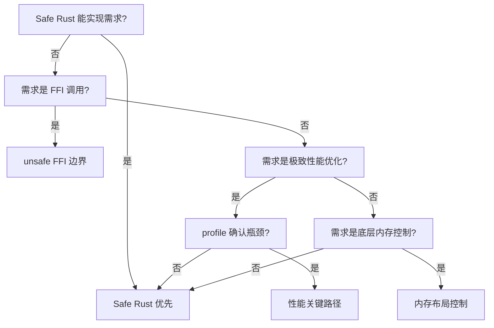
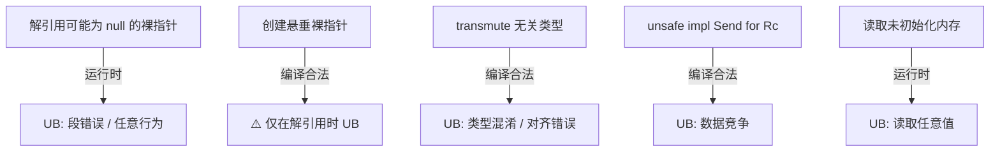

# Unsafe Rust

> **层级**: L3 高级概念
> **前置概念**: [Ownership](../01_foundation/01_ownership.md) · [Borrowing](../01_foundation/02_borrowing.md) · [Memory Management](../02_intermediate/03_memory_management.md) · [Concurrency](../03_advanced/01_concurrency.md)
> **后置概念**: [FFI] · [Embedded] · [Custom Allocators]
> **主要来源**: [TRPL: Ch19.1](https://doc.rust-lang.org/book/ch19-01-unsafe-rust.html) · [Rust Reference: Unsafe Rust] · [Rustonomicon](https://doc.rust-lang.org/nomicon/) · [RFC 2585]

---

**变更日志**:

- v1.0 (2026-05-12): 初始版本，完成权威定义、unsafe 操作矩阵、UB 分类、Safety Contract 规范、思维导图、示例反例

---

## 一、权威定义（Definition）

### 1.1 TRPL 官方定义

> **[TRPL: Ch19.1]** Rust has a second language hiding out inside it, unsafe Rust, which works just like regular Rust but gives you extra superpowers. Unsafe Rust exists because, by nature, static analysis is conservative. When the compiler tries to determine whether or not code upholds the guarantees, it's better for it to reject some valid programs than to accept some invalid programs.

### 1.2 Rustonomicon 定义

> **[Rustonomicon]** A block of code prefixed with `unsafe` does not permit the writing of arbitrary code. The `unsafe` keyword has two meanings: it declares the existence of a contract the compiler doesn't know about, and it declares that you have verified that contract.

### 1.3 形式化定义

`unsafe` 是**形式系统的显式边界突破**：

```text
Safe Rust = { 程序 P | 编译器可证明 P 满足内存安全 + 类型安全 + 并发安全 }
Unsafe Rust = Safe Rust ∪ { 操作 O | O 需要人工证明安全性 }

关键洞察:
  unsafe 不是"关闭检查器"，而是"程序员承担证明责任"
  安全抽象（Safe Abstraction）= unsafe 实现 + safe 接口 + 人工证明内部正确
```

---

## 二、概念属性矩阵（Attribute Matrix）

### 2.1 Unsafe 操作分类矩阵

| **操作** | **语法** | **安全风险** | **典型用途** | **Safe 封装示例** |
|:---|:---|:---|:---|:---|
| **裸指针解引用** | `*raw_ptr` | UAF, 悬垂, 类型混淆 | FFI, 数据结构内部 | `Box::from_raw` |
| **调用 unsafe 函数** | `unsafe_fn()` | 依赖函数契约 | 底层系统调用 | `std::fs::read` |
| **实现 unsafe trait** | `unsafe impl Trait` | 破坏全局假设 | Send/Sync 标记 | `Arc<T>` |
| **访问 union 字段** | `union.field` | 类型混淆 | C 互操作 | `std::mem::ManuallyDrop` |
| **调用 extern 函数** | `extern "C"` | ABI 不匹配, UAF | 系统库调用 | `libc` crate |
| **修改可变静态变量** | `static mut` | 数据竞争 | 全局状态（避免） | `lazy_static!` |
| **内联汇编** | `asm!()` | 完全不受控 | 极致优化 | 极少数场景 |

### 2.2 UB（未定义行为）分类矩阵

| **UB 类型** | **描述** | **检测难度** | **示例** |
|:---|:---|:---|:---|
| **内存访问** | 悬垂指针解引用、越界访问、空指针解引用 | 中等（ASan/Miri） | `*ptr` after free |
| **类型系统** | 无效枚举值、数据竞争、对齐违规 | 难 | `mem::transmute` 滥用 |
| **并发** | 数据竞争、锁顺序错误（C++ style） | 难 | 非原子访问共享可变状态 |
| **ABI** | 调用约定不匹配、布局假设错误 | 难 | FFI 类型宽度不匹配 |
| **特殊** | 递归 panic、栈溢出、除以零 | 中等 | `panic!` in `Drop` |

### 2.3 Safety Contract 责任矩阵

| **角色** | **责任** | **证明对象** | **工具支持** |
|:---|:---|:---|:---|
| **unsafe 实现者** | 保证 unsafe 块内部不触发 UB | 局部代码正确性 | Miri、Kani、审阅 |
| **safe 接口设计者** | 保证 safe API 不泄露 UB | 所有调用路径安全 | 类型系统、测试 |
| **safe 用户** | 正确使用 safe API | 无需证明（编译器保证） | 编译器 |
| **unsafe trait 实现者** | 满足 trait 的 unsafe 契约 | 全局语义约束 | 文档、审阅 |

---

## 三、形式化理论根基（Formal Foundation）

### 3.1 Unsafe 作为公理缺口

```text
Safe Rust 类型系统是一个封闭的证明系统:
  公理: 所有权、借用、生命周期规则
  定理: 通过编译 = 满足安全保证

Unsafe 是公理系统的显式扩展:
  unsafe { ... } = "我在此区域引入新的公理，并人工保证其一致性"

类比数学:
  Safe Rust = 欧氏几何（5条公设封闭）
  Unsafe    = 非欧几何（修改平行公设，需重新证明一致性）
```

### 3.2 Safety Invariant vs Validity Invariant

```text
Rust 区分两种不变式:

Validity Invariant（有效性不变式）:
  - 编译器和优化器依赖的底层约束
  - 违反 = 立即 UB
  - 例: bool 必须是 0 或 1，引用必须非空对齐

Safety Invariant（安全性不变式）:
  - Safe API 的用户必须维护的高层约束
  - 违反 = 可能通过 safe API 触发 UB
  - 例: Vec 的 len ≤ cap，String 是有效 UTF-8

unsafe 代码的责任:
  - 不破坏 Validity Invariant（对编译器负责）
  - 维护 Safety Invariant（对 safe 用户负责）
```

---

## 四、思维导图（Mind Map）

```mermaid
graph TD
    A[Unsafe Rust] --> B[unsafe 操作]
    A --> C[UB 分类]
    A --> D[安全抽象]
    A --> E[验证工具]
    A --> F[常见模式]

    B --> B1[裸指针 *const/*mut]
    B --> B2[unsafe fn / unsafe trait]
    B --> B3[extern 函数]
    B --> B4[union 访问]
    B --> B5[static mut]

    C --> C1[内存: UAF, OOB, 对齐]
    C --> C2[类型: 无效枚举, transmute]
    C --> C3[并发: 数据竞争]
    C --> D1[Validity Invariant]
    C --> D2[Safety Invariant]

    D --> D3[unsafe 实现 + safe 接口]
    D --> D4[Document Safety Contract]

    E --> E1[Miri]
    E --> E2[Kani]
    E --> E3[ASan / MSan]
    E --> E4[Creusot]

    F --> F1[FFI 边界]
    F --> F2[自定义数据结构]
    F --> F3[Send/Sync 实现]
    F --> F4[零拷贝解析]
```



---

## 五、决策/边界判定树（Decision / Boundary Tree）

### 5.1 "我需要用 unsafe 吗？" 决策树



### 5.2 UB 边界判定



---

## 六、定理推理链（Theorem Chain）

### 6.1 安全抽象定理

```text
前提 1: unsafe 块实现了某些底层操作
前提 2: safe 接口封装了 unsafe 块，并限制了输入
前提 3: 人工证明: 对所有合法 safe 输入，unsafe 块不触发 UB
    ↓
定理: safe 接口是"可信的"——用户无需了解内部 unsafe 即可安全使用
    ↓
推论: Rust 标准库的大部分功能基于 unsafe 实现，但接口是 safe 的
      例: Vec, String, HashMap, Rc, Arc, Box 都有 unsafe 内部实现
```

### 6.2 Miri 的验证边界

```text
Miri (Rust 解释器) 可检测:
  ✅ 悬垂指针解引用
  ✅ 越界访问
  ✅ 未对齐访问
  ✅ 数据竞争（部分）
  ✅ 无效枚举值
  ❌ 所有可能的 UB（停机问题）
  ❌ 与硬件相关的行为（如内联汇编）
```

---

## 七、示例与反例（Examples & Counter-examples）

### 7.1 正确示例：安全封装裸指针（Vec 简化版）

```rust
// ✅ 正确: unsafe 实现 + safe 接口
pub struct MyVec<T> {
    ptr: *mut T,
    len: usize,
    cap: usize,
}

impl<T> MyVec<T> {
    pub fn new() -> Self {
        Self { ptr: std::ptr::NonNull::dangling().as_ptr(), len: 0, cap: 0 }
    }

    pub fn push(&mut self, value: T) {
        if self.len == self.cap { self.grow(); }
        unsafe {
            // Safety: ptr 已分配且 len < cap
            std::ptr::write(self.ptr.add(self.len), value);
        }
        self.len += 1;
    }

    pub fn get(&self, index: usize) -> Option<&T> {
        if index >= self.len { return None; }
        Some(unsafe {
            // Safety: index < len，且所有 0..len 位置已初始化
            &*self.ptr.add(index)
        })
    }

    fn grow(&mut self) { /* 使用 alloc::GlobalAlloc 重新分配 */ }
}

impl<T> Drop for MyVec<T> {
    fn drop(&mut self) {
        unsafe {
            // Safety: 我们只释放自己分配的内存
            std::alloc::dealloc(/* ... */);
        }
    }
}
```

### 7.2 正确示例：手动实现 Send/Sync

```rust
// ✅ 正确: 为线程安全的外部类型实现 Send/Sync
pub struct MyHandle { raw: *mut libc::c_void }

// Safety: 底层 C 库保证此句柄可跨线程安全使用
unsafe impl Send for MyHandle {}
unsafe impl Sync for MyHandle {}
```

### 7.3 反例：悬垂裸指针（UB）

```rust
// ❌ 反例: 返回局部变量的裸指针
unsafe fn dangling_ptr() -> *const i32 {
    let x = 42;
    &x as *const i32  // x 在函数返回后被释放
}

fn main() {
    let ptr = dangling_ptr();
    println!("{}", unsafe { *ptr });  // UB: UAF
}
```

### 7.4 反例：transmute 滥用（UB）

```rust
// ❌ 反例: transmute 不相关类型
unsafe fn evil_transmute() {
    let f: f32 = 1.0;
    let b: bool = std::mem::transmute(f);  // UB! f32 位模式不全是有效 bool
}
```

### 7.5 反例：无效枚举值（UB）

```rust
// ❌ 反例: 创建无效枚举值
enum Color { Red, Green, Blue }

unsafe fn invalid_enum() -> Color {
    std::mem::transmute(42u8)  // UB! 42 不是有效变体索引
}
```

---

## 八、知识来源关系（Provenance）

| **论断** | **来源** | **可信度** |
|:---|:---|:---|
| unsafe 提供 5 种超能力 | [TRPL: Ch19.1] | ✅ |
| unsafe 是程序员承担证明责任 | [Rustonomicon] | ✅ |
| UB 清单 | [Rust Reference: Behavior considered undefined] | ✅ |
| Validity vs Safety Invariant | [Rustonomicon: What is unsafe?] · [Ralf Jung Blog] | ✅ |
| Miri 可检测部分 UB | [Miri Documentation] | ✅ |
| 安全抽象封装 unsafe | [Rust API Guidelines] | ✅ |

---

## 九、待补充与演进方向（TODOs）

### 补充章节：FFI 与 repr 属性完整规范

#### ABI 与 Calling Convention

```rust
// extern "C" = 使用 C 调用约定
extern "C" {
    fn c_function(x: i32) -> i32;  // 声明 C 函数
}

// extern "system" = 使用系统默认 ABI（Windows 上不同）
extern "system" {
    fn system_function();
}

// Rust 函数的 C 导出
#[no_mangle]  // 禁用名称修饰，使 C 可链接
pub extern "C" fn rust_function(x: i32) -> i32 {
    x * 2
}
```

#### repr 属性矩阵

| **属性** | **用途** | **保证** | **风险** |
|:---|:---|:---|:---|
| `#[repr(C)]` | C 互操作 | 字段顺序与 C 相同 | 可能有 padding |
| `#[repr(transparent)]` | 新类型包装 | 内存布局与内部类型相同 | 只能有一个非零大小字段 |
| `#[repr(packed)]` | 无 padding | 紧凑布局 | 未对齐访问可能慢或 UB |
| `#[repr(align(N))]` | 自定义对齐 | N 字节对齐 | 浪费内存 |
| `#[repr(u8)]` | enum 标签类型 | 指定 discriminant 大小 | 需覆盖所有值 |

```rust
// ✅ repr(C): 与 C 结构体互操作
#[repr(C)]
pub struct Point {
    pub x: f64,
    pub y: f64,
}

// ✅ repr(transparent): 零成本新类型
#[repr(transparent)]
pub struct UserId(u64);  // 内存布局与 u64 完全相同

// ✅ repr(packed(1)): 强制无 padding
#[repr(packed(1))]
pub struct Packed {
    pub a: u8,
    pub b: u32,  // 通常对齐到 4，packed 后紧跟 a
}

// ⚠️ packed 的借用是危险的
fn packed_borrow(p: &Packed) {
    // let r = &p.b;  // ❌ 可能未对齐，编译错误
    let r = unsafe { &p.b };  // 需 unsafe，且可能慢
}
```

#### FFI 安全契约

```text
FFI 边界是 Rust 形式系统的"公理缺口":

Rust 端保证:
  - 传递给 C 的指针有效（非悬垂、对齐、正确生命周期）
  - 类型布局匹配（#[repr(C)] 等）
  - 回调函数满足 C 的调用约定

C 端保证:
  - 不修改 Rust 拥有的内存（除非协议允许）
  - 不返回悬垂指针
  - 线程安全（若涉及多线程）

常见陷阱:
  - String ↔ *const c_char 转换（UTF-8 vs 平台编码）
  - Vec ↔ 裸指针+长度（所有权转移边界）
  - 回调函数的生命周期（C 可能长期保存函数指针）
```

---

- [x] **TODO**: 补充 FFI 完整规范（ABI、layout、calling convention） —— 优先级: 高 —— 已完成 v1.1
- [x] **TODO**: 补充 `#[repr(C)]` / `#[repr(transparent)]` / `#[repr(packed)]` —— 优先级: 高 —— 已完成 v1.1
- [ ] **TODO**: 补充 Miri 的使用方法与限制 —— 优先级: 中 —— 预计: Phase 3
- [ ] **TODO**: 补充 `std::ptr::read/write` vs `*ptr` 解引用的区别 —— 优先级: 中 —— 预计: Phase 2
- [ ] **TODO**: 补充 `NonNull<T>` / `Unique<T>` / `Shared<T>` 的演进 —— 优先级: 低 —— 预计: Phase 4
- [ ] **TODO**: 补充 `MaybeUninit` 数组初始化模式 —— 优先级: 中 —— 预计: Phase 3
