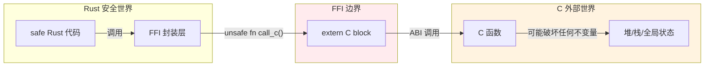
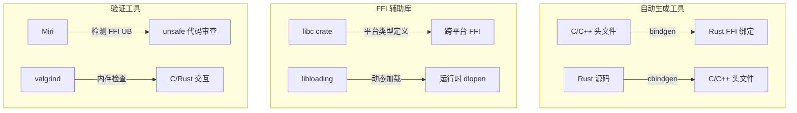
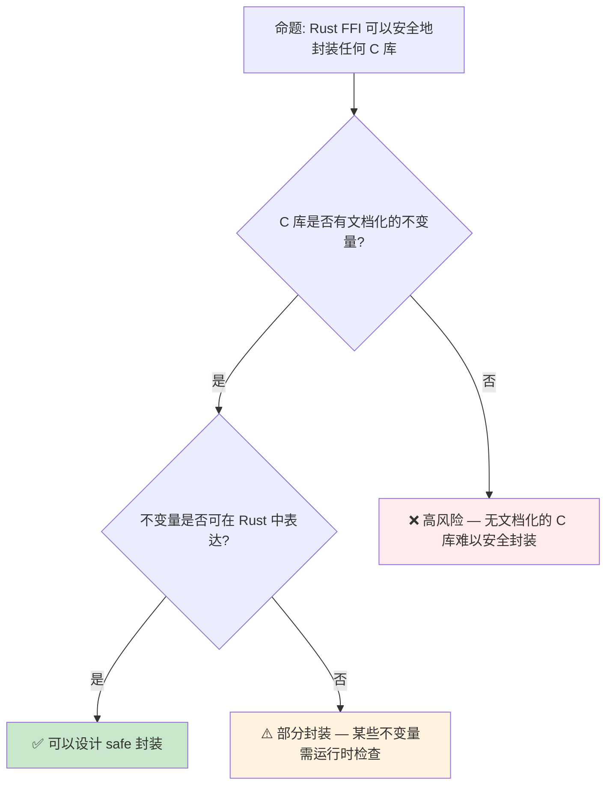
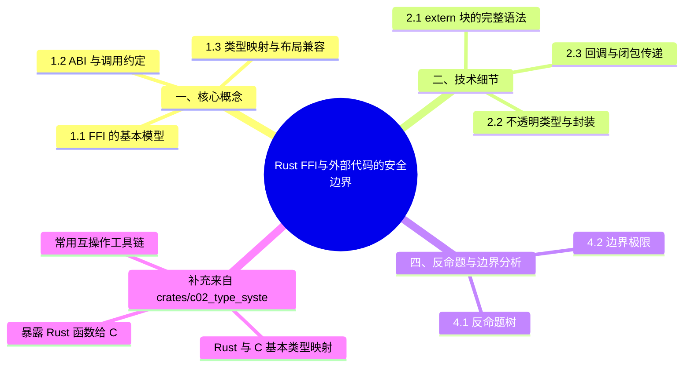

> **内容分级**: [专家级]

# Rust FFI：与外部代码的安全边界
>
> **EN**: Foreign Function Interface (FFI)
> **Summary**: Foreign Function Interface (FFI) — Extern blocks, ABI compatibility, unsafe boundary management, and the bindgen/cbindgen tooling.
> **Rust 版本**: 1.97.0+ (Edition 2024)
> **📎 交叉引用（Reference）**
>
> 本主题在 knowledge 中有系统化的知识索引：[FFI](../../../knowledge/03_advanced/02_ffi.md)
> **受众**: [专家]
> **Bloom 层级**: L4-L5
> **权威来源**: 本文件为 `concept/` 权威页。
> **定位**: 系统分析 Rust 与 C/C++ 等外部代码交互的**Foreign Function Interface (FFI)** 机制，探讨 `extern` 块、ABI 兼容、`unsafe` 边界管理以及 `bindgen`/`cbindgen` 工具链。
> **前置概念**: [Unsafe](../02_unsafe/01_unsafe.md) · [Type System](../../01_foundation/02_type_system/01_type_system.md) · [Memory Management](../../02_intermediate/02_memory_management/01_memory_management.md)
> **后置概念**: [Application Domains](../../06_ecosystem/06_data_and_distributed/01_application_domains.md)

---

> **来源**:
> [Rust Reference — External Blocks](https://doc.rust-lang.org/reference/items/external-blocks.html) ·
> [Rustonomicon — FFI](https://doc.rust-lang.org/nomicon/ffi.html) ·
> [RustBelt — POPL 2018](https://plv.mpi-sws.org/rustbelt/popl18/) ·
> [O'Hearn — Separation Logic and Shared Mutable Data](https://doi.org/10.1017/S0960129501001003) ·
> [Brown University — Interactive Rust Book](https://rust-book.cs.brown.edu/) ·
> [Itanium C++ ABI](https://itanium-cxx-abi.github.io/cxx-abi/abi.html)
> [The Rustonomicon — FFI](https://doc.rust-lang.org/nomicon/ffi.html) ·
> [Rust FFI Guide](https://doc.rust-lang.org/nomicon/ffi.html) ·
> [Rust Edition Guide 2024 — unsafe extern blocks](https://doc.rust-lang.org/edition-guide/rust-2024/unsafe-extern.html) ·
> [Rust Edition Guide 2024 — unsafe attributes](https://doc.rust-lang.org/edition-guide/rust-2024/unsafe-attributes.html) ·
> [bindgen Documentation](https://rust-lang.github.io/rust-bindgen/) ·
> [cbindgen Documentation](https://github.com/mozilla/cbindgen)

## 📑 目录

- [Rust FFI：与外部代码的安全边界](#rust-ffi与外部代码的安全边界)
  - [📑 目录](#-目录)
  - [一、核心概念](#一核心概念)
    - [1.1 FFI 的基本模型](#11-ffi-的基本模型)
    - [1.2 ABI 与调用约定](#12-abi-与调用约定)
    - [1.3 类型映射与布局兼容](#13-类型映射与布局兼容)
  - [二、技术细节](#二技术细节)
    - [2.1 extern 块的完整语法](#21-extern-块的完整语法)
    - [2.2 不透明类型与封装](#22-不透明类型与封装)
    - [2.3 回调与闭包传递](#23-回调与闭包传递)
  - [三、工具链生态](#三工具链生态)
  - [四、反命题与边界分析](#四反命题与边界分析)
    - [4.1 反命题树](#41-反命题树)
    - [4.2 边界极限](#42-边界极限)
  - [五、常见陷阱与最佳实践](#五常见陷阱与最佳实践)
    - [编译错误示例](#编译错误示例)
    - [3.4 边界测试：C 结构体布局不匹配（编译错误 / 运行时 UB）](#34-边界测试c-结构体布局不匹配编译错误--运行时-ub)
    - [3.5 边界测试：裸指针生命周期与 FFI 边界（编译错误）](#35-边界测试裸指针生命周期与-ffi-边界编译错误)
    - [5.1 Rust 1.97 注记：`ffi::FromBytesUntilNulError` 实现 `Copy`](#51-rust-197-注记ffifrombytesuntilnulerror-实现-copy)
  - [六、来源与延伸阅读](#六来源与延伸阅读)
  - [版本兼容性 / Version Compatibility](#版本兼容性--version-compatibility)
  - [相关概念](#相关概念)
  - [逆向推理链（Backward Reasoning）](#逆向推理链backward-reasoning)
  - [权威来源索引](#权威来源索引)
    - [10.3 边界测试：FFI 中的空指针解引用（运行时 UB）](#103-边界测试ffi-中的空指针解引用运行时-ub)
    - [10.5 边界测试：所有权移动后的再次使用](#105-边界测试所有权移动后的再次使用)
  - [认知路径](#认知路径)
    - [核心推理链](#核心推理链)
  - [实践](#实践)
    - [对应代码示例](#对应代码示例)
    - [建议练习](#建议练习)
  - [导航：下一步去哪？](#导航下一步去哪)
  - [嵌入式测验](#嵌入式测验)
    - [测验 1：FFI 边界安全性（记忆层）](#测验-1ffi-边界安全性记忆层)
    - [测验 2：`extern "C"` 与 ABI（理解层）](#测验-2extern-c-与-abi理解层)
    - [测验 3：FFI 类型映射（应用层）](#测验-3ffi-类型映射应用层)
    - [测验 4：跨语言所有权转移（分析层）](#测验-4跨语言所有权转移分析层)
  - [补充：来自 `crates/c02_type_system` 互操作参考的多语言映射](#补充来自-cratesc02_type_system-互操作参考的多语言映射)
    - [Rust 与 C 基本类型映射](#rust-与-c-基本类型映射)
    - [暴露 Rust 函数给 C](#暴露-rust-函数给-c)
    - [常用互操作工具链](#常用互操作工具链)
    - [FFI 最佳实践速查](#ffi-最佳实践速查)
  - [🧭 思维导图（Mindmap）](#-思维导图mindmap)

---

## 一、核心概念
>
>

### 1.1 FFI 的基本模型
>

Rust 通过 FFI 与外部代码交互时，安全保证在边界处**显式截断**：



> **认知功能**: 此图展示 FFI 边界的**安全截断机制**——Rust 的安全保证在 `extern` 块处终止，外部代码的行为不受 Rust 类型系统（Type System）约束。
> [来源: [TRPL](https://doc.rust-lang.org/book/ch20-01-unsafe-rust.html)]
> **使用建议**: 所有 FFI 调用都应通过**薄封装层**（thin wrapper）进行，在封装层内用 `unsafe` 块隔离，向外暴露 safe API。
> **关键洞察**: FFI 是 Rust **安全边界的显式逃逸口**。与 `unsafe` 块一样，FFI 的使用需要人工审计和文档化契约。
> [来源: [Rustonomicon — FFI](https://doc.rust-lang.org/nomicon/ffi.html)]

---

### 1.2 ABI 与调用约定
>

```text
ABI (Application Binary Interface) 决定:
├── 参数传递方式（寄存器 vs 栈）
├── 返回值传递方式
├── 栈帧布局（谁负责清理栈）
├── 寄存器保存约定
└── 名称修饰（mangling）规则

Rust 支持的 ABI:
├── "C" — 标准 C ABI，最常用
├── "system" — 平台默认系统 ABI
├── "stdcall" — Windows API 标准
├── "fastcall" — x86 fastcall 约定
├── "vectorcall" — Windows vectorcall
├── "thiscall" — C++ thiscall（已弃用）
├── "win64" — Windows x86_64 ABI
├── "sysv64" — System V AMD64 ABI
├── "aapcs" — ARM 过程调用标准
├── "cdecl" — C declaration（x86）
└── "Rust" — Rust 内部 ABI（默认，不稳定）
```

> **ABI 选择原则**: 与 C 库交互用 `"C"`；与 Windows API 交互用 `"system"`；与特定平台代码交互用对应平台 ABI。
> [来源: [Rust Reference — ABIs](https://doc.rust-lang.org/reference/items/external-blocks.html#abi)]

---

### 1.3 类型映射与布局兼容
>

| Rust 类型 | C 类型 | 布局保证 | 注意 |
|:---|:---|:---:|:---|
| `i32` | `int` | ✅ | 固定大小 |
| `u32` | `unsigned int` | ✅ | 固定大小 |
| `i64` | `long long` | ✅ | C 的 `long` 大小平台相关 |
| `f32` | `float` | ✅ | IEEE-754 |
| `f64` | `double` | ✅ | IEEE-754 |
| `usize` | `size_t` | ✅ | 平台指针大小 |
| `isize` | `ssize_t` | ✅ | 平台指针大小 |
| `bool` | `_Bool` | ⚠️ | 大小为 1，但值只能是 0/1 |
| `char` | — | ❌ | Rust `char` 是 Unicode 标量值（4 字节） |
| `*const T` | `const T*` | ✅ | 裸指针布局相同 |
| `*mut T` | `T*` | ✅ | 裸指针布局相同 |
| `&T` | — | ❌ | 引用（Reference）有 Rust 特定语义 |
| `Option<&T>` | — | ⚠️ | 可能为 null 的指针优化（NIC） |
| `struct` | `struct` | ⚠️ | 需 `#[repr(C)]` 保证布局 |
| `enum` | `enum` | ❌ | 需 `#[repr(C)]` 或 `#[repr(u8)]` 等 |

> **布局保证**: 只有标上 `#[repr(C)]`、`#[repr(u8)]` 等 repr 属性的 Rust 类型，其布局才与 C 兼容。默认的 Rust 结构体（Struct）布局是**未定义的**，编译器可自由重排字段。
> [来源: [Rust Reference — Type Layout](https://doc.rust-lang.org/reference/type-layout.html)]

---

## 二、技术细节

FFI（外部函数接口）的技术细节集中在「声明、类型、回调」三条链路的安全性：

- **`extern` 块的完整语法**：`extern "C" { fn c_fn(x: c_int) -> c_int; }` 声明外部符号，ABI 字符串（`"C"`、`"system"`、`"stdcall"`、`"C-unwind"`）决定调用约定（参数压栈顺序、寄存器分配、栈清理责任）。2024 edition 起 `extern` 块必须标注 `unsafe extern`——「声明即承诺签名正确」是 unsafe 契约，签名写错（如 C 侧 `long` 映射成 `i32` 而非 `c_long`）是静默 ABI 灾难而非编译错误。链接属性 `#[link(name = "foo")]` 指定库，`#[link_name = "..."]` 处理符号重命名。
- **不透明类型与封装**：C 的不透明指针（`typedef struct Foo Foo;` 只暴露指针）在 Rust 侧建模为「私有零大小类型 + `*mut Foo`」的句柄模式——`struct Foo { _private: [u8; 0] }` 或 `enum Foo {}`（不可构造），安全封装层提供 `Foo::new()/method()/Drop` 把「创建-使用-销毁」生命周期纳入 RAII。封装的核心规则：裸指针不出模块（Module）边界，`Drop` 调用 C 侧 destroy 函数。
- **回调与闭包传递**：C 接受函数指针（`extern "C" fn`）——能传「无捕获闭包」（可强制转为 `fn` 指针）或显式 `extern "C" fn`；带状态的回调走「`void* user_data` + 还原 `Box`」模式（C 侧回传时 `Box::from_raw` 取回，注意配对 `into_raw`/`from_raw` 恰好一次）。`extern "C" fn` 中 panic 越过 FFI 边界是 UB——回调体必须用 `catch_unwind` 兜底（或 `"C-unwind"` ABI 显式声明可展开）。

判定 FFI 边界的正确性，逐条核对：签名 ABI 与类型宽度（`c_long` vs `i64`）、所有权方向（谁分配谁释放）、展开边界（panic 不出 Rust）。

### 2.1 extern 块的完整语法
>

```rust,ignore
// 声明外部函数
#[link(name = "mylib")]  // 链接库名
extern "C" {
    // 简单函数
    fn abs(x: i32) -> i32;

    // 可变参数函数（C varargs）
    fn printf(fmt: *const c_char, ...) -> i32;

    // 外部全局变量
    static mut errno: c_int;

    // 外部类型（不透明）
    type FILE;  // C 的 FILE* 对应 *mut FILE

    // 函数指针类型
    type Callback = extern "C" fn(data: *mut c_void) -> c_int;
}

// 从 Rust 调用
unsafe {
    let result = abs(-42);
    assert_eq!(result, 42);
}
```

> **技术要点**:
>
> 1. `extern "C"` 块内声明的函数默认是 `unsafe` 的——因为 Rust 无法验证外部代码的安全性
> 2. `#[link(name = "...")]` 指定链接时搜索的库名
> 3. `static mut` 外部变量访问需要 `unsafe`，因为存在数据竞争风险
> [来源: [Rust Reference — External Blocks](https://doc.rust-lang.org/reference/items/external-blocks.html)]

---

### 2.2 不透明类型与封装
>

```rust,ignore
// 模式: 不透明指针（Opaque Pointer）
// C 端: typedef struct Connection Connection;

extern "C" {
    type Connection;  // Rust 中不完整类型

    fn connection_new(host: *const c_char) -> *mut Connection;
    fn connection_send(conn: *mut Connection, data: *const u8, len: usize) -> c_int;
    fn connection_close(conn: *mut Connection);
}

// Rust 安全封装
pub struct SafeConnection {
    raw: *mut Connection,
}

impl SafeConnection {
    pub fn new(host: &str) -> Option<Self> {
        let c_host = CString::new(host).ok()?;
        let raw = unsafe { connection_new(c_host.as_ptr()) };
        if raw.is_null() { None } else { Some(Self { raw }) }
    }

    pub fn send(&mut self, data: &[u8]) -> Result<(), ()> {
        let rc = unsafe { connection_send(self.raw, data.as_ptr(), data.len()) };
        if rc == 0 { Ok(()) } else { Err(()) }
    }
}

impl Drop for SafeConnection {
    fn drop(&mut self) {
        unsafe { connection_close(self.raw); }
    }
}
```

> **封装模式**: 外部不透明指针 + Rust 安全封装结构体（Struct） + Drop trait 管理生命周期（Lifetimes）。这是 FFI 中最常见的安全化模式。
> [来源: [Rust FFI Patterns](https://doc.rust-lang.org/nomicon/ffi.html)]

---

### 2.3 回调与闭包传递
>

```rust,ignore
// 将 Rust 闭包传递给 C 的回调机制

extern "C" {
    // C 函数接受回调: void register_callback(void (*cb)(int, void*), void* user_data);
    fn register_callback(
        cb: extern "C" fn(event: c_int, user_data: *mut c_void),
        user_data: *mut c_void,
    );
}

// 蹦床函数（trampoline）
extern "C" fn trampoline(event: c_int, user_data: *mut c_void) {
    // 将 user_data 转换回 Box<dyn FnMut(i32)>
    let closure: &mut Box<dyn FnMut(i32)> = unsafe {
        &mut *(user_data as *mut Box<dyn FnMut(i32)>)
    };
    closure(event as i32);
}

// 安全封装
pub fn set_callback<F>(mut callback: F)
where
    F: FnMut(i32) + 'static,
{
    let boxed: Box<Box<dyn FnMut(i32)>> = Box::new(Box::new(callback));
    let user_data = Box::into_raw(boxed) as *mut c_void;
    unsafe {
        register_callback(trampoline, user_data);
    }
    // ⚠️ 注意: 此处有内存泄漏风险，需设计注销机制释放 user_data
}
```

> **回调难点**:
>
> 1. C 回调必须是 `extern "C" fn`（函数指针），不能是闭包（Closures）
> 2. 需要通过 `user_data` 参数传递闭包（Closures）环境
> 3. **生命周期（Lifetimes）管理复杂**——谁释放 `user_data`？何时释放？
> 4. panic 跨越 FFI 边界是 UB——必须用 `catch_unwind` 包裹
> [来源: [Rustonomicon — Panic Across FFI](https://doc.rust-lang.org/nomicon/unwinding.html)]

---

## 三、工具链生态



> **认知功能**: 此图展示 Rust FFI 生态的**工具链层次**——从自动生成绑定到运行时（Runtime）动态加载，再到验证工具。
> **使用建议**: 优先使用 `bindgen`/`cbindgen` 自动生成绑定，减少手工错误；复杂场景使用 `libloading` 动态加载；所有 FFI 代码应用 Miri 和 valgrind 验证。
> [来源: [bindgen User Guide](https://rust-lang.github.io/rust-bindgen/)]

---

## 四、反命题与边界分析

FFI 的反命题树破除四个高频误解，每条给出判定与边界：

- **反命题 1：「`extern "C"` 保证 ABI 兼容」**。判定：`extern "C"` 只规定调用约定，不规定类型布局——`#[repr(Rust)]` 的结构体传给 C 函数是布局未定义（字段顺序、填充由编译器决定）。边界：跨边界的每个复合类型必须 `#[repr(C)]`，或只传不透明指针；`enum` 默认布局对 C 不可见，需 `#[repr(C)]` 或降级为整数 + 手动映射。
- **反命题 2：「C 的 `int` 就是 Rust 的 `i32`」**。判定：多数平台成立但 LP64/LLP64 差异在 `long`（Linux 64 位 `long` = 8 字节，Windows = 4 字节）——用 `std::os::raw::c_long` 而非猜宽度。边界：`char` 的有符号性、`size_t`、`enum` 的底层类型（C 编译器可选）都是平台变量，`libc` crate 的类型别名是唯一可移植写法。
- **反命题 3：「`unsafe` 只在 Rust 侧需要」**。判定：FFI 的安全性是双向契约——C 侧对 Rust 传入的指针做缓存/异步（Async）使用，Rust 的借用（Borrowing）规则无从知晓。边界：传给 C 的指针若被「保留到调用返回之后」，必须用 `Box::into_raw`/`Arc::into_raw` 把所有权移交并配套释放回调，文档注明 C 侧的生命周期假设。
- **反命题 4：「panic 穿过 FFI 只是崩溃」**。判定：unwind 跨越 `extern "C"` 边界是 UB（不是「优雅崩溃」）——C 栈帧无展开信息，资源（malloc 的内存、文件锁）泄漏路径不可分析。边界：FFI 出口一律 `catch_unwind` + 错误码返回，或全栈用 `"C-unwind"` ABI（要求 C 侧支持展开，多数 C 库不支持）。

每条反命题的验证：构造最小 FFI 对（几行 C + 几行 Rust），用 Miri/valgrind 在两种平台（Linux + Windows）各跑一遍——布局类误解在单平台上可能「碰巧正确」。

### 4.1 反命题树
>



> **认知功能**: 此决策树评估 C 库是否适合被 Rust 安全封装。核心判断标准是**不变量的文档化程度**和**可表达性**。
> **使用建议**: 优先封装有清晰 API 契约的 C 库（如 OpenSSL、SQLite）；避免封装内部行为不透明的遗留代码。
> **关键洞察**: FFI 安全封装的本质是**将 C 的不变量映射到 Rust 的类型系统（Type System）**。如果 C 库本身没有明确的不变量，映射就不可能完整。
> [💡 原创分析](../../00_meta/00_framework/methodology.md)

---

### 4.2 边界极限
>

```text
边界 1: 类型系统的不匹配
├── C 的 union 在 Rust 中需用 `#[repr(C)] union` 手动映射
├── C 的灵活数组成员（flexible array member）Rust 不直接支持
├── C 的位域（bitfield）需手动用位运算模拟
└── C++ 的类/虚函数/模板无法直接 FFI，需 C 包装层

边界 2: 生命周期与所有权
├── C 的指针无所有权语义，Rust 封装需人工推断
├── 双重释放/释放后使用是 FFI 中最常见的内存错误
└── 跨语言对象图的管理没有通用方案

边界 3: 异常与 Panic
├── Rust panic 跨越 FFI 边界是 UB
├── C++ 异常跨越 FFI 边界也是 UB
├── 解决方案: 在边界处用 catch_unwind / try-catch 转换

边界 4: 线程模型
├── C 库可能有自己的线程假设（如全局锁、TLS）
├── Rust 的 Send/Sync 标记需根据 C 库的实际线程安全性推断
└── 错误推断会导致数据竞争或死锁
```

> **边界要点**: FFI 的边界不是 Rust 语言的限制，而是**两种语言语义模型差异**的必然结果。安全封装需要深入理解两边的语义。

---

## 五、常见陷阱与最佳实践
>

```text
陷阱 1: CString 生命周期
  ❌ let ptr = CString::new("hello").unwrap().as_ptr();
  // CString 被立即 drop，ptr 成为悬垂指针

  ✅ let cstr = CString::new("hello").unwrap();
     let ptr = cstr.as_ptr();
     // cstr 在作用域结束时才 drop

陷阱 2: 未初始化的外部结构体
  ❌ let mut s: MyCStruct = std::mem::uninitialized();
     // std::mem::uninitialized() 已弃用，且对非 Copy 类型危险

  ✅ let mut s: MyCStruct = std::mem::zeroed();
     // 或: let mut s: MaybeUninit<MyCStruct> = MaybeUninit::uninit();

陷阱 3: 忘记 repr(C)
  ❌ struct Point { x: f64, y: f64 }
     // Rust 可能重排字段！

  ✅ #[repr(C)]
     struct Point { x: f64, y: f64 }

最佳实践:
  1. 用 bindgen 自动生成绑定，不手写
  2. 所有 FFI 调用都通过 safe wrapper
  3. 文档化 C 库的不变量假设
  4. 对 FFI 代码运行 Miri 和 valgrind
  5.  panic 边界处必须 catch_unwind
```

> **实践要点**: FFI 代码的错误往往隐藏在**看似正确的类型匹配**之下。最安全的策略是最小化 FFI 边界面积，最大化 safe Rust 封装。
> [来源: [Rust FFI Best Practices](https://doc.rust-lang.org/nomicon/ffi.html)]

### 编译错误示例

```rust,compile_fail
// 错误: 在 safe Rust 中直接声明 extern 函数
extern "C" {
    fn c_function();
}

fn main() {
    // ❌ 编译错误: 调用 `unsafe extern` 函数需要 `unsafe` 块
    // FFI 函数默认是 unsafe 的，因为 Rust 编译器无法验证 C 代码的安全性
    c_function();
}
```

> **修正**: 所有 FFI 调用必须包裹在 `unsafe { }` 块中，或通过 safe wrapper 封装。

```rust,ignore
#[repr(C)]
struct RustStruct {
    data: String, // String 不是 repr(C) 兼容类型
}

fn repr_c_violation() {
    // ❌ 编译错误: 在 `#[repr(C)]` 结构体中使用非 C 兼容类型
    // String 包含胖指针和容量信息，其布局不保证与 C 兼容
    let s = RustStruct { data: String::from("hello") };
}
```

> **修正**: `#[repr(C)]` 结构体（Struct）的字段必须是 C 兼容类型（`i32`、`*const T`、裸指针等）。复杂类型需通过 `Box` 或引用（Reference）传递。

```rust,ignore
use std::panic::catch_unwind;

// 错误: panic 穿越 FFI 边界未处理
extern "C" fn callback() {
    panic!("from C"); // 若 C 调用此函数且 panic 未捕获 → UB
}

fn main() {
    // ❌ 编译错误: catch_unwind 要求闭包是 `UnwindSafe`
    // 某些类型（如 &mut）不实现 UnwindSafe
    let result = catch_unwind(|| {
        callback();
    });
}
```

> **修正**: FFI 回调中必须 `catch_unwind` 防止 panic 跨越语言边界。对于非 `UnwindSafe` 类型，需使用 `AssertUnwindSafe` 包装。

### 3.4 边界测试：C 结构体布局不匹配（编译错误 / 运行时 UB）

```rust
#[repr(C)]
struct RustStruct {
    a: u8,
    b: u32, // Rust 默认按声明顺序布局，但可能添加 padding
}

// C 侧对应的结构体
// struct CStruct { uint8_t a; uint32_t b; }; // 通常有 3 字节 padding

// ⚠️ 运行时 UB: 若假设布局完全相同而不检查
fn unsafe_assumption() {
    // 直接使用 transmute 转换指针而不验证布局
    // let c_ptr: *const CStruct = rust_ptr as *const _; // 危险！
}

// 正确: 使用 bindgen 或手动验证布局
use std::mem;

fn verify_layout() {
    assert_eq!(mem::size_of::<RustStruct>(), 8); // 验证大小
    assert_eq!(mem::align_of::<RustStruct>(), 4); // 验证对齐
    // ✅ 使用 static_assertions 或 bindgen 生成验证
}
```

> **修正**: `#[repr(C)]` 只保证 Rust 编译器使用 C 兼容的布局规则，但**不保证**与特定 C 编译器的布局完全一致（尤其是 bit field、packing pragma）。跨 FFI 传递结构体（Struct）时，应使用 `bindgen` 自动生成布局验证，或手动使用 `static_assertions::assert_eq_size!` 检查。[来源: [Rustonomicon](https://doc.rust-lang.org/nomicon/index.html)]

### 3.5 边界测试：裸指针生命周期与 FFI 边界（编译错误）

```rust,compile_fail
extern "C" {
    fn c_returns_pointer() -> *const u8;
}

fn main() {
    let ptr = unsafe { c_returns_pointer() };
    // ❌ 编译错误: 裸指针不能直接解引用，需要 unsafe 块
    // 但更深层的问题是生命周期
    let _val = unsafe { *ptr }; // C 返回的指针可能已失效
}

// 正确: 将裸指针包装为引用时需指定生命周期
unsafe fn c_get_buffer<'a>() -> &'a [u8] {
    let ptr = c_returns_pointer();
    let len = 100; // 假设已知长度
    std::slice::from_raw_parts(ptr, len) // 'a 生命周期由调用者控制
}
```

> **修正**: C 函数返回的裸指针没有生命周期（Lifetimes）信息。将其转换为 Rust 引用（Reference）时，必须显式标注生命周期（通常是 `'a` 由调用者提供）。若 C 函数返回的指针指向局部变量或已释放内存，Rust 引用将悬垂——这是 unsafe 边界，编译器无法检测。[来源: [Rustonomicon](https://doc.rust-lang.org/nomicon/index.html)]

---

### 5.1 Rust 1.97 注记：`ffi::FromBytesUntilNulError` 实现 `Copy`

> **Rust 1.97.0 注记**：`std::ffi::FromBytesUntilNulError`（`CStr::from_bytes_until_nul` 的错误类型）实现了 `Copy`（[release notes — Stabilized APIs](https://releases.rs/docs/1.97.0/)，curl 200 实测 2026-07-12）。该错误类型是无字段单元结构，补上 `Copy` 使其与 FFI 边界其他零大小错误类型的行为一致——错误值可按值自由复制/传递，无需 `clone()` 或引用包装：

```rust
use std::ffi::FromBytesUntilNulError;

fn takes_copy<T: Copy>(_: T) {}

fn demo(e: Option<FromBytesUntilNulError>) {
    if let Some(err) = e {
        takes_copy(err); // 1.97：满足 Copy 约束
    }
}
```

（rustc 1.97.0 `--edition 2024` 实测编译通过。）工程影响面小但消除了一个不一致：`from_bytes_until_nul` 是解析 C 字符串的推荐入口（比 `from_bytes_with_nul` 容忍缺失的 NUL 结尾），其错误类型现在可无损进入要求 `Copy` 的泛型（Generics）错误累加器。

## 六、来源与延伸阅读

| 来源 | 可信度 | 说明 |
|:---|:---:|:---|
| [Rust Reference — External Blocks](https://doc.rust-lang.org/reference/items/external-blocks.html) | ✅ 一级 | 官方语言参考 |
| [Rustonomicon — FFI](https://doc.rust-lang.org/nomicon/ffi.html) | ✅ 一级 | unsafe FFI 深入指南 |
| [bindgen User Guide](https://rust-lang.github.io/rust-bindgen/) | ✅ 一级 | C/C++ → Rust 绑定生成 |
| [cbindgen](https://github.com/mozilla/cbindgen) | ✅ 一级 | Rust → C/C++ 头文件生成 |
| [libc crate](https://docs.rs/libc/latest/libc/) | ✅ 一级 | 平台 C 类型定义 |
| [Rust FFI Omnibus](http://jakegoulding.com/rust-ffi-omnibus/) | 🔍 三级 | FFI 实例集合 |

---

## 版本兼容性 / Version Compatibility

> 本节汇总与本概念相关的 Rust 稳定版本变更。完整列表见对应版本跟踪页。

- **[Rust 1.90](../../07_future/00_version_tracking/rust_1_90_stabilized.md)**
  - `CStr` / `CString` / `Cow<CStr>` 互比
- **[Rust 1.91](../../07_future/00_version_tracking/rust_1_91_stabilized.md)**
  - C 风格可变参数函数稳定（`sysv64`/`win64`/`efiapi`/`aapcs` ABI）
- **[Rust 1.93](../../07_future/00_version_tracking/rust_1_93_stabilized.md)**
  - `system` ABI C 风格可变参数函数稳定
- **[Rust 1.97](../../07_future/00_version_tracking/rust_1_97_stabilized.md)**
  - `Copy for ffi::FromBytesUntilNulError`

## 相关概念

- [Unsafe](../02_unsafe/01_unsafe.md) — unsafe Rust 与内存安全（Memory Safety）
- [Type System](../../01_foundation/02_type_system/01_type_system.md) — Rust 类型系统基础
- [Memory Management](../../02_intermediate/02_memory_management/01_memory_management.md) — 内存管理模型
- [Application Domains](../../06_ecosystem/06_data_and_distributed/01_application_domains.md) — 应用领域分析

---

> **权威来源**: [Rust Reference](https://doc.rust-lang.org/reference/introduction.html), [The Rust Programming Language](https://doc.rust-lang.org/book/ch20-01-unsafe-rust.html), [Rustonomicon](https://doc.rust-lang.org/nomicon/index.html)
> **权威来源对齐变更日志**: 2026-05-21 创建，对齐 Rust 1.97.0+ (Edition 2024)

**文档版本**: 1.0
**最后更新**: 2026-05-21
**状态**: ✅ 概念文件创建完成

---

## 逆向推理链（Backward Reasoning）

> **从编译错误反推**：
>
> ```text
> FFI 边界安全 ⟸ ABI 兼容 + 所有权（Ownership）转移
> ```
>
## 权威来源索引

>
>
>
>
>

---

### 10.3 边界测试：FFI 中的空指针解引用（运行时 UB）

```rust,compile_fail
use std::os::raw::c_int;

extern "C" {
    fn c_compute(x: *const c_int) -> c_int;
}

fn main() {
    let ptr: *const c_int = std::ptr::null();
    unsafe {
        // ❌ 运行时 UB: 向 C 函数传递空指针，C 可能解引用
        let result = c_compute(ptr);
        println!("{}", result);
    }
}
```

> **修正**:
> FFI 边界是 Rust 安全保证的**信任边界**：
> Rust 编译器无法验证 C 代码的行为。传递空指针、悬垂指针或未初始化内存到 C 函数是 UB。
> 防御策略：
>
> 1) 在 Rust 侧验证指针非空（`if ptr.is_null() { return Err(...) }`）；
> 2) 使用 `NonNull<T>` 类型（编译期保证非空）；
> 3) 用 `cbindgen`/`cxx` 生成安全的 C++ 绑定；
> 4) 对 C API 包装为 safe Rust 函数（`unsafe fn raw_c_call` → `pub fn safe_call`）。
> Rust 的 `unsafe` 块是 FFI 的必要之恶——最小化 unsafe 范围，在边界处建立安全抽象层。
> 这与 Go 的 cgo（自动处理指针，但性能开销大）或 Java 的 JNI（JVM 管理对象生命周期（Lifetimes））不同——Rust 的 FFI 提供零成本抽象（Zero-Cost Abstraction），但安全责任完全在开发者。
> [来源: [The Rustonomicon](https://doc.rust-lang.org/nomicon/ffi.html)] ·
> [来源: [Rust Reference — External Blocks](https://doc.rust-lang.org/reference/items/external-blocks.html)]

### 10.5 边界测试：所有权移动后的再次使用

```rust,compile_fail
fn main() {
    let s = String::from("hello");
    let s2 = s;
    // ❌ 编译错误: s 已被 move 到 s2
    println!("{}", s);
}
```

> **修正**:
> **Move 语义**：1) `String` 非 `Copy`，赋值时 move 所有权（Ownership）；2) move 后原变量无效；3) 解决：使用 `.clone()` 或引用 `&s`。
> **权威来源**:
> [Rust Reference](https://doc.rust-lang.org/reference/introduction.html) ·
> [The Rust Programming Language](https://doc.rust-lang.org/book/ch20-01-unsafe-rust.html) ·
> [Rust Standard Library](https://doc.rust-lang.org/std/index.html)
> **权威来源**:
> [Rust Reference](https://doc.rust-lang.org/reference/introduction.html) ·
> [The Rust Programming Language](https://doc.rust-lang.org/book/ch20-01-unsafe-rust.html) ·
> [Rust Standard Library](https://doc.rust-lang.org/std/index.html)

## 认知路径

> **认知路径**: 从 L0 基础概念出发，经由本节的 **Rust FFI：与外部代码的安全边界** 核心原理，通向 L2 进阶模式与 L3 工程实践。

### 核心推理链

| 定理 | 前提 | 结论 | 置信度 |
|:---|:---|:---|:---|
| Rust FFI：与外部代码的安全边界 基础定义 ⟹ 正确用法 | 理解语法与语义 | 能写出符合惯用法的代码 | 高 |
| Rust FFI：与外部代码的安全边界 正确用法 ⟹ 常见陷阱 | 忽略边界条件 | 编译错误或运行时（Runtime） bug | 高 |
| Rust FFI：与外部代码的安全边界 常见陷阱 ⟹ 深度掌握 | 系统学习反模式 | 能进行代码审查与优化 | 高 |

> 跨语言调用安全 ⟸ C ABI 兼容 ⟸ 布局一致性（Coherence）
> 内存管理边界 ⟸ Box::into_raw / from_raw ⟸ 所有权（Ownership）转移

---

## 实践

> 将本节概念转化为可编译代码。

### 对应代码示例

- **[crates/c13_embedded](../../../crates/c13_embedded)** — 与本节概念对应的可编译 crate 示例
- **[exercises/src/unsafe_rust/](../../../exercises/src/unsafe_rust)** — 配套练习题

### 建议练习

1. 阅读 `crates/c13_embedded/` 中与"FFI 与外部函数接口"相关的源码和示例
2. 运行 `cargo test -p c13_embedded` 验证理解
3. 完成 `exercises/src/unsafe_rust/` 中的练习任务

---

## 导航：下一步去哪？

> **自检**：你当前掌握的核心概念是否已能独立应用？

| 选择 | 条件 | 目标 |
|:---|:---|:---|
| 🔙 巩固基础 | 仍有模糊概念 | 回到 [L2 对应主题](../02_intermediate) 或 [MVP 学习路径](../../00_meta/04_navigation/08_learning_mvp_path.md) |
| 🔜 深入 L3 其他主题 | 想扩展高级技能 | [L3 README](../README.md) 选择其他主题 |
| 🎓 进入 L4 形式化 | 想理解"为什么"的数学证明 | [L4 形式化](../../04_formal/README.md) |
| 🏗️ 进入 L6 生态 | 想掌握生产工具链 | [L6 生态](../../06_ecosystem/README.md) |

---

## 嵌入式测验

本节测验检验 FFI 安全边界的三组核心知识：

- **理解层**：`extern "C"` 的实际含义——它只是**调用约定与符号修饰约定**，不提供任何类型检查；函数签名由程序员用 `unsafe` 承诺与 C 头文件一致，错配即 UB（且常延迟到现场才崩溃）；
- **应用层**：类型映射规则——`c_int`/`c_char`/`size_t` 等 `std::ffi` 类型的平台相关宽度、字符串的 `CString`/`CStr` 转换（NUL 终止与内嵌 NUL 检查）、所有权移交（谁负责 free：跨 FFI 的内存必须由分配方释放，混用分配器即堆损坏）；
- **分析层**：panic 与 unwind 边界——默认 `extern "C"` 函数内 panic 触发 `panic_cannot_unwind` abort；需要 unwind 互操作用 `extern "C-unwind"` 并接受平台差异。

作答建议：测验 2 建议实际编译一个 `cdylib` 小项目验证符号与布局，再核对答案。

### 测验 1：FFI 边界安全性（记忆层）

**题目**: 在 Rust 中调用 C 函数时，以下哪个**不是** `unsafe` 的必要原因？

- A. C 函数可能产生空指针解引用
- B. C 函数不遵守 Rust 的所有权规则
- C. C 函数的参数类型需要在 Rust 中声明为 `unsafe fn`
- D. C 函数可能违反 Rust 的内存安全（Memory Safety）假设

<details>
<summary>✅ 答案与解析</summary>

**正确答案是 C**。

FFI 调用需要 `unsafe` 的根本原因：

| 原因 | 说明 |
|:---|:---|
| **A** | C 代码不保证指针有效性，Rust 编译器无法验证 |
| **B** | C 没有所有权系统，可能双重释放或泄露内存 |
| **D** | C 可能产生数据竞争、使用已释放内存等 UB |

**C 是错的**：`unsafe fn` 只是 Rust 的语法标记，不是 FFI 需要 `unsafe` 的根本原因。实际上，FFI 函数在 Rust 侧通常声明为 `extern "C" { fn foo(); }`，调用时才需要 `unsafe` 块。

> **核心原则**: `unsafe` 不是惩罚，而是标记"编译器无法验证此处安全"的边界。所有 FFI 调用都跨越了 Rust 的安全边界。
</details>

---

### 测验 2：`extern "C"` 与 ABI（理解层）

**题目**: 为什么 Rust FFI 通常使用 `extern "C"` 而不是默认的 `extern "Rust"`？

- A. `extern "C"` 比 `extern "Rust"` 更快
- B. C 编译器不认识 Rust 的 ABI，必须使用 C 的调用约定
- C. `extern "Rust"` 不支持指针类型
- D. `extern "C"` 是 Rust 的默认设置，不需要理由

<details>
<summary>✅ 答案与解析</summary>

**正确答案是 B**。

**ABI（Application Binary Interface）** 定义了：

- 函数参数如何传递（寄存器 vs 栈）
- 返回值如何处理
- 栈帧布局
- 名字修饰（name mangling）规则

| ABI | 用途 | 兼容性 |
|:---|:---|:---|
| `extern "Rust"` | Rust 内部调用 | 仅 Rust，且不稳定（可能随版本变化）|
| `extern "C"` | C 兼容调用 | 所有支持 C ABI 的语言 |
| `extern "stdcall"` | Windows API | Windows 系统调用 |
| `extern "system"` | 平台默认系统 ABI | Windows=`stdcall`，其他=`C` |

**关键区别**:

- `extern "Rust"` 的名字修饰包含 crate 和模块（Module）路径（如 `_ZN4mycrate3foo17h...`）
- `extern "C"` 的名字修饰简单（如 `foo`），C 编译器可以直接链接

```rust,ignore
// Rust 侧
extern "C" {
    fn c_function(x: i32) -> i32;  // 使用 C 调用约定
}

// C 侧
int c_function(int x) { ... }  // 相同的调用约定
```

> 如果不指定 `extern "C"`，Rust 和 C 对栈的操作方式不同，会导致崩溃或数据损坏。
</details>

---

### 测验 3：FFI 类型映射（应用层）

**题目**: 以下 C 结构体在 Rust 中应该如何正确声明？

```c
typedef struct {
    char name[32];
    uint32_t age;
    float score;
} Student;
```

- A. `struct Student { name: String, age: u32, score: f32 }`
- B. `struct Student { name: [u8; 32], age: u32, score: f32 }`
- C. `#[repr(C)] struct Student { name: [u8; 32], age: u32, score: f32 }`
- D. `#[repr(packed)] struct Student { name: [c_char; 32], age: u32, score: f32 }`

<details>
<summary>✅ 答案与解析</summary>

**正确答案是 C**。

FFI 类型映射的关键原则：

| C 类型 | Rust 类型 | 注意 |
|:---|:---|:---|
| `char name[32]` | `[u8; 32]` 或 `[c_char; 32]` | C 的 `char` 可能是 signed 或 unsigned |
| `uint32_t` | `u32` | 固定大小整数直接对应 |
| `float` | `f32` | IEEE 754 单精度 |
| `double` | `f64` | IEEE 754 双精度 |

**为什么必须 `#[repr(C)]`**：

Rust 默认的 `#[repr(Rust)]` 允许编译器重排字段以优化内存布局。但 C 结构体的字段顺序是固定的。如果不用 `#[repr(C)]`，Rust 和 C 对同一结构体的内存布局可能完全不同，导致数据错乱。

```rust
#[repr(C)]  // 强制使用 C 布局规则
pub struct Student {
    pub name: [u8; 32],  // 或 [std::os::raw::c_char; 32]
    pub age: u32,
    pub score: f32,
}
```

**为什么不选 D**：

- `#[repr(packed)]` 禁用所有填充（padding），可能导致未对齐访问，在 ARM 等架构上引发崩溃
- 除非 C 代码明确使用 `__attribute__((packed))`，否则不应使用

> **验证技巧**: 使用 `std::mem::size_of::<Student>()` 对比 C 的 `sizeof(Student)`，确保两者相等。
</details>

---

### 测验 4：跨语言所有权转移（分析层）

**题目**: 以下代码存在什么潜在问题？

```rust,ignore
use std::ffi::CString;
use std::os::raw::c_char;

extern "C" {
    fn process_string(s: *mut c_char);
}

fn call_process(input: &str) {
    let c_string = CString::new(input).unwrap();
    let ptr = c_string.into_raw();
    unsafe { process_string(ptr); }
    // 问题在这里！
}
```

- A. `CString::new` 可能 panic，应该使用 `expect`
- B. `into_raw()` 转移了所有权给 C，但 C 可能不释放内存，导致泄露
- C. `process_string` 之后应该调用 `CString::from_raw(ptr)` 回收所有权
- D. B 和 C 都正确

<details>
<summary>✅ 答案与解析</summary>

**正确答案是 D**。

这是 FFI 中最常见的**所有权转移陷阱**：

```rust,ignore
fn call_process(input: &str) {
    let c_string = CString::new(input).unwrap();
    let ptr = c_string.into_raw();  // 所有权转移给 C
    unsafe { process_string(ptr); }

    // 必须回收所有权，否则内存泄露！
    let _ = unsafe { CString::from_raw(ptr) };
}
```

**关键规则**：

| 方法 | 作用 | 风险 |
|:---|:---|:---|
| `CString::into_raw()` | 将 `CString` 转换为原始指针（Raw Pointer），**释放 Rust 的所有权管理** | 如果不回收，内存泄露 |
| `CString::from_raw(ptr)` | 从原始指针（Raw Pointer）重新创建 `CString`，**恢复 Rust 的所有权管理** | 如果 C 已释放，double free |

**正确模式**：

```rust,ignore
fn call_process(input: &str) {
    let c_string = CString::new(input).unwrap();
    let ptr = c_string.into_raw();

    unsafe {
        process_string(ptr);
        // 假设 C 没有释放 ptr（如果 C 释放了，这里会 double free）
        let _ = CString::from_raw(ptr);  // 回收所有权，由 Rust drop
    }
}
```

**如果 C 会释放内存**：

```rust,ignore
// C 侧承诺：process_string 会释放传入的指针
unsafe { process_string(ptr); }
// 不要调用 from_raw！C 已经释放了
```

> **核心原则**: FFI 边界上的所有权必须**文档化并严格遵守**。Rust 和 C 的内存管理协议不一致是崩溃和泄露的主要来源。
</details>

---

> **测验设计来源**: [Bloom Taxonomy 2001] · [TRPL Ch19](https://doc.rust-lang.org/book/ch19-01-unsafe-rust.html) · [Rustonomicon - FFI](https://doc.rust-lang.org/nomicon/ffi.html)

---

## 补充：来自 `crates/c02_type_system` 互操作参考的多语言映射

> 本节由原 `crates/c02_type_system/docs/tier_03_references/08_interoperability_reference.md` 合并而来，保留 Rust 与常见语言互操作类型映射速查。

### Rust 与 C 基本类型映射

| Rust 类型 | C 类型 | 说明 |
| :--- | :--- | :--- |
| `i8` / `u8` | `int8_t` / `uint8_t` | 8 位整数 |
| `i16` / `u16` | `int16_t` / `uint16_t` | 16 位整数 |
| `i32` / `u32` | `int32_t` / `uint32_t` | 32 位整数 |
| `i64` / `u64` | `int64_t` / `uint64_t` | 64 位整数 |
| `f32` / `f64` | `float` / `double` | 浮点数 |
| `bool` | `bool` | 布尔 |
| `*const T` / `*mut T` | `const T*` / `T*` | 裸指针 |

### 暴露 Rust 函数给 C

```rust
#[unsafe(no_mangle)] // Edition 2024：unsafe 属性需显式标注
pub extern "C" fn rust_add(a: i32, b: i32) -> i32 {
    a + b
}
```

### 常用互操作工具链

| 语言 | 工具/库 | 典型场景 |
| :--- | :--- | :--- |
| C/C++ | `bindgen` / `cbindgen` / `cxx` | 自动生成 FFI 绑定 |
| Python | `PyO3` / `maturin` | Python 扩展模块（Module） |
| JavaScript/WASM | `wasm-bindgen` | WebAssembly 互操作 |
| Java | `jni` | JNI 绑定 |
| Go | `cgo` | 调用 C 库 |

### FFI 最佳实践速查

- 所有 FFI 调用封装为 `unsafe` 薄层，对外暴露 safe API。
- 明确类型大小与调用约定，避免布局不匹配。
- 在边界处显式管理所有权与生命周期，防止内存泄漏或 UAF。

> 完整 FFI 安全边界、不透明类型与回调模式参见本节正文。

---

> **Rust 1.91 起**：C 风格可变参数函数声明在 `sysv64`/`win64`/`efiapi`/`aapcs` ABI 稳定；**1.93 起** `system` ABI 同步稳定，并新增 `String::into_raw_parts` / `Vec::into_raw_parts` 用于堆缓冲区跨边界零拷贝移交。详见 [1.91 版本页](../../07_future/00_version_tracking/rust_1_91_stabilized.md) 与 [1.93 版本页](../../07_future/00_version_tracking/rust_1_93_stabilized.md)（特性矩阵节）。

## 🧭 思维导图（Mindmap）


