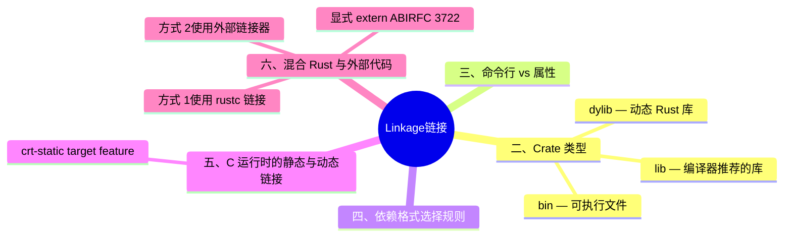

> **内容分级**: [专家级]
>
# Linkage（链接）

> **EN**: Linkage
> **Summary**: Rust 编译器支持的 crate 链接方式：bin、lib、dylib、staticlib、cdylib、rlib、proc-macro，以及 C 运行时（Runtime）静态/动态链接和混合代码库的注意事项。
> **Rust 版本**: 1.97.0+ (Edition 2024)
>
> **受众**: [进阶] / [专家]
> **Bloom 层级**: L2-L3
> **权威来源**: 本文件为 `concept/` 权威页。
> **A/S/P 标记**: **S** — Structure
> **双维定位**: P×Sys — 编译器输出与平台链接行为
> **前置依赖**: [FFI Advanced](02_ffi_advanced.md) · [Attributes and Macros](../../01_foundation/09_macros_basics/01_attributes_and_macros.md) · [Smart Pointers](../../02_intermediate/02_memory_management/04_smart_pointers.md) · [Terminology Glossary](../../00_meta/01_terminology/01_terminology_glossary.md)
> **后置概念**: [Unsafe Rust](../02_unsafe/01_unsafe.md) · [Preludes](../../01_foundation/07_modules_and_items/10_preludes.md) · [Rust vs C++](../../05_comparative/01_systems_languages/01_rust_vs_cpp.md)
> **定理链**: N/A — 编译器行为/平台相关文档
> **主要来源**: [Rust Reference — Linkage](https://doc.rust-lang.org/reference/linkage.html) · [Kohlbecker et al. — Hygienic Macro Expansion](https://doi.org/10.1145/41625.41632) · [Flatt — Binding as Sets of Scopes](https://doi.org/10.1145/2814304.2814305) · [Rust Reference — External Blocks](https://doc.rust-lang.org/reference/items/external-blocks.html) · [TRPL](https://doc.rust-lang.org/book/title-page.html) · [Brown University — Interactive Rust Book](https://rust-book.cs.brown.edu/) · [Itanium C++ ABI](https://itanium-cxx-abi.github.io/cxx-abi/abi.html) · [Oxide: The Essence of Rust](https://arxiv.org/abs/1903.00982)

>
> **来源**: [Rust Reference — Linkage](https://doc.rust-lang.org/reference/linkage.html) · [Rust Reference — crate_type](https://doc.rust-lang.org/reference/linkage.html)

---

## 一、概述

本节主要从**编译器**而非语言语义的角度，介绍 Rust 支持的 crate 链接方式。Rust 编译器可以通过命令行标志或 `#![crate_type = "..."]` 属性生成多种输出产物。(Source: [Rust Reference — Linkage](https://doc.rust-lang.org/reference/linkage.html))

> **核心原则**：编译器会尽量避免同一个库在最终产物中出现多次。

---

## 二、Crate 类型

`crate-type` 决定编译产物的链接形态，六种类型按用途分三组：

- **纯 Rust 消费**：`lib`（编译器按上下文选择的最优 Rust 库形态，下游 `use` 的默认）、`rlib`（Rust 静态库，含元数据——Rust 工具链间的标准交换格式）；
- **系统级静态产物**：`bin`（可执行文件，隐式默认）、`staticlib`（C 静态库 `.a`/`.lib`——嵌入 C/C++ 项目，**包含全部 Rust 依赖与运行时（Runtime）**，体积大但自包含）；
- **系统级动态产物**：`dylib`（Rust 动态库——Rust 版本/编译器必须严格匹配，几乎只用于 Rust 插件系统）、`cdylib`（C 动态库 `.so`/`.dll`/`.dylib`——FFI 导出标准形态，只暴露 `extern` 符号，Rust 运行时可被裁剪）。

选型判定：Rust 用 Rust ⟹ `lib`；C/C++ 项目静态嵌入 ⟹ `staticlib`；动态加载/多语言共享 ⟹ `cdylib`；`dylib` 仅在「全 Rust 动态插件」场景考虑（且优先评估 `abi_stable` crate 的稳定 ABI 方案）。

### `bin` — 可执行文件

```rust
#![crate_type = "bin"]

fn main() {
    println!("hello");
}
```

- 生成可运行的可执行文件。
- 要求 crate 中存在 `main` 函数。
- 默认 crate 类型。

### `lib` — 编译器推荐的库

```rust
#![crate_type = "lib"]
```

- 生成“编译器推荐”的库格式。
- 具体生成哪种底层格式由编译器决定，但对 `rustc` 始终可用。
- 可视为 `rlib`/`dylib` 的别名之一。

### `dylib` — 动态 Rust 库

```rust
#![crate_type = "dylib"]
```

- 强制生成动态库。
- 可被其他 Rust 库或可执行文件依赖。
- 输出：Linux `.so`、macOS `.dylib`、Windows `.dll`。

### `staticlib` — 静态系统库

```rust
#![crate_type = "staticlib"]
```

- 生成包含本 crate 及其所有上游依赖代码的静态系统库。
- **编译器不会尝试链接 `staticlib`**，主要用于将 Rust 代码嵌入非 Rust 应用。
- 输出：Linux/macOS/Windows(MinGW) `.a`，Windows(MSVC) `.lib`。

> **注意**：`staticlib` 包含依赖代码并导出所有公共符号。将其链接到共享库时，通常需要通过 linker script、symbol list 或 module definition 文件限制导出符号。

### `cdylib` — 动态系统库（C ABI）

```rust
#![crate_type = "cdylib"]
```

- 生成供其他语言加载的动态系统库。
- 输出：Linux `.so`、macOS `.dylib`、Windows `.dll`。

### `rlib` — Rust 静态库

```rust
#![crate_type = "rlib"]
```

- 编译中间产物，可视为“静态 Rust 库”。
- 与 `staticlib` 不同，`rlib` 会被 `rustc` 在后续链接中读取元数据。
- 用于生成静态链接的可执行文件和 `staticlib`。

### `proc-macro` — 过程宏 crate

```rust
#![crate_type = "proc-macro"]
```

- 只导出过程宏（Procedural Macro）。
- 编译器自动设置 `proc_macro` cfg。
- 始终使用编译器自身的目标（例如 `x86_64-unknown-linux-gnu`），即使它是为其他目标构建的 crate 的依赖。

---

## 三、命令行 vs 属性

- 通过 `--crate-type=...` 命令行标志指定时，`#![crate_type]` 属性会被忽略。(Source: [Rust Reference — Linkage](https://doc.rust-lang.org/reference/linkage.html))
- 同一方法（全命令行或全属性）指定的多个输出类型可以**叠加**，一次编译生成多个产物。
- 混合使用命令行和属性时，仅生成命令行指定的产物。

```bash
# 同时生成 rlib 和 dylib
rustc --crate-type=rlib,dylib src/lib.rs
```

---

## 四、依赖格式选择规则

当 crate A 依赖 crate B 时，编译器可能同时找到 `rlib` 和 `dylib` 两种形式的 B。选择规则如下：

1. **生成 `staticlib` 时**：所有上游依赖必须是 `rlib` 格式。无法将动态库转换为静态格式。
2. **生成 `rlib` 时**：上游依赖格式无限制，只需能读取元数据即可。
3. **生成可执行文件且未使用 `-C prefer-dynamic`**：优先尝试 `rlib`；若某些依赖无 `rlib`，则尝试动态链接。
4. **生成 `dylib` 或动态链接的可执行文件**：编译器会协调 `rlib` 和 `dylib` 依赖，尽量最大化动态依赖。

---

## 五、C 运行时的静态与动态链接

标准库支持为不同目标选择静态或动态 C 运行时（Runtime）。默认行为由目标决定：(Source: [Rust Reference — Linkage](https://doc.rust-lang.org/reference/linkage.html#static-and-dynamic-c-runtimes))

- 大多数目标默认**动态**链接 C 运行时（Runtime）。
- 以下目标默认**静态**链接：
  - `arm-unknown-linux-musleabi`
  - `arm-unknown-linux-musleabihf`
  - `armv7-unknown-linux-musleabihf`
  - `i686-unknown-linux-musl`
  - `x86_64-unknown-linux-musl`

### `crt-static` target feature

通过 `-C target-feature=+crt-static` 或 `-crt-static` 控制：

```bash
# 静态 C 运行时
rustc -C target-feature=+crt-static foo.rs

# 动态 C 运行时
rustc -C target-feature=-crt-static foo.rs
```

在代码中可通过 `cfg(target_feature = "crt-static")` 检测：

```rust
#[cfg(target_feature = "crt-static")]
fn foo() { println!("static C runtime"); }

#[cfg(not(target_feature = "crt-static"))]
fn foo() { println!("dynamic C runtime"); }
```

在 Cargo build script 中可通过 `CARGO_CFG_TARGET_FEATURE` 检测：

```rust
use std::env;

fn main() {
    let features = env::var("CARGO_CFG_TARGET_FEATURE").unwrap_or_default();
    if features.contains("crt-static") {
        println!("cargo:rustc-link-arg=-static");
    }
}
```

---

## 六、混合 Rust 与外部代码

将 Rust 与 C/C++ 混合链接为单一二进制文件有两种方式：

### 方式 1：使用 `rustc` 链接

```bash
rustc --crate-type=bin src/main.rs -L native=/path/to/libs -l myclib
```

或在 Rust 代码中使用 `#[link]`：

```rust
#[link(name = "myclib", kind = "static")]
unsafe extern "C" {}
```

### 方式 2：使用外部链接器

1. 生成 Rust `staticlib`。
2. 将 `staticlib` 传入外部链接器。

> **限制**：多个 Rust `staticlib` 一起链接可能冲突。若需组合多个 Rust 子系统，应生成**单个** `staticlib`（例如通过大量 `extern crate` 将多个 `rlib` 聚合）。
> **不支持**：直接将 `rlib` 传入外部链接器。

---

### 显式 extern ABI（RFC 3722）

> **来源**: [RFC 3722 — Explicit extern ABIs](https://rust-lang.github.io/rfcs/3722-explicit-extern-abis.html)

RFC 3722 要求 `extern` 块与 `extern fn` 的 ABI 字符串**显式化**：裸 `extern {}` / `extern fn`（隐含 `"C"`）将逐步淘汰，统一书写为 `extern "C" {}` / `extern "C" fn`。该变化与 2024 Edition 的 `unsafe extern` 块要求（见 [Edition 2024 完全指南](../../07_future/01_edition_roadmap/02_edition_guide.md)）同属“FFI 边界显式化”治理线：ABI 字符串是链接语义的单一事实源，隐式默认在跨版本演进中是隐患。当前（1.97）裸写法仍可用但已有迁移 lint 路径；新代码应一律显式标注 ABI。

## 七、Panic 展开与链接一致性

如果 Rust 产物是 **potentially unwinding** 的，则所有 crate 必须使用 `unwind` panic 策略，否则可能导致未定义行为。(Source: [Rust Reference — Linkage](https://doc.rust-lang.org/reference/linkage.html#linking-and-unwinding))

潜在展开的条件：

- 使用 `unwind` panic handler。
- 包含一个使用 `unwind` panic 策略的 crate，且该 crate 调用了 `-unwind` ABI 函数。
- 向拥有独立 Rust runtime 副本的另一个 Rust 产物发起 `"Rust" ABI` 调用，且该产物是 potentially unwinding 的。

> 使用 `rustc` 链接时，这些规则会自动强制执行。使用 `dlopen` 等不由 `rustc` 控制的链接方式时，需要手动保证一致性（Coherence）。

---

## 八、快速选择指南

| 场景 | 推荐 crate type |
|:---|:---|
| 普通可执行程序 | `bin` |
| 普通 Rust 库（给 Rust 用） | `lib` 或 `rlib` |
| 需要动态链接的 Rust 插件 | `dylib` |
| 嵌入非 Rust 应用的静态库 | `staticlib` |
| 供其他语言调用的动态库 | `cdylib` |
| 过程宏（Procedural Macro） | `proc-macro` |

---

## 九、相关概念

| 概念 | 关系 |
|:---|:---|
| [FFI Advanced](02_ffi_advanced.md) | `cdylib`/`staticlib` 常用于 FFI 场景 |
| [Preludes](../../01_foundation/07_modules_and_items/10_preludes.md) | `extern crate` 影响 extern prelude 和链接 |
| [Unsafe Rust](../02_unsafe/01_unsafe.md) | FFI 和混合代码库通常涉及 unsafe |

> **权威来源**: [Rust Reference — Linkage](https://doc.rust-lang.org/reference/linkage.html), [Rust Reference — External Blocks](https://doc.rust-lang.org/reference/items/external-blocks.html), [TRPL](https://doc.rust-lang.org/book/title-page.html)
>
> **权威来源对齐变更日志**: 2026-07-10 Stage F L3 补全权威来源块与关键引用（Reference） [Authority Source Sprint Batch 10](../../00_meta/02_sources/05_international_authority_index.md)

---

## Rust 1.97.0 交叉语义（链接 / ABI）

> **Edition / 版本**: Rust 1.97.0+ (Edition 2024)
> **定位**: 本小节为 Rust 1.97.0 在「编译器符号发射 ⟷ 链接器输入 ⟷ ABI 契约」边界的**交叉语义**补全，对应审计缺口（[`GLOBAL_SEMANTIC_CRITICAL_AUDIT_2026_07_11.md`](../../../reports/GLOBAL_SEMANTIC_CRITICAL_AUDIT_2026_07_11.md) §2.4、§4 P2-2 缺口#1）。原 `mangling / linker / export_name / v0` 在本页 0 命中，现补齐。

Rust 1.97.0 将若干链接/ABI 相关行为从「单点变更」变成了跨领域效应：v0 混淆改变符号名形态、`linker_messages` 改变链接器输出的可见性、空 `export_name`/`link_name` 校验改变 ABI 契约的可构造性。本节逐条给出**事实、边界、迁移**，并在末尾给出统一来源与反链。

### A. v0 symbol mangling 默认启用：链接器输入 / demangler / debugger-profiler

Rust 1.97.0 将 **v0 symbol mangling** 设为默认方案（自 1.59 起可经 `-C symbol-mangling-version=v0` 选择，现进入 stable 默认）。其跨领域影响落在**链接器输入符号的形态**上：

- **链接器输入**：Rust→Rust 的混淆符号名格式变化（泛型（Generics）实例保留具体值而非仅靠 hash），链接器看到的仍是合法符号，但任何按**旧混淆名文本**匹配的工具都会失配。
- **demangler / debugger / profiler**：旧版本工具可能**无法 demangle v0 符号**，导致调试器、profiler、backtrace 显示原始混淆名；主流工具（GDB 15+、LLDB、`rustfilt`）已支持 v0。
- **backtrace**：发布说明明确指出 v0 可能改变 backtrace 文本的**格式**（symbol 呈现）。

**与 `#[no_mangle]` / `extern "C"` 的边界**：v0 只作用于 **Rust 自行混淆的符号名**。`#[unsafe(no_mangle)]` 与 `extern "C"`（以及显式 `#[unsafe(export_name = "...")]`）产生的是**字面符号名**，绕过混淆，因此**不受 v0 默认方案影响**。

**何时仍需 `no_mangle`**：当符号要被 C/汇编/链接器脚本/`dlsym` 按**固定字面名**引用时，仍必须用 `#[unsafe(no_mangle)]`（通常配 `extern "C"`）或 `#[unsafe(export_name = "...")]`；否则 v0 混淆名无法被外部按名定位。

```bash
# 观察 Rust 1.97+ 默认 v0 混淆后的符号（以 cdylib 为例）
cargo build --release
# Linux/macOS：列出符号并 demangle（rustfilt 对 v0 支持更完整）
nm target/release/lib<name>.so | rustfilt | head
# 查看混淆版本选择；legacy 回退仅在每日构建版上可用（来源：版本页 §2.7）
rustc -C symbol-mangling-version=v0 --print cfg
```

```rust,ignore
// Edition 2024 / Rust 1.97.0+ —— v0 只影响"Rust 混淆名"，不影响字面符号
#[unsafe(no_mangle)]
pub extern "C" fn ffi_add(a: i32, b: i32) -> i32 { a + b }
// 导出符号名恒为字面 `ffi_add`，不受 v0 默认方案影响。

#[unsafe(export_name = "ffi_add_v0")]
pub fn rust_add(a: i32, b: i32) -> i32 { a + b }
// export_name 显式固定字面符号，同样绕过 v0 混淆。
```

### B. `linker_messages` lint：链接器输出默认显示，且不在 `warnings` group

历史上 rustc 在链接成功时**隐藏** linker 的 stderr；Rust 1.97.0 改为**默认显示**链接器输出，并通过 `linker_messages` lint 以 warning 形式报告（发布说明："Warn on linker output by default"）。

**关键边界（交叉点）**：`linker_messages` 是**特殊 lint**，**不受 `warnings` lint group 控制**。由此推出 CI 上的非显然结论：

- `build.warnings = "deny"` 与 `RUSTFLAGS="-D warnings"` 作用于常规 lint/warnings 体系，**不一定**能压制 `linker_messages`。
- 因此「CI 强制零警告」策略对 `linker_messages` 可能失效，需显式处理。

⚠ **需专家复核**：上述「`-D warnings` / `build.warnings=deny` 无法压制 `linker_messages`」是由版本页 §2.8「特殊 lint、不受 warnings group 控制」与 §5.1「`build.warnings` 控制本地包常规 lint 警告」两条事实**推导**的 CI 行为结论；具体到各 toolchain 与 linker 的组合表现，建议以 [`rust_1_97_stabilized.md`](../../07_future/00_version_tracking/rust_1_97_stabilized.md) §2.8/§5.1 与实际编译输出复核。

**CI 处理建议**：先以 `warn` 运行收集真实链接器告警并针对性修复；仅在确认为已知误报时临时 `allow`。

```toml
# Cargo.toml — 显式允许（静默）linker_messages；注意它不在 warnings group 内
[lints.rust]
linker_messages = "allow"
```

```rust,ignore
// 或在 crate 根临时允许（建议保留为 warn 以暴露真实链接器告警）
#![allow(linker_messages)]
```

```bash
# 命令行静默（CLI 用 kebab-case）：仅在确认误报时使用
RUSTFLAGS="-A linker-messages" cargo build
# 对照：常规本地包 lint 仍可由 Cargo 统一强制为 deny（不影响依赖、不破坏 build cache）
CARGO_BUILD_WARNINGS=deny cargo check --keep-going
```

### C. 空 `#[export_name]` 被拒绝；`#[link_name]` / `#[link(name)]` 校验加强；macho `link_section` 非法值报错

Rust 1.97.0 在属性校验阶段新增三类**硬错误**（无向后兼容宽限），均直接收紧 ABI/链接契约的可构造性：

1. **空 `#[export_name = ""]` 被拒绝**：导出符号名不得为空字符串（发布说明："Error on `#[export_name = "..."]` where the name is empty"）。
2. **校验 `#[link_name = "..."]` 与 `#[link(name = "...")]` 参数**：非法（如空串）参数现在报错；链接导入侧与库名必须非空且合法（发布说明："validate `#[link_name]` & `#[link(name)]` parameters"）。
3. **macho 目标 `#[link_section]` 非法说明符报错**：macOS 目标的段/节说明符（`segname,sectname` 形式）若非法，现在报错（发布说明："Error on invalid macho `link_section` specifier"）。

⚠ **需专家复核**：mach-o `link_section` 的具体合法字符集与 `segname`/`sectname` 长度上限由目标 ABI 决定，本页未给出精确字节数；精确限制请复核 Rust Reference 与目标文档（来源见末尾）。

**迁移要点**（逐步判定见 [`migration_197_decision_tree.md`](../../07_future/00_version_tracking/migration_197_decision_tree.md) §3）：

- 空 `export_name` → 改为非空、全局唯一的固定名，或改用 `#[unsafe(no_mangle)]` 暴露标识符字面名。
- `link_name`/`link(name)` → 确保参数非空且为目标平台合法标识符/库名。
- macho `link_section` → 修正为合法的 `segname,sectname` 说明符。

```rust,ignore
// ❌ Rust 1.97+ 硬错误：空导出符号名被拒绝
#[unsafe(export_name = "")]
pub fn hook() {}

// ✅ 方案 A：提供非空、全局唯一的固定符号名
#[unsafe(export_name = "my_crate_hook_v1")]
pub fn hook() {}

// ✅ 方案 B：不需要自定义名时，用 no_mangle 暴露标识符字面名
#[unsafe(no_mangle)]
pub extern "C" fn hook() {}
```

```rust,ignore
// #[link_name] / #[link(name)] 参数现在会被校验：非法（如空串）参数报错
#[link(name = "mynative")]           // 非空、合法的库名
extern "C" {
    #[link_name = "native_symbol"]   // 非空、合法的符号名
    fn native_symbol();
}

// macho 目标：#[link_section] 说明符须符合 segname,sectname 形式
#[unsafe(link_section = "__DATA,__mydata")]
#[used]
static MY_DATA: [u8; 4] = [0; 4];
```

### D. 与 `repr(C)` / 链接模型 / ABI 稳定性的关系

- **`repr(C)`** 固定**类型布局**（size/alignment/padding），本页前述 `extern "C"` 固定**调用约定**与**字面符号名**；二者共同构成可被外部依赖的 ABI 面。v0 混淆不改变 `repr(C)`/`extern "C"`/`no_mangle` 已固定的 ABI 面，只影响其余 Rust 混淆符号。
- **链接模型**：`cdylib`/`staticlib` 的导出符号在 v0 默认下，凡是未用 `no_mangle`/`export_name` 固定的 Rust 项，其符号名形态随 v0 变化；对外 ABI 应仅依赖 `extern "C"` + `no_mangle`/`export_name` 固定的字面符号。
- **ABI 稳定性**：空 `export_name`/`link_name` 校验把「未命名/非法符号」从「可能被静默接受的 UB 风险」提升为「编译期硬错误」，使 ABI 契约在编译期即可验证。

> 完整的 ABI 控制属性（`used`/`no_mangle`/`link_section`/`export_name`）与 v0 × debuginfo × linker_messages × backtrace 交互矩阵，见 [`38_application_binary_interface.md`](../../04_formal/05_rustc_internals/05_application_binary_interface.md)。

### 来源与交叉索引

> **来源**:
> · [Rust 1.97.0 Release Notes](https://releases.rs/docs/1.97.0/)（Compatibility Notes：v0 mangling 默认、Warn on linker output、空 `export_name` 报错、`link_name`/`link(name)` 校验、macho `link_section` 报错）
> · [`rust_1_97_stabilized.md`](../../07_future/00_version_tracking/rust_1_97_stabilized.md) §2.7（v0 mangling）、§2.8（`linker_messages`）、§5.1（`build.warnings`）、§7/§7.2（兼容性表与空 `export_name`）
> · [Rust Reference — Linkage](https://doc.rust-lang.org/reference/linkage.html) · [Rust Reference — External Blocks / ABI](https://doc.rust-lang.org/reference/items/external-blocks.html) · [Rust Reference — ABI](https://doc.rust-lang.org/reference/abi.html)
>
> **交叉索引（反链）**:
> · 版本事实源：[`rust_1_97_stabilized.md`](../../07_future/00_version_tracking/rust_1_97_stabilized.md)
> · 特性×领域反查矩阵：[`feature_domain_matrix_197.md`](../../07_future/00_version_tracking/feature_domain_matrix_197.md)
> · 兼容性迁移判定树：[`migration_197_decision_tree.md`](../../07_future/00_version_tracking/migration_197_decision_tree.md)
> · ABI 权威页（交互矩阵）：[`38_application_binary_interface.md`](../../04_formal/05_rustc_internals/05_application_binary_interface.md)

---

## 版本兼容性 / Version Compatibility

> 本节汇总与本概念相关的 Rust 稳定版本变更。完整列表见对应版本跟踪页。

- **[Rust 1.90](../../07_future/00_version_tracking/rust_1_90_stabilized.md)**
  - `x86_64-unknown-linux-gnu` 默认使用 lld 链接器
- **[Rust 1.95](../../07_future/00_version_tracking/rust_1_95_stabilized.md)**
  - `--remap-path-scope` 稳定（§3.1）

## 国际权威参考 / International Authority References（P1 学术 · P2 生态）

> 依据 `AGENTS.md` §2「对齐网络国际化权威内容」补充：仅追加已验证可达的权威链接，不改动正文事实。

- **P2 生态/社区**: [docs.rs/nix — 生态权威 API 文档](https://docs.rs/nix) · [docs.rs/bytemuck — 生态权威 API 文档](https://docs.rs/bytemuck)

## ⚠️ 反例与陷阱

本节以 Edition 2024 的 `unsafe extern` 要求为反例，展示链接声明必须显式标注可信边界。

### 反例：无 `unsafe` 的 extern 块（rustc 1.97.0，Edition 2024 实测）

```rust,compile_fail
extern "C" { // ❌ Edition 2024：extern 块必须 unsafe
    fn abs(x: i32) -> i32;
}
fn main() {
    unsafe { println!("{}", abs(-3)); }
}
```

**错误**：`error: extern blocks must be unsafe`——声明外部符号本身就是信任断言，须显式 `unsafe`。

### ✅ 修正：`unsafe extern` 声明

```rust
unsafe extern "C" {
    safe fn abs(x: i32) -> i32; // safe 标注免除调用处 unsafe
}
fn main() {
    println!("{}", abs(-3));
}
```

## 🧭 思维导图（Mindmap）


