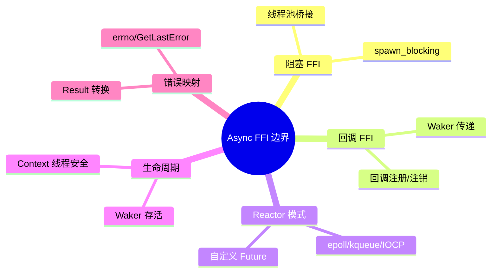
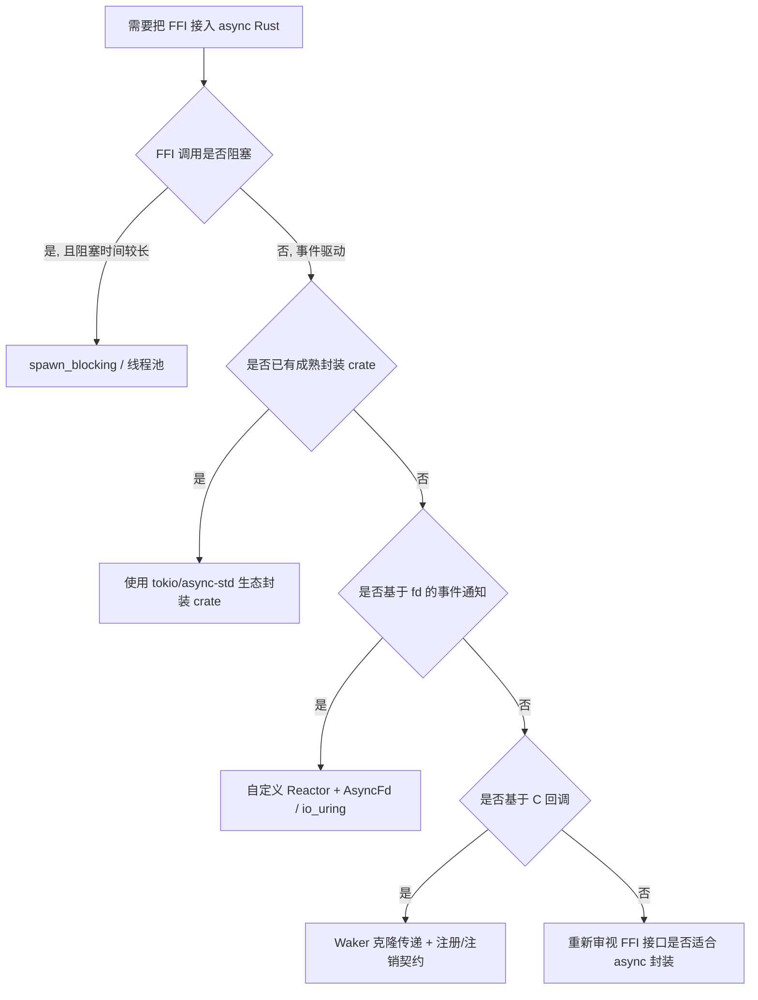

> **内容分级**: [专家级]
>
> **Rust 版本**: 1.97.0+ (Edition 2024)
> **本节关键术语**: FFI · async · Waker · callback · reactor · 回调 · 唤醒 — [完整对照表](../../00_meta/01_terminology/01_terminology_glossary.md)

# Async FFI 边界：在异步运行时中调用外部代码

> **EN**: Async FFI Boundary
> **Summary**: Integrating foreign functions and C-style callbacks with Rust async runtimes: how to bridge blocking/external I/O with Future-based code without violating Send/Sync, Pin, or Waker contracts.
> **受众**: [专家]
> **Bloom 层级**: L4-L5
> **权威来源**: 本文件为 `concept/` 权威页。
> **A/S/P 标记**: **P** — Procedure
> **双维定位**: P×Eva — 评判 async-FFI 集成方案的可行性
> **定位**: 阐述如何将 C/外部库的阻塞或回调式接口接入 Rust async/await 生态：从线程池桥接到自定义 Reactor，再到把 Rust `Waker` 安全地传递给 C 回调。
> **前置概念**:
> [Rust FFI](01_rust_ffi.md) ·
> [Async/Await](../01_async/01_async.md) ·
> [Waker 契约](../01_async/12_waker_contract_deep_dive.md) ·
> [Send 与 Sync](../00_concurrency/02_send_sync_auto_traits.md) ·
> [Traits](../../02_intermediate/00_traits/01_traits.md)
> **后置概念**:
> [Async 中的 Unsafe](../02_unsafe/08_async_in_unsafe_contexts.md) ·
> [Async 边界全景](../01_async/06_async_boundary_panorama.md)

---

> **来源**:
> [Rust Reference — External Blocks](https://doc.rust-lang.org/reference/items/external-blocks.html) ·
> [The Rust FFI Omnibus](https://jakegoulding.com/rust-ffi-omnibus/) ·
> [Tokio docs — Async in Depth](https://docs.rs/tokio/latest/tokio/) ·
> [RFC 2394 — async/await](https://rust-lang.github.io/rfcs/2394-async_await.html)

---

## 🧠 知识结构图



## 📑 目录

- [Async FFI 边界：在异步运行时中调用外部代码](#async-ffi-边界在异步运行时中调用外部代码)
  - [🧠 知识结构图](#-知识结构图)
  - [📑 目录](#-目录)
  - [一、权威定义](#一权威定义)
  - [二、集成模式矩阵](#二集成模式矩阵)
  - [三、阻塞 FFI：线程池桥接](#三阻塞-ffi线程池桥接)
    - [3.1 边界陈述](#31-边界陈述)
    - [3.2 判定条件](#32-判定条件)
  - [四、回调 FFI：Waker 与外部回调](#四回调-ffiwaker-与外部回调)
    - [4.1 边界陈述](#41-边界陈述)
    - [4.2 关键契约](#42-关键契约)
    - [4.3 反例：直接传递 Waker 引用给 C](#43-反例直接传递-waker-引用给-c)
  - [五、自定义 Reactor 模式](#五自定义-reactor-模式)
    - [5.1 模式概述](#51-模式概述)
    - [5.2 与 async 运行时的关系](#52-与-async-运行时的关系)
  - [六、判定树](#六判定树)
  - [七、反例与失效模式](#七反例与失效模式)
  - [八、相关概念](#八相关概念)

---

## 一、权威定义

> **Rust Reference**: External blocks provide declarations of items that are not defined in the current crate and are the basis of Rust's foreign function interface.

**Async FFI 边界定义**：连接 Rust async/await 执行模型与外部（通常是 C）函数/库的接口层。该边界必须同时满足：

- FFI 安全规则（ABI、类型布局、生命周期（Lifetimes））；
- async 运行时契约（`Future::poll` 非阻塞、`Waker` 正确唤醒、`Send`/`Sync` 边界）；
- Pin 契约（若外部回调可能触及 Rust 自引用 Future）。

---

## 二、集成模式矩阵

| 外部接口形态 | 典型示例 | Rust async 接入方案 | 复杂度 |
|---|---|---|---|
| 同步阻塞调用 | `read(2)`, `sqlite3_step` | `spawn_blocking` / 线程池 | 低 |
| 基于 fd 的事件驱动 | `epoll`, `kqueue`, `io_uring` | 自定义 Reactor + `Waker` | 高 |
| C 回调注册 | libcurl multi, OpenSSL async | 将 `Waker` 作为回调 user_data | 中 |
| 线程 + 队列 | 外部库自带后台线程 | `mpsc` / `oneshot` 桥接 | 中 |
| 完全异步（Async）外部运行时 | io_uring, Windows overlapped | 封装为 Rust Future | 高 |

---

## 三、阻塞 FFI：线程池桥接

本节处理最常见也最简单的 async-FFI 形态：同步阻塞式外部调用。3.1 阐明 `Future::poll` 的非阻塞契约，3.2 给出是否使用线程池桥接的判定条件。

### 3.1 边界陈述

`Future::poll` 必须尽快返回，不能阻塞 executor 线程。阻塞 FFI 调用应放在独立线程上执行。

**Rust 1.97.0 / Tokio 标准做法**：

```rust,ignore
use tokio::task;

async fn call_blocking_ffi() -> std::io::Result<()> {
    task::spawn_blocking(|| {
        unsafe { libc::sleep(1) };
    }).await.unwrap();
    Ok(())
}
```

### 3.2 判定条件

- FFI 调用是否阻塞超过 ~10μs？→ 使用 `spawn_blocking`
- 调用是否频繁且短？→ 考虑 io_uring / 自定义 Reactor
- 调用是否需要在 async 上下文中保持借用（Borrowing）？→ 确保借用的数据在 await 期间存活

---

## 四、回调 FFI：Waker 与外部回调

本节处理 C 风格回调库与 Rust async 运行时的集成模式。4.1 描述将 `Waker` 作为 `user_data` 的标准流程，4.2 总结克隆、注销、线程安全等关键契约，4.3 演示直接传递 Waker 引用给 C 的危险。

### 4.1 边界陈述

许多 C 库使用回调通知事件完成。将这类库接入 Rust async 的标准模式：

1. 在 Rust 侧构造一个 `Waker`；
2. 通过 `extern "C"` 回调把 `Waker` 的指针作为 `user_data` 传给 C；
3. C 完成事件后调用 Rust 回调，回调中调用 `Waker::wake`；
4. Rust Future 被重新调度，从 C 库查询结果。

### 4.2 关键契约

| 契约 | 说明 | 违反后果 |
|---|---|---|
| Waker 克隆 | 每次传递给 C 前 `clone()`，确保独立所有权（Ownership） | use-after-free |
| 回调线程安全 | 若 C 回调可能从任意线程触发，Waker 必须 `Send` | 数据竞争 |
| 注销机制 | Future drop 时必须从 C 库注销回调 | 回调指向已释放内存 |
| 单次唤醒 | 某些 reactor 要求 wake 后重新注册 | 丢失事件或重复唤醒 |

### 4.3 反例：直接传递 Waker 引用给 C

```rust,ignore
extern "C" fn callback(waker: *const Waker) {
    unsafe {
        (*waker).wake_by_ref(); // 危险：waker 可能已失效
    }
}
```

**修正**：传递 `Box<Waker>` 或 `Arc<Waker>`，并在注销时释放。

---

## 五、自定义 Reactor 模式

本节面向基于 fd 或 io_uring 的事件驱动型外部接口。5.1 概述 Reactor 的基本结构与线程模型，5.2 说明独立 Reactor 与 Tokio 等运行时集成的几种方式。

### 5.1 模式概述

对于 epoll/kqueue/IOCP/io_uring 等接口，可以在 Rust 中实现一个 Reactor：

- 一个后台线程轮询 OS 事件；
- 事件到达时通过 `Waker` 唤醒对应 Future；
- Future 再次 poll 时读取结果。

### 5.2 与 async 运行时的关系

- **独立 Reactor**：自己管理线程和 Waker，不与 Tokio/async-std 共享；
- **集成到 Tokio**：通过 `tokio::runtime::Handle::current().spawn` 或 `tokio::io::unix::AsyncFd`；
- **io_uring**：通过 `tokio-uring` 等库封装。

---

## 六、判定树



---

## 七、反例与失效模式

| 失效模式 | 根因 | 修复方向 |
|---|---|---|
| 在 poll 中调用阻塞 FFI | 违反 Future 非阻塞契约 | 改为 spawn_blocking 或 Reactor |
| C 回调唤醒已释放 Waker | Waker 生命周期（Lifetimes）管理错误 | 使用 Box/Arc + 注销机制 |
| 回调线程非 Send 却跨线程 wake | Waker 线程安全假设错误 | 约束 Waker: Send 或单线程 Reactor |
| FFI 错误码未映射到 Rust 错误 | errno 被后续调用覆盖 | 在 unsafe 块内立即读取并转换 |
| 外部句柄在 Future drop 后泄漏 | 缺少 Drop 中关闭/注销 | 在 Future Drop 中调用 FFI 清理 |

---

## 八、相关概念

- [Rust FFI](01_rust_ffi.md)
- [Async/Await](../01_async/01_async.md)
- [Waker 契约深度解析](../01_async/12_waker_contract_deep_dive.md)
- [Send 与 Sync](../00_concurrency/02_send_sync_auto_traits.md)
- [Async 中的 Unsafe](../02_unsafe/08_async_in_unsafe_contexts.md)
- [Async 边界全景](../01_async/06_async_boundary_panorama.md)

---

> **权威来源**: [Rust Reference — External Blocks](https://doc.rust-lang.org/reference/items/external-blocks.html) · [The Rust FFI Omnibus](https://jakegoulding.com/rust-ffi-omnibus/) · [Tokio docs](https://docs.rs/tokio/latest/tokio/)
