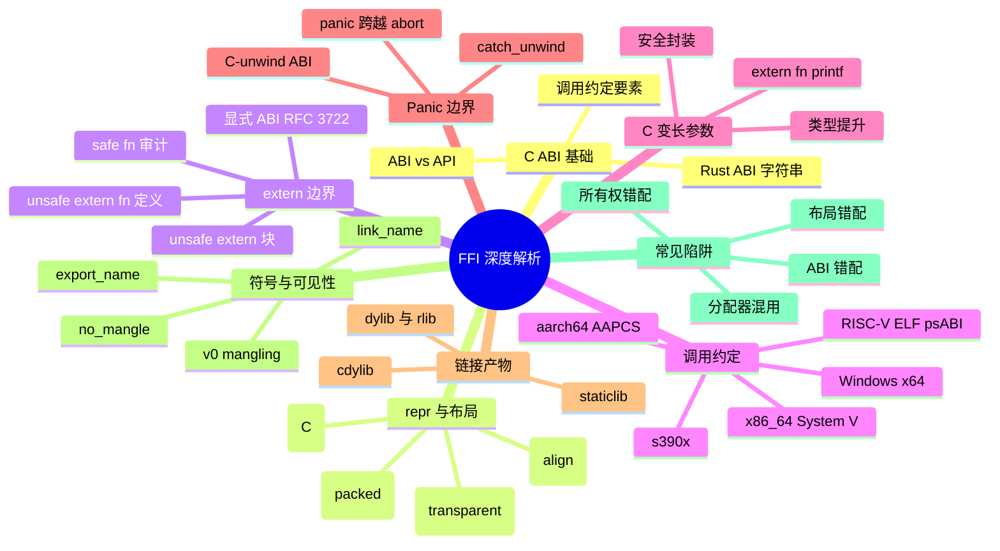

> **内容分级**: [专家级]
>
> **Rust 版本**: 1.97.0+ (Edition 2024)
> **本节关键术语**: C ABI · repr(C) · calling convention · unsafe extern · C variadic · panic boundary · cdylib · staticlib · symbol mangling · name mangling

# FFI 深度解析：C ABI、调用约定与链接

> **EN**: FFI Deep Dive: C ABI, Calling Conventions and Linking
> **Summary**: Deep dive into the mechanical layer of Rust FFI: C ABI basics, `repr(C)` layout, `extern` blocks, `unsafe extern` functions, calling conventions, C variadics, panic boundaries, `cdylib`/`staticlib`, linking, symbol mangling, and common pitfalls.
> **受众**: [专家]
> **Bloom 层级**: L3-L5
> **权威来源**: 本文件为 `concept/` 权威页。
> **A/S/P 标记**: **S+P** — Structure + Procedure
> **双维定位**: S×Ana — 规范分析
> **定位**: 系统剖析 Rust 与 C 世界交互的**机械层**：从 ABI/调用约定到 `repr(C)` 布局，从 `unsafe extern` 函数到 `cdylib`/`staticlib` 链接产物，从符号修饰到 panic 边界，建立 FFI 代码审查与工程决策的完整 checklist。
> **前置概念**:
> [Rust FFI](01_rust_ffi.md) ·
> [`unsafe extern blocks`](05_unsafe_extern_blocks.md) ·
> [Linkage](03_linkage.md) ·
> [Unsafe Rust](../02_unsafe/01_unsafe.md) ·
> [Type System](../../01_foundation/02_type_system/01_type_system.md) ·
> [Memory Management](../../02_intermediate/02_memory_management/01_memory_management.md)
> **后置概念**:
> [Async FFI 边界](04_async_ffi_boundary.md) ·
> [FFI 高级主题](02_ffi_advanced.md) ·
> [Rust 内存模型](../02_unsafe/06_memory_model.md)

---

> **权威来源 / Provenance**:
> [Rust Reference — External Blocks](https://doc.rust-lang.org/reference/items/external-blocks.html) ·
> [Rust Reference — ABIs](https://doc.rust-lang.org/reference/abi.html) ·
> [Rust Reference — Type Layout](https://doc.rust-lang.org/reference/type-layout.html) ·
> [Rust Reference — Linkage](https://doc.rust-lang.org/reference/linkage.html) ·
> [The Rustonomicon — FFI](https://doc.rust-lang.org/nomicon/ffi.html) ·
> [The Rustonomicon — Unwinding](https://doc.rust-lang.org/nomicon/unwinding.html) ·
> [RFC 3484 — unsafe extern blocks](https://rust-lang.github.io/rfcs/3484-unsafe-extern-blocks.html) ·
> [RFC 3722 — Explicit extern ABIs](https://rust-lang.github.io/rfcs/3722-explicit-extern-abis.html) ·
> [libc crate docs](https://docs.rs/libc/latest/libc/) ·
> [Itanium C++ ABI](https://itanium-cxx-abi.github.io/cxx-abi/abi.html)

---

## 🧠 知识结构图



## 📑 目录

- [FFI 深度解析：C ABI、调用约定与链接](#ffi-深度解析c-abi调用约定与链接)
  - [🧠 知识结构图](#-知识结构图)
  - [📑 目录](#-目录)
  - [一、C ABI 基础](#一c-abi-基础)
    - [1.1 ABI 与 API 的边界](#11-abi-与-api-的边界)
    - [1.2 调用约定决定什么](#12-调用约定决定什么)
    - [1.3 Rust 支持的 ABI 字符串](#13-rust-支持的-abi-字符串)
  - [二、`repr(C)` 与内存布局](#二reprc-与内存布局)
    - [2.1 字段顺序与填充](#21-字段顺序与填充)
    - [2.2 `repr(transparent)` / `repr(align(N))` / `repr(packed)`](#22-reprtransparent--repralignn--reprpacked)
    - [2.3 `enum` 与 `union` 的 FFI 布局](#23-enum-与-union-的-ffi-布局)
  - [三、`extern` 块与 `unsafe extern` 函数](#三extern-块与-unsafe-extern-函数)
    - [3.1 `unsafe extern "ABI" {}` 声明](#31-unsafe-extern-abi--声明)
    - [3.2 `safe fn`：显式审计边界](#32-safe-fn显式审计边界)
    - [3.3 `unsafe extern "C" fn` 定义（Rust 1.82+）](#33-unsafe-extern-c-fn-定义rust-182)
    - [3.4 RFC 3722：ABI 字符串显式化](#34-rfc-3722abi-字符串显式化)
  - [四、调用约定矩阵](#四调用约定矩阵)
  - [五、C 变长参数函数](#五c-变长参数函数)
  - [六、跨越 FFI 边界的 panic](#六跨越-ffi-边界的-panic)
  - [七、`cdylib` / `staticlib` 与链接](#七cdylib--staticlib-与链接)
  - [八、符号修饰与可见性](#八符号修饰与可见性)
  - [九、常见陷阱](#九常见陷阱)
  - [十、边界测试 / 反例](#十边界测试--反例)
  - [十一、嵌入式测验](#十一嵌入式测验)
  - [十二、国际权威参考](#十二国际权威参考)
  - [🧭 思维导图（Mindmap）](#-思维导图mindmap)

---

## 一、C ABI 基础

### 1.1 ABI 与 API 的边界

**API（Application Programming Interface）** 是源代码层面的契约：函数名、参数类型、返回值类型、文档化的前置条件。
**ABI（Application Binary Interface）** 是二进制层面的契约：调用约定、类型布局、名称修饰、符号可见性。

FFI 的难点在于：Rust 编译器只检查 API（类型签名是否可编译），**不检查 ABI**。ABI 契约由程序员通过 `extern "ABI"`、`#[repr(C)]`、链接属性等显式声明，一旦声明与实际外部实现不符，即产生**未定义行为（UB）**。

```text
API 契约          ABI 契约
─────────────────────────────────────────────
函数名            符号名 / mangling
参数类型          寄存器/栈分配、宽度、对齐
返回值类型        寄存器/内存返回协议
文档不变量        调用约定、栈清理责任
```

> **关键洞察**：`extern "C"` 只保证**调用约定**；它不负责保证结构体字段顺序、整数宽度、枚举底层类型。这些必须由 `#[repr(C)]`、`libc` 类型别名和人工审查共同保证。

### 1.2 调用约定决定什么

调用约定（calling convention）是 ABI 的核心子集，决定：

1. **参数传递**：哪些参数进寄存器（如 `rdi/rsi/rdx`），哪些压栈，顺序如何。
2. **返回值传递**：小结构体放寄存器，大结构体通过隐藏指针返回。
3. **栈清理责任**：调用方（caller）还是被调用方（callee）清理参数栈。
4. **寄存器保存约定**：哪些寄存器被调用方保留（callee-saved），哪些可破坏（caller-saved）。
5. **名称修饰（name mangling）**：C 通常不做修饰（`foo`），C++ 做复杂修饰（Itanium ABI），Rust 默认做 v0 mangling。

### 1.3 Rust 支持的 ABI 字符串

| ABI 字符串 | 含义 | 典型场景 |
|:---|:---|:---|
| `"C"` | 标准 C ABI | 与 C/C++ 互操作（默认首选） |
| `"system"` | 平台默认系统 ABI | Windows API（x86 上为 `stdcall`） |
| `"stdcall"` | Windows `stdcall` | 32-bit Windows API |
| `"fastcall"` | x86 fastcall | 极少使用 |
| `"vectorcall"` | Windows vectorcall | SIMD 调用约定 |
| `"win64"` | Windows x86_64 ABI | Windows 64-bit 原生 |
| `"sysv64"` | System V AMD64 ABI | Linux/macOS x86_64 |
| `"aapcs"` | ARM 过程调用标准 | 32-bit ARM |
| `"cdecl"` | C declaration（x86） | 兼容旧 C 代码 |
| `"Rust"` | Rust 内部 ABI | 不稳定，仅 Rust 内部 |
| `"C-unwind"` | 允许 panic/unwind 跨越 | 需要 C 侧支持展开 |

> **来源**: [Rust Reference — ABIs](https://doc.rust-lang.org/reference/abi.html)

---

## 二、`repr(C)` 与内存布局

### 2.1 字段顺序与填充

Rust 默认结构体布局（`#[repr(Rust)]`）不保证字段顺序，编译器可重排以优化内存。**跨 FFI 传递结构体必须使用 `#[repr(C)]`**，它保证：

- 字段按声明顺序排列；
- 对齐规则遵循平台 C ABI；
- 填充（padding）位置与 C 一致。

```rust
#[repr(C)]
pub struct Point {
    pub x: f64,
    pub y: f64,
}
```

Rust 侧可用 `std::mem::size_of`/`align_of` 验证，但**不能完全替代**对 C 头文件的对照：C 编译器的 `#pragma pack`、位域、`_Alignas` 都会改变布局。

### 2.2 `repr(transparent)` / `repr(align(N))` / `repr(packed)`

| 属性 | 作用 | FFI 场景 |
|:---|:---|:---|
| `#[repr(transparent)]` | 单字段类型的 ABI 与内部字段完全一致 | 新建类型包装（newtype）如 `Handle(c_int)` |
| `#[repr(align(N))]` | 强制 N 字节对齐 | 与 C 的 `_Alignas(N)` 对齐 |
| `#[repr(C, packed)]` | 无填充、按 1 对齐 | 仅当 C 侧明确 `__attribute__((packed))` 时使用 |

```rust
#[repr(transparent)]
pub struct FileDescriptor(c_int);

#[repr(C, align(16))]
pub struct AlignedBuffer {
    pub data: [u8; 64],
}
```

> **风险**：`repr(packed)` 会生成未对齐字段，在 ARM 等架构上可能触发硬件异常；Rust 访问 packed 字段时会产生临时拷贝，但仍需保证整体布局与 C 一致。

### 2.3 `enum` 与 `union` 的 FFI 布局

Rust 默认 `enum` 的布局不稳定，不能安全传给 C。应使用：

- `#[repr(u8/u16/u32/u64/i8/...)]`：显式指定 discriminant 宽度；
- `#[repr(C)]`：与 C 的 tagged union 布局一致（但 Rust 会添加 tag）；
- `#[repr(C)] union`：与 C union 布局一致，访问变体需 unsafe。

```rust
#[repr(u8)]
pub enum Color { Red = 0, Green = 1, Blue = 2 }

#[repr(C)]
pub union Value {
    pub int: c_int,
    pub float: f32,
}
```

> **来源**: [Rust Reference — Type Layout](https://doc.rust-lang.org/reference/type-layout.html)

---

## 三、`extern` 块与 `unsafe extern` 函数

### 3.1 `unsafe extern "ABI" {}` 声明

自 Rust 1.82 起，`unsafe extern "ABI" {}` 可在所有 Edition 中使用；自 Edition 2024 起，`extern "ABI" {}` 不再被隐式允许，必须写 `unsafe extern`。

```rust
unsafe extern "C" {
    fn abs(x: i32) -> i32;
    fn malloc(size: usize) -> *mut c_void;
    fn free(ptr: *mut c_void);
}
```

语义：`unsafe extern` 块本身是一份**人工审计契约**——声明者承诺块内符号的签名、ABI、链接名与外部实现完全一致。

### 3.2 `safe fn`：显式审计边界

在 `unsafe extern` 块内，可对已完成安全审计的外部函数加 `safe`，使调用处无需 `unsafe` 块：

```rust
unsafe extern "C" {
    safe fn abs(x: i32) -> i32;
}

fn main() {
    println!("{}", abs(-3)); // 无需 unsafe 块
}
```

> **每一个 `safe` 都是不可由编译器验证的承诺**。错误标注 `safe` 会让调用者误以为函数是安全的，从而制造隐蔽 UB。

### 3.3 `unsafe extern "C" fn` 定义（Rust 1.82+）

暴露给 C 的 Rust 函数通常用 `extern "C" fn` 定义（safe 函数）。如果函数对 C 调用者有额外前置条件（如要求指针有效），则定义为 `unsafe extern "C" fn`：

```rust
#[unsafe(no_mangle)]
pub extern "C" fn rust_add(a: i32, b: i32) -> i32 {
    a + b
}

#[unsafe(no_mangle)]
pub unsafe extern "C" fn rust_deref(ptr: *const i32) -> i32 {
    // 函数体仍需为每个 unsafe 操作写 unsafe 块
    unsafe { ptr.read() }
}
```

> **注意**：`unsafe extern "C" fn` 表示“调用此函数需要满足外部契约”，而函数体内部仍受 `unsafe_op_in_unsafe_fn` 约束。

### 3.4 RFC 3722：ABI 字符串显式化

[RFC 3722](https://rust-lang.github.io/rfcs/3722-explicit-extern-abis.html) 推动 `extern {}` / `extern fn` 的 ABI 字符串显式化。裸 `extern {}` 与 `extern fn`（隐含 `"C"`）将逐步淘汰。新代码应一律写 `extern "C" {}` / `extern "C" fn`。

---

## 四、调用约定矩阵

以下表格比较主要目标平台的 C ABI 关键差异：

| 维度 | x86_64 Linux/macOS | x86_64 Windows | aarch64 | RISC-V 64 | s390x |
|:---|:---|:---|:---|:---|:---|
| 调用约定 | System V AMD64 ABI | Microsoft x64 | AAPCS64 | RISC-V ELF psABI | s390x ELF ABI |
| 整数参数寄存器 | RDI, RSI, RDX, RCX, R8, R9 | RCX, RDX, R8, R9 | X0–X7 | A0–A7 | R2–R6 |
| 浮点参数寄存器 | XMM0–7 | XMM0–3 | V0–V7 | FA0–FA7 | F0–F4 |
| 返回值 | RAX/XMM0 | RAX/XMM0 | X0/V0 | A0/FA0 | R2/F0 |
| 栈清理 | caller | caller | caller | caller | caller |
| 影子空间 | 无 | 32 字节 | 无 | 无 | 无 |
| 大结构体返回 | 隐藏 `sret` 指针 | 隐藏指针 | 隐藏指针 | 隐藏指针 | 隐藏指针 |

> **工程结论**：跨平台 FFI 必须针对每个目标验证 ABI。`bindgen` 可生成对应平台的绑定，但运行时仍可能因 C 编译器标志（如 `-m32`、MSVC vs MinGW）而错配。

---

## 五、C 变长参数函数

C 变长参数函数（variadic functions）在 Rust FFI 中通过 `...` 声明：

```rust,ignore
unsafe extern "C" {
    fn printf(fmt: *const c_char, ...) -> c_int;
}
```

调用 `printf` 时，Rust 编译器**不检查**实参类型与格式字符串是否匹配。C 的默认参数提升规则会提升 `float`→`double`、`char`/`short`→`int`，错配即 UB。

**安全封装模式**：在 Rust 侧将变长调用封装为固定签名 API：

```rust,ignore
use std::ffi::CString;

pub fn rust_print_int(msg: &str, value: i32) {
    let fmt = CString::new("%s %d\0").unwrap();
    let s = CString::new(msg).unwrap();
    unsafe {
        printf(fmt.as_ptr(), s.as_ptr(), value as c_int);
    }
}
```

> **建议**：避免直接暴露 C 变长参数函数；如需动态参数，使用 `libffi` crate 构造类型安全的调用描述符。

---

## 六、跨越 FFI 边界的 panic

**核心规则**：Rust panic 跨越 `extern "C"` 边界是**未定义行为**，默认会触发 `panic_cannot_unwind` 并 abort。

```rust,no_run
use std::panic;

extern "C" fn callback() {
    // 若 panic 未被捕获，跨越 FFI 边界 → abort 或 UB
    panic!("from callback");
}
```

**正确做法**：在 FFI 出口处用 `catch_unwind` 捕获 panic，并转换为错误码或日志：

```rust,ignore
extern "C" fn safe_callback() -> c_int {
    match panic::catch_unwind(|| {
        do_risky_work();
    }) {
        Ok(_) => 0,
        Err(_) => -1,
    }
}
```

**`extern "C-unwind"`**：如果确实需要 panic/unwind 跨越边界（如 C++ 异常互操作），使用 `extern "C-unwind"` ABI。但这要求 C 侧也能处理同一展开协议，多数 C 库不支持。

> **来源**: [The Rustonomicon — Unwinding](https://doc.rust-lang.org/nomicon/unwinding.html)

---

## 七、`cdylib` / `staticlib` 与链接

Rust 通过 `crate-type` 生成不同链接产物：

| 产物 | 用途 | 是否包含 Rust 运行时 | 典型输出 |
|:---|:---|:---:|:---|
| `cdylib` | 供其他语言动态加载 | 是（但可被裁剪） | `.so` / `.dll` / `.dylib` |
| `staticlib` | 嵌入 C/C++ 项目静态链接 | 是（完整包含依赖） | `.a` / `.lib` |
| `dylib` | Rust 内部动态库 | 是 | `.so` / `.dll` / `.dylib` |
| `rlib` | Rust 内部静态库 | 否 | `.rlib` |

```toml
[lib]
crate-type = ["cdylib", "staticlib"]
```

对外暴露函数必须满足：

1. `extern "C"` ABI；
2. `#[unsafe(no_mangle)]` 或 `#[unsafe(export_name = "...")]`；
3. 参数/返回类型可安全跨越 FFI。

```rust
#[unsafe(no_mangle)]
pub extern "C" fn ffi_version() -> u32 {
    1
}
```

> **注意**：`staticlib` 会导出所有公共符号，链接到共享库时可能污染全局符号表。应使用 linker script 或 module definition 文件限制导出。

---

## 八、符号修饰与可见性

Rust 默认使用 **v0 symbol mangling**（自 Rust 1.97 默认启用），泛型实例、模块路径等会编码进符号名。这对 Rust→Rust 链接透明，但 C/链接器脚本/dlsym 无法按名定位。

控制符号可见性的属性：

| 属性 | 作用 |
|:---|:---|
| `#[unsafe(no_mangle)]` | 禁用 mangling，使用标识符字面名 |
| `#[unsafe(export_name = "foo")]` | 自定义导出符号名 |
| `#[link_name = "foo"]` | 声明外部函数的实际链接名 |
| `#[link(name = "foo", kind = "static")]` | 指定链接库 |
| `#[used]` | 防止符号被链接器优化掉 |

```rust
#[unsafe(no_mangle)]
pub extern "C" fn public_add(a: i32, b: i32) -> i32 { a + b }

#[unsafe(export_name = "legacy_sub")]
pub extern "C" fn sub(a: i32, b: i32) -> i32 { a - b }

unsafe extern "C" {
    #[link_name = "actual_name_in_obj"]
    fn documented_name();
}
```

> **C++ 名称修饰**：C++ 符号使用 Itanium C++ ABI 的复杂 mangling（含命名空间、模板参数）。Rust FFI 不应直接依赖 C++ mangled 名，而应通过 `extern "C"` 包装层或 `cxx` crate 处理。

---

## 九、常见陷阱

| 陷阱 | 说明 | 规避 |
|:---|:---|:---|
| ABI 错配 | 声明为 `extern "C"` 但实际函数是 `stdcall` | 与 C 头文件核对 ABI 字符串 |
| 整数宽度错配 | `c_long` 在 Linux 64=8B、Windows 64=4B | 使用 `std::os::raw` / `libc` 类型别名 |
| 结构体未加 `repr(C)` | Rust 重排字段 | 所有跨 FFI struct 加 `#[repr(C)]` |
| 字符串生命周期 | `CString::new(...).unwrap().as_ptr()` 立即悬垂 | 保持 `CString` 活到 FFI 调用后 |
| 分配器混用 | C `free` Rust `Box` | **谁分配谁释放**；提供 `rust_free` 导出函数 |
| 变长参数类型错配 | `printf(fmt, "42", 42)` | 封装为类型安全 API |
| panic 跨越边界 | FFI 回调中 panic 未捕获 | 使用 `catch_unwind` 或 `C-unwind` |
| 符号被裁剪 | `cdylib` 中未 `no_mangle` 的函数不可见 | 显式 `no_mangle`/`export_name` |

---

## 十、边界测试 / 反例

### 10.1 反例：未加 `#[repr(C)]` 的结构体传给 C

```rust,compile_fail
pub struct Point { x: f64, y: f64 }

#[deny(improper_ctypes)]
unsafe extern "C" {
    fn draw(p: Point);
}

fn main() {
    let p = Point { x: 1.0, y: 2.0 };
    // ❌ 编译错误：非 repr(C) 类型不能安全用于 FFI
    unsafe { draw(p); }
}
```

**修正**：

```rust
#[repr(C)]
pub struct Point { x: f64, y: f64 }
```

### 10.2 反例：`CString` 生命周期导致的悬垂指针

```rust,ignore
use std::ffi::CString;
use std::os::raw::c_char;

unsafe extern "C" {
    fn process(s: *const c_char);
}

fn broken(input: &str) {
    // ❌ 错误：CString 在语句结束时 drop，as_ptr() 悬垂
    let ptr = CString::new(input).unwrap().as_ptr();
    unsafe { process(ptr); }
}
```

**修正**：

```rust,ignore
fn fixed(input: &str) {
    let cstr = CString::new(input).unwrap();
    unsafe { process(cstr.as_ptr()); }
    // cstr 在作用域结束时才 drop
}
```

### 10.3 反例：C 变长参数类型错配（运行时 UB）

```rust,no_run
use std::ffi::CString;
use std::os::raw::{c_char, c_int};

unsafe extern "C" {
    fn printf(fmt: *const c_char, ...) -> c_int;
}

fn main() {
    let fmt = CString::new("%d %s\n").unwrap();
    unsafe {
        // ❌ 运行时 UB：顺序与类型均错
        printf(fmt.as_ptr(), "42".as_ptr() as *const c_char, 42 as c_int);
    }
}
```

### 10.4 反例：用 C `free` 释放 Rust `Box`

```rust,ignore
use std::os::raw::c_void;

unsafe extern "C" {
    fn free(ptr: *mut c_void);
}

fn main() {
    let b = Box::new(42);
    let ptr = Box::into_raw(b) as *mut c_void;
    unsafe { free(ptr); } // ❌ UB：分配器不匹配
}
```

**修正**：

```rust,ignore
unsafe {
    drop(Box::from_raw(ptr as *mut i32)); // 用 Rust 分配器释放
}
```

---

## 十一、嵌入式测验

### 测验 1：ABI 字符串的选择

**题目**：在 Windows 上调用 `MessageBoxA` 等 Win32 API，应使用哪个 ABI？

- A. `extern "C"`
- B. `extern "system"`
- C. `extern "stdcall"`
- D. `extern "win64"`

<details>
<summary>✅ 答案与解析</summary>

**正确答案是 B**。

`extern "system"` 会自动映射到平台默认系统 ABI：Windows 32-bit 为 `stdcall`，Windows 64-bit 为 Microsoft x64 ABI。使用 `"system"` 比硬编码 `"stdcall"` 更具可移植性。

</details>

---

### 测验 2：`#[repr(C)]` 的作用

**题目**：为什么跨 FFI 传递结构体必须加 `#[repr(C)]`？

- A. 让结构体字段按声明顺序布局并遵循 C ABI 对齐规则
- B. 让结构体自动实现 `Copy`
- C. 让结构体支持更多的方法
- D. 让 Rust 编译器检查 C 头文件

<details>
<summary>✅ 答案与解析</summary>

**正确答案是 A**。

`#[repr(C)]` 只改变布局语义，不改变 trait 实现或方法。Rust 编译器不会读取 C 头文件，布局一致性仍需人工或 `bindgen` 保证。

</details>

---

### 测验 3：panic 跨越 FFI 边界

**题目**：`extern "C" fn callback() { panic!("x"); }` 被 C 代码调用时会发生什么？

- A. panic 正常展开到 C 栈
- B. Rust 会捕获 panic 并返回错误码
- C. 默认触发 abort（panic_cannot_unwind），是 UB
- D. 什么也不会发生

<details>
<summary>✅ 答案与解析</summary>

**正确答案是 C**。

默认 `extern "C"` 函数内 panic 会触发 `panic_cannot_unwind`，导致 abort； unwind 跨越 FFI 边界是 UB。需要显式 `catch_unwind` 或使用 `extern "C-unwind"`。

</details>

---

### 测验 4：符号可见性

**题目**：要让 C 代码通过固定字面名 `my_add` 调用 Rust 函数，应使用哪个属性？

- A. `#[unsafe(export_name = "my_add")]`
- B. `#[unsafe(no_mangle)]`
- C. `#[link_name = "my_add"]`
- D. A 或 B

<details>
<summary>✅ 答案与解析</summary>

**正确答案是 D**。

`#[unsafe(no_mangle)]` 使用函数标识符作为字面符号名；`#[unsafe(export_name = "...")]` 可自定义任意名称。两者都能生成固定符号名。`#[link_name]` 用于声明外部函数的链接名，不用于导出。

</details>

---

## 十二、国际权威参考

> 依据 `AGENTS.md` §2 对齐网络国际化权威内容。

- **P1 学术/规范**:
  - [Rust Reference — External Blocks](https://doc.rust-lang.org/reference/items/external-blocks.html)
  - [Rust Reference — ABIs](https://doc.rust-lang.org/reference/abi.html)
  - [Rust Reference — Type Layout](https://doc.rust-lang.org/reference/type-layout.html)
  - [Rust Reference — Linkage](https://doc.rust-lang.org/reference/linkage.html)
  - [The Rustonomicon — FFI](https://doc.rust-lang.org/nomicon/ffi.html)
  - [The Rustonomicon — Unwinding](https://doc.rust-lang.org/nomicon/unwinding.html)
  - [RFC 3484 — unsafe extern blocks](https://rust-lang.github.io/rfcs/3484-unsafe-extern-blocks.html)
  - [RFC 3722 — Explicit extern ABIs](https://rust-lang.github.io/rfcs/3722-explicit-extern-abis.html)
  - [Itanium C++ ABI](https://itanium-cxx-abi.github.io/cxx-abi/abi.html)
- **P2 生态/社区**:
  - [libc crate docs](https://docs.rs/libc/latest/libc/)
  - [bindgen User Guide](https://rust-lang.github.io/rust-bindgen/)
  - [cbindgen](https://github.com/mozilla/cbindgen)

> **权威来源对齐变更日志**: 2026-07-31 创建，对齐 Rust 1.97.0+ (Edition 2024)。

**文档版本**: 1.0
**最后更新**: 2026-07-31
**状态**: ✅ 概念文件创建完成

---

## 🧭 思维导图（Mindmap）

```mermaid
mindmap
  root((FFI 深度解析))
    C ABI 基础
      ABI 与 API 边界
      调用约定五要素
      Rust ABI 字符串表
    repr 与内存布局
      repr(C) 字段顺序与填充
      repr(transparent)
      repr(align) / repr(packed)
      enum / union 布局
    extern 边界
      unsafe extern 块声明
      safe fn 审计契约
      unsafe extern fn 定义
      RFC 3722 显式 ABI
    调用约定
      x86_64 System V
      Windows x64
      aarch64 AAPCS
      RISC-V / s390x
    C 变长参数
      ... 声明
      默认参数提升
      类型安全封装
    Panic 边界
      panic 跨越 abort
      catch_unwind 转换
      C-unwind ABI
    链接产物
      cdylib / staticlib
      dylib / rlib
      crate-type 选择
    符号与可见性
      v0 mangling
      no_mangle / export_name
      link_name / #[used]
    常见陷阱
      ABI 错配
      布局错配
      所有权错配
      分配器混用
```
