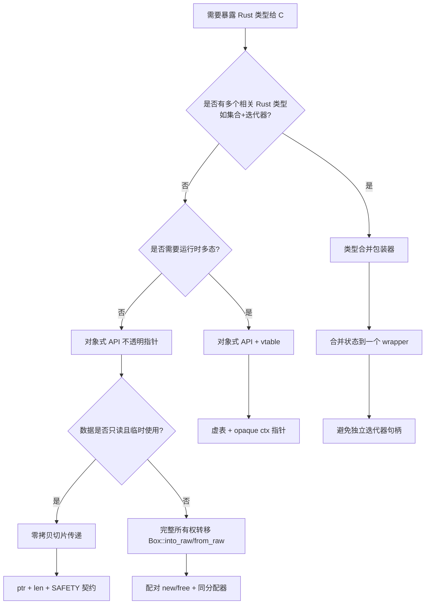

> **内容分级**: [专家级]
>
> **EN**: FFI Patterns in Rust
> **Summary**: Design patterns for safe and ergonomic Rust FFI: object-based opaque APIs, type consolidation wrappers, `Box::into_raw/from_raw` lifecycle, zero-copy slices, cross-boundary error handling, and `Send`/`Sync` annotations.
>
> **Rust 版本**: 1.97.0+ (Edition 2024)
> **受众**: [专家]
> **Bloom 层级**: L4-L6
> **权威来源**: 本文件为 `concept/` 权威页。
> **定位**: 在 [`01_rust_ffi.md`](01_rust_ffi.md) 的基础上，聚焦 Rust FFI 的**可复用设计模式**：如何把 Rust 类型安全地暴露给 C，如何管理跨语言所有权，以及如何在 FFI 边界上保留 Rust 的线程安全保证。
>
> **前置概念**: [Rust FFI](01_rust_ffi.md) · [Unsafe](../02_unsafe/01_unsafe.md) · [Ownership](../../01_foundation/01_ownership_borrow_lifetime/01_ownership.md) · [Traits](../../02_intermediate/00_traits/01_traits.md)
> **后置概念**: [Async FFI Boundary](04_async_ffi_boundary.md) · [Unsafe Extern Blocks](05_unsafe_extern_blocks.md)

---

> **来源**:
> [Rust Design Patterns — FFI](https://rust-unofficial.github.io/patterns/patterns/ffi/intro.html) ·
> [Rust Design Patterns — Object-Based APIs](https://rust-unofficial.github.io/patterns/patterns/ffi/export.html) ·
> [Rust Design Patterns — Type Consolidation into Wrappers](https://rust-unofficial.github.io/patterns/patterns/ffi/wrappers.html) ·
> [Rust Design Patterns — Idiomatic Errors in FFI](https://rust-unofficial.github.io/patterns/idioms/ffi/errors.html) ·
> [Rustonomicon — FFI](https://doc.rust-lang.org/nomicon/ffi.html) ·
> [The Rust FFI Omnibus](https://jakegoulding.com/rust-ffi-omnibus/) ·
> [std::boxed::Box](https://doc.rust-lang.org/std/boxed/struct.Box.html) ·
> [std::slice::from_raw_parts](https://doc.rust-lang.org/std/slice/fn.from_raw_parts.html)

---

## 🧠 知识结构图

```mermaid
mindmap
  root((FFI Patterns))
    对象式不透明 API
      虚表生命周期
      Box::into_raw / from_raw
    类型合并包装器
      隐藏实现细节
      统一 C 可见类型
    零拷贝切片
      &[T] / &str 跨边界
      长度 + 指针契约
    跨边界错误处理
      错误码 + out 参数
      自定义 Result 映射
    Send / Sync 标注
      线程安全承诺
      文档化不变式
```

---

## 📑 目录

- [🧠 知识结构图](#-知识结构图)
- [📑 目录](#-目录)
- [一、设计原则](#一设计原则)
- [二、对象式 API：不透明指针 + 虚表](#二对象式-api不透明指针--虚表)
  - [模式描述](#模式描述)
  - [适用场景](#适用场景)
  - [正例 ✅：不透明对象 + 函数表](#正例-不透明对象--函数表)
  - [虚表（vtable）扩展](#虚表vtable扩展)
- [三、类型合并包装器](#三类型合并包装器)
  - [模式描述](#模式描述-1)
  - [适用场景](#适用场景-1)
  - [正例 ✅](#正例-)
  - [反例 ❌：把 Rust 迭代器作为独立指针暴露](#反例-把-rust-迭代器作为独立指针暴露)
- [四、`Box::into_raw` / `Box::from_raw` 生命周期](#四boxinto_raw--boxfrom_raw-生命周期)
  - [模式描述](#模式描述-2)
  - [正例 ✅](#正例--1)
  - [反例 ❌：返回局部变量引用 / 重复释放](#反例-返回局部变量引用--重复释放)
- [五、零拷贝切片传递](#五零拷贝切片传递)
  - [模式描述](#模式描述-3)
  - [正例 ✅](#正例--2)
  - [反例 ❌：无必要地复制到 `Vec`](#反例-无必要地复制到-vec)
  - [反例 ❌：缺少长度，依赖 NUL 终止](#反例-缺少长度依赖-nul-终止)
- [六、跨 FFI 边界的错误处理](#六跨-ffi-边界的错误处理)
  - [模式描述](#模式描述-4)
  - [正例 ✅：错误码 + 详情字符串](#正例-错误码--详情字符串)
  - [反例 ❌：在 FFI 函数中 panic](#反例-在-ffi-函数中-panic)
- [七、线程安全标注：`Send` / `Sync`](#七线程安全标注send--sync)
  - [模式描述](#模式描述-5)
  - [正例 ✅](#正例--3)
  - [反例 ❌：不标注导致无法跨线程使用](#反例-不标注导致无法跨线程使用)
  - [安全论证模板](#安全论证模板)
- [八、反模式速查](#八反模式速查)
- [九、决策树：选择哪种 FFI 模式](#九决策树选择哪种-ffi-模式)
- [十、权威来源与延伸阅读](#十权威来源与延伸阅读)
- [国际化权威来源补充（International Authority Sources）](#国际化权威来源补充international-authority-sources)

---

## 一、设计原则

Rust FFI 代码的可靠性取决于能否在**语言边界**上维持以下四条不变量：

1. **不透明即安全**：把 Rust 的实现细节隐藏在裸指针后，C 代码只能调用你提供的函数操作它。
2. **所有权在文档中明确**：谁分配、谁释放、指针有效期多长，必须在 C 头文件和 Rust `SAFETY` 注释中写明。
3. **unsafe 块最小化**：把 `unsafe` 限制在薄薄的转换层，对外暴露 safe Rust API。
4. **不要跨越边界 panic**：FFI 函数不应 `panic!()`，否则可能沿 ABI 边界展开栈，造成未定义行为。

---

## 二、对象式 API：不透明指针 + 虚表

对象式 API 是 Rust 向 C 暴露复杂状态机的最常用模式：Rust 类型被压缩成一个不透明指针，C 代码只能通过你提供的构造、操作、销毁函数与之交互。这样可以把生命周期、借用规则和安全不变量保留在 Rust 侧，同时给 C 侧一个类似面向对象句柄的接口。虚表扩展则进一步支持运行时多态和插件回调。

### 模式描述

对象式 API 把 Rust 类型导出为**不透明指针**（opaque pointer），C 代码通过函数指针（类似虚表）或命名函数操作它。该模式把生命周期和不变量集中在 Rust 侧管理，C 侧只负责保管指针。

### 适用场景

- 需要暴露复杂状态机或资源句柄给 C。
- 需要运行时多态（C 没有 trait）。
- 需要清晰的“构造-操作-销毁”生命周期。

### 正例 ✅：不透明对象 + 函数表

```rust,ignore
use std::ffi::{c_char, c_int, c_void, CStr, CString};
use std::ptr;

/// Rust 侧具体实现。对 C 完全不透明。
pub struct MyEngine {
    name: String,
    counter: u64,
}

impl MyEngine {
    fn new(name: &str) -> Self {
        Self { name: name.to_string(), counter: 0 }
    }
    fn process(&mut self, input: &[u8]) -> Vec<u8> {
        self.counter += 1;
        input.iter().map(|b| b.wrapping_add(1)).collect()
    }
    fn name(&self) -> &str { &self.name }
}

/// 暴露给 C 的构造器。
///
/// # Safety
/// `name` 必须是有效的、以 NUL 结尾的 UTF-8 C 字符串。
#[unsafe(no_mangle)]
pub unsafe extern "C" fn myengine_new(name: *const c_char) -> *mut MyEngine {
    if name.is_null() { return ptr::null_mut(); }
    let name = match CStr::from_ptr(name).to_str() {
        Ok(s) => s,
        Err(_) => return ptr::null_mut(),
    };
    let engine = Box::new(MyEngine::new(name));
    Box::into_raw(engine)
}

/// 释放引擎。传入非 `myengine_new` 返回的指针是 UB。
///
/// # Safety
/// `engine` 必须是 `myengine_new` 返回且未被释放过的有效指针，调用后不得再使用。
#[unsafe(no_mangle)]
pub unsafe extern "C" fn myengine_free(engine: *mut MyEngine) {
    if !engine.is_null() {
        drop(Box::from_raw(engine));
    }
}

/// 处理输入数据并返回输出。输出由调用方通过 `myengine_string_free` 释放。
///
/// # Safety
/// `engine` 必须有效；`input`/`input_len` 必须描述一个有效的只读切片。
#[unsafe(no_mangle)]
pub unsafe extern "C" fn myengine_process(
    engine: *mut MyEngine,
    input: *const u8,
    input_len: usize,
) -> *mut c_char {
    if engine.is_null() || input.is_null() { return ptr::null_mut(); }
    let engine = &mut *engine;
    let input = std::slice::from_raw_parts(input, input_len);
    let output = engine.process(input);
    // 为简化示例，把输出当 UTF-8 字符串返回
    let s = String::from_utf8_lossy(&output);
    match CString::new(s.as_bytes()) {
        Ok(c) => c.into_raw(),
        Err(_) => ptr::null_mut(),
    }
}

/// 释放由 `myengine_process` 返回的字符串。
#[unsafe(no_mangle)]
pub unsafe extern "C" fn myengine_string_free(s: *mut c_char) {
    if !s.is_null() {
        drop(CString::from_raw(s));
    }
}
```

> **关键点**：C 侧只看到 `struct MyEngine; typedef struct MyEngine MyEngine;`，无法直接构造或访问字段；所有生命周期由 Rust 函数控制。

### 虚表（vtable）扩展

当 C 侧需要“插件”或“回调对象”时，可让 C 提供一个虚表 + 不透明数据指针：

```rust,ignore
use std::ffi::{c_int, c_void};

#[repr(C)]
pub struct PluginVTable {
    /// 处理数据，返回 0 表示成功，非 0 表示错误码
    process: extern "C" fn(ctx: *mut c_void, data: *const u8, len: usize) -> c_int,
    /// 释放 ctx
    destroy: extern "C" fn(ctx: *mut c_void),
}

/// Rust 侧包装，让 C 提供的插件满足 Rust 的生命周期契约。
pub struct CPlugin {
    ctx: *mut c_void,
    vtable: PluginVTable,
}

impl Drop for CPlugin {
    fn drop(&mut self) {
        (self.vtable.destroy)(self.ctx);
    }
}
```

> 该写法把 C 侧回调的所有权规则显式化：`destroy` 对应 Rust 的 `Drop`，`process` 对应方法调用。

---

## 三、类型合并包装器

Rust 的借用系统常常把「集合」和「迭代器」表达为两个互相关联的类型，但 C 无法表达这种借用关系。类型合并包装器把多个相关 Rust 对象收进单一 opaque 类型，把跨类型的生命周期问题转化为单一对象的生命周期问题，从而避免 C 侧持有悬垂迭代器或越界游标。

### 模式描述

当 Rust 的“相关类型组”（如集合 + 迭代器）需要暴露给 C 时，不要把每个 Rust 类型单独导出为指针，而是把它们**合并进一个包装类型**。这样可以避免跨类型生命周期被 C 代码误用，例如让迭代器存活超过集合。

### 适用场景

- 集合 + 迭代器、连接 + 游标、文件 + 读取缓冲区等成对类型。
- 需要把 Rust 的借用关系转化为 C 可理解的“单一对象生命周期”。

### 正例 ✅

```rust,ignore
use std::ffi::c_int;

pub struct MySet {
    data: Vec<i32>,
}

impl MySet {
    fn new() -> Self { Self { data: (0..100).collect() } }
    fn keys(&self) -> impl Iterator<Item = &i32> { self.data.iter() }
}

/// 合并迭代器状态到集合对象中，避免 C 侧单独持有迭代器。
pub struct MySetWrapper {
    set: MySet,
    iter_next: usize,
}

impl MySetWrapper {
    pub fn new() -> Self {
        Self { set: MySet::new(), iter_next: 0 }
    }

    pub fn first_key(&mut self) -> Option<i32> {
        self.iter_next = 0;
        self.next_key()
    }

    pub fn next_key(&mut self) -> Option<i32> {
        if let Some(&next) = self.set.keys().nth(self.iter_next) {
            self.iter_next += 1;
            Some(next)
        } else {
            None
        }
    }
}

#[unsafe(no_mangle)]
pub extern "C" fn myset_new() -> *mut MySetWrapper {
    Box::into_raw(Box::new(MySetWrapper::new()))
}

#[unsafe(no_mangle)]
pub unsafe extern "C" fn myset_free(s: *mut MySetWrapper) {
    if !s.is_null() { drop(Box::from_raw(s)); }
}

#[unsafe(no_mangle)]
pub unsafe extern "C" fn myset_first_key(s: *mut MySetWrapper) -> c_int {
    match (*s).first_key() {
        Some(k) => k,
        None => -1,
    }
}

#[unsafe(no_mangle)]
pub unsafe extern "C" fn myset_next_key(s: *mut MySetWrapper) -> c_int {
    match (*s).next_key() {
        Some(k) => k,
        None => -1,
    }
}
```

### 反例 ❌：把 Rust 迭代器作为独立指针暴露

```rust,ignore
// 不推荐：把迭代器与集合解耦，C 侧可能让迭代器超过集合生命周期
#[unsafe(no_mangle)]
pub unsafe extern "C" fn myset_iter_new(set: *const MySet) -> *mut MySetIter {
    Box::into_raw(Box::new((*set).keys())) // 借用 set，但 C 侧不知道
}
```

> 该模式会丢失 Rust 的借用信息；一旦 C 侧在 `myset_free(set)` 之后仍使用迭代器，即造成 use-after-free。

---

## 四、`Box::into_raw` / `Box::from_raw` 生命周期

跨语言所有权转移的本质，是把 Rust 堆上值的所有权通过裸指针交给 C，再由 C 在适当时机交还 Rust 释放。`Box::into_raw` 与 `Box::from_raw` 是这一转移的规范桥梁：二者必须成对使用，且释放路径必须在文档中明确。错误地返回局部变量引用、重复释放，或用 C 的 `free` 释放 Rust 分配，都会直接引入 UB。

### 模式描述

`Box::into_raw` 把堆上值转化为裸指针并**转移所有权**给 C；`Box::from_raw` 把裸指针转回 `Box` 以便 Rust 释放。二者必须成对出现，且只能用同一分配器。

### 正例 ✅

```rust
pub struct MyObject {
    value: u32,
}

impl MyObject {
    pub fn new(value: u32) -> Self { Self { value } }
}

/// 转移所有权给 C。C 必须通过 `myobject_free` 释放。
#[unsafe(no_mangle)]
pub extern "C" fn myobject_new(value: u32) -> *mut MyObject {
    Box::into_raw(Box::new(MyObject::new(value)))
}

/// 收回所有权并释放。
///
/// # Safety
/// `obj` 必须是由 `myobject_new` 返回且未被释放过的有效指针。
#[unsafe(no_mangle)]
pub unsafe extern "C" fn myobject_free(obj: *mut MyObject) {
    if !obj.is_null() {
        drop(Box::from_raw(obj));
    }
}
```

### 反例 ❌：返回局部变量引用 / 重复释放

```rust,ignore
// ❌ 错误：返回悬垂指针
#[unsafe(no_mangle)]
pub extern "C" fn bad_object_new() -> *mut MyObject {
    let obj = MyObject::new(42);
    &mut obj as *mut _ // obj 在函数返回时被 drop
}
```

```rust,ignore
// ❌ 错误：用 free() 释放 Rust Box，或使用两次 Box::from_raw
#[unsafe(no_mangle)]
pub unsafe extern "C" fn bad_object_free(obj: *mut MyObject) {
    libc::free(obj as *mut _); // 错误：Rust 与 C 可能使用不同分配器
}
```

> **不变量**：Rust 分配的内存必须由 Rust 释放；C 分配的内存必须由 C 释放。混用分配器是 UB 的常见来源。

---

## 五、零拷贝切片传递

FFI 边界上的数据拷贝常常是性能瓶颈。Rust 的切片 `&[T]` 与字符串切片 `&str` 可以安全地映射为 C 的「指针 + 长度」对，只要调用期间底层内存保持有效且不被修改。掌握这一模式能在不牺牲 Rust 借用安全的前提下，实现跨语言零拷贝数据传输。

### 模式描述

在 FFI 中，Rust 的 `&[T]` 应映射为 C 的“指针 + 长度”对。Rust 侧用 `std::slice::from_raw_parts` 将其还原为借用切片，避免复制数据。

### 正例 ✅

```rust,ignore
use std::ffi::{c_char, c_int};

/// 计算字节切片的校验和。不拥有输入数据，调用期间有效即可。
///
/// # Safety
/// `data`/`len` 必须指向有效且只读的内存；调用期间该内存不得被修改或释放。
#[unsafe(no_mangle)]
pub unsafe extern "C" fn checksum(data: *const u8, len: usize) -> u32 {
    if data.is_null() { return 0; }
    let slice = std::slice::from_raw_parts(data, len);
    slice.iter().fold(0u32, |acc, &b| acc.wrapping_add(b as u32))
}
```

### 反例 ❌：无必要地复制到 `Vec`

```rust,ignore
#[unsafe(no_mangle)]
pub unsafe extern "C" fn checksum_slow(data: *const u8, len: usize) -> u32 {
    let copied: Vec<u8> = std::slice::from_raw_parts(data, len).to_vec(); // O(n) 复制
    copied.iter().fold(0u32, |acc, &b| acc.wrapping_add(b as u32))
}
```

> 除非确实需要持有数据超过函数调用，否则不应复制。

### 反例 ❌：缺少长度，依赖 NUL 终止

```rust,ignore
use std::ffi::{c_char, c_int};

/// 不推荐：把 Rust 切片当作 C 字符串处理，丢失长度信息且限制数据内容
#[unsafe(no_mangle)]
pub unsafe extern "C" fn sum_cstring(data: *const c_char) -> c_int {
    let s = std::ffi::CStr::from_ptr(data); // 若 data 不含 NUL，则越界读取
    s.to_bytes().iter().map(|&b| b as c_int).sum()
}
```

> 二进制数据应始终用 `ptr + len`；仅当语义确实是文本字符串时才用 `CStr`。

---

## 六、跨 FFI 边界的错误处理

C 没有 `Result<T, E>`，因此 Rust 侧必须把丰富的错误语义压缩成 C 可消费的整数返回码、哨兵指针或详情字符串。设计良好的 FFI 错误处理不仅要在失败时给出可诊断信息，更要保证不在 FFI 函数内部 panic——因为 panic 跨越 ABI 边界是未定义行为。本节给出错误码映射与线程局部/对象关联错误详情的典型模式。

### 模式描述

C 没有 `Result<T, E>`，因此通常把错误编码为：

1. **整数返回码**（0 成功，非 0 错误）。
2. **哨兵值**（如 `NULL` 指针）。
3. **线程局部 / 对象关联的错误详情字符串**，供 C 调用方查询。

Rust 侧应把丰富的错误类型映射到 C 友好的表示，但**绝不 panic**。

### 正例 ✅：错误码 + 详情字符串

```rust,ignore
use std::ffi::{c_char, c_int, CStr, CString};
use std::ptr;

#[repr(C)]
#[derive(Clone, Copy)]
pub enum DbError {
    Ok = 0,
    ReadOnly = 1,
    IOError = 2,
    Corrupted = 3,
}

impl DbError {
    fn message(self) -> &'static str {
        match self {
            DbError::Ok => "ok",
            DbError::ReadOnly => "database is read-only",
            DbError::IOError => "I/O error",
            DbError::Corrupted => "database corrupted",
        }
    }
}

/// 线程局部最后错误详情（仅作示意，真实场景可用对象关联存储）。
thread_local! {
    static LAST_ERROR: std::cell::RefCell<CString> =
        std::cell::RefCell::new(CString::new("").unwrap());
}

fn set_last_error(err: DbError) {
    if let Ok(c) = CString::new(err.message()) {
        LAST_ERROR.with(|e| *e.borrow_mut() = c);
    }
}

#[unsafe(no_mangle)]
pub extern "C" fn db_last_error() -> *const c_char {
    LAST_ERROR.with(|e| e.borrow().as_ptr())
}

#[unsafe(no_mangle)]
pub unsafe extern "C" fn db_write(db: *mut MyDb, key: *const c_char) -> c_int {
    if db.is_null() || key.is_null() {
        set_last_error(DbError::IOError);
        return DbError::IOError as c_int;
    }
    // ... 执行写操作 ...
    // 假设失败：
    set_last_error(DbError::ReadOnly);
    DbError::ReadOnly as c_int
}

struct MyDb;
```

### 反例 ❌：在 FFI 函数中 panic

```rust,ignore
#[unsafe(no_mangle)]
pub unsafe extern "C" fn db_write(db: *mut MyDb, key: *const c_char) {
    let db = &mut *db; // 若 db 为 null，直接解引用后 panic
    let key = CStr::from_ptr(key).to_str().unwrap(); // 非 UTF-8 时 panic
    db.write(key).unwrap(); // 错误时 panic
}
```

> **panic across FFI boundary 是未定义行为**。所有失败都必须映射为返回码或错误对象。

---

## 七、线程安全标注：`Send` / `Sync`

FFI 句柄往往包含裸指针或 C 库资源，编译器无法自动判断其是否可跨线程移动或共享。当 C 库文档明确保证线程安全时，可以通过 `unsafe impl Send/Sync` 在类型系统上表达这一承诺，使 `Arc<T>`、`Mutex<T>` 和线程池能够正常工作。该标注必须附带清晰的安全论证，因为一旦 C 侧保证不成立，就会在高并发场景下引入数据竞争。

### 模式描述

当 Rust 类型包含裸指针、句柄或非 `Send`/`Sync` 字段但你在文档中保证其线程安全时，可显式实现 `Send`/`Sync`。这相当于在类型系统上“加盖印章”，让 `Arc<T>` 和 `Mutex<T>` 能正常工作。

### 正例 ✅

```rust
use std::ptr::NonNull;

/// 封装一个 C 库提供的线程安全句柄。
pub struct SafeHandle {
    ptr: NonNull<c_void_stub>,
}

// C 库文档保证该句柄可跨线程移动与共享
unsafe impl Send for SafeHandle {}
unsafe impl Sync for SafeHandle {}

struct c_void_stub;

fn main() {
    use std::sync::Arc;
    let h = Arc::new(SafeHandle { ptr: NonNull::dangling() });
    let h2 = Arc::clone(&h);
    std::thread::spawn(move || {
        let _ = h2;
    });
}
```

### 反例 ❌：不标注导致无法跨线程使用

```rust,compile_fail,E0277
use std::marker::PhantomData;
use std::rc::Rc;

// 模拟一个 FFI 句柄：裸指针本身可 Send，但我们用 PhantomData 标记其底层资源不可跨线程
pub struct SafeHandle {
    ptr: *mut (),
    _not_send: PhantomData<Rc<()>>,
}

fn main() {
    use std::sync::Arc;
    let h = Arc::new(SafeHandle { ptr: std::ptr::null_mut(), _not_send: PhantomData });
    std::thread::spawn(move || { let _h = h; });
}
```

> 错误：`NonNull<T>` 默认不实现 `Send`/`Sync`（因可能是裸指针），因此 `SafeHandle` 也不能跨线程。需要 `unsafe impl Send/Sync` 并附上安全论证。

### 安全论证模板

```text
unsafe impl Send for SafeHandle 的理由：
- SafeHandle 内部指针由 C 库的线程安全分配器分配；
- C 库文档明确该句柄可在不同线程间移动；
- SafeHandle 不提供 &mut self 的同时把裸指针暴露给外部的 API。

unsafe impl Sync for SafeHandle 的理由：
- C 库所有以该句柄为参数的函数都是线程安全的；
- SafeHandle 自身没有内部可变性，外部通过 &SafeHandle 调用时由 Mutex/RwLock 保护。
```

---

## 八、反模式速查

| 反模式 | 问题 | 正确做法 |
|:---|:---|:---|
| 返回 `&mut T` 或 `Box::leak` 后不给出释放函数 | 内存泄漏或悬垂指针 | `Box::into_raw` + 成对 `Box::from_raw` |
| 在 FFI 函数中 `panic!` | UB | 返回错误码 / 哨兵值 |
| 把 Rust 迭代器单独暴露给 C | 生命周期失控 | 类型合并包装器 |
| 让 C 用 `free()` 释放 Rust 分配的内存 | 分配器不匹配 UB | Rust 侧提供 free 函数 |
| 接受 `*const c_char` 表示二进制数据 | 丢失长度、受 NUL 限制 | `*const u8` + `usize` |
| 不标注 `Send`/`Sync` 但文档说线程安全 | 调用方无法通过类型检查 | `unsafe impl Send/Sync` + 论证 |

---

## 九、决策树：选择哪种 FFI 模式



---

## 十、权威来源与延伸阅读

- **P1 生态**: [Rust Design Patterns — FFI](https://rust-unofficial.github.io/patterns/patterns/ffi/intro.html)
- **P1 生态**: [Rust Design Patterns — Object-Based APIs](https://rust-unofficial.github.io/patterns/patterns/ffi/export.html)
- **P1 生态**: [Rust Design Patterns — Type Consolidation into Wrappers](https://rust-unofficial.github.io/patterns/patterns/ffi/wrappers.html)
- **P1 生态**: [Rust Design Patterns — Idiomatic Errors in FFI](https://rust-unofficial.github.io/patterns/idioms/ffi/errors.html)
- **P0 官方**: [Rustonomicon — FFI](https://doc.rust-lang.org/nomicon/ffi.html)
- **P1 生态**: [The Rust FFI Omnibus](https://jakegoulding.com/rust-ffi-omnibus/)
- **P0 官方**: [Rust Reference — External Blocks](https://doc.rust-lang.org/reference/items/external-blocks.html)

---

> **权威来源**: [Rust Design Patterns — FFI](https://rust-unofficial.github.io/patterns/patterns/ffi/intro.html)
> **状态**: ✅ 概念文件创建完成
> **最后更新**: 2026-07-31

## 国际化权威来源补充（International Authority Sources）

- <https://dl.acm.org/doi/10.1145/3158154>
- <https://doc.rust-lang.org/reference/introduction.html>
