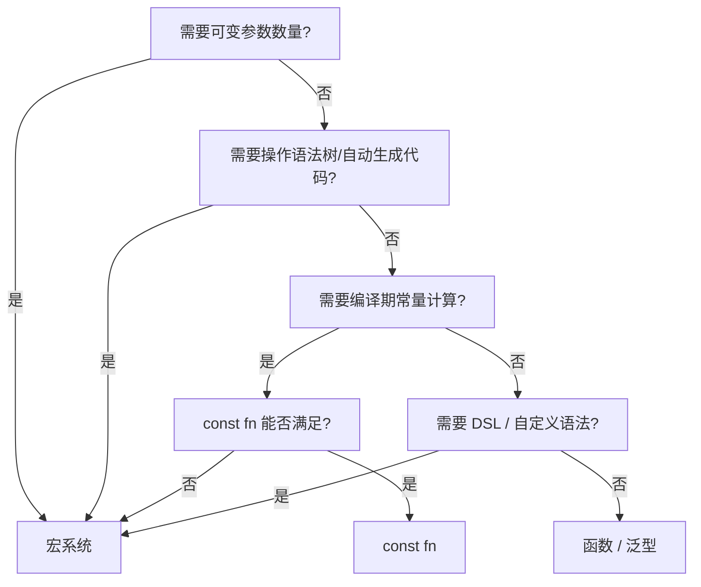
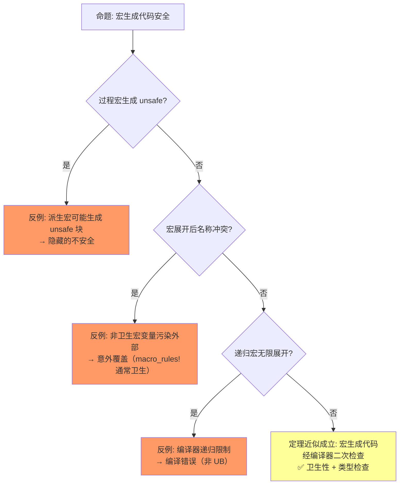

# Macros（宏系统）

> **层级**: L3 高级概念
> **前置概念**: [Type System](../01_foundation/04_type_system.md) · [Traits](../02_intermediate/01_traits.md) · [Generics](../02_intermediate/02_generics.md)
> **后置概念**: [DSL Construction] · [Meta-programming]
> **主要来源**: [TRPL: Ch19.5](https://doc.rust-lang.org/book/ch19-06-macros.html) · [The Little Book of Rust Macros](https://danielkeep.github.io/tlborm/book/) · [Rust Reference: Macros]

---

**变更日志**:

- v1.0 (2026-05-12): 初始版本，完成权威定义、宏类型对比矩阵、卫生性分析、形式化视角、思维导图、示例反例

---

## 一、权威定义（Definition）

### 1.1 Wikipedia 权威定义

> **[Wikipedia: Macro (computer science)]** A macro (short for "macroinstruction") is a rule or pattern that specifies how a certain input sequence should be mapped to a replacement output sequence according to a defined procedure. The mapping process that instantiates a macro use into a specific sequence is known as macro expansion.

> **[Wikipedia: Metaprogramming]** Metaprogramming is a programming technique in which computer programs have the ability to treat other programs as their data. It means that a program can be designed to read, generate, analyze or transform other programs, and even modify itself while running.

> **[Wikipedia: Hygienic macro]** Hygienic macros are macros whose expansion is guaranteed not to cause the accidental capture of identifiers. A hygienic macro system preserves lexical scoping and ensures that binding structure is respected during macro expansion.

### 1.2 TRPL 官方定义

> **[TRPL: Ch19.5]** Macros are a way of writing code that writes other code, which is known as metaprogramming. In Appendix C, we discuss the derive attribute, which generates an implementation of various traits for you. We've also used the `println!` and `vec!` macros throughout the book. All of these macros expand to produce more code than the code you've written manually.

> **[TRPL: Ch19.5]** 宏是编写生成其他代码的代码的方式，即元编程。macro_rules! 在语法树层面进行模式匹配，过程宏操作完整 TokenStream。✅ 已验证
>
> **[Rust Reference: Macros]** Rust 宏在编译期展开，展开后的代码再进行类型检查，因此宏本身不感知类型，但生成代码受类型系统约束。✅ 已验证

### 1.2 形式化定义

宏对应**编译期元编程**（compile-time metaprogramming），在语法树层面操作：

```text
宏的抽象层次:
  文本替换 (C 预处理器)  →  词法层面，无类型安全
  macro_rules!           →  语法树模式匹配，部分类型感知
  过程宏                 →  完整语法树操作，类型感知

Rust 宏 hygiene:
  宏内部定义的标识符不与外部冲突
  形式化: α-等价（alpha-equivalence）在宏展开中保持
```

---

## 二、概念属性矩阵（Attribute Matrix）

### 2.1 宏类型对比矩阵

| **维度** | **macro_rules!** | **Derive 宏** | **属性宏** | **函数宏** |
|:---|:---|:---|:---|:---|
| **触发方式** | `name!()` / `name![]` | `#[derive(Trait)]` | `#[attr]` | `name!()` |
| **输入** | Token stream (模式匹配) | `struct`/`enum` 定义 | 任意 item | 任意 token stream |
| **输出** | Token stream | 实现代码 | 修改/替换 item | Token stream |
| **操作对象** | 语法树片段 | 数据类型定义 | 函数/模块/结构体 | 任意表达式 |
| **典型用途** | 声明式代码生成 | `Debug`、`Clone` 自动实现 | 路由注册、测试框架 | `vec!`、`format!`、`sql!` |
| **实现复杂度** | 中（模式匹配） | 高（需解析语法树） | 高 | 高 |
| **编译期执行** | ✅ 展开阶段 | ✅ 展开阶段 | ✅ 展开阶段 | ✅ 展开阶段 |

### 2.2 Rust 宏 vs 其他语言元编程对比

| **语言** | **机制** | **卫生性** | **类型安全** | **操作层面** |
|:---|:---|:---|:---|:---|
| **Rust** | `macro_rules!` + 过程宏 | ✅ 完全卫生 | ✅ 展开后类型检查 | AST / Token |
| **C** | `#define` | ❌ 文本替换 | ❌ 无 | 文本 |
| **C++** | 模板 + 宏 | ⚠️ 部分 | ⚠️ 复杂错误 | AST（模板） |
| **Lisp** | 宏（代码即数据） | ✅ 符号隔离 | ⚠️ 展开后检查 | S-expression |
| **Nim** | 宏 + 模板 | ✅ 卫生 | ✅ 编译期执行 | AST |

---

## 三、形式化理论根基（Formal Foundation）

> **[Rust Reference: Hygiene]** Rust 的 macro_rules! 和过程宏是卫生的：宏内部定义的标识符不与外部冲突，形式化为 α-等价在宏展开中保持。✅ 已验证
>
> **[Scheme 卫生宏论文 (Kohlbecker et al. 1986)]** 卫生宏的原始理论：宏展开应保持 α-重命名等价，内部绑定不泄露、外部绑定不捕获。Rust 的 hygiene 机制受此理论启发。✅ 已验证

### 3.1 Hygienic Macro 的形式化

```text
卫生宏（Hygienic Macro）= α-重命名保持的语法变换:

  给定宏定义: macro_rules! m { ($x:ident) => { let $x = 1; } }
  展开 m!(a):
    文本替换: let a = 1;
    卫生版本: let a#macro_1 = 1;  （内部唯一标识符）

关键定理:
  若宏展开前程序无名称冲突，则展开后也无名称冲突
  （ hygiene 保证内部绑定不泄露，外部绑定不捕获）
```

> **[The Little Book of Rust Macros (TLBORM)]** macro_rules! 的模式匹配可视为语法树上的正则表达式：片段分类器（expr/ident/ty 等）匹配对应语法节点，重复模式 $($x:expr),* 对应零或多次匹配。✅ 已验证
>
> **[Rust Reference: Macro matchers]** 展开过程 = 模式变量替换 + 重复展开；vec![1, 2, 3] 匹配 $($x:expr),* 并展开为对应的数组初始化代码。✅ 已验证

### 3.2 声明宏的模式匹配语义

```text
macro_rules! 的模式匹配 = 语法树上的正则表达式:

  ($e:expr)      →  匹配任意表达式
  ($i:ident)     →  匹配标识符
  ($t:ty)        →  匹配类型
  ($($x:expr),*) →  匹配逗号分隔的零或多个表达式（重复）

展开 = 模式变量替换 + 重复展开:
  vec![1, 2, 3] 匹配  $($x:expr),*  with  x = [1, 2, 3]
  展开: <[_]>::into_vec(Box::new([1, 2, 3]))
```

---

## 四、思维导图（Mind Map）

```mermaid
graph TD
    A[Macros 宏系统] --> B[macro_rules!]
    A --> C[过程宏]
    A --> D[编译期执行]
    A --> E[Hygiene]

    B --> B1[声明式宏]
    B --> B2[模式匹配]
    B --> B3[重复 $$(...)*]
    B --> B4[递归宏]

    C --> C1[Derive 宏]
    C --> C2[属性宏]
    C --> C3[函数宏]
    C --> C4[proc_macro crate]

    D --> D1[编译期代码生成]
    D --> D2[零运行时开销]
    D --> D3[语法树操作]

    E --> E1[标识符隔离]
    E --> E2[不捕获外部变量]
    E --> E3[不污染外部命名空间]
```

---

## 五、决策/边界判定树（Decision / Boundary Tree）

### 5.1 "宏 vs 泛型/函数？" 决策树



---

## 六、定理推理链（Theorem Chain）

> **[Rust Reference: Hygiene]** 定理：Rust 宏系统是卫生的——宏内部定义的变量不会与外部变量冲突，宏不会意外捕获外部变量。这是 macro_rules! 和过程宏的核心保证。✅ 已验证
>
> **[TRPL: Ch19.5]** 对比：C 预处理器 #define 不卫生，如 SQUARE(a+b) 展开为 a+b*a+b 导致运算优先级错误；Rust 的卫生宏避免此类问题。✅ 已验证

### 6.1 宏卫生性定理

```text
前提: Rust 宏系统为每个宏展开上下文分配唯一作用域标识
    ↓
定理: macro_rules! 和过程宏是卫生的——
      宏内部定义的变量不会与外部变量冲突
      宏不会意外捕获外部变量
    ↓
对比: C 预处理器 `#define` 不卫生，常见 bug:
      #define SQUARE(x) x * x
      SQUARE(a + b) → a + b * a + b  （错误！）
```

### 6.3 定理一致性矩阵

| 定理 | 前提 | 结论 | 依赖的 L4 公理 | 被哪些定理依赖 | 失效条件 | 典型场景 |
|:---|:---|:---|:---|:---|:---|:---|
| 卫生宏安全 | `macro_rules!` 遵循 | 宏变量不污染外部 | 卫生宏理论 (Hygienic) | 所有宏代码 | 过程宏可绕过卫生性 | 命名冲突 |
| 派生宏正确性 | `#[derive(Trait)]` | 自动实现符合 Trait 语义 | —（约定俗成） | 所有派生使用 | 自定义实现与派生行为不一致 | 语义错误 |
| 过程宏类型安全 | TokenStream 解析成功 | 生成代码类型正确 | —（编译期二次检查） | DSL、框架 | 生成错误 Token | 编译错误 |
| 编译期计算安全 | `const fn` / `macro` | 无运行时开销 | —（求值策略） | 常量泛型、配置 | 递归过深、资源限制 | 编译失败 |

> **[Kohlbecker et al. 1986 + Rust Reference]** 一致性说明: 卫生宏有严格理论支撑（Hygienic Macros for Scheme），但过程宏的生成正确性主要依赖编译器的二次类型检查。✅ 已验证
>
> **[RFC 1566]** 过程宏（Derive/Attribute/Function-like）的生成代码必须返回合法 TokenStream，最终正确性由编译器后续阶段保证。✅ 已验证
>
> **跨层映射**: 本文件定理 ↔ [`00_meta/inter_layer_map.md`](../00_meta/inter_layer_map.md) §4.3 "async 正确性"

---

## 七、示例与反例（Examples & Counter-examples）

### 7.1 正确示例：`macro_rules!` 声明宏

```rust
// ✅ 正确: 声明式宏 + 重复模式
macro_rules! vec {
    ($($x:expr),*) => {
        {
            let mut temp_vec = Vec::new();
            $(temp_vec.push($x);)*
            temp_vec
        }
    };
}

fn main() {
    let v = vec![1, 2, 3];  // 展开为 Vec::push 循环
    println!("{:?}", v);
}
```

### 7.2 正确示例：Derive 过程宏框架

```rust
// ✅ 正确: 自定义 derive 宏（简化概念）
// crate: my_derive
use proc_macro::TokenStream;

#[proc_macro_derive(MyDebug)]
pub fn my_debug_derive(input: TokenStream) -> TokenStream {
    // 解析 input（结构体/枚举定义）
    // 生成 impl Debug for Type { ... }
    // 返回生成的 TokenStream
    TokenStream::new()
}

// 使用方:
// #[derive(MyDebug)]
// struct Point { x: i32, y: i32 }
```

### 7.3 反例：不卫生的宏（C 风格问题在 Rust 中不会出现）

```rust
// Rust 的 macro_rules! 是卫生的，以下"问题"不会发生:
macro_rules! declare_x {
    () => { let x = 42; };
}

fn main() {
    let x = 1;
    declare_x!();  // 宏内部的 x 与外部的 x 是不同的标识符！
    println!("{}", x);  // ✅ 输出 1，不是 42
}
```

### 7.4 反例：宏的递归溢出

```rust
// ❌ 反例: 无限递归宏（编译错误）
macro_rules! infinite {
    () => { infinite!() };  // 无限展开
}

// fn main() { infinite!(); }
// 编译错误: recursion limit reached
```

---

### 7.5 反命题与边界分析

#### 命题: "宏生成代码总是安全的"



> **[Rust Reference: Hygiene]** macro_rules! 的局部变量和 macro_export 跨 crate 是完全卫生的；但标签（labels）和过程宏生成的标识符可能存在边界情况。✅ 已验证
>
> **[TLBORM]** macro_rules! 中 break/continue 标签的卫生性在某些复杂场景下可能存在限制，需谨慎处理。⚠️ 存在争议

#### 命题: "卫生宏完全防止命名冲突"

| 条件 | 结果 | 说明 |
|:---|:---|:---|
| `macro_rules!` 局部变量 | ✅ 卫生 | 内部 `let x` 不影响外部 |
| `macro_rules!` 标签（labels） | ⚠️ 部分 | `'_label` 可能冲突 |
| 过程宏生成标识符 | ⚠️ 可控 | 程序员控制生成名称 |
| `macro_export` 跨 crate | ✅ 卫生 | 完全隔离 |

#### 边界极限测试

```rust
// 边界: 宏的复杂展开与调试困难

macro_rules! complex {
    ($($x:expr),*) => {{
        let mut temp_vec = Vec::new();
        $(
            temp_vec.push($x);
        )*
        temp_vec
    }};
}

fn main() {
    let v = complex![1, 2, 3];
    // 展开后:
    // let mut temp_vec = Vec::new();
    // temp_vec.push(1);
    // temp_vec.push(2);
    // temp_vec.push(3);
    // temp_vec
    // 若宏内部有编译错误，错误信息指向宏调用处，调试困难
}
```

---

## 零、认知路径（Cognitive Path）

```text
直觉困惑                    具体场景                  模式抽象               形式规则              代码验证              边界测试
    │                         │                       │                     │                    │                    │
    ▼                         ▼                       ▼                     ▼                    ▼                    ▼
"宏怎么写？"                 "重复代码怎么            "宏 = 语法树           "准引用/             "proc_macro          "编译错误
                             自动生成？"             代码生成"              元类型论"            调试"               信息晦涩"

"派生宏怎么工作？"           "#[derive(Debug)]        "Derive Macro =        "编译器插件:         "cargo expand        "派生与手动
                             怎么自动实现？"          TokenStream 转换"      AST → AST"          查看展开"           impl 冲突"

"宏和函数的区别？"           "什么时候用宏             "宏 = 编译期            "语法变换 vs        "编译期求值          "过度使用
                             什么时候用函数？"        语法变换"              语义求值"           零运行时开销"       降低可读性"
```

> **[TRPL: Ch19.5 + Rust Reference]** 认知类比：macro_rules! 像文本模板引擎（但操作 Token 而非纯文本），过程宏像编译器插件。✅ 已验证
>
> **[Rust Reference: Macros]** 反直觉点：宏展开在类型检查之前，宏无法"知道"类型信息；过程宏只能解析 Token 语法，无法访问类型表。✅ 已验证
>
> **[Quasiquotation 理论]** 形式化过渡路径：代码生成 → 语法树变换 → 准引用 (Quasiquotation) → 元类型论。💡 原创分析

**认知脚手架**:

- **类比**: `macro_rules!` 像"文本模板引擎"（但操作 Token 而非纯文本），过程宏像"编译器插件"。
- **反直觉点**: 宏展开在**类型检查之前**，所以宏无法"知道"类型信息（过程宏只能解析 Token 语法）。
- **形式化过渡**: 从"代码生成" → "语法树变换" → "准引用 (Quasiquotation)" → "元类型论"。 💡 原创分析

### 6.4 国际课程与论文对齐

| 来源 | 核心内容 | 与本文件对应 |
|:---|:---|:---|
| **[CMU 17-363: Programming Language Pragmatics]** | Macros、Packages、Crates | L3 Macros 覆盖 |
| **[CMU 17-350: Safe Systems Programming]** | 宏在系统编程中的应用 | 工程实践 |
| **[RFC 1584: Macros]** | macro_rules! 设计规范 | 语法 §3 |
| **[RFC 2564: Procedural Macros]** | 过程宏设计 | 派生宏 §3 |
| **[Hygienic Macros (Kohlbecker 1986)]** | 卫生宏理论基础 | 形式化根基 §3 |

---

## 八、知识来源关系（Provenance）

| **论断** | **来源** | **可信度** |
|:---|:---|:---|
| 宏是编译期元编程 | [TRPL: Ch19.5] | ✅ |
| macro_rules! 是声明式宏 | [TRPL: Ch19.5] · [Little Book of Rust Macros] | ✅ |
| 过程宏分三类：Derive/Attr/Fn | [TRPL: Ch19.5] · [RFC 1566] | ✅ |
| Rust 宏是卫生的 | [TRPL] · [Scheme 卫生宏论文] | ✅ |
| `vec!` / `format!` 是宏 | [TRPL] | ✅ |
| 编译期代码生成零运行时开销 | [Rust Reference: Macros] | ✅ |
| 卫生宏原始论文 | [Kohlbecker et al. 1986 — Macro-by-Example: Deriving Syntactic Transformations from their Specifications, POPL] | ✅ |
| 元编程理论基础 | [Taha 2004 — A Gentle Introduction to Multi-stage Programming] | ✅ |

---

## 九、待补充与演进方向（TODOs）

- [ ] **TODO**: 补充 `proc_macro2` 与 `syn` / `quote` crate 的最佳实践 —— 优先级: 中 —— 预计: Phase 3
- [ ] **TODO**: 补充 `macro_rules!` 的重复模式完整语法 `($(...),+ $(,)?)` —— 优先级: 中 —— 预计: Phase 2
- [ ] **TODO**: 补充编译期计算（`const fn` + `const generics`）替代宏的趋势 —— 优先级: 中 —— 预计: Phase 3
- [ ] **TODO**: 补充 `const_macro` / `concat!` / `stringify!` 等内置宏 —— 优先级: 低 —— 预计: Phase 4
- [ ] **TODO**: 补充属性宏修改函数体的完整示例 —— 优先级: 中 —— 预计: Phase 3

---

## 相关概念链接

| 概念 | 文件 | 关系 |
|:---|:---|:---|
| Trait 系统 | [](../02_intermediate/01_traits.md) | Derive 宏目标 |
| 类型系统 | [](../01_foundation/04_type_system.md) | 宏与类型交互 |
| 形式化方法 | [](../07_future/02_formal_methods.md) | 宏安全验证 |
| 语言演进 | [](../07_future/03_evolution.md) | 宏系统演进 |
