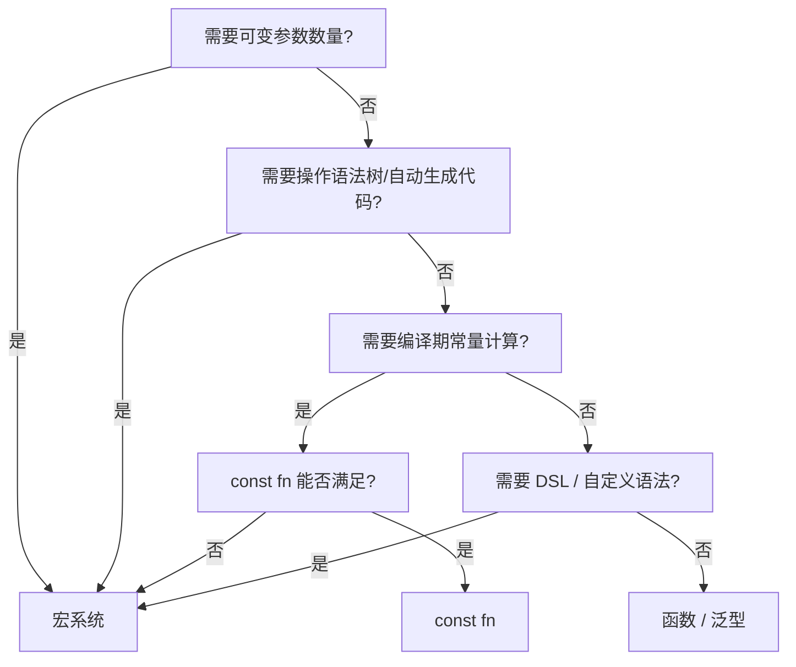

# Macros（宏系统）

> **层级**: L3 高级概念
> **前置概念**: [Type System](../01_foundation/04_type_system.md) · [Traits](../02_intermediate/01_traits.md) · [Generics](../02_intermediate/02_generics.md)
> **后置概念**: [DSL Construction] · [Meta-programming]
> **主要来源**: [TRPL: Ch19.5](https://doc.rust-lang.org/book/ch19-06-macros.html) · [The Little Book of Rust Macros](https://danielkeep.github.io/tlborm/book/) · [Rust Reference: Macros]

---

**变更日志**:

- v1.0 (2026-05-12): 初始版本，完成权威定义、宏类型对比矩阵、卫生性分析、形式化视角、思维导图、示例反例

---

## 一、权威定义（Definition）

### 1.1 TRPL 官方定义

> **[TRPL: Ch19.5]** Macros are a way of writing code that writes other code, which is known as metaprogramming. In Appendix C, we discuss the derive attribute, which generates an implementation of various traits for you. We've also used the `println!` and `vec!` macros throughout the book. All of these macros expand to produce more code than the code you've written manually.

### 1.2 形式化定义

宏对应**编译期元编程**（compile-time metaprogramming），在语法树层面操作：

```text
宏的抽象层次:
  文本替换 (C 预处理器)  →  词法层面，无类型安全
  macro_rules!           →  语法树模式匹配，部分类型感知
  过程宏                 →  完整语法树操作，类型感知

Rust 宏 hygiene:
  宏内部定义的标识符不与外部冲突
  形式化: α-等价（alpha-equivalence）在宏展开中保持
```

---

## 二、概念属性矩阵（Attribute Matrix）

### 2.1 宏类型对比矩阵

| **维度** | **macro_rules!** | **Derive 宏** | **属性宏** | **函数宏** |
|:---|:---|:---|:---|:---|
| **触发方式** | `name!()` / `name![]` | `#[derive(Trait)]` | `#[attr]` | `name!()` |
| **输入** | Token stream (模式匹配) | `struct`/`enum` 定义 | 任意 item | 任意 token stream |
| **输出** | Token stream | 实现代码 | 修改/替换 item | Token stream |
| **操作对象** | 语法树片段 | 数据类型定义 | 函数/模块/结构体 | 任意表达式 |
| **典型用途** | 声明式代码生成 | `Debug`、`Clone` 自动实现 | 路由注册、测试框架 | `vec!`、`format!`、`sql!` |
| **实现复杂度** | 中（模式匹配） | 高（需解析语法树） | 高 | 高 |
| **编译期执行** | ✅ 展开阶段 | ✅ 展开阶段 | ✅ 展开阶段 | ✅ 展开阶段 |

### 2.2 Rust 宏 vs 其他语言元编程对比

| **语言** | **机制** | **卫生性** | **类型安全** | **操作层面** |
|:---|:---|:---|:---|:---|
| **Rust** | `macro_rules!` + 过程宏 | ✅ 完全卫生 | ✅ 展开后类型检查 | AST / Token |
| **C** | `#define` | ❌ 文本替换 | ❌ 无 | 文本 |
| **C++** | 模板 + 宏 | ⚠️ 部分 | ⚠️ 复杂错误 | AST（模板） |
| **Lisp** | 宏（代码即数据） | ✅ 符号隔离 | ⚠️ 展开后检查 | S-expression |
| **Nim** | 宏 + 模板 | ✅ 卫生 | ✅ 编译期执行 | AST |

---

## 三、形式化理论根基（Formal Foundation）

### 3.1 Hygienic Macro 的形式化

```text
卫生宏（Hygienic Macro）= α-重命名保持的语法变换:

  给定宏定义: macro_rules! m { ($x:ident) => { let $x = 1; } }
  展开 m!(a):
    文本替换: let a = 1;
    卫生版本: let a#macro_1 = 1;  （内部唯一标识符）

关键定理:
  若宏展开前程序无名称冲突，则展开后也无名称冲突
  （ hygiene 保证内部绑定不泄露，外部绑定不捕获）
```

### 3.2 声明宏的模式匹配语义

```text
macro_rules! 的模式匹配 = 语法树上的正则表达式:

  ($e:expr)      →  匹配任意表达式
  ($i:ident)     →  匹配标识符
  ($t:ty)        →  匹配类型
  ($($x:expr),*) →  匹配逗号分隔的零或多个表达式（重复）

展开 = 模式变量替换 + 重复展开:
  vec![1, 2, 3] 匹配  $($x:expr),*  with  x = [1, 2, 3]
  展开: <[_]>::into_vec(Box::new([1, 2, 3]))
```

---

## 四、思维导图（Mind Map）

```mermaid
graph TD
    A[Macros 宏系统] --> B[macro_rules!]
    A --> C[过程宏]
    A --> D[编译期执行]
    A --> E[Hygiene]

    B --> B1[声明式宏]
    B --> B2[模式匹配]
    B --> B3[重复 $$(...)*]
    B --> B4[递归宏]

    C --> C1[Derive 宏]
    C --> C2[属性宏]
    C --> C3[函数宏]
    C --> C4[proc_macro crate]

    D --> D1[编译期代码生成]
    D --> D2[零运行时开销]
    D --> D3[语法树操作]

    E --> E1[标识符隔离]
    E --> E2[不捕获外部变量]
    E --> E3[不污染外部命名空间]
```

---

## 五、决策/边界判定树（Decision / Boundary Tree）

### 5.1 "宏 vs 泛型/函数？" 决策树



---

## 六、定理推理链（Theorem Chain）

### 6.1 宏卫生性定理

```text
前提: Rust 宏系统为每个宏展开上下文分配唯一作用域标识
    ↓
定理: macro_rules! 和过程宏是卫生的——
      宏内部定义的变量不会与外部变量冲突
      宏不会意外捕获外部变量
    ↓
对比: C 预处理器 `#define` 不卫生，常见 bug:
      #define SQUARE(x) x * x
      SQUARE(a + b) → a + b * a + b  （错误！）
```

---

## 七、示例与反例（Examples & Counter-examples）

### 7.1 正确示例：`macro_rules!` 声明宏

```rust
// ✅ 正确: 声明式宏 + 重复模式
macro_rules! vec {
    ($($x:expr),*) => {
        {
            let mut temp_vec = Vec::new();
            $(temp_vec.push($x);)*
            temp_vec
        }
    };
}

fn main() {
    let v = vec![1, 2, 3];  // 展开为 Vec::push 循环
    println!("{:?}", v);
}
```

### 7.2 正确示例：Derive 过程宏框架

```rust
// ✅ 正确: 自定义 derive 宏（简化概念）
// crate: my_derive
use proc_macro::TokenStream;

#[proc_macro_derive(MyDebug)]
pub fn my_debug_derive(input: TokenStream) -> TokenStream {
    // 解析 input（结构体/枚举定义）
    // 生成 impl Debug for Type { ... }
    // 返回生成的 TokenStream
    TokenStream::new()
}

// 使用方:
// #[derive(MyDebug)]
// struct Point { x: i32, y: i32 }
```

### 7.3 反例：不卫生的宏（C 风格问题在 Rust 中不会出现）

```rust
// Rust 的 macro_rules! 是卫生的，以下"问题"不会发生:
macro_rules! declare_x {
    () => { let x = 42; };
}

fn main() {
    let x = 1;
    declare_x!();  // 宏内部的 x 与外部的 x 是不同的标识符！
    println!("{}", x);  // ✅ 输出 1，不是 42
}
```

### 7.4 反例：宏的递归溢出

```rust
// ❌ 反例: 无限递归宏（编译错误）
macro_rules! infinite {
    () => { infinite!() };  // 无限展开
}

// fn main() { infinite!(); }
// 编译错误: recursion limit reached
```

---

## 八、知识来源关系（Provenance）

| **论断** | **来源** | **可信度** |
|:---|:---|:---|
| 宏是编译期元编程 | [TRPL: Ch19.5] | ✅ |
| macro_rules! 是声明式宏 | [TRPL: Ch19.5] · [Little Book of Rust Macros] | ✅ |
| 过程宏分三类：Derive/Attr/Fn | [TRPL: Ch19.5] · [RFC 1566] | ✅ |
| Rust 宏是卫生的 | [TRPL] · [Scheme 卫生宏论文] | ✅ |
| `vec!` / `format!` 是宏 | [TRPL] | ✅ |
| 编译期代码生成零运行时开销 | [Rust Reference: Macros] | ✅ |

---

## 九、待补充与演进方向（TODOs）

- [ ] **TODO**: 补充 `proc_macro2` 与 `syn` / `quote` crate 的最佳实践 —— 优先级: 中 —— 预计: Phase 3
- [ ] **TODO**: 补充 `macro_rules!` 的重复模式完整语法 `($(...),+ $(,)?)` —— 优先级: 中 —— 预计: Phase 2
- [ ] **TODO**: 补充编译期计算（`const fn` + `const generics`）替代宏的趋势 —— 优先级: 中 —— 预计: Phase 3
- [ ] **TODO**: 补充 `const_macro` / `concat!` / `stringify!` 等内置宏 —— 优先级: 低 —— 预计: Phase 4
- [ ] **TODO**: 补充属性宏修改函数体的完整示例 —— 优先级: 中 —— 预计: Phase 3
