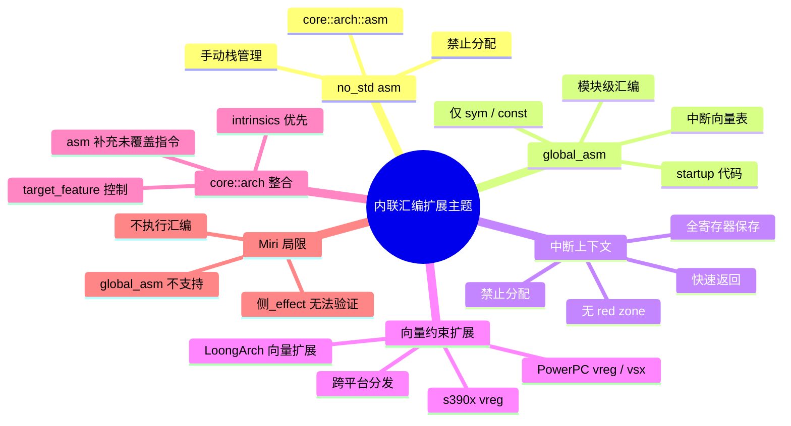
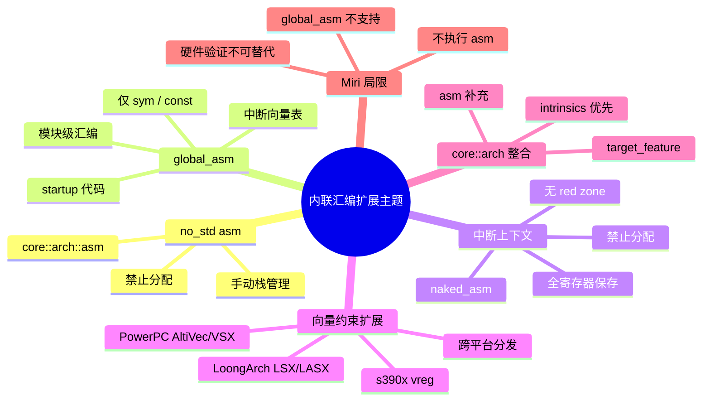

> **内容分级**: [专家级]
>
> **Rust 版本**: 1.97.0+ (Edition 2024)
> **本节关键术语**: inline assembly · no_std · global_asm · interrupt handler · vector constraints · PowerPC · LoongArch · core::arch · Miri

# 内联汇编扩展主题：`no_std`、内核与跨平台向量约束

> **EN**: Inline Assembly Extended Topics: `no_std`, Kernel Code and Cross-Platform Vector Constraints
> **Summary**: Advanced / `no_std` / kernel-oriented `asm!` use: `asm!` in `no_std`, `global_asm!` for startup code, calling from interrupt handlers, vector constraints beyond s390x, PowerPC / LoongArch notes, integration with `core::arch`, and Miri limitations for assembly.
> **受众**: [专家]
> **Bloom 层级**: L3-L5
> **权威来源**: 本文件为 `concept/` 权威页。
> **A/S/P 标记**: **P** — Process / Platform
> **双维定位**: P×Ana — 分析内联汇编在裸机/内核/非主流架构上的特殊约束
> **定位**: 在 [内联汇编基础](01_inline_assembly.md) 之上，聚焦 `no_std`、裸机启动、中断上下文、PowerPC/LoongArch 等扩展架构，以及 `core::arch` 与 Miri 验证边界，形成面向系统级开发的内联汇编决策框架。
> **前置概念**:
> [内联汇编 (Inline Assembly)](01_inline_assembly.md) ·
> [Unsafe Rust](../02_unsafe/01_unsafe.md) ·
> [内存管理](../../02_intermediate/02_memory_management/01_memory_management.md) ·
> [Rust for Linux](../../07_future/04_research_and_experimental/04_rust_for_linux.md) ·
> [Cross Compilation](../../06_ecosystem/05_systems_and_embedded/02_cross_compilation.md)
> **后置概念**:
> [Custom Allocators](../06_low_level_patterns/01_custom_allocators.md) ·
> [Rust Runtime](../06_low_level_patterns/07_rust_runtime.md) ·
> [FFI 深度解析](../04_ffi/06_ffi_deep_dive.md)

---

> **权威来源 / Provenance**:
> [Rust Reference — Inline Assembly](https://doc.rust-lang.org/reference/inline-assembly.html) ·
> [Rust Reference — Global Assembly](https://doc.rust-lang.org/reference/inline-assembly.html#global_asm) ·
> [RFC 2873 — Inline Assembly](https://rust-lang.github.io/rfcs/2873-inline-asm.html) ·
> [Linux Kernel Rust](https://docs.kernel.org/rust/index.html) ·
> [core::arch](https://doc.rust-lang.org/core/arch/index.html) ·
> [Miri](https://github.com/rust-lang/miri) ·
> [PowerPC ELF ABI](https://openpowerfoundation.org/specifications/abi/) ·
> [LoongArch ELF ABI](https://loongson.github.io/LoongArch-Documentation/LoongArch-ELF-ABI-EN.html) ·
> Sarkar, S. et al. “The Semantics of x86-CC Multiprocessor Machine Code.” *POPL 2009*. [https://dl.acm.org/doi/10.1145/1480881.1480929](https://dl.acm.org/doi/10.1145/1480881.1480929) ·
> Alglave, J. et al. “The Semantics of Power and ARM Multiprocessor Machine Code.” *DAMP 2009*. [https://dl.acm.org/doi/10.1145/1481839.1481842](https://dl.acm.org/doi/10.1145/1481839.1481842)

---

## 🧠 知识结构图



## 📑 目录

- [内联汇编扩展主题：`no_std`、内核与跨平台向量约束](#内联汇编扩展主题no_std内核与跨平台向量约束)
  - [🧠 知识结构图](#-知识结构图)
  - [📑 目录](#-目录)
  - [一、`asm!` 在 `no_std` 环境](#一asm-在-no_std-环境)
  - [二、`global_asm!` 与启动代码](#二global_asm-与启动代码)
  - [三、中断处理器中的内联汇编](#三中断处理器中的内联汇编)
    - [在 `naked` 中断入口中手写上下文保存](#在-naked-中断入口中手写上下文保存)
  - [四、向量约束扩展：s390x 之外](#四向量约束扩展s390x-之外)
    - [4.1 PowerPC / PowerPC64](#41-powerpc--powerpc64)
    - [4.2 LoongArch](#42-loongarch)
  - [五、与 `core::arch` 的协作](#五与-corearch-的协作)
  - [六、Miri 对内联汇编的局限](#六miri-对内联汇编的局限)
  - [七、边界测试 / 反例](#七边界测试--反例)
    - [7.1 反例：在 `global_asm!` 中使用 `in`/`out` 操作数](#71-反例在-global_asm-中使用-inout-操作数)
    - [7.2 反例：中断 handler 中遗漏寄存器保存](#72-反例中断-handler-中遗漏寄存器保存)
    - [7.3 反例：误用 `options(nomem)` 访问内存](#73-反例误用-optionsnomem-访问内存)
  - [八、嵌入式测验](#八嵌入式测验)
    - [测验 1：`global_asm!` 的限制](#测验-1global_asm-的限制)
    - [测验 2：中断上下文中的内联汇编](#测验-2中断上下文中的内联汇编)
    - [测验 3：`core::arch` 与 `asm!` 的选择](#测验-3corearch-与-asm-的选择)
    - [测验 4：Miri 与内联汇编](#测验-4miri-与内联汇编)
  - [九、国际权威参考](#九国际权威参考)
  - [🧭 思维导图（Mindmap）](#-思维导图mindmap)
  - [国际化权威来源补充（International Authority Sources）](#国际化权威来源补充international-authority-sources)
  - [国际化权威来源补充（International Authority Sources）](#国际化权威来源补充international-authority-sources-1)

---

## 一、`asm!` 在 `no_std` 环境

在 `no_std` crate 中，`std::arch::asm` 不可用，但 `core::arch::asm` 提供完全相同的宏。语法、约束、options 与 std 环境一致，唯一区别是**不能依赖标准库的运行时服务**。

```rust,ignore
#![no_std]

#[cfg(target_arch = "x86_64")]
pub unsafe fn read_tsc() -> u64 {
    let mut low: u32;
    let mut high: u32;
    core::arch::asm!(
        "rdtsc",
        out("eax") low,
        out("edx") high,
        options(nomem, nostack, preserves_flags),
    );
    ((high as u64) << 32) | (low as u64)
}
```

**`no_std` 下的额外约束**：

- `asm!` 块内部不能调用 `panic!`、`format!` 等分配内存或依赖 std 的宏；
- 若处于中断上下文，还需遵守 §三 的全寄存器保存规则；
- `nostack` 选项在栈空间极其受限的裸机环境中尤为重要。

> **原则**：`no_std` 不降低 `asm!` 的语法能力，但放大了“程序员必须显式声明所有副作用”的责任。

---

## 二、`global_asm!` 与启动代码

`global_asm!` 在模块级插入汇编代码，**不处于任何函数上下文**。典型用途：

- 编写 bootloader/内核启动入口（reset vector）；
- 定义中断向量表；
- 插入链接器脚本需要的特殊符号或段。

**限制**：

- 只能使用 `sym` 和 `const` 操作数；
- 只能使用 `att_syntax` 和 `raw` 选项；
- 不生成函数 prologue/epilogue，程序员完全负责 ABI。

```rust,ignore
#![no_std]

// 暴露 Rust 入口符号给启动汇编
core::arch::global_asm!(
    r#"
    .section .text.boot
    .global _start
_start:
    // 初始化栈指针（假设栈底由链接器脚本提供）
    ldr x0, =__stack_top
    mov sp, x0
    // 跳转 Rust 入口
    b {rust_entry}
    "#,
    rust_entry = sym kernel_main,
);

extern "C" fn kernel_main() -> ! {
    loop {}
}
```

> **来源**: [Rust Reference — Global Assembly](https://doc.rust-lang.org/reference/inline-assembly.html#global_asm)

---

## 三、中断处理器中的内联汇编

中断处理函数（ISR/IRQ handler）与普通函数的最大区别是：**调用约定由硬件/内核协议决定，而非 C ABI**。在 ISR 中调用普通 Rust 函数时，必须保证：

1. **保存所有寄存器**：包括 caller-saved 和 callee-saved，因为中断可在任意指令边界发生；
2. **不使用 red zone**：x86_64 的 128-byte red zone 在中断栈上不安全；
3. **不分配堆内存**：ISR 通常运行于禁用分配或关中断状态；
4. **快速返回**：使用 `iret` 或架构等效指令，并恢复中断前状态。

```rust,ignore
#[cfg(target_arch = "x86_64")]
unsafe extern "x86-interrupt" fn timer_handler(frame: InterruptStackFrame) {
    // x86-interrupt ABI 由编译器处理大部分保存工作
    // 但如果在 handler 内部使用 asm!，仍需显式声明 clobber
    core::arch::asm!(
        "mov al, 0x20",
        "out 0x20, al", // 发送 EOI
        out("al") _,
        options(nomem, nostack),
    );
}
```

> **注意**：`x86-interrupt` 调用约定需要实验性 ABI 特性 `abi_x86_interrupt`，不在 stable Rust 中。稳定方案通常用 `naked_asm!` + 手动保存/恢复上下文。

### 在 `naked` 中断入口中手写上下文保存

```rust,ignore
#[unsafe(naked)]
extern "C" fn naked_isr() {
    unsafe {
        core::arch::naked_asm!(
            "push rax",
            "push rcx",
            "push rdx",
            "push rsi",
            "push rdi",
            "push r8",
            "push r9",
            "push r10",
            "push r11",
            "call {handler}",
            "pop r11",
            "pop r10",
            "pop r9",
            "pop r8",
            "pop rdi",
            "pop rsi",
            "pop rdx",
            "pop rcx",
            "pop rax",
            "iretq",
            handler = sym rust_isr_handler,
        )
    }
}

extern "C" fn rust_isr_handler() {
    // 这里已是正常 Rust 函数上下文
}
```

> **风险**：naked ISR 中任何寄存器保存遗漏、栈未对齐、返回指令错误都会以静默崩溃或远处 UB 表现。

---

## 四、向量约束扩展：s390x 之外

[Rust 1.96](../../07_future/00_version_tracking/rust_1_96_stabilized.md) 为 s390x 引入 `vreg` 向量寄存器约束后，其他架构的向量支持也值得关注。截至 Rust 1.97，主流架构的向量约束状态如下：

| 架构 | 通用寄存器 | 浮点寄存器 | 向量寄存器 | 备注 |
|:---|:---|:---|:---|:---|
| x86_64 | `reg` | `freg`（x87） | `xmm_reg` / `ymm_reg` / `zmm_reg` | AVX-512 需要 `target_feature` |
| aarch64 | `reg` | `vreg`（NEON，128-bit） | `vreg` / `vreg_low16` | 默认可用 |
| RISC-V | `reg` | `freg` | RVV 约束仍在实验性开发阶段 | 需 `-C target-feature=+v` |
| s390x | `reg` | `freg` | `vreg`（128-bit，Rust 1.96+） | 需 `target_feature = "vector"` |
| PowerPC/PowerPC64 | `reg` | `freg` | `vreg`（AltiVec/VSX） | 需对应 target feature |
| LoongArch | `reg` | `freg` | 向量扩展约束逐步引入 | 查目标文档 |

### 4.1 PowerPC / PowerPC64

PowerPC 向量寄存器包括 **AltiVec/VMX（128-bit VR0–VR31）** 和 **VSX（扩展寄存器 VSR0–VSR63）**。Rust 的 `vreg` 约束会映射到合适的向量寄存器类，但具体可用性取决于目标 feature：

```rust,ignore
#[cfg(all(target_arch = "powerpc64", target_feature = "altivec"))]
unsafe fn vector_add(a: &[i32; 4], b: &[i32; 4]) -> [i32; 4] {
    let mut result = [0i32; 4];
    core::arch::asm!(
        "lvx {v0}, 0, {a_ptr}\n\t"
        "lvx {v1}, 0, {b_ptr}\n\t"
        "vadduwm {v2}, {v0}, {v1}\n\t"
        "stvx {v2}, 0, {res_ptr}",
        a_ptr = in(reg) a.as_ptr(),
        b_ptr = in(reg) b.as_ptr(),
        res_ptr = in(reg) result.as_mut_ptr(),
        v0 = out(vreg) _,
        v1 = out(vreg) _,
        v2 = out(vreg) _,
        options(nostack),
    );
    result
}
```

> **注意**：PowerPC 汇编语法、寄存器命名与向量指令助记符在不同工具链（IBM XL vs LLVM/GCC）中有差异；Rust 内联汇编使用 LLVM 语法。

### 4.2 LoongArch

LoongArch 向量扩展（LSX / LASX）提供 128-bit 与 256-bit 向量寄存器。Rust 对 LoongArch 的内联汇编支持持续演进：

- 基础 scalar 约束 `reg` / `freg` 已稳定；
- 向量寄存器约束需关注最新 Rust Release Notes 与目标文档；
- 大端/小端模式（LoongArch 支持可配置）影响向量元素在内存中的解释。

```rust,ignore
#[cfg(target_arch = "loongarch64")]
unsafe fn read_cpucfg(reg: u32) -> u32 {
    let mut out: u32;
    core::arch::asm!(
        "cpucfg {out}, {in}",
        in = in(reg) reg,
        out = out(reg) out,
        options(nomem, nostack, preserves_flags),
    );
    out
}
```

> **工程建议**：跨架构 SIMD 代码优先使用 `core::arch` / `std::simd` 内建函数；`asm!` 仅用于 intrinsics 未覆盖的指令，并用 `#[cfg(target_arch)]` 分平台实现。

---

## 五、与 `core::arch` 的协作

`core::arch` 提供类型安全、跨平台（在对应架构上）的 intrinsics。内联汇编应是**最后手段**：

| 场景 | 推荐方案 | 不推荐 |
|:---|:---|:---|
| CPUID、RDTSC | `core::arch::x86_64::__cpuid` / `_rdtsc` | 手写 `asm!` |
| SIMD 向量运算 | `core::arch::*` intrinsics 或 `std::simd` | 手写各平台汇编 |
| 原子操作 | `core::sync::atomic::*` | 手写 `lock` 指令 |
| 未覆盖的特殊指令 | `asm!` | 无 |

```rust
#[cfg(target_arch = "x86_64")]
fn read_tsc_safe() -> u64 {
    // core::arch 提供安全封装
    unsafe { core::arch::x86_64::_rdtsc() }
}
```

> **原则**：能用 intrinsics 就不用 `asm!`——intrinsics 有类型检查和语义，优化器能理解其副作用；`asm!` 是优化器不可见的黑盒。

---

## 六、Miri 对内联汇编的局限

[Miri](https://github.com/rust-lang/miri) 是 Rust 的 MIR 解释器，可检测大量 UB，但对内联汇编**支持极其有限**：

1. **不执行 `asm!` 块**：Miri 通常将 `asm!` 视为 no-op；如果块有内存副作用，Miri 不会模拟，可能漏报 UB。
2. **`global_asm!` 不支持**：模块级汇编无法被 Miri 解释。
3. **无法验证约束正确性**：寄存器约束、options 是否与指令真实副作用一致，Miri 不检查。
4. **平台相关**：Miri 运行在 host 或指定目标上，某些架构汇编在 Miri 下会直接报错。

**验证策略**：

- 用 Miri 验证 `asm!` **周围的 Rust 逻辑**（指针有效性、生命周期、别名）；
- 用单元测试在真实硬件或 QEMU 上验证汇编语义；
- 用 LLVM-MC / `objdump` 检查生成的机器码是否符合预期；
- 对关键路径使用 `loom` 或内核测试框架补充并发/中断场景。

---

## 七、边界测试 / 反例

内联汇编的强大能力伴随着同等程度的责任：一个错误的约束或选项声明可能绕过 Rust 的类型系统与所有权检查，在运行时表现为难以定位的未定义行为。本节通过典型反例展示 `global_asm!` 操作数限制、中断上下文保存义务以及 `options(nomem)` 误用等边界场景，帮助读者建立“声明必须匹配真实副作用”的工程直觉，并理解为什么汇编块周围的 Rust 代码仍需满足借用与生命周期规则。

### 7.1 反例：在 `global_asm!` 中使用 `in`/`out` 操作数

```rust,compile_fail
#![no_std]

core::arch::global_asm!(
    "mov {x}, 42",
    x = out(reg) _, // ❌ global_asm! 不支持 in/out/inout
);
```

**修正**：

```rust,ignore
#![no_std]

core::arch::global_asm!(
    "mov rax, 42",
);
```

### 7.2 反例：中断 handler 中遗漏寄存器保存

```rust,ignore
#[unsafe(naked)]
extern "C" fn broken_isr() {
    unsafe {
        core::arch::naked_asm!(
            "call {handler}",
            "iretq",
            handler = sym do_work,
            // ❌ 未保存 caller-saved 寄存器
        )
    }
}
```

**修正**：参见 §三 的完整保存序列。

### 7.3 反例：误用 `options(nomem)` 访问内存

```rust,ignore
unsafe fn broken_copy(src: *const u8, dst: *mut u8) {
    core::arch::asm!(
        "movb ({src}), %al\n\t"
        "movb %al, ({dst})",
        src = in(reg) src,
        dst = in(reg) dst,
        out("al") _,
        options(nomem), // ❌ 实际访问内存
    );
}
```

**修正**：移除 `options(nomem)`，或声明 `options(readonly)` / 不声明内存选项。

---

## 八、嵌入式测验

前面的章节分别介绍了 `no_std` 汇编、`global_asm!`、中断处理、向量约束与 Miri 局限等独立主题。本节通过四道嵌入式测验检验你是否能在具体场景中正确选择约束、识别限制并规避常见陷阱，从而将这些片段整合为系统级开发中的决策能力。

### 测验 1：`global_asm!` 的限制

**题目**：`global_asm!` 支持哪些操作数？

- A. `in` / `out` / `inout`
- B. `sym` 和 `const`
- C. `label`
- D. 以上全部

<details>
<summary>✅ 答案与解析</summary>

**正确答案是 B**。

`global_asm!` 在模块级插入汇编，没有函数上下文，因此只能使用 `sym`（符号地址）和 `const`（常量表达式）操作数。`in`/`out`/`label` 都依赖函数级上下文。

</details>

---

### 测验 2：中断上下文中的内联汇编

**题目**：在 x86_64 中断 handler 中使用 `asm!` 时，以下哪项不是必须考虑的？

- A. 保存所有可能被破坏的寄存器
- B. 避免使用 red zone
- C. 确保栈指针对齐
- D. 使用 `std::println!` 输出调试信息

<details>
<summary>✅ 答案与解析</summary>

**正确答案是 D**。

中断上下文通常禁止分配和调用标准库函数（包括 `println!`）。A、B、C 都是手写 ISR 或 naked handler 的基本要求。

</details>

---

### 测验 3：`core::arch` 与 `asm!` 的选择

**题目**：读取 x86_64 CPU 时间戳计数器（RDTSC），推荐做法是？

- A. 手写 `asm!("rdtsc", ...)`
- B. 使用 `core::arch::x86_64::_rdtsc()`
- C. 用 `std::time::Instant`
- D. B 或 C

<details>
<summary>✅ 答案与解析</summary>

**正确答案是 D**。

`core::arch::x86_64::_rdtsc()` 是类型安全封装；`Instant` 提供可移植、单调的计时抽象。除非需要 RDTSC 的原始语义，否则优先使用高层 API。

</details>

---

### 测验 4：Miri 与内联汇编

**题目**：关于 Miri 对内联汇编的支持，正确的是？

- A. Miri 会精确模拟每条汇编指令
- B. Miri 不支持 `global_asm!`，对 `asm!` 也只做有限处理
- C. Miri 可以验证 `asm!` 的寄存器约束是否正确
- D. Miri 能替代硬件测试

<details>
<summary>✅ 答案与解析</summary>

**正确答案是 B**。

Miri 不执行汇编指令，无法验证约束正确性，也不支持 `global_asm!`。内联汇编的最终正确性必须在真实硬件或精确模拟器上验证。

</details>

---

## 九、国际权威参考

> 依据 `AGENTS.md` §2 对齐网络国际化权威内容。

- **P1 学术/规范**:
  - [Rust Reference — Inline Assembly](https://doc.rust-lang.org/reference/inline-assembly.html)
  - [Rust Reference — Global Assembly](https://doc.rust-lang.org/reference/inline-assembly.html#global_asm)
  - [RFC 2873 — Inline Assembly](https://rust-lang.github.io/rfcs/2873-inline-asm.html)
- **P2 生态/社区**:
  - [core::arch](https://doc.rust-lang.org/core/arch/index.html)
  - [Miri](https://github.com/rust-lang/miri)
  - [Linux Kernel Rust](https://docs.kernel.org/rust/index.html)
  - [PowerPC ELF ABI](https://openpowerfoundation.org/specifications/abi/)
  - [LoongArch ELF ABI](https://loongson.github.io/LoongArch-Documentation/LoongArch-ELF-ABI-EN.html)

> **权威来源对齐变更日志**: 2026-07-31 创建，对齐 Rust 1.97.0+ (Edition 2024)。

**文档版本**: 1.0
**最后更新**: 2026-07-31
**状态**: ✅ 概念文件创建完成

---

## 🧭 思维导图（Mindmap）



## 国际化权威来源补充（International Authority Sources）

- <https://dl.acm.org/doi/10.1145/3158154>
- <https://doc.rust-lang.org/reference/introduction.html>

## 国际化权威来源补充（International Authority Sources）

- <https://rust-unofficial.github.io/patterns/>
- <https://blog.rust-lang.org/>
