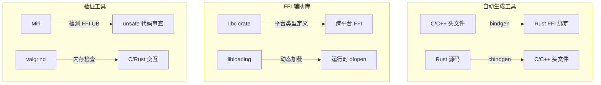
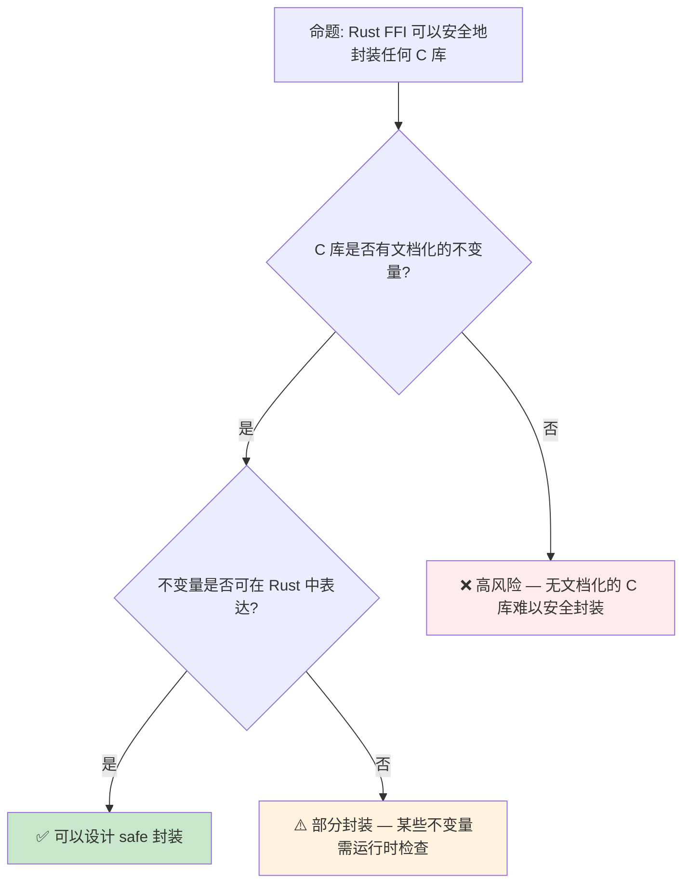

# Rust FFI：与外部代码的安全边界
>
> **受众**: [专家]

> **Bloom 层级**: 分析 → 评价
> **定位**: 系统分析 Rust 与 C/C++ 等外部代码交互的**Foreign Function Interface (FFI)** 机制，探讨 `extern` 块、ABI 兼容、`unsafe` 边界管理以及 `bindgen`/`cbindgen` 工具链。
> **前置概念**: [Unsafe](./03_unsafe.md) · [Type System](../01_foundation/04_type_system.md) · [Memory Management](../02_intermediate/03_memory_management.md)
> **后置概念**: [Application Domains](../06_ecosystem/04_application_domains.md)

---

> **来源**: [Rust Reference — External Blocks](https://doc.rust-lang.org/reference/items/external-blocks.html) · [The Rustonomicon — FFI](https://doc.rust-lang.org/nomicon/ffi.html) · [Rust FFI Guide](https://doc.rust-lang.org/nomicon/ffi.html) · [bindgen Documentation](https://rust-lang.github.io/rust-bindgen/) · [cbindgen Documentation](https://github.com/mozilla/cbindgen)

## 📑 目录

- [Rust FFI：与外部代码的安全边界](#rust-ffi与外部代码的安全边界)
  - [📑 目录](#-目录)
  - [一、核心概念](#一核心概念)
    - [1.1 FFI 的基本模型](#11-ffi-的基本模型)
    - [1.2 ABI 与调用约定](#12-abi-与调用约定)
    - [1.3 类型映射与布局兼容](#13-类型映射与布局兼容)
  - [二、技术细节](#二技术细节)
    - [2.1 extern 块的完整语法](#21-extern-块的完整语法)
    - [2.2 不透明类型与封装](#22-不透明类型与封装)
    - [2.3 回调与闭包传递](#23-回调与闭包传递)
  - [三、工具链生态](#三工具链生态)
  - [四、反命题与边界分析](#四反命题与边界分析)
    - [4.1 反命题树](#41-反命题树)
    - [4.2 边界极限](#42-边界极限)
  - [五、常见陷阱与最佳实践](#五常见陷阱与最佳实践)
    - [编译错误示例](#编译错误示例)
    - [3.4 边界测试：C 结构体布局不匹配（编译错误 / 运行时 UB）](#34-边界测试c-结构体布局不匹配编译错误--运行时-ub)
    - [3.5 边界测试：裸指针生命周期与 FFI 边界（编译错误）](#35-边界测试裸指针生命周期与-ffi-边界编译错误)
  - [六、来源与延伸阅读](#六来源与延伸阅读)
  - [相关概念文件](#相关概念文件)
  - [权威来源索引](#权威来源索引)
    - [10.3 边界测试：FFI 中的空指针解引用（运行时 UB）](#103-边界测试ffi-中的空指针解引用运行时-ub)
    - [10.5 边界测试：所有权移动后的再次使用](#105-边界测试所有权移动后的再次使用)

---

## 一、核心概念
>
>

### 1.1 FFI 的基本模型
>

Rust 通过 FFI 与外部代码交互时，安全保证在边界处**显式截断**：

```mermaid
graph LR
    subgraph RustSide["Rust 安全世界"]
        A["safe Rust 代码"] -->|"调用"| B["FFI 封装层"]
    end

    subgraph Boundary["FFI 边界"]
        B -->|"unsafe fn call_c()"| C["extern \"C\" 块"]
    end

    subgraph CSide["C 外部世界"]
        C -->|"ABI 调用"| D["C 函数"]
        D -->|"可能破坏任何不变量"| E["堆/栈/全局状态"]
    end

    style Boundary fill:#ffebee
    style CSide fill:#fff3e0
```

> **认知功能**: 此图展示 FFI 边界的**安全截断机制**——Rust 的安全保证在 `extern` 块处终止，外部代码的行为不受 Rust 类型系统约束。
> [来源: [TRPL](https://doc.rust-lang.org/book/)]
> **使用建议**: 所有 FFI 调用都应通过**薄封装层**（thin wrapper）进行，在封装层内用 `unsafe` 块隔离，向外暴露 safe API。
> **关键洞察**: FFI 是 Rust **安全边界的显式逃逸口**。与 `unsafe` 块一样，FFI 的使用需要人工审计和文档化契约。
> [来源: [Rustonomicon — FFI](https://doc.rust-lang.org/nomicon/ffi.html)]

---

### 1.2 ABI 与调用约定
>

```text
ABI (Application Binary Interface) 决定:
├── 参数传递方式（寄存器 vs 栈）
├── 返回值传递方式
├── 栈帧布局（谁负责清理栈）
├── 寄存器保存约定
└── 名称修饰（mangling）规则

Rust 支持的 ABI:
├── "C" — 标准 C ABI，最常用
├── "system" — 平台默认系统 ABI
├── "stdcall" — Windows API 标准
├── "fastcall" — x86 fastcall 约定
├── "vectorcall" — Windows vectorcall
├── "thiscall" — C++ thiscall（已弃用）
├── "win64" — Windows x86_64 ABI
├── "sysv64" — System V AMD64 ABI
├── "aapcs" — ARM 过程调用标准
├── "cdecl" — C declaration（x86）
└── "Rust" — Rust 内部 ABI（默认，不稳定）
```

> **ABI 选择原则**: 与 C 库交互用 `"C"`；与 Windows API 交互用 `"system"`；与特定平台代码交互用对应平台 ABI。
> [来源: [Rust Reference — ABIs](https://doc.rust-lang.org/reference/items/external-blocks.html#abi)]

---

### 1.3 类型映射与布局兼容
>

| Rust 类型 | C 类型 | 布局保证 | 注意 |
|:---|:---|:---:|:---|
| `i32` | `int` | ✅ | 固定大小 |
| `u32` | `unsigned int` | ✅ | 固定大小 |
| `i64` | `long long` | ✅ | C 的 `long` 大小平台相关 |
| `f32` | `float` | ✅ | IEEE-754 |
| `f64` | `double` | ✅ | IEEE-754 |
| `usize` | `size_t` | ✅ | 平台指针大小 |
| `isize` | `ssize_t` | ✅ | 平台指针大小 |
| `bool` | `_Bool` | ⚠️ | 大小为 1，但值只能是 0/1 |
| `char` | — | ❌ | Rust `char` 是 Unicode 标量值（4 字节） |
| `*const T` | `const T*` | ✅ | 裸指针布局相同 |
| `*mut T` | `T*` | ✅ | 裸指针布局相同 |
| `&T` | — | ❌ | 引用有 Rust 特定语义 |
| `Option<&T>` | — | ⚠️ | 可能为 null 的指针优化（NIC） |
| `struct` | `struct` | ⚠️ | 需 `#[repr(C)]` 保证布局 |
| `enum` | `enum` | ❌ | 需 `#[repr(C)]` 或 `#[repr(u8)]` 等 |

> **布局保证**: 只有标上 `#[repr(C)]`、`#[repr(u8)]` 等 repr 属性的 Rust 类型，其布局才与 C 兼容。默认的 Rust 结构体布局是**未定义的**，编译器可自由重排字段。
> [来源: [Rust Reference — Type Layout](https://doc.rust-lang.org/reference/type-layout.html)]

---

## 二、技术细节

### 2.1 extern 块的完整语法
>

```rust,ignore
// 声明外部函数
#[link(name = "mylib")]  // 链接库名
extern "C" {
    // 简单函数
    fn abs(x: i32) -> i32;

    // 可变参数函数（C varargs）
    fn printf(fmt: *const c_char, ...) -> i32;

    // 外部全局变量
    static mut errno: c_int;

    // 外部类型（不透明）
    type FILE;  // C 的 FILE* 对应 *mut FILE

    // 函数指针类型
    type Callback = extern "C" fn(data: *mut c_void) -> c_int;
}

// 从 Rust 调用
unsafe {
    let result = abs(-42);
    assert_eq!(result, 42);
}
```

> **技术要点**:
>
> 1. `extern "C"` 块内声明的函数默认是 `unsafe` 的——因为 Rust 无法验证外部代码的安全性
> 2. `#[link(name = "...")]` 指定链接时搜索的库名
> 3. `static mut` 外部变量访问需要 `unsafe`，因为存在数据竞争风险
> [来源: [Rust Reference — External Blocks](https://doc.rust-lang.org/reference/items/external-blocks.html)]

---

### 2.2 不透明类型与封装
>

```rust,ignore
// 模式: 不透明指针（Opaque Pointer）
// C 端: typedef struct Connection Connection;

extern "C" {
    type Connection;  // Rust 中不完整类型

    fn connection_new(host: *const c_char) -> *mut Connection;
    fn connection_send(conn: *mut Connection, data: *const u8, len: usize) -> c_int;
    fn connection_close(conn: *mut Connection);
}

// Rust 安全封装
pub struct SafeConnection {
    raw: *mut Connection,
}

impl SafeConnection {
    pub fn new(host: &str) -> Option<Self> {
        let c_host = CString::new(host).ok()?;
        let raw = unsafe { connection_new(c_host.as_ptr()) };
        if raw.is_null() { None } else { Some(Self { raw }) }
    }

    pub fn send(&mut self, data: &[u8]) -> Result<(), ()> {
        let rc = unsafe { connection_send(self.raw, data.as_ptr(), data.len()) };
        if rc == 0 { Ok(()) } else { Err(()) }
    }
}

impl Drop for SafeConnection {
    fn drop(&mut self) {
        unsafe { connection_close(self.raw); }
    }
}
```

> **封装模式**: 外部不透明指针 + Rust 安全封装结构体 + Drop trait 管理生命周期。这是 FFI 中最常见的安全化模式。
> [来源: [Rust FFI Patterns](https://doc.rust-lang.org/nomicon/ffi.html)]

---

### 2.3 回调与闭包传递
>

```rust,ignore
// 将 Rust 闭包传递给 C 的回调机制

extern "C" {
    // C 函数接受回调: void register_callback(void (*cb)(int, void*), void* user_data);
    fn register_callback(
        cb: extern "C" fn(event: c_int, user_data: *mut c_void),
        user_data: *mut c_void,
    );
}

// 蹦床函数（trampoline）
extern "C" fn trampoline(event: c_int, user_data: *mut c_void) {
    // 将 user_data 转换回 Box<dyn FnMut(i32)>
    let closure: &mut Box<dyn FnMut(i32)> = unsafe {
        &mut *(user_data as *mut Box<dyn FnMut(i32)>)
    };
    closure(event as i32);
}

// 安全封装
pub fn set_callback<F>(mut callback: F)
where
    F: FnMut(i32) + 'static,
{
    let boxed: Box<Box<dyn FnMut(i32)>> = Box::new(Box::new(callback));
    let user_data = Box::into_raw(boxed) as *mut c_void;
    unsafe {
        register_callback(trampoline, user_data);
    }
    // ⚠️ 注意: 此处有内存泄漏风险，需设计注销机制释放 user_data
}
```

> **回调难点**:
>
> 1. C 回调必须是 `extern "C" fn`（函数指针），不能是闭包
> 2. 需要通过 `user_data` 参数传递闭包环境
> 3. **生命周期管理复杂**——谁释放 `user_data`？何时释放？
> 4. panic 跨越 FFI 边界是 UB——必须用 `catch_unwind` 包裹
> [来源: [Rustonomicon — Panic Across FFI](https://doc.rust-lang.org/nomicon/unwinding.html)]

---

## 三、工具链生态



> **认知功能**: 此图展示 Rust FFI 生态的**工具链层次**——从自动生成绑定到运行时动态加载，再到验证工具。
> **使用建议**: 优先使用 `bindgen`/`cbindgen` 自动生成绑定，减少手工错误；复杂场景使用 `libloading` 动态加载；所有 FFI 代码应用 Miri 和 valgrind 验证。
> [来源: [bindgen User Guide](https://rust-lang.github.io/rust-bindgen/)]

---

## 四、反命题与边界分析

### 4.1 反命题树
>



> **认知功能**: 此决策树评估 C 库是否适合被 Rust 安全封装。核心判断标准是**不变量的文档化程度**和**可表达性**。
> **使用建议**: 优先封装有清晰 API 契约的 C 库（如 OpenSSL、SQLite）；避免封装内部行为不透明的遗留代码。
> **关键洞察**: FFI 安全封装的本质是**将 C 的不变量映射到 Rust 的类型系统**。如果 C 库本身没有明确的不变量，映射就不可能完整。
> [来源: 💡 原创分析]

---

### 4.2 边界极限
>

```text
边界 1: 类型系统的不匹配
├── C 的 union 在 Rust 中需用 `#[repr(C)] union` 手动映射
├── C 的灵活数组成员（flexible array member）Rust 不直接支持
├── C 的位域（bitfield）需手动用位运算模拟
└── C++ 的类/虚函数/模板无法直接 FFI，需 C 包装层

边界 2: 生命周期与所有权
├── C 的指针无所有权语义，Rust 封装需人工推断
├── 双重释放/释放后使用是 FFI 中最常见的内存错误
└── 跨语言对象图的管理没有通用方案

边界 3: 异常与 Panic
├── Rust panic 跨越 FFI 边界是 UB
├── C++ 异常跨越 FFI 边界也是 UB
├── 解决方案: 在边界处用 catch_unwind / try-catch 转换

边界 4: 线程模型
├── C 库可能有自己的线程假设（如全局锁、TLS）
├── Rust 的 Send/Sync 标记需根据 C 库的实际线程安全性推断
└── 错误推断会导致数据竞争或死锁
```

> **边界要点**: FFI 的边界不是 Rust 语言的限制，而是**两种语言语义模型差异**的必然结果。安全封装需要深入理解两边的语义。

---

## 五、常见陷阱与最佳实践
>

```text
陷阱 1: CString 生命周期
  ❌ let ptr = CString::new("hello").unwrap().as_ptr();
  // CString 被立即 drop，ptr 成为悬垂指针

  ✅ let cstr = CString::new("hello").unwrap();
     let ptr = cstr.as_ptr();
     // cstr 在作用域结束时才 drop

陷阱 2: 未初始化的外部结构体
  ❌ let mut s: MyCStruct = std::mem::uninitialized();
     // std::mem::uninitialized() 已弃用，且对非 Copy 类型危险

  ✅ let mut s: MyCStruct = std::mem::zeroed();
     // 或: let mut s: MaybeUninit<MyCStruct> = MaybeUninit::uninit();

陷阱 3: 忘记 repr(C)
  ❌ struct Point { x: f64, y: f64 }
     // Rust 可能重排字段！

  ✅ #[repr(C)]
     struct Point { x: f64, y: f64 }

最佳实践:
  1. 用 bindgen 自动生成绑定，不手写
  2. 所有 FFI 调用都通过 safe wrapper
  3. 文档化 C 库的不变量假设
  4. 对 FFI 代码运行 Miri 和 valgrind
  5.  panic 边界处必须 catch_unwind
```

> **实践要点**: FFI 代码的错误往往隐藏在**看似正确的类型匹配**之下。最安全的策略是最小化 FFI 边界面积，最大化 safe Rust 封装。
> [来源: [Rust FFI Best Practices](https://doc.rust-lang.org/nomicon/ffi.html)]

### 编译错误示例

```rust,compile_fail
// 错误: 在 safe Rust 中直接声明 extern 函数
extern "C" {
    fn c_function();
}

fn main() {
    // ❌ 编译错误: 调用 `unsafe extern` 函数需要 `unsafe` 块
    // FFI 函数默认是 unsafe 的，因为 Rust 编译器无法验证 C 代码的安全性
    c_function();
}
```

> **修正**: 所有 FFI 调用必须包裹在 `unsafe { }` 块中，或通过 safe wrapper 封装。

```rust,ignore
#[repr(C)]
struct RustStruct {
    data: String, // String 不是 repr(C) 兼容类型
}

fn repr_c_violation() {
    // ❌ 编译错误: 在 `#[repr(C)]` 结构体中使用非 C 兼容类型
    // String 包含胖指针和容量信息，其布局不保证与 C 兼容
    let s = RustStruct { data: String::from("hello") };
}
```

> **修正**: `#[repr(C)]` 结构体的字段必须是 C 兼容类型（`i32`、`*const T`、裸指针等）。复杂类型需通过 `Box` 或引用传递。

```rust,ignore
use std::panic::catch_unwind;

// 错误: panic 穿越 FFI 边界未处理
extern "C" fn callback() {
    panic!("from C"); // 若 C 调用此函数且 panic 未捕获 → UB
}

fn main() {
    // ❌ 编译错误: catch_unwind 要求闭包是 `UnwindSafe`
    // 某些类型（如 &mut）不实现 UnwindSafe
    let result = catch_unwind(|| {
        callback();
    });
}
```

> **修正**: FFI 回调中必须 `catch_unwind` 防止 panic 跨越语言边界。对于非 `UnwindSafe` 类型，需使用 `AssertUnwindSafe` 包装。

### 3.4 边界测试：C 结构体布局不匹配（编译错误 / 运行时 UB）

```rust
#[repr(C)]
struct RustStruct {
    a: u8,
    b: u32, // Rust 默认按声明顺序布局，但可能添加 padding
}

// C 侧对应的结构体
// struct CStruct { uint8_t a; uint32_t b; }; // 通常有 3 字节 padding

// ⚠️ 运行时 UB: 若假设布局完全相同而不检查
fn unsafe_assumption() {
    // 直接使用 transmute 转换指针而不验证布局
    // let c_ptr: *const CStruct = rust_ptr as *const _; // 危险！
}

// 正确: 使用 bindgen 或手动验证布局
use std::mem;

fn verify_layout() {
    assert_eq!(mem::size_of::<RustStruct>(), 8); // 验证大小
    assert_eq!(mem::align_of::<RustStruct>(), 4); // 验证对齐
    // ✅ 使用 static_assertions 或 bindgen 生成验证
}
```

> **修正**: `#[repr(C)]` 只保证 Rust 编译器使用 C 兼容的布局规则，但**不保证**与特定 C 编译器的布局完全一致（尤其是 bit field、packing pragma）。跨 FFI 传递结构体时，应使用 `bindgen` 自动生成布局验证，或手动使用 `static_assertions::assert_eq_size!` 检查。[来源: [Rustonomicon](https://doc.rust-lang.org/nomicon/)]

### 3.5 边界测试：裸指针生命周期与 FFI 边界（编译错误）

```rust,compile_fail
extern "C" {
    fn c_returns_pointer() -> *const u8;
}

fn main() {
    let ptr = unsafe { c_returns_pointer() };
    // ❌ 编译错误: 裸指针不能直接解引用，需要 unsafe 块
    // 但更深层的问题是生命周期
    let _val = unsafe { *ptr }; // C 返回的指针可能已失效
}

// 正确: 将裸指针包装为引用时需指定生命周期
unsafe fn c_get_buffer<'a>() -> &'a [u8] {
    let ptr = c_returns_pointer();
    let len = 100; // 假设已知长度
    std::slice::from_raw_parts(ptr, len) // 'a 生命周期由调用者控制
}
```

> **修正**: C 函数返回的裸指针没有生命周期信息。将其转换为 Rust 引用时，必须显式标注生命周期（通常是 `'a` 由调用者提供）。若 C 函数返回的指针指向局部变量或已释放内存，Rust 引用将悬垂——这是 unsafe 边界，编译器无法检测。[来源: [Rustonomicon](https://doc.rust-lang.org/nomicon/)]

---

## 六、来源与延伸阅读

| 来源 | 可信度 | 说明 |
|:---|:---:|:---|
| [Rust Reference — External Blocks](https://doc.rust-lang.org/reference/items/external-blocks.html) | ✅ 一级 | 官方语言参考 |
| [Rustonomicon — FFI](https://doc.rust-lang.org/nomicon/ffi.html) | ✅ 一级 | unsafe FFI 深入指南 |
| [bindgen User Guide](https://rust-lang.github.io/rust-bindgen/) | ✅ 一级 | C/C++ → Rust 绑定生成 |
| [cbindgen](https://github.com/mozilla/cbindgen) | ✅ 一级 | Rust → C/C++ 头文件生成 |
| [libc crate](https://docs.rs/libc/latest/libc/) | ✅ 一级 | 平台 C 类型定义 |
| [Rust FFI Omnibus](http://jakegoulding.com/rust-ffi-omnibus/) | 🔍 三级 | FFI 实例集合 |

---

## 相关概念文件

- [Unsafe](./03_unsafe.md) — unsafe Rust 与内存安全
- [Type System](../01_foundation/04_type_system.md) — Rust 类型系统基础
- [Memory Management](../02_intermediate/03_memory_management.md) — 内存管理模型
- [Application Domains](../06_ecosystem/04_application_domains.md) — 应用领域分析

---

> **权威来源**: [Rust Reference](https://doc.rust-lang.org/reference/), [The Rust Programming Language](https://doc.rust-lang.org/book/), [Rustonomicon](https://doc.rust-lang.org/nomicon/)
> **权威来源对齐变更日志**: 2026-05-21 创建，对齐 Rust 1.96.0+ (Edition 2024)

**文档版本**: 1.0
**对应 Rust 版本**: 1.96.0+ (Edition 2024)
**最后更新**: 2026-05-21
**状态**: ✅ 概念文件创建完成

---

## 权威来源索引

>
>
>
>
>

---

---

---

### 10.3 边界测试：FFI 中的空指针解引用（运行时 UB）

```rust,compile_fail
use std::os::raw::c_int;

extern "C" {
    fn c_compute(x: *const c_int) -> c_int;
}

fn main() {
    let ptr: *const c_int = std::ptr::null();
    unsafe {
        // ❌ 运行时 UB: 向 C 函数传递空指针，C 可能解引用
        let result = c_compute(ptr);
        println!("{}", result);
    }
}
```

> **修正**: FFI 边界是 Rust 安全保证的**信任边界**：Rust 编译器无法验证 C 代码的行为。传递空指针、悬垂指针或未初始化内存到 C 函数是 UB。防御策略：1) 在 Rust 侧验证指针非空（`if ptr.is_null() { return Err(...) }`）；2) 使用 `NonNull<T>` 类型（编译期保证非空）；3) 用 `cbindgen`/`cxx` 生成安全的 C++ 绑定；4) 对 C API 包装为 safe Rust 函数（`unsafe fn raw_c_call` → `pub fn safe_call`）。Rust 的 `unsafe` 块是 FFI 的必要之恶——最小化 unsafe 范围，在边界处建立安全抽象层。这与 Go 的 cgo（自动处理指针，但性能开销大）或 Java 的 JNI（JVM 管理对象生命周期）不同——Rust 的 FFI 提供零成本抽象，但安全责任完全在开发者。[来源: [The Rustonomicon](https://doc.rust-lang.org/nomicon/ffi.html)] · [来源: [Rust Reference — External Blocks](https://doc.rust-lang.org/reference/items/external-blocks.html)]

### 10.5 边界测试：所有权移动后的再次使用

```rust,compile_fail
fn main() {
    let s = String::from("hello");
    let s2 = s;
    // ❌ 编译错误: s 已被 move 到 s2
    println!("{}", s);
}
```

> **修正**: **Move 语义**：1) `String` 非 `Copy`，赋值时 move 所有权；2) move 后原变量无效；3) 解决：使用 `.clone()` 或引用 `&s`。

> **权威来源**: [Rust Reference](https://doc.rust-lang.org/reference/) · [The Rust Programming Language](https://doc.rust-lang.org/book/) · [Rust Standard Library](https://doc.rust-lang.org/std/)
> **对应 Rust 版本**: 1.96.0+ (Edition 2024)

> **权威来源**: [Rust Reference](https://doc.rust-lang.org/reference/) · [The Rust Programming Language](https://doc.rust-lang.org/book/) · [Rust Standard Library](https://doc.rust-lang.org/std/)
> **对应 Rust 版本**: 1.96.0+ (Edition 2024)
