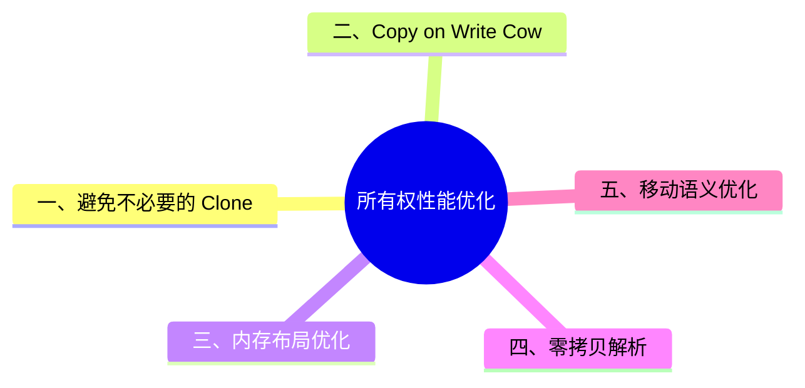

> **内容分级**: [专家级]
> **本节关键术语**: 所有权性能优化 (Ownership Performance Optimization) · Copy on Write (Cow) · 零拷贝 (Zero-Copy) · 内存布局 (Memory Layout) · 移动语义 (Move Semantics) — [完整对照表](../../00_meta/01_terminology/01_terminology_glossary.md)
>
# 所有权性能优化
>
> **EN**: Ownership Performance Optimization
> **Summary**: Optimize Rust performance through ownership-aware patterns: avoid clones, use Cow, optimize memory layout, zero-copy parsing, and leverage move semantics.
> **Rust 版本**: 1.97.0+ (Edition 2024)
> **受众**: [专家]
> **Bloom 层级**: L3-L4
> **权威来源**: 本文件为 `concept/` 权威页。
> **A/S/P 标记**: **P+A** — Procedure + Application
> **定位**: 从所有权（Ownership）视角出发，系统梳理避免不必要拷贝、使用写时复制、优化内存布局、零拷贝解析与移动语义的最佳实践。
> **前置概念**: [Ownership](../../01_foundation/01_ownership_borrow_lifetime/01_ownership.md) · [Borrowing](../../01_foundation/01_ownership_borrow_lifetime/02_borrowing.md) · [Smart Pointers](../../02_intermediate/02_memory_management/04_smart_pointers.md)
> **后置概念**: [Performance Optimization](../../06_ecosystem/10_performance/01_performance_optimization.md) · [Zero-Copy Parsing](02_zero_copy_parsing.md)

---

> **来源**: [TRPL — References and Borrowing](https://doc.rust-lang.org/book/ch04-02-references-and-borrowing.html) · [Rustonomicon — Ownership](https://doc.rust-lang.org/nomicon/ownership.html) · [Rust Performance Book](https://nnethercote.github.io/perf-book/)

## 📑 目录

- [所有权性能优化](#所有权性能优化)
  - [📑 目录](#-目录)
  - [一、避免不必要的 Clone](#一避免不必要的-clone)
  - [二、Copy on Write (Cow)](#二copy-on-write-cow)
  - [三、内存布局优化](#三内存布局优化)
  - [四、零拷贝解析](#四零拷贝解析)
  - [五、移动语义优化](#五移动语义优化)
  - [六、栈与堆选择](#六栈与堆选择)
  - [七、枚举与 Option 布局优化](#七枚举与-option-布局优化)
  - [八、缓存局部性](#八缓存局部性)
  - [九、常见反模式](#九常见反模式)
  - [认知路径](#认知路径)
  - [反命题](#反命题)
  - [国际权威参考 / International Authority References（P1 学术 · P2 生态）](#国际权威参考--international-authority-referencesp1-学术--p2-生态)
  - [⚠️ 反例与陷阱：返回局部变量的引用](#️-反例与陷阱返回局部变量的引用)
  - [🧭 思维导图（Mindmap）](#-思维导图mindmap)

---

## 一、避免不必要的 Clone

优先使用引用（Reference）（`&str`、`&[T]`）代替拥有所有权的类型（`String`、`Vec<T>`），避免堆分配。(Source: [TRPL — References and Borrowing](https://doc.rust-lang.org/book/ch04-02-references-and-borrowing.html))

```rust
// ❌ 不必要的 clone
fn process_bad(data: &String) {
    let owned = data.clone();
}

// ✅ 直接使用切片引用
fn process(data: &str) {}
```

---

## 二、Copy on Write (Cow)

`std::borrow::Cow` 在不需要修改时零成本借用（Borrowing），需要修改时才克隆。(Source: [std::borrow::Cow](https://doc.rust-lang.org/std/borrow/enum.Cow.html))

```rust
use std::borrow::Cow;

fn normalize<'a>(input: &'a str) -> Cow<'a, str> {
    if input.contains("special") {
        Cow::Owned(input.replace("special", "normal"))
    } else {
        Cow::Borrowed(input)
    }
}
```

---

## 三、内存布局优化

字段按对齐要求排序，可减少结构体（Struct）填充（padding）。

```rust
// ❌ 24 字节（含填充）
struct Wasteful { a: u8, b: u64, c: u8 }

// ✅ 16 字节
struct Optimized { b: u64, a: u8, c: u8 }
```

---

## 四、零拷贝解析

使用切片（Slice）引用（Reference）原始数据，避免 `Vec<u8>` 分配。

```rust
fn parse_header(data: &[u8]) -> Option<u32> {
    if data.len() < 4 { return None; }
    Some(u32::from_le_bytes([data[0], data[1], data[2], data[3]]))
}
```

---

## 五、移动语义优化

利用 Rust 的默认移动语义，显式转移所有权而非拷贝大型数据。

```rust
fn consume(data: Vec<u8>) -> usize {
    data.len() // data 被移入，无拷贝开销
}
```

## 六、栈与堆选择

| 场景 | 推荐 | 原因 |
|:---|:---|:---|
| 小且固定大小 | 栈（值类型 / 数组） | 无分配开销，cache 友好 |
| 大或动态大小 | 堆（`Box` / `Vec` / `String`） | 避免栈溢出 |
| 递归数据结构 | `Box` 递归 | 已知大小，支持递归类型 |
| 频繁克隆的大对象 | `Rc` / `Arc` | 共享所有权减少拷贝 |

## 七、枚举与 Option 布局优化

`Option<Box<T>>` 可利用 null pointer optimization，使 `None` 不占用额外空间：(Source: [Rustonomicon — Option and Nullable Pointers](https://doc.rust-lang.org/nomicon/))

```rust
use std::mem::size_of;

assert_eq!(size_of::<Box<u32>>(), size_of::<Option<Box<u32>>>());
```

对于自定义枚举，将最常见变体排在前面并不能影响布局，但合理的字段排序可以减少 padding：

```rust
// ❌ 16 字节（padding）
enum Bad { A(u8, u64) }

// ✅ 16 字节但利用更紧凑：将大字段对齐在前
enum Good { A(u64, u8) }
```

## 八、缓存局部性

```rust,ignore
// ❌ 数组 of pointers：cache miss 高
let matrix: Vec<Box<[f64; 1024]>> = vec![...; n];

// ✅ 连续扁平数组：cache 友好
let matrix: Vec<f64> = vec![0.0; n * 1024];
```

## 九、常见反模式

| 反模式 | 问题 | 改进 |
|:---|:---|:---|
| 在热路径 `.clone()` 大 `Vec` | 堆分配与拷贝 | 使用 `&[T]` 或 `Cow` |
| `String` 拼接循环 | 多次重新分配 | 使用 `String::with_capacity` + `push_str` |
| 过度使用 `Rc` | 引用计数开销 | 优先借用（Borrowing）或 `&T` |
| 忽略枚举 padding | 内存浪费 | 重排字段或使用 `repr(C)` 精确控制 |

---

> 本文档由原 `crates/c01_ownership_borrow_scope/docs/tier_04_advanced/03_ownership_performance_optimization.md` 按 AGENTS.md §6.4 迁移而来，是 `concept/` 中的权威页。

## 认知路径

1. **问题识别**: 识别不必要拷贝、内存布局与零拷贝场景中的性能瓶颈。
2. **概念建立**: 掌握 Cow、写时复制、内存布局优化、零拷贝解析与移动语义的最佳实践。
3. **机制推理**: 通过避免拷贝 ⟹ Cow/零拷贝 ⟹ 布局优化的定理链进行性能决策。
4. **边界辨析**: 辨析“clone 总是坏的”等反命题，理解拷贝有时是必要的权衡。
5. **迁移应用**: 将所有权性能优化与零拷贝解析、性能优化主题链接。

## 反命题

> **反命题 1**: "Clone 总是性能问题" ⟹ 不成立。小数据或不可变共享场景下 clone 可能更简单且可接受。
>
> **反命题 2**: "零拷贝总是最优" ⟹ 不成立。零拷贝常引入复杂生命周期（Lifetimes）约束，可能增加维护成本。
>
> **反命题 3**: "栈分配总是比堆分配快" ⟹ 不成立。大数据结构在栈上拷贝或传递可能反而更慢。
>

> **权威来源**: [TRPL — References and Borrowing](https://doc.rust-lang.org/book/ch04-02-references-and-borrowing.html), [Rustonomicon — Ownership](https://doc.rust-lang.org/nomicon/ownership.html), [Rust Performance Book](https://nnethercote.github.io/perf-book/)
>
> **权威来源对齐变更日志**: 2026-07-10 Stage F L3 补全权威来源块与关键引用 [Authority Source Sprint Batch 10](../../00_meta/02_sources/05_international_authority_index.md)

---

## 国际权威参考 / International Authority References（P1 学术 · P2 生态）

> 依据 `AGENTS.md` §2「对齐网络国际化权威内容」补充：仅追加已验证可达的权威链接，不改动正文事实。

- **P1 学术/形式化**: [Stacked Borrows: An Aliasing Model for Rust (POPL 2021)](https://dl.acm.org/doi/10.1145/3371109) · [Tree Borrows: A New Aliasing Model for Rust (PLDI 2025, Distinguished Paper)](https://dl.acm.org/doi/10.1145/3735592)

---

## ⚠️ 反例与陷阱：返回局部变量的引用

**反例**（rustc 1.97 实测编译失败：E0515）：

```rust,compile_fail
fn first_word<'a>() -> &'a String {
    let s = String::from("hello world");
    &s
}
fn main() { let _ = first_word(); }
```

局部 `String` 在函数返回时释放，返回其引用必然悬垂；Rust 在编译期拒绝，杜绝了 C/C++ 中经典的 use-after-free 性能优化事故源。

**修正**：

```rust
fn first_word() -> String {
    let s = String::from("hello world");
    s
}
fn main() { let _ = first_word(); }
```

## 🧭 思维导图（Mindmap）


