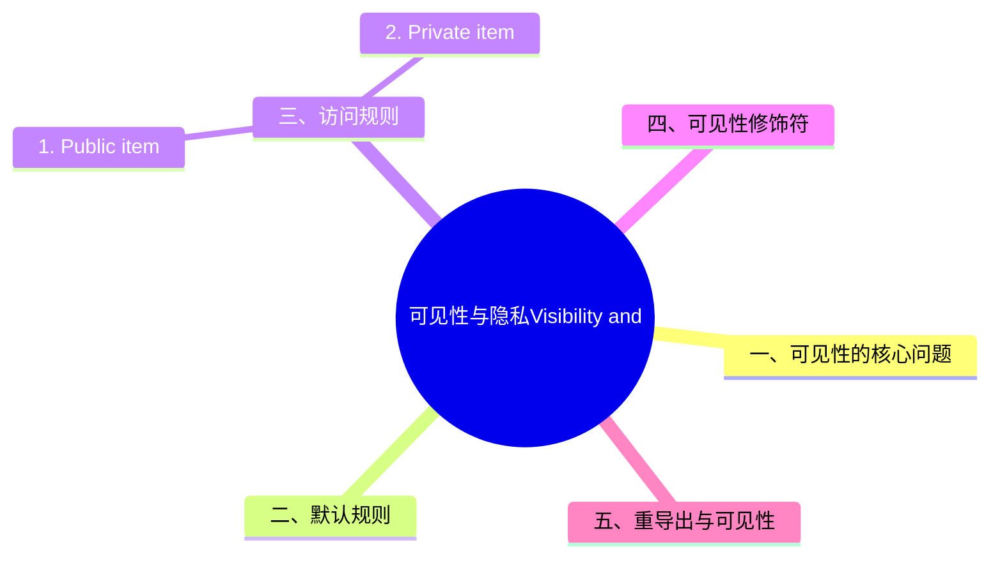

# 可见性与隐私（Visibility and Privacy）

> **EN**: Visibility and Privacy
> **Summary**: Rust 模块（Module）系统中 item 的可见性规则：`pub`、`pub(crate)`、`pub(super)`、`pub(in path)` 以及重导出的影响。
> **Rust 版本**: 1.97.0+ (Edition 2024)
>
> **受众**: [专家]
> **内容分级**: [专家级]
> **Bloom 层级**: L2-L3
> **权威来源**: 本文件为 `concept/` 权威页。
> **A/S/P 标记**: **S** — Specification
> **双维定位**: S×App — 规范应用
> **前置依赖**: [Modules and Paths](../../01_foundation/07_modules_and_items/01_modules_and_paths.md) · [Names, Scopes and Resolution](../../04_formal/05_rustc_internals/06_names_and_resolution.md)
> **后置概念**: [API Naming Conventions](../../02_intermediate/05_modules_and_visibility/03_api_naming_conventions.md) · [Cargo SemVer Checks](../../07_future/03_preview_features/27_cargo_semver_checks_preview.md) · [Safety Boundaries](../../05_comparative/03_domain_comparisons/01_safety_boundaries.md)
> **定理链**: Module Hierarchy → Visibility Rule → Public API Surface
> **主要来源**: [Rust Reference — Visibility and Privacy](https://doc.rust-lang.org/reference/visibility-and-privacy.html) · [TRPL — Modules](https://doc.rust-lang.org/book/ch07-03-paths-for-referring-to-an-item-in-the-module-tree.html) · [Brown University — Interactive Rust Book](https://rust-book.cs.brown.edu/) · [Oxide: The Essence of Rust](https://arxiv.org/abs/1903.00982) · [Itanium C++ ABI](https://itanium-cxx-abi.github.io/cxx-abi/abi.html)
>
> **来源**: [Rust Reference — Visibility and Privacy](https://doc.rust-lang.org/reference/visibility-and-privacy.html)

---

## 一、可见性的核心问题

**可见性（visibility）** 与 **隐私（privacy）** 回答同一个问题：*“这个 item 在当前位置能否被使用？”*

Rust 的名称解析基于全局的命名空间层次结构。每个层级都可以视为某个 item。声明或定义一个新模块（Module），相当于在定义位置向层次结构中插入一棵新树。

---

## 二、默认规则

默认情况下，所有 item 都是**私有（private）**的，但有两个例外：(Source: [Rust Reference — Visibility and Privacy](https://doc.rust-lang.org/reference/visibility-and-privacy.html))

1. `pub` trait 的关联项默认是 public。
2. `pub` enum 的变体默认是 public。

当 item 被声明为 `pub` 时，它对外部世界可见。

```rust
struct Foo;                    // 私有
pub struct Bar { field: i32 }  // 公开结构体，但字段默认私有
pub enum State {               // 公开枚举，变体默认公开
    PubliclyAccessibleState,
    PubliclyAccessibleState2,
}
```

---

## 三、访问规则

Rust 可见性规则的形式化核心只有一条：**项对模块 M 可见，当且仅当项的每个「路径环节」对 M 都可达**。规则展开：

- **Public item**：`pub` 项对其祖先模块链上「能看到其父模块」的所有代码可见——注意「项 pub 但模块私有」则项对外不可见（可见性是路径的合取）；
- **Private item**：默认私有 = 当前模块及其**后代**模块可见（隐私向下继承）——`mod inner` 可以访问外层的私有项，反之不行；
- **受限可见性**：`pub(crate)`/`pub(super)`/`pub(in path)` 把可见域精确到子树——`pub(in path)` 的 path 必须是当前模块的祖先。

推论与判定：① `use` 引入的名字默认私有（`pub use` 才可再导出）；② trait 方法调用要求 **trait 可见**（不是方法可见）——`pub(crate) trait` 是「crate 内 API」的标准技巧；③ 结构体字段可见性与类型可见性独立（`pub struct` 可含私有字段，构造受控）。

### 1. Public item

如果 item 是 public 的，那么只要从模块（Module） `m` 可以访问该 item 的所有祖先模块，就可以从 `m` 外部访问它。也可以通过重导出（re-export）命名该 item。

### 2. Private item

如果 item 是 private 的，它可以被当前模块（Module）及其后代模块访问。

---

## 四、可见性修饰符

| 修饰符 | 含义 |
|:---|:---|
| `pub` | 全局公开 |
| `pub(crate)` | 当前 crate 内可见 |
| `pub(super)` | 父模块（Module）可见，等价于 `pub(in super)` |
| `pub(in path)` | 在指定祖先模块（Module）路径内可见 |
| `pub(self)` | 仅当前模块可见，等价于 private |

### 示例

```rust
pub mod outer_mod {
    pub mod inner_mod {
        pub(in crate::outer_mod) fn outer_mod_visible_fn() {}
        pub(crate) fn crate_visible_fn() {}
        pub(super) fn super_mod_visible_fn() {}
        pub(self) fn inner_mod_visible_fn() {}
    }
}
```

> **Edition 差异**: 2018 Edition 起，`pub(in path)` 的路径必须以 `crate`、`self` 或 `super` 开头。

---

## 五、重导出与可见性

`pub use` 可以公开地重导出 item，使外部 crate 通过新的路径访问原本私有的模块链中的 item。(Source: [Rust Reference — Re-exporting and Visibility](https://doc.rust-lang.org/reference/visibility-and-privacy.html#re-exporting-and-visibility))

```rust
pub use self::implementation::api;

mod implementation {
    pub mod api {
        pub fn f() {}
    }
}
```

- 外部 crate 通过 `implementation::api::f` 访问会收到隐私错误。
- 但通过 `api::f` 访问是允许的。

重导出相当于把“隐私链”短路到重导出点，而不是按命名空间层次正常传递。

---

## 六、`use` 声明与可见性

`use` 本身不改变可见性，只是把名称引入当前作用域。只有 `pub use` 会把引入的名称再次公开：

```rust
mod inner {
    pub fn public_fn() {}
    fn private_fn() {}
}

pub use inner::public_fn; // 外部可见
// pub use inner::private_fn; // ❌ 错误：不能重导出私有 item
```

## 七、可见性与 crate 边界

跨 crate 时，只有 `pub` 的 item 能被外部访问。(Source: [Rust Reference — Visibility and Privacy](https://doc.rust-lang.org/reference/visibility-and-privacy.html))`pub(crate)`、`pub(super)`、`pub(in path)` 仅在当前 crate 内部生效，对外部 crate 等同于 private。

```rust
// crate-a
pub struct Foo {
    pub(crate) internal: i32, // 对 crate-b 不可见
}
```

## 八、可见性与测试

单元测试通常放在 `#[cfg(test)]` 模块中，作为 crate 的一部分可以访问 `pub(crate)` 及以下可见性：

```rust
#[cfg(test)]
mod tests {
    use super::*;

    #[test]
    fn test_internal() {
        assert_eq!(crate::module::crate_visible_fn(), 42);
    }
}
```

## 九、可见性决策树

```mermaid
flowchart TD
    A[定义新 item] --> B{是否需要被 crate 外部使用?}
    B -->|是| C[pub]
    B -->|否| D{是否需要跨模块但仍在 crate 内?}
    D -->|是| E[pub(crate) / pub(in path)]
    D -->|否| F[默认 private]
```

## 十、实践建议

1. **最小公开表面**: 只把必要的 item 设为 `pub`，隐藏实现细节。
2. **使用 `pub(crate)` 管理内部 API**: 比 `pub` 更严格，同时允许 crate 内测试访问。
3. **重导出塑造 API**: 通过 `pub use` 把内部模块的公共接口提升到 crate 根，形成清晰的公共 API。
4. **可见性影响 semver**: 改变 public item 的签名或移除 public item 通常是破坏性变更。

---

## 十一、相关概念

| 概念 | 关系 |
|:---|:---|
| [Modules and Paths](../../01_foundation/07_modules_and_items/01_modules_and_paths.md) | 可见性基于模块层次结构 |
| [Names, Scopes and Resolution](../../04_formal/05_rustc_internals/06_names_and_resolution.md) | 名称解析遵守可见性规则 |
| [API Naming Conventions](../../02_intermediate/05_modules_and_visibility/03_api_naming_conventions.md) | 可见性决定公共 API 边界 |
| [Cargo SemVer Checks](../../07_future/03_preview_features/27_cargo_semver_checks_preview.md) | 可见性变化影响语义化版本 |

> **权威来源**: [Rust Reference — Visibility and Privacy](https://doc.rust-lang.org/reference/visibility-and-privacy.html), [TRPL Ch7 — Modules](https://doc.rust-lang.org/book/ch07-03-paths-for-referring-to-an-item-in-the-module-tree.html)
>
> **权威来源对齐变更日志**: 2026-07-10 Stage F L3 补全权威来源块与关键引用 [Authority Source Sprint Batch 10](../../00_meta/02_sources/05_international_authority_index.md)

---

## 国际权威参考 / International Authority References（P1 学术 · P2 生态）

> 依据 `AGENTS.md` §2「对齐网络国际化权威内容」补充：仅追加已验证可达的权威链接，不改动正文事实。

- **P2 生态/社区**: [docs.rs/semver — 生态权威 API 文档](https://docs.rs/semver) · [docs.rs/toml — 生态权威 API 文档](https://docs.rs/toml)

---

## ⚠️ 反例与陷阱：重导出私有项

**反例**（rustc 1.97 实测编译失败，E0603）：

```rust,compile_fail
mod internal {
    struct Token;
}
pub use internal::Token;
fn main() {}
```

`pub use` 重导出要求被导出的项本身公开；编译器在重导出点即报 E0603 防止借 `pub use` 绕过模块隐私边界，保证「可见性只降不升」。

**修正**：

```rust
mod internal {
    pub struct Token;
}
pub use internal::Token;
fn main() {}
```

## 🧭 思维导图（Mindmap）


