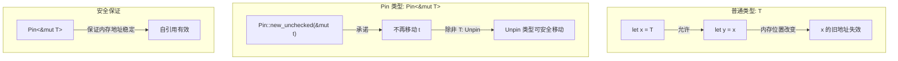
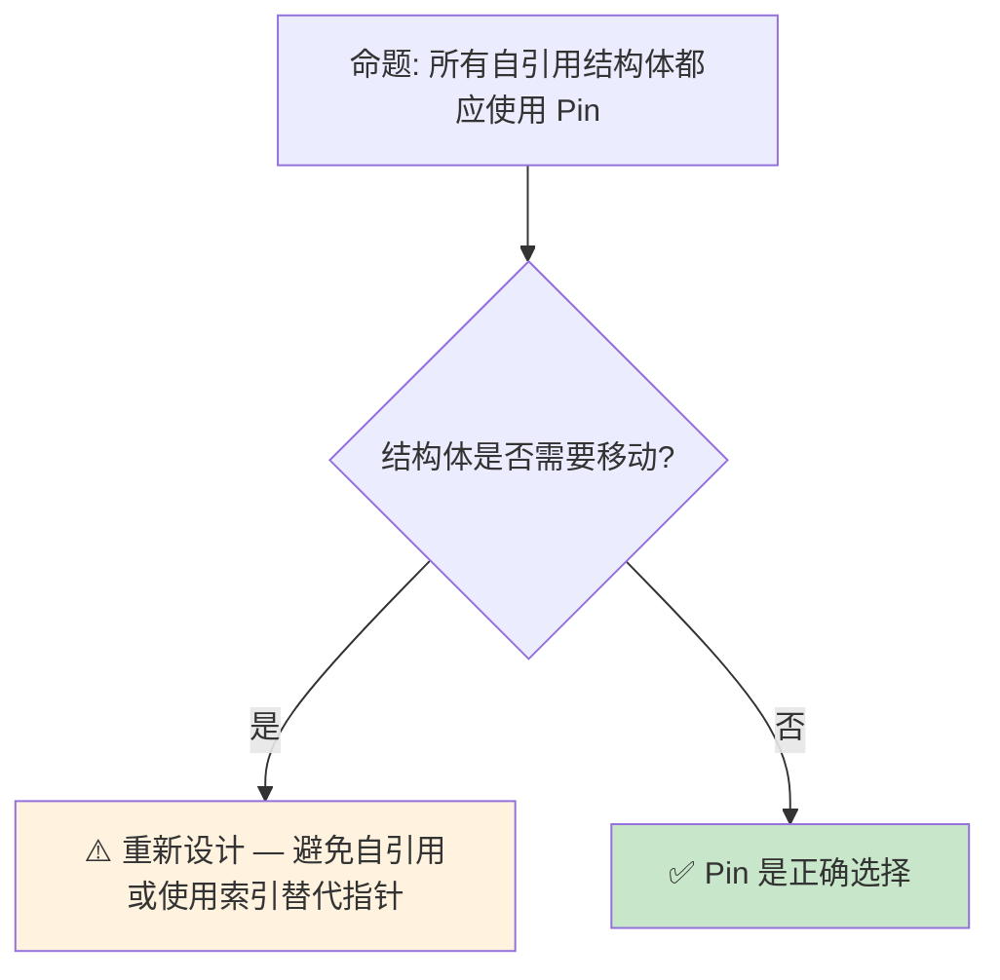

# Pin 与 Unpin：自引用类型的不动性保证

> **Bloom 层级**: 分析 → 评价
> **定位**: 深入分析 Rust 中 **Pin<&mut T>** 和 **Unpin** 的设计动机——解决自引用类型（self-referential structs）在内存移动时的安全问题，探讨 Pin 与 Future、Generator 的交互，以及 async/await 的状态机实现。
> **前置概念**: [Async](./02_async.md) · [Ownership](../01_foundation/01_ownership.md) · [Generics](../02_intermediate/02_generics.md)
> **后置概念**: [Unsafe](./03_unsafe.md) · [Gen Blocks](../07_future/15_gen_blocks_preview.md)

---

> **来源**: [Rust Reference — Pin](https://doc.rust-lang.org/reference/types/pin.html) ·
> [TRPL Ch17 — Pin](https://doc.rust-lang.org/book/ch17-04-pin.html) ·
> [Rustonomicon — Pin](https://doc.rust-lang.org/nomicon/pinning.html) ·
> [RFC 2349 — Pin](https://github.com/rust-lang/rfcs/pull/2349) ·
> [Tracking Issue #55766](https://github.com/rust-lang/rust/issues/55766)

## 📑 目录
>
> [来源: [Rust Reference](https://doc.rust-lang.org/reference/)]

- [Pin 与 Unpin：自引用类型的不动性保证](#pin-与-unpin自引用类型的不动性保证)
  - [📑 目录](#-目录)
  - [一、核心概念](#一核心概念)
    - [1.1 问题：自引用类型的移动陷阱](#11-问题自引用类型的移动陷阱)
    - [1.2 Pin 的设计：承诺不再移动](#12-pin-的设计承诺不再移动)
    - [1.3 Unpin：大多数类型的默认](#13-unpin大多数类型的默认)
  - [二、技术细节](#二技术细节)
    - [2.1 Pin API 的契约](#21-pin-api-的契约)
    - [2.2 自引用结构体的安全构建](#22-自引用结构体的安全构建)
    - [2.3 与 async/await 的关系](#23-与-asyncawait-的关系)
  - [三、使用模式](#三使用模式)
  - [四、反命题与边界分析](#四反命题与边界分析)
    - [4.1 反命题树](#41-反命题树)
    - [4.2 边界极限](#42-边界极限)
  - [五、常见陷阱](#五常见陷阱)
  - [六、来源与延伸阅读](#六来源与延伸阅读)
  - [相关概念文件](#相关概念文件)

---

## 一、核心概念
>
> [来源: [Rust Reference](https://doc.rust-lang.org/reference/)]
>
> [来源: [Rust Reference](https://doc.rust-lang.org/reference/)]

### 1.1 问题：自引用类型的移动陷阱
> **[来源: [Rust Reference](https://doc.rust-lang.org/reference/)]**

自引用结构体（self-referential struct）在 Rust 中是一个经典的安全难题：

```rust
// 概念示例（不安全代码）
struct SelfRef {
    data: String,
    ptr_to_data: *const u8,  // 指向 data 内部的指针
}

let mut s = SelfRef {
    data: String::from("hello"),
    ptr_to_data: std::ptr::null(),
};
s.ptr_to_data = s.data.as_ptr();  // 自引用

let s2 = s;  // ❌ 移动后 ptr_to_data 指向旧地址！
// s2.ptr_to_data 现在悬空
```

> **核心问题**: Rust 默认允许移动值，但自引用结构体移动后，内部指针变成**悬空指针**（dangling pointer）。这在 C++ 中也是常见问题（move 后自引用失效）。
> [来源: [Rustonomicon — Pinning](https://doc.rust-lang.org/nomicon/pinning.html)]
> [来源: [Rust Reference — Pin](https://doc.rust-lang.org/reference/types/pin.html)]

---

### 1.2 Pin 的设计：承诺不再移动
> **[来源: [The Rust Programming Language](https://doc.rust-lang.org/book/)]**



> **认知功能**: 此图展示 Pin 的**核心契约**——通过类型系统承诺值不会被移动，从而使自引用在安全前提下成为可能。
> [来源: [RFC 2592 — Pin]]
> **使用建议**: 绝大多数 Rust 代码不需要直接操作 Pin。Pin 主要在 async/await、生成器和特定 unsafe 代码中使用。
> **关键洞察**: Pin 不是"阻止移动"，而是**"承诺不移动"**——如果违反了承诺（通过 unsafe），结果是 UB。
> [来源: [Rust Reference — Pin](https://doc.rust-lang.org/reference/types/pin.html)]
> [来源: [RFC 2349 — Pin](https://github.com/rust-lang/rfcs/pull/2349)]

---

### 1.3 Unpin：大多数类型的默认
> **[来源: [Rust Standard Library](https://doc.rust-lang.org/std/)]**

```text
Unpin trait 的语义:

  定义: 如果 T: Unpin，则 Pin<&mut T> 可以安全地解包为 &mut T
  含义: Unpin 类型即使被 Pin 包裹，也可以移动

  自动实现:
  ├── 几乎所有类型自动实现 Unpin
  ├── 包含自引用的类型（如 async Future）不实现 Unpin
  └── 可通过 !Unpin 显式标记（unstable）

  常见 Unpin 类型:
  ├── 所有标量类型（i32, bool, f64...）
  ├── String, Vec<T>
  ├── Box<T>（无论 T 是否 Unpin）
  └── 不包含自引用的结构体

  常见 !Unpin 类型:
  ├── async fn 生成的 Future
  ├── gen block 生成的 Generator
  ├── 手动实现的自引用结构体
  └── PhantomPinned（显式标记 !Unpin）
```

> **Unpin 洞察**: Unpin 是 Rust 的**默认安全网**——大多数类型自动 Unpin，只有在真正需要 Pin 保证的类型（如 Future）才不实现 Unpin。这避免了 Pin 污染普通代码。
> [来源: [std::marker::Unpin](https://doc.rust-lang.org/std/marker/trait.Unpin.html)]
> [来源: [TRPL Ch17 — Pin](https://doc.rust-lang.org/book/ch17-04-pin.html)]

---

## 二、技术细节
>
> [来源: [Rust Reference](https://doc.rust-lang.org/reference/)]

### 2.1 Pin API 的契约
> **[来源: [Rustonomicon](https://doc.rust-lang.org/nomicon/)]**

```rust,ignore
use std::pin::Pin;

// Pin 的创建（safe）
let mut data = String::from("hello");
let pinned: Pin<&mut String> = Pin::new(&mut data);
// String: Unpin，所以 Pin<&mut String> 可以解包
let s: &mut String = Pin::into_inner(pinned);

// Pin 的创建（unsafe — 用于 !Unpin 类型）
let mut future = MyAsyncFuture::new();
let pinned: Pin<&mut MyAsyncFuture> = unsafe {
    Pin::new_unchecked(&mut future)
};
// MyAsyncFuture: !Unpin，必须通过 unsafe 创建 Pin
// 创建者承诺: future 在 drop 前不会被移动

// Pin 上的操作
impl<P: Deref> Pin<P> {
    // 安全方法（要求 P::Target: Unpin）
    pub fn into_inner(pin: Pin<P>) -> P { ... }

    // 不安全方法（!Unpin 类型专用）
    pub unsafe fn new_unchecked(pointer: P) -> Pin<P> { ... }
}
```

> **API 设计**: Pin 的 API 区分了**Unpin**和**!Unpin**类型——Unpin 类型操作安全且无需 unsafe；!Unpin 类型需要 unsafe 创建，但创建后的操作是安全的。
> [来源: [std::pin::Pin](https://doc.rust-lang.org/std/pin/struct.Pin.html)]
> [来源: [Rustonomicon — Pinning](https://doc.rust-lang.org/nomicon/pinning.html)]

---

### 2.2 自引用结构体的安全构建
> **[来源: [Rust By Example](https://doc.rust-lang.org/rust-by-example/)]**

```rust,ignore
use std::pin::Pin;
use std::marker::PhantomPinned;

struct SelfReferential {
    data: String,
    // PhantomPinned 使类型 !Unpin
    _pin: PhantomPinned,
}

impl SelfReferential {
    fn new(data: String) -> Pin<Box<Self>> {
        let mut boxed = Box::new(SelfReferential {
            data,
            _pin: PhantomPinned,
        });

        // 初始化自引用（必须在 Pin 之前完成）
        // 或者使用 Pin::into_inner_unchecked 初始化

        // 安全: Box 在堆上，Pin 后不会被移动
        unsafe { Pin::new_unchecked(boxed) }
    }
}

// 使用 Pin 访问
impl SelfReferential {
    fn get_data(self: Pin<&Self>) -> &str {
        &self.data
    }
}
```

> **构建模式**: 自引用结构体的安全构建需要**两步初始化**——先在堆上分配（Box），然后 Pin，最后初始化自引用字段。`pin-project` crate 简化了这一过程。
> [来源: [Rustonomicon — Pinning](https://doc.rust-lang.org/nomicon/pinning.html)]
> [来源: [pin-project Documentation](https://docs.rs/pin-project/latest/pin_project/)]

---

### 2.3 与 async/await 的关系
> **[来源: [Rust Cookbook](https://rust-lang-nursery.github.io/rust-cookbook/)]**

```text
async/await 与 Pin 的关系:

  async fn 生成的状态机:
  ├── 编译器将 async fn 转换为结构体 + Future impl
  ├── 状态机可能包含自引用（如跨 await 点的引用）
  ├── 因此 async Future 是 !Unpin
  └── Future::poll 要求 Pin<&mut Self>

  为什么 Future::poll 需要 Pin?
  ├── async 状态机可能在 .await 点持有对局部变量的引用
  ├── 如果 Future 被移动，这些引用变成悬空
  ├── Pin 保证 Future 在内存中不动
  └── 因此跨 await 的引用始终有效

  async 块的内存布局:
  struct __AsyncFuture_1<'a> {
      state: u8,
      // 可能包含自引用字段
      local_ref: &'a str,
      _pin: PhantomPinned,
  }
```

> **async 洞察**: Pin 是 async/await 的**底层基石**——没有 Pin，异步状态机就无法安全地持有跨 await 点的引用。Pin 使 Rust 的 async 实现既安全又零成本。
> [来源: [Async Working Group — Pin](https://rust-lang.github.io/async-fundamentals-initiative/)]
> [来源: [RFC 2394 — Async/Await](https://rust-lang.github.io/rfcs/2394-async_await.html)]

---

## 三、使用模式
>
> [来源: [Rust Reference](https://doc.rust-lang.org/reference/)]
>
> [来源: [Rust Reference](https://doc.rust-lang.org/reference/)]

```text
模式 1: 在 safe 代码中使用 Pin（Unpin 类型）
  let mut x = 42;
  let pinned = Pin::new(&mut x);
  // 对 i32 等 Unpin 类型，Pin 是透明的
  // 可直接访问: *pinned

模式 2: async 函数中的 self: Pin<&mut Self>
  impl Future for MyFuture {
      fn poll(self: Pin<&mut Self>, cx: &mut Context) -> Poll<Self::Output> {
          // self 是 Pin<&mut Self>，保证内存不动
          let this = unsafe { self.get_unchecked_mut() };
          // 现在可以 &mut 访问内部字段
      }
  }

模式 3: pin-project 简化自引用结构体
  use pin_project::pin_project;

  #[pin_project]
  struct MyStruct {
      #[pin]  // 标记为 Pin 字段
      self_ref: *const u8,
      data: String,
  }

模式 4: 堆分配 + Pin
  let boxed: Pin<Box<MyFuture>> = Box::pin(MyFuture::new());
  // Box::pin 是 safe 的，因为 Box 在堆上

模式 5: 栈上的 Pin（临时的）
  futures::pin_mut!(future);
  // 宏在栈上创建 Pin<&mut T>，生命周期受限
```

> **最佳实践**: 绝大多数场景使用 `Box::pin` 或 `pin_mut!` 宏；手写 unsafe Pin 代码只在实现自定义 Future/Generator 时需要。
> [来源: [pin-project Documentation](https://docs.rs/pin-project/latest/pin_project/)]
> [来源: [Rust API Guidelines — Pin](https://rust-lang.github.io/api-guidelines/predictability.html)]

---

## 四、反命题与边界分析
>
> [来源: [Rust Reference](https://doc.rust-lang.org/reference/)]
>
> [来源: [Rust Reference](https://doc.rust-lang.org/reference/)]

### 4.1 反命题树
> **[来源: [crates.io](https://crates.io/)]**



> **认知功能**: 此决策树判断是否使用 Pin。核心判断标准是**是否真的需要自引用且不需要移动**。
> [来源: [RFC 2592 — Pin]]
> **使用建议**: 优先避免自引用设计；必须自引用时用 Pin；需要移动时重新设计（如使用索引替代指针）。
> **关键洞察**: Pin 是**最后手段**而非首选方案。大多数"需要自引用"的场景可以通过重新设计消除自引用需求。
> [来源: [Rust API Guidelines — Pin](https://rust-lang.github.io/api-guidelines/predictability.html)]
> [来源: [TRPL Ch17 — Pin](https://doc.rust-lang.org/book/ch17-04-pin.html)]

---

### 4.2 边界极限
> **[来源: [docs.rs](https://docs.rs/)]**

```text
边界 1: Pin 不保证堆分配
├── Pin<&mut T> 可以指向栈或堆
├── 只有 Pin<Box<T>> 保证堆分配
├── 移动 Box 不改变 T 的地址（Box 是指针）
└── 这是 Box::pin 安全的原因

边界 2: Pin 与 Drop
├── Pin 的类型保证: 如果 T: !Unpin，则 Pin<&mut T> 在 drop 前不会被移动
├── 但 drop 本身可以移动值（如果 T: Unpin）
└── Drop::drop 接收 &mut self，不是 Pin<&mut Self>

边界 3: Pin 与 UnsafeCell/RefCell
├── Pin<&mut RefCell<T>> 允许通过 RefCell 获取 &mut T
├── 这可能破坏 Pin 的不动性保证（如果 T: !Unpin）
├── 这是 RefCell 的 Pin 投影不安全的原因
└── 使用 pin-project 处理这类场景

边界 4: 协程/生成器中的 Pin
├── gen block（nightly）生成的 Generator 也是 !Unpin
├── yield 点可能持有自引用
├── Pin 保证生成器在 yield 之间不被移动
```

> **边界要点**: Pin 的边界主要与**内部可变性**和**Drop**交互相关。这些边界反映了 Pin 契约的复杂性——它不仅是一个类型包装器，更是一个**内存地址稳定性的语义保证**。
> [来源: [Rustonomicon — Pinning](https://doc.rust-lang.org/nomicon/pinning.html)]
> [来源: [Rust Reference — Pin](https://doc.rust-lang.org/reference/types/pin.html)]

---

## 五、常见陷阱
>
> [来源: [Rust Reference](https://doc.rust-lang.org/reference/)]

```text
陷阱 1: 误以为 Pin 阻止所有移动
  ❌ let mut x = MyFuture::new();
     let pinned = Pin::new(&mut x);  // 编译错误！MyFuture: !Unpin
     // Pin::new 要求 T: Unpin

  ✅ let mut x = MyFuture::new();
     let pinned = Box::pin(x);  // ✅ Box::pin 安全
     // 或: unsafe { Pin::new_unchecked(&mut x) }

陷阱 2: 从 Pin 获取 &mut 后移动
  ❌ let mut pinned = Box::pin(MyStruct::new());
     let r: &mut MyStruct = unsafe { pinned.as_mut().get_unchecked_mut() };
     let _moved = *r;  // ❌ 移动了 !Unpin 值！

  ✅ 只能通过 Pin 的投影访问字段
     使用 pin-project 或手动 unsafe 投影

陷阱 3: 忘记 PhantomPinned
  ❌ struct SelfRef { data: String, ptr: *const u8 }
     // 这个类型是 Unpin 的！
     // 用户可以安全 Pin::new(&mut s) 然后移动

  ✅ struct SelfRef {
       data: String,
       ptr: *const u8,
       _pin: PhantomPinned,
     }
     // 显式标记 !Unpin

陷阱 4: Pin 投影错误
  ❌ impl MyStruct {
       fn field(self: Pin<&Self>) -> &String {
         &self.field  // 如果 field 不是 Pin 字段，这是安全的
         // 但如果 field 是 Pin 字段，需要投影
       }
     }

  ✅ 使用 pin-project 处理结构体字段投影
```

> **陷阱总结**: Pin 的大多数陷阱源于**对 Unpin/!Unpin 的误解**和**不安全的投影操作**。理解 Pin 的语义契约是避免这些陷阱的关键。
> [来源: [Rust Compiler Error Index](https://doc.rust-lang.org/error_codes/index.html)]
> [来源: [Rustonomicon — Pinning](https://doc.rust-lang.org/nomicon/pinning.html)]

---

## 六、来源与延伸阅读
>
> [来源: [Rust Reference](https://doc.rust-lang.org/reference/)]

| 来源 | 可信度 | 说明 |
|:---|:---:|:---|
| [Rust Reference — Pin](https://doc.rust-lang.org/reference/types/pin.html) | ✅ 一级 | 官方语言参考 |
| [TRPL Ch17 — Pin](https://doc.rust-lang.org/book/ch17-04-pin.html) | ✅ 一级 | Pin 入门指南 |
| [Rustonomicon — Pinning](https://doc.rust-lang.org/nomicon/pinning.html) | ✅ 一级 | 深入 Pin 分析 |
| [RFC 2349 — Pin](https://github.com/rust-lang/rfcs/pull/2349) | ✅ 一级 | Pin 设计 RFC |
| [pin-project](https://docs.rs/pin-project/latest/pin_project/) | ✅ 一级 | 自引用结构体辅助 crate |
| [std::pin::Pin](https://doc.rust-lang.org/std/pin/struct.Pin.html) | ✅ 一级 | 标准库 API |
| [std::marker::Unpin](https://doc.rust-lang.org/std/marker/trait.Unpin.html) | ✅ 一级 | Unpin 标准库 API |
| [RFC 2394 — Async/Await](https://rust-lang.github.io/rfcs/2394-async_await.html) | ✅ 一级 | async 状态机 RFC |

---

## 相关概念文件
>
> [来源: [Rust Reference](https://doc.rust-lang.org/reference/)]
>
> [来源: [Rust Reference](https://doc.rust-lang.org/reference/)]

- [Async](./02_async.md) — 异步编程（Pin 的核心用例）
- [Unsafe](./03_unsafe.md) — unsafe Rust
- [Ownership](../01_foundation/01_ownership.md) — 所有权模型
- [Gen Blocks](../07_future/15_gen_blocks_preview.md) — 生成器（也是 !Unpin）

---

> **权威来源**: [Rust Reference](https://doc.rust-lang.org/reference/), [The Rust Programming Language](https://doc.rust-lang.org/book/), [Rustonomicon](https://doc.rust-lang.org/nomicon/)
>
> **权威来源对齐变更日志**: 2026-05-21 创建，对齐 Rust 1.95.0+ (Edition 2024)

**文档版本**: 1.0
**对应 Rust 版本**: 1.95.0+ (Edition 2024)
**最后更新**: 2026-05-21
**状态**: ✅ 概念文件创建完成

---

## 权威来源索引

> **[来源: [Rust Reference](https://doc.rust-lang.org/reference/)]**
>
> **[来源: [The Rust Programming Language](https://doc.rust-lang.org/book/)]**
>
> **[来源: [Rust Standard Library](https://doc.rust-lang.org/std/)]**
>

---

> **[来源: [Rust Reference](https://doc.rust-lang.org/reference/)]**

> **[来源: [The Rust Programming Language](https://doc.rust-lang.org/book/)]**

> **[来源: [Rust Standard Library](https://doc.rust-lang.org/std/)]**

> **[来源: [Rustonomicon](https://doc.rust-lang.org/nomicon/)]**

> **[来源: [Rust By Example](https://doc.rust-lang.org/rust-by-example/)]**

> **[来源: [Rust Cookbook](https://rust-lang-nursery.github.io/rust-cookbook/)]**

> **[来源: [crates.io](https://crates.io/)]**

> **[来源: [docs.rs](https://docs.rs/)]**

> **[来源: [This Week in Rust](https://this-week-in-rust.org/)]**

> **[来源: [Rust RFCs](https://rust-lang.github.io/rfcs/)]**

> **[来源: [Rust Reference](https://doc.rust-lang.org/reference/)]**

> **[来源: [The Rust Programming Language](https://doc.rust-lang.org/book/)]**

> **[来源: [Rust Standard Library](https://doc.rust-lang.org/std/)]**

> **[来源: [Rustonomicon](https://doc.rust-lang.org/nomicon/)]**

> **[来源: [Rust By Example](https://doc.rust-lang.org/rust-by-example/)]**

> **[来源: [Rust Cookbook](https://rust-lang-nursery.github.io/rust-cookbook/)]**

> **[来源: [crates.io](https://crates.io/)]**

> **[来源: [docs.rs](https://docs.rs/)]**

> **[来源: [This Week in Rust](https://this-week-in-rust.org/)]**

> **[来源: [Rust RFCs](https://rust-lang.github.io/rfcs/)]**

> **[来源: [Rust Reference](https://doc.rust-lang.org/reference/)]**

> **[来源: [The Rust Programming Language](https://doc.rust-lang.org/book/)]**

> **[来源: [Rust Standard Library](https://doc.rust-lang.org/std/)]**

> **[来源: [Rustonomicon](https://doc.rust-lang.org/nomicon/)]**

---

> **[来源: [Rust Reference](https://doc.rust-lang.org/reference/)]**

> **[来源: [The Rust Programming Language](https://doc.rust-lang.org/book/)]**

> **[来源: [Rust Standard Library](https://doc.rust-lang.org/std/)]**

> **[来源: [Rustonomicon](https://doc.rust-lang.org/nomicon/)]**

> **[来源: [Rust By Example](https://doc.rust-lang.org/rust-by-example/)]**

> **[来源: [Rust Cookbook](https://rust-lang-nursery.github.io/rust-cookbook/)]**

> **[来源: [crates.io](https://crates.io/)]**

> **[来源: [docs.rs](https://docs.rs/)]**

> **[来源: [This Week in Rust](https://this-week-in-rust.org/)]**

---

> **[来源: [Rust Reference](https://doc.rust-lang.org/reference/)]**

> **[来源: [The Rust Programming Language](https://doc.rust-lang.org/book/)]**

> **[来源: [Rust Standard Library](https://doc.rust-lang.org/std/)]**

> **[来源: [Rustonomicon](https://doc.rust-lang.org/nomicon/)]**

