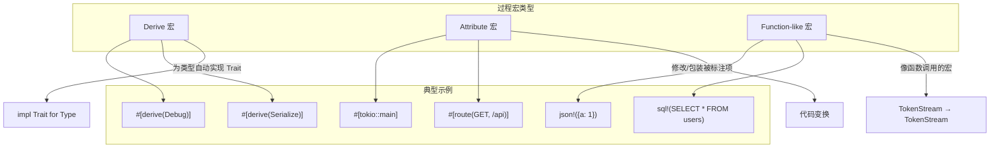
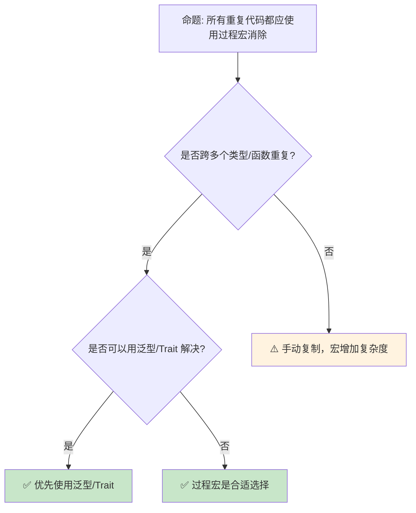

> **内容分级**: [专家级]

# 过程宏：编译期代码生成的元编程工具
>
> **EN**: Procedural Macros
> **Summary**: Authoritative guide to procedural macros: derive, attribute, and function-like macros.
> **📎 交叉引用**
>
> 本主题在 knowledge 中有系统化的知识索引：[过程宏](../../knowledge/03_advanced/macros/02_procedural.md)
> **受众**: [专家]
> **Bloom 层级**: 分析 → 评价
> **定位**: 深入分析 Rust **过程宏（Procedural Macros）**的三种类型（derive、attribute、function-like）——它们的编译期执行模型、TokenStream 操作、卫生性（hygiene）保证，以及与 `macro_rules!` 的本质差异。
> **前置概念**: [Macros](./04_macros.md) · [Trait](./../02_intermediate/01_traits.md) · [Type System](../01_foundation/04_type_system.md)
> **后置概念**: [Serde Patterns](../02_intermediate/09_serde_patterns.md) · [Builder Pattern](../06_ecosystem/02_patterns.md)

---

> **来源**: [Rust Reference — Procedural Macros](https://doc.rust-lang.org/reference/procedural-macros.html) ·
> [TRPL Ch19 — Macros](https://doc.rust-lang.org/book/ch19-06-macros.html) ·
> [proc-macro2 crate](https://docs.rs/proc-macro2/latest/proc_macro2/) ·
> [syn crate](https://docs.rs/syn/latest/syn/) ·
> [quote crate](https://docs.rs/quote/latest/quote/) ·
> [RFC 1566 — Proc Macro](https://github.com/rust-lang/rfcs/pull/1566)

> **对应 Crate**: [`c11_macro_system_proc`](../../crates/c11_macro_system_proc/)
> **对应练习**: [`exercises/src/macros/`](../../exercises/src/macros/)

## 📑 目录

- [过程宏：编译期代码生成的元编程工具](#过程宏编译期代码生成的元编程工具)
  - [📑 目录](#-目录)
  - [一、核心概念](#一核心概念)
    - [1.1 过程宏 vs macro\_rules](#11-过程宏-vs-macro_rules)
    - [1.2 三种过程宏类型](#12-三种过程宏类型)
    - [1.3 编译期执行模型](#13-编译期执行模型)
  - [二、技术细节](#二技术细节)
    - [2.1 TokenStream 操作](#21-tokenstream-操作)
    - [2.2 syn + quote 工作流](#22-syn--quote-工作流)
    - [2.3 卫生性与 Span](#23-卫生性与-span)
  - [三、常见模式](#三常见模式)
  - [四、反命题与边界分析](#四反命题与边界分析)
    - [4.1 反命题树](#41-反命题树)
    - [4.2 边界极限](#42-边界极限)
  - [五、常见陷阱](#五常见陷阱)
    - [编译错误示例](#编译错误示例)
  - [六、来源与延伸阅读](#六来源与延伸阅读)
  - [相关概念文件](#相关概念文件)
  - [逆向推理链（Backward Reasoning）](#逆向推理链backward-reasoning)
  - [权威来源索引](#权威来源索引)
    - [10.5 边界测试：过程宏的 `Span` 与错误定位精度（编译错误/调试困难）](#105-边界测试过程宏的-span-与错误定位精度编译错误调试困难)
    - [10.3 边界测试：过程宏的 hygiene 与路径解析（编译错误）](#103-边界测试过程宏的-hygiene-与路径解析编译错误)
    - [10.4 边界测试：proc\_macro 的 TokenStream 与 hygiene 标识符生成（编译错误）](#104-边界测试proc_macro-的-tokenstream-与-hygiene-标识符生成编译错误)
    - [10.6 边界测试：不可变借用与可变借用的冲突](#106-边界测试不可变借用与可变借用的冲突)
  - [参考来源](#参考来源)
  - [嵌入式测验（Embedded Quiz）](#嵌入式测验embedded-quiz)
    - [测验 1：过程宏的类型（理解层）](#测验-1过程宏的类型理解层)
    - [测验 2：过程宏的执行时机（应用层）](#测验-2过程宏的执行时机应用层)
    - [测验 3：syn + quote 工作流（应用层）](#测验-3syn--quote-工作流应用层)
    - [测验 4：卫生性（Hygiene）（分析层）](#测验-4卫生性hygiene分析层)
    - [测验 5：Derive 宏的限制（分析层）](#测验-5derive-宏的限制分析层)
  - [认知路径](#认知路径)
    - [核心推理链](#核心推理链)
    - [反命题与边界](#反命题与边界)
  - [实践](#实践)
    - [对应代码示例](#对应代码示例)
    - [建议练习](#建议练习)
  - [导航：下一步去哪？](#导航下一步去哪)

---

## 一、核心概念

### 1.1 过程宏 vs macro_rules

```text
两种宏系统的本质差异:

  macro_rules!（声明式宏）:
  ├── 基于模式匹配的文本替换
  ├── 在编译器的宏展开阶段执行
  ├── 输入/输出都是 TokenStream
  ├── 无法访问类型信息
  ├── 示例: vec![1, 2, 3]、println!("{}", x)
  └── 定义在调用 crate 内

  过程宏（Procedural Macros）:
  ├── 基于 Rust 函数的程序化代码生成
  ├── 在编译器的宏展开阶段执行（独立的编译单元）
  ├── 输入/输出都是 TokenStream
  ├── 无法访问类型信息（与 macro_rules! 相同）
  ├── 示例: #[derive(Debug)]、#[tokio::main]、json!({"a": 1})
  └── 必须定义在独立的 proc-macro crate 中

  关键差异:
  ┌─────────────────┬─────────────────────┬─────────────────────┐
  │ 特性            │ macro_rules!        │ 过程宏              │
  ├─────────────────┼─────────────────────┼─────────────────────┤
  │ 定义位置        │ 任何 crate          │ 独立的 proc-macro   │
  │                 │                     │ crate               │
  ├─────────────────┼─────────────────────┼─────────────────────┤
  │ 实现方式        │ 模式匹配规则        │ Rust 函数           │
  ├─────────────────┼─────────────────────┼─────────────────────┤
  │ 表达能力        │ 有限（声明式）      │ 图灵完备            │
  ├─────────────────┼─────────────────────┼─────────────────────┤
  │ 错误信息        │ 可能晦涩            │ 可控（可定制）       │
  ├─────────────────┼─────────────────────┼─────────────────────┤
  │ 开发复杂度      │ 低                  │ 高（需 syn/quote）  │
  └─────────────────┴─────────────────────┴─────────────────────┘
```

> **认知功能**: 此对比揭示两种宏系统的**设计权衡**——macro_rules! 简单但受限，过程宏强大但复杂。选择取决于元编程任务的复杂度。
> [来源: [TRPL](https://doc.rust-lang.org/book/ch20-05-macros.html)]
> **关键洞察**: 过程宏不是 macro_rules! 的替代品，而是**互补工具**——简单代码生成用 macro_rules!，复杂逻辑（如 derive）用过程宏。
> [来源: [Rust Reference — Macros](https://doc.rust-lang.org/reference/macros.html)]

---

### 1.2 三种过程宏类型
>



> **认知功能**: 此图展示三种过程宏的**应用场景**。Derive 宏为类型自动生成 Trait 实现；Attribute 宏修改被标注的项；Function-like 宏在调用点展开。
> **使用建议**: 80% 的过程宏需求是 Derive 宏（Macro）；Attribute 宏用于框架级的代码变换；Function-like 宏用于 DSL。
> **关键洞察**: 三种宏的**编译期执行模型相同**——都是 `TokenStream → TokenStream` 的函数，区别在于调用语法和输入内容的结构。
> [来源: [Rust Reference — Procedural Macros](https://doc.rust-lang.org/reference/procedural-macros.html)]

---

### 1.3 编译期执行模型
>

```text
过程宏的编译流程:

  1. 编译 proc-macro crate
     ├── 编译为动态库 (.so / .dll / .dylib)
     └── 导出特定签名的函数

  2. 编译使用宏的 crate
     ├── 编译器遇到 #[derive(...)] 或宏调用
     ├── 加载对应的 proc-macro 动态库
     ├── 调用导出函数，传入 TokenStream
     ├── 宏函数返回新的 TokenStream
     └── 编译器将返回的 TokenStream 插入 AST

  3. 关键限制
     ├── 宏在编译期执行，无运行时信息
     ├── 宏无法访问类型系统（无法知道字段的具体类型）
     ├── 宏只能操作 TokenStream（文本层面）
     └── 宏的执行不能访问文件系统或网络（沙箱化）

  4. 编译器与宏的交互
     ┌─────────────────────────────────────────────┐
     │  用户代码: #[derive(Debug)] struct Foo;     │
     │                     ↓                       │
     │  编译器: 加载 derive_debug 动态库           │
     │                     ↓                       │
     │  宏函数: fn derive(input: TokenStream)      │
     │          → TokenStream { ... }              │
     │                     ↓                       │
     │  返回: impl Debug for Foo { ... }           │
     │                     ↓                       │
     │  编译器: 将返回的 TokenStream 合并到 AST    │
     └─────────────────────────────────────────────┘
```

> **执行模型**: 过程宏在**编译期**作为**编译器的插件**执行——它们是普通的 Rust 函数，但运行在编译器的上下文中，操作 TokenStream 而非值。
> [来源: [rustc-dev-guide — Macros](https://rustc-dev-guide.rust-lang.org/macro-expansion.html)]

---

## 二、技术细节

### 2.1 TokenStream 操作
>

```rust,ignore
// 过程宏的基本签名

// Derive 宏
#[proc_macro_derive(MyTrait)]
pub fn my_trait_derive(input: TokenStream) -> TokenStream {
    // input 是 struct/enum 的 TokenStream
    // 返回 impl MyTrait for Type { ... }
}

// Attribute 宏
#[proc_macro_attribute]
pub fn my_attr(args: TokenStream, input: TokenStream) -> TokenStream {
    // args: 属性参数，如 #[my_attr(arg1, arg2)]
    // input: 被标注的项的 TokenStream
    // 返回修改后的 TokenStream
}

// Function-like 宏
#[proc_macro]
pub fn my_macro(input: TokenStream) -> TokenStream {
    // input: 宏调用的参数，如 my_macro!(1 + 2)
    // 返回展开的 TokenStream
}

// TokenStream 的本质:
// - 由 TokenTree 组成的序列
// - TokenTree = Group(括号包裹) | Ident(标识符) | Punct(标点) | Literal(字面量)
// - 不解析语义，只操作语法树
```

> **TokenStream**: 过程宏的输入/输出都是 `TokenStream`——它是**语法树**而非字符串。这保证了宏生成的代码总是语法合法的（但不一定语义合法）。
> [来源: [std::proc_macro::TokenStream](https://doc.rust-lang.org/proc_macro/struct.TokenStream.html)]

---

### 2.2 syn + quote 工作流
>

```rust,ignore
// 典型 derive 宏实现（使用 syn + quote）

use proc_macro::TokenStream;
use quote::quote;
use syn::{parse_macro_input, DeriveInput};

#[proc_macro_derive(HelloMacro)]
pub fn hello_macro_derive(input: TokenStream) -> TokenStream {
    // 1. 解析 TokenStream 为 AST
    let input = parse_macro_input!(input as DeriveInput);

    // 2. 提取信息
    let name = &input.ident;
    let (impl_generics, ty_generics, where_clause) = input.generics.split_for_impl();

    // 3. 生成代码（quote! 宏）
    let expanded = quote! {
        impl #impl_generics HelloMacro for #name #ty_generics #where_clause {
            fn hello() {
                println!("Hello, Macro! My name is {}");
            }
        }
    };

    // 4. 返回 TokenStream
    TokenStream::from(expanded)
}

// syn crate 的作用:
// - 将 TokenStream 解析为强类型的 AST（DeriveInput、ItemFn 等）
// - 提供访问和修改 AST 的 API
// - 处理复杂的语法（泛型、where 子句、生命周期等）

// quote! 宏的作用:
// - 将 Rust 代码模板转换为 TokenStream
// - 支持插值（#name）
// - 自动处理 hygiene（Span 保留）
```

> **syn + quote**: `syn` 和 `quote` 是过程宏开发的**事实标准**——syn 负责解析，quote 负责生成。没有它们，手动操作 TokenStream 极其繁琐。
> [来源: [syn Documentation](https://docs.rs/syn/latest/syn/)] · [来源: [quote Documentation](https://docs.rs/quote/latest/quote/)]

---

### 2.3 卫生性与 Span
>

```text
卫生性（Hygiene）: 宏生成的标识符不污染外部作用域

  Rust 的卫生性保证:
  ├── 宏生成的变量名不会与用户代码冲突
  ├── 宏内部使用的标识符在宏的上下文中解析
  └── 这与 C 预处理器（文本替换，无卫生性）有本质区别

  Span: Token 的源代码位置信息
  ├── 每个 Token 都有 Span，指向原始源代码位置
  ├── 错误信息使用 Span 定位到用户代码
  └── 宏生成的代码若无 Span，错误信息指向宏定义而非调用点

  示例:
  macro_rules! make_var {
      ($name:ident, $val:expr) => {
          let $name = $val;
      };
  }

  fn main() {
      make_var!(x, 42);
      println!("{}", x);  // ✅ 正常工作
  }
  // 即使 main 中已有 x，也不会冲突—— hygiene 保证

  过程宏中的 Span 控制:
  ├── 保留输入 Token 的 Span → 错误指向用户代码
  ├── 使用 Span::call_site() → 在调用点解析标识符
  └── 使用 Span::mixed_site() → 混合 hygiene（Edition 2021+）
```

> **卫生性洞察**: Rust 的**卫生宏**是语言设计的重要特性——它避免了 C 预处理器常见的命名冲突问题，使宏可以安全地在任意上下文中使用。
> [来源: [Rust Reference — Hygiene](https://doc.rust-lang.org/reference/macros-by-example.html#hygiene)]

---

## 三、常见模式

```text
模式 1: Derive 宏（为类型自动实现 Trait）
  #[derive(Debug, Clone, Serialize)]
  struct User { name: String, age: u32 }
  // 编译器为 User 生成 Debug + Clone + Serialize 的 impl

模式 2: Builder Derive
  #[derive(Builder)]
  struct Config {
      host: String,
      port: u16,
  }
  // 生成 ConfigBuilder，支持链式调用

模式 3: Attribute 宏（函数包装）
  #[tokio::main]
  async fn main() { ... }
  // 展开为 fn main() { tokio::runtime::Runtime::new().block_on(async { ... }) }

模式 4: Attribute 宏（路由注册）
  #[route(GET, "/api/users")]
  async fn get_users() -> Json<Vec<User>> { ... }
  // 在编译期收集路由信息，生成注册代码

模式 5: Function-like 宏（DSL）
  let doc = html! {
      <div class="container">
          <h1>{"Hello"}</h1>
      </div>
  };
  // 编译期验证 HTML 结构，生成构建器代码

模式 6: 自定义序列化格式
  #[derive(CustomFormat)]
  #[custom(format = "csv")]
  struct Record { id: u32, name: String }
  // 生成自定义格式的序列化/反序列化代码
```

> **模式总结**: 过程宏的**核心价值**是消除 boilerplate——将重复的、模式化的代码生成委托给编译器，同时保持类型安全。
> [来源: [serde_derive Source](https://github.com/serde-rs/serde/tree/master/serde_derive)]

---

## 四、反命题与边界分析

### 4.1 反命题树
>



> **认知功能**: 此决策树判断是否应使用过程宏。核心原则是：**优先使用语言原生特性（泛型（Generics）、Trait），过程宏是最后手段**。
> **使用建议**: 80% 的"重复代码"可以用泛型解决；只有当模式跨越类型边界且无法抽象为 Trait 时，才考虑过程宏。
> **关键洞察**: 过程宏增加了**编译时间**和**调试复杂度**——只在 boilerplate 显著影响可维护性时使用。
> [来源: [Rust API Guidelines — Macros](https://rust-lang.github.io/api-guidelines//macros.html)]

---

### 4.2 边界极限
>

```text
边界 1: 无法访问类型信息
├── 过程宏只能看到 TokenStream，不知道类型的具体信息
├── #[derive(Serialize)] 不知道字段的具体类型是 String 还是 i32
├── syn 只能解析语法，不能进行类型检查
└── 限制: 不能根据字段类型做条件代码生成（除非通过属性参数传递）

边界 2: 编译时间影响
├── 每个 proc-macro crate 是独立的编译单元
├── syn 是大型 crate，增加了编译依赖
├── 复杂宏（如 serde_derive）显著增加编译时间
└── 缓解: 使用 proc-macro2 的 span  API 优化

边界 3: 错误信息质量
├── 宏生成的代码出错时，错误信息可能指向生成的代码
├── 用户难以理解宏内部的错误
├── 解决方案: 使用 Span 保留原始位置，提供有意义的错误信息
└── syn::Error 允许在特定 Span 上报告错误

边界 4: IDE 支持
├── 宏生成的代码在 IDE 中可能无法正确跳转/补全
├── rust-analyzer 支持 proc-macro 展开，但有限制
├── 复杂宏（如 rocket、actix-web 的路由宏）可能导致 IDE 性能问题
└── 缓解: 使用 rust-analyzer 的 expand macro 功能调试

边界 5: 递归限制
├── 宏展开有递归深度限制（默认 64）
├── 深度递归的宏可能导致编译错误
└── 可通过 #![recursion_limit = "256"] 增加
```

> **边界要点**: 过程宏的边界主要与**信息可用性**（无类型信息）、**编译性能**、**错误信息质量**和**工具链支持**相关。这些边界决定了过程宏的适用场景。
> [来源: [rustc-dev-guide — Proc Macros](https://rustc-dev-guide.rust-lang.org/macro-expansion.html)]

---

## 五、常见陷阱

```text
陷阱 1: 在宏中使用保留关键字
  ❌ quote! { impl #trait_name for #type_name { ... } }
     // trait_name 可能是 "type" 等保留字

  ✅ 使用 quote::format_ident! 或检查标识符合法性
     let ident = syn::Ident::new("valid_name", Span::call_site());

陷阱 2: 忽略泛型参数
  ❌ quote! { impl MyTrait for #name { ... } }
     // 对于泛型类型，缺少 <T> 参数

  ✅ 使用 split_for_impl 正确处理泛型
     let (impl_generics, ty_generics, where_clause) = generics.split_for_impl();
     quote! { impl #impl_generics MyTrait for #name #ty_generics #where_clause { ... } }

陷阱 3:  hygiene 问题导致标识符解析失败
  ❌ 宏生成代码中使用外部 crate 的类型
     // 如果用户在调用 crate 中没有导入该类型，编译失败

  ✅ 使用全限定路径
     quote! { ::std::vec::Vec::new() }

陷阱 4: 忘记处理错误
  ❌ let parsed = syn::parse(input).unwrap();
     // panic 在宏中会导致编译器崩溃

  ✅ 返回 syn::Error 作为 TokenStream
     match syn::parse(input) {
         Ok(parsed) => generate(parsed),
         Err(e) => e.to_compile_error().into(),
     }

陷阱 5: 过度复杂的宏
  ❌ 在宏中实现完整的 DSL 解析器
     // 维护困难，编译时间剧增

  ✅ 将复杂逻辑移到运行时库，宏只做简单的代码生成
```

> **陷阱总结**: 过程宏的陷阱主要与**标识符处理**、**泛型支持**、**卫生性**和**错误处理（Error Handling）**相关。遵循最佳实践可使宏更健壮、更易维护。
> [来源: [proc-macro-workshop](https://github.com/dtolnay/proc-macro-workshop)]

### 编译错误示例

```rust,compile_fail
// 错误: 在函数内部定义过程宏
fn main() {
    // ❌ 编译错误: 过程宏必须在 crate 根级别定义
    // #[proc_macro] 只能用于独立的 proc-macro crate
    #[proc_macro]
    pub fn my_macro(input: TokenStream) -> TokenStream {
        input
    }
}
```

> **修正**: 过程宏必须在独立的 `proc-macro = true` 的 crate 中定义，不能在普通函数内或同一个 crate 中使用。

```rust,compile_fail
use proc_macro::TokenStream;

// 错误: 过程宏函数签名不匹配
#[proc_macro_derive(MyTrait)]
pub fn derive_macro(input: TokenStream, extra: TokenStream) -> TokenStream {
    // ❌ 编译错误: derive 宏只能接受一个 TokenStream 参数
    input
}
```

> **修正**: `#[proc_macro_derive]` 函数必须恰好接受一个 `TokenStream` 参数。`#[proc_macro]` 接受一个，`#[proc_macro_attribute]` 接受两个（item 和 attributes）。

```rust,compile_fail
// 错误: 在 proc-macro crate 中使用非 proc_macro 导出
#[proc_macro]
pub fn my_macro(input: String) -> String {
    // ❌ 编译错误: 过程宏必须使用 `proc_macro::TokenStream`
    input
}
```

> **修正**: 过程宏必须使用 `proc_macro::TokenStream`（或 `proc_macro2::TokenStream`）作为输入和输出类型，不能使用 `String` 或其他类型。

---

## 六、来源与延伸阅读
>

| 来源 | 可信度 | 说明 |
|:---|:---:|:---|
| [Rust Reference — Procedural Macros](https://doc.rust-lang.org/reference/procedural-macros.html) | ✅ 一级 | 官方参考 |
| [TRPL — Macros](https://doc.rust-lang.org/book/ch19-06-macros.html) | ✅ 一级 | 入门指南 |
| [syn crate](https://docs.rs/syn/latest/syn/) | ✅ 一级 | AST 解析库 |
| [quote crate](https://docs.rs/quote/latest/quote/) | ✅ 一级 | 代码生成库 |
| [proc-macro2](https://docs.rs/proc-macro2/latest/proc_macro2/) | ✅ 一级 | TokenStream 抽象 |
| [proc-macro-workshop](https://github.com/dtolnay/proc-macro-workshop) | ✅ 二级 | 实践教程 |

---

## 相关概念文件

- [Macros](./04_macros.md) — macro_rules! 声明式宏
- [Trait](../02_intermediate/01_traits.md) — Trait 系统（Derive 的目标）
- [Serde Patterns](../02_intermediate/09_serde_patterns.md) — Serde 的 derive 实现

---

> **权威来源**: [Rust Reference](https://doc.rust-lang.org/reference/), [The Rust Programming Language](https://doc.rust-lang.org/book/ch20-05-macros.html)
>
> **权威来源对齐变更日志**: 2026-05-22 创建 [来源: Authority Source Sprint Batch 9]

**文档版本**: 1.0
**对应 Rust 版本**: 1.96.0+ (Edition 2024)
**最后更新**: 2026-05-22
**状态**: ✅ 概念文件创建完成

---

## 逆向推理链（Backward Reasoning）

> **从编译错误反推**：
>
> ```text
> 过程宏安全 ⟸ TokenStream 完整性
> ```
>
## 权威来源索引

>
>
>
>
>

### 10.5 边界测试：过程宏的 `Span` 与错误定位精度（编译错误/调试困难）

```rust,compile_fail
use proc_macro::TokenStream;
use quote::quote;
use syn::{parse_macro_input, DeriveInput};

#[proc_macro_derive(MyDebug)]
pub fn my_debug(input: TokenStream) -> TokenStream {
    let input = parse_macro_input!(input as DeriveInput);
    let name = input.ident;

    // ❌ 调试困难: 若生成的代码有错误，错误信息指向宏调用点
    // 而非宏定义中的具体生成位置
    let expanded = quote! {
        impl std::fmt::Debug for #name {
            fn fmt(&self, f: &mut std::fmt::Formatter<'_>) -> std::fmt::Result {
                write!(f, "{:?}", self.unknown_field) // 假设字段名错误
            }
        }
    };
    expanded.into()
}
```

> **修正**: 过程宏的错误定位是开发体验的关键挑战。`quote!` 生成的代码默认使用 `Span::call_site()`，错误信息指向宏调用处。
> 改善方法：
>
> 1) 使用 `Span::mixed_site()` 或输入 token 的 span（保留原始位置）；
> 2) `syn::spanned::Spanned` 为生成的 AST 节点附加 span；
> 3) `proc_macro::Diagnostic`（不稳定）自定义错误消息和位置。
>
> Rust 1.64+ 的 `Span::error` 和 `Span::warning` 改善了这一状况。
> 这与 C 的宏（错误指向展开后代码，难以追溯）或 Lisp 的宏（同像性，错误在宏展开后的代码中）不同——Rust 的过程宏有源码映射支持，但需宏作者正确使用。
> [来源: [The Rust Programming Language](https://doc.rust-lang.org/book/ch19-06-macros.html)] ·
> [来源: [proc_macro Diagnostic](https://doc.rust-lang.org/proc_macro/struct.Diagnostic.html)]

### 10.3 边界测试：过程宏的 hygiene 与路径解析（编译错误）

```rust,compile_fail
use proc_macro::TokenStream;
use quote::quote;

#[proc_macro_derive(MyTrait)]
pub fn derive_my_trait(input: TokenStream) -> TokenStream {
    let expanded = quote! {
        impl MyTrait for #input {
            fn method(&self) {}
        }
    };
    expanded.into()
}

// 使用:
// use my_crate::MyTrait;
// #[derive(MyTrait)]
// struct MyStruct;
//
// ❌ 编译错误: 宏生成的 impl MyTrait 使用绝对路径，
// 但调用者可能重定义了 MyTrait
```

> **修正**: 过程宏的**hygiene**（卫生）保证宏生成的标识符不会与调用者的标识符冲突。
> `quote!` 中的 `MyTrait` 在宏定义 crate 中解析，使用绝对路径（`::my_crate::MyTrait`）可确保正确性。
> 但边缘情况：
>
> 1) `no_std` 环境中 `std` 不可用，应使用 `::core`；
> 2) 调用者重定义了 `std` 模块（Module）；
> 3) 宏生成的代码使用相对路径，可能被调用者的模块结构影响。
>
> `proc_macro2::Span::mixed_site()` 提供定义处解析（类似 `macro_rules!` 的 hygiene），`Span::call_site()` 提供调用处解析（可能冲突）。
> `quote::quote_spanned!` 可指定特定 span。
> 这与 C 的宏（无 hygiene，纯文本替换）或 Scheme 的 hygienic macro（基于语法对象，更强大）不同
> ——Rust 的过程宏 hygiene 是编译器自动处理的，开发者通常使用 `mixed_site` 默认行为。
> [来源: [The Rust Reference](https://doc.rust-lang.org/reference/procedural-macros.html)] ·
> [来源: [proc-macro2 Documentation](https://docs.rs/proc-macro2/)]

### 10.4 边界测试：proc_macro 的 TokenStream 与 hygiene 标识符生成（编译错误）

```rust,compile_fail
use proc_macro::TokenStream;
use quote::quote;

#[proc_macro_derive(MyDerive)]
pub fn my_derive(input: TokenStream) -> TokenStream {
    // ❌ 编译错误: proc_macro crate 只能在 proc-macro crate 中使用
    // 且 quote! 宏需要 proc-macro2
    quote! {}.into()
}
```

> **修正**:
> **过程宏（Procedural Macro）**的 crate 类型限制：
>
> 1) `proc_macro` crate 只能在 `crate-type = ["proc-macro"]` 的 crate 中使用；
> 2) `quote` 和 `syn` 是辅助库（非编译器内置）；
> 3) 过程宏在编译期执行，无运行时开销。
>
> TokenStream 的处理：
>
> 1) `syn::parse` — 将 TokenStream 解析为 AST；
> 2) `quote!` — 从模板生成 TokenStream；
> 3) `proc_macro2::TokenStream` — 可跨线程使用（`proc_macro::TokenStream` 不可 Send）。
>
> hygiene：
>
> 1) `Span::call_site()` — 继承调用方 hygiene；
> 2) `Span::mixed_site()` — 混合 hygiene（宏定义的变量不可被调用方访问）；
> 3) `Span::def_site()` — 定义点 hygiene（最严格）。
> 这与 Lisp 的宏（无 hygiene，易捕获变量）或 C 的宏（纯文本替换）不同——Rust 的过程宏有完善的 hygiene 系统。
> [来源: [Procedural Macros](https://doc.rust-lang.org/reference/procedural-macros.html)] ·
> [来源: [The Little Book of Rust Macros](https://danielkeep.github.io/tlborm/book/)]

### 10.6 边界测试：不可变借用与可变借用的冲突

```rust,compile_fail
fn main() {
    let mut v = vec![1, 2, 3];
    let r = &v;
    // ❌ 编译错误: 已存在不可变借用时不能可变借用
    v.push(4);
    println!("{:?}", r);
}
```

> **修正**: **借用规则**：1) 任意数量的 `&T` 或一个 `&mut T`；2) 不能同时存在；3) NLL 使借用仅在**使用点**检查，非作用域结束。

## 参考来源

> [来源: [RFC 1566 — Procedural Macros](https://rust-lang.github.io/rfcs//1566-proc-macros.html)]
> [来源: [syn crate](https://docs.rs/syn/)]
> [来源: [quote crate](https://docs.rs/quote/)]
> [来源: [proc-macro2 crate](https://docs.rs/proc-macro2/)]
> [来源: [Rust Compiler Development Guide — Proc Macros](https://rustc-dev-guide.rust-lang.org/)]

## 嵌入式测验（Embedded Quiz）

### 测验 1：过程宏的类型（理解层）

以下哪种不属于 Rust 的过程宏？

- A. Derive 宏（`#[derive(Debug)]`）
- B. Attribute 宏（`#[route("/")]`）
- C. Function-like 宏（`sql!(SELECT * FROM users)`）
- D. 声明宏（Declarative Macro）（`macro_rules!`）

<details>
<summary>✅ 答案</summary>

**D. 声明宏（`macro_rules!`）**。

Rust 有两种宏系统：

- **声明宏（Declarative Macros）**：`macro_rules!`，基于模式匹配和文本替换
- **过程宏（Procedural Macros）**：Rust 函数，接收 `TokenStream` 并输出 `TokenStream`

过程宏又分为三种：

1. **Derive 宏**：为类型自动生成 trait 实现
2. **Attribute 宏**：附加到项上，可修改或替换该项
3. **Function-like 宏**：看起来像函数调用，但由宏处理

</details>

---

### 测验 2：过程宏的执行时机（应用层）

过程宏在编译的哪个阶段执行？

- A. 链接阶段
- B. 类型检查阶段
- C. 解析阶段，将 TokenStream 转换为新的 TokenStream

<details>
<summary>✅ 答案</summary>

**C. 解析阶段，将 TokenStream 转换为新的 TokenStream**。

过程宏在编译早期执行：

1. 源代码被解析为 `TokenStream`
2. 过程宏接收 `TokenStream`，输出新的 `TokenStream`
3. 编译器继续处理展开后的代码（宏展开后的代码仍需通过类型检查）

这意味着过程宏**不能**访问类型信息、语义分析结果，只能操作语法树（token）。
</details>

---

### 测验 3：syn + quote 工作流（应用层）

`syn` 和 `quote` crate 在过程宏中分别负责什么？

- A. `syn` 生成 token，`quote` 解析 Rust 代码
- B. `syn` 解析 TokenStream 为 AST，`quote` 从模板生成 TokenStream
- C. 两者都负责代码格式化

<details>
<summary>✅ 答案</summary>

**B. `syn` 解析 TokenStream 为 AST，`quote` 从模板生成 TokenStream**。

过程宏的标准工作流：

```rust,ignore
// 1. syn 解析输入
let input = parse_macro_input!(input as DeriveInput);

// 2. 处理 AST（遍历字段、生成代码等）
let name = &input.ident;

// 3. quote 生成输出
let expanded = quote! {
    impl HelloMacro for #name { ... }
};

// 4. 返回 TokenStream
proc_macro::TokenStream::from(expanded)
```

`syn` 让解析输入更简单，`quote!` 让生成代码更直观。
</details>

---

### 测验 4：卫生性（Hygiene）（分析层）

过程宏生成的标识符是否会意外捕获用户代码中的变量？

- A. 会，过程宏是纯文本替换
- B. 不会，proc_macro 有独立的命名空间（hygiene）
- C. 只有在 `quote!` 中使用 `format_ident!` 时才不会

<details>
<summary>✅ 答案</summary>

**B. 不会，proc_macro 有独立的命名空间（hygiene）**。

Rust 过程宏具有**卫生性（hygiene）**：

- 宏生成的标识符与调用处的标识符隔离
- 宏不能意外引用或遮蔽用户变量
- 用户也不能意外引用宏内部的私有标识符

这与 C 预处理器不同，C 的 `#define` 是纯文本替换，常导致命名冲突。

例外：使用 `Span::call_site()` 创建的标识符会继承调用处的 hygiene，可能捕获外部名称。
</details>

---

### 测验 5：Derive 宏的限制（分析层）

Derive 宏能为外部 crate 的类型添加 trait 实现吗？

- A. 能，Derive 宏不受孤儿规则限制
- B. 不能，Derive 宏只是生成代码，生成的实现仍需遵守孤儿规则
- C. 能，只要 trait 是本地定义的

<details>
<summary>✅ 答案</summary>

**B. 不能，Derive 宏只是生成代码，生成的实现仍需遵守孤儿规则**。

Derive 宏不是"魔法"——它只是自动编写你本来可以手写的 `impl` 块。因此：

- 生成的 `impl` 必须遵守与普通代码相同的规则
- 不能为外部类型实现外部 trait（Orphan Rule）
- 不能绕过借用检查、生命周期规则

例如，`#[derive(Debug)]` 为你的本地类型生成 `impl Debug for YourType`，这是合法的（类型在本地）。
</details>

---

## 认知路径

> **认知路径**: 从 L0 基础概念出发，经由本节的 **过程宏：编译期代码生成的元编程工具** 核心原理，通向 L2 进阶模式与 L3 工程实践。

### 核心推理链

| 定理 | 前提 | 结论 | 置信度 |
|:---|:---|:---|:---|
| 过程宏：编译期代码生成的元编程工具 基础定义 ⟹ 正确用法 | 理解语法与语义 | 能写出符合惯用法的代码 | 高 |
| 过程宏：编译期代码生成的元编程工具 正确用法 ⟹ 常见陷阱 | 忽略边界条件 | 编译错误或运行时 bug | 高 |
| 过程宏：编译期代码生成的元编程工具 常见陷阱 ⟹ 深度掌握 | 系统学习反模式 | 能进行代码审查与优化 | 高 |

> 代码生成安全 ⟸ TokenStream 卫生性 ⟸ Span 信息保留
> derive 宏正确 ⟸ 属性解析 ⟸ 编译期元编程
> **过渡**: 掌握 过程宏：编译期代码生成的元编程工具 的基础语法后，下一步需要理解其在类型系统中的位置与与其他概念的交互关系。
> **过渡**: 在实践中应用 过程宏：编译期代码生成的元编程工具 时，务必关注边界条件与异常处理，这是从"能编译"到"能生产"的关键跃迁。
> **过渡**: 过程宏：编译期代码生成的元编程工具 的设计理念体现了 Rust 零成本抽象与安全保证的核心权衡，理解这一权衡有助于迁移到更高级的并发与形式化验证领域。

### 反命题与边界

> **反命题**: "过程宏：编译期代码生成的元编程工具 在所有场景下都是最佳选择" —— 错误。需要根据具体上下文权衡性能、可读性与安全性，某些场景下显式替代方案可能更优。

---

---

## 实践

> 将本节概念转化为可编译代码。

### 对应代码示例

- **[crates/c11_macro_system_proc](../../../crates/c11_macro_system_proc/)** — 与本节概念对应的可编译 crate 示例

### 建议练习

1. 阅读 `crates/c11_macro_system_proc/` 中与"过程宏"相关的源码和示例
2. 运行 `cargo test -p c11_macro_system_proc` 验证理解

---

## 导航：下一步去哪？

> **自检**：你当前掌握的核心概念是否已能独立应用？

| 选择 | 条件 | 目标 |
| :--- | :--- | :--- |
| 🔙 巩固基础 | 仍有模糊概念 | 回到 [L2 对应主题](../02_intermediate/) 或 [MVP 学习路径](../00_meta/LEARNING_MVP_PATH.md) |
| 🔜 深入 L3 其他主题 | 想扩展高级技能 | [L3 README](./README.md) 选择其他主题 |
| 🎓 进入 L4 形式化 | 想理解"为什么"的数学证明 | [L4 形式化](../04_formal/README.md) |
| 🏗️ 进入 L6 生态 | 想掌握生产工具链 | [L6 生态](../06_ecosystem/README.md) |
