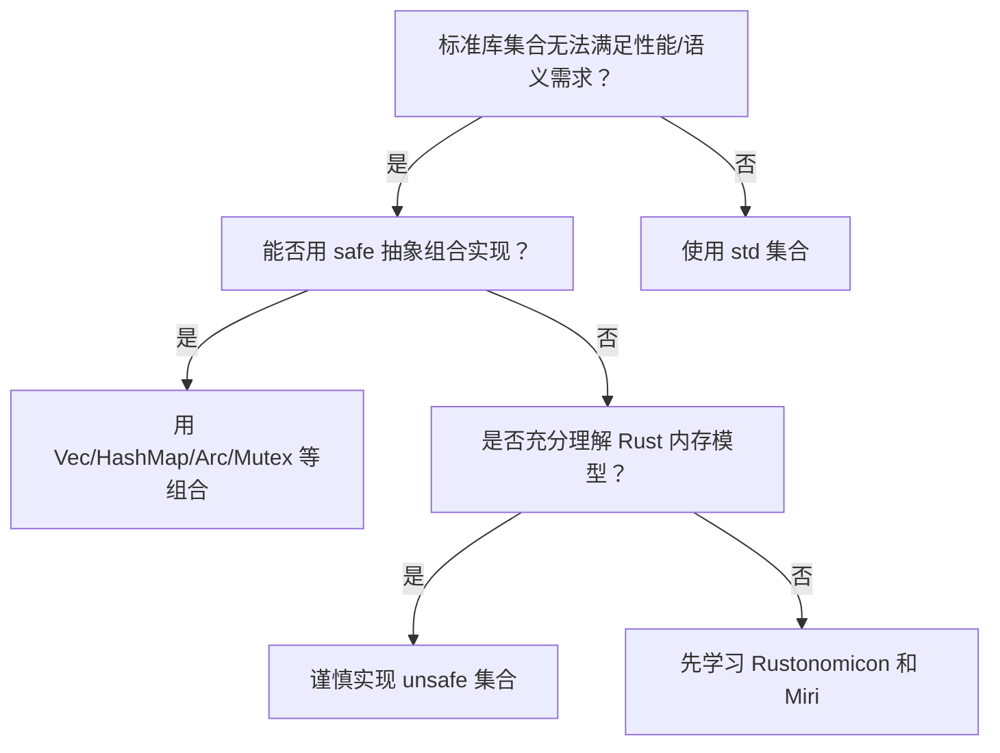

> **内容分级**: [专家级]
> **Rust 版本**: 1.97.0+ (Edition 2024)
> **本节关键术语**: 未初始化内存（Uninitialized Memory） · 原始指针（Raw Pointer） · 容量（Capacity） · 长度（Length） · 布局（Layout） · Drop 检查 · 内存安全（Memory Safety）

# Unsafe 集合内部实现：Vec、Arc、Mutex（Unsafe Collections Internals）
>
> **EN**: Unsafe Collections Internals
> **Summary**: This page walks through the internal implementation patterns behind `Vec<T>`, `Arc<T>`, and `Mutex<T>`, illustrating how raw pointers, memory layout, drop semantics, and interior mutability are composed to build safe abstractions on top of unsafe primitives.
>
> **受众**: [研究者]
> **层级**: L3 高级概念
> **Bloom 层级**: L3-L5
> **A/S/P 标记**: **S** — Structure
> **双维定位**: C×Exp
> **前置概念**: [Unsafe Rust](../02_unsafe/01_unsafe.md) · [Memory Management](../../02_intermediate/02_memory_management/01_memory_management.md) · [Interior Mutability](../../02_intermediate/02_memory_management/02_interior_mutability.md)
> **后置概念**: [Custom Allocators](../06_low_level_patterns/01_custom_allocators.md) · [Type Layout](../../04_formal/05_rustc_internals/08_type_layout.md) · [Separation Logic](../../04_formal/02_separation_logic/02_separation_logic.md)
>
> **主要来源**: [The Rustonomicon — Implementing Vec](https://doc.rust-lang.org/nomicon/vec.html) ·
> [The Rustonomicon — Implementing Arc and Mutex](https://doc.rust-lang.org/nomicon/index.html) ·
> [The Rust Reference — Raw Pointers](https://doc.rust-lang.org/reference/types/pointer.html) ·
> [std::alloc](https://doc.rust-lang.org/std/alloc/index.html)
>
> **权威来源**: 本文件为 `concept/` 权威页。

---

> **变更日志**:
>
> - v1.0 (2026-07-04): 初始创建

## 📑 目录

---

- [Unsafe 集合内部实现：Vec、Arc、Mutex（Unsafe Collections Internals）](#unsafe-集合内部实现vecarcmutexunsafe-collections-internals)
  - [📑 目录](#-目录)
  - [一、权威定义（Definition）](#一权威定义definition)
    - [1.1 形式化定义](#11-形式化定义)
    - [1.2 直觉解释](#12-直觉解释)
  - [二、概念属性矩阵](#二概念属性矩阵)
  - [三、技术细节与示例](#三技术细节与示例)
    - [3.1 Vec 的核心结构](#31-vec-的核心结构)
    - [3.2 Arc 的核心结构](#32-arc-的核心结构)
    - [3.3 Mutex 的核心结构](#33-mutex-的核心结构)
  - [四、示例与反例](#四示例与反例)
    - [4.1 正确示例：手动实现 Vec 的 pop](#41-正确示例手动实现-vec-的-pop)
    - [4.2 反例：读取未初始化内存](#42-反例读取未初始化内存)
    - [4.3 反例：Arc 引用计数管理错误](#43-反例arc-引用计数管理错误)
  - [五、反命题与边界分析](#五反命题与边界分析)
    - [5.1 反命题树](#51-反命题树)
    - [5.2 边界极限](#52-边界极限)
  - [六、边界测试](#六边界测试)
    - [6.1 边界测试：Vec 的 drop](#61-边界测试vec-的-drop)
    - [6.2 边界测试：Arc 共享数据](#62-边界测试arc-共享数据)
  - [七、判断推理与决策树](#七判断推理与决策树)
    - [7.1 何时需要实现 unsafe 集合？](#71-何时需要实现-unsafe-集合)
    - [7.2 与其他概念的辨析](#72-与其他概念的辨析)
  - [八、逆向推理链（Backward Reasoning）](#八逆向推理链backward-reasoning)
  - [九、来源与延伸阅读](#九来源与延伸阅读)
  - [嵌入式测验（Embedded Quiz）](#嵌入式测验embedded-quiz)
    - [测验 1：Vec 的未初始化内存](#测验-1vec-的未初始化内存)
    - [测验 2：Arc 的内存序](#测验-2arc-的内存序)
  - [认知路径](#认知路径)
  - [国际权威参考 / International Authority References（P1 学术 · P2 生态）](#国际权威参考--international-authority-referencesp1-学术--p2-生态)

---

## 一、权威定义（Definition）

> Rust 的标准集合（`Vec<T>`、`Arc<T>`、`Mutex<T>`）是在 `unsafe` 原语之上构建的安全抽象。它们的核心挑战包括：
>
> - 如何分配和管理未初始化内存（`Vec`）。
> - 如何在共享所有权（Ownership）下安全释放资源（`Arc`）。
> - 如何在运行时（Runtime）保证互斥访问（`Mutex`）。
>
> 理解这些实现模式有助于掌握 Rust 内存模型、借用（Borrowing）检查边界以及 unsafe 代码的正确使用方式。
>
> [来源: [The Rustonomicon — Implementing Vec](https://doc.rust-lang.org/nomicon/vec.html)]

### 1.1 形式化定义

```text
Vec<T>:  ptr: *mut T, cap: usize, len: usize
Arc<T>:  ptr: *mut ArcInner<T>   where ArcInner { refcount: AtomicUsize, data: T }
Mutex<T>: inner: sys::Mutex, poison: Cell<bool>, data: UnsafeCell<T>
```

### 1.2 直觉解释

- `Vec` 像是一个有容量的“停车库”：知道有多少车位（capacity）、停了多少车（length）、车库地址在哪（pointer）。
- `Arc` 像是一个“共享图书馆借阅卡”：多个读者共享同一本书，只有最后一个读者归还时才销毁。
- `Mutex` 像是一个“单人厕所”：任何时候只有一个人能进去，其他人必须排队。

> [💡 原创分析](../../00_meta/00_framework/methodology.md)

---

## 二、概念属性矩阵

| 组件 | 核心 unsafe 原语 | 安全不变式 | 权威来源 |
|:---|:---|:---|:---|
| `Vec<T>` | `*mut T`, `alloc::alloc`, `ptr::read/write` | `len <= cap`；`0..len` 已初始化 | Rustonomicon |
| `Arc<T>` | `*mut ArcInner<T>`, `AtomicUsize` | 引用计数 > 0 时数据有效；=0 时释放 | Rustonomicon |
| `Mutex<T>` | `UnsafeCell<T>`, OS mutex | 持锁期间才能访问数据；解锁后释放访问权 | Rustonomicon |
| Drop 语义 | `ManuallyDrop`, `ptr::drop_in_place` | 只 drop 已初始化元素 | Rustonomicon |

---

## 三、技术细节与示例

「技术细节与示例」涉及 Vec 的核心结构、Arc 的核心结构与Mutex 的核心结构，本节逐一说明其要点。

### 3.1 Vec 的核心结构

```rust
use std::alloc::{self, Layout};
use std::ptr::{self, NonNull};

struct MyVec<T> {
    ptr: NonNull<T>,
    cap: usize,
    len: usize,
}

impl<T> MyVec<T> {
    fn new() -> Self {
        Self {
            ptr: NonNull::dangling(),
            cap: 0,
            len: 0,
        }
    }

    fn push(&mut self, value: T) {
        if self.len == self.cap {
            self.grow();
        }

        unsafe {
            ptr::write(self.ptr.as_ptr().add(self.len), value);
        }
        self.len += 1;
    }

    fn grow(&mut self) {
        let (new_cap, new_layout) = if self.cap == 0 {
            (1, Layout::array::<T>(1).unwrap())
        } else {
            let new_cap = self.cap * 2;
            (new_cap, Layout::array::<T>(new_cap).unwrap())
        };

        let new_ptr = if self.cap == 0 {
            unsafe { alloc::alloc(new_layout) }
        } else {
            let old_layout = Layout::array::<T>(self.cap).unwrap();
            unsafe { alloc::realloc(self.ptr.as_ptr() as *mut u8, old_layout, new_layout.size()) }
        };

        self.ptr = NonNull::new(new_ptr as *mut T).expect("allocation failed");
        self.cap = new_cap;
    }
}
```

> **关键洞察**: `ptr::write` 用于向未初始化内存写入值；`NonNull::dangling()` 提供零容量时的有效但不可解引用的指针。
> [来源: [The Rustonomicon — Implementing Vec](https://doc.rust-lang.org/nomicon/vec.html)]

### 3.2 Arc 的核心结构

```rust
use std::sync::atomic::{AtomicUsize, Ordering};
use std::ptr::NonNull;

struct ArcInner<T> {
    refcount: AtomicUsize,
    data: T,
}

struct MyArc<T> {
    ptr: NonNull<ArcInner<T>>,
}

impl<T> Clone for MyArc<T> {
    fn clone(&self) -> Self {
        unsafe {
            self.ptr.as_ref().refcount.fetch_add(1, Ordering::Relaxed);
        }
        Self { ptr: self.ptr }
    }
}

impl<T> Drop for MyArc<T> {
    fn drop(&mut self) {
        unsafe {
            if self.ptr.as_ref().refcount.fetch_sub(1, Ordering::Release) == 1 {
                // 最后一个引用：释放内存
                let _ = Box::from_raw(self.ptr.as_ptr());
            }
        }
    }
}
```

> **关键洞察**: `Arc` 使用原子引用计数管理共享所有权（Ownership）。`Release`/`Acquire` 内存序保证 drop 时能看到之前所有对数据的写入。
> [来源: [The Rustonomicon — Arc and Mutex](https://doc.rust-lang.org/nomicon/index.html)]

### 3.3 Mutex 的核心结构

```rust
use std::cell::UnsafeCell;
use std::sync::{Mutex, LockResult, Guard};

// 简化概念：Mutex<T> 内部使用 UnsafeCell<T> 包裹数据
// 实际标准库使用 OS 原语保证互斥
struct MyMutex<T> {
    data: UnsafeCell<T>,
}

unsafe impl<T: Send> Send for MyMutex<T> {}
unsafe impl<T: Send> Sync for MyMutex<T> {}

impl<T> MyMutex<T> {
    fn new(data: T) -> Self {
        Self { data: UnsafeCell::new(data) }
    }

    fn lock(&self) -> &mut T {
        // 实际实现会调用 OS mutex，这里仅示意
        unsafe { &mut *self.data.get() }
    }
}
```

> **关键洞察**: `Mutex<T>` 是 `Sync` 的（当 `T: Send`），因为它通过锁保证每次只有一个线程访问 `T`。`UnsafeCell` 是内部可变性的基础原语。
> [来源: [The Rustonomicon — Arc and Mutex](https://doc.rust-lang.org/nomicon/index.html)]

---

## 四、示例与反例

本节从正确示例：手动实现 Vec 的 pop、反例：读取未初始化内存与反例：Arc 引用计数管理错误切入，剖析「示例与反例」的核心内容。

### 4.1 正确示例：手动实现 Vec 的 pop

```rust
impl<T> MyVec<T> {
    fn pop(&mut self) -> Option<T> {
        if self.len == 0 {
            return None;
        }
        self.len -= 1;
        unsafe {
            Some(ptr::read(self.ptr.as_ptr().add(self.len)))
        }
    }
}
```

> **关键洞察**: `pop` 通过 `ptr::read` 移动出最后一个元素，然后减少 `len`。旧位置被视为未初始化，不会被 drop。
> [来源: [The Rustonomicon — Vec Pop](https://doc.rust-lang.org/nomicon/vec.html)]

### 4.2 反例：读取未初始化内存

```rust,compile_fail
use std::alloc::{alloc, Layout};
use std::ptr;

fn main() {
    unsafe {
        let layout = Layout::new::<i32>();
        let ptr = alloc(layout) as *mut i32;
        // UB：读取未初始化内存
        println!("{}", ptr::read(ptr));
    }
}
```

> **错误诊断**: 代码可编译，但运行时（Runtime）行为未定义。
> **修正**: 使用 `ptr::write` 初始化后再读取。
> [来源: [Unsafe Code Guidelines — Validity of References](https://rust-lang.github.io/unsafe-code-guidelines/)]

### 4.3 反例：Arc 引用计数管理错误

```rust,compile_fail
use std::sync::atomic::{AtomicUsize, Ordering};

struct BadArc<T> {
    ptr: *const T,
    refcount: *const AtomicUsize,
}

impl<T> Clone for BadArc<T> {
    fn clone(&self) -> Self {
        // 错误：没有增加引用计数
        Self { ptr: self.ptr, refcount: self.refcount }
    }
}
```

> **错误诊断**: 代码可编译，但会导致 use-after-free 或 double free。
> **修正**: 每次 clone 必须原子地增加引用计数；drop 时仅在计数归零时释放。
> [来源: [The Rustonomicon — Arc](https://doc.rust-lang.org/nomicon/index.html)]

---

## 五、反命题与边界分析

本节从反命题树 与 边界极限 两个层面剖析「反命题与边界分析」。

### 5.1 反命题树

> **反命题 1**: "实现 Vec 只需要普通引用" ⟹ 不成立。未初始化内存无法通过 safe 引用表达，必须使用原始指针（Raw Pointer）。
> **反命题 2**: "Arc 的引用计数可以用普通 `usize`" ⟹ 不成立。多线程共享需要 `AtomicUsize` 和正确的内存序。
> **反命题 3**: "Mutex 可以不使用 unsafe" ⟹ 不成立。`Mutex` 内部必须使用 `UnsafeCell` 打破借用（Borrowing）规则。
> **反命题 4**: "unsafe 集合的实现不需要考虑 Drop" ⟹ 不成立。必须精确追踪哪些元素已初始化，避免 double drop 或 leak。

### 5.2 边界极限

| 边界 | 现状 | 理论极限 | 工程意义 |
|:---|:---|:---|:---|
| 未初始化内存 | 手动管理 | 完全安全抽象 | Vec 提供安全接口 |
| 原子引用计数 | `AtomicUsize` | 无锁/分布式回收 | Arc 适合共享只读/少写数据 |
| 运行时互斥 | OS mutex | 无锁算法 | Mutex 有上下文切换开销 |
| Drop 顺序 | 精确控制 | 编译器自动 | unsafe 代码需手动 drop |

---

## 六、边界测试

本节从边界测试：Vec 的 drop 与 边界测试：Arc 共享数据 两个层面剖析「边界测试」。

### 6.1 边界测试：Vec 的 drop

```rust
struct LoudDrop(i32);

impl Drop for LoudDrop {
    fn drop(&mut self) {
        println!("dropping {}", self.0);
    }
}

fn main() {
    let mut v = Vec::new();
    v.push(LoudDrop(1));
    v.push(LoudDrop(2));
    v.pop(); // 只 drop 2
    // v 离开作用域时 drop 1
}
```

### 6.2 边界测试：Arc 共享数据

```rust
use std::sync::Arc;
use std::thread;

fn main() {
    let data = Arc::new(vec![1, 2, 3]);
    let mut handles = vec![];

    for _ in 0..3 {
        let d = Arc::clone(&data);
        handles.push(thread::spawn(move || {
            println!("{:?}", d);
        }));
    }

    for h in handles {
        h.join().unwrap();
    }
}
```

---

## 七、判断推理与决策树

本节从何时需要实现 unsafe 集合？ 与 与其他概念的辨析 两个层面剖析「判断推理与决策树」。

### 7.1 何时需要实现 unsafe 集合？



> **学习资源**: 若对 Rust 内存模型尚不熟悉，建议先阅读 [The Rustonomicon](https://doc.rust-lang.org/nomicon/index.html) 并使用 [Miri](https://github.com/rust-lang/miri) 验证 unsafe 代码。

### 7.2 与其他概念的辨析

| 场景 | 推荐选择 | 不推荐 | 理由 |
|:---|:---|:---|:---|
| 动态数组 | `Vec<T>` | 手写 raw pointer Vec | 标准库已高度优化 |
| 共享只读数据 | `Arc<T>` | `Rc<T>` 跨线程 | `Arc` 是线程安全的 |
| 共享可变数据 | `Arc<Mutex<T>>` | `Arc<RefCell<T>>` 跨线程 | `RefCell` 不是 `Sync` |
| 单线程共享 | `Rc<RefCell<T>>` | `Arc<Mutex<T>>` | 避免原子操作（Atomic Operations）开销 |

---

## 八、逆向推理链（Backward Reasoning）

> **从编译错误/运行时症状反推定理链**:
>
> ```text
> Miri 报告 UB ⟸ 未初始化内存被读取/double drop/使用已释放内存 ⟸ 检查 ptr::write/read/drop_in_place 使用
> 运行时 segfault ⟸ 指针算术或布局计算错误 ⟸ 验证 Layout::array 和 offset 计算
> 数据竞争 ⟸ Arc 引用计数未原子更新或 Mutex 未正确加锁 ⟸ 使用 AtomicUsize/Acquire-Release/Gatekeeper
> 内存泄漏 ⟸ Drop 实现未释放底层分配 ⟸ 确保 drop 路径释放 ptr 指向的内存
> ```
>
> **诊断映射**:
>
> - `error[E0133]: ... is unsafe and requires unsafe function or block` → 需要 `unsafe` 块。
> - Miri `Undefined Behavior` → unsafe 代码违反内存模型。
> - 数据竞争检测失败 → 缺少同步原语或内存序错误。

---

## 九、来源与延伸阅读

- [The Rustonomicon — Implementing Vec](https://doc.rust-lang.org/nomicon/vec.html)
- [The Rustonomicon — Implementing Arc and Mutex](https://doc.rust-lang.org/nomicon/index.html)
- [The Rust Reference — Raw Pointers](https://doc.rust-lang.org/reference/types/pointer.html)
- [std::alloc](https://doc.rust-lang.org/std/alloc/index.html)
- [Unsafe Code Guidelines](https://rust-lang.github.io/unsafe-code-guidelines/)

---

## 嵌入式测验（Embedded Quiz）

「嵌入式测验（Embedded Quiz）」部分包含测验 1：Vec 的未初始化内存 与 测验 2：Arc 的内存序 两条主线，本节依次说明。

### 测验 1：Vec 的未初始化内存

**题目**: 在自定义 Vec 的 `push` 方法中，为什么使用 `ptr::write` 而不是赋值操作 `*ptr = value`？

A. `ptr::write` 更快
B. `*ptr = value` 会先 drop 旧值，但内存未初始化
C. `ptr::write` 可以绕过借用检查
D. 没有区别

<details>
<summary>✅ 答案与解析</summary>

**答案**: B

**解析**: 未初始化内存中没有有效值，使用 `*ptr = value` 会先尝试 drop 旧值，导致 UB。`ptr::write` 直接写入字节，不读取或 drop 目标位置。

</details>

### 测验 2：Arc 的内存序

**题目**: `Arc` 在 drop 时通常使用哪种内存序递减引用计数？

A. `Ordering::Relaxed`
B. `Ordering::Acquire`
C. `Ordering::Release`
D. `Ordering::SeqCst`

<details>
<summary>✅ 答案与解析</summary>

**答案**: C

**解析**: `Arc` 通常使用 `Release` 递减引用计数，确保此前对共享数据的所有写入在内存释放前对其他线程可见。若计数归零后需要访问数据，还需 `Acquire`  fence。

</details>

---

## 认知路径

> **认知路径**: 本节从“标准集合如何工作”的好奇出发，剖析 Vec、Arc、Mutex 的内部实现模式，理解 raw pointer、内存布局、引用计数、内部可变性等 unsafe 原语如何组合成安全抽象，最终形成评估和实现 unsafe 代码的能力。
>
> 1. **问题识别**: 标准集合如何在 unsafe 之上保证安全？
> 2. **概念建立**: Vec 管理未初始化内存；Arc 管理共享所有权；Mutex 管理运行时互斥。
> 3. **机制推理**: 原始指针（Raw Pointer）、Layout、Drop 语义、原子操作（Atomic Operations）、内存序。
> 4. **边界辨析**: safe 抽象与 unsafe 实现的边界；何时需要手写 unsafe 集合。
> 5. **迁移应用**: 使用 Miri 验证 unsafe 代码；在必要时实现自定义集合。

---

> **权威来源**: [The Rustonomicon](https://doc.rust-lang.org/nomicon/index.html), [The Rust Reference](https://doc.rust-lang.org/reference/introduction.html), [Unsafe Code Guidelines](https://rust-lang.github.io/unsafe-code-guidelines/)
> **权威来源对齐变更日志**: 2026-07-04 创建 来源: [Rustonomicon Vec/Arc/Mutex 章节对齐](https://doc.rust-lang.org/nomicon/index.html)
> **状态**: ✅ 权威来源对齐完成

---

## 国际权威参考 / International Authority References（P1 学术 · P2 生态）

> 依据 `AGENTS.md` §2「对齐网络国际化权威内容」补充：仅追加已验证可达的权威链接，不改动正文事实。

- **P1 学术/形式化**: [RustBelt: Securing the Foundations of the Rust Programming Language (POPL 2018)](https://dl.acm.org/doi/10.1145/3158154) · [Oxide: The Essence of Rust (arXiv:1903.00982)](https://arxiv.org/abs/1903.00982)
- **P2 生态/社区**: [docs.rs/libc — 生态权威 API 文档](https://docs.rs/libc) · [docs.rs/nix — 生态权威 API 文档](https://docs.rs/nix)
